# コペン専用カーナビ ハードウェア設計書

## 目次
- [1. 概要](#sec-1)
- [2. システム構成](#sec-2)
  - [2.1 ハードウェア構成図](#sec-21)
- [3. ハードウェア要件に関わる機能](#sec-3)
- [4. 各ブロック設計](#sec-4)
  - [4.1 電源構成](#sec-41)
    - [4.1.1 車体側電源](#sec-411)
    - [4.1.2 12V共通入力保護](#sec-412)
    - [4.1.3 共通5V電源系](#sec-413)
      - [4.1.3.1 5V保護・安定化回路設計](#sec-4131)
    - [4.1.4 常時待機系](#sec-414)
      - [4.1.4.1 共通車体12V信号入力回路](#sec-4141)
      - [4.1.4.2 ACC入力保護回路設計](#sec-4142)
      - [4.1.4.3 Raspberry Pi Pico 電源制御フロー](#sec-4143)
      - [4.1.4.4 Raspberry Pi Pico GPIO対応表(電源関係)](#sec-4144)
    - [4.1.5 メイン制御系](#sec-415)
      - [4.1.5.1 起動時の内部処理](#sec-4151)
      - [4.1.5.2 シャットダウン時の内部処理](#sec-4152)
      - [4.1.5.3 Raspberry Pi 5 GPIO対応表(電源関係)](#sec-4153)
    - [4.1.6 オーディオ系](#sec-416)
      - [4.1.6.1 12Vオーディオ電源保護回路設計](#sec-4161)
  - [4.2 制御・入出力系](#sec-42)
    - [4.2.1 GPIO対応表](#sec-421)
    - [4.2.2 バックカメラ表示制御](#sec-422)
      - [4.2.2.1 バックランプ入力保護回路設計](#sec-4221)
    - [4.2.3 ドアロック制御](#sec-423)
      - [4.2.3.1 ドアロック制御 保護・駆動回路設計](#sec-4231)
    - [4.2.4 車両情報取得（OBD2）](#sec-424)
  - [4.3 オーディオ系](#sec-43)
    - [4.3.1 USB DAC接続詳細](#sec-431)
    - [4.3.2 USBマイク接続詳細](#sec-432)
  - [4.4 周辺機器系](#sec-44)
    - [4.4.1 映像・入力](#sec-441)
    - [4.4.2 カメラ](#sec-442)
    - [4.4.3 センサー](#sec-443)
      - [4.4.3.1 IMU接続詳細](#sec-4431)
      - [4.4.3.2 タイヤ空気圧センサー](#sec-4432)
    - [4.4.4 冷却](#sec-444)
      - [4.4.4.1 冷却ファン回路図](#sec-4441)
  - [4.5 サブ制御・入出力系](#sec-45)
  - [4.6 サブコン周辺機器系](#sec-46)
- [5. 録画仕様](#sec-5)
- [6. 操作・表示機能](#sec-6)
- [7. 今後の拡張検討](#sec-7)

<a id="sec-1"></a>
## 1. 概要
本設計書は、コペン専用に開発する自作カーナビシステムのハードウェア設計について記載します。
本設計書では、Raspberry Pi 5をベースとしたハードウェア構成を前提とします。

<a id="sec-2"></a>
## 2. システム構成

本章では、コペン専用カーナビシステムを構成する主要なハードウェアブロックと、それぞれの接続関係を示す。車体側電源、電源管理、Raspberry Pi 5、表示・入力、カメラ、センサー、冷却、オーディオの全体像を整理し、後続章で各ブロックの詳細を説明する。

<a id="sec-21"></a>
### 2.1 ハードウェア構成図

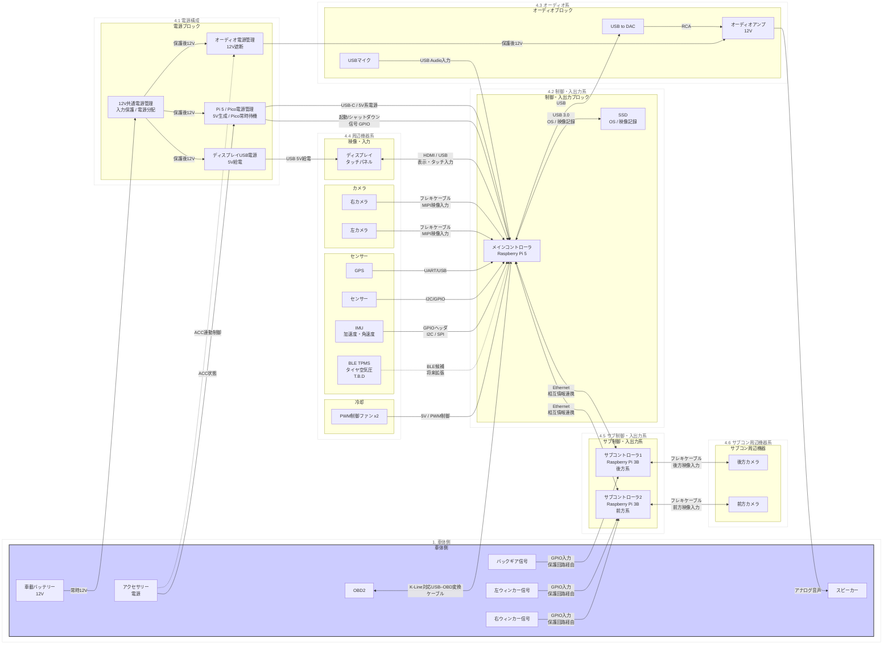

- ハードウェア構成
  - Raspberry Pi 5
  - SSD（メインコントローラに接続し、OS起動領域と映像記録領域として使用する）
  - Raspberry Pi Pico（電源管理用）
  - Raspberry Pi 3B（サブコントローラ1、後方系。後方カメラとバックギア信号を扱い、Raspberry Pi 5とEthernetケーブルで接続する）
  - Raspberry Pi 3B（サブコントローラ2、前方系。前方カメラと左右ウィンカー信号を扱い、Raspberry Pi 5とEthernetケーブルで接続する）
  - タッチパネルディスプレイ（映像はHDMI、タッチ入力と電源はUSB）
  - USBマイク（USB Audio Class対応。Raspberry Pi 5へUSB接続し、音声入力に使用）
  - PWM制御ファン x2（Raspberry Pi 5 から 5V 電源と PWM 制御信号を取得）
  - GPSモジュール
  - IMU（加速度・角速度センサー。Raspberry Pi 5のGPIOヘッダへI2CまたはSPIで接続）
  - BLE TPMS（タイヤ空気圧・タイヤ温度取得候補。現時点ではT.B.D）
  - バックギア信号（入力保護回路経由でRaspberry Pi 3BのGPIOへ入力し、Raspberry Pi 5へはEthernetで状態連携する）
  - 左右ウィンカー信号（入力保護回路経由でサブコントローラ2のGPIOへ入力し、Raspberry Pi 5へはEthernetで状態連携する）
  - OBD2（K-Line対応USB–OBD変換ケーブルでRaspberry Pi 5のUSBへ接続）
  - 12V共通電源管理（入力保護、電源分配）
  - Pi 5 / Pico電源管理（Raspberry Pi 5へのUSB-C給電、Picoの常時待機）
  - オーディオ電源管理（ACC連動リレーによる12V電源遮断）
  - カーオーディオアンプ
  - 前方カメラ（サブコントローラ2へフレキケーブル接続）
  - 右カメラ（Raspberry Pi 5標準のフレキケーブル用MIPIソケットへ接続）
  - 左カメラ（Raspberry Pi 5標準のフレキケーブル用MIPIソケットへ接続）
  - 後方カメラ（サブコントローラ1へフレキケーブル接続）
  - 電源（車載バッテリー12Vを共通電源管理へ通し、Pi 5系、ディスプレイ系、オーディオ系へ分配）

<a id="sec-3"></a>
## 3. ハードウェア要件に関わる機能

本章では、ハードウェア構成、電源、配線、入出力設計に直接影響する機能を記載する。アプリケーション寄りの機能一覧は、[付録1: アプリ機能一覧](付録1_アプリ機能一覧.md)を参照する。

| 機能 | ハードウェア設計上の要点 |
| --- | --- |
| GPS連携 | GPSモジュールをUSBまたはUARTで接続し、現在地表示や録画データへの位置情報付加に利用する |
| タッチパネル入力 | HDMI表示とUSBタッチ入力を組み合わせ、カーナビ操作用の入出力を構成する |
| 前後カメラ録画 | 前方・後方カメラを接続し、メインコントローラ側SSDへ録画データを保存する |
| USB DAC音声出力 | Raspberry Pi 5からUSB DACへ音声を出力し、オーディオアンプへアナログ音声を渡す |
| Bluetooth音源入力 | スマートフォンからのBluetooth音源をRaspberry Pi 5で受信し、USB DAC経由で再生する |
| PWMファン制御 | Raspberry Pi 5の温度に応じてPWMファンを制御し、ケース内の廃熱を行う |
| ACC連動制御 | ACC電源のON/OFFをPicoで監視し、Raspberry Pi 5の起動はJ2電源ボタン端子の短時間短絡1回、シャットダウンは短時間短絡2回で行う |

<a id="sec-4"></a>
## 4. 各ブロック設計

<a id="sec-41"></a>
### 4.1 電源構成

本カーナビシステムの電源構成は、車載バッテリーから直接12V電源を引き込み、これを適切に制御・変換することで、安定したシステム運用を実現する設計となっています。

以下に、車体側電源からカーナビ内部の共通5V電源系、常時待機系、メイン制御系、オーディオ系までの電源配線と制御信号の構成を示します。

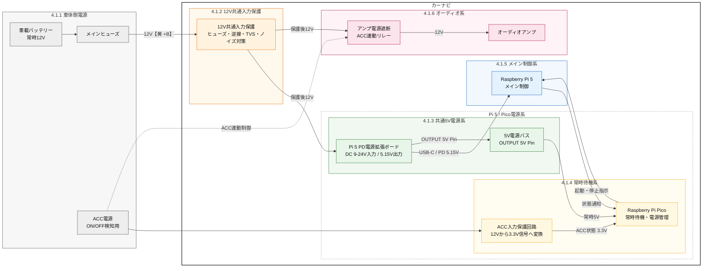

図の色分けは以下を表す。

- グレー: 車体側電源
- オレンジ: 12V共通入力保護
- グリーン: 共通5V電源系
- イエロー: 常時待機系
- ブルー: メイン制御系
- ピンク: オーディオ電源系

アンプ電源遮断はACC連動リレーで行う。図中の破線は12V電源配線ではなく、ACC信号によってリレーをON/OFFする制御経路を表す。リレーコイルをACC配線へ接続する場合も、コイル電流、フライバックダイオード、ヒューズ、GND経路を確認し、ACC信号線へ過大な負荷をかけない。

<a id="sec-411"></a>
#### 4.1.1 車体側電源

車体側電源は、カーナビへ供給する常時12V電源と、起動・シャットダウンの判定に使用するACC電源で構成する。

| 項目 | 内容 |
| --- | --- |
| 車載バッテリー | カーナビ内部の12V共通入力保護、Pi 5 PD電源拡張ボードおよびオーディオアンプへ12Vを供給する |
| ヒューズ | バッテリー直後に配置し、短絡や過電流から配線を保護する |
| ACC電源 | PicoがON/OFF状態を監視し、Pi 5の起動・シャットダウン判断に使用する |

ACC電源は信号入力として扱い、PicoのGPIOへ直接接続しない。必ずカーナビ内部のACC入力保護回路を通して3.3V系の信号へ変換する。

<a id="sec-412"></a>
#### 4.1.2 12V共通入力保護

12V共通入力保護は、車載バッテリーからカーナビ内部へ取り込んだ常時12Vを、Pi 5 PD電源拡張ボードおよびオーディオ系へ分岐する前に保護・安定化するためのブロックである。

本ブロックでは、Pi 5系とオーディオ系で共通して必要となる入力ヒューズ、逆接続保護、サージ保護、ノイズ低減、入力平滑をまとめて扱う。アンプ分岐後の大電流保護や音声ノイズ対策は、[4.1.6.1 12Vオーディオ電源保護回路設計](#4161-12vオーディオ電源保護回路設計)で追加する。

各部品の端子ごとの詳細な接続先は、[付録3: 12V共通入力保護 接続図](付録3_12V共通入力保護接続図.md)を参照する。

| 構成要素 | 目的 | 配置 | 推奨値・定格の目安 |
| --- | --- | --- | --- |
| F1 入力ヒューズ | カーナビ内部の12V主配線を短絡・過電流から保護する | 車載バッテリー引き込み直後、またはカーナビ筐体入口 | Pi 5系とアンプ系の合計電流、配線許容電流に合わせる。初期検討は10A-15A級 |
| Q1 逆接続保護MOSFET | バッテリー逆接続時に後段回路へ逆電圧が入ることを防ぐ | F1後段、TVSとフィルタの前段 | PチャネルMOSFET方式。60V以上、連続電流は想定電流以上、低Rds(on)品 |
| D1 12V用TVS | ロードダンプや瞬間的なサージをGNDへ逃がす | Q1後段、12V-GND間 | 18V系TVS、ピークパルス1500W級を目安 |
| FL1 DCノイズフィルタ | オルタネーターノイズや高周波ノイズを低減する | D1後段、分岐前の12Vライン | 25V以上、定格電流は合計電流以上、低DCR品。BNX016-01等を候補 |
| C1 入力電解コンデンサ | 瞬断や負荷変動時の12Vライン電圧低下を緩和する | FL1後段、分岐前12Vノード近傍 | 1000uF程度、25V以上、105℃、低ESR品 |
| C2 入力セラミックコンデンサ | 高周波ノイズをGNDへ逃がす | C1と並列、分岐前12Vノード近傍 | 0.1uF + 1uF程度、25V以上、X7R系 |
| 12V分岐ノード | 保護後12Vを各系統へ分配する | C1/C2後段 | Pi 5 PD電源拡張ボード入力、オーディオ分岐保護へ接続する |

回路構成は以下を基本とする。

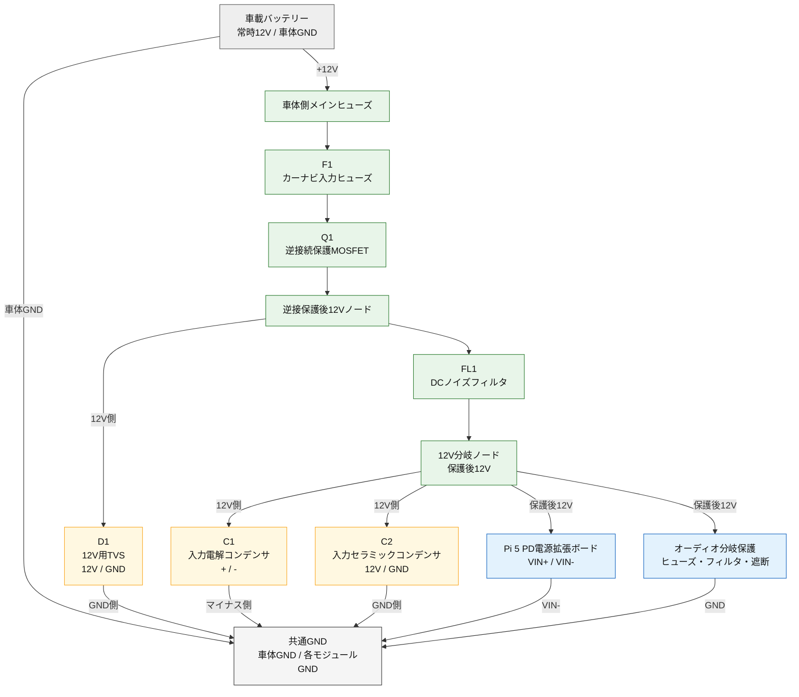

入力電圧とGNDを上から下へ追うための回路模式図を以下に示す。

```text
                    車載バッテリー +12V
                              |
                       車体側メインヒューズ
                              |
                         F1 入力ヒューズ
                              |
                     Q1 逆接続保護MOSFET
                              |
        逆接保護後12V  o--+--[ D1 12V TVS ]--------+
                              |    K:12V / A:GND    |
                         FL1 DCノイズフィルタ       |
                              |                     |
          12V分岐ノード o--+--[+ C1 電解 -]--------+
                              |                     |
                              +--[ C2 セラミック ]--+
                              |                     |
                 +------------+-------------+       |
                 |                          |       |
      Pi 5 PD電源拡張ボード VIN+     オーディオ分岐保護
                 |                          |       |
      Pi 5 PD電源拡張ボード VIN-     オーディオGND
                 |                          |       |
                 +------------+-------------+-------+
                              |
                    車体GND / 共通GND
```

`o`は配線の分岐点を表す。D1は逆接続保護後の12Vノードと共通GNDの間に並列接続する。C1とC2はDCノイズフィルタ後段の12V分岐ノードと共通GNDの間に並列接続し、Pi 5 PD電源拡張ボードとオーディオ分岐へ渡す前の12Vラインを安定化する。

単方向TVSを使用する場合は、D1のカソードを12V側、アノードをGND側へ接続する。電解コンデンサC1は、プラス端子を12V分岐ノード側、マイナス端子を共通GND側へ接続する。

Q1にPチャネルMOSFETを使用する場合は、単体部品を直列に入れるだけではなく、逆接続保護回路としてソース、ドレイン、ゲートを正しく配線する。ゲート-ソース間の保護、ゲート抵抗、ゲートを基準電位へ落とす抵抗は、採用するMOSFETと回路方式に合わせて設計する。

設計上の注意点は以下とする。

- 12V共通入力保護は、Pi 5系とオーディオ系の両方へ供給されるため、合計電流に耐える部品と配線を選定する。
- F1は部品保護ではなく配線保護を主目的とし、ヒューズ定格は配線許容電流を超えない範囲で選定する。
- Q1は電圧降下と発熱を抑えるためMOSFET方式を基本とする。試作時も発熱を実測する。
- D1は大きなサージ電流をGNDへ逃がすため、GND配線は短く太くし、F1と組み合わせて保護が成立する配置にする。
- FL1は定格電流、直流抵抗、発熱を確認する。Pi 5起動時やアンプ動作時に電圧降下が大きい場合は、より低抵抗のフィルタまたは系統別フィルタを検討する。
- C1とC2は12V分岐ノード近傍へ配置し、長い配線の先ではなく保護回路基板または分岐点近くに実装する。
- オーディオ系の大電流変動や音声ノイズがPi 5系へ回り込む場合は、12V共通入力保護後にPi 5系とオーディオ系でフィルタを分ける。

<a id="sec-413"></a>
#### 4.1.3 共通5V電源系

共通5V電源系は、車載バッテリーの12Vを12V共通入力保護へ通した後、Raspberry Pi 5用のPD電源拡張ボードへ入力し、Raspberry Pi 5とRaspberry Pi Picoへ5V系電源を供給する。

| 項目 | 内容 |
| --- | --- |
| 12V共通入力保護 | 車載12VをPi 5 PD電源拡張ボードおよびオーディオ系へ分配する前に、過電流、逆接続、サージ、ノイズから保護する |
| Pi 5 PD電源拡張ボード | DC 9V-24V入力を受け、Raspberry Pi 5へ5.15V/5A系の電源を供給する |
| 5V電源バス | PD電源拡張ボードの5V VBUS出力をPicoなどの小電流系へ分配する |

Raspberry Pi 5の主電源は、PD電源拡張ボードからPi 5へ直接供給する。Picoは同ボードの5V VBUS出力から常時給電する。車載12Vはノイズやサージを含むため、Pi 5系とオーディオ系へ分岐する前に12V共通入力保護を配置する。12V共通入力保護の詳細は[4.1.2 12V共通入力保護](#412-12v共通入力保護)に示す。部品選定の詳細は、[付録2: 保護・安定化用部品](付録2_保護安定化部品.md)を参照する。

<a id="sec-4131"></a>
##### 4.1.3.1 5V保護・安定化回路設計

本項では、12V共通入力保護後の保護後12VをPi 5 PD電源拡張ボードへ入力し、Raspberry Pi 5とRaspberry Pi Picoへ5V系電源を供給する構成を示す。入力ヒューズ、逆接続保護、12V側TVS、12V共通ノイズフィルタ、12V入力平滑は[4.1.2 12V共通入力保護](#412-12v共通入力保護)で扱うため、本項では重複して記載しない。

使用候補は、GeeekPi / 52Pi系のRaspberry Pi 5用PD電源拡張ボードとする。52Pi公式仕様では、DC入力は9V-24V、USB-C出力は5V/8A Max、USB PD 3.0出力は5.15V@5A、5V VBUS出力を備える。本設計では、Raspberry Pi 5本体はPD電源拡張ボードのUSB Type-C出力から給電し、Raspberry Pi Picoは同ボードのOUTPUT 5V Pinから常時給電する。

| 構成要素 | 目的 | 配置 | 推奨値・定格の目安 |
| --- | --- | --- | --- |
| 12V共通入力保護後ノード | Pi 5系へ入力する保護後12Vを受ける | 4.1.2の12V分岐ノードからU1 VIN+へ接続 | 12V共通入力保護でヒューズ、逆接、TVS、ノイズ、入力平滑を実施済みとする |
| U1 Pi 5 PD電源拡張ボード | 12V入力からPi 5向け5.15V系電源を生成する | 12V共通入力保護後ノードの後段 | DC入力9V-24V、Pi 5出力5.15V@5A相当、OUTPUT 5V Pinを使用する |
| USB Type-Cケーブル | U1からPi 5へ主電源を供給する | U1 USB Type-C出力とRaspberry Pi 5 USB Type-C電源入力間 | 5A対応品を使用する。細いケーブルや充電専用品は電圧降下に注意する |
| F2 Pico用ポリヒューズ | Pico側5V分岐の短絡・過電流を保護する | U1のOUTPUT 5V PinからPicoへ向かう配線 | 保持電流0.5A-1A程度。Pico単体と周辺小電流負荷に合わせる |
| C3 Pico側コンデンサ | Pico入力近傍の電源変動と高周波ノイズを抑える | Pico VSYS / VBUS入力近傍 | 10uF-47uF + 0.1uF、耐圧10V以上 |

回路構成は以下を基本とする。

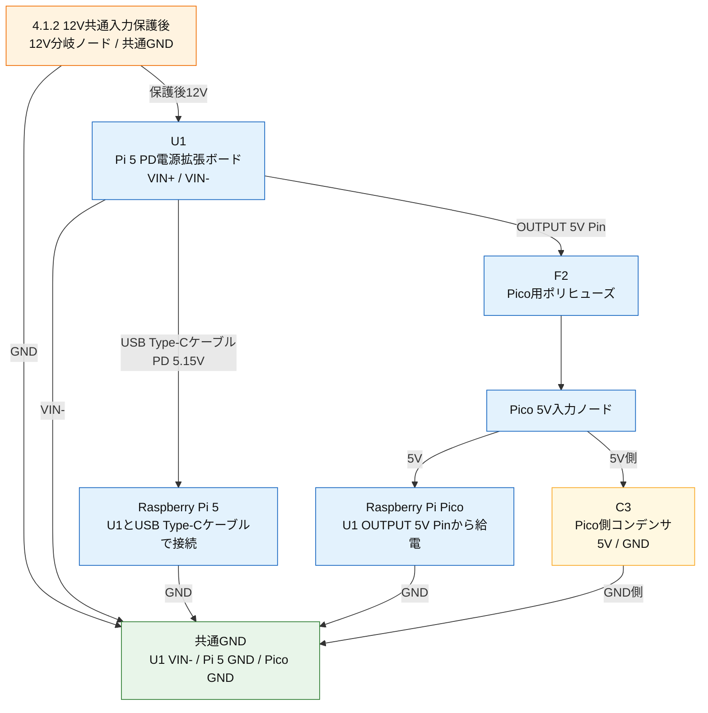

入力電圧とGNDを上から下へ追うための配線模式図を以下に示す。

```text
        4.1.2 12V共通入力保護後 12V分岐ノード
                              |
                     U1 VIN+（Pi 5 PD電源拡張ボード）
                              |
                  +-----------+-----------+
                  |                       |
        USB Type-Cケーブル           OUTPUT 5V Pin
        PD 5.15V出力                 5V出力
                  |                       |
          Raspberry Pi 5             F2 Pico用
                  |                  ポリヒューズ
                  |                       |
                  |                 Pico 5V入力 o---[ C3 ]---+
                  |                       |                  |
               Pi 5 GND               Pico GND              |
                  |                       |                  |
                  +-----------+-----------+------------------+
                              |
                    U1 VIN- / 共通GND
```

`o`は配線の分岐点を表す。C3はPico側5Vラインと共通GNDの間に並列接続する。U1へ入力する12V側のヒューズ、逆接続保護、TVS、DCノイズフィルタ、12Vライン用コンデンサは4.1.2で扱う。

図は上から下へ読み、最上段を12V共通入力保護後の12V分岐ノード、最下段を共通GNDとする。Pi 5への主電源はU1とRaspberry Pi 5をUSB Type-Cケーブルで接続して供給する。Picoへの常時電源は、U1のOUTPUT 5V PinからF2を介して分岐する。

| 記号 | 部品 | 役割 |
| --- | --- | --- |
| U1 | Pi 5 PD電源拡張ボード | USB Type-CケーブルでPi 5へ5.15V@5A相当の電源を供給し、OUTPUT 5V PinからPico用5Vを供給する |
| F2 | Pico用ポリヒューズ | Pico側5V分岐の短絡・過電流を保護する |
| C3 | Pico側コンデンサ | Pico入力近傍の5V電源を安定化する |

設計上の注意点は以下とする。

- Raspberry Pi 5本体への主電源は、U1とPi 5をUSB Type-Cケーブルで接続して供給する。Pi 5の5Vピンへ直接大電流を入れる構成は基本案から外す。
- PicoはU1のOUTPUT 5V Pinから常時給電する。Pico側には小電流用のF2とC3を追加し、Pico側の短絡がPi 5主電源へ影響しにくい構成にする。
- U1のVIN-、Pi 5のGND、PicoのGND、ACC入力保護回路のGNDは共通基準として接続する。ただし大電流のPi 5電源配線とGPIO信号GNDは、できるだけ一点に近い場所で合流させ、ノイズの回り込みを抑える。
- Pi 5起動時、USB機器接続時、タッチパネルディスプレイのUSB給電時に低電圧警告が出ないことを実機で確認する。
- U1の発熱、U1入力電圧、USB Type-Cケーブルの電圧降下、車内高温時の動作を確認する。
- U1のAlways-ON設定は、Picoによる起動・シャットダウン制御方針と整合させる。PicoでPi 5を起動制御する場合でも、U1への12V入力は常時供給される前提とする。

<a id="sec-414"></a>
#### 4.1.4 常時待機系

常時待機系は、Raspberry Pi Picoを中心に、ACC状態の監視とRaspberry Pi 5のJ2電源ボタン端子操作、およびPi 5からの状態通知受信を行う。

| 項目 | 内容 |
| --- | --- |
| Raspberry Pi Pico | Pi 5 PD電源拡張ボードの5V VBUS出力から常時5Vを受け、電源管理用マイコンとして動作する |
| ACC入力保護 | ACC 12VをPico GPIOで扱える3.3V信号へ変換し、サージやノイズからGPIOを保護する |
| J2電源ボタン模擬 | Pi 5のJ2電源ボタン端子を短時間短絡し、起動およびシャットダウン指示を行う |
| GPIO状態通知 | Pi 5から状態通知を受信する |
| Pico本体LED | ACC状態およびPi 5起動状態を簡易表示する |

PicoはACC ONを検知した場合にPi 5のJ2電源ボタン端子を短時間1回短絡して起動指示を行い、ACC OFFを検知した場合にJ2電源ボタン端子の短時間短絡を2回繰り返してシャットダウン指示を行う。Pi 5のシャットダウン完了後も、PicoはPD電源拡張ボードの5V VBUS出力から給電され、次回ACC ONまで待機する。

常時待機系の簡易的な回路構成を以下に示す。ACC 12V信号をPicoへ直接入力せず、[4.1.4.1 共通車体12V信号入力回路](#sec-4141)を通して3.3V GPIO信号へ変換する。

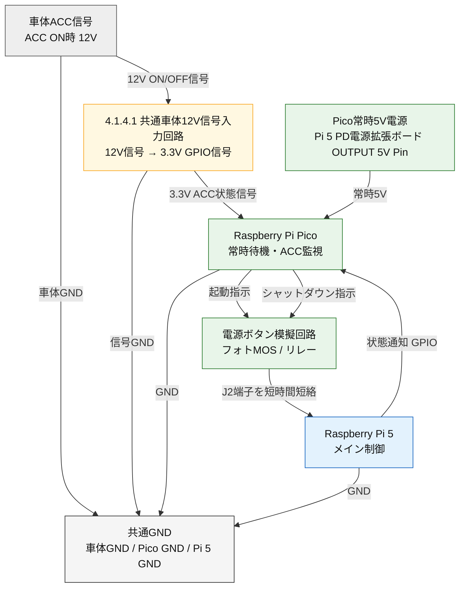


<a id="sec-4141"></a>
##### 4.1.4.1 共通車体12V信号入力回路

共通車体12V信号入力回路は、車体側の12V信号をRaspberry Pi Pico、Raspberry Pi 5、またはRaspberry Pi 3BのGPIOで安全に読み取るための共通回路である。ACC入力とバックランプ入力は、どちらも車体側12V信号をGPIOでON/OFF判定する用途であるため、本回路に統一する。

本回路では、車体側12V信号を直接分圧してGPIOへ入力せず、12V信号で小型降圧コンバーターを動作させ、その3.3V出力をGPIO判定用の信号として扱う。降圧コンバーターの出力はロジック信号の生成にのみ使用し、PicoやRaspberry Pi 5本体の電源として使用しない。

| 適用先 | 入力信号 | 出力先 | 用途 |
| --- | --- | --- | --- |
| ACC入力 | ACC 12V信号 | Raspberry Pi Pico ACC監視GPIO | ACC ON/OFF判定 |
| バックランプ入力 | バックランプ12V信号 | Raspberry Pi 3B GPIO（ピン番号T.B.D） | リバースギア投入判定 |
| 左ウィンカー入力 | 左ウィンカー12V信号 | サブコントローラ2 Raspberry Pi 3B GPIO（ピン番号T.B.D） | 左ウィンカーON/OFF判定 |
| 右ウィンカー入力 | 右ウィンカー12V信号 | サブコントローラ2 Raspberry Pi 3B GPIO（ピン番号T.B.D） | 右ウィンカーON/OFF判定 |

| 記号 | 部品 | 役割 | 推奨値・定格の目安 |
| --- | --- | --- | --- |
| F1 | ヒューズ / ポリヒューズ | 車体側信号線の短絡・異常電流を抑制する | 0.5A-1A程度。信号線と降圧コンバーター入力電流に合わせる |
| D1 | 逆接続保護ダイオード / MOSFET | 車体側配線の誤接続から後段を保護する | 電流1A以上、耐圧40V以上を目安 |
| D2 | 12V側TVS | 車載サージやスパイクをGNDへ逃がす | 18V系TVS、ピークパルス600W以上を目安 |
| C1 | 入力コンデンサ | 降圧コンバーター入力の瞬断・ノイズを抑える | 10uF-47uF、耐圧25V以上。必要に応じて0.1uFを並列追加 |
| U1 | 降圧コンバーター | 車体側12V信号をGPIO判定用の3.3V信号へ変換する | 入力範囲に12V車載信号を含むもの。出力は3.3V固定または3.3V調整 |
| R1 | GPIO電流制限抵抗 | GPIO入力へ流れ込む異常電流を抑制する | 1kΩ-4.7kΩ、1/4W以上 |
| D3 | GPIOクランプ | GPIO定格を超える過電圧から入力を保護する | 3.6V低容量TVS、または3.3V電源へのショットキークランプを検討 |
| C2 | GPIO側ノイズ除去 | 瞬間的なノイズやチャタリングをGNDへ逃がす | 0.01uF-0.1uF、10V以上、X7R系 |
| R2 | GPIOプルダウン | 信号OFF時やU1出力停止時にGPIO入力をLOWへ固定する | 47kΩ-100kΩ、1/4W以上 |

回路構成は以下を基本とする。

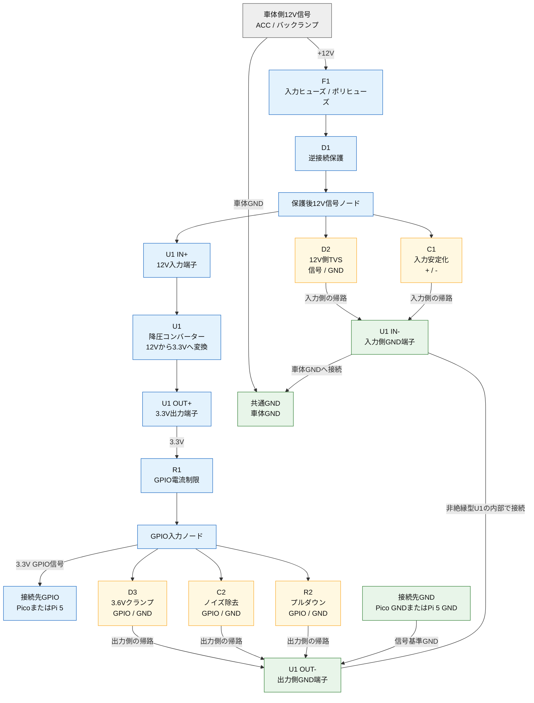

接続点と端子を回路配線に近い形式で表した模式図を以下に示す。

```text
主信号経路

  車体側12V信号（ACC / バックランプ）
      |
    [ F1 ]
      |
    [ D1 ]
      |
      o  保護後12V信号ノード
      |
  [ U1 IN+ ]
  [ U1 OUT+ : 3.3V ]
      |
    [ R1 ]
      |
      o  GPIO入力ノード
      |
  接続先GPIO（Pico GPIO / Pi 5 GPIO / Pi 3B GPIO）


入力側GNDへの接続

  保護後12V信号 ----[ D2 ]----+
  保護後12V信号 ----[ C1 ]----+---- U1 IN- ---- COMMON GND
                                                 （車体GND）


出力側GNDへの接続

  GPIO入力ノード ----[ D3 ]----+
  GPIO入力ノード ----[ C2 ]----+---- U1 OUT- ---- 接続先GND
  GPIO入力ノード ----[ R2 ]----+                 （Pico GND / Pi 5 GND）
                                      :
                                      : U1内部で接続
                                      :
                                  U1 IN-
```

設計上の注意点は以下とする。

- U1は3.3V出力に設定し、5V出力のままGPIOへ接続しない。
- U1の出力はGPIO判定用信号として扱い、PicoやRaspberry Pi 5本体の電源として使用しない。
- U1 IN-は車体GNDへ、U1 OUT-は接続先マイコンのGNDへ接続する。非絶縁型U1ではIN-とOUT-が内部で電気的に接続されるため、結果として同じ基準電位になる。
- IN-またはOUT-を未接続にすると、電流経路やGPIO信号の基準電位が成立しないため、両端子をそれぞれ接続する。
- 降圧コンバーターの入力上限を超える車載サージに備え、U1前段のF1、D1、D2、C1を省略しない。
- GPIO入力電圧が3.3Vを超えないことを実測で確認する。
- ACC入力とバックランプ入力では、ソフトウェア側の判定遅延要件が異なるため、C2の値とデバウンス時間は用途ごとに調整する。
- GND差やノイズが大きい場合は、降圧コンバーター方式ではなくフォトカプラによる絶縁入力も検討する。

<a id="sec-4142"></a>
##### 4.1.4.2 ACC入力保護回路設計

ACC入力保護回路は、車体側のACC 12V信号をRaspberry Pi PicoのGPIOで安全に読み取るために配置する。回路方式は[4.1.4.1 共通車体12V信号入力回路](#sec-4141)に統一し、ACC入力もバックランプ入力も同じ基本回路を使用する。

本項では、共通回路をACC入力へ適用するときの接続先と注意点のみを示す。

| 項目 | ACC入力での設定 |
| --- | --- |
| 入力信号 | 車体ACC 12V信号 |
| 信号変換方式 | 共通車体12V信号入力回路の降圧コンバーター方式 |
| 出力信号 | 3.3V GPIO信号 |
| 入力先 | Raspberry Pi PicoのACC監視用GPIO |
| GND基準 | 車体GNDとPico GNDを共通基準にする |

ACC入力では、降圧コンバーターの出力をPico本体の電源として使用しない。Pico本体の常時待機電源は[4.1.3 共通5V電源系](#413-共通5v電源系)から供給し、ACC入力回路はACC ON/OFFを示すロジック信号の生成だけに使用する。

設計上の注意点は以下とする。

- ACC入力回路の部品構成、回路図、配線模式図は[4.1.4.1 共通車体12V信号入力回路](#sec-4141)を参照する。
- 降圧コンバーターは3.3V出力に設定し、5V出力のままPico GPIOへ接続しない。
- Pico GPIOへ入力される電圧が、最大でも3.3Vを超えないように実測で確認する。
- ACC ON/OFFの検知遅延が大きくなりすぎないよう、共通回路側のRCフィルタ時定数を調整する。
- GND差やノイズが大きい場合は、共通回路の非絶縁方式ではなくフォトカプラによる絶縁入力も検討する。

<a id="sec-4143"></a>
##### 4.1.4.3 Raspberry Pi Pico 電源制御フロー

Raspberry Pi 5はPD電源拡張ボードから常時給電されるため、Picoは電源ラインのON/OFFではなく、J2電源ボタン端子の短時間短絡で起動・シャットダウンを要求する。Pi 5からPicoへのGPIOは通知サービスの稼働通知に使用する。GPIOのLOWだけではOS停止を確認できない。

- ACC ON時、保守者が別途OS停止を確認して起動を許可した場合のみ、起動指示を1回送信する。
- ACC OFF時、通知HIGHが2秒安定した稼働状態に限り、停止要求を1組送信する。
- GPIO26のHIGHは通知サービス稼働、LOWは通知なしであり、OS停止完了ではない。LOWだけでは次の起動を許可しない。
- 起動・停止要求の途中でACCが変わっても要求を再発行しない。90秒の通知待ちタイムアウト後も再押下しない。
- 停止完了の独立した確認方法は未実装のため、停止後のACC連動自動再起動は保留する。詳細は[14 Pico電源管理](../SW設計/詳細設計/14_Pico電源管理.md#dd-6)を参照する。

制御に使用する電源およびGPIO信号の接続関係を以下に示す。

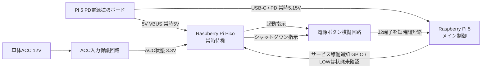

ACC ONからACC OFFまでの動作順序を以下に示す。

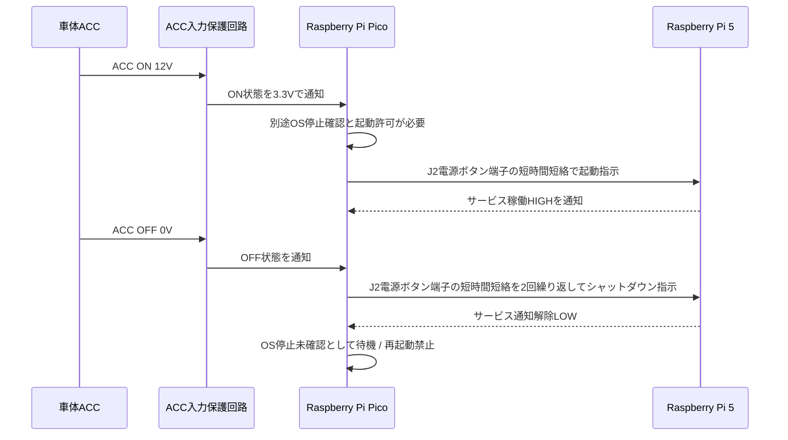

| ACC状態 | Pi 5状態 | Picoの処理 | 処理後の状態 |
| --- | --- | --- | --- |
| ON | 別途停止確認・許可済み | J2を1回操作し、HIGH通知を待つ | BOOTING |
| ON | サービス稼働確認済み | 新しい起動指示を送信しない | RUNNING |
| OFF | サービス稼働確認済み | J2を2回操作し、通知解除を待つ | STOPPING |
| ON/OFF共通 | 停止要求後LOW | 停止完了とは判定せず、再操作を禁止する | HALT_UNCONFIRMED |
| ON/OFF共通 | 起動直後LOW・通知喪失 | J2を操作しない | UNKNOWN |
| ON/OFF共通 | 通知タイムアウト | 異常を保持。ACC変化で解除しない | FAULT |

Pico本体LEDは、電源制御状態を以下のように表示する。未確認・異常状態の表示を優先する。

| 優先度 | ACC状態 | Pi 5状態通知 | Pico本体LED | 意味 |
| --- | --- | --- | --- | --- |
| 1 | ON/OFF共通 | UNKNOWN / HALT_UNCONFIRMED / FAULT | 二重点滅 | OS状態未確認または異常。J2再操作は禁止 |
| 2 | ON/OFF共通 | STOPPING | 速い点滅 | 停止要求後の通知解除待ち |
| 3 | ON/OFF共通 | RUNNING | 常灯 | 通知サービス稼働を確認 |
| 4 | ON/OFF共通 | BOOTING | ゆっくり点滅 | 起動通知待ち |
| 5 | OFF | STOPPED_CONFIRMED | 消灯 | 保守者による停止確認後の待機 |

通常点滅は500msごと、速い点滅は150msごとに点灯・消灯する。LEDもGPIO26も、OSの完全停止を保証する信号ではない。

<a id="sec-4144"></a>
##### 4.1.4.4 Raspberry Pi Pico GPIO対応表(電源関係)

電源管理に使用するRaspberry Pi PicoのGPIO対応表を以下に示す。GPIO番号はMicroPythonコードの定数に合わせた初期割り当てであり、実装時には基板レイアウト、配線長、ノイズ、使用するPico派生品のピン配置を確認して確定する。Picoの全GPIO端子の一覧は、[付録4: Raspberry Pi Pico GPIO対応表](付録4_RaspberryPiPico_GPIO対応表.md)を参照する。GPIO26によるサービス稼働通知の設定方法は、[付録5: Raspberry Pi 5 GPIO26状態通知設定](付録5_RaspberryPi5_GPIO26状態通知設定.md)を参照する。

| Pico物理ピン | Pico端子 | 方向 | 用途 | 接続先 | 対応コード定数 | 備考 |
| --- | --- | --- | --- | --- | --- | --- |
| 22 | GP17 | 入力 | ACC状態入力 | 4.1.4.1 共通車体12V信号入力回路の3.3V出力 | `ACC_INPUT_GPIO` | デジタル入力として使用する。ACC 12Vを直接入力しない。共通入力回路で3.3V信号へ変換してから接続する |
| 19 | GP14 | 出力 | Pi 5 J2電源ボタン模擬制御 | フォトMOSリレーまたは小信号リレー駆動回路 | `PI_J2_BUTTON_CTRL_GPIO` | 本書の吸込み配線図はopen_drain_low（オープンドレイン低レベル駆動。通常Hi-Z、短絡時LOW）。既存コード既定はactive_high（通常LOW、短絡時HIGH）。実回路に合わせて選択する |
| 14 | GP10 | 入力 | Pi 5サービス稼働通知入力 | Raspberry Pi 5 GPIO 26（物理ピン37） | `PI_STATUS_INPUT_GPIO` | HIGHはサービス通知、LOWはOS状態未確認。Pi 5とPicoのGNDを共通化する |
| 40 | VBUS | 電源入力 | Pico常時5V入力 | Pi 5 PD電源拡張ボード OUTPUT 5V Pin | - | F2 Pico用ポリヒューズ経由で給電する |
| 38 | GND | GND | 電源GND | 共通GND | - | Pi 5 GND、Pico GND、ACC入力保護回路GNDを共通基準にする |
| 36 | 3V3(OUT) | 電源出力 | 小信号回路用3.3V | PhotoMOS入力LED側の電流制限抵抗など | - | 大電流負荷へ供給しない。J2端子へは接続しない |
| - | GP25 | 出力 | Pico本体LED | PicoオンボードLED | `ONBOARD_LED_GPIO` | 基板上LEDの状態表示用。外部端子には出さない |

補足として、未使用GPIOは原則として未接続とし、将来拡張用に確保する。外部配線を追加する場合は、Pico GPIOの入力電圧が3.3Vを超えないこと、車体12V信号を直接接続しないこと、Pi 5 J2電源ボタン端子へ外部電圧を印加しないことを必ず確認する。

<a id="sec-415"></a>
#### 4.1.5 メイン制御系

メイン制御系では、Pi 5 PD電源拡張ボードからRaspberry Pi 5へ常時5.15V系電源を給電したまま、Picoからの制御信号によって起動と正常シャットダウンを制御する。PicoはPi 5の電源ラインを遮断せず、Pi 5内部の電源状態を「停止待機」「起動処理中」「稼働中」「シャットダウン処理中」の間で遷移させる。

**電源および制御信号**

| 項目 | Pi 5側 | 通常状態 | 信号条件・動作 | Pi 5内部の処理 |
| --- | --- | --- | --- | --- |
| 5V主電源 | Pi 5 PD電源拡張ボード USB-C / PD出力 | 常時給電 | Picoから電源ラインを制御しない | 停止待機中もPi 5入力電源を維持する |
| 起動指示 | Pi 5 J2電源ボタン端子 | 開放 | Pico制御のフォトMOSリレーまたは小信号リレーで200ms-500ms短絡する | Pi 5の電源ボタン操作として起動シーケンスを開始する |
| シャットダウン指示 | Pi 5 J2電源ボタン端子 | 開放 | Pico制御のフォトMOSリレーまたは小信号リレーで200ms-500ms短絡し、短い間隔を空けて2回繰り返す | Pi 5の電源ボタン操作として正常シャットダウンシーケンスを開始する |
| 状態通知 | GPIO 26（物理ピン37） | 通知なしLOW | 通知サービスがHIGHを出力 | サービス稼働を確認。LOWをOS停止完了に使用しない |
| 信号基準 | Pi 5 GND | Pico GNDと共通 | - | GPIO信号の基準電位を共通化する |

Pi 5では、従来機で使われることが多かったGPIO 3起動を基本案にしない。Raspberry Pi 5は専用電源ボタン入力でHALT/STANDBYから復帰する構成を前提とし、本設計ではPicoからJ2電源ボタン端子を短時間短絡して電源ボタン押下を模擬する。GPIO 3はI2C SCLと競合するため、起動制御には使用しない。

起動指示およびシャットダウン指示は、Pi 5 GPIOではなく、フォトMOSリレーまたは小信号リレーの接点でJ2端子を短絡する。J2端子へPicoのGPIO電圧を直接印加せず、接点短絡だけを行う。状態通知GPIOはPi 5からPicoへの一方向信号とし、PicoとPi 5のGNDを共通化する。

<a id="sec-4151"></a>
##### 4.1.5.1 起動時の内部処理

Pi 5はOS停止後もPi 5 PD電源拡張ボードから5.15V系電源を受ける。以下の起動処理は、保守者が別途停止を確認してPicoへ起動許可を与えた場合に限る。ACC ONだけ、またはGPIO26のLOWだけでは起動させない。許可後はJ2電源ボタン端子の短時間短絡により起動要求を行う。

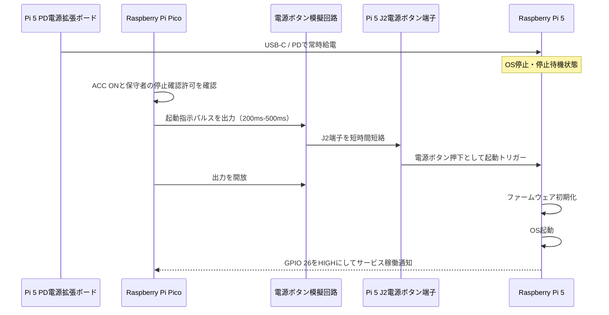

以下の配線図は、フォトMOS入力LED電流をGP14のLOWで吸い込む方式である。この配線ではPicoコードの`J2_CONTROL_MODE = "open_drain_low"`を選択する。コード既定の`active_high`は既存のHIGH入力駆動回路用であり、以下の配線にそのまま使用しない。J2を接続する前に通常時の接点開放を測定する。

```text
Pico側（制御入力）

  Raspberry Pi Pico 3.3V
          |
          |
        [ R1 ]
   フォトMOS入力電流制限抵抗
   1kΩ-4.7kΩ程度
          |
          v
  K1 PhotoMOS 入力LED +
  K1 PhotoMOS 入力LED -
          |
          |
  Pico J2制御GPIO
  （通常: 入力/Hi-Z、短絡時: LOW出力 200ms-500ms）
          |
       Pico GND


Pi 5側（電源ボタン接点）

  Pi 5 J2 電源ボタン端子 1
          |
          |
  K1 PhotoMOS 出力接点 1
  K1 PhotoMOS 出力接点 2
          |
          |
  Pi 5 J2 電源ボタン端子 2
```

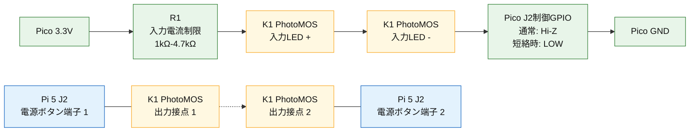

| 接続点 | 接続先 | 備考 |
| --- | --- | --- |
| Pico 3.3V | R1の片側 | PhotoMOS入力LED用の電源。5Vではなく3.3Vを使用する |
| R1の反対側 | K1 PhotoMOS入力LED+ | 入力LED電流制限。使用するPhotoMOSの入力電流に合わせて値を決める |
| K1 PhotoMOS入力LED- | Pico J2制御GPIO | 起動時およびシャットダウン時にGPIOをLOW出力にして入力LEDを点灯させる |
| Pico J2制御GPIO | 通常時はHi-Z、起動時およびシャットダウン時はLOW | Picoコードの`PI_J2_BUTTON_CTRL_GPIO`に対応する |
| K1 PhotoMOS出力接点1 | Pi 5 J2電源ボタン端子1 | J2側へ外部電圧を印加しない |
| K1 PhotoMOS出力接点2 | Pi 5 J2電源ボタン端子2 | 起動時は1回、シャットダウン時は2回、接点1-2を短時間短絡する |

起動指示は、Pi 5が停止待機中であることを確認してから1回だけ送信する。PicoのGPIOをPi 5のJ2端子へ直接接続せず、フォトMOSリレー、小信号リレー、または同等の絶縁・接点回路を介して短時間押下を模擬する。J2端子は電源ボタンの接点として扱い、外部から電圧を印加しない。

フォトMOSリレーではなく機械式リードリレーを使用する場合は、Pico GPIOでコイルを直接駆動しない。トランジスタまたはMOSFETのドライバ回路を追加し、リレーコイルにはフライバックダイオードを並列に配置する。

<a id="sec-4152"></a>
##### 4.1.5.2 シャットダウン時の内部処理

ACC OFFを検知したPicoは、電源ボタン模擬回路を使ってPi 5のJ2電源ボタン端子を短時間短絡し、短い間隔を空けて同じ短絡をもう一度行う。この2回の電源ボタン操作によってPi 5へシャットダウン指示を行い、OSの正常シャットダウンを開始させる。シャットダウン完了後も5V電源は遮断せず、Pi 5を停止待機状態に保持する。

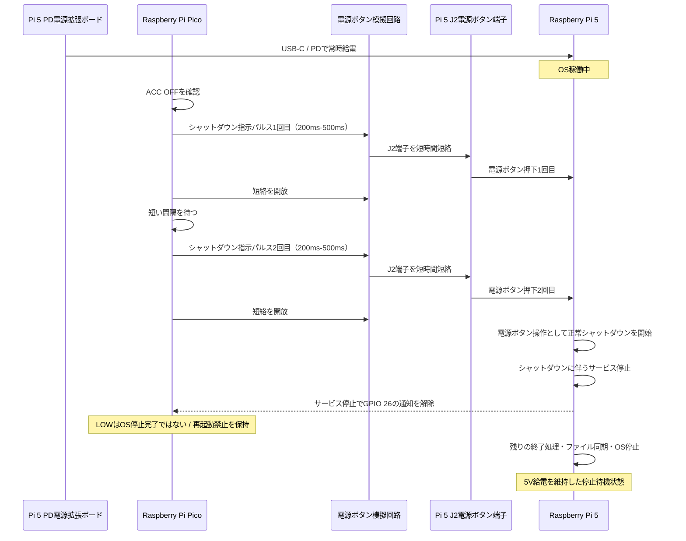

シャットダウン要求には起動時と同じ接点模擬回路を使用する。GPIO26のLOWは通知サービス停止を含むため、PicoはHALT_UNCONFIRMED（OS停止未確認）として待機する。ACCがONに戻っても自動で起動パルスを送らない。5V給電は継続し、停止の別途確認と起動許可が必要である。J2を2回操作して正常終了することはOS設定を含めて実機受入で検証する。


<a id="sec-4153"></a>
##### 4.1.5.3 Raspberry Pi 5 GPIO対応表(電源関係)

電源管理に使用するRaspberry Pi 5側のGPIOおよび電源制御関連端子を以下に示す。Pi 5の起動・シャットダウン指示はGPIOではなくJ2電源ボタン端子の短時間短絡で行い、GPIOはPi 5からPicoへの状態通知に限定して使用する。

| Pi 5物理ピン/端子 | GPIO/端子 | 方向 | 用途 | 接続先 | 対応コード定数 | 備考 |
| --- | --- | --- | --- | --- | --- | --- |
| 37 | GPIO 26 | 出力 | Pi 5サービス稼働通知 | Raspberry Pi Pico GP10 | `STATUS_GPIO` / `PI_STATUS_INPUT_GPIO` | サービスがHIGHを出力する。LOWは通知なしで、OS停止完了ではない |
| 22 | GPIO 25 | 未使用 | 将来拡張用 | - | - | 旧シャットダウン指示入力候補。現行設計ではシャットダウン指示に使用しない |
| 5 | GPIO 3 | 未使用 | 起動制御には使用しない | - | - | I2C SCLと競合するため、Pi 5起動制御には使用しない |
| J2 | 電源ボタン端子 | 接点入力 | 起動・シャットダウン指示 | Pico制御のフォトMOSリレーまたは小信号リレー接点 | - | GPIOではない。外部電圧を印加せず、接点短絡のみ行う |
| 6 / 9 / 14 / 20 / 25 / 30 / 34 / 39 | GND | GND | 信号基準GND | Pico GND / 共通GND | - | 状態通知GPIOとJ2模擬回路の基準電位を共通化する |
| 1 / 17 | 3.3V | 電源出力 | GPIOプルアップ等の小信号用 | 必要時のみ小信号回路 | - | 大電流負荷へ供給しない。J2端子へは接続しない |

補足として、Pi 5の3.3Vピンは電源出力であり、状態通知用の信号ではない。GPIO26もOS全体の準備完了ではなく通知サービスの稼働を示す。設定方法は、[付録5: Raspberry Pi 5 GPIO26状態通知設定](付録5_RaspberryPi5_GPIO26状態通知設定.md)を参照する。


<a id="sec-416"></a>
#### 4.1.6 オーディオ系

オーディオ系は、カーナビ内部のオーディオアンプへ12Vを供給する系統である。Raspberry Pi 5とは異なり、5V電源バスではなく車載バッテリー由来の12Vを使用する。

| 項目 | 内容 |
| --- | --- |
| オーディオ分岐保護 | 12V共通入力保護後のアンプ分岐に配置し、大電流系統のヒューズ、ノイズフィルタでアンプ用12V電源を保護・安定化する |
| 12Vアンプ電源遮断 | ACC信号に連動する12Vリレーでオーディオアンプの12V主電源をON/OFFする |
| オーディオアンプ | 12Vアンプ電源遮断機構がONのときのみ12Vを受け、スピーカー駆動用の音声出力を行う |

4.1の構成図では、Pi 5系とオーディオ系に共通する逆接、TVS、ノイズ対策、入力平滑を「12V共通入力保護」として統合して示す。ただしオーディオアンプは大きな電流変動や音声ノイズの影響を受けやすいため、アンプ分岐後にもヒューズ、フィルタ、電源遮断を配置する。また、本設計で想定するオーディオアンプには電源ON/OFF端子やREMOTE端子がないため、アンプの12V主電源ラインにACC連動リレーを追加し、ACC OFF時にアンプへ12Vが供給され続けない構成とする。

<a id="sec-4161"></a>
##### 4.1.6.1 12Vオーディオ電源保護回路設計

12Vオーディオ電源保護回路は、12V共通入力保護後のオーディオアンプ分岐に配置する。車載12V入力の基本保護、サージ保護、入力平滑用のC1/C2は[4.1.2 12V共通入力保護](#412-12v共通入力保護)で受け持つため、本項ではアンプ系統の分岐ヒューズ、電源遮断、音声ノイズ低減を目的とした分岐後の保護・安定化を扱う。

以下の値は、12V車載用の小型オーディオアンプ（40W×2ch程度）を想定した目安である。最終値は、使用するアンプの最大消費電流、配線長、ヒューズ位置、筐体内温度、実測ノイズに合わせて確定する。

| 構成要素 | 目的 | 配置 | 推奨値・定格の目安 |
| --- | --- | --- | --- |
| F1 分岐ヒューズ | アンプ系統の短絡・過電流から分岐配線を保護する | 12V共通入力保護後、アンプ用分岐直後 | 10A-15Aを目安。アンプ最大電流と配線許容電流に合わせて選定 |
| L1 / Filter | オーディオ分岐のノイズを低減する | SW1前後、またはアンプ電源入力の手前 | インダクタ 10uH-47uH、定格電流10A以上、低DCR。車載用ノイズフィルタも可 |
| SW1 | ACC OFF時にアンプ主電源を遮断する | 分岐ヒューズ後段、アンプ電源入力の前段 | 12V車載リレー。接点連続電流10A-15A以上、コイル電圧12V |
| C_AUD1 / C_AUD2 | アンプ近傍の追加デカップリング | アンプ入力直前の12V-GND間 | 基本構成では実装しない。配線が長い、音声ノイズが残る、電圧降下が実測される場合のみ追加を検討する |
| D_AUD1 近傍TVS | アンプ近傍で残留サージや誘導ノイズをGNDへ逃がす | アンプ電源入力近傍の12V-GND間 | 基本は4.1.2で受け持つ。アンプ近傍でノイズが残る場合のみ補助的に追加する |

回路構成は以下を基本とする。

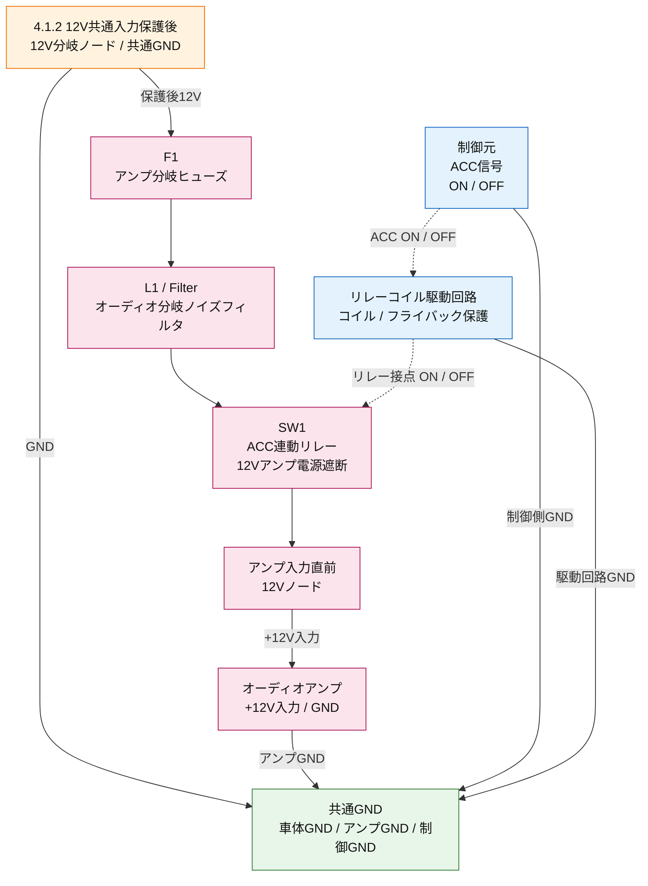

図は上から下へ読み、最上段を12V共通入力保護後の12V分岐ノード、最下段を共通GNDとする。オーディオアンプは+12V入力とGNDを一つのBOXで表す。4.1.2のC1/C2が分岐前の12Vライン安定化を受け持つため、本図にはオーディオ分岐側のC1/C2を重複して記載しない。破線は電源配線ではなく、ACC信号によってSW1のリレー接点をON/OFFする制御経路を表す。

接続点と端子を回路配線に近い形式で表した模式図を以下に示す。

```text
主電源経路

  4.1.2 12V共通入力保護後 12V分岐ノード
       |
     [ F1 アンプ分岐ヒューズ ]
       |
  [ L1 / Filter ]
       |
     [ SW1 ]
       |
       o  VAMP（アンプ入力ノード）
       |
  [ Audio Amp +12V ]


共通GNDへの接続

  Audio Amp GND ----------------+
  Relay Coil Driver GND --------+
  ACC Signal GND ---------------+---- COMMON GND


アンプ電源遮断の制御経路

  ACC信号
              |
   [ Relay Coil Driver ]
              |
     SW1 リレー接点 ON / OFF
```

ACC信号はリレーコイル駆動回路を介してSW1を制御し、制御側のGNDも共通GNDへ接続する。リレーコイルにはフライバックダイオードを含める。アンプ入力直前に追加コンデンサや近傍TVSが必要になった場合は、4.1.2のC1/C2/D1と区別するため、C_AUD1、C_AUD2、D_AUD1のような別記号で追記する。

| 記号 | 部品 | 役割 | 推奨値・定格の目安 |
| --- | --- | --- | --- |
| F1 | アンプ分岐ヒューズ | アンプ系統の短絡・過電流時に分岐回路を遮断する | 10A-15Aを目安。アンプ最大電流に合わせる |
| L1 / Filter | LCフィルタまたは車載用ノイズフィルタ | アンプ分岐ラインに乗るノイズを低減する | 10uH-47uH、10A以上、低DCR。既製の車載ノイズフィルタも可 |
| SW1 | ACC連動リレー | ACC OFF時にアンプの12V主電源を遮断する | 12V車載リレー。接点連続電流10A-15A以上、コイル電圧12V |
| C_AUD1 / C_AUD2 | 追加コンデンサ | アンプ近傍で実測上必要な場合だけ、12V-GND間に並列接続して電圧変動や高周波ノイズを抑える | 必要時のみ追加。電解 2200uF-4700uF、25V以上、105℃品。セラミック 0.1uF + 1uF、25V以上 |
| D_AUD1 | 近傍TVS | アンプ近傍で残るサージや誘導ノイズをGNDへ逃がす | 必要時のみ追加。VRWM 18V前後、ピークパルス1500W級を目安 |

設計上の注意点は以下とする。

- 分岐ヒューズはアンプの最大消費電流とアンプ分岐配線の許容電流を考慮して選定する。
- 4.1.2の共通入力保護と同じ逆接保護、TVS、共通DCノイズフィルタ、C1/C2を本項で重複して配置しない。
- ノイズフィルタは、オルタネーターノイズやスイッチングノイズが音声出力へ混入しないよう、アンプ分岐またはアンプ入力近傍に配置する。
- アンプ近傍の追加コンデンサは、配線長、音声ノイズ、電圧降下を実測してから必要性を判断する。
- アンプのGNDは、電源GNDや信号GNDとの取り回しに注意し、グランドループによるノイズ混入を避ける。
- オーディオアンプには電源ON/OFF端子を持たない前提のため、ACC連動リレーでアンプ主電源を遮断し、バッテリー上がりを防止する。
- リレーコイル側にはフライバックダイオードを入れ、ACC信号側へ逆起電力が戻らないようにする。
- アンプ電源遮断の制御元はACC信号に統一する。

<a id="sec-42"></a>
### 4.2 制御・入出力系

制御・入出力系は、Raspberry Pi 5を中心に、車体側入力信号、車体側操作信号、周辺ブロックとの接続関係を整理するブロックである。本章ではメインコントローラであるRaspberry Pi 5、サブコントローラ1、サブコントローラ2、制御信号、および制御信号を安全に受けるための入力保護・駆動ブロックを説明対象とする。バックギア信号はサブコントローラ1で受信し、左右ウィンカー信号はサブコントローラ2で受信する。いずれもRaspberry Pi 5へ直接入力せず、Ethernet経由で状態通知する。図は上から、車体側入力信号、車体側操作信号、入力保護・駆動、制御・入出力、周辺ブロックの順に配置する。図中のグレー表示ブロックは接続先を示すための参照であり、各ブロックの詳細は個別の章で説明する。

```mermaid
flowchart TB
    subgraph VehicleInput["車体側入力信号"]
        direction LR
        VehicleInputAnchor[" "]
        ReverseLamp["バックランプ信号"]
        TurnSignalL["左ウィンカー信号"]
        TurnSignalR["右ウィンカー信号"]
    end

    subgraph VehicleOutput["車体側操作信号"]
        direction LR
        VehicleOutputAnchor[" "]
        DoorLockSignal["ドアロック操作信号<br/>インターフェース"]
    end

    subgraph InputProtection["入力保護・駆動"]
        direction LR
        InputAnchor[" "]
        ReverseInput["バックランプ入力保護"]
        TurnInputL["左ウィンカー入力保護"]
        TurnInputR["右ウィンカー入力保護"]
        DoorLockDrive["ドアロック制御<br/>保護・駆動回路"]
    end

    subgraph Control["制御・入出力"]
        ControlAnchor[" "]
        Pi5["メインコントローラ<br/>Raspberry Pi 5"]
        MainSSD["SSD<br/>OS / 映像記録"]
        SubPi1["サブコントローラ1<br/>Raspberry Pi 3B<br/>後方系"]
        SubPi2["サブコントローラ2<br/>Raspberry Pi 3B<br/>前方系"]
    end

    subgraph Peripherals["周辺機器"]
        direction LR
        PeripheralsAnchor[" "]
        subgraph Display_Group["映像・入力"]
            Display["タッチパネルディスプレイ"]
        end

        subgraph Camera["カメラ"]
            RightCamera["右カメラ"]
            LeftCamera["左カメラ"]
        end

        subgraph Sensors["センサー"]
            GPS["GPSモジュール"]
            Sensor["センサー入力"]
        end

        subgraph Cooling["冷却"]
            Fan["PWMファン x2"]
        end

        subgraph Audio["オーディオ"]
            DAC["USB DAC"]
        end
    end

    subgraph SubPeripherals["サブコン周辺機器"]
        RearCamera["後方カメラ"]
        FrontCamera["前方カメラ"]
    end

    VehicleInputAnchor --> VehicleOutputAnchor
    VehicleOutputAnchor --> InputAnchor
    InputAnchor --> ControlAnchor
    ControlAnchor --> PeripheralsAnchor

    ReverseLamp -->|12V信号| ReverseInput
    TurnSignalL -->|12V信号| TurnInputL
    TurnSignalR -->|12V信号| TurnInputR
    ReverseInput -->|3.3V GPIO信号| SubPi1
    TurnInputL -->|3.3V GPIO信号| SubPi2
    TurnInputR -->|3.3V GPIO信号| SubPi2
    SubPi1 <-->|Ethernet<br/>バックギア状態 / 後方映像| Pi5
    SubPi2 <-->|Ethernet<br/>ウィンカー状態 / 前方映像| Pi5
    Pi5 ---|Pi 5 → GPIO制御信号| DoorLockDrive
    DoorLockDrive ---|保護・駆動 → 操作信号| DoorLockSignal

    Pi5 -->|HDMI| Display
    Pi5 -->|USBタッチ入力線| Display
    Pi5 <-->|USB 3.0<br/>OS / 映像記録| MainSSD

    Pi5 -->|フレキケーブル<br/>MIPI| RightCamera
    Pi5 -->|フレキケーブル<br/>MIPI| LeftCamera
    SubPi1 <-->|フレキケーブル| RearCamera
    SubPi2 <-->|フレキケーブル| FrontCamera

    Pi5 -->|UART / USB| GPS
    Pi5 -->|I2C / GPIO| Sensor

    Pi5 -->|PWM GPIO| Fan

    Pi5 -->|USB Audio| DAC

    style VehicleInput fill:#eeeeee,stroke:#aaaaaa,color:#777777
    style VehicleOutput fill:#eeeeee,stroke:#aaaaaa,color:#777777
    style InputProtection fill:#fff4dd,stroke:#cc9900,color:#333333
    style Peripherals fill:#eeeeee,stroke:#aaaaaa,color:#777777
    style SubPeripherals fill:#eeeeee,stroke:#aaaaaa,color:#777777
    style Display_Group fill:#eeeeee,stroke:#aaaaaa,color:#777777
    style Camera fill:#eeeeee,stroke:#aaaaaa,color:#777777
    style Sensors fill:#eeeeee,stroke:#aaaaaa,color:#777777
    style Cooling fill:#eeeeee,stroke:#aaaaaa,color:#777777
    style Audio fill:#eeeeee,stroke:#aaaaaa,color:#777777
    style ReverseLamp fill:#f5f5f5,stroke:#aaaaaa,color:#777777
    style TurnSignalL fill:#f5f5f5,stroke:#aaaaaa,color:#777777
    style TurnSignalR fill:#f5f5f5,stroke:#aaaaaa,color:#777777
    style DoorLockSignal fill:#f5f5f5,stroke:#aaaaaa,color:#777777
    style TurnInputL fill:#fff4dd,stroke:#cc9900,color:#333333
    style TurnInputR fill:#fff4dd,stroke:#cc9900,color:#333333
    style DoorLockDrive fill:#fff4dd,stroke:#cc9900,color:#333333
    style VehicleInputAnchor fill:transparent,stroke:transparent,color:transparent
    style VehicleOutputAnchor fill:transparent,stroke:transparent,color:transparent
    style InputAnchor fill:transparent,stroke:transparent,color:transparent
    style ControlAnchor fill:transparent,stroke:transparent,color:transparent
    style PeripheralsAnchor fill:transparent,stroke:transparent,color:transparent
    style Display fill:#f5f5f5,stroke:#aaaaaa,color:#777777
    style MainSSD fill:#ffffff,stroke:#666666,color:#333333
    style FrontCamera fill:#f5f5f5,stroke:#aaaaaa,color:#777777
    style RightCamera fill:#f5f5f5,stroke:#aaaaaa,color:#777777
    style LeftCamera fill:#f5f5f5,stroke:#aaaaaa,color:#777777
    style RearCamera fill:#f5f5f5,stroke:#aaaaaa,color:#777777
    style GPS fill:#f5f5f5,stroke:#aaaaaa,color:#777777
    style Sensor fill:#f5f5f5,stroke:#aaaaaa,color:#777777
    style Fan fill:#f5f5f5,stroke:#aaaaaa,color:#777777
    style DAC fill:#f5f5f5,stroke:#aaaaaa,color:#777777
    linkStyle 0 stroke:transparent
    linkStyle 1 stroke:transparent
    linkStyle 2 stroke:transparent
    linkStyle 3 stroke:transparent
```

| ブロック | 本章での扱い | 内容 |
| --- | --- | --- |
| Raspberry Pi 5 | 説明対象 | 制御・入出力系の中心となるメインコントローラ |
| Raspberry Pi 3B サブコントローラ1 | 説明対象 | バックギア信号をGPIOで受信し、後方カメラ映像と状態情報をEthernetでRaspberry Pi 5へ連携する |
| Raspberry Pi 3B サブコントローラ2 | 説明対象 | 左右ウィンカー信号をGPIOで受信し、前方カメラ映像と状態情報をEthernetでRaspberry Pi 5へ連携する |
| SSD | 説明対象 | メインコントローラに接続し、OS起動領域および映像記録領域として使用する |
| バックランプ入力保護 | 説明対象 | 制御系とは別の入力保護ブロックとして配置し、車体側12V信号をRaspberry Pi 3B GPIOで扱える3.3V信号へ変換する |
| ウィンカー入力保護 | 説明対象 | 左右ウィンカーの車体側12V信号をサブコントローラ2のGPIOで扱える3.3V信号へ変換する |
| ドアロック制御 保護・駆動回路 | 検討対象 | Raspberry Pi 5のGPIO信号をドアロック操作信号インターフェースへ安全に伝えるための回路。実装時はリレー、トランジスタ、MOSFET、フォトカプラ等で絶縁、電流増幅、逆流防止、サージ保護を行う |
| ドアロック操作信号インターフェース | 検討対象 | Raspberry Pi 5から出力したロック/アンロック操作信号を車体側ドアロック制御回路へ伝えるための接続点。車両配線図を確認し、純正ドアロック制御回路に悪影響を与えない接続方式を選定する |
| グレー表示ブロック | 参照のみ | 接続先を示すために記載し、詳細説明は各個別章で行う |

設計上の注意点は以下とする。

- グレー表示ブロックは接続先の参照であり、本章では詳細仕様を説明しない。
- オーディオ系、センサー系、カメラ系、映像・入力系、冷却系の詳細は、それぞれの個別章で定義する。
- バックランプ信号と左右ウィンカー信号は車体側12V信号のため、Raspberry Pi 3BのGPIOへ直接接続せず、入力保護回路を通して3.3V信号へ変換する。Raspberry Pi 5はこれらの信号をGPIOで直接受けず、各サブコントローラからEthernet経由で状態通知を受ける。
- ドアロック操作信号インターフェースは車体側アクチュエータや既存制御回路に関係するため、Raspberry Pi 5のGPIOを直接接続しない。実装時は車両配線図を確認し、絶縁、逆流防止、サージ保護、フェイルセーフを含む保護・駆動回路を別途設計する。

<a id="sec-421"></a>
#### 4.2.1 GPIO対応表

制御・入出力系で使用するRaspberry Pi 5の40ピンヘッダー対応表を以下に示す。物理ピン番号は、基板を上から見たときの40ピンヘッダー配置に合わせ、写真と同じく上段を偶数ピン、下段を奇数ピンとして整理する。用途欄の「未割当」は、現時点で接続先を確定していない候補ピンを示し、設計上の使用禁止や最終的な未使用確定を意味しない。「未使用」は、その用途には使用しないことを確定したピンに限定する。GPIO番号は設計段階の割り当て案であり、実装時には使用ライブラリ、I2C/SPI/UARTの有効化状況、PWM対応ピン、他機能との競合を確認して確定する。IMUの候補ピンは4.4.3.1で確定後、この表へ反映する。

| 下段 物理ピン | 下段 GPIO/種別 | 方向 | 用途 | 接続先 | 上段 物理ピン | 上段 GPIO/種別 | 方向 | 用途 | 接続先 |
| --- | --- | --- | --- | --- | --- | --- | --- | --- | --- |
| 1 | 3.3V | 電源 | 未使用 | - | 2 | 5V | 電源 | 未使用 | - |
| 3 | GPIO 2 | 入出力 | 未割当（IMU I2C SDA候補） | - | 4 | 5V | 電源 | 未使用 | - |
| 5 | GPIO 3 | 入出力 | 未割当（IMU I2C SCL候補） | - | 6 | GND | GND | 未使用 | - |
| 7 | GPIO 4 | 入出力 | 未使用 | - | 8 | GPIO 14 | 入出力 | 未使用 | - |
| 9 | GND | GND | GND | 共通GND | 10 | GPIO 15 | 入出力 | 未使用 | - |
| 11 | GPIO 17 | 入出力 | 未使用 | - | 12 | GPIO 18 | 出力 | PWMファン制御 | PWMファンPWM制御線 |
| 13 | GPIO 27 | 入出力 | 未使用 | - | 14 | GND | GND | GND | 共通GND |
| 15 | GPIO 22 | 入出力 | 未使用 | - | 16 | GPIO 23 | 入出力 | 未使用 | - |
| 17 | 3.3V | 電源 | 未使用 | - | 18 | GPIO 24 | 入出力 | 未使用 | - |
| 19 | GPIO 10 | 入出力 | 未割当（IMU SPI MOSI候補） | - | 20 | GND | GND | GND | 共通GND |
| 21 | GPIO 9 | 入出力 | 未割当（IMU SPI MISO候補） | - | 22 | GPIO 25 | 入出力 | 未使用 | - |
| 23 | GPIO 11 | 入出力 | 未割当（IMU SPI SCLK候補） | - | 24 | GPIO 8 | 入出力 | 未割当（IMU SPI CE0候補） | - |
| 25 | GND | GND | GND | 共通GND | 26 | GPIO 7 | 入出力 | 未割当（IMU SPI CE1候補） | - |
| 27 | GPIO 0 | 入出力 | 未使用 | - | 28 | GPIO 1 | 入出力 | 未使用 | - |
| 29 | GPIO 5 | 出力 | ドアロック制御 | ドアロック制御 保護・駆動回路 | 30 | GND | GND | GND | 共通GND |
| 31 | GPIO 6 | 出力 | ドアアンロック制御 | ドアロック制御 保護・駆動回路 | 32 | GPIO 12 | 入出力 | 未使用 | - |
| 33 | GPIO 13 | 入出力 | 未使用 | - | 34 | GND | GND | GND | 共通GND |
| 35 | GPIO 19 | 入出力 | 未使用 | - | 36 | GPIO 16 | 入出力 | 未使用 | - |
| 37 | GPIO 26 | 出力 | Pi 5状態通知 | Raspberry Pi Pico GP10 | 38 | GPIO 20 | 入力 | 冷却ファン回転数フィードバック | 冷却ファンTACH信号 |
| 39 | GND | GND | GND | 共通GND | 40 | GPIO 21 | 入出力 | 未使用 | - |

各ピンの補足を以下に示す。

| 物理ピン | 補足 |
| --- | --- |
| 2 | 5V電源ピン。タッチパネルディスプレイ給電には使用しない。ディスプレイはUSB電源入力から給電する |
| 4 | 5V電源ピン。タッチパネルディスプレイ給電には使用しない。ディスプレイはUSB電源入力から給電する |
| 3 | I2C SDA候補 |
| 5 | GPIO 3 / I2C SCL候補。Pi 5起動制御には使用せず、起動はJ2電源ボタン端子を使用する |
| 6 | GNDピン。タッチパネルディスプレイのGND戻りには使用しない。ディスプレイの電源GNDはUSB給電ケーブル側で扱う |
| 8 | UART TXD候補 |
| 10 | UART RXD候補 |
| 11 | 未使用。バックギア信号、左右ウィンカー信号はRaspberry Pi 5へ入力せず、担当サブコントローラ側GPIOで受信する |
| 12 | 1台の4ピンPWM冷却ファンのPWM制御用。ファン電源12VをGPIOへ接続しない |
| 18 | GPIO 24候補。本設計では未使用 |
| 19 | SPI MOSI候補 |
| 21 | SPI MISO候補 |
| 22 | GPIO 25候補。シャットダウン指示はJ2電源ボタン端子を使用するため、本設計では未使用 |
| 23 | SPI SCLK候補 |
| 24 | SPI CE0候補 |
| 26 | SPI CE1候補 |
| 27 | ID_SD。HAT EEPROM用途との競合に注意 |
| 28 | ID_SC。HAT EEPROM用途との競合に注意 |
| 29 | ドアロック制御出力候補。保護・駆動回路を介して車体側へ接続し、GPIOを車体側12V配線へ直接接続しない |
| 31 | ドアアンロック制御出力候補。保護・駆動回路を介して車体側へ接続し、GPIOを車体側12V配線へ直接接続しない |
| 32 | PWM候補 |
| 33 | GPIO 13 / PWM候補。本設計ではファン制御に使用しない |
| 35 | PWM / PCM候補 |
| 38 | 冷却ファンのTACH/回転数フィードバック入力。必要に応じて3.3Vプルアップ、電流制限、ノイズ対策を入れる |
| 40 | GPIO 21。本設計では未使用 |

設計上の注意点は以下とする。

- Raspberry Pi 5のGPIOは3.3V系のため、車体側12V信号を直接接続しない。
- タッチパネルディスプレイは40ピンヘッダーの5V/GNDから給電せず、USB電源入力から5V給電する。
- バックランプ入力は、ACC入力と同じ共通車体12V信号入力回路を通し、3.3V GPIO信号へ変換する。
- GPIO 2/3はI2Cの標準ピンとして使われるため、GPIO 3は起動制御に使用しない。Pi 5の起動はJ2電源ボタン端子をフォトMOSリレー等で短時間短絡して行う。
- 4ピンPWMファンの12V電源線とGND線は、Raspberry Pi 5の40ピンヘッダーではなく、12Vを供給できる拡張ボードまたは12V電源分岐へ接続する。
- PWM制御線は1台のファンへ接続し、Raspberry Pi 5のGPIO 18からデューティ比を制御する。TACHフィードバックは同じファンからGPIO 20で取得する。
- PWM入力仕様が5Vプルアップ前提の場合は、GPIO直結ではなくオープンドレイン駆動、トランジスタ、MOSFET、レベル変換回路を検討する。
- ドアロック制御出力は、車体側ドアロック制御回路へ直接接続せず、保護・駆動回路を通して短時間の操作信号として出力する。
- 最終的なGPIO割り当ては、OS設定、HAT/拡張基板、使用ライブラリ、筐体配線を確認して確定する。

<a id="sec-422"></a>
#### 4.2.2 バックカメラ表示制御

本章はセカンド開発対象であり、カーナビ本体の基本製作開始後に詳細設計を行う。現時点ではT.B.Dとし、以下は将来設計時の検討メモとして扱う。

| 項目 | 状態 |
| --- | --- |
| 開発区分 | セカンド開発 |
| 詳細設計 | T.B.D |
| 実装開始条件 | カーナビ本体の基本製作開始後に再検討 |

バックカメラ表示制御は、リバースギア投入時にバックランプ信号を検知し、タッチパネルディスプレイの表示を後方カメラ映像へ切り替える機能である。バックランプは車体側の12V信号であるため、サブコントローラ1のGPIOで受信する前に入力保護回路を通して3.3V信号へ変換する。Raspberry Pi 5はバックギア信号をGPIOで直接受信せず、サブコントローラ1からEthernet経由で状態通知を受ける。後方カメラはサブコントローラ1へフレキケーブルで接続し、メインコントローラとはEthernet経由で映像または制御情報を連携する。

| 項目 | 内容 |
| --- | --- |
| 入力信号 | バックランプ12V信号 |
| 入力保護 | 共通車体12V信号入力回路により、バックランプ12Vを3.3V GPIO信号へ変換する |
| 入力先 | Raspberry Pi 3B GPIO（ピン番号T.B.D） |
| 映像入力 | 後方カメラをサブコントローラ1へフレキケーブル接続し、メインコントローラへEthernet経由で連携する |
| 表示先 | タッチパネルディスプレイ HDMI |
| 表示制御 | サブコントローラ1側GPIO入力がONになったらEthernetでメインコントローラへ通知し、後方カメラ映像へ切り替える。OFFになったら通常画面へ戻す |

制御フローは以下とする。

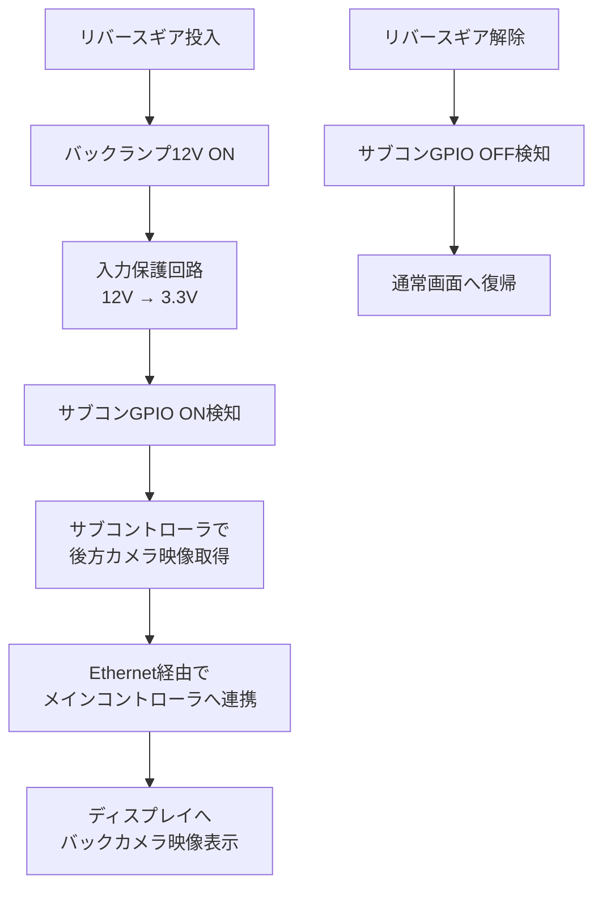

各機器間の信号および処理の順序を以下に示す。

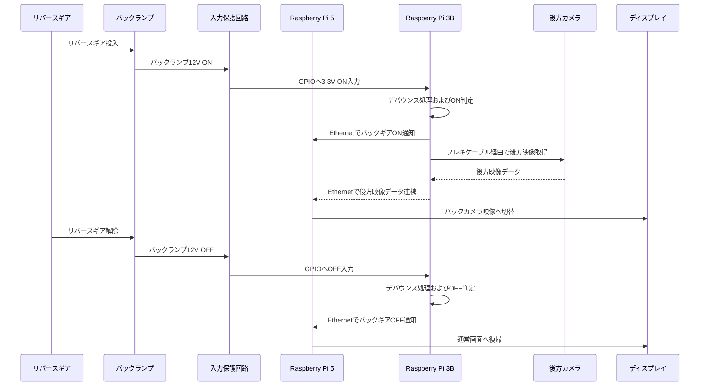

<a id="sec-4221"></a>
##### 4.2.2.1 バックランプ入力保護回路設計

バックランプ入力保護回路は、リバースギア投入時に点灯するバックランプの12V信号を、Raspberry Pi 3BのGPIOで安全に読み取るために配置する。回路方式は[4.1.4.1 共通車体12V信号入力回路](#sec-4141)に統一し、ACC入力と同じ降圧コンバーター方式を使用する。Raspberry Pi 5のGPIOにはバックランプ信号を接続しない。

本項では、共通回路をバックランプ入力へ適用するときの接続先と注意点のみを示す。

| 項目 | バックランプ入力での設定 |
| --- | --- |
| 入力信号 | バックランプ12V信号 |
| 信号変換方式 | 共通車体12V信号入力回路の降圧コンバーター方式 |
| 出力信号 | 3.3V GPIO信号 |
| 入力先 | Raspberry Pi 3B GPIO（ピン番号T.B.D） |
| GND基準 | 車体GNDとRaspberry Pi 3B GNDを共通基準にする |

設計上の注意点は以下とする。

- バックランプ入力回路の部品構成、回路図、配線模式図は[4.1.4.1 共通車体12V信号入力回路](#sec-4141)を参照する。
- 降圧コンバーターは3.3V出力に設定し、5V出力のままRaspberry Pi 3B GPIOへ接続しない。
- サブコントローラ側GPIOへ入力される電圧が、最大でも3.3Vを超えないように実測で確認する。
- リバースギア検知の応答が遅くなりすぎないよう、共通回路側のRCフィルタ時定数を調整する。
- 車体GNDとRaspberry Pi 3B GNDを接続する位置は、電源系の大電流GNDと信号GNDが大きなループを作らないように配線する。

設計上の注意点は以下とする。

- バックランプ12V信号はGPIOへ直接入力しない。
- 入力保護回路は、ACC入力と同じ共通車体12V信号入力回路を使用し、過電圧保護、ノイズ低減、3.3V信号化を行う。
- リバースギア投入から表示切替までの遅延を小さくするため、後方カメラ、サブコントローラ、Ethernet連携の初期化時間を考慮する。
- 後方カメラをドライブレコーダー録画と兼用する場合、サブコントローラ側の映像取得処理とメインコントローラ側の録画・表示処理の分担を考慮する。
- バックランプ信号のチャタリングや瞬断による表示切替のちらつきを防ぐため、ソフトウェア側で短時間のデバウンス処理を行う。

<a id="sec-423"></a>
#### 4.2.3 ドアロック制御

本章はセカンド開発対象であり、カーナビ本体の基本製作開始後に詳細設計を行う。現時点ではT.B.Dとし、以下は将来設計時の検討メモとして扱う。

| 項目 | 状態 |
| --- | --- |
| 開発区分 | セカンド開発 |
| 詳細設計 | T.B.D |
| 実装開始条件 | カーナビ本体の基本製作開始後に再検討 |

ドアロック制御は、Raspberry Pi 5からロック指示およびアンロック指示を出力し、ドアロック制御 保護・駆動回路を介して車体側のドアロック操作信号インターフェースへ伝える機能である。ドアロックアクチュエータや車体側制御回路は12V系で動作するため、Raspberry Pi 5のGPIOを直接接続しない。

| 項目 | 内容 |
| --- | --- |
| ロック指示出力 | GPIO 5（物理ピン29）を候補とする |
| アンロック指示出力 | GPIO 6（物理ピン31）を候補とする |
| 接続先 | ドアロック制御 保護・駆動回路 |
| 車体側接続 | ドアロック操作信号インターフェース |
| 出力方式 | 短時間パルス出力を基本とする。押しっぱなし相当の連続出力は行わない |
| 保護方針 | リレー、MOSFET、フォトカプラ等により、絶縁、電流増幅、逆流防止、サージ保護を行う |

制御の流れを以下に示す。

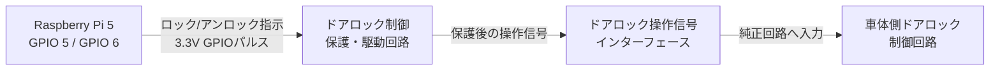

<a id="sec-4231"></a>
##### 4.2.3.1 ドアロック制御 保護・駆動回路設計

ドアロック制御 保護・駆動回路は、Raspberry Pi 5の3.3V GPIO出力を、車体側ドアロック操作信号インターフェースへ安全に伝えるために配置する。GPIOを車体側12V配線へ直接接続せず、フォトMOSリレーまたは小信号リレーを介して、純正ドアロックスイッチを短時間押した状態を模擬する。

本設計では、ロック信号とアンロック信号を独立した2系統として扱う。基本案は、Raspberry Pi 5側と車体側を絶縁しやすく、信号極性の影響を受けにくいフォトMOSリレー方式とする。実装前にL880Kコペンの配線図で、純正ドアロックスイッチがGND短絡型か、12V入力型か、または制御ユニット内部の専用信号線かを確認する。

| 構成要素 | 目的 | 推奨値・定格の目安 |
| --- | --- | --- |
| R1 / R2 | GPIOからフォトMOS入力LEDへ流す電流を制限する | 330Ω-1kΩ。使用するフォトMOSの入力電流に合わせる |
| K1 | ロック信号用フォトMOSリレー | 出力耐圧30V以上、オン抵抗は操作信号電流に対して十分小さいもの |
| K2 | アンロック信号用フォトMOSリレー | K1と同等品 |
| F1 / F2 | 車体側信号線の短絡時に電流を制限する | 小電流ヒューズまたはポリヒューズ。車体側信号電流に合わせる |
| D1 / D2 | 車体側信号線のサージをGNDへ逃がす | 12V車載信号用TVS。VRWM 18V前後を目安 |
| R3 / R4 | 車体側信号線の不要な浮きを抑える | 必要時のみ追加。47kΩ-100kΩ程度 |

回路構成は以下を基本とする。

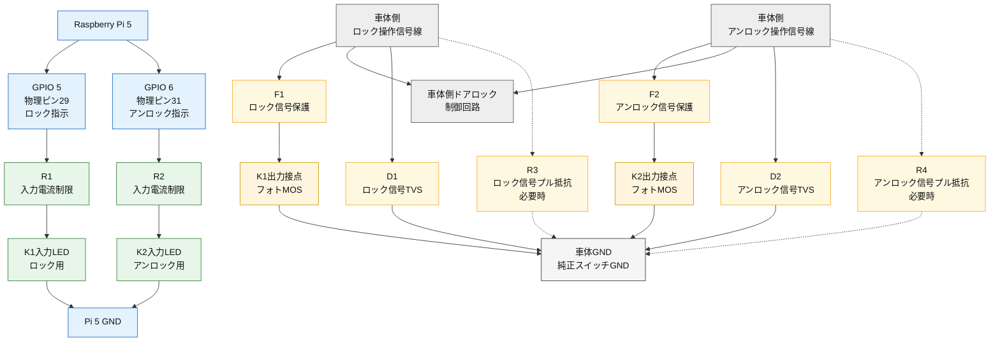

接続点を回路配線に近い形式で表すと以下のようになる。

```text
Pi 5側（3.3V GPIO）

  GPIO 5（ロック） -----[ R1 ]-----[ K1 入力LED ]----- Pi 5 GND
  GPIO 6（アンロック） -[ R2 ]-----[ K2 入力LED ]----- Pi 5 GND


車体側（純正スイッチ相当の短時間接点）

  ロック操作信号線 --------[ F1 ]-----[ K1 出力接点 ]----- 車体GND
          |                              |
          +-----------[ D1 TVS ]---------+

  アンロック操作信号線 ----[ F2 ]-----[ K2 出力接点 ]----- 車体GND
          |                              |
          +-----------[ D2 TVS ]---------+
```

動作は以下とする。

| 操作 | GPIO出力 | 駆動される接点 | 車体側の見え方 |
| --- | --- | --- | --- |
| ロック | GPIO 5を短時間ON | K1出力接点ON | 純正ロックスイッチを短時間押した状態 |
| アンロック | GPIO 6を短時間ON | K2出力接点ON | 純正アンロックスイッチを短時間押した状態 |
| 非操作時 | GPIO 5 / GPIO 6をOFF | K1 / K2出力接点OFF | 純正回路へ干渉しない開放状態 |

設計上の注意点は以下とする。

- 車体側接続は、ドアロックアクチュエータの駆動線ではなく、純正ドアロックスイッチ相当の操作信号線を優先する。
- 純正スイッチがGND短絡型でない場合は、本回路をそのまま接続せず、車両配線図に合わせて出力接点の接続先を見直す。
- GPIO出力は連続ONにせず、200ms-500ms程度の短時間パルスを基本とする。
- ロックとアンロックを同時ONしないよう、ソフトウェア側で排他制御を入れる。
- フォトMOSリレーの出力耐圧、オン抵抗、許容電流が車体側信号仕様に合うことを確認する。
- 小信号リレーを使う場合は、コイル駆動トランジスタ、ベース/ゲート抵抗、フライバックダイオードを追加する。
- 車体側信号線にはサージや誘導ノイズが乗る可能性があるため、TVSや配線取り回しを実車で確認する。

4.2.3全体の注意点は以下とする。

- 接続先は、ドアロックアクチュエータ線ではなく、可能な限り純正ドアロックスイッチ相当の操作信号線を優先する。
- 実装前にL880Kコペンの配線図を確認し、ロック信号線、アンロック信号線、ドアロック制御ユニットの位置を特定する。
- GPIO出力は3.3Vロジックであり、12V負荷やリレーコイルを直接駆動しない。
- 保護・駆動回路側には、逆流防止、サージ吸収、フライバックダイオード、フェイルセーフを含める。
- ソフトウェア側では、誤操作防止のため、連続出力時間、再操作禁止時間、走行中制限の要否を検討する。

<a id="sec-424"></a>

#### 4.2.4 車両情報取得（OBD2）

車体側OBDコネクタのK-Lineを使用し、L880KコペンのECUから車速・エンジン回転数・水温などを取得する。取得値をカーナビ表示、ログ、状態監視へ利用する。コネクタの形状と通信方式は別であり、CAN通信や標準OBD-II PID対応を前提にしない。

Pi 5との接続にはK-Line電気変換に対応したUSB–OBD変換ケーブルを使用する。Pi 5はUSBシリアル経由で通信し、車体側のK-Line電圧をGPIOへ直接入力しない。USB–TTL変換器や単なるピン変換ケーブルでは代用しない。

| 項目 | 内容 |
| --- | --- |
| 車体側接続 | OBDコネクタ。K-Line端子、電源・GNDの配線は対象車の資料で確認 |
| 車体側通信 | K-Line。ECUに合う診断方式・初期化・要求データは別途確認 |
| 接続ケーブル | K-Line対応USB–OBD変換ケーブル。型番T.B.D |
| Pi 5側接続 | USBポート。ソフト側はUSBシリアルとして扱う |
| GPIO使用 | 使用しない |
| ケーブル必須確認 | K-Line電気条件、送受信、初期化機能、エコー、USBドライバ、待機電流 |
| ソフトの設計基準 | 生バイト転送方式。ATコマンド型を同じ操作で扱わず、採用時は別途適合確認 |
| 取得候補 | 車速、回転数、水温、吸気温、ECU電圧、故障コード。対応は未確定 |

実車のECUと採用ケーブルで応答を確認した項目だけを使用する。要求識別子、データ位置、換算式はL880K用プロファイルへ登録し、標準PIDの式を無条件に流用しない。

| 情報 | 取得元 | 用途 | 優先度 | 注意点 |
| --- | --- | --- | --- | --- |
| 車速 | K-Line経由のECU応答 | 状態判定、現在地補正、ログ | 高 | 未取得は不明。GPS速度は別の情報源として区別 |
| エンジン回転数 | K-Line経由のECU応答 | 状態表示、ログ | 高 | 要求・単位・換算式を確認 |
| 冷却水温 | K-Line経由のECU応答 | 警告表示 | 高 | 取得確認と実車に合う警告条件が必要 |
| ECU電圧 | 取得対応が確認できたECU応答 | 電源状態の参考監視 | 高 | 電源回路やケーブル側の実測値と区別 |
| 吸気温 | 取得対応が確認できたECU応答 | 参考表示 | 中 | 未対応は非表示 |
| スロットル開度 | 取得対応が確認できたECU応答 | 走行ログ | 中 | 値の意味と換算を確認 |
| エンジン負荷 | 取得対応が確認できたECU応答 | 参考表示 | 中 | ECUの算出値として扱う |
| 燃料残量 | 取得対応が確認できたECU応答 | 残量の参考表示 | 中 | 取得できるとは限らない |
| 燃費 | 必要なECU実測値からの計算 | 参考表示 | 低 | 計算条件未確定。初期の実測出力には含めない |
| 故障コード | 確認済みK-Line診断読取 | メンテナンス支援 | 中 | 読取のみ。消去・車両制御はしない |
| 通信状態 | USB・K-Line・ECU応答の監視 | 異常表示 | 高 | 通信失効で過去値を使用不可にする |

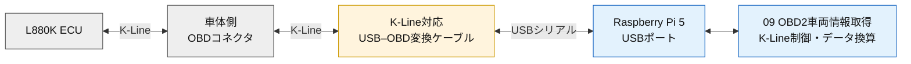

設計上の注意点は以下とする。

- 対象車の配線図でK-Line、電源、GNDを確認する。ケーブル側の適合確認前に接続しない。
- ケーブルに必要な初期化・電圧変換・保護機能があることを確認する。絶縁の有無は製品仕様次第であり、USB接続だけで絶縁済みとはしない。
- 通信速度、初期化方式、要求・応答形式はソフト側のL880Kプロファイルと揃える。未確定条件で総当たり通信しない。
- OBD端子から常時給電されるケーブルの待機電流を確認する。USBを閉じても車体側の給電停止とは限らない。
- ACC OFF後はソフトの読取と通信維持を停止する。運用・電源制御との連携方法は別途確定する。
- 車両への書込、消去、アクチュエータ制御は対象外。初期確認は停車中に実施する。

通信フロー、KLineSession、要求定義、換算と試験条件は[09 OBD2車両情報取得 詳細設計書](../SW設計/詳細設計/09_OBD2車両情報.md)を参照する。

<a id="sec-43"></a>
### 4.3 オーディオ系

オーディオ系は、Raspberry Pi 5で生成・受信した音声をUSB DACでアナログ音声へ変換し、車載用オーディオアンプを経由してスピーカーへ出力するブロックである。USBマイクからの音声入力も本ブロックで扱い、音声入力、録音、将来の音声認識に利用できる構成とする。音声案内、メディア再生、スマートフォンのBluetooth音源再生も扱う。

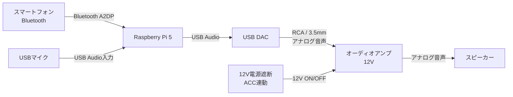

| ブロック | 接続方式 | 役割 |
| --- | --- | --- |
| Raspberry Pi 5 | Bluetooth / USB Audio | 音声案内、メディア再生、Bluetooth音源の受信・出力を行う |
| USB DAC | USB | Raspberry Pi 5のデジタル音声をアナログ音声へ変換する |
| USBマイク | USB Audio | Raspberry Pi 5へ音声を入力する。録音、音声入力、将来の音声認識に使用する |
| オーディオアンプ | RCA / 3.5mm入力、12V主電源 | USB DACからのアナログ音声を増幅し、スピーカーを駆動する |
| 12V電源遮断 | ACC連動リレー | ACC OFF時にアンプへ12Vが供給され続けないよう主電源をON/OFFする |
| スピーカー | アナログ音声 | オーディオアンプからの音声を出力する |
| スマートフォン | Bluetooth A2DP | Bluetooth音源の入力元として使用する |

設計上の注意点は以下とする。

- オーディオアンプは車載用12V対応品とし、出力 40W×2ch 以上を目安とする。
- オーディオアンプの12V主電源は、12V共通入力保護後に分岐し、4.1.6.1のオーディオ分岐保護と電源遮断機構を通して供給する。
- オーディオアンプには電源ON/OFF端子がない前提のため、12V主電源ラインをACC連動リレーで遮断し、ACC OFF時のバッテリー消費を抑える。
- USB DACはRaspberry Pi 5のUSBポートから電源供給されるため、USB電源容量とノイズ混入に注意する。
- USBマイクはRaspberry Pi 5のUSBポートへ直接接続し、USB Audio Class対応品を使用する。GPIO、I2C、12V電源には接続しない。
- USBマイクの電源はUSB 5Vから供給する。USB DACや他のUSB機器と合計した電流がRaspberry Pi 5のUSB電源容量を超える場合は、給電可能なUSBハブを使用する。
- オーディオ信号線は、電源線やPWMファン配線から離して配線し、ノイズ混入を抑える。
- アンプGNDと信号GNDの取り回しに注意し、グランドループによるノイズを避ける。

<a id="sec-431"></a>
#### 4.3.1 USB DAC接続詳細

USB DACは、Raspberry Pi 5からのUSB Audio出力をアナログ音声へ変換し、オーディオアンプのLINE入力へ接続する。

| 項目 | 内容 |
| --- | --- |
| USB DAC型式 | USB Audio Class対応DAC。XMOS、AKM等のチップセット搭載品を候補とする |
| 使用製品候補 | [Signstek USB-DAC Headphone Amplifier/Compact with USB Cable Small](https://www.amazon.co.jp/Signstek-Audio-USB-DAC-%E3%83%98%E3%83%83%E3%83%89%E3%83%95%E3%82%A9%E3%83%B3%E3%82%A2%E3%83%B3%E3%83%97-%E3%82%B3%E3%83%B3%E3%83%91%E3%82%AF%E3%83%88%E3%81%A7USB%E3%82%B1%E3%83%BC%E3%83%96%E3%83%AB%E4%BB%98%E3%81%8D/dp/B00X9TY8ZW) |
| Raspberry Pi 5側 | USB 3.0またはUSB 2.0ポートへ接続 |
| DAC側出力 | RCAまたは3.5mmアナログ出力 |
| アンプ側入力 | LINE入力へ接続 |
| 電源供給 | Raspberry Pi 5のUSB給電で動作するタイプを選定する |
| 音声フォーマット | 16bit / 44.1kHz以上、可能であれば24bit / 96kHz対応品を推奨する |

<a id="sec-432"></a>
#### 4.3.2 USBマイク接続詳細

USBマイクは、Raspberry Pi 5のUSBポートへ接続する音声入力機器である。USB Audio Classに対応した製品を使用し、Raspberry Pi 5ではALSAまたはPipeWireから音声入力デバイスとして認識させる。電源・信号ともにUSBで完結するため、車体側12V系統やGPIOへは接続しない。

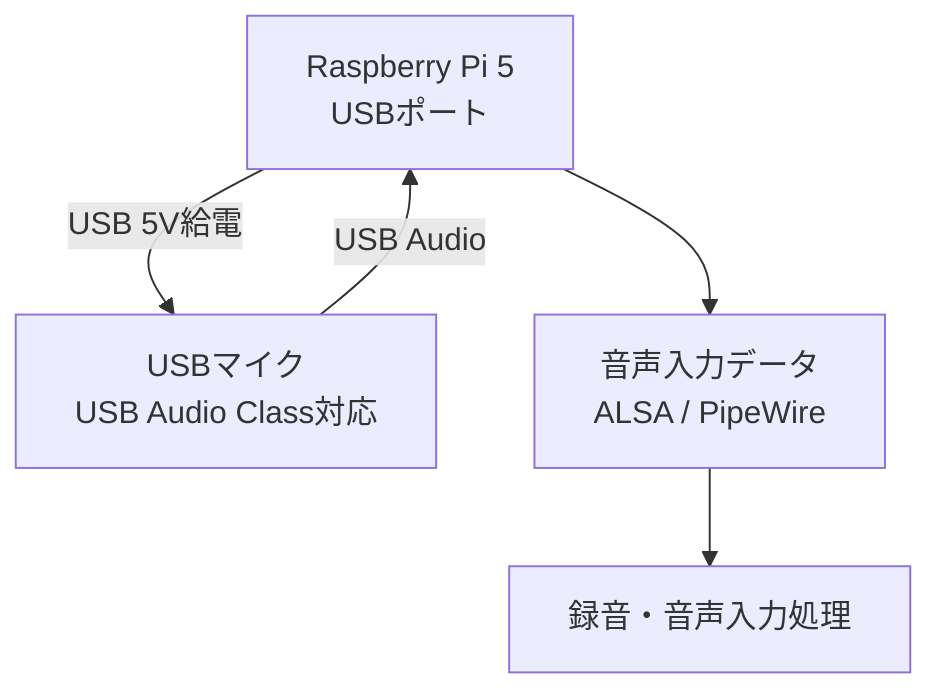

| 項目 | 設計内容 |
| --- | --- |
| 接続先 | Raspberry Pi 5のUSBポート |
| 通信方式 | USB Audio Class 1.0または2.0 |
| 電源 | USB 5V。車体側12Vを直接接続しない |
| 音声入力 | モノラルまたはステレオ。初期設計は48kHz / 16bit以上を目安とする |
| OS側の扱い | ALSAまたはPipeWireの音声入力デバイスとして扱う |
| GPIO接続 | 使用しない |
| 用途 | 音声入力、録音、将来の音声認識。具体的な機能割り当てはソフトウェア設計で確定 |
| 型式 | T.B.D。USB Audio Class対応、車内ノイズ環境、マイク指向性、ケーブル長を確認して選定 |

設計上の注意点は以下とする。

- USBマイクがOS標準ドライバで認識できることを確認し、専用Windowsドライバを前提とする製品は採用しない。
- USB DAC、USB–OBD変換ケーブル、USBストレージなどと同時使用するため、USBポートの電源容量と帯域を確認する。
- マイクはスピーカーや冷却ファンから離して設置し、ハウリングと機械振動ノイズを抑える。
- 音声入力を録音する場合は、保存先、録音開始条件、個人情報の取り扱いをソフトウェア設計で定義する。

<a id="sec-44"></a>
### 4.4 周辺機器系

周辺機器系は、Raspberry Pi 5に接続する表示、入力、右カメラ、左カメラ、センサー、冷却などの外部機器を整理するブロックである。本章では、2.1のハードウェア構成図における「4.4 周辺機器系」ブロックの接続対象をまとめる。SSDは周辺機器ブロックではなく、メインコントローラ側のストレージとして扱い、OS起動領域と映像記録領域に使用する。右カメラと左カメラはRaspberry Pi 5標準のフレキケーブル用MIPIソケットへ接続する。前方カメラと後方カメラはサブコントローラ側の周辺機器として扱い、[4.6 サブコン周辺機器系](#sec-46)で定義する。

```mermaid
flowchart LR
    Pi5["Raspberry Pi 5"]

    subgraph DisplayInput["映像・入力"]
        Display["タッチパネルディスプレイ"]
    end

    subgraph CameraRecord["カメラ"]
        RightCamera["右カメラ<br/>Pi 5 MIPI"]
        LeftCamera["左カメラ<br/>Pi 5 MIPI"]
    end

    subgraph SensorBlock["センサー"]
        GPS["GPSモジュール"]
        Sensor["センサー入力"]
        TPMS["BLE TPMS<br/>タイヤ空気圧<br/>T.B.D"]
    end

    subgraph CoolingBlock["冷却"]
        Fan["PWMファン x2"]
    end

    Pi5 -->|HDMI| Display
    Pi5 -->|USBタッチ入力| Display
    Pi5 -->|フレキケーブル<br/>MIPI| RightCamera
    Pi5 -->|フレキケーブル<br/>MIPI| LeftCamera
    Pi5 -->|UART / USB| GPS
    Pi5 -->|I2C / GPIO| Sensor
    Pi5 -.->|BLE候補<br/>将来拡張| TPMS
    Pi5 -->|PWM GPIO| Fan
```

| ブロック | 接続方式 | 役割 | 設計状態 |
| --- | --- | --- | --- |
| 映像・入力 | HDMI、USB | タッチパネルディスプレイへの映像出力とタッチ入力を扱う | 基本開発対象 |
| カメラ | フレキケーブル、MIPI | 右/左カメラ映像の取得を扱う。前方/後方カメラはサブコントローラ側で取得し、映像記録はメインコントローラ側SSDへ保存する | 一部セカンド開発 |
| センサー | UART、USB、I2C、GPIO、BLE | GPS、加速度、温度、タイヤ空気圧などの外部情報を取得する | T.B.D |
| 冷却 | PWM GPIO | Raspberry Pi 5および筐体内の温度上昇を抑える | 基本開発対象 |

設計上の注意点は以下とする。

- 周辺機器のUSB消費電流を合算し、Raspberry Pi 5本体のUSB給電能力を超えないようにする。タッチパネルディスプレイの表示用電源は、Pi 5本体USBではなく専用のUSB電源入力から供給する。
- 右カメラと左カメラはRaspberry Pi 5標準のフレキケーブル用MIPIソケットへ接続する。実装時はPi 5の2本のMIPIソケット割り当て、カメラモジュールの対応、ケーブル向き、ケーブル長を確認する。
- SSDはメインコントローラ側ストレージとして接続し、OS起動と録画保存の両方に使うため、電源容量と発熱を確認する。
- HDMI、USB、オーディオ信号線は、12V電源線、PWMファン配線、リレー配線から離して配線する。
- センサー系は拡張要素が多いため、使用機器が確定した段階でI2C、UART、GPIO、BLEの割り当てを再確認する。
- 冷却ファンはGPIO直結で電源駆動せず、トランジスタまたはMOSFETを介して制御する。

<a id="sec-441"></a>
#### 4.4.1 映像・入力

映像・入力ブロックは、Raspberry Pi 5の画面出力とユーザー操作入力を扱う。タッチパネルディスプレイはHDMIで映像を入力し、USBでタッチ操作をRaspberry Pi 5へ返す構成とする。ディスプレイ本体の電源は、Raspberry Pi 5の40ピンヘッダーではなく、タッチパネルディスプレイのUSB電源入力から5Vを供給する。

| 項目 | 内容 |
| --- | --- |
| 映像出力 | Raspberry Pi 5 HDMI |
| 操作入力 | USBタッチ入力 |
| 電源 | タッチパネルディスプレイのUSB電源入力から5V給電する。Raspberry Pi 5の40ピンヘッダー 5V/GNDは使用しない |
| 注意点 | HDMIケーブルとUSBケーブルは電源線やPWM配線から離して配線する |

<a id="sec-442"></a>
#### 4.4.2 カメラ

カメラブロックは、メインコントローラに接続する右カメラ、左カメラを扱う。右カメラと左カメラはRaspberry Pi 5標準のフレキケーブル用MIPIソケットへ接続し、取得した映像データはメインコントローラ側SSDへ保存する。前方カメラと後方カメラはサブコントローラ側の周辺機器として扱い、[4.6 サブコン周辺機器系](#sec-46)で定義する。

| 項目 | 内容 |
| --- | --- |
| 右カメラ | Raspberry Pi 5標準のフレキケーブル用MIPIソケットへ接続するカメラモジュールを候補とする |
| 左カメラ | Raspberry Pi 5標準のフレキケーブル用MIPIソケットへ接続するカメラモジュールを候補とする |
| 記録媒体 | メインコントローラ側SSDへ保存する |
| 注意点 | 右/左カメラの同時動作時はMIPIソケットの割り当て、カメラドライバ、ケーブル長、発熱を確認する。前方/後方カメラ映像はサブコントローラからEthernet経由で連携する |

<a id="sec-443"></a>
#### 4.4.3 センサー

センサーブロックは、GPS、加速度、温度、タイヤ空気圧などの外部情報を取得するための拡張領域である。使用センサーが確定するまではT.B.Dとし、GPIO、I2C、UART、USB、BLEの割り当ては実装段階で再確認する。

| 項目 | 内容 |
| --- | --- |
| GPS | UARTまたはUSB接続を候補とする |
| IMU | Raspberry Pi 5のGPIOヘッダへ接続し、I2CまたはSPIで加速度・角速度を取得する |
| 温度センサー | I2CまたはGPIO接続を候補とする |
| タイヤ空気圧センサー | BLE TPMSを候補とするが、市販品の入手性、技適、BLEデータ形式の確認が必要なため現時点ではT.B.Dとする |
| 設計状態 | T.B.D |

<a id="sec-4431"></a>
##### 4.4.3.1 IMU接続詳細

IMUは、車両の加速度と角速度を取得するための慣性計測センサーである。Raspberry Pi 5の40ピンGPIOヘッダへ接続し、GPIOヘッダ上のI2CまたはSPI信号を使用する。USB接続ではなく、GPIOヘッダ上の電源・グラウンド・通信信号を使用する構成とする。

```mermaid
flowchart TB
    Pi5["Raspberry Pi 5"]
    Header["40ピンGPIOヘッダ"]
    IMU["IMU<br/>加速度・角速度センサー"]
    Motion["加速度・角速度データ"]

    Pi5 --> Header
    Header -->|3.3V / GND| IMU
    Header <-->|I2C または SPI| IMU
    IMU --> Motion
```

| 項目 | 設計内容 |
| --- | --- |
| 接続先 | Raspberry Pi 5の40ピンGPIOヘッダ |
| 接続方式 | GPIOヘッダ上のI2CまたはSPI。採用方式はIMU型式決定時に確定 |
| 電源 | IMUの仕様に合わせた3.3Vまたは指定電圧。Pi 5のGPIOヘッダから供給する場合は電圧条件を確認する |
| グラウンド | Raspberry Pi 5のGPIOヘッダGNDへ接続する |
| 取得情報 | 3軸加速度、3軸角速度。必要に応じて姿勢角や温度も取得する |
| GPIO物理ピン番号 | T.B.D。既存のGPIO割り当てと競合しないピンを選定する |
| 用途 | GPS信号喪失時の現在地補正、車体の姿勢・振動状態の推定 |
| 設計状態 | 検討中。IMU型式と接続方式はセンサー選定後に確定 |

設計上の注意点は以下とする。

- IMUのロジック電圧が3.3Vに対応していることを確認し、5V信号をRaspberry Pi 5のGPIOへ入力しない。
- I2Cを使用する場合はSDA、SCLのプルアップ電圧と抵抗値を確認する。SPIを使用する場合はSCLK、MOSI、MISO、CSの割り当てを確定する。
- GPS、冷却ファン、ドアロック制御など既存のGPIO・I2C・SPI割り当てと競合しないよう、4.2.1 GPIO対応表へ反映してから実装する。
- IMUは車体に対する取付方向を固定し、前後・左右・上下の軸方向を設計書とソフトウェアで共通化する。
- 現在地補正への利用は、GPSのみで動作する初期構成を維持したうえで、IMU接続後に段階的に有効化する。

<a id="sec-4432"></a>
##### 4.4.3.2 タイヤ空気圧センサー

タイヤ空気圧センサーは、Raspberry Pi 5でタイヤ空気圧とタイヤ温度を取得する将来拡張機能である。現時点では、Pi 5で安定して読める市販BLE TPMSの入手性、技適、通信仕様が未確定のためT.B.Dとする。

初期実装では本機能を必須機能に含めず、カーナビ本体、電源、表示、音声、バックカメラ、冷却の基本機能を優先する。タイヤ空気圧監視が必要な場合は、専用モニター式TPMSまたは手動点検を併用し、Pi 5連携はセカンド開発で検討する。

BLE TPMSを採用する場合の検討方針を以下に示す。

| 項目 | 内容 |
| --- | --- |
| センサー方式 | BLE TPMS候補 |
| 取得対象 | タイヤ空気圧、タイヤ温度、センサー電池状態 |
| 接続方式 | Raspberry Pi 5内蔵Bluetooth、またはUSB BluetoothアダプタによるBLE受信 |
| GPIO使用 | 使用しない |
| 設計状態 | T.B.D |
| 配置候補 | 各タイヤのバルブキャップ型またはホイール内蔵型TPMS |
| 購入条件 | 技適または日本国内で適法に使用できること、BLE/スマホアプリ対応であること |
| 実装上の確認事項 | BLEアドバタイズ形式、センサーID、電池寿命、受信安定性、走行中の更新周期 |

```mermaid
flowchart LR
    TPMS_FL["左前 TPMS"]
    TPMS_FR["右前 TPMS"]
    TPMS_RL["左後 TPMS"]
    TPMS_RR["右後 TPMS"]
    Pi5["Raspberry Pi 5<br/>Bluetooth / BLE<br/>将来拡張"]
    App["タイヤ空気圧監視<br/>アプリケーション<br/>T.B.D"]

    TPMS_FL -.->|BLE| Pi5
    TPMS_FR -.->|BLE| Pi5
    TPMS_RL -.->|BLE| Pi5
    TPMS_RR -.->|BLE| Pi5
    Pi5 -->|空気圧 / 温度データ| App

    classDef sensor fill:#e8f5e9,stroke:#2e7d32,color:#111111
    classDef controller fill:#e3f2fd,stroke:#1565c0,color:#111111
    classDef app fill:#fff4dd,stroke:#cc9900,color:#111111

    class TPMS_FL,TPMS_FR,TPMS_RL,TPMS_RR sensor
    class Pi5 controller
    class App app
```

設計上の注意点は以下とする。

- BLE TPMSは現時点ではT.B.Dとし、基本開発の必須機能に含めない。
- BLE TPMSを採用する場合は、Raspberry Pi 5のGPIOへ接続せず、BLE無線で受信する。
- Raspberry Pi 5内蔵Bluetoothで受信が不安定な場合は、USB Bluetoothアダプタの追加を検討する。
- センサーごとにIDを固定管理し、左前、右前、左後、右後の取り違えを防止する。
- 空気圧の警告しきい値は、タイヤサイズ、車両指定空気圧、温度変化を考慮して決定する。
- BLE TPMSの通信仕様は製品ごとに異なるため、使用する製品が確定した段階で受信方式を確認する。
- スマートフォンアプリの改造、暗号化通信の回避、他車両センサーの受信、車両側機器への書き込みは行わない。

<a id="sec-444"></a>
#### 4.4.4 冷却

冷却ブロックは、Raspberry Pi 5および筐体内の温度上昇を抑えるためのファン制御を扱う。本設計では、筐体に収まる12V動作の4ピンPWMファンを1個使用する。

4ピンPWMファンの12V電源線とGND線は、Raspberry Pi 5の40ピンヘッダーへ接続しない。ファン本体は12Vで動作するため、12V電源線とGND線は12Vを供給できる拡張ボードまたは12V電源分岐へ接続する。Raspberry Pi 5へ接続するのは、ファン1台のPWM制御線とTACH/回転数フィードバック線のみとする。

| 項目 | 内容 |
| --- | --- |
| 冷却対象 | Raspberry Pi 5、電源回路、筐体内部 |
| ファン | 12V動作 4ピンPWMファン x1 |
| ファン電源 | 12Vピンは拡張ボードまたは12V電源分岐へ接続する |
| ファンGND | GNDピンは拡張ボードまたは12V電源分岐のGNDへ接続する |
| 制御信号 | 1台のファンのPWM制御線をRaspberry Pi 5のハードウェアPWM経路へ接続し、25kHzを初期値として制御する。4ピンPWM標準の許容範囲は21kHz-28kHz |
| フィードバック信号 | 同じファンのTACH/回転数フィードバック線をRaspberry Pi 5 GPIO入力へ接続する |
| 注意点 | ファン電源ラインにはノイズ対策を検討し、PWM/TACH信号は3.3V GPIO定格を超えないようにする |

4ピンPWMファンの接続割り当てを以下に示す。

| ファン | ファン端子 | 接続先 | Pi 5物理ピン / GPIO | 備考 |
| --- | --- | --- | --- | --- |
| 冷却ファン | 12V | 拡張ボード 12V出力、または12V電源分岐 | - | Raspberry Pi 5の5Vピンへ接続しない |
| 冷却ファン | GND | 拡張ボード GND、または12V電源分岐GND | - | Pi 5の信号GNDと共通基準になる位置で接続する |
| 冷却ファン | PWM制御 | PWM制御線 | 物理ピン12 / GPIO 18 | 25kHzを初期値とする。必要に応じてオープンドレイン駆動またはレベル変換を入れる |
| 冷却ファン | TACH/回転数フィードバック | Raspberry Pi 5 GPIO入力 | 物理ピン38 / GPIO 20 | 回転数監視用。必要に応じて3.3Vプルアップ、電流制限、ノイズ対策を入れる |

<a id="sec-4441"></a>
##### 4.4.4.1 冷却ファン回路図

冷却ファンは、1台の4ピンPWMファンを動作させる。PWM周波数は25kHzを初期値とし、21kHz-28kHzの範囲でファン仕様に合わせる。LinuxのハードウェアPWM経路を使用し、PWM制御線とTACH線をそれぞれRaspberry Pi 5へ接続する。

```mermaid
flowchart TB

    subgraph PowerRail["12V電源系"]
        P12["拡張ボード 12V出力"]
        PGND["拡張ボード GND"]
    end

    subgraph FanBlock["4ピンPWM冷却ファン"]
        Fan_12V["12V端子"]
        Fan_GND["GND端子"]
        Fan_PWM["PWM制御端子"]
        Fan_TACH["TACH端子"]
    end

    subgraph Pi5Block["Raspberry Pi 5"]
        PI_PWM["GPIO 18<br/>物理ピン12<br/>PWM出力"]
        PI_TACH["GPIO 20<br/>物理ピン38<br/>TACH入力"]
        PI_GND["GND端子"]
    end

    PWM_BUS["PWM制御線"]
    GND_BUS["共通GND"]

    P12 -->|12V| Fan_12V
    PGND --> GND_BUS
    GND_BUS --> Fan_GND
    GND_BUS --> PI_GND

    PI_PWM -->|PWM制御| PWM_BUS
    PWM_BUS --> Fan_PWM

    Fan_TACH -->|回転数フィードバック| PI_TACH

    classDef power fill:#fff3e0,stroke:#ef6c00,color:#111111
    classDef ground fill:#eeeeee,stroke:#616161,color:#111111
    classDef signal fill:#e3f2fd,stroke:#1565c0,color:#111111
    classDef fan fill:#e8f5e9,stroke:#2e7d32,color:#111111
    classDef unused fill:#f5f5f5,stroke:#9e9e9e,color:#616161

    class PowerRail,P12 power
    class PGND,GND_BUS,PI_GND,Fan_GND ground
    class Pi5Block,PI_PWM,PI_TACH,PWM_BUS signal
    class FanBlock,Fan_12V,Fan_PWM,Fan_TACH fan
```

| 配線 | 接続元 | 接続先 | 備考 |
| --- | --- | --- | --- |
| ファン電源 +12V | 拡張ボード 12V出力 | 冷却ファン12V端子 | Raspberry Pi 5の5Vピンから給電しない |
| ファン電源 GND | 拡張ボード GND | 冷却ファンGND端子、Pi 5 GND端子 | PWM/TACHの信号基準を合わせる |
| PWM制御信号 | Pi 5 GPIO 18 / 物理ピン12 | 冷却ファンPWM端子 | 1台の冷却ファンを制御する |
| TACH信号 | 冷却ファンTACH端子 | Pi 5 GPIO 20 / 物理ピン38 | 冷却ファンの回転数を取得する |

設計上の注意点は以下とする。

- 4ピンPWMファンのPWM制御線をGPIO 18 / 物理ピン12へ接続するハードウェアPWM経路で25kHzを初期値として制御する。
- 4ピンPWMファンのPWM周波数は21kHz未満に下げない。Linux PWM sysfsの実測波形が21kHz-28kHzに入ることを、ファン接続前に確認する。
- 4ピンPWMファンのPWM制御線は、ファン仕様により5Vプルアップ前提の場合がある。Raspberry Pi 5のGPIOは3.3V系のため、実機仕様に応じてオープンドレイン駆動またはレベル変換を検討する。
- TACH/回転数フィードバック線は、オープンコレクタ出力のファンが多い。Pi 5側で読む場合は、3.3Vへのプルアップとノイズ対策を検討し、5Vや12VがGPIOへ入らないようにする。
- ファンの12V電源電流はRaspberry Pi 5から供給しない。拡張ボードまたは12V電源分岐の電流容量、配線太さ、ヒューズ定格を確認する。
- ファン電源GNDとPi 5信号GNDは共通基準が必要だが、大電流GNDと信号GNDが大きなループを作らないよう、合流位置を整理する。
- PWM配線とTACH配線はノイズを拾いやすいため、12V電源線やオーディオ信号線と長距離で並走させない。

<a id="sec-45"></a>
### 4.5 サブ制御・入出力系

サブ制御・入出力系は、Raspberry Pi 3Bを用いたサブコントローラ群を中心に、メインコントローラから切り離したカメラ入力と車体側信号入力を扱うための制御ブロックである。サブコントローラ1は後方カメラとバックギア信号を担当し、サブコントローラ2は前方カメラと左右ウィンカー信号を担当する。どちらもメインコントローラであるRaspberry Pi 5とはEthernetケーブルで接続し、映像データ、車体側信号状態、制御状態を相互にやり取りする。

```mermaid
flowchart LR
    MainPi["メインコントローラ<br/>Raspberry Pi 5"]
    SubPi1["サブコントローラ1<br/>Raspberry Pi 3B<br/>後方系"]
    SubPi2["サブコントローラ2<br/>Raspberry Pi 3B<br/>前方系"]
    ReverseInput["バックギア信号入力<br/>3.3V GPIO"]
    TurnInput["左右ウィンカー信号入力<br/>3.3V GPIO"]
    RearCameraIf["後方カメラI/F<br/>フレキケーブル"]
    FrontCameraIf["前方カメラI/F<br/>フレキケーブル"]

    MainPi <-->|Ethernet<br/>後方映像 / バックギア状態| SubPi1
    MainPi <-->|Ethernet<br/>前方映像 / ウィンカー状態| SubPi2
    ReverseInput -->|GPIO入力| SubPi1
    RearCameraIf <-->|映像入力| SubPi1
    TurnInput -->|GPIO入力| SubPi2
    FrontCameraIf <-->|映像入力| SubPi2
```

| 項目 | 内容 |
| --- | --- |
| サブコントローラ1 | Raspberry Pi 3B。後方カメラとバックギア信号を担当する |
| サブコントローラ2 | Raspberry Pi 3B。前方カメラと左右ウィンカー信号を担当する |
| メイン連携 | それぞれRaspberry Pi 5とEthernetケーブルで接続し、相互情報のやり取りを行う |
| 入力信号 | バックギア信号、左ウィンカー信号、右ウィンカー信号を入力保護回路経由で3.3V GPIO信号として受信する |
| カメラ接続 | 後方カメラと前方カメラを、それぞれ担当サブコントローラへフレキケーブルで接続する |
| 主な役割 | 車体側信号検知、カメラ映像取得、メインコントローラへの状態・映像連携 |

設計上の注意点は以下とする。

- バックギア信号、左ウィンカー信号、右ウィンカー信号はRaspberry Pi 5へ直接入力しない。担当サブコントローラ側GPIOで受信し、Raspberry Pi 5へはEthernet経由で状態通知する。
- 車体側12V信号はサブコントローラGPIOへ直接入力せず、[4.1.4.1 共通車体12V信号入力回路](#sec-4141)を通して3.3V信号へ変換する。
- 前方カメラ、後方カメラ、バックギア信号、左右ウィンカー信号など、サブコントローラに接続する周辺機器の詳細は[4.6 サブコン周辺機器系](#sec-46)で定義する。
- Ethernet連携では、信号状態通知と映像データの転送を分けて設計し、表示切替遅延が大きくならないようにする。

<a id="sec-46"></a>
### 4.6 サブコン周辺機器系

サブコン周辺機器系は、サブコントローラであるRaspberry Pi 3Bに接続する周辺機器を整理するブロックである。本設計では、サブコントローラ1に後方カメラとバックギア信号を接続し、サブコントローラ2に前方カメラと左右ウィンカー信号を接続する。メインコントローラであるRaspberry Pi 5とはEthernetケーブルで接続し、映像データ、車体側信号状態、制御状態を相互にやり取りする。

```mermaid
flowchart LR
    ReverseSignal["バックギア信号<br/>車体側12V"]
    TurnSignalL["左ウィンカー信号<br/>車体側12V"]
    TurnSignalR["右ウィンカー信号<br/>車体側12V"]
    ReverseProtect["バックランプ入力保護<br/>12V → 3.3V"]
    TurnProtectL["左ウィンカー入力保護<br/>12V → 3.3V"]
    TurnProtectR["右ウィンカー入力保護<br/>12V → 3.3V"]
    SubPi1["サブコントローラ1<br/>Raspberry Pi 3B<br/>後方系"]
    SubPi2["サブコントローラ2<br/>Raspberry Pi 3B<br/>前方系"]
    RearCamera["後方カメラ"]
    FrontCamera["前方カメラ"]
    MainPi["メインコントローラ<br/>Raspberry Pi 5"]

    ReverseSignal -->|12V信号| ReverseProtect
    TurnSignalL -->|12V信号| TurnProtectL
    TurnSignalR -->|12V信号| TurnProtectR
    ReverseProtect -->|3.3V GPIO信号| SubPi1
    TurnProtectL -->|3.3V GPIO信号| SubPi2
    TurnProtectR -->|3.3V GPIO信号| SubPi2
    RearCamera <-->|フレキケーブル<br/>後方映像入力| SubPi1
    FrontCamera <-->|フレキケーブル<br/>前方映像入力| SubPi2
    SubPi1 <-->|Ethernet<br/>後方映像 / バックギア状態| MainPi
    SubPi2 <-->|Ethernet<br/>前方映像 / ウィンカー状態| MainPi
```

| 項目 | 接続先 | 接続方式 | 役割 |
| --- | --- | --- | --- |
| 後方カメラ | サブコントローラ1 Raspberry Pi 3B | フレキケーブル | 後方映像をサブコントローラ1で取得する |
| バックギア信号 | サブコントローラ1 Raspberry Pi 3B GPIO | 共通車体12V信号入力回路経由 | リバースギア投入状態をサブコントローラ1で検知する |
| 前方カメラ | サブコントローラ2 Raspberry Pi 3B | フレキケーブル | 前方映像をサブコントローラ2で取得する |
| 左ウィンカー信号 | サブコントローラ2 Raspberry Pi 3B GPIO | 共通車体12V信号入力回路経由 | 左ウィンカー状態をサブコントローラ2で検知する |
| 右ウィンカー信号 | サブコントローラ2 Raspberry Pi 3B GPIO | 共通車体12V信号入力回路経由 | 右ウィンカー状態をサブコントローラ2で検知する |
| メインコントローラ連携 | Raspberry Pi 5 | Ethernet | 映像データ、車体側信号状態、制御状態を相互連携する |

設計上の注意点は以下とする。

- バックギア信号、左ウィンカー信号、右ウィンカー信号はRaspberry Pi 5のGPIOへ接続しない。担当サブコントローラ側GPIOで受信し、Raspberry Pi 5へはEthernet経由で状態通知する。
- 前方カメラと後方カメラは担当サブコントローラへフレキケーブルで接続する。実装時はRaspberry Pi 3Bのカメラインターフェース、対応カメラ、ケーブル向き、ケーブル長を確認する。
- バックギア信号と左右ウィンカー信号は車体側12V信号のため、Raspberry Pi 3B GPIOへ直接入力しない。[4.1.4.1 共通車体12V信号入力回路](#sec-4141)を通して3.3V信号へ変換する。
- 前方/後方映像をリアルタイム表示する場合は、サブコントローラ側の映像取得遅延、Ethernet転送遅延、メインコントローラ側の表示切替遅延を合わせて確認する。

<a id="sec-5"></a>
## 5. 録画仕様
- **フォーマット**: H.264 (MPEG-4 AVC) コーデック、MP4 コンテナ
- **ビットレート**: 5Mbps ～ 8Mbps（1080p/30fps の場合）
- **記録先**: メインコントローラ側SSD（OS起動領域と映像記録領域を兼用、500GB ～ 1TB 推奨）
- **記録期間**: 
  - 通常モード: 8GB/時間 ペースで、500GB SSD なら約 60 時間分
  - ループ録画機能で容量 80% に達したら古い映像を自動削除

<a id="sec-6"></a>
## 6. 操作・表示機能
- **カメラプレビュー**: タッチディスプレイで前方/後方の映像を表示切替可能
- **映像確認**: 日時・GPS 座標を表示、対象映像の確認・エクスポート
- **衝撃検知**: 内蔵加速度センサーで衝撃検知（改造オプション）、検知時は ±10秒間のロック録画実施
- **GPS タイムスタンプ**: 各フレームに GPS 取得時刻と位置情報を付加

<a id="sec-7"></a>
## 7. 今後の拡張検討
