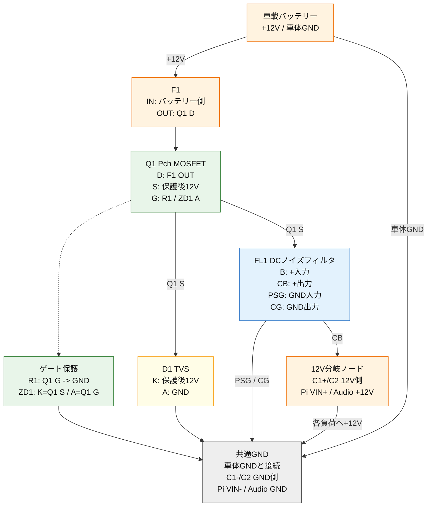

# 付録3: 12V共通入力保護 接続図

本付録では、[4.1.2 12V共通入力保護](ハードウェア設計書.md#sec-412)の回路を、実際の配線時に確認しやすいように端子名ベースで整理する。

物理ピン番号や端子の並びは部品型番、パッケージ、基板の向きによって変わる。そのため、本付録では「どの機能端子をどこへ接続するか」を示し、実装時は必ず各部品のデータシート、刻印、基板シルクで物理ピンを確認する。

## 1. 対象回路

12V共通入力保護回路は、車載バッテリーから入る常時12Vを、Raspberry Pi 5系とオーディオ系へ分岐する前に保護する回路である。

主な構成部品は以下とする。

| 記号 | 部品 | 役割 |
| --- | --- | --- |
| F1 | 入力ヒューズ | カーナビ内部配線の短絡・過電流保護 |
| Q1 | PチャネルMOSFET | 逆接続保護 |
| R1 | ゲートプルダウン抵抗 | Q1のゲートをGND側へ落として通常接続時にONさせる |
| ZD1 | ゲート保護ツェナー | Q1のゲート-ソース間電圧を保護する |
| D1 | 12V用TVSダイオード | サージ電圧をGNDへ逃がす |
| FL1 | DCノイズフィルタ | 電源ラインのノイズを低減する |
| C1 | 入力電解コンデンサ | 12Vラインの低周波変動を吸収する |
| C2 | 入力セラミックコンデンサ | 12Vラインの高周波ノイズをGNDへ逃がす |

## 2. 接続の全体像

```text
車載バッテリー +12V
  |
  +-- 車体側メインヒューズ
        |
        +-- F1 入力側
              |
              +-- F1 出力側
                    |
                    +-- Q1 D
                          |
                          +-- Q1 S ---- 逆接保護後12Vノード ---- FL1 B
                          |                                      |
                          |                                      +-- FL1 CB ---- 12V分岐ノード
                          |                                                        |
                          |                                                        +-- Pi 5 PD電源拡張ボード VIN+
                          |                                                        |
                          |                                                        +-- オーディオ分岐保護 +12V入力
                          |                                                        |
                          |                                                        +-- C1 + / C2 12V側
                          |
                          +-- Q1 G ---- R1 ---- 共通GND
                                   |
                                   +-- ZD1 A

Q1 S ---- ZD1 K

逆接保護後12Vノード ---- D1 K
共通GND ---------------- D1 A

車体GND ---- 共通GND ---- FL1 PSG
共通GND ---------------- FL1 CG
共通GND ---------------- C1 - / C2 GND側
共通GND ---------------- Pi 5 PD電源拡張ボード VIN-
共通GND ---------------- オーディオ分岐保護 GND
```

上図では、単方向TVSおよび単方向ツェナーを前提に、`K`をカソード、`A`をアノードとして表記する。双方向TVSを使用する場合、D1には極性がない。

## 3. 部品ごとの接続表

### 3.1 F1 入力ヒューズ

| F1端子 | 接続先 | 配線名 | 注意 |
| --- | --- | --- | --- |
| 入力側 | 車体側メインヒューズ後の常時12V | バッテリー12V入力 | バッテリーに近い側から保護する |
| 出力側 | Q1のD端子 | F1後12V | Q1より前段の短絡もF1で保護する |

### 3.2 Q1 逆接続保護MOSFET

PチャネルMOSFETを用いた逆接続保護では、通常動作時にボディダイオード経由で起動し、その後MOSFETがONして電圧降下を小さくする。ここではハイサイド逆接続保護として、以下の接続を基本とする。

| Q1端子 | 接続先 | 配線名 | 注意 |
| --- | --- | --- | --- |
| D | F1出力側 | F1後12V | バッテリー側、入力側に接続する |
| S | 逆接保護後12Vノード | 保護後12V | 後段のTVS、ノイズフィルタ、分岐側へ接続する |
| G | R1とZD1アノード | Q1ゲート | GNDへ直結せず、R1を介してGNDへ落とす |

Q1の端子は、同じTO-220形状でも型番により並びが異なる場合がある。必ず使用部品のデータシートで`G/D/S`の物理ピンを確認する。

### 3.3 R1 ゲートプルダウン抵抗

| R1端子 | 接続先 | 配線名 | 推奨値 |
| --- | --- | --- | --- |
| 片側 | Q1のG端子 | Q1ゲート | 100kΩ程度 |
| 反対側 | 共通GND | 共通GND | 車体GNDと同電位のGNDへ接続する |

R1はQ1のゲートをGND側へ引き下げ、通常の正しいバッテリー接続時にPチャネルMOSFETをONさせるために使用する。ゲートをGNDへ直結すると、ゲート-ソース間電圧が大きくなりすぎる可能性があるため、ゲート保護ツェナーZD1と組み合わせる。

### 3.4 ZD1 ゲート保護ツェナー

| ZD1端子 | 接続先 | 配線名 | 推奨値 |
| --- | --- | --- | --- |
| K カソード | Q1のS端子 | 保護後12V | Q1ソース側へ接続する |
| A アノード | Q1のG端子 | Q1ゲート | Q1ゲート側へ接続する |

ZD1はQ1のゲート-ソース間電圧を制限する。12V車載電源では、15V程度のツェナーを目安にする。MOSFETの絶対最大定格`Vgs`を超えないように選定する。

一般的なリード型ツェナーダイオードでは、白色または銀色の帯マークが付いている側がカソード`K`である。本回路では、帯マーク側をQ1のS端子、帯マークがない側をQ1のG端子へ接続する。実装前に使用部品のデータシートでマーキングを確認する。

### 3.5 D1 12V用TVSダイオード

| D1端子 | 接続先 | 配線名 | 注意 |
| --- | --- | --- | --- |
| K カソード | 逆接保護後12Vノード | 保護後12V | 単方向TVSの場合は12V側へ接続する |
| A アノード | 共通GND | 共通GND | GND配線は短く太くする |

D1はQ1後段の12Vラインに入ったサージをGNDへ逃がす。ヒューズF1と組み合わせて保護が成立するため、D1だけを単独で過電流保護部品として扱わない。

### 3.6 FL1 DCノイズフィルタ

Murata BNX016-01のように`B`、`CB`、`PSG`、`CG`端子を持つDCノイズフィルタを想定する。

| FL1端子 | 接続先 | 配線名 | 電流の流れ |
| --- | --- | --- | --- |
| B | 逆接保護後12Vノード | フィルタ入力+ | 12V入力電流が流れる |
| CB | 12V分岐ノード | フィルタ出力+ | 後段負荷へ向かう12V電流が流れる |
| PSG | 車体GND / 入力側GND | 入力側GND | 後段負荷の戻り電流が流れる |
| CG | 共通GND / 出力側GND | 出力側GND | 後段負荷の戻り電流が流れる |

FL1の`B`と`CB`は12Vプラスライン側、`PSG`と`CG`はGND側として扱う。負荷電流は、プラス側では`B -> CB -> 負荷`、GND側では`負荷 -> CG -> PSG -> 車体GND`の向きで戻る。

### 3.7 C1 入力電解コンデンサ

| C1端子 | 接続先 | 配線名 | 推奨値 |
| --- | --- | --- | --- |
| + | 12V分岐ノード | 保護後12V | 1000uF程度、25V以上、105℃品 |
| - | 共通GND | 共通GND | 極性を逆にしない |

C1はFL1後段、つまり12V分岐ノードと共通GNDの間に並列接続する。

### 3.8 C2 入力セラミックコンデンサ

| C2端子 | 接続先 | 配線名 | 推奨値 |
| --- | --- | --- | --- |
| 片側 | 12V分岐ノード | 保護後12V | 0.1uF + 1uF程度、25V以上、X7R系 |
| 反対側 | 共通GND | 共通GND | C1と並列に配置する |

C2は高周波ノイズをGNDへ逃がすため、C1と同じく12V分岐ノードと共通GNDの間に並列接続する。

### 3.9 後段負荷への分岐

| 接続先 | +側接続 | -側接続 | 注意 |
| --- | --- | --- | --- |
| Pi 5 PD電源拡張ボード | 12V分岐ノード -> VIN+ | VIN- -> 共通GND | Pi 5本体へは拡張ボードからUSB Type-Cで給電する |
| オーディオ分岐保護 | 12V分岐ノード -> オーディオ分岐入力 | オーディオGND -> 共通GND | 分岐後に4.1.6.1のヒューズ、リレー、フィルタを配置する |
| その他12V補助回路 | 12V分岐ノード -> 補助回路VIN+ | 補助回路GND -> 共通GND | 使用電流を合計してF1、Q1、FL1の定格に反映する |

## 4. 端子接続図

以下の図は、上段を`+12V系配線`、下段を`GND系配線`として読む。各部品の端子名を図中に入れ、どの端子からどの端子へ配線するかを追いやすくする。

```text
+12V系配線
==========

  車載バッテリー +12V
          |
          v
  車体側メインヒューズ
          |
          v
  +------------------------+
  | F1 入力ヒューズ         |
  | IN  <---- バッテリー側 |
  | OUT ----> Q1 D         |
  +------------------------+
          |
          v
  +------------------------------------------------+
  | Q1 PチャネルMOSFET 逆接続保護                  |
  |                                                |
  | D  <---- F1 OUT                               |
  | S  ----> 逆接保護後12Vノード                  |
  | G  ----> R1 ----> 共通GND                     |
  |                                                |
  | ZD1: K側をQ1 Sへ / A側をQ1 Gへ接続            |
  +------------------------------------------------+
          |
          v
  逆接保護後12Vノード
          |
          +---- D1 TVS K側
          |          D1 A側 ----> 共通GND
          |
          v
  +------------------------------------------------+
  | FL1 DCノイズフィルタ                           |
  |                                                |
  | B   <---- 逆接保護後12Vノード                 |
  | CB  ----> 12V分岐ノード                       |
  | PSG <---- 車体GND / 入力側GND                 |
  | CG  ----> 共通GND / 出力側GND                 |
  +------------------------------------------------+
          |
          v
  12V分岐ノード
          |
          +---- C1 +       C1 - ----> 共通GND
          |
          +---- C2 12V側   C2 GND側 -> 共通GND
          |
          +---- Pi 5 PD電源拡張ボード VIN+
          |          Pi 5 PD電源拡張ボード VIN- -> 共通GND
          |
          +---- オーディオ分岐保護 +12V入力
                     オーディオ分岐保護 GND ----> 共通GND


GND系配線
=========

  車体GND
     |
     +---- 共通GND
             |
             +---- R1 反対側
             |
             +---- D1 A側
             |
             +---- FL1 PSG
             |
             +---- FL1 CG
             |
             +---- C1 -
             |
             +---- C2 GND側
             |
             +---- Pi 5 PD電源拡張ボード VIN-
             |
             +---- オーディオ分岐保護 GND
```

主要な電流の流れは以下の通りである。

```text
プラス側:
車載バッテリー +12V
  -> F1
  -> Q1 D
  -> Q1 S
  -> FL1 B
  -> FL1 CB
  -> 12V分岐ノード
  -> Pi 5系 / オーディオ系

マイナス側:
Pi 5系 / オーディオ系 GND
  -> 共通GND
  -> FL1 CG / PSG
  -> 車体GND
  -> 車載バッテリー -
```

全体の関係をブロックとして見る場合は、以下の図を使用する。



## 5. 導通チェックの目安

電源投入前に、バッテリーやPi 5を接続しない状態で確認する。

| 測定箇所 | 正常時の目安 | 異常時に疑う箇所 |
| --- | --- | --- |
| 12V分岐ノード - 共通GND | C1の充電で一瞬低く見えることはあるが、安定して低抵抗にはならない | D1の短絡、C1極性逆、C2短絡、FL1誤配線、後段負荷の短絡 |
| FL1 B - FL1 CB | フィルタの直流経路として低抵抗になる | 開放ならFL1破損または端子誤認 |
| FL1 PSG - FL1 CG | GND経路として低抵抗になる | 開放ならFL1破損または端子誤認 |
| FL1 B - FL1 PSG | フィルタ単体では低抵抗にならない | 低抵抗ならB/PSG誤配線、部品破損、後段短絡 |
| Q1 D - Q1 S | 回路内測定では見え方が変わる。0Ω固定は避ける | MOSFET破損、端子誤認、はんだブリッジ |
| D1 K - D1 A | 通常は短絡しない | TVS破損、向き違い、はんだブリッジ |

12Vラインと共通GNDの間が12Ω程度に見える場合、12V印加時に約1A流れる可能性がある。ヒューズが飛ぶ、配線が発熱する、部品が破損するおそれがあるため、バッテリーへ接続する前に後段負荷、D1、C1、C2、FL1を順番に切り離して短絡箇所を特定する。

## 6. 試作時の投入手順

1. Pi 5、Pico、オーディオアンプを接続しない。
2. F1を外した状態で、12Vラインと共通GND間の抵抗を測定する。
3. F1を入れても低抵抗にならないことを確認する。
4. バッテリー直結ではなく、電流制限付き電源を100mAから500mA程度に制限して入力する。
5. Q1のD、S、G電圧、FL1のB、CB、PSG、CG電圧を測る。
6. 12V分岐ノードが正常であることを確認してから、Pi 5 PD電源拡張ボード、オーディオ分岐の順に接続する。

初回投入時は、車両バッテリーへ直接接続せず、必ずヒューズと電流制限を併用する。
