# コペン専用カーナビ ソフトウェア設計図

## 目次
- [1. 概要](#sec-1)
- [2. ソフトウェア全体構成](#sec-2)
  - [2.1 ソフトウェア構成図](#sec-21)
  - [2.2 実行環境](#sec-22)
- [3. コントローラ別責務](#sec-3)
  - [3.1 メインコントローラ Raspberry Pi 5](#sec-31)
  - [3.2 サブコントローラ群 Raspberry Pi 3B](#sec-32)
  - [3.3 電源管理 Raspberry Pi Pico](#sec-33)
- [4. 主要機能設計](#sec-4)
  - [4.1 電源制御](#sec-41)
  - [4.2 カメラ表示・録画](#sec-42)
    - [4.2.1 カメラ入力構成](#sec-421)
    - [4.2.2 ドライブレコーダー録画処理](#sec-422)
    - [4.2.3 Google Driveアップロード処理](#sec-423)
    - [4.2.4 アップロード後のローカル削除](#sec-424)
    - [4.2.5 異常時の処理](#sec-425)
  - [4.3 サラウンドビュー](#sec-43)
  - [4.4 バックカメラ表示制御](#sec-44)
  - [4.5 車両情報取得](#sec-45)
  - [4.6 ドアロック制御](#sec-46)
  - [4.7 冷却ファン制御](#sec-47)
  - [4.8 オーディオ制御](#sec-48)
  - [4.9 Waydroid + OsmAndオフラインナビ](#sec-49)
  - [4.10 GPSロスト時現在地補正](#sec-410)
  - [4.11 Android Auto / LIVI連携](#sec-411)
  - [4.12 カーナビUI設計](#sec-412)
- [5. プロセス構成](#sec-5)
- [6. データ保存設計](#sec-6)
- [7. 通信設計](#sec-7)
- [8. 異常処理・安全設計](#sec-8)
- [9. 起動・終了シーケンス](#sec-9)
- [10. 実装ファイル構成](#sec-10)
- [11. T.B.D](#sec-11)
- [12. 自作ソフトウェア詳細設計](#sec-12)
- [付録1 Raspberry Pi 5へのWaydroid + OsmAnd導入手順](付録1_RaspberryPi5_Waydroid_OsmAnd導入手順.md)
- [付録5 L880K OBD2・K-Line初期化確認手順](付録5_L880K_OBD2_K-Line初期化手順.md)

<a id="sec-1"></a>
## 1. 概要

本設計図は、コペン専用カーナビシステムのソフトウェア構成、制御処理、通信、データ保存、異常処理について記載する。

ハードウェア構成は、[ハードウェア設計書](../HW設計/ハードウェア設計書.md)に記載された構成を前提とする。メインコントローラにRaspberry Pi 5、サブコントローラ1とサブコントローラ2にRaspberry Pi 3B、電源管理にRaspberry Pi Picoを使用する。

本システムのソフトウェアは、ナビ表示、カメラ表示、ドライブレコーダー録画、Google Driveへの録画アップロード、車両情報取得、電源制御、冷却制御、オーディオ制御を扱う。ただし、サラウンドビュー、ドアロック制御、BLE TPMSなどの一部機能は、実装難易度や安全確認が必要なため段階開発とする。

ナビ機能は、Raspberry Pi 5上のWaydroidでAndroid向けOsmAndを実行し、事前保存した地図を用いてオフラインで動作させる。GPS取得とセンサーによる現在地補正はLinux側で行い、Android側へ位置情報を渡す連携処理を設計する。

<a id="sec-2"></a>
## 2. ソフトウェア全体構成

ソフトウェアは、Raspberry Pi 5を中心に構成する。サブコントローラ1は後方カメラとバックギア信号を担当し、サブコントローラ2は前方カメラと左右ウィンカー信号を担当する。各サブコントローラはRaspberry Pi 5とEthernetで連携する。Raspberry Pi PicoはACC状態を監視し、Raspberry Pi 5の起動・シャットダウンを制御する。

<a id="sec-21"></a>
### 2.1 ソフトウェア構成図

ソフトウェア構成図は、1枚の図に全情報を詰め込まず、以下の観点で分けて記載する。

- 全体接続図: 各コントローラ間で何をやり取りするかを示す。
- レイヤ構成図: 各コントローラ内部で、ユーザ空間、カーネル部、OS / 実行環境のどこにソフトウェアが配置されるかを示す。
- 詳細な処理順序は、必要に応じて各機能章のシーケンス図で示す。

#### 全体接続図

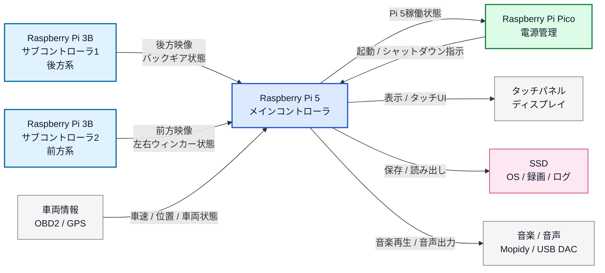

#### レイヤ構成図

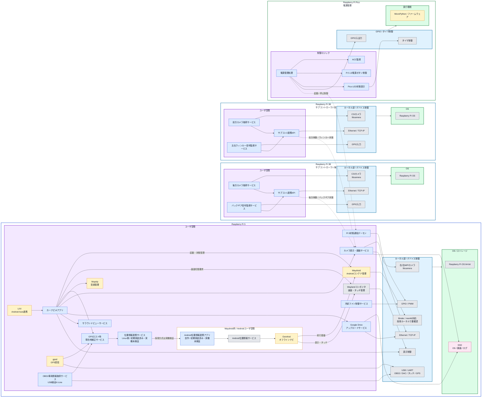

レイヤ構成図は、Raspberry Pi 5、Raspberry Pi 3Bサブコントローラ1、Raspberry Pi 3Bサブコントローラ2、Raspberry Pi Picoの装置単位でブロックを分けて読む。各ブロック内は、上からユーザ空間ソフト、カーネル部 / デバイス制御層、OS / 実行環境の順に配置する。主要ソフトウェアは1ソフトにつき1ブロックで記載する。Raspberry Pi PicoはLinux OSを持たないため、最下段をMicroPython / ファームウェアとして扱う。

OsmAndとAndroid位置情報連携アプリはWaydroid内のAndroidユーザ空間で動作する。WaydroidはホストLinuxカーネルを共有するコンテナ方式であり、図のAndroid位置情報サービスはカーネルドライバではない。[Waydroid公式概要](https://docs.waydro.id/)

| 色分け | 意味 |
| --- | --- |
| 紫背景 | ユーザ空間で動作するソフトウェア層 |
| 水色背景 | カーネル部 / デバイス制御層 |
| 緑背景 | OS / 実行環境 |
| 青ノード | 本プロジェクトで作成する自作ソフト |
| 黄ノード | オープンソースソフト |
| 灰ノード | OS標準機能、ドライバ、標準I/F |
| 桃ノード | ストレージ / データ保存領域 |

<a id="sec-22"></a>
### 2.2 実行環境

| 装置 | OS / 実行環境 | 主な役割 |
| --- | --- | --- |
| Raspberry Pi 5 | Raspberry Pi OS 64-bit + Waylandを基本とする | メインUI、Waydroid管理、GPS取得・補正、録画、車両情報取得、サラウンドビュー、オーディオ、冷却制御 |
| Raspberry Pi 5内のAndroid環境 | Waydroid + ARM64対応Androidイメージ | OsmAnd、Android位置情報連携アプリ、音声案内 |
| Raspberry Pi 3B サブコントローラ1 | Raspberry Pi OS | 後方カメラ取得、バックギア信号監視、メインコントローラ連携 |
| Raspberry Pi 3B サブコントローラ2 | Raspberry Pi OS | 前方カメラ取得、左右ウィンカー信号監視、メインコントローラ連携 |
| Raspberry Pi Pico | MicroPython | ACC監視、Pi 5起動・シャットダウン制御、LED状態表示 |

Pi 5の採用OS・カーネルでWayland、Binder、およびashmemまたはmemfdの対応を確認する。本設計ではmemfd対応を基本とし、Androidイメージとの互換性、GPU描画、タッチ入力、音声出力、録画との同時動作を実機で検証してからバージョンを固定する。現時点ではWaydroidのPi 5上での動作検証は未完了とする。[Waydroid導入条件](https://docs.waydro.id/usage/install-on-desktops)、[カーネル要件](https://docs.waydro.id/debugging/getting-essential-information)

<a id="sec-3"></a>
## 3. コントローラ別責務

<a id="sec-31"></a>
### 3.1 メインコントローラ Raspberry Pi 5

Raspberry Pi 5は、ユーザーが直接操作するメイン処理を担当する。

| 機能 | 内容 |
| --- | --- |
| Android Auto連携 | LIVIをUIアプリの前段に配置し、スマートフォン連携画面を扱う |
| UI表示 | タッチパネルディスプレイにカーナビ画面を表示する |
| オフラインナビ | Waydroid内のAndroid向けOsmAndを使用し、ローカル地図データでナビゲーションを行う |
| 現在地補正 | GPS信号が失われた場合、OBD2やセンサー情報から位置を推定し、位置情報連携処理を介してAndroid側へ渡す |
| カメラ処理 | 右、左カメラをPi 5のMIPI入力で取得し、前方/後方映像を各サブコントローラからEthernet経由で受信する |
| 前後映像連携 | サブコントローラ1から後方映像、サブコントローラ2から前方映像をEthernet経由で受信する |
| ウィンカー状態連携 | サブコントローラ2から左右ウィンカー状態をEthernet経由で受信する |
| サラウンドビュー | 前後左右カメラを用いて駐車時のみ表示する |
| 録画保存 | メインコントローラ側SSDへ映像データを保存する |
| クラウド保存 | スマートフォンテザリング接続時に録画データをGoogle Driveへアップロードし、成功確認後にローカル削除する |
| OBD2取得 | K-Line対応USB–OBD変換ケーブルをUSBシリアルとして使用し、L880K ECUの車両情報を取得する |
| 冷却制御 | PWMファンを制御し、TACH信号を監視する |
| オーディオ制御 | USB DAC経由の音声出力を制御する |
| 電源状態通知 | OS稼働中であることをGPIOでRaspberry Pi Picoへ通知する |

<a id="sec-32"></a>
### 3.2 サブコントローラ群 Raspberry Pi 3B

Raspberry Pi 3Bは、メインコントローラから切り離したカメラ入力と車体側信号入力を担当する。サブコントローラ1は後方カメラとバックギア信号を扱い、サブコントローラ2は前方カメラと左右ウィンカー信号を扱う。どちらもEthernetでRaspberry Pi 5へ状態と映像を連携する。

| コントローラ | 担当 | 主なソフトウェア処理 |
| --- | --- | --- |
| サブコントローラ1 Raspberry Pi 3B | 後方系 | 後方カメラ取得、バックギア信号監視、後方映像送信、バックギア状態通知 |
| サブコントローラ2 Raspberry Pi 3B | 前方系 | 前方カメラ取得、左ウィンカー信号監視、右ウィンカー信号監視、前方映像送信、ウィンカー状態通知 |

| 機能 | 内容 |
| --- | --- |
| カメラ取得 | フレキケーブル接続された前方/後方カメラ映像を担当サブコントローラで取得する |
| 車体側信号監視 | 入力保護回路を通した3.3V GPIO信号としてバックギア、左ウィンカー、右ウィンカー状態を監視する |
| 状態通知 | バックギアON/OFF、左右ウィンカーON/OFFをRaspberry Pi 5へ通知する |
| 映像送信 | 前方/後方カメラ映像をRaspberry Pi 5へ送信する |
| 異常通知 | カメラ未接続、GPIO異常、通信断などを通知する |

<a id="sec-33"></a>
### 3.3 電源管理 Raspberry Pi Pico

Raspberry Pi PicoはACCとPi 5通知サービスのHIGHを監視し、J2電源ボタン接点を模擬操作する。LOWはOS停止完了ではないため、停止後の自動再起動は保留し、別途停止確認を必要とする。

| 状態 | Pico LED | 処理 |
| --- | --- | --- |
| RUNNING | 常灯 | 通知サービス稼働確認済み |
| BOOTING | ゆっくり点滅 | 起動通知待ち。ACC変化でも再押下しない |
| STOPPING | 速い点滅 | 停止要求後の通知解除待ち |
| STOPPED_CONFIRMED / ACC OFF | 消灯 | 別途停止確認済みの待機 |
| UNKNOWN / HALT_UNCONFIRMED / FAULT | 二重点滅 | 状態未確認または異常。J2自動再操作を禁止 |

<a id="sec-4"></a>
## 4. 主要機能設計

<a id="sec-41"></a>
### 4.1 電源制御

電源制御はRaspberry Pi PicoとPi 5状態通知デーモンで実現する。起動要求は保守者による停止確認・許可後に限定する。停止要求は通知HIGHが2秒安定したRUNNINGでACC OFFになった場合に1組だけ発行する。タイムアウトや停止要求後LOWは保持し、ACC変化で再操作しない。詳細は[13 Pi 5状態通知](詳細設計/13_Pi5状態通知.md)、[14 Pico電源管理](詳細設計/14_Pico電源管理.md)を参照する。

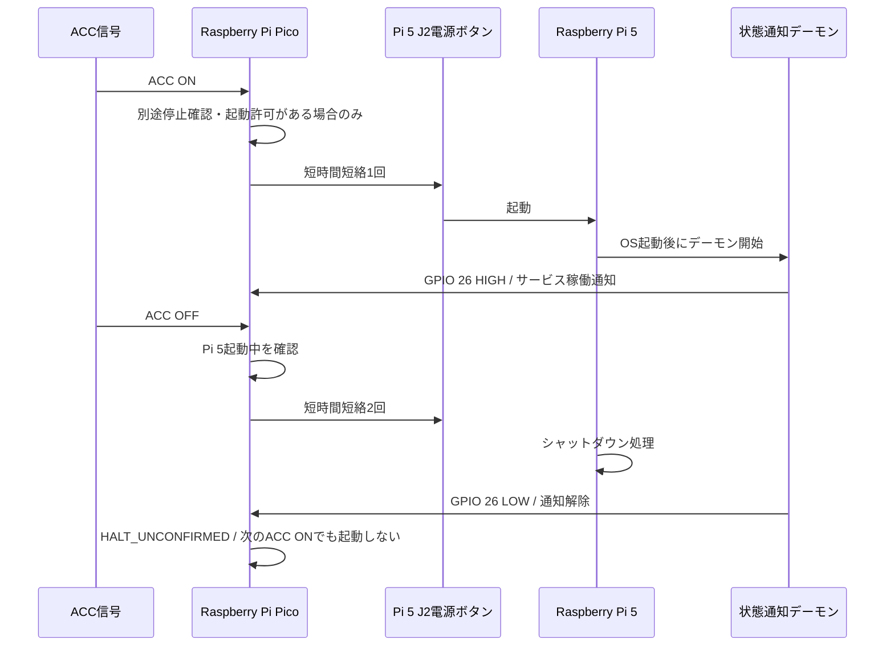

<a id="sec-42"></a>
### 4.2 カメラ表示・録画

カメラ表示・録画は、ドライブレコーダー機能としてRaspberry Pi 5側で統合管理する。右カメラと左カメラはRaspberry Pi 5標準のフレキケーブル用MIPIソケットから取得する。前方カメラはサブコントローラ2、後方カメラはサブコントローラ1で取得し、Raspberry Pi 5へEthernet経由で連携する。

録画データは一度メインコントローラ側SSDへ保存する。スマートフォンのテザリングによりインターネット接続が利用できる場合は、保存済み録画ファイルをGoogle Driveへ順次アップロードする。Google Driveへのアップロード完了が確認できた録画ファイルは、ローカルSSDから削除する。

<a id="sec-421"></a>
#### 4.2.1 カメラ入力構成

| カメラ | 接続先 | ソフトウェア上の扱い |
| --- | --- | --- |
| 前方カメラ | サブコントローラ2 Raspberry Pi 3B | Ethernet経由の映像入力 |
| 右カメラ | Raspberry Pi 5 | MIPIカメラ入力 |
| 左カメラ | Raspberry Pi 5 | MIPIカメラ入力 |
| 後方カメラ | サブコントローラ1 Raspberry Pi 3B | Ethernet経由の映像入力 |

| 入力 | 取得元 | 用途 |
| --- | --- | --- |
| 前方映像 | サブコントローラ2からEthernet受信 | 常時録画、サラウンドビュー、前方確認 |
| 後方映像 | サブコントローラ1からEthernet受信 | 常時録画、バックカメラ表示、サラウンドビュー |
| 右映像 | Raspberry Pi 5 MIPI入力 | 常時録画、サラウンドビュー、側方確認 |
| 左映像 | Raspberry Pi 5 MIPI入力 | 常時録画、サラウンドビュー、側方確認 |
| バックギア状態 | サブコントローラ1からEthernet受信 | 後方カメラ優先表示 |
| 左右ウィンカー状態 | サブコントローラ2からEthernet受信 | 側方表示、将来のウィンカー連動表示 |

<a id="sec-422"></a>
#### 4.2.2 ドライブレコーダー録画処理

ドライブレコーダー録画処理は、ACC ONからPi 5シャットダウン開始までを基本録画期間とする。録画ファイルは一定時間ごとに分割し、ファイル単位でアップロードおよび削除を管理する。

| 項目 | 設計内容 |
| --- | --- |
| 録画開始条件 | ACC ON後、Raspberry Pi 5のカメラサービス起動完了 |
| 録画終了条件 | ACC OFFによるシャットダウン準備、または明示的な録画停止 |
| 録画対象 | 前方、後方、右、左の4カメラ |
| 保存先 | メインコントローラ側SSD |
| ファイル分割 | 1分または3分単位を候補とする |
| ファイル形式 | MP4またはMKVを候補とする |
| 映像コーデック | H.264を基本候補とする |
| メタデータ | 録画開始時刻、終了時刻、カメラ種別、GPS位置、車速、アップロード状態 |
| ローカル管理 | 未アップロード、アップロード中、アップロード済み、削除済みの状態を管理する |

録画ファイル名の命名規則案を以下に示す。

```text
YYYYMMDD_HHMMSS_<camera>_<sequence>.mp4
```

| 項目 | 例 |
| --- | --- |
| 前方カメラ | `20260909_081500_front_0001.mp4` |
| 後方カメラ | `20260909_081500_rear_0001.mp4` |
| 右カメラ | `20260909_081500_right_0001.mp4` |
| 左カメラ | `20260909_081500_left_0001.mp4` |

<a id="sec-423"></a>
#### 4.2.3 Google Driveアップロード処理

Google Driveアップロード処理は、スマートフォンのテザリングによりRaspberry Pi 5がインターネットへ接続できる場合に実行する。録画中のファイルはアップロード対象にせず、分割録画が完了してクローズされたファイルのみをアップロード対象とする。

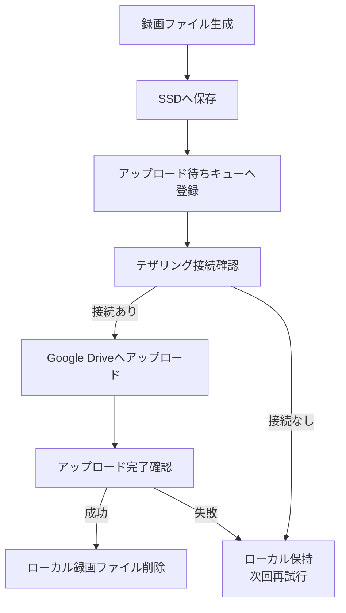

| 項目 | 設計内容 |
| --- | --- |
| 通信経路 | スマートフォンのテザリング |
| アップロード先 | Google Drive |
| アップロード対象 | 録画完了済みの分割ファイル |
| アップロード順 | 古い録画ファイルから順次アップロードする |
| 再試行 | 通信断、認証エラー、容量不足時は削除せず再試行対象として保持する |
| 認証情報 | Pi 5側に保存する。保存方式、暗号化、再認証手順はT.B.D |
| 実装方式 | Google Drive API v3の再開可能アップロード、Google OAuth認証、SQLite台帳による進捗管理 |

<a id="sec-424"></a>
#### 4.2.4 アップロード後のローカル削除

ローカル録画ファイルは、Google Driveへのアップロード完了が確認できた場合のみ削除する。録画中、アップロード中、アップロード失敗、アップロード確認不能のファイルは削除しない。

| 状態 | ローカルファイル削除 |
| --- | --- |
| 録画中 | 削除しない |
| アップロード待ち | 削除しない |
| アップロード中 | 削除しない |
| アップロード成功確認済み | 削除する |
| アップロード失敗 | 削除しない |
| Google Drive容量不足 | 削除しない |
| 通信断 | 削除しない |

削除処理は録画処理とは別のバックグラウンド処理として実行する。誤削除を防ぐため、アップロード処理と削除処理はファイル状態管理テーブルを介して連携する。

<a id="sec-425"></a>
#### 4.2.5 異常時の処理

| 異常 | 処理 |
| --- | --- |
| テザリング未接続 | ローカルSSDへ保存を継続し、アップロード待ちとして保持する |
| Google Drive認証失敗 | アップロードを停止し、ローカルファイルは削除しない |
| Google Drive容量不足 | アップロードを停止し、ローカルファイルは削除しない |
| SSD容量不足 | 古いアップロード済みファイルを優先削除する。アップロード済みファイルがない場合は警告し、録画停止または画質低下を検討する |
| サブコントローラ通信断 | 該当カメラの録画を停止し、通信断ログを保存する |
| カメラ未接続 | 該当カメラを無効化し、他カメラの録画を継続する |
| シャットダウン開始 | 録画中ファイルをクローズし、アップロード中断状態を記録してから終了する |

<a id="sec-43"></a>
### 4.3 サラウンドビュー

サラウンドビューは、前方、後方、右、左の4カメラ映像を用いて駐車支援表示を行う機能である。純正車レベルの自然な合成は難易度が高いため、本設計では段階開発とする。

| 段階 | 内容 | 設計状態 |
| --- | --- | --- |
| 1 | 4画面表示 | 初期実装候補 |
| 2 | 低解像度の簡易合成 | セカンド開発 |
| 3 | 歪み補正と俯瞰変換 | セカンド開発 |
| 4 | 境界補正を含む純正風合成 | T.B.D |

サラウンドビューは駐車時のみ使用する。走行中の表示は禁止し、車速または駐車状態の判定が取れない場合は表示しない。

| 条件 | 判定 |
| --- | --- |
| 車速 | OBD2またはGPS補助で0km/h相当 |
| バックギア | サブコントローラ1からEthernetで通知 |
| 左右ウィンカー | サブコントローラ2からEthernetで通知 |
| パーキングブレーキ | T.B.D |
| 表示許可 | 停止中かつ駐車支援として必要な場合のみ |

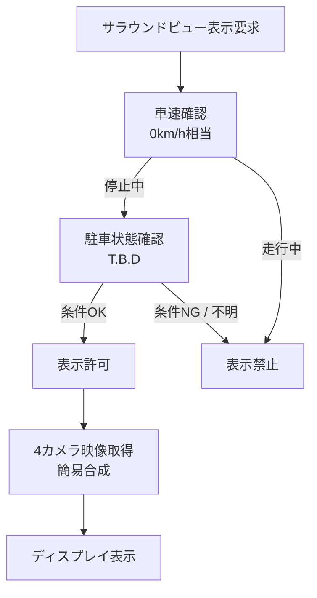

<a id="sec-44"></a>
### 4.4 バックカメラ表示制御

バックカメラ表示制御は、サブコントローラ1 Raspberry Pi 3Bがバックギア信号を監視し、Raspberry Pi 5へ状態通知することで実現する。Raspberry Pi 5はバックギアON通知を受けた場合、サブコントローラ1から受信した後方カメラ映像を優先表示する。

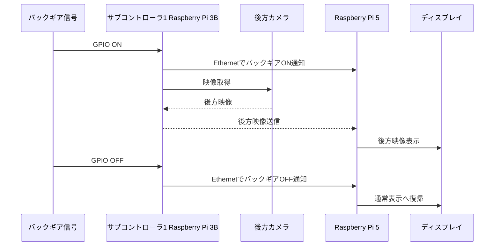

<a id="sec-45"></a>

### 4.5 車両情報取得

車両情報は、Raspberry Pi 5からUSB–OBD変換ケーブルを通して、車体側のK-LineでL880KコペンのECUへアクセスして取得する。USB側はシリアル通信、車体側はK-Line通信とし、CAN通信や標準OBD-II PIDだけで取得できることを前提にしない。

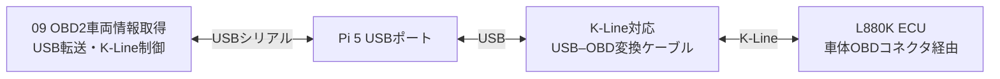

USB機器の接続、K-Lineの初期化、対象ECUからの応答確認、項目別読取の順に処理する。KLineSessionが通信開始・要求フレーム・応答検査を、ResponseDecoderが車両別のデータ抽出・単位換算を担当する。USB接続だけでECU通信成立とは扱わない。

| 項目 | 用途 | 優先度 | 取得条件 |
| --- | --- | --- | --- |
| 車速 | 現在地補正、サラウンドビュー表示条件、走行ログ | 高 | 対象ECUの要求・換算式・鮮度を確認 |
| エンジン回転数 | 状態表示、走行ログ | 中 | 対象ECUの要求と換算式を確認 |
| 冷却水温 | 異常監視 | 高 | 取得・換算と車両に合う警告条件を確認 |
| ECU電圧 | 電源状態の参考監視 | 高 | 測定箇所と取得可否を確認。ケーブル電圧とは別 |
| 故障コード | メンテナンス支援 | 中 | 確認済みの読取だけ。消去・制御は対象外 |
| 通信状態 | 接続異常表示 | 高 | USB、K-Line初期化、ECU応答の状態を区別 |

基本経路は生バイト転送対応ケーブルとUSBシリアル転送ライブラリ（pySerial候補）を用いる設計とし、python-OBDの標準PID取得を前提にしない。ケーブル型番、初期化方式、通信速度、要求データ、換算式は確認後にプロファイルへ固定する。K-Line対応という表示だけで当該ECUに使用可能とは判断しない。

未取得・通信断・セッション失効はUNKNOWN等として通知し、過去の値やGPS速度でECU値を補わない。ACC OFF時は通常読取と通信維持を止める。UIの車両情報画面を表示していない間は車速などの最小項目だけを取得し、画面表示中だけ詳細項目を取得する。OBD2通知はWaydroid管理用とは別の専用UnixドメインソケットでServiceBridgeへ配信する。具体的なモジュール、フロー、設定、試験は[09 OBD2車両情報取得 詳細設計書](詳細設計/09_OBD2車両情報.md)に記載し、実車の初期化確認は[付録5 L880K OBD2・K-Line初期化確認手順](付録5_L880K_OBD2_K-Line初期化手順.md)に従う。

<a id="sec-46"></a>
### 4.6 ドアロック制御

ドアロック制御はセカンド開発対象とする。Raspberry Pi 5からロック、アンロック指示を出力する場合は、ハードウェア側の保護・駆動回路を通し、純正ドアロック制御回路に悪影響を与えないことを確認する。

ソフトウェア側では、ロックとアンロックの同時出力禁止、短時間パルス制御、連続操作禁止、走行中制限を設ける。

<a id="sec-47"></a>
### 4.7 冷却ファン制御

冷却ファン制御はRaspberry Pi 5側で行う。4ピンPWMファン1台のPWMをLinux PWM sysfsから25kHzを初期値（許容21kHz-28kHz）として出力し、同じファンのTACHフィードバックを取得する。

| 入力 / 出力 | 内容 |
| --- | --- |
| 入力 | Raspberry Pi 5 CPU温度、冷却ファンTACH |
| 出力 | 25kHz PWMのデューティ比、冷却ファン回転数状態 |
| 制御方針 | 温度に応じて段階的に回転数を上げる |
| 異常時 | TACH異常または高温時は最大回転へ移行する |

<a id="sec-48"></a>
### 4.8 オーディオ制御

オーディオ制御はRaspberry Pi 5からUSB DACへ音声を出力し、オーディオアンプへアナログ音声を渡す。アンプ電源はACC連動リレーで制御されるため、ソフトウェアは音量、入力ソース、ミュート、再生状態を扱う。

OsmAndの音声案内は、WaydroidからホストLinuxの音声出力を経由してUSB DACへ送る。MopidyやLIVIとの同時再生、案内時の音楽音量低下、復帰時の音量をホスト側で管理する方針とし、Android内の音声フォーカスだけでLinux側の音量も連動するとは扱わない。連携方式は実機検証後に確定する。

<a id="sec-49"></a>
### 4.9 Waydroid + OsmAndオフラインナビ

実機への導入・事前確認・動作確認・復旧手順は、[付録1 Raspberry Pi 5へのWaydroid + OsmAnd導入手順](付録1_RaspberryPi5_Waydroid_OsmAnd導入手順.md)に記載する。手順の記載は実機検証の完了を意味しない。

オフラインナビ機能は、Raspberry Pi 5上のWaydroidでAndroid向けOsmAndを実行して実現する。WaydroidはAndroidの実行環境を担当し、OsmAndは地図表示、目的地検索、経路探索、音声案内を担当する。走行地域と経路上の地図を事前保存し、自動車プロファイルでオフライン経路探索を使用する。[OsmAnd経路設定](https://osmand.net/docs/user/navigation/setup/route-navigation/)

カーナビUIアプリはLinux側で動作し、OsmAnd画面の起動と表示切替を担当する。GPS受信、OBD2車速の取得、IMUを用いた現在地補正はLinux側で行い、位置情報連携サービスとAndroid位置情報連携アプリを介してOsmAndへ渡す。通常のGPS位置と[4.10 GPSロスト時現在地補正](#sec-410)の推定位置は、同じ入力経路を使用する。

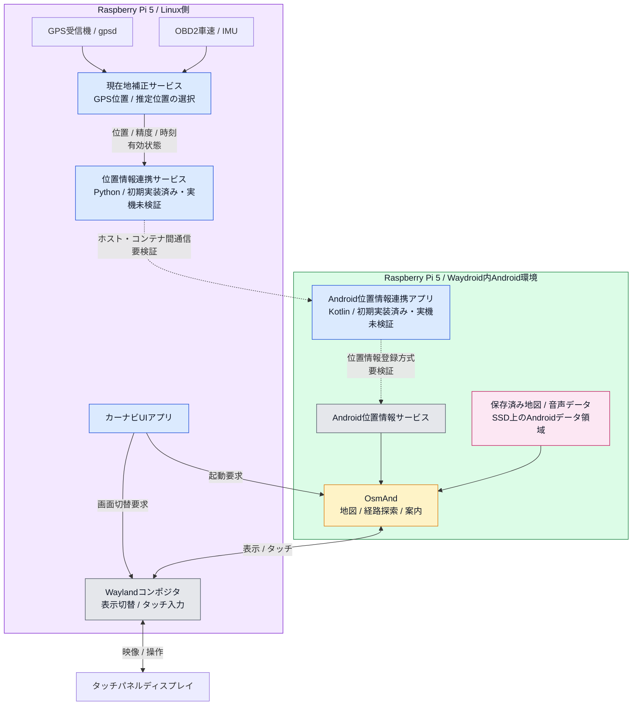

破線は実装・動作確認が必要な連携を示す。gpsdやNMEAデータがWaydroid内のOsmAndへ自動転送されることは前提にしない。

| 項目 | 内容 |
| --- | --- |
| 実行基盤 | Raspberry Pi OS 64-bit + Wayland上のWaydroid |
| ナビアプリ | Android向けOsmAnd |
| 使用バージョン | Waydroid、Androidイメージ、OsmAndの組み合わせを実機検証後に固定する。具体的なバージョンはT.B.D |
| 導入方法 | Waydroidは公式導入手順に従う。OsmAndは公式案内の配布元からARM64対応パッケージを導入する。配布形態、パッケージ名、地図ダウンロード条件は採用時に記録する |
| 地図データ | OsmAndの「地図とリソース」から必要地域を事前取得し、SSD上のAndroidデータ領域に保存する |
| GPS入力 | GPS受信機 → gpsd → 現在地補正サービス → 位置情報連携処理 → Android位置情報サービス → OsmAnd |
| 画面表示 | 現行実装はSway Waylandセッション上でOsmAndを外部ウィンドウとして固定表示領域へ移動・リサイズし、自作UIと切り替える。Wayland外部サーフェスの完全埋込みは将来検討とする |
| 音声案内 | Android側の日本語対応TTSエンジンとオフライン音声データを用意し、ホスト側USB DACへ出力する |
| オフライン動作 | 地図、経路探索用データ、音声データを事前保存し、インターネットを切断した状態で確認する |
| 実装状態 | 初期ソース実装済み・実機未検証。Waydroid導入、位置情報連携、UI切替、性能検証は未完了 |

地図取得は[OsmAndの地図ダウンロード手順](https://osmand.net/docs/user/start-with/download-maps/)に従う。TTS方式にはAndroid側のTTSエンジンが必要であり、日本語音声データを含めたオフライン動作を確認する。[OsmAnd音声案内仕様](https://osmand.net/docs/user/navigation/guidance/voice-navigation/)

#### 位置情報連携

Linux側はPythonの位置情報連携サービス、Android側はKotlinの連携アプリを作成する方針とする。初期試作ではAndroidのテスト位置プロバイダ（モック位置情報）を候補とし、採用するバージョンのOsmAndが受信できることを確認してから方式を確定する。モック位置情報アプリの許可とOsmAndの位置情報権限・プロバイダ設定を確認する。[Android LocationManager API](https://developer.android.com/reference/android/location/LocationManager#setTestProviderLocation(java.lang.String,%20android.location.Location))

| 連携項目 | 設計方針 |
| --- | --- |
| 送信データ | 緯度、経度、取得時刻、水平精度、速度、方位、連番、有効状態、位置情報源（GPS / 推定）を渡す。速度・方位が不明な場合は無効として扱う |
| 通信 | ホストとWaydroid間の専用通信を使用する。初期候補はTCP + JSONとし、接続先とポートを設定ファイルで管理する |
| Androidへの登録 | Android側で時刻と単調増加時刻を含む位置情報を生成する。Linuxから受信した古い位置を、新しい測位結果として登録しない |
| 更新停止 | 通信断、期限切れ、補正精度不足を検知した場合は位置更新を停止し、位置情報を無効化して自作UIに通知する |
| 信頼度表示 | 推定中・測位不能は自作UIで表示する。OsmAnd側に独自状態を表示する方法はT.B.D |

#### 導入・確認手順

1. 採用するPi 5環境でWaydroidを起動し、GPU描画、横画面、タッチ入力、音声出力を確認する。
2. OsmAndを導入し、日本の必要地域の地図と音声データを保存する。Waydroid、Androidイメージ、OsmAndのバージョンを記録する。
3. GPS実測位置をAndroidへ渡し、OsmAndの現在地、経路探索、音声案内を通信圏外相当の環境で確認する。
4. 自作UIからOsmAndを起動し、バックカメラへの優先切替と自作UIへの復帰を確認する。
5. GPSロスト・復帰と位置情報連携切断を試験し、推定中表示と古い位置の無効化を確認する。
6. カメラ録画・音楽再生と同時動作させ、CPU、メモリ、温度、画面応答、終了時の保存処理を確認する。

アプリの起動はWaydroidの`app launch`を使用し、採用バージョンのパッケージ名を`app list`で確認して設定ファイルへ記録する。[Waydroidアプリ操作](https://docs.waydro.id/usage/install-and-run-android-applications)

地図更新は自宅Wi-Fi接続時または手動更新を基本とする。Androidデータ領域は録画ファイルの削除対象に含めず、地図更新時の一時容量も確保する。

<a id="sec-410"></a>
### 4.10 GPSロスト時現在地補正

GPSロスト時現在地補正は、トンネル、ビル街、屋根付き駐車場などでGPS信号が不安定または失われた場合に、センサー情報から現在地を推定する補助機能である。

本機能は、GPSを完全に置き換えるものではなく、短時間のGPS欠落中に現在地表示の停止や大きなジャンプを抑えるための補正処理として扱う。GPSが復帰した場合は、推定位置をGPS位置へゆっくり収束させる。

補正処理はRaspberry Pi 5のLinux側で実行する。GPS有効時の位置も本サービスを通し、出力位置を[4.9の位置情報連携処理](#sec-49)へ渡す。OsmAnd側の表示位置を補正処理へ戻す循環は作らず、GPS受信機からの実測値を基準とする。

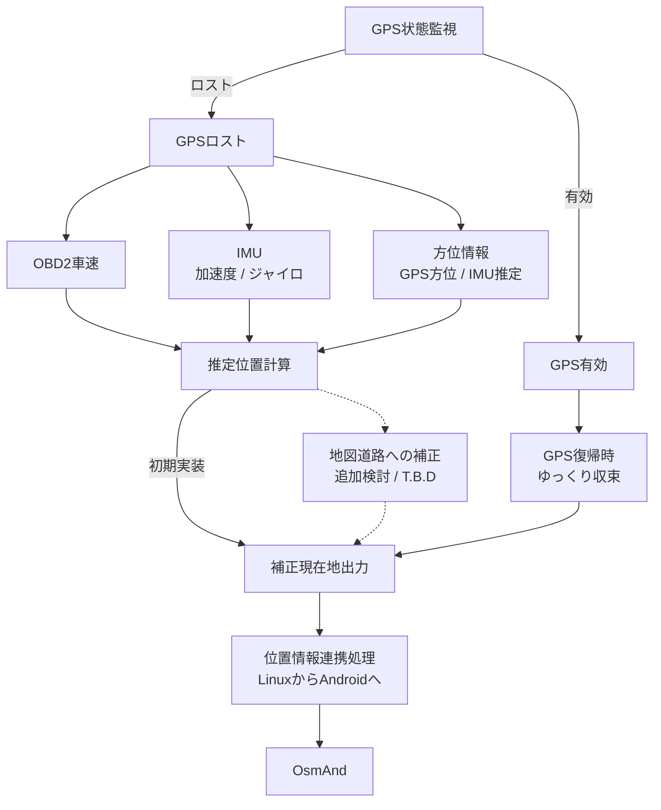

| 入力情報 | 取得元 | 用途 | 優先度 |
| --- | --- | --- | --- |
| GPS位置 | GPSモジュール | 通常時の基準位置 | 高 |
| GPS状態 | GPSモジュール / gpsd | ロスト判定、復帰判定 | 高 |
| 車速 | OBD2 | GPSロスト時の移動距離推定 | 高 |
| 方位 | GPS方位、IMU、電子コンパス候補 | 進行方向推定 | 中 |
| 加速度 | IMU候補 | 停止/発進/旋回の補助判定 | 中 |
| ジャイロ | IMU候補 | 旋回量推定 | 中 |
| 地図道路情報 | 自作処理向けの取得元・形式はT.B.D | 道路上への位置補正は追加検討。初期実装には含めない | 中 |

推定処理の基本方針を以下に示す。

| 状態 | 処理 |
| --- | --- |
| GPS有効 | GPS位置を基準とし、OBD2車速やIMUは補助情報として扱う |
| GPS不安定 | GPS位置の急な飛びを抑制し、車速と方位から短時間の補間を行う |
| GPSロスト | 最後のGPS位置を基準に、車速と方位から推定位置を更新する |
| GPS復帰 | 推定位置からGPS位置へ段階的に補正し、画面上の急なジャンプを抑える |
| ロスト長時間継続 | 推定誤差が大きくなるため、現在地表示を参考扱いにし警告表示する |

設計上の注意点は以下とする。

- GPSロスト時の推定位置は時間経過とともに誤差が増えるため、長時間の自律航法には使用しない。
- OBD2車速が取得できない場合はGPS復帰まで位置補正精度が大きく下がる。
- IMUを使用する場合は、取付方向、ゼロ点ずれ、振動ノイズ、温度変化を考慮する。
- GPS・推定位置の有効期限と水平精度を連携先へ渡し、期限切れや信頼度不足の場合は位置更新を止める。閾値は実測で決定する。
- OsmAnd用地図を自作サービスから直接参照できるとは扱わない。自作マップマッチングのデータ取得方法と利用条件は別途確認する。
- 地図道路への補正は、分岐や並走道路で誤った道路へ吸着する可能性があるため、確信度を持たせる。
- サラウンドビュー表示制限など安全側判断には、推定位置よりも車速、バックギア、駐車状態を優先する。
- 本機能は現在地表示の補助であり、運転操作の自動制御には使用しない。

<a id="sec-411"></a>
### 4.11 Android Auto / LIVI連携

Android Auto連携は、LIVIをRaspberry Pi 5のネイティブプロセスとして起動し、カーナビUIアプリから専用JSON Linesソケットで表示・非表示を制御して実現する。LIVIはスマートフォン連携画面を扱い、カーナビUIアプリはWaydroid + OsmAndによる本体内ナビと、自作のカメラ表示、サラウンドビュー、車両情報表示、録画状態表示などを統合する。OsmAndはPi 5上で実行する独立したナビ機能とし、LIVIに接続するスマートフォンを必須にしない。

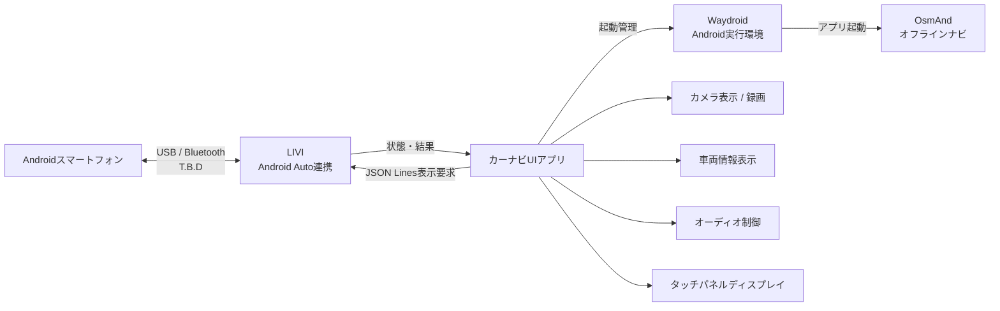

| 項目 | 内容 |
| --- | --- |
| 連携ソフト | LIVI |
| 目的 | Android Auto相当のスマートフォン連携をカーナビ画面に表示する |
| 配置 | Pi 5のSwayセッション上の常駐連携サービス。LIVI本体はUIのshow要求時に起動 |
| 表示先 | タッチパネルディスプレイ |
| 自作UIとの関係 | LIVIの画面と、自作カーナビUIの画面を切り替えて使用する |
| 設計状態 | 内部実装済み。LIVI実行ファイル配置、Android Auto接続、音声イベント取得は実機確認待ち |

設計上の注意点は以下とする。

- カーナビUIアプリ側でOsmAnd、カメラ、サラウンドビュー、Android Auto連携画面を切り替えられる構成にする。
- バックギアON時やサラウンドビュー表示許可時は、安全側の表示を優先し、Android Auto画面よりカメラ表示を優先する。
- 音声出力はUSB DACおよびオーディオ制御との競合を確認する。
- スマートフォン接続方式、画面解像度、タッチ入力、音声入出力、ライセンス条件は採用するLIVIバージョンごとに確認する。
- LIVIの電話接続状態は、正式な外部APIを確認するまでUNKNOWNとし、プロセス起動だけで接続済みと表示しない。

<a id="sec-412"></a>
### 4.12 カーナビUI設計

カーナビUIアプリは、Raspberry Pi 5上で動作する本システムのメイン画面とする。ナビ、Android Auto連携、音楽、カメラ表示、録画状態、車両情報、冷却状態、電源状態を統合し、タッチパネルディスプレイから操作できるようにする。

実装言語とUIフレームワークは、第一候補として `Python + PySide6/QML` を使用する。Python側で各サービスとの連携、状態管理、外部プロセス制御を行い、QML側で車載向けの画面表示、タッチ操作、画面遷移を実装する。

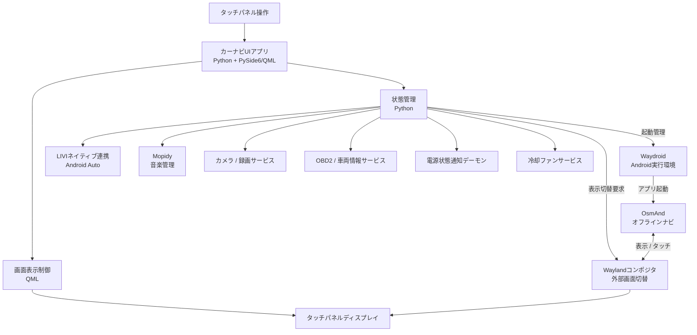

| 項目 | 設計内容 |
| --- | --- |
| 実装場所 | Raspberry Pi 5 |
| 実装言語 | Python |
| UIフレームワーク | PySide6/QMLを第一候補とする |
| メインファイル | `src/raspberry_pi5/main_app.py` |
| UI画面定義 | `src/raspberry_pi5/ui/qml/` |
| 画面制御 | `src/raspberry_pi5/ui/controllers/` |
| 状態管理 | `src/raspberry_pi5/ui/state/` |
| 設定ファイル | `config/ui_config.yaml` |
| 表示先 | タッチパネルディスプレイ |
| 操作方式 | タッチ操作を基本とし、物理ボタンは必要に応じて追加する |

画面構成は以下を基本とする。

| 画面 | 内容 | 優先度 |
| --- | --- | --- |
| ホーム画面 | ナビ、音楽、カメラ、車両情報への入口を表示する | 通常 |
| ナビ画面 | Waydroid内のOsmAndを表示し、地図表示、経路案内、現在地表示を行う | 通常 |
| Android Auto画面 | LIVIによるスマートフォン連携画面を表示する | 通常 |
| 音楽画面 | Mopidyを用いて音楽再生、選曲、再生状態表示を行う | 通常 |
| カメラ画面 | 前方、後方、右、左カメラ映像を表示する | 高 |
| サラウンドビュー画面 | 駐車時のみ4カメラ合成映像を表示する | 高 |
| 録画状態画面 | ドライブレコーダー録画、Google Driveアップロード、ローカル削除状態を表示する | 通常 |
| 車両情報画面 | OBD2、電源、温度、冷却ファン状態を表示する | 通常 |
| 警告画面 | カメラ異常、SSD容量不足、高温、通信断などを表示する | 最高 |

表示優先順位は以下とする。

1. 警告画面
2. バックカメラ表示
3. サラウンドビュー表示
4. ユーザーが選択した通常画面

バックギアON時は、ユーザーが別画面を表示していてもバックカメラ表示を優先する。サラウンドビューは駐車時のみ表示可能とし、走行中または走行状態が不明な場合は表示しない。

OsmAndの初期実装は別画面への切替方式とし、QML内への埋め込みは前提にしない。OsmAnd表示中も自作UIへ戻れる操作と、バックギア入力によるカメラ優先表示をWaylandコンポジタ側と連携して実現する。使用するコンポジタの制御方法、フォーカスとタッチの切替、推定中・測位不能の状態表示は実機で確認する。

実装ファイルの役割は以下とする。

| ファイル / ディレクトリ | 内容 |
| --- | --- |
| `src/raspberry_pi5/main_app.py` | UIアプリの起動、初期化、メインループ |
| `src/raspberry_pi5/ui/qml/Main.qml` | メイン画面定義 |
| `src/raspberry_pi5/ui/qml/HomeScreen.qml` | ホーム画面 |
| `src/raspberry_pi5/ui/qml/NavigationScreen.qml` | OsmAnd起動・表示切替、ナビ状態と位置情報状態の表示 |
| `src/raspberry_pi5/ui/qml/CameraScreen.qml` | カメラ表示画面 |
| `src/raspberry_pi5/ui/qml/AudioScreen.qml` | 音楽操作画面 |
| `src/raspberry_pi5/ui/qml/VehicleStatusScreen.qml` | 車両情報表示画面 |
| `src/raspberry_pi5/ui/qml/WarningOverlay.qml` | 警告表示 |
| `src/raspberry_pi5/ui/controllers/screen_controller.py` | 画面遷移、表示優先順位制御 |
| `src/raspberry_pi5/ui/controllers/service_bridge.py` | 各サービスとの通信 |
| `src/raspberry_pi5/ui/state/app_state.py` | UIに表示する状態の一元管理 |

設計上の注意点は以下とする。

- 走行中に細かい操作を要求しないよう、ボタンは大きく、画面遷移は少なくする。
- 重要な警告、バックカメラ、サラウンドビューは通常画面より優先して表示する。
- Waydroid + OsmAnd、LIVI、Mopidyは外部ソフトとして扱い、UIアプリ側では起動、終了、再生操作、画面切替、状態表示を担当する。
- Waydroidの起動待ちや障害でUI・カメラ・電源管理を停止させない。Waydroid準備完了まではナビ機能だけを準備中として扱う。
- カメラ映像、録画、アップロード処理はUIスレッドで直接処理せず、各サービスから状態と映像を受け取る。
- UIフレームワークはPySide6/QMLを第一候補とするが、性能、タッチ入力、外部アプリ埋め込みの検証結果によりWeb UI方式へ変更する可能性を残す。

<a id="sec-5"></a>
## 5. プロセス構成

| プロセス | 実行場所 | 役割 | 実装状態 |
| --- | --- | --- | --- |
| LIVIネイティブ連携サービス / LIVI | Raspberry Pi 5 | ネイティブプロセス起動、Sway固定領域配置、Android Auto連携画面の表示 | 内部実装済み・実行ファイル配置と実機接続は未検証 |
| カーナビUIアプリ | Raspberry Pi 5 | Python + PySide6/QMLによる画面表示、操作受付、各サービス統合 | T.B.D |
| Waydroidコンテナ / セッション | Raspberry Pi 5 / Linux | Android環境の起動・停止。表示セッションはWayland環境で動作する | 未導入・未検証 |
| OsmAnd | Raspberry Pi 5 / Waydroid内Android | オフライン地図表示、経路探索、案内 | 未導入・未検証 |
| gpsd | Raspberry Pi 5 / Linux | GPS受信機から実測位置・測位状態を取得する | T.B.D |
| 位置情報連携サービス | Raspberry Pi 5 / Linux | 実測・補正位置と有効状態をAndroidへ転送する | T.B.D |
| Android位置情報連携アプリ | Raspberry Pi 5 / Waydroid内Android | 位置情報を受信しAndroid位置情報サービスへ登録する | T.B.D |
| 現在地補正サービス | Raspberry Pi 5 | GPSロスト時にOBD2車速やIMU情報から現在地を補正する | T.B.D |
| カメラサービス | Raspberry Pi 5 | 右/左MIPIカメラ取得、前方/後方映像受信、録画 | T.B.D |
| サラウンドビューサービス | Raspberry Pi 5 | 4カメラ合成、駐車時のみ表示 | T.B.D |
| Google Driveアップロードサービス | Raspberry Pi 5 | READY録画を分割送信し、ID・サイズ・MD5等を照合してから許可設定に従い削除する | 内部実装済み・実Drive接続とLinux削除は未検証 |
| OBD2サービス | Raspberry Pi 5 | USB–OBD変換ケーブル経由のK-Line車両情報取得 | 通信共通基盤実装済み・L880K実車プロファイルT.B.D |
| 冷却ファンサービス | Raspberry Pi 5 | Linux PWM sysfsによる25kHz PWM、TACH監視 | 内部実装済み・PWMデバイス実機設定未確認 |
| 電源状態通知デーモン | Raspberry Pi 5 | PicoへPi 5稼働状態を通知 | 実装済み |
| サブコン1連携サービス | Raspberry Pi 3B サブコントローラ1 | 後方映像とバックギア状態をPi 5へ送信 | T.B.D |
| サブコン2連携サービス | Raspberry Pi 3B サブコントローラ2 | 前方映像と左右ウィンカー状態をPi 5へ送信 | T.B.D |
| Pico電源管理 | Raspberry Pi Pico | ACC監視、J2要求、状態保持 | 安全側待機を実装。OS停止自動確認・無人再起動は未実装 |

<a id="sec-6"></a>
## 6. データ保存設計

メインコントローラ側SSDにOS、アプリケーション、録画データ、ログを保存する。

| データ | 保存先 | 備考 |
| --- | --- | --- |
| OS | SSD | Raspberry Pi 5起動領域 |
| アプリケーション | SSD | ソースコード、設定ファイル |
| Waydroidシステム / Androidデータ | SSD | Androidイメージ、アプリ、永続データ。保存パスは導入時に確定する |
| OsmAnd地図・音声データ | SSD上のAndroidデータ領域 | オフライン地図、経路探索、音声案内用。録画データの削除対象外とする |
| OsmAnd設定 | SSD上のAndroidデータ領域 | ナビプロファイル、表示、案内、地図保存先。バックアップ対象とする |
| ナビ連携設定 | SSD | 採用バージョン、OsmAndパッケージ名、位置情報接続先、有効期限、画面切替設定 |
| 録画データ | SSD | Google Driveアップロード完了まで一時保存する |
| 録画管理情報 | SSD | ファイル名、カメラ種別、録画時刻、アップロード状態、削除状態を管理する |
| Google Drive認証情報 | SSD | 所有者限定のOAuthトークンファイル。認証手順は付録7参照。保存時暗号化は未実装 |
| 車両ログ | SSD | OBD2、GPS、補正位置、温度、電源状態 |
| 異常ログ | SSD | カメラ、通信、電源、温度異常 |

録画データは容量を圧迫しやすいため、保存先ディレクトリ、最大使用率、Google Driveアップロード状態、削除条件を設定ファイルで管理する。アップロード成功が確認できていない録画データは削除しない。

<a id="sec-7"></a>
## 7. 通信設計

Raspberry Pi 5と2台のRaspberry Pi 3BはEthernetで接続する。状態通知、制御要求、死活監視はEthernet TCP/45050上のJSON Linesを初期採用し、映像転送は制御通信と分離する。映像転送方式はRTSP、WebSocket、MJPEGなどを比較して決定するまでT.B.Dとする。

| 通信 | 方向 | 内容 |
| --- | --- | --- |
| バックギア状態通知 | サブコントローラ1 → Pi 5 | ON/OFF、更新時刻 |
| 後方映像転送 | サブコントローラ1 → Pi 5 | 後方カメラ映像 |
| 左右ウィンカー状態通知 | サブコントローラ2 → Pi 5 | 左/右ON/OFF、更新時刻 |
| 前方映像転送 | サブコントローラ2 → Pi 5 | 前方カメラ映像 |
| 制御要求 | Pi 5 → サブコントローラ1/2 | 映像開始、停止、状態取得 |
| 死活監視 | 双方向 | 通信断、遅延、再接続判定 |
| ナビ位置情報 | Pi 5 Linux → Waydroid内Android | 位置情報連携サービスからAndroidアプリへ位置、精度、時刻、連番、有効状態、GPS / 推定の区別を転送する。TCP + JSONを初期候補とする |
| ナビ位置情報連携状態 | Waydroid内Android → Pi 5 Linux | 受信・登録結果、最終更新時刻、権限エラー、死活監視 |
| UIとWaydroidナビ管理 | 01 カーナビUI ↔ 02 Waydroidナビ管理 | Pi 5内のUnixドメインソケット、UTF-8 JSON Lines。管理プログラムは常駐し、OsmAnd / LIVIは必要時に起動する |

Waydroidとの通信は同一Pi 5内のホスト・コンテナ間通信であり、サブコントローラ間のEthernet通信とは接続先を分ける。ポートはホストとコンテナ間に限定し、テザリング側や車内LANへ公開しない。
UIとWaydroidナビ管理の通信はTCPポートへ公開せず、`/run/user/<uid>/l880k-navigation.sock`を使用する。1行1JSONオブジェクトで要求と応答を交換し、状態変化は`event`付きの通知として返す。

<a id="sec-8"></a>
## 8. 異常処理・安全設計

| 異常 | 検出方法 | 処理 |
| --- | --- | --- |
| サブコントローラ1通信断 | Ethernet死活監視 | 後方映像とバックギア状態を無効化し、画面に警告表示 |
| サブコントローラ2通信断 | Ethernet死活監視 | 前方映像と左右ウィンカー状態を無効化し、画面に警告表示 |
| 後方カメラ未接続 | サブコントローラ1側カメラ取得失敗 | バックカメラ表示を行わず警告表示 |
| 前方カメラ未接続 | サブコントローラ2側カメラ取得失敗 | 前方映像表示とサラウンドビュー合成で前方映像を無効化する |
| 右/左カメラ未接続 | Pi 5側MIPIカメラ取得失敗 | 該当カメラ映像を無効化し、サラウンドビュー合成を制限する |
| ウィンカー信号異常 | サブコントローラ2側GPIO入力異常、更新途絶 | ウィンカー連動表示を無効化し、状態を不明として扱う |
| GPSロスト | gpsdまたはGPS入力監視 | 現在地補正サービスを推定モードへ切り替え、有効な推定位置をAndroidへ渡す。自作UIに推定中と表示し、推定不能なら位置更新を停止する |
| 現在地補正誤差増大 | GPSロスト継続時間、車速、IMU状態 | 補正位置の信頼度を下げ、長時間継続時は参考表示に切り替える |
| Waydroid / OsmAnd起動失敗 | コンテナ・セッション状態、アプリ起動結果 | ナビを利用不可として表示し、UI、カメラ、録画、電源管理は継続する。再起動回数に上限を設ける |
| 位置情報連携異常 | 受信期限、連番、位置登録結果、Android権限 | 古い位置の再送を止め、Android側の位置情報を無効化し、自作UIに測位不能を表示する |
| OsmAnd地図データ未配置 | 初期設定時のOsmAnd地図一覧・経路探索確認 | 必要地域の地図を取得するまで案内を利用不可とする。自動検出方式はT.B.D |
| OBD2通信断 | OBD2サービス監視 | 車両情報を無効値にし、サラウンドビュー表示条件を安全側に倒す |
| テザリング未接続 | ネットワーク疎通確認 | Google Driveアップロードを停止し、録画データをローカル保持する |
| Google Driveアップロード失敗 | アップロード結果、再試行回数 | ローカルファイルを削除せず、再試行待ちに戻す |
| Google Drive容量不足 | アップロードエラー | アップロードを停止し、画面に警告表示する |
| SSD容量不足 | 空き容量監視 | アップロード済み録画を優先削除する。削除可能な録画がない場合は録画停止または画質低下を検討し、警告表示する |
| Pi 5高温 | 温度監視 | ファン最大回転、警告表示、必要に応じて録画負荷低減 |
| 電源状態不一致 | Pico状態監視 | J2短絡の繰り返しを禁止し、異常状態として保持 |

走行中または走行状態が不明な場合、サラウンドビュー表示は行わない。車両制御に関わる機能は、GPIOを車体側12V配線へ直接接続しないことを前提とする。

<a id="sec-9"></a>
## 9. 起動・終了シーケンス

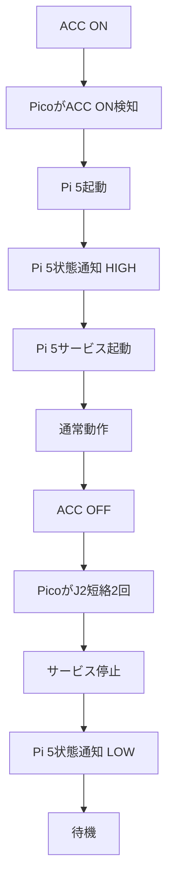

ナビ機能の起動・終了は次の順序で制御する。Pi 5状態通知は既存の電源管理仕様に従い、OsmAndの準備完了とは分けて扱う。

| タイミング | ナビ機能の処理 |
| --- | --- |
| 起動 | WaylandセッションとWaydroidコンテナを準備し、Waydroidセッション、Android位置情報連携アプリ、OsmAndを順に起動する |
| 位置情報開始 | gpsd・現在地補正サービスの有効な位置が得られた後、位置情報連携を開始する。測位待ちでもUIや地図閲覧は利用できる構成とする |
| 画面切替 | ナビ起動完了を待たずUIとカメラを利用可能にし、OsmAndの表示要求時に準備状態を確認する |
| 終了 | 位置情報送信を止め、Android側の位置を無効化する。OsmAndの案内停止・設定保存、Waydroidセッション、コンテナの順に終了し、OSのファイル同期・停止へ進む |

OsmAndの保存完了確認方法、各処理の待機上限と失敗時の終了処理はT.B.Dとする。

<a id="sec-10"></a>
## 10. 実装ファイル構成

現時点の実装ファイルと、今後追加する想定ファイルを以下に示す。

各自作ソフトの内部構成、インターフェース、処理、異常対応、試験条件は[詳細設計一覧](詳細設計/README.md)を参照する。未実装のソースパスは作成予定であり、詳細設計書の追加は実装完了を意味しない。

| ファイル | 実行場所 | 内容 | 状態 |
| --- | --- | --- | --- |
| `src/raspberry_pi5/pi5_power_daemon.py` | Raspberry Pi 5 | Pi 5稼働状態をPicoへGPIO通知する | 実装済み |
| `src/raspberry_pico/pico_power_manager.py` | Raspberry Pi Pico | ACC監視、Pi 5起動・シャットダウン制御、LED表示 | 実装済み |
| `src/raspberry_pi5/livi_integration.py` | Raspberry Pi 5 | LIVI起動、Android Auto画面連携、UI切替制御 | T.B.D |
| `src/raspberry_pi5/main_app.py` | Raspberry Pi 5 | Python + PySide6/QMLによるメインUIアプリ起動処理 | 内部実装済み・実機未検証 |
| `src/raspberry_pi5/ui/qml/` | Raspberry Pi 5 | QML画面定義 | 部分実装・実機未検証 |
| `src/raspberry_pi5/ui/controllers/` | Raspberry Pi 5 | 画面遷移、表示優先順位、各サービス連携 | 部分実装・実機未検証 |
| `src/raspberry_pi5/ui/state/` | Raspberry Pi 5 | UI表示用状態管理 | 部分実装・実機未検証 |
| `src/raspberry_pi5/waydroid_navigation_manager.py` | Raspberry Pi 5 / Linux | Waydroid状態管理、OsmAnd起動・終了、UIとの表示切替連携 | 内部実装済み・実機未検証 |
| `src/raspberry_pi5/navigation/json_ipc.py` | Raspberry Pi 5 / Linux | Unixドメインソケット上のJSON Lines通信 | 内部実装済み・実機未検証 |
| `src/raspberry_pi5/navigation/async_dispatcher.py` | Raspberry Pi 5 / Linux | ナビ操作を順番に実行する非同期要求処理 | 内部実装済み・実機未検証 |
| `src/raspberry_pi5/systemd/l880k-navigation.service` | Raspberry Pi 5 / Linux | Waydroidナビ管理プログラムの常駐起動・異常時再起動 | 内部実装済み・実機未検証 |
| `src/raspberry_pi5/navigation/resident_runtime.py` | Raspberry Pi 5 / Linux | 二重起動防止、PID記録、ロック解放 | 内部実装済み・実機未検証 |
| `src/raspberry_pi5/location_bridge_service.py`、`src/raspberry_pi5/location_bridge/` | Raspberry Pi 5 / Linux | 03の位置を期限付きで05へ転送し、ACK・失効・通信状態を管理 | 初期実装済み・実機未検証 |
| `src/android/location_bridge/` | Raspberry Pi 5 / Waydroid内Android | Kotlinによる位置受信、テスト位置プロバイダ登録、失効・状態通知 | 初期実装済み・実機未検証 |
| `config/navigation.yaml` | Raspberry Pi 5 / Linux | 採用バージョン、パッケージ名、位置情報通信、更新期限の設定 | T.B.D |
| `src/raspberry_pi5/position_correction_service.py`、`src/raspberry_pi5/positioning/` | Raspberry Pi 5 | gpsd入力、GPS採用、短時間の車速・IMU推定、品質判定、JSON Lines配信 | 初期実装済み・実機未検証 |
| `src/raspberry_pi5/camera_service.py`、`camera/` | Raspberry Pi 5 | 左右CSI/JPEG取得、前後サブコンJPEG受信、MKV分割録画、UI配信、07への確定台帳登録 | 内部実装済み・実機未検証。導入手順は付録8 |
| `src/raspberry_pi5/drive_upload_service.py`、`src/raspberry_pi5/drive_upload/` | Raspberry Pi 5 | 確定録画のGoogle Drive分割送信、再開、照合、限定削除、UI向け状態照会 | 内部実装済み・実Drive接続とLinux削除は未検証 |
| `src/raspberry_pi5/surround_view_service.py` | Raspberry Pi 5 | サラウンドビュー合成 | T.B.D |
| `src/raspberry_pi5/obd2_service.py`、`src/raspberry_pi5/obd2/` | Raspberry Pi 5 | OBD2車両情報取得、K-Line通信、値の期限管理、JSONイベント配信 | 通信共通基盤実装済み・実車適合T.B.D |
| `src/raspberry_pi5/fan_control_service.py`、`src/raspberry_pi5/telemetry_ipc.py` | Raspberry Pi 5 | Linux PWM sysfsによる25kHz PWM、温度・TACH状態通知 | 内部実装済み・PWM波形実機未検証 |
| `src/raspberry_pi5/audio_integration_service.py` | Raspberry Pi 5 | Mopidy、ナビ案内音声、LIVIと自作UIの連携 | 詳細設計で追加提案・未実装 |
| `src/raspberry_pi5/ui/controllers/feature_controller.py`、`mopidy_client.py`、`recording_library.py` | Raspberry Pi 5 / UI開発環境 | 利用者設定保存、Mopidy再生操作、録画検索・再生、冷却表示、警告履歴、録画・送信設定の操作 | 内部実装済み。独立した音声管理プロセスとは別。導入手順は[付録9](付録9_UI追加機能導入手順.md) |
| `src/raspberry_pi5/door_lock_service.py`、`src/raspberry_pi5/door_lock/` | Raspberry Pi 5 | 保護・駆動回路を介したドアロック操作 | 内部実装済み・初期無効・実車未検証 |
| `src/raspberry_pi5/subcontroller_gateway_service.py` | Raspberry Pi 5 | サブコン1/2のEthernet JSON Lines受信、起動世代・連番検証 | 内部実装済み・実機未検証 |
| `src/raspberry_pi3b/sub_controller1_service.py`、`src/raspberry_pi3b/sub1/` | Raspberry Pi 3B サブコントローラ1 | 後方カメラ、バックギア信号、Pi 5連携 | 内部実装済み・実機未検証 |
| `src/raspberry_pi3b/sub_controller2_service.py`、`src/raspberry_pi3b/sub2/` | Raspberry Pi 3B サブコントローラ2 | 前方カメラ、左右ウィンカー信号、Pi 5連携 | 内部実装済み・実機未検証 |

<a id="sec-11"></a>
## 11. T.B.D

以下は今後の詳細設計で確定する。

| 項目 | 未確定内容 |
| --- | --- |
| UIフレームワーク | 第一候補はPython + PySide6/QML。性能、タッチ入力、外部アプリ埋め込みの検証結果によりWeb UI方式も比較する |
| LIVI連携方式 | LIVIの起動方法、画面埋め込み、Android Auto画面と自作UIの切替方法 |
| Android Auto接続 | USB接続、Bluetooth併用、音声入出力、タッチ入力、ライセンス条件の確認 |
| Waydroid実行環境 | Pi 5のOS・カーネル、Binder / memfd、ARM64 Androidイメージ、GPU、Wayland、採用バージョンの実機確認 |
| OsmAnd導入 | 配布形態、バージョン、パッケージ名、地図ダウンロード条件、オフライン日本語音声の選定 |
| OsmAnd画面連携 | 初期実装は別画面切替。コンポジタ制御、UI復帰、カメラ優先表示、位置情報状態表示、終了・保存確認の具体化 |
| Android位置情報連携 | モック位置情報方式の受信可否、権限・プロバイダ設定、バックグラウンド実行、通信方式、更新周期、有効期限と信頼度の閾値 |
| OsmAnd地図更新方法 | 保存パス、更新頻度、手順、バックアップと必要容量 |
| ナビ音声連携 | WaydroidからUSB DACへの音声出力、Mopidy / LIVIの音量制御、通信圏外での音声案内 |
| カメラライブラリ | OpenCV、libcamera、GStreamerなどの選定 |
| 前方/後方映像転送方式 | RTSP、WebSocket、MJPEG、独自TCPなどの選定 |
| 左右ウィンカー入力 | サブコントローラ2で読むGPIO番号、入力保護回路、ON/OFF判定条件 |
| Google Drive実機受入 | API v3採用。認証、テザリング切断、4方向録画併用、削除復旧の実機試験 |
| テザリング接続判定 | スマートフォンテザリング接続時のネットワーク判定方法 |
| 録画ファイル削除条件 | アップロード完了確認、再試行上限、Google Drive側ファイル確認方法 |
| サラウンドビュー合成方式 | キャリブレーション方法、歪み補正、俯瞰変換、合成方式 |
| 駐車判定 | パーキングブレーキ信号の取得方法 |
| GPSロスト時補正 | 使用するIMU、方位推定、マップマッチング方法、補正位置の信頼度計算 |
| K-Line通信実装 | USB–OBDケーブルの機能、L880Kの初期化・要求・換算定義、USBシリアルAPIの確認 |
| ドアロック制御 | 車両配線図確認後に詳細化 |
| BLE TPMS | 対応センサー、技適、BLEデータ形式確認 |

<a id="sec-12"></a>
## 12. 自作ソフトウェア詳細設計

自作ソフトごとに独立したMarkdownファイルで詳細設計を管理する。[詳細設計一覧](詳細設計/README.md)に対象範囲と構成図との対応、[共通仕様](詳細設計/00_共通仕様.md)に時刻・通信・データ所有権の規則を記載する。

開発時のWindows UI起動方法は、[付録2 WindowsでのカーナビUI開発環境起動手順](付録2_Windows_UI開発環境起動手順.md)に記載する。Windows起動は画面確認用であり、Raspberry Pi 5の車載機能がWindowsで動くことを意味しない。

各設計書は「目的・適用範囲」「要求仕様・責務」「内部構成」「インターフェース設計」「データ・設定設計」「処理・状態遷移」「異常処理」「起動・終了・運用設計」「試験・受入条件」「未確定事項・実装課題」の10章で統一する。

| ID | 詳細設計書 | 実行環境 |
| --- | --- | --- |
| SW-DD-01 | [カーナビUI](詳細設計/01_カーナビUI.md) | Pi 5 |
| SW-DD-02 | [Waydroidナビ管理](詳細設計/02_Waydroidナビ管理.md) | Pi 5 |
| SW-DD-03 | [現在地補正](詳細設計/03_現在地補正.md) | Pi 5 |
| SW-DD-04 | [Linux位置情報連携](詳細設計/04_Linux位置情報連携.md) | Pi 5 |
| SW-DD-05 | [Android位置情報連携](詳細設計/05_Android位置情報連携.md) | Waydroid内Android |
| SW-DD-06 | [カメラ表示・録画](詳細設計/06_カメラ表示録画.md) | Pi 5 |
| SW-DD-07 | [Google Driveアップロード・削除](詳細設計/07_GoogleDriveアップロード.md) | Pi 5 |
| SW-DD-08 | [サラウンドビュー](詳細設計/08_サラウンドビュー.md) | Pi 5 |
| SW-DD-09 | [OBD2車両情報取得](詳細設計/09_OBD2車両情報.md) | Pi 5 |
| SW-DD-10 | [冷却ファン制御](詳細設計/10_冷却ファン制御.md) | Pi 5 |
| SW-DD-11 | [LIVI連携](詳細設計/11_LIVI連携.md) | Pi 5 |
| SW-DD-12 | [オーディオ連携](詳細設計/12_オーディオ連携.md) | Pi 5 |
| SW-DD-13 | [Pi 5状態通知デーモン](詳細設計/13_Pi5状態通知.md) | Pi 5 |
| SW-DD-14 | [Pico電源管理](詳細設計/14_Pico電源管理.md) | Pico |
| SW-DD-15 | [サブコントローラ1後方系](詳細設計/15_サブコン1後方系.md) | Pi 3B #1 |
| SW-DD-16 | [サブコントローラ2前方系](詳細設計/16_サブコン2前方系.md) | Pi 3B #2 |
| SW-DD-17 | [ドアロック制御](詳細設計/17_ドアロック制御.md) | Pi 5 |

電源管理2本は既存コードを基準に記載し、その他は実装前の設計案とする。既存コードの動作とハードウェア記述の差、未検証の外部ソフト連携条件は各詳細設計の課題として明記する。サブコン内のカメラ取得・信号監視・通信APIは、各サブコンの設計書に内部モジュールとして記載する。
