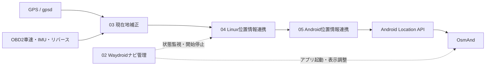

# 付録4 現在地補正・OsmAnd位置連携の懸念点

## 1. 目的

03 現在地補正、04 Linux位置情報連携、05 Android位置情報連携を実装・実機検証する際に、設計上の前提と残る懸念点を一覧化する。ここに記載した内容は、設計書を作成しただけで解決済みとは扱わない。

## 2. 現在の実装範囲

| ソフト | 現在の状態 | できること | まだ確認できていないこと |
| --- | --- | --- | --- |
| 03 現在地補正 | 初期実装済み・実機未検証 | gpsd入力、GPS採用、短時間の車速・IMU推定、JSON Lines配信 | 実車誤差、IMU取付、OBD2車速、実機のGPS復帰条件 |
| 04 Linux位置情報連携 | 初期実装済み・実機未検証 | 03のUnixソケット購読、位置の期限検査、TCP JSON配送、ACK照合、失効 | Waydroidの到達先、認証方式、実測遅延、長時間運用 |
| 05 Android位置情報連携 | 初期実装済み・実機未検証 | TCP受信、世代・期限検査、テスト位置プロバイダ登録、失効通知 | Android版・権限・OsmAndが実際に採用する条件 |

「REGISTERED」はAndroidのLocation API呼出しが成功した状態であり、OsmAnd画面に反映されたことを意味しない。

## 3. 懸念点一覧

| ID | 分類 | 懸念点 | 影響 | 確認・対応 |
| --- | --- | --- | --- | --- |
| LOC-R01 | GPS | gpsdの測定時刻、Pi 5のUTC、受信遅延が一致しない可能性 | 古い位置を新しい位置として登録する | gpsdログと単調時計を同時記録し、時計未確定時は配送しない |
| LOC-R02 | GPS | アンテナ位置と車体基準点が異なる | 地図上の位置に一定のずれが出る | アンテナ位置を基準点として固定し、必要なら車体オフセットを別校正する |
| LOC-R03 | GPS | GPSの瞬間的な飛びやマルチパス | 誤った位置へジャンプする | 速度・精度・前回位置との距離を検査し、実車ログで閾値を決める |
| LOC-R04 | IMU | IMUの型式、軸方向、取付角、振動条件が未確定 | 推定方位・移動距離が誤る | 実装前に機器ID、軸、取付位置、校正手順を確定する |
| LOC-R05 | IMU | ジャイロの温度ドリフトとゼロ点ずれ | GPS喪失時間が長いほど推定誤差が増える | 温度別校正と停止中再校正を行い、推定時間に上限を設ける |
| LOC-R06 | 車速 | OBD2/K-Lineからの車速取得周期と応答遅延が未確定 | 移動量の計算が遅れる、または古くなる | 09 OBD2車両情報取得と同じ測定時刻・有効期限を使う |
| LOC-R07 | 後退 | リバース状態の信号源と遅延が未確定 | 後退を前進として推定する可能性 | サブコントローラ1または共通車体信号入力の採用経路を固定する |
| LOC-R08 | 推定 | 現在は簡易な移動モデルで、EKF等の確率フィルタではない | 急旋回や路面振動で誤差評価が甘くなる | 実車ログで誤差を測り、必要なら状態量・共分散モデルを拡張する |
| LOC-R09 | 推定 | 推定位置を安全制御の判断に使える精度ではない | 誤作動時に車体機能へ影響する | ドアロック・電源制御・駐車判定には推定位置を使わない |
| LOC-R10 | 通信 | 04と05の時計は同じ単調時計ではない | 時計を直接引き算すると期限判定を誤る | 送信時年齢、遅延上限、受信側経過時間で計算する |
| LOC-R11 | 通信 | TCP接続が成立してもAndroid登録可能とは限らない | 通信成功を測位成功と誤表示する | RECEIVED、REGISTERED、OsmAnd利用確認を別状態で表示する |
| LOC-R12 | 通信 | WaydroidのIPアドレスやポートが再起動で変わる可能性 | 再接続できない | 起動時に到達先を再確認し、固定値を無期限に信用しない |
| LOC-R13 | 認証 | 初期実装は開発用の共有設定を想定している | 車外・別プロセスから位置を注入される可能性 | 本番では相互認証またはUnixソケット転送を採用し、外部公開しない |
| LOC-R14 | Android | 模擬位置の許可、開発者向け設定、provider APIの挙動がAndroid版で異なる | Location登録が拒否される | 採用Waydroidイメージで権限・provider作成・再起動後の状態を試験する |
| LOC-R15 | Android | OsmAndがテスト位置プロバイダを採用するか未確認 | API登録成功でも地図が動かない | OsmAndの採用バージョン、位置情報設定、実際の表示を確認する |
| LOC-R16 | Android | 失効時にOsmAndが最後の位置を保持する可能性 | 無効化後も古い位置が画面に残る | 失効表示を別状態にし、最終既知位置の消去を保証しないと明記する |
| LOC-R17 | 常駐 | Foreground Serviceの起動条件・時間制限・停止通知が未確定 | 長時間走行中にサービスが停止する | 対象AndroidのService制限を確認し、停止・再起動を試験する |
| LOC-R18 | 負荷 | Waydroid、OsmAnd、4カメラ録画、UIを同時稼働する | 登録遅延、CPU・メモリ不足、画面停止 | 同時負荷で遅延・メモリ・温度・停止時間を計測する |
| LOC-R19 | 起動終了 | 03、04、05の起動順やソケット残留が不安定 | 二重起動、古い登録、再起動失敗 | systemdまたは起動スクリプトで依存順序と停止結果を確認する |
| LOC-R20 | データ | 位置履歴・認証情報・ログの保存方針が未確定 | 個人情報や秘密情報の漏えい | 通常ログに緯度経度を残さず、保存期間と権限を制限する |
| LOC-R21 | 地図 | 地図への吸着や車線判定をまだ行わない | GPS誤差がそのまま表示される | 初期版の制限事項として扱い、必要性を実車評価する |
| LOC-R22 | 実機試験 | 現時点では合成データ中心 | 実車で同じ精度になる保証がない | 停車・直進・旋回・後退・GPS遮蔽・復帰の試験記録を作る |

GPS単独運用では、GPS受信が途切れたときに推定へ切り替えず、位置を期限切れとして無効化する。IMUを接続していない段階では、この動作が意図した仕様である。

## 4. ソフト間の責任分界

- 03は位置の採用・推定を担当し、04へ送る位置を一元化する。
- 04は位置の再計算をせず、測定時刻と有効期限を保ったまま配送する。
- 05はAndroid APIへの登録可否・失効・権限状態を担当する。
- OsmAndの地図表示結果は、05のAPI成功とは別に確認する。

## 5. 実装・検証の順序

1. 合成JSONで03→04→05の識別子、期限、失効、重複防止を確認する。
2. Waydroid内の05単体でテスト位置プロバイダとOsmAndの反映を確認する。
3. Pi 5上でgpsdの実測GPSを03へ入力し、04・05へ配送する。
4. OBD2車速、IMU、リバース信号を接続し、GPS喪失・復帰を実車ログで確認する。
5. カメラ録画・UI・Waydroidを同時に動かし、遅延と失効が仕様内か確認する。

## 6. 安全上の制限

現在地補正の出力はナビ表示用であり、車両の安全制御・ドアロック・電源制御を直接操作する根拠にしない。位置が不明、期限切れ、権限不明、通信結果不明の場合は、正常位置として扱わず状態を無効または不明として表示する。
