# カーナビUI 詳細設計書

| 項目 | 内容 |
| --- | --- |
| 文書ID | SW-DD-01 |
| 実行環境 | Pi 5 |
| 実装状態 | 部分実装・実機未検証 |
| 対象ソース | `src/raspberry_pi5/main_app.py`、`ui/qml/`、`ui/controllers/`、`ui/state/` |
| 作成日 | 2026-09-14 |

[詳細設計一覧](README.md) / [共通仕様](00_共通仕様.md) / [上位設計](../ソフトウェア設計図.md#sec-412)

2026-09-27更新: 設定保存、Mopidy実通信、録画検索・再生、冷却表示、警告履歴を実装。追加機能の実装構成は[3.5.6](#dd-feature-controller)、導入は[付録9](../付録9_UI追加機能導入手順.md)を参照する。実装済みと今後の設計案の区別は[付録3](../付録3_カーナビUI実装状況.md)にまとめる。

## 目次
- [1. 目的・適用範囲](#dd-1)
- [2. 要求仕様・役割](#dd-2)
  - [2.1 機能一覧](#dd-functions)
  - [2.2 機能・モジュール・関数の対応](#dd-function-module-map)
- [3. 内部構成](#dd-3)
  - [3.1 モジュールの全体構成](#dd-31)
  - [3.2 機能別処理フローチャート](#dd-feature-connections)
    - [3.2.1 UIの起動（UI-F01）](#dd-feature-f01)
    - [3.2.2 通常画面の切替（UI-F02）](#dd-feature-f02)
    - [3.2.3 ナビ・Android Autoの表示連携（UI-F03）](#dd-feature-f03)
    - [3.2.4 音楽操作・再生状態の表示（UI-F04）](#dd-feature-f04)
    - [3.2.5 カメラ映像の表示（UI-F05）](#dd-feature-f05)
    - [3.2.6 後方映像の優先表示（UI-F06）](#dd-feature-f06)
    - [3.2.7 車両・運用状態の表示（UI-F07）](#dd-feature-f07)
    - [3.2.8 警告表示（UI-F08）](#dd-feature-f08)
    - [3.2.9 設定の変更・保存（UI-F09）](#dd-feature-f09)
    - [3.2.10 UIの終了（UI-F10）](#dd-feature-f10)
    - [3.2.11 駐車サラウンドの表示（UI-F11）](#dd-feature-f11)
  - [3.3 モジュールツリー](#dd-39)
  - [3.4 モジュール間の処理順序](#dd-38)
  - [3.5 モジュール詳細](#dd-module-details)
    - [3.5.1 起動・終了管理（main_app）の内部構成](#dd-32)
    - [3.5.2 画面切替管理（ScreenController）の内部構成](#dd-33)
    - [3.5.3 他ソフトとの通信（ServiceBridge）の内部構成](#dd-34)
    - [3.5.4 画面用データ管理（AppState）の内部構成](#dd-35)
    - [3.5.5 画面表示（QML）・共通部品の内部構成](#dd-36)
    - [3.5.6 追加機能管理（FeatureController）の実装](#dd-feature-controller)
  - [3.6 ファイル構成](#dd-37)
  - [3.7 関数のフローチャート](#dd-310)
    - [3.7.1 load_ui_config（設定を読み込む）](#dd-310-1)
    - [3.7.2 build_dependencies（モジュールを準備する）](#dd-310-2)
    - [3.7.3 connect_components（情報が届いたときに動く関数を設定する）](#dd-310-3)
    - [3.7.4 load_view（画面を読み込む）](#dd-310-4)
    - [3.7.5 request_screen（表示したい画面を受け付ける）](#dd-310-5)
    - [3.7.6 handle_action（ボタン操作を受け付ける）](#dd-310-6)
    - [3.7.7 on_service_event（相手ソフトからの状態を反映する）](#dd-310-7)
    - [3.7.8 reevaluate_display（表示する画面を決める）](#dd-310-8)
    - [3.7.9 restore_previous_screen（割込み前の画面へ戻る）](#dd-310-9)
    - [3.7.10 on_command_result（操作の結果を確認する）](#dd-310-10)
    - [3.7.11 expire_stale_data（古くなった表示データを使わない）](#dd-310-11)
    - [3.7.12 send_command（他ソフトへ指示を送る）](#dd-310-12)
    - [3.7.13 subscribe_state / subscribe_video（状態・映像の受信を始める）](#dd-310-13)
    - [3.7.14 unsubscribe（不要な情報の受信を終える）](#dd-310-14)
    - [3.7.15 close（通信全体を終了する）](#dd-310-15)
    - [3.7.16 apply_update（画面用データを書き換える）](#dd-310-16)
    - [3.7.17 get_display_data（表示する値を取り出す）](#dd-310-17)
    - [3.7.18 begin_shutdown（UI全体を終了する）](#dd-310-18)
- [4. インターフェース設計](#dd-4)
  - [インターフェース図](#dd-interface-diagrams)
  - [4.1 画面一覧](#dd-41)
  - [4.2 画面レイアウト設計](#dd-42)
  - [4.3 操作仕様・共通部品](#dd-43)
  - [4.4 共通表示・デザイン仕様](#dd-44)
    - [4.4.1 デザインの方向性](#dd-441)
    - [4.4.2 色・文字・操作部品](#dd-442)
    - [4.4.3 適用範囲と実機確認](#dd-443)
  - [4.5 外部アプリ連携](#dd-45)
- [5. データ・設定設計](#dd-5)
  - [5.1 表示データ一覧](#dd-51)
  - [5.2 UI状態・設定の管理](#dd-52)
- [6. 処理・画面の切替](#dd-6)
  - [6.1 画面切替図](#dd-61)
  - [6.2 操作・通知への対応と優先順位](#dd-62)
- [7. 異常処理](#dd-7)
  - [7.1 状態別表示・復旧動作](#dd-71)
- [8. 起動・終了・運用設計](#dd-8)
  - [8.1 操作制限・利用条件](#dd-81)
- [9. 試験・受入条件](#dd-9)
  - [9.1 性能目標・画面受入試験](#dd-91)
- [10. 未確定事項・実装課題](#dd-10)
- [用語の注釈](#dd-notes)

<a id="dd-1"></a>
## 1. 目的・適用範囲

<a id="note-ref-qml"></a>
タッチパネル上のカーナビ画面を管理する。QML[注1](#note-qml)は画面の表示、Pythonは表示する情報の管理と他ソフトとの通信を担当する。

<a id="note-ref-qt"></a>
画面を作るための仕組みとしてQt[注2](#note-qt)を使う。
<a id="note-ref-pyside6"></a>
PythonからQtを利用し、QMLで作った画面と連携するためにPySide6[注3](#note-pyside6)を使う構成を設計案とする。

対象はホーム、ナビ、Android Auto、カメラ、音楽、車両情報、設定、起動状態、警告表示とする。具体的な画面は[4.1 画面一覧](#dd-41)に記載する。映像取得、位置推定、車体GPIO操作は別担当ソフトの役割とする。

<a id="dd-2"></a>
## 2. 要求仕様・役割

| ID | 要求 |
| --- | --- |
| UI-01 | ナビ未準備でもホーム・カメラを利用可能にする |
| UI-02 | 警告、バックカメラ、駐車サラウンド、通常画面の優先順位を管理する |
| UI-03 | 無効・期限切れの値を数値0や正常表示に置き換えない |
| UI-04 | 外部アプリ停止や通信断でUI全体を停止させない |
| UI-05 | テスラの画面を参考に、余白・簡潔な表示・下部の操作領域を活かしたモダンな自作UIとする。実装していない車両機能は表示しない |

<a id="dd-functions"></a>
### 2.1 機能一覧

機能は「UIが何をできるか」を表す。モジュール名や関数名ではなく、利用者から見える動作とUIの運用上の動作を定義する。

| 機能ID | 機能名 | 実現する動作 | UIの担当範囲・制約 |
| --- | --- | --- | --- |
| [UI-F01](#dd-feature-f01) | UIの起動 | 設定を読み込み、ホームなどの画面を利用可能にする | ナビなどの担当ソフトが未準備でも、UI自体は起動する |
| [UI-F02](#dd-feature-f02) | 通常画面の切替 | ホーム・音楽・車両情報など、選択した画面を表示する | 現在の操作許可と優先表示を確認する |
| [UI-F03](#dd-feature-f03) | ナビ・Android Autoの表示連携 | 対象アプリの起動・表示を要求し、準備状態を表示する | 地図描画・経路案内・Android Auto本体は外部ソフトが担当する |
| [UI-F04](#dd-feature-f04) | 音楽操作・再生状態の表示 | 再生・一時停止・選曲・音量変更を要求し、曲情報と結果を表示する | 音声の再生処理は12 オーディオ連携とその連携先が担当する |
| [UI-F05](#dd-feature-f05) | カメラ映像の表示 | 選択した方向の映像と取得・録画状態を表示する | カメラ取得と録画は06 カメラ表示・録画が担当し、UI終了で録画を止めない |
| [UI-F06](#dd-feature-f06) | 後方映像の優先表示 | 有効なリバースONで後方映像を優先し、有効なOFFで復帰先を確認する | リバースは15 サブコントローラ1後方系から受け取り、信号不明をOFFに置き換えない |
| [UI-F07](#dd-feature-f07) | 車両・運用状態の表示 | 車速・水温・CPU温度・録画状態・位置品質などを表示する | 担当ソフトから受け取る。未取得・期限切れを数値0にしない |
| [UI-F08](#dd-feature-f08) | 警告表示 | 異常の内容と重要度を表示し、利用者による確認を受け付ける | 利用者の確認だけで異常の原因が解消したとは扱わない |
| [UI-F09](#dd-feature-f09) | 設定の変更・保存 | 設定値の編集、適用、取消、確定した利用者設定の保存を行う | 操作許可と適用結果を確認し、秘密情報や未適用の値を保存しない |
| [UI-F10](#dd-feature-f10) | UIの終了 | 新しい操作を止め、設定保存と表示・通信の後片付けを行う | 録画担当ソフトやOS自体の停止とは別の機能とする |
| [UI-F11](#dd-feature-f11) | 駐車サラウンドの表示 | 停止・駐車条件を満たすときに合成映像を表示する | 段階開発対象。合成は08 サラウンドビューが担当し、品質不良時は利用させない |

ドアロック操作とBLE TPMSは初期運用の機能に含めない。画面の種類は[4.1](#dd-41)、操作部品は[4.3](#dd-43)、機能を利用できる条件は[8.1](#dd-81)に記載する。

<a id="dd-function-module-map"></a>
### 2.2 機能・モジュール・関数の対応

1つの機能を複数のモジュールで実現し、1つのモジュールを複数の機能で共用する。以下のモジュール列は参加する構成要素の一覧であり、処理順序ではない。
「主な関数」は代表的な処理を示し、全ての関数を列挙するものではない。関数の全体一覧と処理手順は[3.7](#dd-310)に記載する。

| 機能ID | 主な担当モジュール | 主な関数 | 補助部品・外部担当 |
| --- | --- | --- | --- |
| [UI-F01](#dd-feature-f01) | main_app、QML画面群 | main_appのload_ui_config、build_dependencies、connect_components、load_view | 他のUIモジュールを生成して画面へ渡す |
| [UI-F02](#dd-feature-f02) | ScreenController、AppState、QML画面群 | ScreenControllerのrequest_screen・reevaluate_display、AppStateのapply_update | 外部通信なしで完結する画面切替もある |
| [UI-F03](#dd-feature-f03) | ScreenController、ServiceBridge、AppState、QML画面群 | ServiceBridgeのsend_command、ScreenControllerのon_command_result・reevaluate_display | 02 Waydroidナビ管理、11 LIVI連携 |
| [UI-F04](#dd-feature-f04) | ScreenController、ServiceBridge、AppState、QML画面群 | ScreenControllerのhandle_action・on_service_event、ServiceBridgeのsend_command、AppStateのapply_update | 12 オーディオ連携 |
| [UI-F05](#dd-feature-f05) | ScreenController、ServiceBridge、QML画面群、AppState | ServiceBridgeのsubscribe_video・unsubscribe、ScreenControllerのon_service_event | 06 カメラ表示・録画、frame_presenter。AppStateは映像以外の状態を保持する |
| [UI-F06](#dd-feature-f06) | ScreenController、ServiceBridge、AppState、QML画面群 | ScreenControllerのon_service_event・reevaluate_display・restore_previous_screen | 15 サブコントローラ1後方系のリバース通知と06 カメラ表示・録画の後方映像を別々に受信する |
| [UI-F07](#dd-feature-f07) | ServiceBridge、ScreenController、AppState、QML画面群 | ServiceBridgeのsubscribe_state、ScreenControllerのon_service_event・expire_stale_data、AppStateのget_display_data | 車両情報・録画・冷却などの担当ソフト |
| [UI-F08](#dd-feature-f08) | ScreenController、AppState、QML画面群 | ScreenControllerのon_service_event・handle_action、AppStateのapply_update | WarningModel、WarningOverlay.qml |
| [UI-F09](#dd-feature-f09) | ScreenController、ServiceBridge、AppState、QML画面群 | ScreenControllerのhandle_action・on_command_result、ServiceBridgeのsend_command、AppStateのapply_update | settings_store。UI内の設定は外部操作要求と区別する |
| [UI-F10](#dd-feature-f10) | main_app、ServiceBridge、QML画面群 | main_appのbegin_shutdown、ServiceBridgeのunsubscribe・close | settings_store、frame_presenter |
| [UI-F11](#dd-feature-f11) | ScreenController、ServiceBridge、QML画面群、AppState | ScreenControllerのrequest_screen・reevaluate_display、ServiceBridgeのsubscribe_video・unsubscribe | 08 サラウンドビュー、frame_presenter |

例えばUI-F04の「再生状態を表示する」動作では、ServiceBridgeが再生状態を受け取り、ScreenControllerのon_service_eventが確認し、AppStateのapply_updateで表示データを更新する。QML画面はその変更を受けて再生状態を表示する。
この一連の動作が「機能」、担当する各構成要素が「モジュール」、各構成要素の中で実行する処理が「関数」である。

<a id="dd-3"></a>
## 3. 内部構成

[2.1](#dd-functions)の機能を実現するため、UIを以下のモジュールで構成する。全体構成は[3.1](#dd-31)、機能ごとの処理の流れは[3.2](#dd-feature-connections)、モジュールツリーは[3.3](#dd-39)、処理順序は[3.4](#dd-38)、モジュール詳細は[3.5](#dd-module-details)、ファイル構成は[3.6](#dd-37)、関数の処理手順は[3.7](#dd-310)に記載する。

| モジュール名 | 担当する役割 |
| --- | --- |
| 起動・終了管理（main_app） | 画面アプリを起動し、必要なモジュールを組み合わせ、終了時に後片付けする |
| 画面切替管理（ScreenController） | どの画面を表示するかを決め、後方映像などの優先表示と元画面への復帰を管理する |
| 他ソフトとの通信（ServiceBridge） | 画面操作を止めずに指示を送り、状態・映像・結果を受け取る。返事の待ち時間に上限を設ける |
| 画面用データ管理（AppState） | 表示画面、車速、録画状態などを保持し、変更があった部分を画面へ伝える。各サービスについて`transport_status`、`service_status`、データの`validity`を個別に保持する。Android位置情報は`provider_status`、OsmAnd画面は`display_status`として管理し、GPS測位中・信号喪失・補正中も区別する。OBD2各値の`valid_for_ms`を保持し、100ms周期で期限切れを監視して古い値を`—`表示へ戻す |
| 画面表示（QML各画面） | 情報を表示し、タッチ操作を受け付ける。カメラやGPIOを直接操作しない |

以下はPython + PySide6/QMLを使う場合の設計案であり、記載したUIモジュールやファイルはまだ作成していない。
UI内部は原則として1つのアプリの中で役割を分ける。録画や位置補正は、これまでの設計どおりUIとは別のソフトとして動かす。
図の実線矢印は操作・データの流れ、点線矢印は「起動時に準備して組み合わせる関係」を示す。

#### 本書での言葉の使い方

本文と図は動作が分かる日本語を基本とし、プログラム上の名前は対応が分かるように併記する。

| 表現 | この設計書での意味 |
| --- | --- |
| 機能 | UIが利用者に提供する動作。例：音楽の再生状態を表示する |
| モジュール | 機能を実現するために役割ごとに分けたソフトウェアの構成要素。例：ServiceBridge、AppState |
| 関数 | モジュール内で特定の処理を行う単位。例：on_service_event、apply_update |
| 担当ソフト（サービス） | 録画・音楽再生などを担当し、UIとは別に動くソフト |
| 更新通知の受信開始・終了 | 車速などが変わったときに情報を送ってもらう登録・解除。解除しても送信元のソフトは終了しない |
| 映像の受信開始・終了 | 表示に使うカメラ映像を受け取り始める・やめること。録画の開始・停止とは別 |
| 画面操作を担当する処理（主スレッド） | タッチ操作や画面用データの更新を行う処理。長い通信待ちをここで行うと画面が反応しなくなる |
| 裏で動く処理 | 画面操作とは分けて動かす通信・設定保存などの処理。終了時には通信を閉じるなどの後片付けが必要 |
| 使用終了の連絡 | 表示側が画像データを使い終わったと伝えること。他の処理も使用中なら、そのデータをまだ削除・再利用しない |

<a id="dd-31"></a>
### 3.1 モジュールの全体構成

ScreenControllerは画面切替と車両等の通知、FeatureControllerは設定・音楽・録画一覧・警告の操作を担当する。QMLは両者の公開窓口だけを使い、通信・保存処理を直接実行しない。表示状態はAppStateとFeatureControllerが保持する。

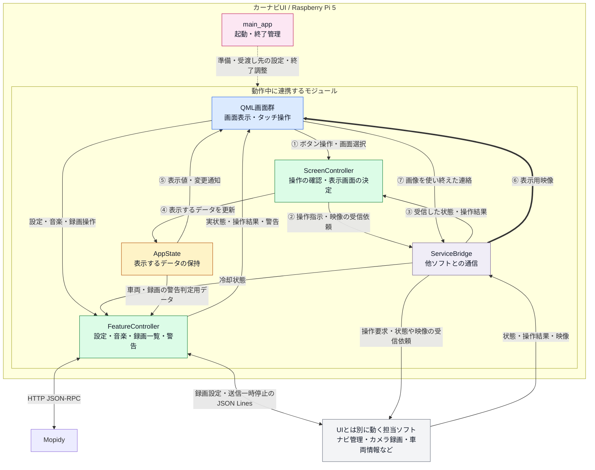
```mermaid
flowchart TB
    subgraph UI["カーナビUI / Raspberry Pi 5"]
        Main["main_app<br/>起動・終了管理"]
        subgraph Runtime["動作中に連携するモジュール"]
            View["QML画面群<br/>画面表示・タッチ操作"]
            Controller["ScreenController<br/>操作の確認・表示画面の決定"]
            State["AppState<br/>表示するデータの保持"]
            Bridge["ServiceBridge<br/>他ソフトとの通信"]
            Features["FeatureController<br/>設定・音楽・録画一覧・警告"]

            View -->|"① ボタン操作・画面選択"| Controller
            Controller -->|"② 操作指示・映像の受信依頼"| Bridge
            Bridge -->|"③ 受信した状態・操作結果"| Controller
            Controller -->|"④ 表示するデータを更新"| State
            State -->|"⑤ 表示値・変更通知"| View
            Bridge ==>|"⑥ 表示用映像"| View
            View -->|"⑦ 画像を使い終えた連絡"| Bridge
            View -->|"設定・音楽・録画操作"| Features
            Features -->|"実状態・操作結果・警告"| View
            Bridge -->|"冷却状態"| Features
            State -->|"車両・録画の警告判定用データ"| Features
        end
        Main -.->|"準備・受渡し先の設定・終了調整"| Runtime
    end
    External["UIとは別に動く担当ソフト<br/>ナビ管理・カメラ録画・車両情報など"]
    Features <-->|"HTTP JSON-RPC"| Mopidy["Mopidy"]
    Features <-->|"録画設定・送信一時停止のJSON Lines"| External
    Bridge -->|"操作要求・状態や映像の受信依頼"| External
    External -->|"状態・操作結果・映像"| Bridge

    classDef lifecycle fill:#FCE7F3,stroke:#BE185D,color:#111827;
    classDef view fill:#DBEAFE,stroke:#2563EB,color:#111827;
    classDef logic fill:#DCFCE7,stroke:#15803D,color:#111827;
    classDef data fill:#FEF3C7,stroke:#B45309,color:#111827;
    classDef communication fill:#F0EDF7,stroke:#75628F,color:#111827;
    classDef outside fill:#F3F4F6,stroke:#6B7280,color:#111827;
    class Main lifecycle;
    class View view;
    class Controller,Features logic;
    class State data;
    class Bridge communication;
    class External outside;
```

**線の意味**

| 線 | 意味 |
| --- | --- |
| 実線の矢印 | 動作中の操作・状態・処理結果の受渡し。矢印の先が受取側 |
| 太線の矢印 | 映像の専用経路。AppStateを通さず表示部品へ渡す |
| 破線の矢印 | main_appによる準備・終了の管理。枠内のモジュール全体が対象 |

番号は接続を識別するためのものであり、①～⑦を必ず順番に実行するという意味ではない。

**モジュール間で渡すもの**

| 接続 | 送る側 → 受け取る側 | 具体例 |
| --- | --- | --- |
| ① | QML画面群 → ScreenController | 「音楽画面を開く」「再生ボタンを押した」 |
| ② | ScreenController → ServiceBridge | 「音楽を再生するよう要求する」「後方映像を受け取り始める」 |
| ③ | ServiceBridge → ScreenController | 「音楽は再生中」「リバースがON」「要求した操作が失敗した」 |
| ④ | ScreenController → AppState | 現在の再生状態、表示する画面、警告などを更新する。判断に必要な現在値もAppStateから参照する |
| ⑤ | AppState → QML画面群 | 「再生状態が変わった」「後方映像を表示する状態になった」 |
| ⑥ | ServiceBridge → QML画面群 | 受信したカメラ映像をVideoSurfaceへ渡す |
| ⑦ | QML画面群 → ServiceBridge | 表示し終えた画像を、再利用できるか確認するために連絡する |

main_appは起動時に各モジュールを準備し、どの情報をどの関数へ渡すかを設定する。動作中の操作や状態通知が毎回main_appを通る構成にはしない。
QML画面群からServiceBridgeへ渡す⑦は画像の使用終了だけであり、画面選択・再生指示・映像の受信開始と終了はScreenControllerを通す。

⑥・⑦の経路には、ServiceBridge側のFrameChannelと表示補助部品frame_presenterが含まれる。これらは主要モジュール間の受渡しを補助する内部部品であり、詳細は[3.5.3](#dd-34)、[3.5.5](#dd-36)、[図4-4](#dd-interface-diagrams)に記載する。
外部アプリの実画面は、現行実装ではSway Waylandセッション上のWaydroid外部ウィンドウとして扱い、固定したナビ表示領域へ移動・リサイズする。Wayland外部サーフェスのQML領域への完全埋込みは将来検討とし、現行実装の前提にはしない。QML側には地図風のデモ画面や、外部画面の下に隠れる検索・ズーム・案内カードなどの操作部品を配置せず、OsmAndの表示状態を外部サービスの結果として管理する。外部画面が起動するまでの領域には、起動待ち状態だけを表示する。

| 境界 | 設計規則 |
| --- | --- |
| QML → Python | 操作の意図を通知する。QMLからGPIO・データベース・他ソフトを直接操作しない |
| 状態の更新 | ScreenController経由でAppStateを更新し、画面からの直接書換えを禁止する |
| UIとは別に動くソフト | ServiceBridgeに通信を集約する。相手ソフトが勝手に表示画面を切り替えない |
| 映像 | 容量の大きい画像データはAppStateへ入れず、3.5.3・3.5.5の表示専用経路を使う |
| main_app | 必要なモジュールの準備と終了管理に限定し、画面ごとの操作判断はScreenControllerに任せる |

<a id="dd-feature-connections"></a>
### 3.2 機能別処理フローチャート

[2.1](#dd-functions)の各機能について、開始から条件判断、処理、完了までの流れを示す。各処理には担当モジュールを併記する。複数のモジュールが協力する処理では、担当欄の矢印で情報の受渡し順を示す。

| 図の記号 | 意味 |
| --- | --- |
| 丸みのある枠 | 処理の開始・終了 |
| 四角 | 実行する処理。担当欄はその処理を行うモジュール |
| ひし形 | 条件判断。「はい／いいえ」に従って進む |
| 矢印 | 次に行う処理。繰り返しの矢印は次の通知・操作・確認機会への継続 |

色は担当モジュールを区別し、複数担当の場合は先頭の担当に合わせる。モジュール間の接続関係全体は[3.1](#dd-31)、各関数の内部処理は[3.7](#dd-310)に記載する。
AppStateとQMLだけを示す表示更新の処理でも、表示データへの書込みはScreenControllerが行う。QMLや通信処理からAppStateを直接書き換えない。

担当ソフトの応答・映像を待つ箇所でも画面操作は止めず、別の操作やリバース通知を処理する。結果が届くか期限切れになった時点で、その要求に対応する処理を再開する。起動・表示・設定要求は現在の要求番号と照合し、古い結果で新しい表示を上書きしない。
映像を表示する処理はAppStateを通さず、ServiceBridgeの画像管理とframe_presenterを介してVideoSurfaceへ渡す。画像の使用終了の連絡と使用中の画像を解放しない規則は、全ての映像表示で適用する。

<a id="dd-feature-f01"></a>
#### 3.2.1 UIの起動（UI-F01）

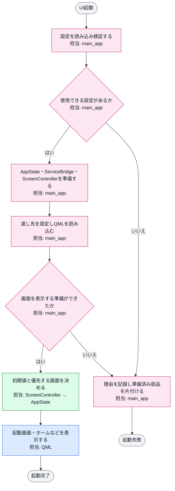
```mermaid
flowchart TB
    A(["UI起動"])
    B["設定を読み込み検証する<br/>担当: main_app"]
    C{"使用できる設定があるか<br/>担当: main_app"}
    D["AppState・ServiceBridge・<br/>ScreenControllerを準備する<br/>担当: main_app"]
    E["渡し先を設定しQMLを読み込む<br/>担当: main_app"]
    F{"画面を表示する準備ができたか<br/>担当: main_app"}
    G["初期値と優先する画面を決める<br/>担当: ScreenController → AppState"]
    H["起動画面・ホームなどを表示する<br/>担当: QML"]
    X["理由を記録し準備済み部品を片付ける<br/>担当: main_app"]
    Z(["起動完了"])
    Y(["起動失敗"])
    A --> B
    B --> C
    C -->|"はい"| D
    C -->|"いいえ"| X
    D --> E
    E --> F
    F -->|"はい"| G
    F -->|"いいえ"| X
    G --> H
    H --> Z
    X --> Y
    classDef terminal fill:#F3F4F6,stroke:#6B7280,color:#111827;
    class A,Z,Y terminal;
    classDef lifecycle fill:#FCE7F3,stroke:#BE185D,color:#111827;
    class B,C,D,E,F,X lifecycle;
    classDef logic fill:#DCFCE7,stroke:#15803D,color:#111827;
    class G logic;
    classDef view fill:#DBEAFE,stroke:#2563EB,color:#111827;
    class H view;
```

不正な設定には安全な既定値を利用できるか確認する。部品の準備・画面読込に失敗した場合は失敗経路へ進み、準備済みのものだけを片付ける。担当ソフトの準備完了はUI起動の必須条件にしない。有効なリバースONを受け取っている場合はホームより後方表示を優先する。

<a id="dd-feature-f02"></a>
#### 3.2.2 通常画面の切替（UI-F02）

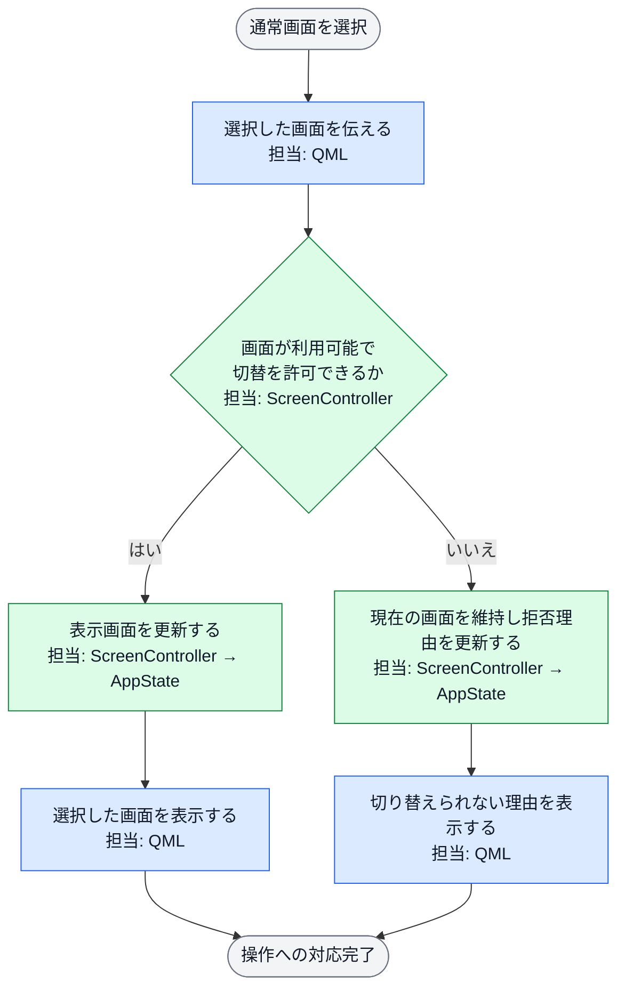
```mermaid
flowchart TB
    A(["通常画面を選択"])
    B["選択した画面を伝える<br/>担当: QML"]
    C{"画面が利用可能で<br/>切替を許可できるか<br/>担当: ScreenController"}
    D["表示画面を更新する<br/>担当: ScreenController → AppState"]
    E["選択した画面を表示する<br/>担当: QML"]
    X["現在の画面を維持し拒否理由を更新する<br/>担当: ScreenController → AppState"]
    Y["切り替えられない理由を表示する<br/>担当: QML"]
    Z(["操作への対応完了"])
    A --> B
    B --> C
    C -->|"はい"| D
    C -->|"いいえ"| X
    D --> E
    E --> Z
    X --> Y
    Y --> Z
    classDef terminal fill:#F3F4F6,stroke:#6B7280,color:#111827;
    class A,Z terminal;
    classDef view fill:#DBEAFE,stroke:#2563EB,color:#111827;
    class B,E,Y view;
    classDef logic fill:#DCFCE7,stroke:#15803D,color:#111827;
    class C,D,X logic;
```

画面内だけの切替にはServiceBridgeを使わない。リバース優先中は通常画面への離脱を許可しない。外部アプリの起動・表示はUI-F03で扱う。

<a id="dd-feature-f03"></a>
#### 3.2.3 ナビ・Android Autoの表示連携（UI-F03）

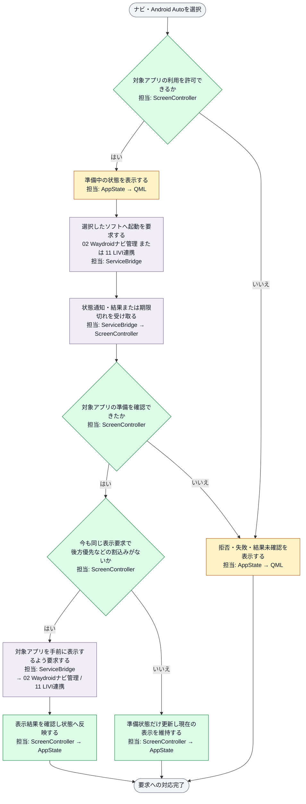
```mermaid
flowchart TB
    A(["ナビ・Android Autoを選択"])
    B{"対象アプリの利用を許可できるか<br/>担当: ScreenController"}
    C["準備中の状態を表示する<br/>担当: AppState → QML"]
    D["選択したソフトへ起動を要求する<br/>02 Waydroidナビ管理 または 11 LIVI連携<br/>担当: ServiceBridge"]
    E["状態通知・結果または期限切れを受け取る<br/>担当: ServiceBridge → ScreenController"]
    F{"対象アプリの準備を確認できたか<br/>担当: ScreenController"}
    G{"今も同じ表示要求で<br/>後方優先などの割込みがないか<br/>担当: ScreenController"}
    H["対象アプリを手前に表示するよう要求する<br/>担当: ServiceBridge<br/>→ 02 Waydroidナビ管理 / 11 LIVI連携"]
    I["表示結果を確認し状態へ反映する<br/>担当: ScreenController → AppState"]
    W["準備状態だけ更新し現在の表示を維持する<br/>担当: ScreenController → AppState"]
    X["拒否・失敗・結果未確認を表示する<br/>担当: AppState → QML"]
    Z(["要求への対応完了"])
    A --> B
    B -->|"はい"| C
    B -->|"いいえ"| X
    C --> D
    D --> E
    E --> F
    F -->|"はい"| G
    F -->|"いいえ"| X
    G -->|"はい"| H
    G -->|"いいえ"| W
    H --> I
    I --> Z
    W --> Z
    X --> Z
    classDef terminal fill:#F3F4F6,stroke:#6B7280,color:#111827;
    class A,Z terminal;
    classDef logic fill:#DCFCE7,stroke:#15803D,color:#111827;
    class B,F,G,I,W logic;
    classDef data fill:#FEF3C7,stroke:#B45309,color:#111827;
    class C,X data;
    classDef communication fill:#F0EDF7,stroke:#75628F,color:#111827;
    class D,E,H communication;
```

要求は選択対象だけへ送る。表示要求の結果が不明なら表示済みとは扱わない。OsmAnd・LIVIは表示領域へ配置する対象とし、Waylandの制約で埋込みできない場合は対応する外部ウィンドウを表示する。起動待ちや表示切替の間もリバース通知を処理する。

<a id="dd-feature-f04"></a>
#### 3.2.4 音楽操作・再生状態の表示（UI-F04）

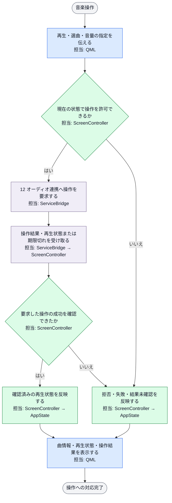
```mermaid
flowchart TB
    A(["音楽操作"])
    B["再生・選曲・音量の指定を伝える<br/>担当: QML"]
    C{"現在の状態で操作を許可できるか<br/>担当: ScreenController"}
    D["12 オーディオ連携へ操作を要求する<br/>担当: ServiceBridge"]
    E["操作結果・再生状態または期限切れを受け取る<br/>担当: ServiceBridge → ScreenController"]
    F{"要求した操作の成功を確認できたか<br/>担当: ScreenController"}
    G["確認済みの再生状態を反映する<br/>担当: ScreenController → AppState"]
    X["拒否・失敗・結果未確認を反映する<br/>担当: ScreenController → AppState"]
    H["曲情報・再生状態・操作結果を表示する<br/>担当: QML"]
    Z(["操作への対応完了"])
    A --> B
    B --> C
    C -->|"はい"| D
    C -->|"いいえ"| X
    D --> E
    E --> F
    F -->|"はい"| G
    F -->|"いいえ"| X
    G --> H
    X --> H
    H --> Z
    classDef terminal fill:#F3F4F6,stroke:#6B7280,color:#111827;
    class A,Z terminal;
    classDef view fill:#DBEAFE,stroke:#2563EB,color:#111827;
    class B,H view;
    classDef logic fill:#DCFCE7,stroke:#15803D,color:#111827;
    class C,F,G,X logic;
    classDef communication fill:#F0EDF7,stroke:#75628F,color:#111827;
    class D,E communication;
```

音声再生は12 オーディオ連携とその連携先が担当する。受付通知だけでは成功を確定しない。操作に関係なく届く曲情報・再生状態の通知も、ScreenControllerからAppStateへ反映する。期限切れ時に同じ操作を無条件で再送しない。

<a id="dd-feature-f05"></a>
#### 3.2.5 カメラ映像の表示（UI-F05）

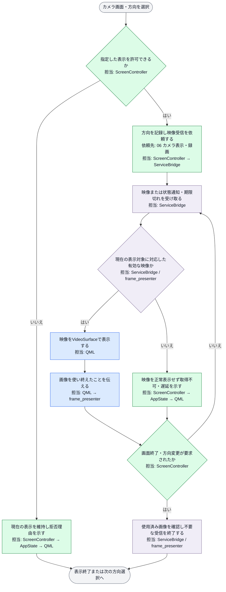
```mermaid
flowchart TB
    A(["カメラ画面・方向を選択"])
    B{"指定した表示を許可できるか<br/>担当: ScreenController"}
    C["方向を記録し映像受信を依頼する<br/>依頼先: 06 カメラ表示・録画<br/>担当: ScreenController → ServiceBridge"]
    D["映像または状態通知・期限切れを受け取る<br/>担当: ServiceBridge"]
    E{"現在の表示対象に対応した<br/>有効な映像か<br/>担当: ServiceBridge / frame_presenter"}
    F["映像をVideoSurfaceで表示する<br/>担当: QML"]
    G["画像を使い終えたことを伝える<br/>担当: QML → frame_presenter"]
    X["映像を正常表示せず取得不可・遅延を示す<br/>担当: ScreenController → AppState → QML"]
    Y["現在の表示を維持し拒否理由を示す<br/>担当: ScreenController → AppState → QML"]
    H{"画面終了・方向変更が要求されたか<br/>担当: ScreenController"}
    I["使用済み画像を確認し不要な受信を終了する<br/>担当: ServiceBridge / frame_presenter"]
    Z(["表示終了または次の方向選択へ"])
    A --> B
    B -->|"はい"| C
    B -->|"いいえ"| Y
    Y --> Z
    C --> D
    D --> E
    E -->|"はい"| F
    E -->|"いいえ"| X
    F --> G
    G --> H
    X --> H
    H -->|"いいえ"| D
    H -->|"はい"| I
    I --> Z
    classDef terminal fill:#F3F4F6,stroke:#6B7280,color:#111827;
    class A,Z terminal;
    classDef logic fill:#DCFCE7,stroke:#15803D,color:#111827;
    class B,C,X,Y,H logic;
    classDef communication fill:#F0EDF7,stroke:#75628F,color:#111827;
    class D,E,I communication;
    classDef view fill:#DBEAFE,stroke:#2563EB,color:#111827;
    class F,G view;
```

映像本体はAppStateへ入れない。方向や警告・録画状態だけを表示データとして保持する。表示中も操作許可を再評価し、リバースなどの割込みに従う。受信待ちの間も終了・方向変更を受け付け、画像を他の利用者が使用中なら解放しない。06 カメラ表示・録画の録画自体は停止しない。

現在の実装は`ServiceBridge` → `CameraClient`でカメラ専用Unixソケットに接続する。方向選択は`FramePresenter.select_camera`から受信方向へ反映し、JPEG本文はFramePresenterのQQuickImageProvider経由でQMLのImageへ渡す。受信画像は最新1件とし、方向変更と有効期間切れで古い表示を消す。共有メモリとVideoSurfaceへの置換は将来拡張とする。録画サービスの状態通知はAppStateへ渡し、3秒間更新がなければ接続・録画中表示を失効させる。

<a id="dd-feature-f06"></a>
#### 3.2.6 後方映像の優先表示（UI-F06）

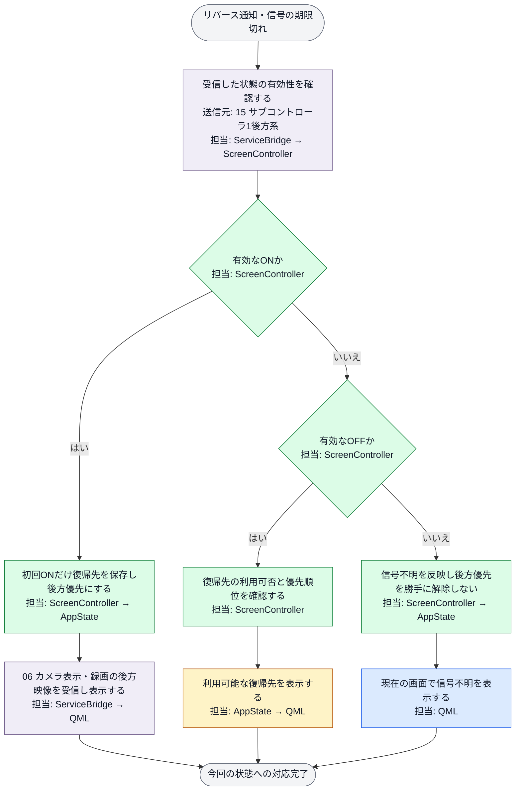
```mermaid
flowchart TB
    A(["リバース通知・信号の期限切れ"])
    B["受信した状態の有効性を確認する<br/>送信元: 15 サブコントローラ1後方系<br/>担当: ServiceBridge → ScreenController"]
    C{"有効なONか<br/>担当: ScreenController"}
    D["初回ONだけ復帰先を保存し後方優先にする<br/>担当: ScreenController → AppState"]
    E["06 カメラ表示・録画の後方映像を受信し表示する<br/>担当: ServiceBridge → QML"]
    F{"有効なOFFか<br/>担当: ScreenController"}
    G["復帰先の利用可否と優先順位を確認する<br/>担当: ScreenController"]
    H["利用可能な復帰先を表示する<br/>担当: AppState → QML"]
    X["信号不明を反映し後方優先を勝手に解除しない<br/>担当: ScreenController → AppState"]
    Y["現在の画面で信号不明を表示する<br/>担当: QML"]
    Z(["今回の状態への対応完了"])
    A --> B
    B --> C
    C -->|"はい"| D
    D --> E
    E --> Z
    C -->|"いいえ"| F
    F -->|"はい"| G
    G --> H
    H --> Z
    F -->|"いいえ"| X
    X --> Y
    Y --> Z
    classDef terminal fill:#F3F4F6,stroke:#6B7280,color:#111827;
    class A,Z terminal;
    classDef communication fill:#F0EDF7,stroke:#75628F,color:#111827;
    class B,E communication;
    classDef logic fill:#DCFCE7,stroke:#15803D,color:#111827;
    class C,D,F,G,X logic;
    classDef data fill:#FEF3C7,stroke:#B45309,color:#111827;
    class H data;
    classDef view fill:#DBEAFE,stroke:#2563EB,color:#111827;
    class Y view;
```

15 サブコントローラ1後方系のリバース信号と06 カメラ表示・録画の後方映像は別経路で受け取る。映像取得・遅延時の処理はUI-F05に従い、映像が途切れても後方優先を解除しない。復帰先がなければホームを候補とする。初回から信号不明の場合は後方優先だったと仮定せず、既存画面と不明状態を保持する。

<a id="dd-feature-f07"></a>
#### 3.2.7 車両・運用状態の表示（UI-F07）

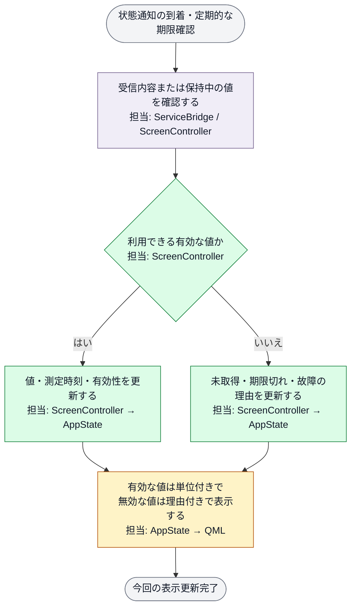
```mermaid
flowchart TB
    A(["状態通知の到着・定期的な期限確認"])
    B["受信内容または保持中の値を確認する<br/>担当: ServiceBridge / ScreenController"]
    C{"利用できる有効な値か<br/>担当: ScreenController"}
    D["値・測定時刻・有効性を更新する<br/>担当: ScreenController → AppState"]
    X["未取得・期限切れ・故障の理由を更新する<br/>担当: ScreenController → AppState"]
    E["有効な値は単位付きで<br/>無効な値は理由付きで表示する<br/>担当: AppState → QML"]
    Z(["今回の表示更新完了"])
    A --> B
    B --> C
    C -->|"はい"| D
    C -->|"いいえ"| X
    D --> E
    X --> E
    E --> Z
    classDef terminal fill:#F3F4F6,stroke:#6B7280,color:#111827;
    class A,Z terminal;
    classDef communication fill:#F0EDF7,stroke:#75628F,color:#111827;
    class B communication;
    classDef logic fill:#DCFCE7,stroke:#15803D,color:#111827;
    class C,D,X logic;
    classDef data fill:#FEF3C7,stroke:#B45309,color:#111827;
    class E data;
```

状態通知の受信登録はUI準備後に行う。値の送信元は09 OBD2車両情報取得、06 カメラ表示・録画、10 冷却ファン制御などとし、受信が止まってもScreenControllerが期限を確認する。古い値を受け取り直しても有効期間を延ばさず、取得失敗を数値0にしない。位置品質の通知経路は別途確定する。

<a id="dd-feature-f08"></a>
#### 3.2.8 警告表示（UI-F08）

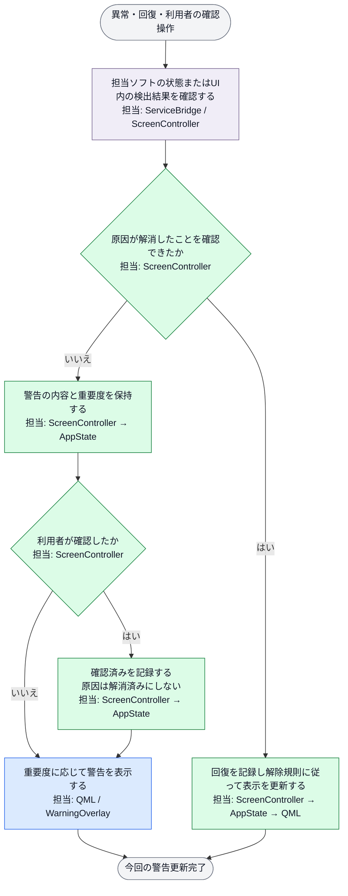
```mermaid
flowchart TB
    A(["異常・回復・利用者の確認操作"])
    B["担当ソフトの状態またはUI内の検出結果を確認する<br/>担当: ServiceBridge / ScreenController"]
    C{"原因が解消したことを確認できたか<br/>担当: ScreenController"}
    D["警告の内容と重要度を保持する<br/>担当: ScreenController → AppState"]
    E{"利用者が確認したか<br/>担当: ScreenController"}
    F["確認済みを記録する<br/>原因は解消済みにしない<br/>担当: ScreenController → AppState"]
    G["重要度に応じて警告を表示する<br/>担当: QML / WarningOverlay"]
    X["回復を記録し解除規則に従って表示を更新する<br/>担当: ScreenController → AppState → QML"]
    Z(["今回の警告更新完了"])
    A --> B
    B --> C
    C -->|"いいえ"| D
    D --> E
    E -->|"はい"| F
    E -->|"いいえ"| G
    F --> G
    G --> Z
    C -->|"はい"| X
    X --> Z
    classDef terminal fill:#F3F4F6,stroke:#6B7280,color:#111827;
    class A,Z terminal;
    classDef communication fill:#F0EDF7,stroke:#75628F,color:#111827;
    class B communication;
    classDef logic fill:#DCFCE7,stroke:#15803D,color:#111827;
    class C,D,E,F,X logic;
    classDef view fill:#DBEAFE,stroke:#2563EB,color:#111827;
    class G view;
```

警告一覧はAppState内のWarningModelで保持する。原因が解消した根拠を確認できない場合は回復扱いにしない。利用者の確認だけで警告を正常に戻さず、後方映像の重要な領域を隠さない。

<a id="dd-feature-f09"></a>
#### 3.2.9 設定の変更・保存（UI-F09）

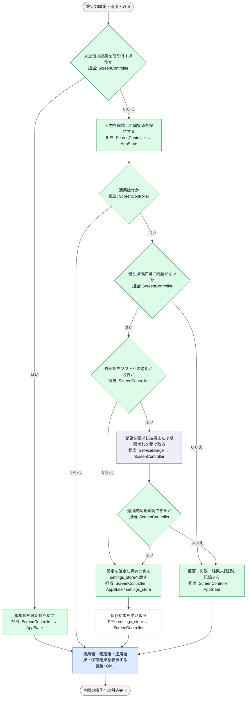
```mermaid
flowchart TB
    A(["設定の編集・適用・取消"])
    B{"未送信の編集を取り消す操作か<br/>担当: ScreenController"}
    C["編集値を確定値へ戻す<br/>担当: ScreenController → AppState"]
    D["入力を確認して編集値を保持する<br/>担当: ScreenController → AppState"]
    E{"適用操作か<br/>担当: ScreenController"}
    F{"値と操作許可に問題がないか<br/>担当: ScreenController"}
    G{"外部担当ソフトへの適用が必要か<br/>担当: ScreenController"}
    H["変更を要求し結果または期限切れを受け取る<br/>担当: ServiceBridge → ScreenController"]
    I{"適用成功を確認できたか<br/>担当: ScreenController"}
    J["設定を確定し保存対象をsettings_storeへ渡す<br/>担当: ScreenController → AppState / settings_store"]
    K["保存結果を受け取る<br/>担当: settings_store → ScreenController"]
    X["拒否・失敗・結果未確認を記録する<br/>担当: ScreenController → AppState"]
    L["編集値・確定値・適用結果・保存結果を表示する<br/>担当: QML"]
    Z(["今回の操作への対応完了"])
    A --> B
    B -->|"はい"| C
    C --> L
    B -->|"いいえ"| D
    D --> E
    E -->|"いいえ"| L
    E -->|"はい"| F
    F -->|"いいえ"| X
    F -->|"はい"| G
    G -->|"はい"| H
    G -->|"いいえ"| J
    H --> I
    I -->|"はい"| J
    I -->|"いいえ"| X
    J --> K
    K --> L
    X --> L
    L --> Z
    classDef terminal fill:#F3F4F6,stroke:#6B7280,color:#111827;
    class A,Z terminal;
    classDef logic fill:#DCFCE7,stroke:#15803D,color:#111827;
    class B,C,D,E,F,G,I,J,X logic;
    classDef communication fill:#F0EDF7,stroke:#75628F,color:#111827;
    class H communication;
    classDef helper fill:#FFFFFF,stroke:#64748B,color:#111827;
    class K helper;
    classDef view fill:#DBEAFE,stroke:#2563EB,color:#111827;
    class L view;
```

外部へ送信済みの操作を、編集取消だけで取り消せたとは扱わない。取消の可否は担当ソフトの結果を確認する。保存対象は確定済みの利用者設定だけとし、適用成功とファイル保存成功は別々に管理する。AppStateやQMLは直接ファイルを書き込まない。

<a id="dd-feature-f10"></a>
#### 3.2.10 UIの終了（UI-F10）

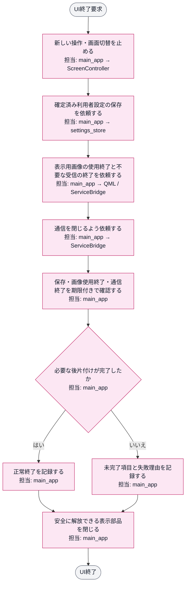
```mermaid
flowchart TB
    A(["UI終了要求"])
    B["新しい操作・画面切替を止める<br/>担当: main_app → ScreenController"]
    C["確定済み利用者設定の保存を依頼する<br/>担当: main_app → settings_store"]
    D["表示用画像の使用終了と不要な受信の終了を依頼する<br/>担当: main_app → QML / ServiceBridge"]
    E["通信を閉じるよう依頼する<br/>担当: main_app → ServiceBridge"]
    F["保存・画像使用終了・通信終了を期限付きで確認する<br/>担当: main_app"]
    G{"必要な後片付けが完了したか<br/>担当: main_app"}
    H["正常終了を記録する<br/>担当: main_app"]
    X["未完了項目と失敗理由を記録する<br/>担当: main_app"]
    I["安全に解放できる表示部品を閉じる<br/>担当: main_app"]
    Z(["UI終了"])
    A --> B
    B --> C
    C --> D
    D --> E
    E --> F
    F --> G
    G -->|"はい"| H
    G -->|"いいえ"| X
    H --> I
    X --> I
    I --> Z
    classDef terminal fill:#F3F4F6,stroke:#6B7280,color:#111827;
    class A,Z terminal;
    classDef lifecycle fill:#FCE7F3,stroke:#BE185D,color:#111827;
    class B,C,D,E,F,G,H,X,I lifecycle;
```

終了処理中も結果通知を受け取る。待ち時間を超えた処理を成功扱いにせず、他の利用者が使用中の画像を削除・再利用しない。UI終了だけを理由に録画担当ソフトやOSを停止しない。

<a id="dd-feature-f11"></a>
#### 3.2.11 駐車サラウンドの表示（UI-F11）

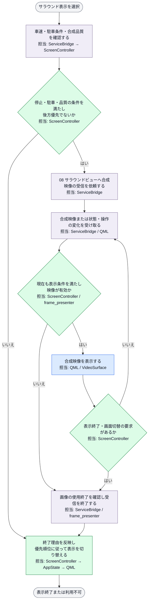
```mermaid
flowchart TB
    A(["サラウンド表示を選択"])
    B["車速・駐車条件・合成品質を確認する<br/>担当: ServiceBridge → ScreenController"]
    C{"停止・駐車・品質の条件を満たし<br/>後方優先でないか<br/>担当: ScreenController"}
    D["08 サラウンドビューへ合成映像の受信を依頼する<br/>担当: ServiceBridge"]
    E["合成映像または状態・操作の変化を受け取る<br/>担当: ServiceBridge / QML"]
    F{"現在も表示条件を満たし<br/>映像が有効か<br/>担当: ScreenController / frame_presenter"}
    G["合成映像を表示する<br/>担当: QML / VideoSurface"]
    H{"表示終了・画面切替の要求があるか<br/>担当: ScreenController"}
    I["画像の使用終了を確認し受信を終了する<br/>担当: ServiceBridge / frame_presenter"]
    X["終了理由を反映し<br/>優先順位に従って表示を切り替える<br/>担当: ScreenController → AppState → QML"]
    Z(["表示終了または利用不可"])
    A --> B
    B --> C
    C -->|"はい"| D
    C -->|"いいえ"| X
    D --> E
    E --> F
    F -->|"はい"| G
    F -->|"いいえ"| I
    G --> H
    H -->|"いいえ"| E
    H -->|"はい"| I
    I --> X
    X --> Z
    classDef terminal fill:#F3F4F6,stroke:#6B7280,color:#111827;
    class A,Z terminal;
    classDef communication fill:#F0EDF7,stroke:#75628F,color:#111827;
    class B,D,E,I communication;
    classDef logic fill:#DCFCE7,stroke:#15803D,color:#111827;
    class C,F,H,X logic;
    classDef view fill:#DBEAFE,stroke:#2563EB,color:#111827;
    class G view;
```

表示条件の確認は受信が止まっている間も定期的に行う。通常の終了・画面切替では利用不可の警告を出さず、選択先へ戻す。条件不明・品質低下では許可を取り消し、リバースONなら後方表示を優先する。駐車条件の判定元・閾値は実機で確定する。

<a id="dd-39"></a>
### 3.3 モジュールツリー

モジュールツリーは、UIを構成するモジュールと、その内部の構成要素を示す。枝は構成上の所属を表し、実行順序や呼出し順序は表さない。
機能は[2.1](#dd-functions)、関数の所属と処理手順は[3.7](#dd-310)、配置するファイルは[3.6](#dd-37)に記載する。

```text
カーナビUIアプリ
|
+-- 起動・終了管理モジュール（main_app）
|
+-- 画面切替管理モジュール（ScreenController）
|
+-- 通信モジュール（ServiceBridge）
|   +-- 相手別の通信手順（ServiceAdapters）
|   +-- 操作依頼の管理（CommandRegistry）
|   +-- 通信の実行（TransportWorker）
|   +-- 受信内容の確認（EventValidator）
|   +-- 受信開始・終了の管理（SubscriptionRegistry）
|   +-- 画像の受渡し管理（FrameChannel）
|
+-- 表示データ管理モジュール（AppState）
|   +-- 警告一覧の管理部品（WarningModel）
|
+-- 画面表示モジュール（QML画面群）
    +-- 画面の土台（Main.qml / ScreenHost.qml）
    +-- 各画面（HomeScreen.qml / AudioScreen.qmlなど）
    +-- 共通表示・操作部品
    |   +-- 状態表示（StatusBar.qml）
    |   +-- 共通操作（NavigationBar.qml）
    |   +-- 警告表示（WarningOverlay.qml）
    +-- 表示テーマ（Theme.qml）
    +-- 映像表示部品（VideoSurface）
```

下位の構成要素は、各モジュールの責務を分担する内部部品である。1つのモジュールを必ず1ファイル・1クラス・1つのOSプロセスに対応させる必要はない。
設定保存の補助部品はsettings_store.py、映像表示の補助部品はframe_presenter.pyとする。データ項目の構成は[5章](#dd-5)に記載する。

<a id="dd-38"></a>
### 3.4 モジュール間の処理順序

以下はナビ起動中にリバースがONになる場合の例。UIとは別に動くソフトの準備完了と前面表示の許可を分ける。

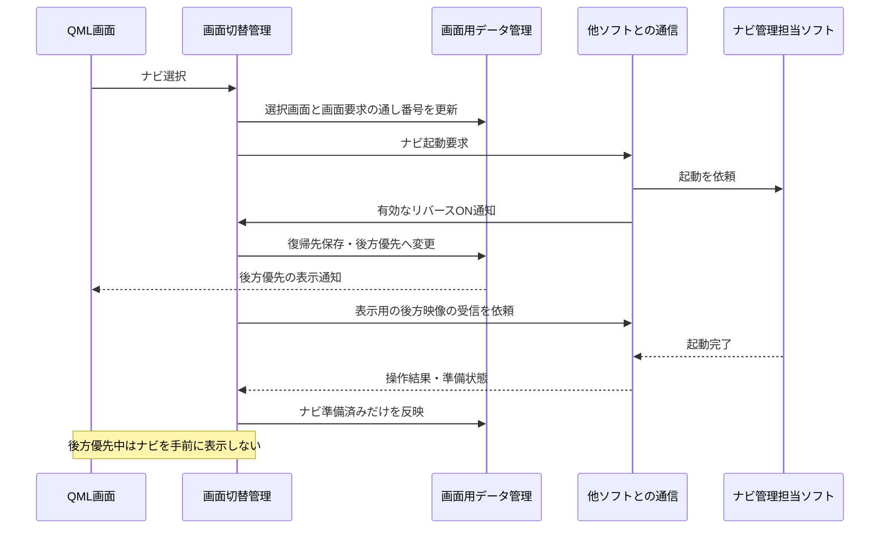
```mermaid
sequenceDiagram
    participant Q as QML画面
    participant C as 画面切替管理
    participant S as 画面用データ管理
    participant B as 他ソフトとの通信
    participant N as ナビ管理担当ソフト
    Q->>C: ナビ選択
    C->>S: 選択画面と画面要求の通し番号を更新
    C->>B: ナビ起動要求
    B->>N: 起動を依頼
    B->>C: 有効なリバースON通知
    C->>S: 復帰先保存・後方優先へ変更
    S-->>Q: 後方優先の表示通知
    C->>B: 表示用の後方映像の受信を依頼
    N-->>B: 起動完了
    B-->>C: 操作結果・準備状態
    C->>S: ナビ準備済みだけを反映
    Note over C,Q: 後方優先中はナビを手前に表示しない
```

| 処理の分担 | 行う仕事 | 他の処理への渡し方 |
| --- | --- | --- |
| 画面操作を担当する処理 | タッチ操作の受付、表示画面の判定、画面用データの更新 | 短時間で終え、長い通信待ち・ファイル読書きを行わない |
| 裏で動く通信処理 | 接続、送受信、内容確認、再接続 | 確認済みの通知を一時的に保存し、画面操作を担当する処理へ順に渡す |
| 裏で動く設定保存処理 | 設定ファイルへの書込みと結果通知 | どの設定変更の結果かを識別できる番号を付けて返す |
| 映像受渡し・描画 | 圧縮映像を画像へ戻す処理、形式の変換、表示 | 採用する表示方式で決められた実行場所を守り、画像の使用開始・終了を管理する |

終了時は新しい操作を受け付けず、状態通知と映像の受信を終了する。表示中の画像を使い終えたことを伝え、通信を閉じて裏で動く処理を終了する。
遅れて届いた通知は、「終了処理中か」「どの受信開始に対応する通知か」を確認し、閉じた画面には渡さない。
通信処理の終了や設定保存には待ち時間の上限を設け、いつまでも終了できない状態を避ける。時間内に終わらなければ、正常終了・保存成功とは記録しない。

<a id="dd-module-details"></a>
### 3.5 モジュール詳細

カーナビUIを構成する5つのモジュールについて、内部の処理・入出力・役割分担を説明する。各モジュールの説明を3.5.1～3.5.5に記載する。モジュール間の処理順序は[3.4](#dd-38)、ファイル構成は[3.6](#dd-37)を参照する。

<a id="dd-32"></a>
#### 3.5.1 起動・終了管理（main_app）の内部構成

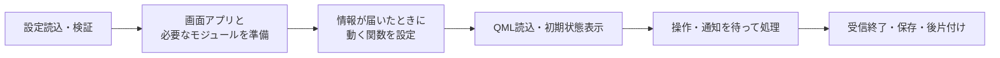
```mermaid
flowchart LR
    Config["設定読込・検証"] --> Create["画面アプリと<br/>必要なモジュールを準備"]
    Create --> Wire["情報が届いたときに<br/>動く関数を設定"]
    Wire --> Load["QML読込・初期状態表示"]
    Load --> Run["操作・通知を待って処理"]
    Run --> Stop["受信終了・保存・後片付け"]
```

| 公開関数の案 | 入力・出力 | 役割（処理手順は3.7参照） |
| --- | --- | --- |
| load_ui_config | 設定ファイル → 検証済み設定 | バージョン・型・範囲を確認。秘密情報は画面へ渡さない |
| build_dependencies | 設定 → 準備したモジュールの一覧 | AppState、ServiceBridge、ScreenControllerの順に生成する |
| connect_components | 準備したモジュールの一覧 → 設定結果 | 状態や操作結果が届いたとき、どの関数に渡すかを設定する。設定保存や通信終了の結果を受け取る処理も指定する。QMLのボタン操作との対応付けはload_viewで行う |
| load_view | 画面全体の定義と操作・データの受渡し先 | QMLには表示用AppStateと操作用Controllerだけを公開する |
| begin_shutdown | 停止理由 → 終了結果 | 新しい操作を受け付けず、状態・映像の受信を終了し、設定を保存して裏で動く処理を終了する。終了待ちには上限を設ける |

設定ファイルの読み書きなど、完了まで待ち時間が発生する処理で画面操作を長時間止めない。
画面全体の読込失敗など、UI自体を表示できない異常は理由をログに残して起動失敗として終了する。
UIとは別に動くソフトが未起動という理由だけではUI起動を失敗させない。UIの再起動で録画・位置補正担当ソフトを再起動しない。

<a id="dd-33"></a>
#### 3.5.2 画面切替管理（ScreenController）の内部構成

下図の各要素は、画面切替管理の中で行う仕事を分けたものとする。最初から全てを別のプログラム部品にせず、個別試験や他の場所での利用が必要になった段階で分ける。

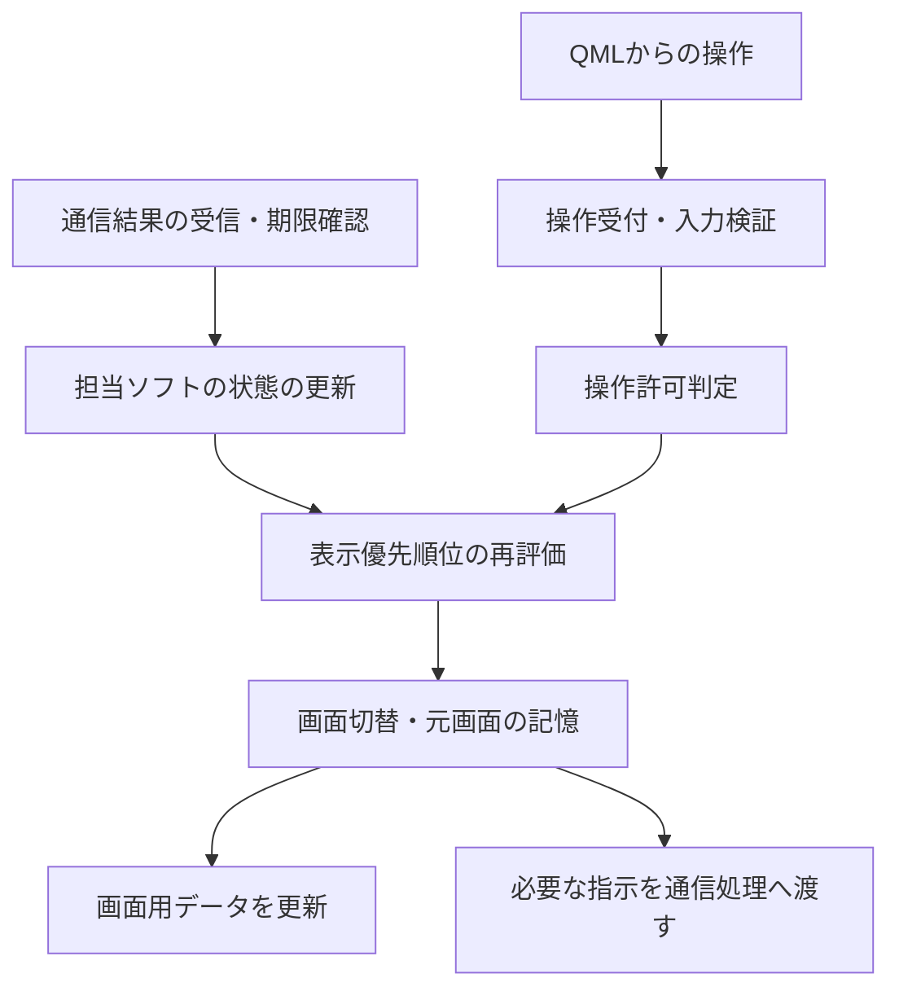
```mermaid
flowchart TB
    User["QMLからの操作"] --> Check["操作受付・入力検証"]
    Notify["通信結果の受信・期限確認"] --> Merge["担当ソフトの状態の更新"]
    Check --> Gate["操作許可判定"]
    Merge --> Decide["表示優先順位の再評価"]
    Gate --> Decide
    Decide --> Route["画面切替・元画面の記憶"]
    Route --> Commit["画面用データを更新"]
    Route --> Command["必要な指示を通信処理へ渡す"]
```

| 公開関数の案 | 役割 | 主な判定・結果（処理手順は3.7参照） |
| --- | --- | --- |
| request_screen | 画面選択を受理 | 画面ID、操作許可、後方優先を検査する |
| handle_action | 再生・音量・設定等の受付 | 部品ID・操作に必要な値・許可範囲を検証し、拒否理由を返す |
| on_service_event | 通信処理から受けた通知の反映 | 担当ソフトの状態・観測期限を更新する |
| reevaluate_display | 最優先の画面を決定 | 後方優先、俯瞰許可、通常選択の順に判定する |
| restore_previous_screen | 割込みからの復帰 | 復帰先の利用可否を再評価し、利用不可ならホームへ |
| on_command_result | 後から届く処理結果の確認 | 操作の識別番号（command_id）と、画面要求の通し番号を照合する |
| expire_stale_data | データの期限確認 | 古い車速やリバースをUNKNOWN等へ更新し、操作許可を取り消す |

画面切替では「ソフトを起動する依頼」と「そのソフトを手前に表示する依頼」を分ける。起動完了後にも優先順位を再評価する。
リバースONの初回だけprevious_screenを保存し、定期ON通知や担当ソフトへの再接続で復帰先を上書きしない。
「表示してよいかを判断する処理」と「実際に他ソフトへ指示を送る処理」を分け、それぞれ試験できるようにする。
画面用データの変更通知を、同じ変更を指示する処理へそのまま戻さない。通知と更新が際限なく繰り返されることを防ぐ。

<a id="dd-34"></a>
#### 3.5.3 他ソフトとの通信（ServiceBridge）の内部構成

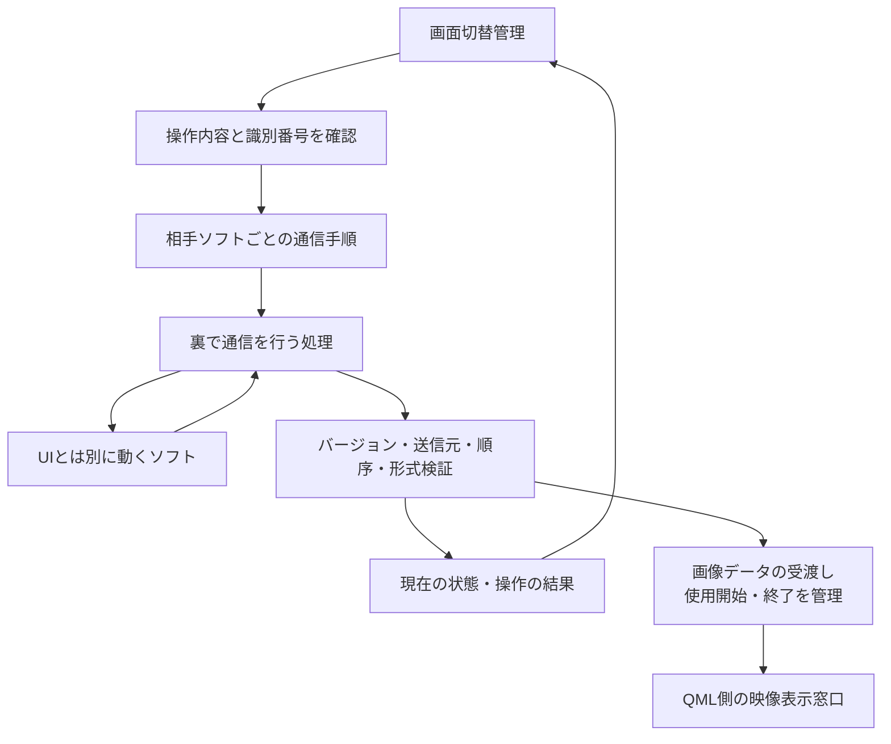
```mermaid
flowchart TB
    C["画面切替管理"] --> Send["操作内容と識別番号を確認"]
    Send --> Adapter["相手ソフトごとの通信手順"]
    Adapter --> Worker["裏で通信を行う処理"]
    Worker --> External["UIとは別に動くソフト"]
    External --> Worker
    Worker --> Validate["バージョン・送信元・順序・形式検証"]
    Validate --> Result["現在の状態・操作の結果"]
    Result --> C
    Validate --> Frame["画像データの受渡し<br/>使用開始・終了を管理"]
    Frame --> Surface["QML側の映像表示窓口"]
```

| 内部要素 | 役割 | 制約 |
| --- | --- | --- |
| 操作依頼の管理（CommandRegistry） | 操作の識別番号、画面要求の通し番号、待ち時間の上限、結果を管理 | 受付と完了を分け、古い結果を新要求へ適用しない |
| 相手別の通信手順（ServiceAdapters） | 相手ソフトごとに違う指示・通知の形式を、UIで使う共通形式へ変換 | 相手ソフトごとの操作手順や通信方式を、QML側で扱わない |
| 裏で動く通信処理（TransportWorker） | 接続、送受信、再接続 | 通信を並行して行う処理の数は実装時に決める。相手ソフトの数だけ増やす必要はない |
| 受信内容の確認（EventValidator） | 共通仕様で決めた送信元・番号・値・順序を確認。`schema_version=1`だけを受け入れ、`boot_id`と`sequence`で古い通知を破棄 | 古い測定値を受け取り直しても、利用できる期限を延ばさない |
| 継続して受け取る情報の管理（SubscriptionRegistry） | 状態通知・映像の受信開始と終了を管理 | 画面を切り替えた後は、もう使わない通知・映像を受け取り続けない。録画自体は停止しない |
| 画像の受渡し（FrameChannel） | 表示する画像データと、その保存場所を表示部品へ渡す | 表示待ち画像の数に上限を設け、最新の画像を優先する。使用中の画像を勝手に削除・再利用しない |

呼出し口の名前は、操作指示の送信（send_command）、状態通知の受信開始（subscribe_state）、映像の受信開始（subscribe_video）、指定した受信の終了（unsubscribe）、通信全体の終了（close）とする。02 Waydroidナビ管理との実通信は、Pi 5上のUnixドメインソケットを通るJSON Linesで行う。09 OBD2車両情報取得と03 現在地補正も、それぞれ別のUnixドメインソケットを使用し、OBD2やGPSの周期通知がナビ操作を遅延させないようにする。03からは`position.status`、`position.update`、`position.invalidate`を受け取り、GPS測位中・信号喪失・補正中を画面状態へ反映する。1行1JSONオブジェクトとして要求・応答を交換し、状態変化は`event`付きの通知として受け取る。
受け取った状態通知（service_event）と操作結果（command_result）は、画面操作を担当する処理へ渡す。ServiceBridgeの通信処理はUIスレッドを待たせないように別スレッドで実行し、QtのSignal/Slotで画面操作側へ通知する。02 Waydroidナビ管理は要求受付時に`accepted=true`と`QUEUED`を返し、処理完了時に同じ`command_id`の`command_result`を通知する。Windows開発環境でソケットがない場合は未接続状態を通知し、画面単体の確認を妨げない。
表示待ちの状態情報は、相手ソフトと項目ごとに最新値を残す。一方、操作結果は操作の識別番号ごとに成功・失敗などの最終結果を保持し、別操作の結果で上書きしない。
再接続後は相手ソフトに現在の状態をまとめて送り直してもらう。接続が切れる前の操作を勝手にやり直さない。

圧縮映像を画像へ戻したり、表示用の画像形式へ変換したりする場合も、重い計算でタッチ操作を止めない。
画像の保存場所を伝える形式、ソフト間の受渡し方法、表示側が使い終わったと知らせる時点は、06 カメラ表示・録画の設計と合わせて決める。画像を複製せずに受け渡せるかは、まだ確認できていない。

<a id="dd-35"></a>
#### 3.5.4 画面用データ管理（AppState）の内部構成

AppStateは、画面に見せる情報をまとめて置いておく場所である。例えば「車速42 km/h」「音楽は再生中」「今は後方画面」という情報を保持する。
データベースや録画保存先ではなく、主にアプリが動いている間のメモリ上で管理する。

| 役割 | 具体例 |
| --- | --- |
| 値を保持する | 現在の車速と、その値がいつ測られたかを保持する |
| 状態も一緒に保持する | 同じ数値0でも「停止中」と「取得できなかった」を区別する |
| 変わった部分を伝える | 再生状態が変わったら、音楽画面の表示更新を知らせる |
| 複数画面で情報を揃える | 共通バーと音楽画面で、同じ再生状態・音量を使う |
| 表示用の形で返す | 内部の車速をkm/hへ換算し、単位とともに画面へ渡す |
| OBD2の取得量を切り替える | 車両情報画面では詳細項目、それ以外では車速・冷却水温など最小項目だけを取得するようServiceBridgeへ要求する |

「どの画面へ切り替えるか」を決めるのはScreenController、ボタンの配置や色を決めるのはQMLである。
AppStateはその判断に従って値を保持・通知するが、車両への通信、録画、画面切替の判断そのものは行わない。

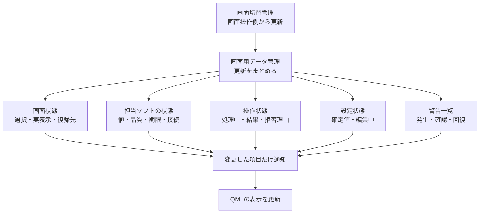
```mermaid
flowchart TB
    C["画面切替管理<br/>画面操作側から更新"] --> State["画面用データ管理<br/>更新をまとめる"]
    State --> Display["画面状態<br/>選択・実表示・復帰先"]
    State --> Services["担当ソフトの状態<br/>値・品質・期限・接続"]
    State --> Commands["操作状態<br/>処理中・結果・拒否理由"]
    State --> Settings["設定状態<br/>確定値・編集中"]
    State --> Warnings["警告一覧<br/>発生・確認・回復"]
    Display --> Notify["変更した項目だけ通知"]
    Services --> Notify
    Commands --> Notify
    Settings --> Notify
    Warnings --> Notify
    Notify --> Qml["QMLの表示を更新"]
```

| 状態グループ | 内容 | 更新規則 |
| --- | --- | --- |
| 表示画面の情報（DisplayState） | selected_screen、effective_screen、camera_mode、previous_screen、request_generation | 切り替える画面を決めてから、関係する値をまとめて更新する |
| 担当ソフトの情報（ServiceState） | service_health、reverse_validity、motion_state、項目別観測値・期限 | 真の0、未取得、期限切れを区別する |
| 操作の処理状況（CommandState） | pending_commands、操作結果、拒否理由 | 成功・失敗などの最終結果が出た操作は、保存期間を過ぎたら一覧から整理する |
| 設定値（SettingsState） | user_settings、editing_settings | 担当ソフトから届いた適用結果を確認してから確定値へ反映 |
| 警告一覧（WarningModel） | 発生元・コード・重要度・確認状態 | 原因状態と「利用者が確認した」を別に持つ |

AppStateを書き換えるのは、画面操作を担当する処理だけとする。裏で動く通信処理などは結果を通知し、画面のデータや表示部品を直接書き換えない。
画面には表示用の値や一覧を渡し、画面側から元データを書き換えられないようにする。変更があった項目・行・画面だけを更新し、同じ値の通知を繰り返さない。
画像データそのもの、秘密情報、容量の大きな録画ファイル一覧は保持しない。画面に表示する単位や桁数の変換では元データを書き換えず、操作許可の判断に使う数値を丸めない。
詳しいデータ項目は[5.2 UI状態・設定の管理](#dd-52)と対応させる。

<a id="dd-36"></a>
#### 3.5.5 画面表示（QML）・共通部品の内部構成

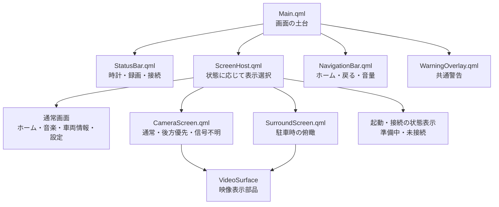
```mermaid
flowchart TB
    Root["Main.qml<br/>画面の土台"] --> Status["StatusBar.qml<br/>時計・録画・接続"]
    Root --> Host["ScreenHost.qml<br/>状態に応じて表示選択"]
    Root --> Nav["NavigationBar.qml<br/>ホーム・戻る・音量"]
    Root --> Warning["WarningOverlay.qml<br/>共通警告"]
    Host --> Basic["通常画面<br/>ホーム・音楽・車両情報・設定"]
    Host --> Camera["CameraScreen.qml<br/>通常・後方優先・信号不明"]
    Host --> Surround["SurroundScreen.qml<br/>駐車時の俯瞰"]
    Host --> Waiting["起動・接続の状態表示<br/>準備中・未接続"]
    Camera --> Surface["VideoSurface<br/>映像表示部品"]
    Surround --> Surface
```

| 要素 | 構成方針 | 入出力 |
| --- | --- | --- |
| Main.qml | 共通領域と主表示を配置する | AppState参照、Controller操作窓口 |
| ScreenHost.qml | effective_screenに応じて画面を選ぶ | 画面を選ぶ判断をQML側に重複して作らない |
| 各Screen.qml | 画面固有の配置と操作意図の通知 | GPIO・担当ソフトとの通信・設定ファイル等への直接保存は禁止 |
| CameraScreen.qml | UI-CAMERA / UI-REARを同じ部品で表示 | camera_modeに応じて操作許可・表示を変更 |
| VideoSurface | 画像の表示と未取得表示 | 画像の有効期限、受信開始時の番号、使用中の画像かどうかを確認 |
| 共通バー・警告 | 一貫した表示・操作 | 同じ状態を画面ごとに複製しない |
| Theme.qml | 色、文字、余白、昼夜表示の定義 | 設定に応じてテーマを切替 |

VideoSurfaceはQMLから使用する表示部品名の案であり、純粋なQML、Qt Multimedia、独自描画部品のどれで実装するかは未確定。
画面を破棄してもAppStateと担当ソフトの状態は存続する。一時的な編集値は定義された保存・破棄ルールに従う。
表示する映像の受信開始・終了は画面切替管理を通して行う。表示側が画像を使い終わったら、その画像の管理元へ使用終了を伝える。画面を閉じても録画は止めない。
外部アプリの実画面は、上図の自作画面の中に組み込まれているとは扱わない。ExternalAppStatusは自作の起動待ち表示だけを担当する。

<a id="dd-feature-controller"></a>
#### 3.5.6 追加機能管理（FeatureController）の実装

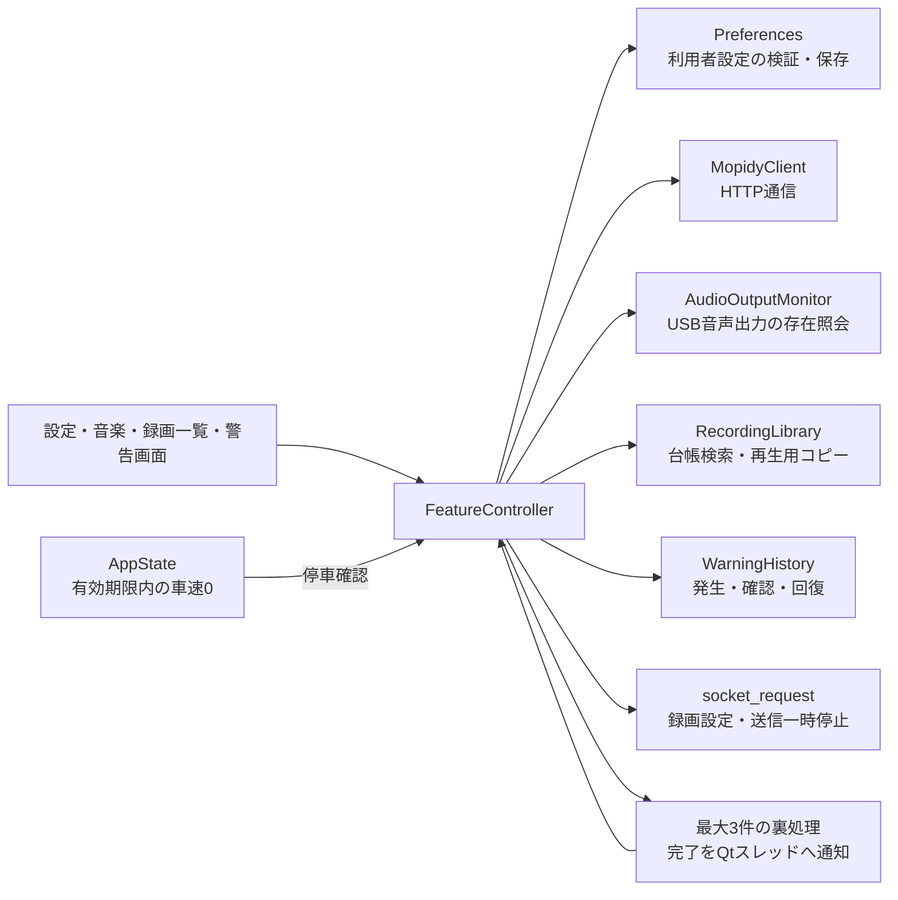
```mermaid
flowchart LR
    QML["設定・音楽・録画一覧・警告画面"] --> Features["FeatureController"]
    Features --> Preferences["Preferences<br/>利用者設定の検証・保存"]
    Features --> Music["MopidyClient<br/>HTTP通信"]
    Features --> Output["AudioOutputMonitor<br/>USB音声出力の存在照会"]
    State["AppState<br/>有効期限内の車速0"] -->|"停車確認"| Features
    Features --> Videos["RecordingLibrary<br/>台帳検索・再生用コピー"]
    Features --> Warning["WarningHistory<br/>発生・確認・回復"]
    Features --> IPC["socket_request<br/>録画設定・送信一時停止"]
    Worker["最大3件の裏処理<br/>完了をQtスレッドへ通知"] --> Features
    Features --> Worker
```

| 関数 | 入力と処理 | 結果・異常時 |
| --- | --- | --- |
| `submit` / `_complete` | 処理名で二重起動を抑え、保存・通信・コピーを実行 | Qtスレッドで結果を反映。保存/復元/バックアップ、録画読込/適用は組ごとに同時実行を禁止 |
| `edit` / `apply` / `cancel` | 編集値を確定値と分離し、検証・原子的保存後に適用 | 保存失敗時は確定値を維持。取消は送信済み要求の取消ではない |
| `backup` / `restore` | 確定済み設定を保存、確認ダイアログ後に検証して復元 | カメラ・送信設定・認証情報は対象外 |
| `music` / `browse` / `poll` | Mopidyへ許可した操作を送り、状態を読み戻す | 未接続・5秒の更新停止では操作不可。結果不明の操作は再送しない |
| `search_music` / `music_page` / `music_back` | 曲検索、50件単位のページ切替、フォルダ履歴 | 501件以降も保持。応答2MB超過は失敗 |
| `read_playlists` / `read_playlist` / `save_playlist`ほか | 保存値と編集コピーを分離し、停車確認時またはOBD2車速未取得の代替モードで作成・曲順変更・キュー追加・保存・削除 | 有効な走行車速を受信した場合は拒否。代替モードであることを警告し、他処理の変更やバックエンドの拒否を通知。外部音源ファイルは削除しない |
| `_flush_history` / `WarningHistory.load` | 変更した履歴を非同期保存し、最大100件を次回起動へ引き継ぐ | 前回発生中は未再確認、現在の異常を断定しない。破損時は保存を止め元ファイルを保持 |
| `_require_parked` / `FeatureController.operationAllowed` / `AppState.stationaryConfirmed` / `AppState.obdUnavailable` | 型・単位・VALID・車速0・期限を検査し、停車確認済みまたは有効車速を取得できない代替モードかを判定 | 有効な走行車速で設定変更と録画再生を禁止。未取得・失効時は警告付きで許可し、再生準備完了時にも再検査 |
| `reload_preferences` / `FileLock` | 再読込、同じ保存先のUIの二重起動防止、保存直前の内容照合 | 競合を上書きせず失敗として返す。未保存の編集は再読込確認後に破棄 |
| `read_camera_settings` / `apply_camera` | 現在値を読み、録画ON/OFFと60/120/180秒だけを設定 | サービスの適用応答後に確定値を更新。実際の停止は録画状態で確認 |
| `list_recordings` / `play_recording` | 日付・方向を指定して50件ずつ表示。元動画をロック下でコピー | コピーは512MiBまで。画面離脱後の古い再生結果は番号で排除 |
| `pause_upload` | 送信の一時停止フラグのみ変更 | 認証・許可ネットワーク・自動削除設定は維持 |
| `on_event` / `_update_warnings` | 冷却の順序検査、5秒の期限監視、車両等の異常判定 | 未観測値を0へ置換せず、原因回復と確認操作を分ける |
| `close` | 新規受付とタイマーを止め、実行中処理を終了しコピーを除去 | OS入出力待ちの強制中断はできない。UI終了で外部サービスを停止しない |

`FeatureController.completed`はQtスレッドへ結果を戻すための通知。QMLコンテキスト名は`uiFeatures`。音楽・追加設定・警告の状態はこのオブジェクトが保持し、既存AppStateへ同じ値を重複保持しない。上記以外の関数フローには将来構成の論理名も含まれる。

公式音楽サービスの画面管理は`uiFeatures.webMusic`（`OfficialMusicController`）で公開する。音楽画面には保存済み音楽・YouTube Music・Spotifyの切替を設ける。保存済み音楽のMopidy操作と、公式Web画面の起動・終了を混同しない。公式画面選択時はMopidyの再生・音量・プレイリスト部品を隠し、Linux/Sway上の専用Chromiumを中央領域へ配置する。有効な走行車速がある場合は公式画面を表示しない。OBD2車速が未取得・失効の場合は警告付きの代替モードで表示できる。別画面では専用の非表示ワークスペースへ移動してブラウザとページ状態を保持し、音源切替とUI終了では専用ブラウザを閉じる。通信・認証の詳細は[12 オーディオ連携 4.0.1](12_オーディオ連携.md#dd-official-music)を参照する。

操作許可はOBD2の`VALID`・有限数`value=0`・単位`m/s`または`km/h`・有限の正の`valid_for_ms`から判定する。許可期限は通知の残り期限と5秒の短い方。期限切れ監視は100ms周期で、操作受付時はその場の単調時刻でも再判定する。有効な走行車速を受信した場合は設定変更・復元、録画設定、送信一時停止/再開、プレイリスト編集、録画再生を許可しない。OBD2車速が未取得・未接続・車速値失効の場合は`AppState.obdUnavailable`による代替モードとして警告付きで許可する。車速0の停車確認期限だけが切れた場合は、車速が有効なら操作を許可しない。新しい走行通知で再生を停止し、遅れたコピー完了も破棄する。受付済みの保存・送信操作の取消や実車安全保証はしない。

停車確認では、同じOSで動作するOBD2サービスの`acquired_mono`と`time_quality=monotonic`を必須とする。許可期限は`acquired_mono + min(valid_for_ms, 5000) / 1000`であり、受信時刻を起点にしない。未来・未記載・既に失効した取得時刻は操作許可に使わない。

履歴の保存先は設定ファイルと同じ場所の`<設定ファイル名の拡張子を除いた部分>.warnings.json`。同じ設定先のUIを起動中の全期間ロックする。設定保存は別ロックと読込時のバイト列照合で競合を検出する。運用はローカルディスク上とし、ロック非対応の外部エディタ等との完全な排他は保証しない。具体的な設定と制約は[付録9](../付録9_UI追加機能導入手順.md)を参照。

<a id="dd-37"></a>
### 3.6 ファイル構成

主な実装ファイルは次のとおり。未実装のサラウンド画面等は含めない。

```text
src/raspberry_pi5/
  main_app.py
  ui/
    controllers/
      screen_controller.py
      service_bridge.py
      feature_controller.py
      mopidy_client.py
      official_music.py
      audio_output.py
      recording_library.py
      event_ordering.py
    state/
      app_state.py
      warnings.py
      gps_status.py
      upload_status.py
    config/
      settings_store.py
      preferences.py
      file_lock.py
    frame_presenter.py
    qml/
      Main.qml
      Theme.qml
      StatusBar.qml
      NavigationBar.qml
      WarningOverlay.qml
      HomeScreen.qml
      NavigationScreen.qml
      CameraScreen.qml
      MusicScreen.qml
      PlaylistEditor.qml
      VehicleScreen.qml
      SettingsScreen.qml
      RecordingsScreen.qml
      WarningsScreen.qml
      components/
        TeslaButton.qml
        IconTile.qml
        StatusChip.qml
```

frame_presenter.pyはQMLの画像プロバイダへの受渡し窓口であり、カメラ取得担当ソフトの代わりではない。
camera_adapterは06 カメラ表示・録画 / 08 サラウンドビュー、vehicle_adapterは09 OBD2車両情報取得 / 10 冷却ファン制御 / 15 サブコントローラ1後方系 / 16 サブコントローラ2前方系等の参照先を扱う論理的な分類案。データの送受信方法が異なる場合は内部の処理を分け、同じ接続に無理にまとめない。
07 Google Driveアップロード・削除のアップロード状態など追加の担当ソフトも同じ境界に接続し、QMLへ直接通信コードを追加しない。

| 呼び出すモジュール | 利用するモジュール・部品 | 避ける呼出し方 |
| --- | --- | --- |
| main_app | 全モジュールの生成窓口 | 各モジュールからmain_appを参照しない |
| ScreenController | AppState、ServiceBridgeの公開窓口 | Bridgeから画面切替を直接実行しない |
| ServiceBridge | 通信アダプタ・映像受渡し窓口 | QML画面の構造・配置を参照しない |
| AppState | 状態型、表示用変換 | 通信・プロセス起動・Controller呼出しを行わない |
| QML | 公開された状態と操作 | Python側で裏で動く処理や、保存先ファイルを直接操作しない |

<a id="dd-310"></a>
### 3.7 関数のフローチャート

各関数について、所属モジュール、入力、返す結果、処理手順を記載する。関数名・入出力は実装前の設計案であり、既存ソースに追加済みの関数ではない。
QMLは画面定義と操作通知を担当し、Python側の関数とは分けて扱う。補助部品の関数名が未確定の場合は、その部品の責務を3.5・3.6に記載する。
四角は処理、ひし形は条件の確認、矢印の「はい／いいえ」は進む方向を示す。
関数ごとに図を分け、複数の処理が入り交じった大きな1枚図にはしない。

- 画面操作を担当する処理は、外部ソフトの返事を待ち続けない。受付結果を返した後、完了通知を別に受け取る。
- UI起動ではload_ui_config、build_dependencies、connect_components、load_viewの順に進む。途中で失敗したら、準備済みのモジュールだけを後片付けする。
- UI準備後はControllerが必要な状態通知の受信を依頼する。最初の有効な値が届くまではUNKNOWN（状態不明）として扱う。
- 受信内容の形式・順序はBridge、表示・操作の判断はController、表示値の保持はAppStateが担当する。
- 返事待ち・再接続・設定保存等の時間上限は設定として管理する。具体値が未確定のものは、実機確認後に決める。

| 所属モジュール | 関数名 | フローチャート |
| --- | --- | --- |
| main_app | `load_ui_config` | [設定を読み込む](#dd-310-1) |
| main_app | `build_dependencies` | [モジュールを準備する](#dd-310-2) |
| main_app | `connect_components` | [情報が届いたときに動く関数を設定する](#dd-310-3) |
| main_app | `load_view` | [画面を読み込む](#dd-310-4) |
| ScreenController | `request_screen` | [表示したい画面を受け付ける](#dd-310-5) |
| ScreenController | `handle_action` | [ボタン操作を受け付ける](#dd-310-6) |
| ScreenController | `on_service_event` | [相手ソフトからの状態を反映する](#dd-310-7) |
| ScreenController | `reevaluate_display` | [表示する画面を決める](#dd-310-8) |
| ScreenController | `restore_previous_screen` | [割込み前の画面へ戻る](#dd-310-9) |
| ScreenController | `on_command_result` | [操作の結果を確認する](#dd-310-10) |
| ScreenController | `expire_stale_data` | [古くなった表示データを使わない](#dd-310-11) |
| ServiceBridge | `send_command` | [他ソフトへ指示を送る](#dd-310-12) |
| ServiceBridge | `subscribe_state / subscribe_video` | [状態・映像の受信を始める](#dd-310-13) |
| ServiceBridge | `unsubscribe` | [不要な情報の受信を終える](#dd-310-14) |
| ServiceBridge | `close` | [通信全体を終了する](#dd-310-15) |
| AppState | `apply_update` | [画面用データを書き換える](#dd-310-16) |
| AppState | `get_display_data` | [表示する値を取り出す](#dd-310-17) |
| main_app | `begin_shutdown` | [UI全体を終了する](#dd-310-18) |

<a id="dd-310-1"></a>
#### 3.7.1 load_ui_config（設定を読み込む）

| 項目 | 内容 |
| --- | --- |
| 入力 | 設定ファイルの場所・既定値 |
| 返すもの・通知するもの | 確認済みの設定、または起動不可の理由 |

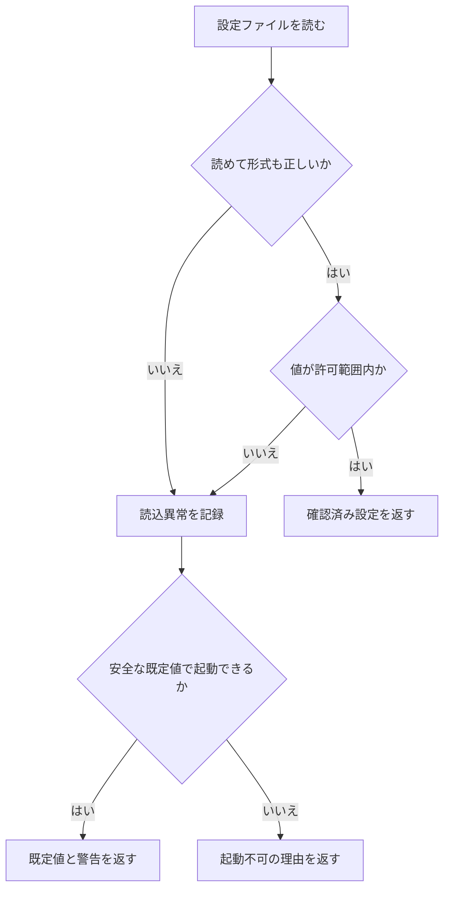
```mermaid
flowchart TB
    A["設定ファイルを読む"] --> B{"読めて形式も正しいか"}
    B -->|"はい"| C{"値が許可範囲内か"}
    B -->|"いいえ"| D["読込異常を記録"]
    C -->|"いいえ"| D
    C -->|"はい"| E["確認済み設定を返す"]
    D --> F{"安全な既定値で起動できるか"}
    F -->|"はい"| G["既定値と警告を返す"]
    F -->|"いいえ"| H["起動不可の理由を返す"]
```

設定の読込成功と、内容が正しいことは別に確認する。必須設定が欠けている場合は、無理に起動しない。

<a id="dd-310-2"></a>
#### 3.7.2 build_dependencies（モジュールを準備する）

| 項目 | 内容 |
| --- | --- |
| 入力 | 確認済み設定 |
| 返すもの・通知するもの | 準備したモジュールの一覧、または準備失敗 |

```mermaid
flowchart TB
    A["AppStateを初期値で準備"] --> B["ServiceBridgeを準備"]
    B --> C["両方を利用するScreenControllerを準備"]
    C --> D{"必要なモジュールを準備できたか"}
    D -->|"はい"| E["モジュールの一覧を返す"]
    D -->|"いいえ"| F["準備済みの通信等を後片付け"]
    F --> G["失敗理由を返す"]
```

各準備処理で例外が起きた場合も失敗経路へ進む。相手ソフトへの接続完了はここで待たず、ServiceBridgeを準備できたかを判定する。

<a id="dd-310-3"></a>
#### 3.7.3 connect_components（情報が届いたときに動く関数を設定する）

この関数は、「どんな情報が届いたら、どの関数に渡すか」をUIの起動時に設定する。
ここでいう「接続」は配線やネットワークへの接続ではなく、プログラム内で情報を渡す相手を指定することを意味する。

例えば、音楽担当ソフトから「再生中」という情報が届いたら、通信を担当するServiceBridgeがその情報を受け取り、画面切替管理の`on_service_event`へ渡す。その後、表示用データが更新され、画面に再生状態が表示される。
`connect_components`は、この「情報が届いたら関数へ渡す」という動きを先に設定するだけで、この時点で音楽を再生したり、受信処理の関数を実行したりするわけではない。

| 届いた情報 | その情報を渡す関数・処理 | 受け取った後に行うこと |
| --- | --- | --- |
| ServiceBridgeが受け取った車速・再生状態など | ScreenControllerの`on_service_event` | 情報が有効かを確認し、表示用データや表示画面を更新する |
| ServiceBridgeが受け取った操作の成功・失敗など | ScreenControllerの`on_command_result` | どの操作の結果かを確認し、処理状況を更新する |
| 設定ファイルの保存結果 | 保存を依頼した側の結果確認処理 | 保存できたかを確認し、失敗した場合は理由を記録・表示する |
| 通信処理の終了結果 | main_appの終了状況を確認する処理 | 後片付けが完了したかを確認する |

設定保存・終了結果を受け取る関数の具体名は、実装時に確定する。

| 項目 | 内容 |
| --- | --- |
| 入力 | 準備済みのServiceBridge・ScreenControllerなどと、結果を受け取る関数 |
| 返すもの・通知するもの | 情報の渡し先を設定できたか。失敗した場合はその理由 |

```mermaid
flowchart TB
    A["情報の種類と渡し先を確認"] --> B{"必要な渡し先をすべて設定済みか"}
    B -->|"はい"| C["設定完了を返す"]
    B -->|"いいえ"| D["状態が届いたら<br/>on_service_eventへ渡すよう設定"]
    D --> E["操作結果が届いたら<br/>on_command_resultへ渡すよう設定"]
    E --> F["保存結果と通信終了の結果も<br/>それぞれの確認処理へ渡すよう設定"]
    F --> G{"必要な渡し先をすべて設定できたか"}
    G -->|"はい"| H["設定した組合せを記録"]
    H --> C
    G -->|"いいえ"| I["今回追加した設定だけ取り消し<br/>失敗理由を返す"]
```

一部の渡し先が設定済みなら、未設定のものだけ追加する。同じ情報を同じ関数へ2回渡す設定にしない。
この段階ではPython側のモジュール間だけを設定する。QMLの画面はまだ準備できていないため、ボタン操作や画面表示との対応付けは`load_view`で行う。

<a id="dd-310-4"></a>
#### 3.7.4 load_view（画面を読み込む）

| 項目 | 内容 |
| --- | --- |
| 入力 | QMLファイル・AppState・ScreenController |
| 返すもの・通知するもの | 起動画面、または画面読込失敗 |

```mermaid
flowchart TB
    A["表示用データと操作の窓口をQMLへ渡す"] --> B["Main.qmlを読み込む"]
    B --> C{"画面を作成できたか"}
    C -->|"いいえ"| D["失敗理由を返し終了管理へ渡す"]
    C -->|"はい"| E["タッチ操作と状態表示を接続"]
    E --> F["起動状態を表示"]
    F --> G["UI準備完了をControllerへ通知"]
```

画面が表示できても、ナビや音楽が準備済みとは扱わない。UI準備完了後は表示条件を確認し、通常はホームへ、すでに有効なリバースONなら後方優先へ進む。

<a id="dd-310-5"></a>
#### 3.7.5 request_screen（表示したい画面を受け付ける）

| 項目 | 内容 |
| --- | --- |
| 入力 | 画面ID・操作の発生元 |
| 返すもの・通知するもの | 受理または拒否と理由 |

```mermaid
flowchart TB
    A["画面IDと現在の状態を確認"] --> B{"終了中または不明な画面IDか"}
    B -->|"はい"| R["変更せず拒否理由を返す"]
    B -->|"いいえ"| C{"後方優先・信号不明などで離脱禁止か"}
    C -->|"はい"| R
    C -->|"いいえ"| D{"その画面の利用条件を満たすか"}
    D -->|"いいえ"| R
    D -->|"はい"| E["selected_screenと通し番号を更新"]
    E --> F["reevaluate_displayで実際の表示を判断"]
    F --> G["必要なら起動依頼をBridgeへ渡す"]
    G --> H["受理を返す"]
```

画面を開く依頼を受けたことと、対象ソフトが起動したことは別。後方優先中に拒否した通常画面の要求を、後で自動実行するために残さない。

<a id="dd-310-6"></a>
#### 3.7.6 handle_action（ボタン操作を受け付ける）

| 項目 | 内容 |
| --- | --- |
| 入力 | 操作部品ID・操作値 |
| 返すもの・通知するもの | 受付結果・必要なら操作の識別番号 |

```mermaid
flowchart TB
    A["操作部品IDと値を確認"] --> B{"値・操作許可・終了状態に問題があるか"}
    B -->|"はい"| R["実行せず理由を返す"]
    B -->|"いいえ"| C{"画面を開く操作か"}
    C -->|"はい"| D["request_screenへ渡す"]
    C -->|"いいえ"| E{"結果待ちの重複操作か"}
    E -->|"はい"| F["再送せず処理中と返す"]
    E -->|"いいえ"| G{"画面内だけで終わる操作か"}
    G -->|"はい"| H["必要なデータをapply_updateで更新"]
    G -->|"いいえ"| I["send_commandで担当ソフトへ依頼"]
```

音量の連続変更は送信頻度を制限し、最新の指定値を残す。ドアロックは初期仕様で無効。設定適用の完了前に、編集値を適用済みとして保存しない。

<a id="dd-310-7"></a>
#### 3.7.7 on_service_event（相手ソフトからの状態を反映する）

| 項目 | 内容 |
| --- | --- |
| 入力 | 送信元・番号・観測時刻・値・有効性 |
| 返すもの・通知するもの | 更新した状態と必要な画面切替 |

```mermaid
flowchart TB
    A["通信処理で確認済みの通知を受け取る"] --> B{"終了中・旧接続・不正な通知か"}
    B -->|"はい"| X["適用せず理由を記録"]
    B -->|"いいえ"| C{"内容を使える期限内か"}
    C -->|"いいえ"| D["古い数値を採用せず期限切れへ"]
    C -->|"はい"| E["項目ごとに値と観測期限を更新"]
    D --> F["車両状態と警告を見直す"]
    E --> F
    F --> G["reevaluate_displayを呼ぶ"]
```

同じ値でも新しい測定なら観測時刻は更新する。古い通知の再受信で期限を延ばさない。リバース情報が使えない場合はOFFではなく状態不明として扱う。

<a id="dd-310-8"></a>
#### 3.7.8 reevaluate_display（表示する画面を決める）

| 項目 | 内容 |
| --- | --- |
| 入力 | 現在の車両状態・選択画面・準備状態 |
| 返すもの・通知するもの | 表示画面・表示方法の更新 |

```mermaid
flowchart TB
    A["現在の条件をまとめて確認"] --> B{"終了処理中か"}
    B -->|"はい"| Z["新しい画面切替を行わない"]
    B -->|"いいえ"| C{"有効なリバースONか"}
    C -->|"はい"| D["初回だけ復帰先を保存し後方優先を選ぶ"]
    C -->|"いいえ"| E{"後方優先中で信号が不明か"}
    E -->|"はい"| F["状態不明のカメラ表示を選ぶ"]
    E -->|"いいえ"| G{"後方優先から有効なOFFになったか"}
    G -->|"はい"| H["restore_previous_screenを呼ぶ"]
    G -->|"いいえ"| I["通常の選択画面の利用条件を確認"]
    I --> J["利用可能な画面またはホームを選ぶ"]
    D --> K["関連する画面データをまとめて更新"]
    F --> K
    H --> K
    J --> K
```

通常画面の確認には、サラウンドの停止・駐車・映像品質条件、設定の操作制限も含める。外部アプリ未準備なら自作の準備中表示を選ぶ。映像が来ないだけで後方優先を解除しない。表示に必要な受信開始・終了はControllerがBridgeへ依頼する。

<a id="dd-310-9"></a>
#### 3.7.9 restore_previous_screen（割込み前の画面へ戻る）

| 項目 | 内容 |
| --- | --- |
| 入力 | 保存した画面ID・現在の利用条件 |
| 返すもの・通知するもの | 復帰候補の画面ID |

```mermaid
flowchart TB
    A["previous_screenを読む"] --> B{"復帰先があり現在も利用可能か"}
    B -->|"はい"| C["保存された通常画面を候補にする"]
    B -->|"いいえ"| D["ホームを候補にする"]
    C --> E["復帰先の保存を解除"]
    D --> E
    E --> F["候補をreevaluate_displayへ返す"]
```

この関数は候補を返すだけで外部アプリを手前に出さない。実際の表示前に最新の優先条件を確認する。後方優先・信号不明画面そのものを通常の復帰先として保存しない。

<a id="dd-310-10"></a>
#### 3.7.10 on_command_result（操作の結果を確認する）

| 項目 | 内容 |
| --- | --- |
| 入力 | 操作の識別番号・相手の起動識別情報・処理結果 |
| 返すもの・通知するもの | 操作状態と表示状態の更新 |

```mermaid
flowchart TB
    A["結果の番号と送信元を確認"] --> B{"記録された操作に対応する結果か"}
    B -->|"いいえ"| X["適用せず記録"]
    B -->|"はい"| C{"まだ受付・処理中の通知か"}
    C -->|"はい"| D["処理中状態を更新"]
    C -->|"いいえ"| E["成功・失敗・結果不明を記録"]
    E --> F{"現在の画面要求に対応するか"}
    F -->|"いいえ"| G["旧要求の結果として保持し画面を変更しない"]
    F -->|"はい"| H["reevaluate_displayで表示を再判断"]
```

同じ操作の完了通知が繰り返されても処理を再実行しない。受付通知だけで再生中・設定適用済みとは表示しない。期限切れ後の結果が届いた場合も記録を照合し、成功通知だけを理由に画面を奪わない。

<a id="dd-310-11"></a>
#### 3.7.11 expire_stale_data（古くなった表示データを使わない）

| 項目 | 内容 |
| --- | --- |
| 入力 | 現在の経過時間・項目別の期限 |
| 返すもの・通知するもの | 期限切れ項目の更新 |

```mermaid
flowchart TB
    A["対象項目と現在の経過時間を確認"] --> B{"利用期限を過ぎた項目があるか"}
    B -->|"いいえ"| Z["変更なしで終了"]
    B -->|"はい"| C["対象だけを期限切れに変更"]
    C --> D["車速やリバースを不明として操作許可を見直す"]
    D --> E["画面用データと警告を更新"]
    E --> F["reevaluate_displayを呼ぶ"]
```

時計合わせで変動する日時ではなく、経過時間を測る時計で期限を判定する。通信断の最中も動かし、同じ異常の通知を毎回追加しない。

<a id="dd-310-12"></a>
#### 3.7.12 send_command（他ソフトへ指示を送る）

| 項目 | 内容 |
| --- | --- |
| 入力 | 相手・操作名・値・操作の識別番号・期限 |
| 返すもの・通知するもの | 受付結果と、後から届く処理結果 |

```mermaid
flowchart TB
    A["依頼内容を確認"] --> B{"終了中・不正・期限切れか"}
    B -->|"はい"| R["送信せず拒否"]
    B -->|"いいえ"| C{"同じ識別番号を扱ったことがあるか"}
    C -->|"はい"| D["再送せず記録済み状態を返す"]
    C -->|"いいえ"| E{"接続中で受付上限に余裕があるか"}
    E -->|"いいえ"| R
    E -->|"はい"| F["番号・期限・依頼内容を記録"]
    F --> G["裏の通信処理へ送信を依頼"]
    G --> H["UIへ受付結果を返す"]
    H --> I["返事または待ち時間超過を通知"]
```

同じ番号で異なる内容が届いたら拒否する。操作を受け付けた後に通信が切れた場合は結果未確認とし、勝手に再送しない。画面側では返事を待つ間も操作処理を続ける。

<a id="dd-310-13"></a>
#### 3.7.13 subscribe_state / subscribe_video（状態・映像の受信を始める）

| 項目 | 内容 |
| --- | --- |
| 入力 | 受信したい情報・利用する画面・受信開始番号 |
| 返すもの・通知するもの | 受信登録IDと接続状態 |

```mermaid
flowchart TB
    A["受信したい情報と利用者を確認"] --> B{"終了中または未対応の情報か"}
    B -->|"はい"| R["登録せず理由を返す"]
    B -->|"いいえ"| C{"同じ利用者の登録があるか"}
    C -->|"はい"| D["既存登録を返す"]
    C -->|"いいえ"| E["受信登録と開始番号を作る"]
    E --> F{"相手へ接続できているか"}
    F -->|"はい"| G["受信開始を依頼"]
    F -->|"いいえ"| H["未接続を通知し再接続を待つ"]
    G --> I["登録IDを返し通知を配送"]
    H --> I
```

図は共通の登録処理。subscribe_stateは状態通知をControllerへ渡し、subscribe_videoは映像表示部品へ画像を渡す。映像は表示待ち数を制限する。再接続後は新しい受信開始番号で再開し、古い接続からの遅延データを採用しない。

<a id="dd-310-14"></a>
#### 3.7.14 unsubscribe（不要な情報の受信を終える）

| 項目 | 内容 |
| --- | --- |
| 入力 | 受信登録ID・利用者 |
| 返すもの・通知するもの | 解除済み、または解除失敗の理由 |

```mermaid
flowchart TB
    A["登録IDと利用者を確認"] --> B{"有効な登録が残っているか"}
    B -->|"いいえ"| Z["解除済みとして終了"]
    B -->|"はい"| C["この利用者への配送を止める"]
    C --> D["使用中の画像を使い終えたら管理元へ連絡"]
    D --> E{"同じ情報を使う別の利用者がいるか"}
    E -->|"はい"| F["この利用者の登録だけ削除"]
    E -->|"いいえ"| G["相手への受信終了を依頼し登録を削除"]
    F --> Z
    G --> Z
```

解除した後に届く画像や通知を、その画面へ渡さない。相手が応答しない場合も画面への配送は止め、相手側の解除未確認を記録する。共有画像は他の利用者が使い終わる前に削除しない。録画の停止命令は送らない。

<a id="dd-310-15"></a>
#### 3.7.15 close（通信全体を終了する）

| 項目 | 内容 |
| --- | --- |
| 入力 | 終了依頼・待ち時間の上限 |
| 返すもの・通知するもの | 終了結果、未完了処理の一覧 |

```mermaid
flowchart TB
    A["終了中の印を付け新規受付を禁止"] --> B["全ての受信登録を解除"]
    B --> C["結果未確認の操作を整理"]
    C --> D["通信を閉じ裏の処理へ終了を依頼"]
    D --> E{"上限時間までに終了したか"}
    E -->|"はい"| F["通信終了を返す"]
    E -->|"いいえ"| G["未完了の内容を記録して返す"]
```

繰り返し呼ばれても新たな通信処理を作らない。待ち時間超過を正常終了としない。メモリを利用中の処理を残したまま、その処理のデータだけを先に削除しない。

<a id="dd-310-16"></a>
#### 3.7.16 apply_update（画面用データを書き換える）

| 項目 | 内容 |
| --- | --- |
| 入力 | Controllerからの変更項目・値・測定時刻・有効性 |
| 返すもの・通知するもの | 更新結果と、変更があった項目の通知 |

```mermaid
flowchart TB
    A["変更する項目と値を確認"] --> B{"画面操作側からの正しい更新か"}
    B -->|"いいえ"| X["変更せず理由を返す"]
    B -->|"はい"| C["関係する値をまとめて書き換える"]
    C --> D{"画面に見せる内容が変わったか"}
    D -->|"いいえ"| E["新しい観測時刻等を保持し表示通知は省略"]
    D -->|"はい"| F["変わった項目だけQMLへ通知"]
    E --> G["更新結果を返す"]
    F --> G
```

例えば車速が40から42 km/hに変わったら、元の測定値と品質を保持し、車速の表示だけを更新する。同じ数値でも期限切れから有効になった場合は表示変更として通知する。通信やGPIO操作はここでは行わない。

<a id="dd-310-17"></a>
#### 3.7.17 get_display_data（表示する値を取り出す）

| 項目 | 内容 |
| --- | --- |
| 入力 | 表示したい項目 |
| 返すもの・通知するもの | 画面用の値・単位・未取得理由 |

```mermaid
flowchart TB
    A["指定された項目を読む"] --> B{"値と有効性を確認できるか"}
    B -->|"いいえ"| C["未取得または期限切れの表示情報を返す"]
    B -->|"はい"| D["画面用の単位・桁数へ変換"]
    D --> E["元データを書き換えず表示情報を返す"]
```

車速は内部のm/sから表示用のkm/hへ変換する。大きな映像データそのものは返さない。この処理は画面切替を判断せず、ファイルにも保存しない。

<a id="dd-310-18"></a>
#### 3.7.18 begin_shutdown（UI全体を終了する）

| 項目 | 内容 |
| --- | --- |
| 入力 | 終了理由・各処理の待ち時間の上限 |
| 返すもの・通知するもの | 正常終了、または未完了項目付き終了結果 |

```mermaid
flowchart TB
    A["終了処理の開始を確認"] --> B{"すでに終了処理中か"}
    B -->|"はい"| C["二重実行せず現在の終了状態を返す"]
    B -->|"いいえ"| D["新しい操作と画面切替を禁止"]
    D --> E["確認済みの利用者設定の保存を依頼"]
    E --> F["映像の利用終了とBridge.closeを依頼"]
    F --> G["保存・通信終了を期限付きで確認"]
    G --> H{"未完了の処理があるか"}
    H -->|"はい"| I["失敗・未確認の内容を記録"]
    H -->|"いいえ"| J["正常な後片付け完了を記録"]
    I --> K["安全に解放できる表示部品を閉じて終了"]
    J --> K
```

編集中で未適用の設定や、再実行してはいけない車体操作は保存しない。設定保存と通信終了を待つ間もUIの通知処理を止めない。UI終了だけで録画用ソフトやOSの停止を指示しない。

<a id="dd-4"></a>
## 4. インターフェース設計

| 入力・出力 | 内容 |
| --- | --- |
| 入力 | 車速、リバース状態、録画状態、位置品質、温度、各アプリ準備状態 |
| 操作要求 | 画面切替、音楽再生、ナビ起動、検証後のドアロック操作 |
| 出力 | 02 Waydroidナビ管理、11 LIVI連携への表示要求、12 オーディオ連携への音楽操作、06 カメラ表示・録画、08 サラウンドビューへの表示用映像の受信依頼 |
| 応答 | 共通仕様のcommand_id別処理結果。受理と完了を区別 |

バックギアは15 サブコントローラ1後方系の通知を受信し、Pi 5のGPIOで重複取得しない。

<a id="dd-interface-diagrams"></a>
### インターフェース図

インターフェースとは、モジュール同士、またはUIと担当ソフトが操作や情報を受け渡す接点を指す。以下では、UI内部の接点と、UIの外で動く担当ソフトとの接点を分けて示す。
矢印は情報を渡す方向、矢印上の文字は渡す内容を表す。青はUI内部、緑は担当ソフト、灰色の破線は将来対応を示す。ソフト名の先頭番号は、[詳細設計一覧](README.md)の文書番号と対応する。
本図は論理的な接続の設計案であり、実装済みのAPIを示すものではない。Pi 5内のソフト間通信方式、Ethernet上の通信方式、ポート番号は[共通仕様](00_共通仕様.md)に従って別途確定する。

#### 図4-1 利用者操作とUI内部の接点

```mermaid
flowchart LR
    User["利用者"] -->|"タッチ操作"| View["画面表示<br/>QML"]
    subgraph UI["カーナビUI内部"]
        View -->|"IF-01 操作名・指定値"| Controller["画面切替管理<br/>ScreenController"]
        Controller -->|"IF-02 操作指示・受信依頼"| Bridge["他ソフトとの通信<br/>ServiceBridge"]
        Bridge -->|"IF-03 状態・処理結果"| Controller
        Controller -->|"IF-04 表示値の更新"| State["画面用データ管理<br/>AppState"]
        State -->|"IF-05 表示値・変更通知"| View
    end
    classDef ui fill:#E8F1FC,stroke:#376996,color:#172B40;
    class View,Controller,Bridge,State ui;
```

| 接点 | 主な受渡し内容 | 対応する関数・規則 |
| --- | --- | --- |
| IF-01 | 画面ID、操作部品ID、音量などの指定値 | `request_screen` / `handle_action`。QMLからGPIOや外部ソフトを直接操作しない |
| IF-02 | 操作名・引数、状態または映像の受信開始・終了 | `send_command` / `subscribe_state` / `subscribe_video` / `unsubscribe` |
| IF-03 | 検証済み状態、操作の識別番号と結果・理由 | `on_service_event` / `on_command_result`。表示変更の可否はControllerが判断する |
| IF-04 | 更新する項目・値・測定時刻・有効性 | `apply_update`。関係する値をまとめて更新する |
| IF-05 | 表示画面、表示用の値・単位・警告、変更した項目 | `get_display_data`と変更通知。QMLから元データは書き換えない |

矢印は通知・呼出しの接点を示し、外部の処理が完了するまで待ち続けることを意味しない。容量の大きい映像はこの図のAppState経由ではなく、図4-4の専用経路で表示する。

#### 図4-2 外部ソフトへの操作と応答

```mermaid
flowchart LR
    Bridge["カーナビUI<br/>ServiceBridge"] -->|"起動・表示要求"| Nav["02 Waydroidナビ管理<br/>対象: OsmAnd"]
    Nav -->|"準備状態・処理結果"| Bridge
    Bridge -->|"起動・表示要求"| AA["11 LIVI連携<br/>対象: Android Auto"]
    AA -->|"接続状態・処理結果"| Bridge
    Bridge -->|"再生・選曲・音量要求"| Audio["12 オーディオ連携<br/>対象: Mopidy"]
    Audio -->|"曲情報・再生状態・処理結果"| Bridge
    Bridge -.->|"将来: 施錠・解錠要求"| Lock["17 ドアロック制御<br/>初期運用では無効"]
    Lock -.->|"将来: 処理結果・確認状態"| Bridge
    classDef ui fill:#E8F1FC,stroke:#376996,color:#172B40;
    classDef service fill:#EAF5EC,stroke:#4A7753,color:#203A26;
    classDef future fill:#EEEEEE,stroke:#777777,color:#444444,stroke-dasharray:5 5;
    class Bridge ui;
    class Nav,AA,Audio service;
    class Lock future;
```

操作要求には`command_id`、操作名、引数、有効期限を付ける。返信は同じ`command_id`と対応させ、「受理」「実行中」「成功」「拒否」「失敗」を区別する。返事が届かなければ「結果未確認」とし、成功扱いや無条件の再送はしない。
OsmAnd・LIVIの実画面はナビ表示領域へ配置する対象として扱う。起動完了と手前への表示は別の操作であり、表示直前にもリバースなどの優先条件を確認する。現行実装ではSwayの外部ウィンドウを同じ表示領域へ移動・リサイズする。Wayland外部サーフェスの完全埋込みは将来検討とし、具体的な画面切替手段は[4.5](#dd-45)で検証する。

#### 図4-3 車両・運用状態の受信

```mermaid
flowchart LR
    Vehicle["09 OBD2車両情報取得"] -->|"専用ソケット: vehicle.update / invalidate / status"| Bridge["カーナビUI<br/>ServiceBridge"]
    Rear["15 サブコントローラ1後方系<br/>別筐体: Pi 3B"] -->|"Ethernet: リバース状態・入力品質"| Bridge
    Fan["10 冷却ファン制御"] -->|"CPU温度・回転状態・警告"| Bridge
    Upload["07 Google Driveアップロード・削除"] -->|"送信状態・失敗理由"| Bridge
    Bridge -->|"送信元・順序・期限を確認した状態"| Controller["ScreenController<br/>表示・操作許可を判断"]
    classDef ui fill:#E8F1FC,stroke:#376996,color:#172B40;
    classDef service fill:#EAF5EC,stroke:#4A7753,color:#203A26;
    class Bridge,Controller ui;
    class Vehicle,Rear,Fan,Upload service;
```

状態通知には、値だけでなく送信元・起動ID・連番・測定時刻・有効期間・有効性・理由を付ける。取得失敗や期限切れを数値0やリバースOFFに置き換えない。通信遅延を含めた期限の判定は共通仕様に従う。
OBD2の取得モードは、UIが車両情報画面を表示している間だけ`full`とする。それ以外は`minimal`とし、車速など常時必要な項目だけを取得する。画面切替時の`set_polling_mode`はServiceBridgeからOBD2専用ソケットへ送る。QMLはOBD2機器へ直接接続しない。
アプリの準備状態は図4-2、カメラ・録画状態は図4-4で示す。位置品質は03 現在地補正から専用ソケットで直接通知する。上部GPS欄と車両情報画面は、同じ`GpsStatus`の判定結果を表示する。

| GPS欄の表示 | 判定条件 | 表示色 |
| --- | --- | --- |
| サービス未接続 | 03のソケットに未接続、または切断済み | 警告色 |
| 確認中 | ソケット接続直後で、有効な状態通知をまだ受信していない | 警告色 |
| 測位待ち | 有効な初回測位をまだ取得していない | 警告色 |
| 測位中 | 品質確認済みのGPS位置が表示期限内 | 正常色 |
| 補正中 | 品質確認済みのセンサー推定位置が表示期限内 | アクセント色 |
| 信号喪失 | 過去に有効な位置を取得したが、03が現在位置を利用不可と通知 | 警告色 |
| 更新停止 | 位置表示期限切れ、状態通知が5秒途絶えた、または通知の時刻・品質・期限を確認できない | 警告色 |

ソケット接続はUSB GPS受信機の接続を証明しない。USB接続状態、衛星数、OsmAndへの登録成功は本表示の判定対象外とする。GPS単独運用では信号喪失中に補正中を表示しない。車両情報画面には`gpsDetail`として状態理由を2行以内で表示する。

`ScreenController`は`schema_version=1`、空でない`boot_id`、正の整数`sequence`を検査する。位置通知はナビ・OBD2と独立した連番で管理し、重複、順序逆転、廃止済み起動IDを拒否する。接続通知は測位状態を「確認中」に戻し、切断時には有効な測位・補正表示を直ちに解除する。

`AppState`は`GpsStatus`を100ms周期で監視する。03は状態を1秒周期で配信し、UIは状態の送信時刻から5秒を通知期限とする。位置表示期限は`position.update.display_valid_for_ms`（未指定時は`valid_for_ms`）、状態照会では`position.status.position_valid_for_ms`を使う。いずれも送信時点の残り時間で、同一Pi 5上の`issued_monotonic`との差から配送・Qtイベント待ち時間を引く。測定年齢`age_ms_at_send`は二重に引かない。期限切れでもソケットが開いている場合は、未接続ではなく「更新停止」とする。状態照会・定期通知で位置の元の期限を延長しない。

実装は`ui/state/gps_status.py`、`ui/state/app_state.py`、`ui/controllers/event_ordering.py`、`ui/controllers/service_bridge.py`。回帰試験は`tests/positioning/test_gps_display.py`で、切断、再接続、無通知、GPS単独喪失、補正失効、復帰、起動ID変更、順序検査を確認する。
UIはバックギア用GPIO、OBD2機器、ファンを直接読み書きしない。サブコン1からのリバース通知は、後方映像の受信経路とは独立して扱う。

#### 図4-4 カメラ映像と表示用データの受渡し

```mermaid
flowchart LR
    subgraph Services["UIの外で動く映像担当ソフト"]
        Camera["06 カメラ表示・録画<br/>前後左右の映像・録画"]
        Surround["08 サラウンドビュー<br/>駐車時の合成映像"]
    end
    subgraph UI["カーナビUI内部"]
        Bridge["ServiceBridge<br/>受信依頼・状態確認"]
        Frames["映像専用の受渡し<br/>FrameChannel / frame_presenter"]
        Surface["QML VideoSurface<br/>映像を表示"]
        Bridge -->|"表示対象・受信開始時の番号"| Frames
        Frames -->|"有効な画像と撮影情報"| Surface
        Surface -->|"画像の使用終了"| Frames
    end
    Bridge -->|"表示用映像の受信開始・終了"| Camera
    Bridge -->|"合成映像の受信開始・終了"| Surround
    Camera -->|"カメラ・録画状態"| Bridge
    Surround -->|"合成品質・利用可否"| Bridge
    Camera -->|"各方向の映像"| Frames
    Surround -->|"合成映像"| Frames
    classDef ui fill:#E8F1FC,stroke:#376996,color:#172B40;
    classDef service fill:#EAF5EC,stroke:#4A7753,color:#203A26;
    class Bridge,Frames,Surface ui;
    class Camera,Surround service;
```

この図はUIとの接点だけを示し、06 カメラ表示・録画から08 サラウンドビューへの合成素材の配信や、サブコンから06 カメラ表示・録画への映像転送は省略する。FramesはBridge内の画像管理と表示補助をまとめた説明上のブロックであり、独立したOSプロセスを必須としない。

| 受渡し内容 | 含める情報・管理方針 |
| --- | --- |
| 受信依頼 | 映像の方向・種別、受信登録ID、表示要求の通し番号。受信終了は自分の登録だけに適用する |
| 画像の受渡し | 画像または保存場所を示す情報、撮影元、連番、撮影時刻、有効性。具体的な形式と転送方式は未確定 |
| 使用終了 | 表示側が使い終わった画像を識別する情報。他の利用者が使用中の画像を削除・再利用しない |
| 状態通知 | 録画中・停止・障害、映像の遅延・取得不可、合成品質。数値や警告はControllerからAppStateへ反映する |

画面を閉じるときは表示用映像の受信を終了するだけで、06 カメラ表示・録画の録画や07 Google Driveアップロード・削除のアップロードを停止しない。UIは録画ファイルを直接削除せず、アップロード完了の確認と削除は07 Google Driveアップロード・削除が担当する。

<a id="dd-41"></a>
### 4.1 画面一覧

カーナビUIが管理する画面を以下に示す。画面IDは設計・実装・試験で共通に使用し、表示名や配置を変更しても原則として変更しない。
本一覧は実装前の設計案である。画面ごとの配置・操作部品・切替条件は本書の4.2以降に記載し、実機条件に依存する数値や未検証の方式は未確定として管理する。

| 画面ID | 画面名 | 目的・主な表示内容 | 表示条件・入口 | 表示方式 |
| --- | --- | --- | --- | --- |
| UI-BOOT | 起動状態 | UI初期化の進捗、各担当ソフトの準備状態 | UI起動時。ナビの準備完了を待たずホームへ移行する | 自作画面 |
| UI-HOME | ホーム | 各機能への入口、時計、録画・接続などの状態概要 | UI初期化後、ホーム操作、通常画面への復帰先が利用できない場合 | 自作画面 |
| UI-NAV | ナビゲーション | OsmAndの地図、目的地、経路案内 | ナビ選択時。起動前は準備状態を表示し、未測位でも地図閲覧を可能にする | 外部アプリ画面へ切替 |
| UI-AA | Android Auto | LIVIを介したスマートフォン機能 | Android Auto選択時。接続前は未接続・準備状態を表示する | 外部アプリ画面へ切替 |
| UI-ANDROID | Waydroid | Waydroidホームから任意の導入済みAndroidアプリを選択する | ホーム画面中央下の「Waydroid」選択時 | Waydroidホームの外部ウィンドウへ切替 |
| UI-CAMERA | カメラ | 前後左右の映像選択、各映像の取得・録画状態 | カメラ選択時。選択可能な映像と走行中の操作制限は別途確定する | 自作画面 |
| UI-REAR | バックカメラ | 後方映像、映像未取得・遅延の警告 | 有効なリバースON通知で優先表示。有効なOFF通知で復帰を判定する | 自作画面。カメラ画面の後方優先モード |
| UI-SURROUND | サラウンドビュー | 前後左右の俯瞰合成、各領域の有効性 | 停止・駐車条件と合成担当ソフトの利用許可がある場合のみ。段階開発対象 | 自作画面 |
| UI-AUDIO | 音楽 | 曲情報、再生状態、選曲・再生・音量操作 | 音楽選択時。プレイヤー未接続時は操作を制限して状態を表示する | 自作QML操作画面 |
| UI-VEHICLE | 車両情報 | OBD2車速・回転数・水温・電圧、通信状態 | 車両情報選択時。未対応・未取得・期限切れを区別する | 自作画面 |
| UI-SETTINGS | 設定 | 表示・音量・接続などの利用者設定 | 設定選択時。初期案では停車確認時のみ変更可能とし、項目別制限は未確定 | 自作画面 |
| UI-RECORDINGS | 録画一覧（`recordings`） | 日付・方向検索、確定済みローカル動画の再生 | カメラ画面または設定から開く | 自作画面、QtMultimedia |
| UI-WARNING | 警告表示 | 高温、録画停止、保存容量不足、通信断など | 未確認警告を上部バーへ表示。確認は既読操作であり異常解除ではない | 上部バーの通常表示と切替。中央には重ねない |
| UI-WARNINGS | 警告一覧（`warnings`） | 発生・確認・回復・前回起動時の履歴 | 上部バー・設定・車両情報から開く | 自作画面。最大100件をJSON保存 |

#### 一覧の適用ルール

- UI-REARは専用の画面IDを持つが、実装ではUI-CAMERAの表示部品を共用し、映像取得処理を二重に起動しない。
- 警告は後方映像全体を不必要に隠さない。リバース中のナビ・Android Autoの準備完了で後方表示を奪わない。
- 外部アプリの起動前・未接続時の案内は自作UIが表示する。ナビ画面の主表示領域をOsmAnd、LIVIまたはWaydroidホームの表示領域として予約し、現行実装ではSwayの外部ウィンドウをその領域へ移動・リサイズする。Wayland外部サーフェスの完全埋込みは将来検討とし、自作UIへの復帰方法を`WindowAdapter`で管理する。
- 担当ソフトが未準備・利用不可の場合は、その理由を表示する。古い映像・値を正常状態として表示し続けない。
- UI-WARNINGは常時表示する独立ページではなく、現在の画面へ重ねる共通要素とする。詳細確認画面の要否は未確定。
- ドアロックはセカンド開発のため初期画面の操作対象に含めない。BLE TPMSも未確定とし、採用時に車両情報画面への追加を検討する。
- 録画ファイル一覧は実装済み。再生は有効な車速0通知による停車確認時、または車速そのものを取得できない代替モードで警告付きで許可し、走行開始・車速値失効で停止する。停車確認期限だけが切れた場合は再生を許可しない。

<a id="dd-42"></a>
### 4.2 画面レイアウト設計

横向きディスプレイを初期案とし、以下の領域で構成する。実際の向き・解像度・表示倍率が未確定のため、座標や寸法は確定値にしない。

| 領域 | 配置案 | 内容・制約 |
| --- | --- | --- |
| 状態表示領域 | 上部の細い帯 | 時計、録画、位置品質、接続状態を小さなアイコンと必要な文字で整理する。読める大きさを確保し、状態変化で配置を動かさない |
| 主表示領域 | 中央を広く確保 | 地図・カメラ・音楽など、選んだ機能を主役にする。不要な飾り枠を付けず、映像の縦横比と重要領域を守る |
| 共通操作領域 | 下部の固定位置 | ホーム、ナビ、音楽、カメラ、その他機能、音量などをアイコン中心に配置する案。操作の大きさを確保できない場合は項目数を減らす |
| 警告領域 | 主表示に重ねる固定位置 | 重要度と文字で状態を示す。カメラの主要な確認領域を避ける |

ホームは、6個の大きな色付きボタンを並べる案から、余白のある状態表示と下部の機能選択を中心にする案へ変更する。
中央の大きな機能ボタンには「ナビゲーション」「カメラ」「音楽」「車両情報」を配置する。ホームの「ナビゲーション」はOsmAndを選択して起動・表示する。中央下の「LIVI」はLIVIを選択して起動・表示し、「Waydroid」はWaydroidホームを表示する。Waydroidホームでは導入済みAndroidアプリを利用者が選択できる。画面最下部の共通「ナビ」は、直前にOsmAndとLIVIのどちらを表示したかを`navigationMode`で保持し、その対象を再表示する。Waydroidホームの表示ではこの選択を変更しない。下部に収まらない機能は「その他機能」から開く一覧へまとめる。
「その他機能」の一覧表示はUI-HOMEの表示部品として扱い、独立した新しい画面IDは追加しない。各機能の選択は既存のACT-OPENで扱う。戻る操作は必要な画面に表示する。
項目の順序・操作領域寸法は実機で確定する。サラウンドはカメラ画面から選択する。リバース優先時は通常画面へ離れる操作を制限し、後方映像を大きく表示する。

| 画面 | 主表示領域の構成案 |
| --- | --- |
| UI-BOOT | 担当ソフト別の準備状態。裏付けのない進捗率や残り時間は表示しない |
| UI-HOME | 4つの主要機能入口と状態概要。ナビゲーションはOsmAnd固定、中央下にLIVI直通とWaydroidホーム直通を配置する。画面最下部のナビは最後に選択したOsmAndまたはLIVIを再表示する |
| UI-NAV / UI-AA | 起動待ちは自作の状態画面、準備後は対象アプリのウィンドウへ切替 |
| UI-CAMERA | 選択中の映像を大きく表示し、カメラ名・状態・方向選択を添える |
| UI-REAR | 後方映像を最大限確保し、不要な選択操作を隠す。未校正の距離線は表示しない |
| UI-SURROUND | 車体周辺の合成映像と非観測領域を表示。距離の正確性を過信させる装飾を避ける |
| UI-AUDIO | 曲名・アーティスト、再生状態、再生/一時停止・前後曲・音量 |
| UI-VEHICLE | 車両値を単位付きで整理。ECU電圧とアダプタ端子電圧、車両水温とCPU温度を区別 |
| UI-SETTINGS | 表示・音声・接続に分類し、現在値、編集値、適用結果を区別 |
| UI-WARNING | 重要度、発生元、短い原因、操作可否。原因未解消で「正常」と表示しない |

外部アプリ表示中に自作の上部・下部領域や警告を重ねて表示できるとは仮定しない。Sway方式では自作UI、OsmAnd、LIVI、Waydroidホームが別ウィンドウのため、上部バーや下部ナビへのタッチで自作UIがフォーカスを取得すると、表示中の外部アプリが背面へ回る場合がある。OsmAnd、LIVIまたはWaydroidホームの表示中に上部バーを押した場合と、表示中のナビを下部ナビから再選択した場合は、画面切替やアプリ再起動を行わない。クリック処理が完了して自作UIの前面化が落ち着いた後、既定40msの単発タイマーで保存済みのSwayウィンドウIDへフォーカス要求を1回送る。保存IDが無効な場合だけ対象を再検出し、同じ固定領域へ再配置する。連続操作ではタイマーを再始動してフォーカス要求を一件にまとめる。
警告通知・ホーム復帰・リバース割込みの実現方式は[4.5 外部アプリ連携](#dd-45)で検証する。

<a id="dd-43"></a>
### 4.3 操作仕様・共通部品

以下の部品IDは設計上の識別子であり、実装クラス名ではない。1回の操作は押下位置と解放位置を確認して確定し、画面切替後に古い押下を新画面へ持ち越さない。

| 部品ID | 操作 | 処理 | 無効・待機時 |
| --- | --- | --- | --- |
| ACT-HOME | タップ | 通常画面からホームへ。画面を隠しても録画・音楽を停止しない | リバース優先中は画面離脱を禁止 |
| ACT-BACK | タップ | 現在の自作画面内の履歴を1段戻る。履歴なしはホームへ | 外部アプリ内の「戻る」とは別契約。リバース優先中は離脱禁止 |
| ACT-OPEN | 機能選択 | 利用条件を確認し、既存画面表示または起動要求 | 同じ機能の起動待ち中は重複起動しない |
| ACT-OSMAND | タップ | ホームのナビゲーションからナビ方式をOsmAndへ切り替え、02 Waydroidナビ管理へ起動・表示を要求する | 起動中の重複要求を抑制し、失敗理由を上部警告へ表示する |
| ACT-LIVI | タップ | ナビ方式をLIVIへ切り替え、11 LIVI連携へ起動・表示を要求する | 起動中の重複要求を抑制し、失敗理由を上部警告へ表示する |
| ACT-ANDROID | タップ | 「Waydroid」から02 Waydroidナビ管理へWaydroidホームの表示を要求し、Androidアプリ選択画面を固定領域へ配置する | Waydroid未準備・ホーム画面未検出時は自作画面に理由を表示する |
| ACT-PLAY | タップ | 確認済み再生状態に応じて再生または一時停止を要求 | 状態不明・通信断では無効。応答前に成功状態を確定しない |
| ACT-TRACK | 前曲/次曲 | 音楽担当ソフトへ1回の選曲要求 | 処理中は重複要求を抑制し、連打を無制限に蓄積しない |
| ACT-VOLUME | スライダー/段階調整 | 利用者指定音量を変更。連続入力は頻度制限し最新値を送る | 応答値と編集中の値を区別。低減中の実効音量とは分ける |
| ACT-CAMERA | 方向選択 | 表示用に受け取る映像の方向を切替 | リバース優先中は後方固定。未取得方向には理由を表示 |
| ACT-APPLY | 設定適用 | 型・範囲・操作許可を確認し、対象担当ソフトへ適用要求 | 完了までは適用中。失敗時に編集値を適用済みとして保存しない |
| ACT-CANCEL | 編集取消 | 未適用の編集値を破棄して確定値へ戻す | 担当ソフトへ送信済みの処理の取消可否は別途確認 |
| ACT-WARN-ACK | 警告確認 | 利用者が見たことを記録する | 原因状態は解除しない。未解消警告の表示方法は重要度別に定義 |

長押し、ダブルタップ、隠しジェスチャーは初期仕様では割り当てない。必要な機能は見える操作部品から実行できるようにする。
処理中の操作は識別番号（command_id）で管理し、待ち時間の上限を超えたら「結果未確認」とする。車体操作を含む要求を自動再送しない。

<a id="dd-44"></a>
### 4.4 共通表示・デザイン仕様

自作UIの方向性は「テスラのような、簡潔でモダンな車載画面」とする。具体的には、余白を活かした配置、少ない色数、主要情報の大きな表示、下部にまとめた操作を採用する。以下の色や配置は本システム用の設計案であり、テスラの仕様値ではない。

| 項目 | 設計方針 | 確定に必要な情報 |
| --- | --- | --- |
| 文字 | 本文、見出し、主要数値の役割別サイズを定義する。重要な状態を小さい注記だけにしない | 解像度、表示倍率、視距離 |
| 色 | 正常、注意、異常、未取得を区別する。色だけでなくアイコン・文字を併用する | 昼夜の実機視認性 |
| アイコン | ホーム、戻る、再生、音量等は一貫した意味を持たせる。不明瞭なものには名称を添える | 採用アイコンセット |
| 昼夜表示 | 明暗テーマと画面輝度を別設定として扱う。初期案は手動選択 | 輝度制御手段。自動切替用の信号は未定 |
| 文字あふれ | 曲名等は省略してもよいが、警告原因・操作名を判別できなくしない | 各領域の最大文字数・折返し |
| タッチ | 隣接操作の間隔を確保し、押下領域をアイコンの描画寸法だけで決めない | 実パネル寸法、タッチ精度 |
| 動き | 状態変化は即座に識別できるようにし、画面切替演出で後方映像表示を遅らせない | 切替方式と性能測定 |
| 単位 | 車速km/h、回転数rpm、温度degC、電圧Vなどを明示する | 小数桁数、表示幅 |

フォントサイズ・色コード・余白・タッチ領域寸法は共通定義で一元管理する。現時点で特定のピクセル値を製品仕様として固定しない。

<a id="dd-441"></a>
#### 4.4.1 デザインの方向性

| 観点 | 本システムで採用する方針 |
| --- | --- |
| 全体の印象 | すっきりした面と余白で情報を整理する。派手なグラデーション、立体的な飾りボタン、強い影は使わない |
| 主役となる情報 | ナビやカメラなど、現在選んだ機能を大きく表示する。詳細情報は必要なときだけ開く |
| 画面の区切り | 間隔、見出し、薄い区切り線を使う。全ての情報を箱で囲んだり、箱を入れ子にしたりしない |
| 操作位置 | よく使う操作を自作画面の下部にまとめる。画面ごとにボタン位置が変わらないようにする |
| 状態の表現 | 平常時は控えめに、録画停止など注意が必要な状態は文字と色で明確にする |
| 車両らしさ | コペンで取得できる情報と実装した機能だけを扱う。自動運転、周辺車両認識、空調操作、充電残量などを見た目のために追加しない |

参考資料：Tesla公式の[Model 3「タッチスクリーン」](https://www.tesla.com/ownersmanual/model3/ja_jp/GUID-518C51C1-E9AC-4A68-AE12-07F4FF8C881E.html)。上部の状態表示、ナビや車両状態の表示領域、下部からのアプリ操作という整理を参考にする。車種・ソフトのバージョンによって表示が異なるため、特定の画面の完全再現を目的にしない。

テスラの名称・ロゴ・専用アイコンを自作UIのブランドとして使用せず、コペン用の独自画面として作る。

<a id="dd-442"></a>
#### 4.4.2 色・文字・操作部品

以下は昼夜で比較するための初期配色案。実ディスプレイで文字の読みやすさとまぶしさを確認して調整する。

| 用途 | 昼間の淡色表示 | 夜間の暗色表示 |
| --- | --- | --- |
| 全体の背景 | 白に近い灰色 `#F5F5F5` | 黒に近い灰色 `#151515` |
| 操作領域・設定欄 | 白 `#FFFFFF` | 濃い灰色 `#242424` |
| 主な文字 | ほぼ黒 `#171717` | ほぼ白 `#F3F3F3` |
| 補足の文字 | 灰色 `#595959` | 明るい灰色 `#B8B8B8` |
| 選択中・操作の強調 | 青 `#2459C4` | 明るい青 `#8AB4FF` |
| 録画中などの正常状態 | 緑 `#216A42` | 明るい緑 `#7ACB9A` |
| 注意 | 黄土色 `#805300` | 黄色 `#F2C66D` |
| 異常・録画停止 | 赤 `#B3261E` | 明るい赤 `#FF9088` |

青・緑・黄・赤は必要な表示だけに使い、広い背景を色で塗り分けない。選択中は色に加えて印や名称でも区別する。警告は色だけで意味を伝えない。

| 項目 | 具体的な作り方 |
| --- | --- |
| 文字 | 日本語が読みやすいゴシック体を使う。太字は見出し・主要数値に絞り、極端に細い文字を使わない |
| 文字サイズ | 通常の説明、見出し、主要数値の順に大きくする。画面幅に合わせて文字を縮め続けず、配置や改行を調整する |
| アイコン | 家、矢印、再生、音量など意味が分かる記号を使う。線の太さと見た目を揃え、分かりにくい記号には短い名称を付ける |
| 選択操作 | 音量・明るさはスライダー、ON/OFF設定は切替スイッチ、表示方式は並べた選択肢を使う |
| 角の丸み | 操作部品や一時表示には控えめな丸みを付ける。初期案は8論理px以下とし、実寸は表示倍率を含めて確認する |
| 操作領域 | アイコンの絵が小さくても押せる範囲を確保する。見た目の余白を優先してタッチしづらくしない |
| 写真・映像 | 音楽画面は取得できたジャケット画像、カメラ画面は実映像を使う。背景装飾のために映像を暗くしたりぼかしたりしない |

「論理px」は、画面の表示倍率を考慮する前の寸法指定を指す。実際に何mmの大きさで見えるかは、採用ディスプレイで確認する。
昼夜のテーマ切替と実際の画面輝度は別設定とし、初期仕様は手動切替とする。

<a id="dd-443"></a>
#### 4.4.3 適用範囲と実機確認

- この方針は自作QML画面に適用する。OsmAnd・LIVIの内部画面まで同じ配色・部品配置に変更できるとは仮定しない。
- テスラのように地図と自作の操作領域を常時同じ画面へ表示する方式は、現時点では未確定。初期構成は外部アプリへの画面切替を維持する。
- 自作ホームに実際の地図を表示する場合は、表示方法・地図データ・利用条件を別途設計する。実装前に仮の地図を現在地のように表示しない。
- 見た目のために警告や未取得表示を消さず、リバースON時の後方映像を優先する。UI-05を理由に既存の操作制限を緩めない。
- 配色、文字、余白、操作領域はTheme.qmlなどの共通定義へまとめ、全画面で統一する。
- 昼間の反射、夜間のまぶしさ、長い日本語、手指による操作、4方向録画中の応答を確認して確定する。

QMLの注釈に挿入した挿絵はソフトの役割説明用であり、今回決めたデザインの完成見本ではない。具体的な画面見本はこの方針と実ディスプレイの条件に合わせて別途作成する。

<a id="dd-45"></a>
### 4.5 外部アプリ連携

| 対象 | 自作UIの役割 | 外部側へ委譲する内容 | 連携上の確認事項 |
| --- | --- | --- | --- |
| OsmAnd / Waydroid | 起動要求、準備・位置品質表示、画面切替要求 | 地図、目的地入力、経路探索、案内画面 | ホーム復帰、カメラ割込み、終了保存、位置失効時の表示 |
| LIVI | 接続状態、起動・表示要求、音声連携 | Android Auto画面と対応スマートフォン機能 | 再接続時にどの画面を表示・操作対象にするか、割込み、接続解除 |
| Mopidy | 自作UIからの再生操作と状態表示 | 音楽ライブラリ・プレイヤー機能 | Mopidy APIの接続、再生状態の同期、ホーム復帰 |

画面切替はScreenControllerが決定し、各連携担当ソフトは起動完了だけを理由に手前に表示しない。
画面を開く依頼には通し番号を付ける。古い依頼の完了通知は相手ソフトの状態確認には使うが、今表示したい画面を勝手に変えない。
外部画面からのホーム復帰・後方映像割込み・重要警告の通知は実機受入条件とする。
実現手段が未検証の場合は外部アプリを統合UIとして運用可能と判断しない。

<a id="dd-5"></a>
## 5. データ・設定設計

AppStateはselected_screen、effective_screen、previous_screen、reverse_validity、service_health、warning_listを保持する。
UIが保存する利用者設定は、明暗テーマ、アニメーション、起動画面、水温・低電圧警告値と`schema_version=1`。`preferences.json`と同じディレクトリの一時ファイルを同期して置き換える。保存範囲・初期値・制限は[付録9](../付録9_UI追加機能導入手順.md)を参照する。音量はMopidyの実値を読み戻し、UI設定には保存しない。リバースON、車速、警告確認状態も次回起動へ引き継がない。
UI更新周期、画面サイズ、タッチ領域寸法は実ディスプレイで決める。

<a id="dd-51"></a>
### 5.1 表示データ一覧

更新周期は画面再描画周期ではなく、元担当ソフトの観測周期・有効期限と分けて決める。
受信頻度が高くても測定時刻が古い値は失効させる。具体的な周期・桁数・期限は実測後に確定する。

| データID | 内容・表示先 | 取得元 | 更新契機 | 未取得・期限切れ時 |
| --- | --- | --- | --- | --- |
| DATA-TIME | 時計 / 共通領域 | OS時計・同期状態 | 秒または分が変わる時点。秒まで表示するかは未確定 | 未同期を識別可能にする |
| DATA-REC | 方向別録画状態 / 共通・カメラ | 06 カメラ表示・録画 | 状態変更と定期状態通知 | 状態不明。録画中の表示を残さない |
| DATA-UPLOAD | 未送信件数・容量 / 状態詳細 | 07 Google Driveアップロード・削除 | 台帳状態変更 | 未確認。未送信件数を0にしない |
| DATA-POS | GPS/補正/未測位 / 共通・ナビ待機 | 03 現在地補正、04 Linux位置情報連携 | 推定・連携状態変更 | 未測位または期限切れと表示 |
| DATA-SPEED | 車速km/h / 車両情報 | 09 OBD2車両情報取得 | 有効な観測受信 | 数値を「—」にし、停止判定へ流用しない |
| DATA-RPM | 回転数rpm / 車両情報 | 09 OBD2車両情報取得 | 有効な観測受信 | 未対応・未取得・期限切れを区別 |
| DATA-COOLANT | 車両水温degC / 車両情報 | 09 OBD2車両情報取得 | 有効な観測受信 | 数値を「—」にし理由を表示 |
| DATA-VOLTAGE | 電圧V / 車両情報 | 09 OBD2車両情報取得 | 有効な観測受信 | 未取得表示。ECU/アダプタ由来を区別 |
| DATA-REVERSE | リバース / 画面制御 | 15 サブコントローラ1後方系 | 変化通知・有効性変更 | UNKNOWN。OFFと扱わない |
| DATA-FRAME | 映像 / カメラ・俯瞰 | 06 カメラ表示・録画、08 サラウンドビュー | 有効期限内の画像を受信 | 映像未取得表示。古い画像を現在画像にしない |
| DATA-AUDIO | 曲名・再生・音量 / 音楽 | 12 オーディオ連携 | プレイヤー状態変更 | 未接続とし操作を制限 |
| DATA-HEALTH | CPU温度・冷却ファン回転数 / 警告・状態詳細 | 10 冷却ファン制御 | 観測・異常通知 | 回転数が取得できない場合は監視不能として表示する |
| DATA-APP | ナビ・Android Auto準備状態 | 02 Waydroidナビ管理、11 LIVI連携 | 接続・起動状態変更 | 機能ごとに準備中/利用不可を表示 |

車速の内部m/sから表示km/hへの変換はUI境界で行う。表示用に丸めた0 km/hを、停車許可の判断材料にしない。

<a id="dd-52"></a>
### 5.2 UI状態・設定の管理

| データ | 型・値の案 | 保持方針 |
| --- | --- | --- |
| 選択した通常画面（selected_screen） | 画面ID | 利用者が選んだ通常画面。表示中画面と分離 |
| 実際の表示画面・カメラ表示方法（effective_screen / camera_mode） | 画面ID / 通常（NORMAL）・後方優先（REAR_PRIORITY）・信号不明（SIGNAL_UNKNOWN） | 現在表示している内容。起動ごとに初期化 |
| 割込み前の画面（previous_screen） | 画面IDまたは未設定 | 割込み前の復帰先。初回だけ保存し、反復ON通知で上書きしない |
| リバース情報が利用可能か（reverse_validity） | 有効（VALID）・期限切れ（STALE）・不明（UNKNOWN）・異常（FAULT）等 | リバース値と分離し、失効時にOFFへ置き換えない |
| 担当ソフトの動作状態（service_health） | 担当ソフトID別の状態・理由・最終観測 | 対象機能の操作可否と未準備・異常表示に使用 |
| 画面要求の通し番号（request_generation） | 画面要求を出すたびに増やす番号 | 古い依頼の完了通知で、今表示したい画面を変えない |
| 走行・停車の状態（motion_state） | 停止（STOPPED）・走行中（MOVING）・不明（UNKNOWN） | 元データと期限から判定。次回起動へ引き継がない |
| 結果待ちの操作（pending_commands） | command_idと処理状態 | 上限を設け、画面破棄後も結果を誤適用しない |
| 警告一覧（warning_list） | 発生元・コード・重要度・発生状態・確認済み | 原因状態と利用者の確認状態を分離 |
| 適用済み設定（`uiFeatures.settings`） | テーマ、アニメーション、起動画面、警告閾値 | 型・範囲・バージョンを検証して保存 |
| 編集中の設定（`uiFeatures.draft`） | 設定の編集コピー | 適用完了まで確定値と分離 |

起動時に保存設定が壊れている場合は検証済みの既定値でUIを起動し、設定読込異常を記録する。
リバース、車速、操作許可、未完了の車体操作を前回状態から復元しない。

<a id="dd-6"></a>
## 6. 処理・画面の切替

1. 通信状態と有効期限を更新し、画面候補を評価する。
2. 有効なリバースONでは後方カメラを優先する。映像がなければ未取得を明示し、過去画像を現在画像に見せない。
3. サラウンドは08 サラウンドビューの利用許可がある場合だけ表示する。
4. 警告は必要に応じて画面に重ねて表示し、後方映像全体を不必要に隠さない。
5. リバースOFFの有効な通知で通常画面へ戻す。通信断はOFFと見なさず警告付き退避画面へ移る。
6. Waydroid / LIVIからの遅い起動完了で、優先カメラ画面を奪わない。

画面状態はBOOTSTRAP、HOME、NAVIGATION、ANDROID_AUTO、CAMERA、SURROUND、AUDIO、VEHICLE、SETTINGS、REAR_CAMERAとする。[画面一覧](#dd-41)のUI-REARはREAR_CAMERAとして扱う。UI-WARNINGは独立した状態として現在画面へ合成する。

#### 6.1.1 画面切替の優先順位と割込み

画面切替の判断は`ScreenController`へ集約する。QMLは画面IDを要求するだけで、外部ソフトの起動・停止やGPIO操作を直接行わない。通常画面の優先順位は、ホーム、ナビ、カメラ、音楽、車両情報、設定の順に管理し、バックカメラは最優先の`REAR_CAMERA`として扱う。

```mermaid
flowchart TB
    Input["タッチ操作・車両信号"] --> Controller["ScreenController\n画面切替判定"]
    Controller --> Priority{"優先順位と\n切替許可を確認"}
    Priority -->|通常| Transition["TRANSITIONING"]
    Priority -->|リバースON| Rear["REAR_CAMERA"]
    Priority -->|不許可| Warning["現在画面を維持\n警告を表示"]
    Transition --> State["AppStateを更新"]
    Rear --> State
    State --> QML["QML画面を表示"]
    QML --> Done["IDLE"]
```

有効なリバースONを受信した場合は、初回だけ現在の通常画面を`previous_screen`へ保存し、後方カメラ画面へ切り替える。リバース中の通常画面要求は拒否する。リバースOFFを受信したら、保存した画面が利用可能か再確認して復帰し、利用できなければホームへ戻す。リバース信号が不明・期限切れの場合はOFFとは扱わず、後方画面を自動解除しない。

切替中は`TRANSITIONING`状態とし、同時に到着した要求を重複実行しない。切替完了前に別要求が来た場合は、優先順位が同等以上の最新要求だけを1件保留し、現在の切替完了後に処理する。WaydroidやLIVIの起動完了通知が遅れて届いても、現在の優先画面を変更しない。

通常画面間はQMLのフェード・短時間スライドを使用する。後方カメラと重要警告への切替は、アニメーション完了を待たず表示を更新する。外部ソフトの操作結果は`command_id`で照合し、結果を受信するまで外部画面の切替完了とは判定しない。

<a id="dd-61"></a>
### 6.1 画面切替図

通常選択とリバース割込みを分けて示す。警告はどの画面にも重ねて表示するため、別の切替先画面としては描かない。
UI-NAV / UI-AAへの切替は起動待ち画面を含み、外部アプリ準備後の手前への表示にも優先順位判定を適用する。

```mermaid
flowchart TB
    Boot["UI-BOOT 起動状態"] --> Home["UI-HOME ホーム"]
    Home --> Normal["通常選択画面<br/>ナビ・Android Auto・音楽<br/>カメラ・車両情報・設定"]
    Normal -->|"ホーム操作"| Home
    Home -->|"有効なリバースON"| Rear["UI-REAR 後方優先"]
    Normal -->|"有効なリバースON"| Rear
    Rear -->|"有効なリバースOFF"| Restore["保存した通常画面を再評価"]
    Restore -->|"復帰可能"| Normal
    Restore -->|"未保存・利用不可・ホーム"| Home
    Rear -->|"信号期限切れ・通信断"| Unknown["カメラ退避表示<br/>リバース状態不明"]
    Unknown -->|"有効なON"| Rear
    Unknown -->|"有効なOFF"| Restore
    Normal -->|"停止・駐車条件と利用許可"| Surround["UI-SURROUND"]
    Surround -->|"有効なリバースON"| Rear
    Surround -->|"条件喪失・終了操作"| Home
```

後方映像の取得失敗だけでリバース優先を解除しない。UI-REAR内で未取得を表示する。
信号不明時の退避表示はCAMERAのSIGNAL_UNKNOWNモードとし、自動で通常画面へ戻さない。有効な最新後方映像がある場合は状態不明の警告とともに表示し、映像も無効なら未取得表示にする。
起動時・俯瞰表示中もリバース割込みを受理できるようにする。図の通常の画面切替よりも、後方映像への切替判断を優先する。

<a id="dd-62"></a>
### 6.2 操作・通知への対応と優先順位

| 操作・届いた通知 | 確認する条件 | 行う処理 |
| --- | --- | --- |
| UI初期化完了 | 画面表示に必要なモジュールが準備できている | ホームへ。未準備担当ソフトは個別に表示 |
| 通常画面選択 | 操作許可と現在の割込み状態 | 表示要求を更新し、必要なら担当ソフト起動 |
| リバースON | 送信元・順序・期限が有効 | 初回だけ復帰先を保存し後方優先へ |
| リバースON再通知 | すでに後方優先 | 状態の鮮度を更新し、復帰先は維持 |
| リバースOFF | 信号が有効 | 復帰先の利用可否と操作制限を再評価 |
| リバース信号失効 | 後方優先中または信号不明中 | カメラ退避表示を維持し警告 |
| 外部アプリ準備完了 | 画面要求の通し番号が一致し、今も表示したい画面である | 手前に表示する依頼。条件不一致なら背景で待機 |
| 俯瞰許可取消 | 車速・駐車条件・映像品質を確認 | 俯瞰を終了し、後方優先条件を再評価。該当なしはホーム |
| 担当ソフトとの通信断 | 機能別に評価 | 画面内で異常を表示し、危険な操作を無効化 |
| OS停止通知 | 終了処理中 | 新しい操作を止め、設定を保存し、状態通知・映像の受信を終了する |

実際に画面を切り替える直前にも条件を確認する。他ソフトへ処理を依頼した時点では許可されていても、その後にリバースONなどの変化があれば判断し直す。
優先順位は後方優先、許可された俯瞰、通常選択の順とし、警告は重要度に応じて画面に重ねて表示する。警告の全面表示を初期仕様にしない。

<a id="dd-7"></a>
## 7. 異常処理

相手ソフトから返事がなければ該当機能だけを利用不可にし、接続が回復したら現在の状態を送り直してもらう。
画面操作を担当する処理で、通信の返事待ち・動画の展開・データベース全体の検索を行わない。表示待ちデータの件数には上限を設け、古い値を残し続けない。

<a id="dd-71"></a>
### 7.1 状態別表示・復旧動作

| 状態 | 表示内容の例 | 操作・復旧方針 |
| --- | --- | --- |
| 起動・読込中 | 「ナビを起動中」「接続を確認中」 | 対象機能の重複起動を抑制。他画面は利用可能 |
| 値の未取得 | 「未取得」または「—」と理由 | 有効な新規観測を受信して復旧。0表示にしない |
| 未対応項目 | 「この車両では未対応」 | 対応確認済みの場合だけ表示。一時無応答と区別 |
| カメラ断・期限切れ | 「後方映像を取得できません」等 | 古い映像を取り除く。リバースONなら優先画面は維持 |
| リバース信号不明 | 「リバース状態を確認できません」 | OFF扱いしない。カメラ退避表示と最新信号待ち |
| 録画停止 | 方向と停止理由 | 録画中表示を解除。映像表示が可能なら表示は継続 |
| クラウド送信失敗 | 「録画は本体に保存されています」 | ローカル保存を確認できる場合のみ、この文言を使う |
| 保存容量不足 | 残容量・録画への影響 | 警告。未アップロード録画をUI判断で削除しない |
| ナビ位置失効 | 「現在地を確認できません」 | 地図閲覧は継続可能。補正位置を新しいGPS実測と表示しない |
| 外部アプリ停止 | 「ナビを利用できません」等 | 優先カメラがなければ自作の状態画面へ戻す |
| 操作結果不明 | 「操作結果を確認できません」 | 状態を再取得。成功表示・無条件再送をしない |

同じ警告は発生元とコードでまとめ、通知の連発を避ける。発生継続・回復・再発を区別する。
確認ボタンを押しても原因を解消したことにはしない。ログと現在表示の両方に復旧状況を反映する。

上部の操作エラーは一行目に対象機能と失敗した操作、二行目に原因を表示する。例は「LIVIの画面表示に失敗しました。」「原因: LIVIウィンドウをSwayから確認できませんでした」。OsmAnd、LIVI、OBD2などのサービス名と操作名を通信応答から引き継ぎ、「操作に失敗しました」だけの表示にしない。音楽、録画設定、Google Drive送信切替などUI内部の非同期処理も対象操作を明記する。

上部バーに収まらない文は省略表示し、「詳細」から警告履歴へ移る。履歴ではエラー文を折り返して全文表示し、長文に応じて項目の高さを伸ばす。原因が通知されていない場合はその旨を表示し、故障箇所や対処を推測して断定しない。サービスの文字列は装飾付きHTMLとして解釈せず、通常の文章として表示する。

<a id="dd-8"></a>
## 8. 起動・終了・運用設計

Raspberry Pi 5実機およびDebian 13仮想環境ではブラウザを使用せず、PySide6/QMLのネイティブ画面としてSway Waylandセッション上で起動する。画面全体の座標系を固定し、ナビ表示領域の`x`、`y`、`width`、`height`をUI設定からWaydroidナビ管理へ渡す。OsmAndとLIVIは同じWaylandコンポジタ上の外部ウィンドウとして扱い、Swayの移動・リサイズ機能でその領域へ配置する。Wayland外部サーフェスの完全埋込みは将来検討とする。VirtualBoxのGNOMEセッションは対象外とし、Swayセッションで実機と同じ配置方式を確認する。
終了時は新しい操作を止め、設定を保存し、状態通知・映像の受信を終了する。UIを閉じただけでは、録画用ソフトやOSは停止しない。

<a id="dd-81"></a>
### 8.1 操作制限・利用条件

以下は初期設計案であり、実車運用前に検証・確定する。車速不明や期限切れを停止中と見なさない。
STOPPEDの成立条件は、有効な未丸め車速、連続確認時間、必要な車両信号を用いて別途確定する。
サラウンドにはSTOPPEDだけでなく、08 サラウンドビューが管理する駐車条件・利用許可も必要とする。

| 操作 | 停止確認時 | 走行中 | 車両状態不明 |
| --- | --- | --- | --- |
| 音量・再生/一時停止 | 利用可能 | 最小限の操作に限定する案 | 最小限の操作に限定する案 |
| ホーム・通常画面への切替 | 利用可能 | 切替機能と操作数を検証して確定 | 同左 |
| 目的地入力・詳細選曲 | 利用可能 | 自作UIからの入口を制限する案 | 変更操作を制限する案 |
| 設定変更 | 利用可能 | 禁止する案 | 禁止する案 |
| カメラの手動切替 | 利用可能 | 制限する案 | 制限する案 |
| 後方映像の自動表示 | 有効なリバースONで表示 | 有効なリバースONで表示 | リバース信号自体が有効なら表示 |
| サラウンド表示 | 駐車条件・映像品質も確認して許可 | 禁止 | 禁止 |
| ドアロック操作 | 初期リリースでは無効 | 無効 | 無効 |

リバース優先中は停車判定に関係なく、ホーム・戻る・手動方向切替による後方映像からの離脱を禁止する。
操作許可は部品表示時と要求送信時の両方で判定する。操作中に条件を失った場合は、未送信の編集・操作を停止する。
外部アプリ内のタッチ操作まで自作UIが制限できるとは仮定しない。OsmAnd・LIVI側の動作を含めて検証し、制限できない機能の扱いを運用仕様で確定する。

<a id="dd-9"></a>
## 9. 試験・受入条件

| 試験 | 受入条件 |
| --- | --- |
| ナビ起動遅延 | ホーム操作・カメラ表示が待たされない |
| 通知の到着順が逆の場合 | 古いリバースOFFで新しいONを上書きしない |
| 画面競合 | リバース中のナビ起動完了で画面が切り替わらない |
| データ期限切れ | 車速・温度・位置が未取得として識別できる |
| 担当ソフト再起動 | UI再起動なしで接続を回復する |
| タッチ・負荷 | 実画面で文字や操作領域が重ならず、録画中も操作可能 |
| モダンデザインの統一 | 淡色・暗色の両方で文字と操作が判別でき、画面間で部品の位置・色の意味が変わらない。外部アプリにも適用済みと誤認させない |
| 画面切替管理の個別試験 | 通信・データ管理を模擬した試験用部品で、操作許可、表示優先順位、元画面の記憶を確認できる |
| 通信結果の受渡し | 裏で動く通信処理から画面データを直接書き換えず、画面操作側で通知の順序・期限を確認して反映する |
| 受信する映像の切替 | 切替前の映像を新画面へ表示しない。表示側が画像の使用を終えても録画は継続する |
| 終了中の遅延応答 | 破棄済み画面や状態へアクセスせず、終了待ちの期限切れを記録する |

<a id="dd-91"></a>
### 9.1 性能目標・画面受入試験

以下の時間目標は測定前の仮目標であり、達成済み仕様ではない。解像度・4方向録画負荷・ネットワーク条件を固定して測定し、採用値を決める。

| 試験ID | 対象・測定区間 | 仮目標・判定内容 |
| --- | --- | --- |
| UIT-01 | タップ受付から押下/待機状態の表示まで | 100 ms以内を仮目標。UIとは別に動くソフトの完了時間とは別 |
| UIT-02 | 有効なリバース通知受信から後方優先領域の表示まで | 300 ms以内を仮目標。映像未着なら未取得表示 |
| UIT-03 | 実際のリバース信号変化から最初の有効期限内の後方映像まで | 数値は未確定。入力保護・安定判定・通信・撮影・描画の全遅延を実測 |
| UIT-04 | データ有効期限経過から無効表示まで | 100 ms以内を仮目標。データ自体の期限は送信元別に確定 |
| UIT-05 | 4方向録画・アップロード・ナビ併用 | 操作不能にならず、処理待ちデータが増え続けない。負荷条件・継続時間は未確定 |
| UIT-06 | 昼夜、長い曲名、最大警告文、未取得表示 | 重要文字・操作領域が重ならず、色だけに依存しない |
| UIT-07 | 外部アプリ表示中のリバースON | 後方表示へ切替可能。外部アプリが再び手前へ出て、後方映像やタッチ操作を妨げない |
| UIT-08 | リバースON反復、OFF、信号断、再接続 | 復帰先が壊れず、古いOFF通知で後方優先を解除しない |
| UIT-09 | 状態別操作制限 | STOPPED / MOVING / UNKNOWNと後方優先を組み合わせて検証 |
| UIT-10 | 設定適用失敗・破損設定・再起動 | 適用済み状態を偽らず、検証済み既定値で復旧できる |

表示切替時間と、映像を撮影してから表示するまでの経過時間を別々に記録する。
試験記録にはOS・ソフトのバージョン、ディスプレイ条件、データ観測/受信/表示時刻、負荷、期待結果、実結果を残す。
複数機器の時刻を比較する試験では同期誤差を確認し、誤差不明のまま遅延目標達成と判定しない。

<a id="dd-10"></a>
## 10. 未確定事項・実装課題

PySide6/QMLの採否、デスクトップの画面管理機能を使った表示切替方法、警告ごとの表示規則、更新周期・応答時間目標は未確定。
走行中に制限する操作一覧は製作後の安全レビューで確定する。

| 項目 | 次に確定する内容 | 関連章 |
| --- | --- | --- |
| ディスプレイ | 解像度、向き、実寸、表示倍率、タッチ精度 | 4.2・4.4 |
| 画面の具体化 | 各画面の座標・寸法付きレイアウト、部品配置、表示項目数 | 4.2・4.3 |
| デザイン定義 | テスラを参考にする方向性は決定。配色案の実機調整、フォント、余白、昼夜テーマ、輝度制御方法を確定する | 4.4 |
| 外部画面の操作 | ホーム復帰、手前への表示、警告通知、操作制限の実現方法 | 4.5・8.1 |
| データの鮮度 | 項目別更新周期、有効期限、表示桁数、停止判定条件 | 5.1・8.1 |
| 警告仕様 | 重要度、表示継続、確認・解除・再発の条件 | 7.1 |
| 性能の確定 | 仮目標の実測、端から端までの映像遅延、最大負荷・試験時間 | 9.1 |

<a id="dd-notes"></a>
## 用語の注釈

本文の「注1」などをクリックすると、対応する説明へ移動する。プログラムの名前や図の接続関係を変えないよう、注釈番号は本文に付ける。

<a id="note-qml"></a>
### 注1 QML（キュー・エム・エル）

画面の見た目や、操作したときの動きを記述するための言語。ボタンの配置、文字・色・画像、タッチ操作への反応などを書く。画面定義は主に拡張子が`.qml`のファイルに保存する。

今回の設計では、QMLは表示とタッチ操作の受付を担当し、表示する画面の判断や他ソフトへの指示はPython側が担当する。QMLをPythonの代わりに使うのではなく、役割を分けて組み合わせる。

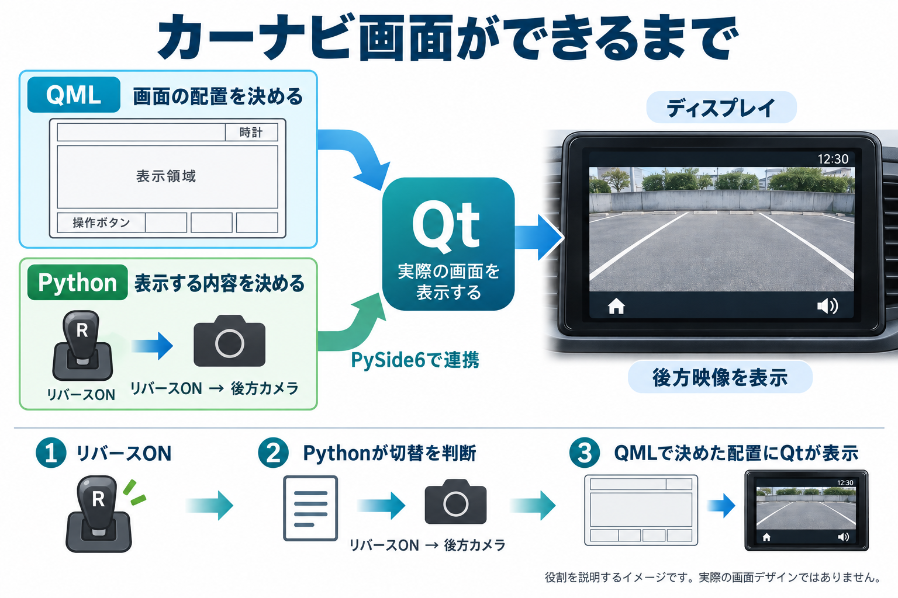

図 注1-1 QML・Python・Qtの役割と、リバースONで後方映像を表示する例

QMLが画面の配置を決め、Pythonが表示内容を判断する。その両方を使ってQtが実際の画面を表示し、PythonとQtの連携にはPySide6を使う。QMLからPythonへ順番に変換する、という意味ではない。
図の映像はカメラ担当ソフトから受け取るもので、QMLが撮影するわけではない。画面内のボタンや配置は役割説明用のイメージであり、実際に採用する画面デザインは別途決める。

例えば音楽の再生操作は、次の順序で動く。

1. QMLが再生ボタンを表示する。
2. タッチされたことをPython側へ伝える。
3. Python側が音楽担当ソフトへ再生を依頼する。
4. 再生が始まったことを確認し、QMLの表示を一時停止ボタンへ変える。

[本文へ戻る](#note-ref-qml)

<a id="note-qt"></a>
### 注2 Qt

画面を持つアプリを作るための開発用の仕組み。画面の表示、ボタンや文字の描画、マウス・タッチ操作の受付などに必要な機能を提供する。

QMLは画面の内容を書く言語であり、Qtはその画面を動かすために利用する仕組み、という関係になる。

[本文へ戻る](#note-ref-qt)

<a id="note-pyside6"></a>
### 注3 PySide6（パイサイド・シックス）

PythonからQt 6の機能を利用するためのライブラリ。ライブラリとは、プログラムから呼び出して利用できる機能をまとめたもの。

今回の設計では、Pythonで画面アプリを起動し、QMLへ車速や再生状態を渡したり、QMLからタッチ操作を受け取ったりするために使う。QML・Qt・PySide6は別々の役割を持ち、組み合わせて1つの画面アプリを作る。

[本文へ戻る](#note-ref-pyside6)
