# Waydroidナビ管理 詳細設計書

| 項目 | 内容 |
| --- | --- |
| 文書ID | SW-DD-02 |
| 実行環境 | Raspberry Pi 5 / LinuxのWayland利用者セッション |
| 実装状態 | 内部実装済み・実機未検証 |
| 対象ソース | `src/raspberry_pi5/waydroid_navigation_manager.py`、`navigation/` |
| 作成日 | 2026-09-14 |

[詳細設計一覧](README.md) / [共通仕様](00_共通仕様.md) / [上位設計](../ソフトウェア設計図.md#sec-49)

## 目次
- [1. 目的・適用範囲](#dd-1)
- [2. 要求仕様・役割](#dd-2)
  - [2.1 機能一覧](#dd-functions)
  - [2.2 機能・モジュール・関数の対応](#dd-function-module-map)
- [3. 内部構成](#dd-3)
  - [3.1 モジュールの全体構成](#dd-overview)
  - [3.2 機能別処理フローチャート](#dd-feature-flows)
    - [3.2.1 実行環境の確認（NAV-F01）](#dd-feature-f01)
    - [3.2.2 オフライン利用条件の確認（NAV-F02）](#dd-feature-f02)
    - [3.2.3 ナビの起動（NAV-F03）](#dd-feature-f03)
    - [3.2.4 ナビ画面の表示（NAV-F04）](#dd-feature-f04)
    - [3.2.5 ナビ画面の非表示（NAV-F05）](#dd-feature-f05)
    - [3.2.6 準備・位置・稼働状態の通知（NAV-F06）](#dd-feature-f06)
    - [3.2.7 障害時の復旧調整（NAV-F07）](#dd-feature-f07)
    - [3.2.8 ナビの終了（NAV-F08）](#dd-feature-f08)
  - [3.3 モジュールツリー](#dd-module-tree)
  - [3.4 モジュール間の処理順序](#dd-sequence)
  - [3.5 モジュール詳細](#dd-modules)
    - [3.5.1 NavigationSupervisor（要求・進行・状態の管理）](#dd-module-1)
    - [3.5.2 EnvironmentProbe（実行環境・資源の確認）](#dd-module-2)
    - [3.5.3 ContainerAdapter（コンテナ操作）](#dd-module-3)
    - [3.5.4 SessionAdapter（利用者セッション操作）](#dd-module-4)
    - [3.5.5 AppLauncher（アプリの起動・終了）](#dd-module-5)
    - [3.5.6 WindowAdapter（画面の表示・非表示）](#dd-module-6)
  - [3.6 ファイル構成](#dd-files)
  - [3.7 関数のフローチャート](#dd-functions-flow)
    - [3.7.1 load_config（設定を読み込む）](#dd-fn-1)
    - [3.7.2 check_environment（実行環境を確認する）](#dd-fn-2)
    - [3.7.3 check_resources（地図と音声の準備を確認する）](#dd-fn-3)
    - [3.7.4 handle_request（UIからの要求を受け付ける）](#dd-fn-4)
    - [3.7.5 ensure_running（必要な段階だけナビを起動する）](#dd-fn-5)
    - [3.7.6 ensure_container（コンテナを準備する）](#dd-fn-6)
    - [3.7.7 ensure_session（利用者セッションとAndroidを準備する）](#dd-fn-7)
    - [3.7.8 ensure_app（登録済みアプリを準備する）](#dd-fn-8)
    - [3.7.9 update_location_state（位置連携の状態を更新する）](#dd-fn-9)
    - [3.7.10 build_status（UIに返す状態をまとめる）](#dd-fn-10)
    - [3.7.11 apply_visibility（表示または非表示を反映する）](#dd-fn-11)
    - [3.7.12 schedule_recovery（再試行の可否と時刻を決める）](#dd-fn-12)
    - [3.7.13 stop_navigation（所有範囲内でナビを終了する）](#dd-fn-13)
    - [3.7.14 stop_app（登録済みアプリの終了を調整する）](#dd-fn-14)
    - [3.7.15 stop_session（利用者セッションを終了する）](#dd-fn-15)
    - [3.7.16 stop_container（専用コンテナを終了する）](#dd-fn-16)
- [4. インターフェース設計](#dd-4)
  - [インターフェース図](#dd-interface-diagrams)
  - [4.1 要求一覧](#dd-41)
  - [4.2 通知・応答一覧](#dd-42)
  - [4.2.1 UIとの通信方式](#dd-421)
  - [4.3 UIへの状態表示](#dd-43)
  - [4.4 外部コマンド・権限](#dd-44)
  - [4.5 他ソフトとの分担](#dd-45)
- [5. データ・設定設計](#dd-5)
  - [5.1 状態データ一覧](#dd-51)
  - [5.2 設定・保存方針](#dd-52)
- [6. 処理・状態遷移](#dd-6)
  - [6.1 状態遷移図](#dd-61)
  - [6.3 停止処理の結果確認](#dd-63)
  - [6.2 表示・競合処理](#dd-62)
  - [6.4 非同期要求処理](#dd-64)
- [7. 異常処理](#dd-7)
  - [7.1 状態別表示・復旧動作](#dd-71)
  - [8. 起動・終了・運用設計](#dd-8)
  - [8.1 操作制限・利用条件](#dd-81)
  - [8.2 常駐プロセスのライフサイクル](#dd-82)
- [9. 試験・受入条件](#dd-9)
  - [9.1 機能・競合試験](#dd-91)
  - [9.2 性能・実機受入条件](#dd-92)
- [10. 未確定事項・実装課題](#dd-10)
- [用語の注釈](#dd-notes)

<a id="dd-1"></a>
## 1. 目的・適用範囲

Waydroid上のOsmAndを、カーナビUIから利用するための起動・状態確認・表示・終了を管理する。Pythonで実装するLinux側の管理プログラムとし、01 カーナビUIとは別に動作させる。独自の操作画面は持たず、進捗・異常・利用可否は01 カーナビUIへ通知する。

| 本ソフトが担当すること | 他のソフトが担当すること |
| --- | --- |
| 実行環境の確認、Waydroidコンテナ・利用者セッションの起動調整 | Waydroid本体によるAndroidの実行 |
| OsmAndの起動確認、表示・非表示の要求処理 | OsmAndによる地図表示、目的地検索、経路探索、音声案内 |
| 位置連携の準備・異常状態の確認 | 03 現在地補正の位置推定、04 Linux位置情報連携から05 Android位置情報連携への位置配送、05 Android位置情報連携のAndroid位置登録 |
| 停止可能な範囲の確認、終了結果の通知 | 13 Pi 5状態通知デーモンの電源管理、OS停止、06 カメラ表示・録画の録画、12 オーディオ連携の音楽・案内音声調整 |

位置の経路は03 現在地補正 → 04 Linux位置情報連携 → 05 Android位置情報連携 → Android位置情報 → OsmAndとする。本ソフトは位置座標を再送・補正せず、GPSと推定位置の二重入力を作らない。
起動・終了はOS全体の開始・停止と区別する。ナビを隠しても案内を続けられる構成を目標とし、実機での継続動作を確認して採用する。

<a id="dd-2"></a>
## 2. 要求仕様・役割

| ID | 要求 |
| --- | --- |
| NAV-01 | 必要地域の地図・音声の準備を確認し、インターネット接続なしでナビを利用する |
| NAV-02 | コンテナ、利用者セッション、Android、位置連携、OsmAnd、表示状態を区別する |
| NAV-03 | カメラ優先表示とナビのバックグラウンド動作を両立し、起動完了だけで表示を奪わない |
| NAV-04 | 起動失敗や再試行でUI・録画・電源管理を巻き込まない |
| NAV-05 | 重複要求、古い表示要求、期限切れの位置状態を正しく区別する |
| NAV-06 | 特権操作を限定し、他用途で利用中のコンテナ・セッションを無断で停止しない |
| NAV-07 | 設定・地図を自動削除せず、未確認の保存や停止を成功扱いしない |

<a id="dd-functions"></a>
### 2.1 機能一覧

機能は「何をできるか」、モジュールは「実現するための構成要素」、関数は「モジュール内の具体的な処理」を表す。

| 機能ID | 機能 | 実現する動作 |
| --- | --- | --- |
| [NAV-F01](#dd-feature-f01) | 実行環境の確認 | OS・採用バージョン・Wayland・必要権限・カーネル条件の適合を確認する |
| [NAV-F02](#dd-feature-f02) | オフライン利用条件の確認 | 地図・音声・ナビ設定の確認記録と容量を確認する |
| [NAV-F03](#dd-feature-f03) | ナビの起動 | 起動済み資源を再利用し、必要な段階だけを準備する |
| [NAV-F04](#dd-feature-f04) | ナビ画面の表示 | 現在有効なUIの許可に従いOsmAndを手前に表示する |
| [NAV-F05](#dd-feature-f05) | ナビ画面の非表示 | ナビを終了せず、UI・カメラなどへ表示を譲る |
| [NAV-F06](#dd-feature-f06) | 準備・位置・稼働状態の通知 | 各段階の状態と有効性をUIへ通知する |
| [NAV-F07](#dd-feature-f07) | 障害時の復旧調整 | 原因を分類し、範囲と回数を限定して再試行する |
| [NAV-F08](#dd-feature-f08) | ナビの終了 | 位置連携・アプリ・セッション・コンテナを所有範囲内で終了する |

地図や音声の自動ダウンロード、経路探索の独自実装、走行中の環境変更は対象外とする。

<a id="dd-function-module-map"></a>
### 2.2 機能・モジュール・関数の対応

| 機能ID | 主な担当モジュール | 主な関数 |
| --- | --- | --- |
| NAV-F01 | EnvironmentProbe | check_environment |
| NAV-F02 | EnvironmentProbe | check_resources |
| NAV-F03 | NavigationSupervisor、ContainerAdapter、SessionAdapter、AppLauncher | handle_request、ensure_running、ensure_container、ensure_session、ensure_app |
| NAV-F04 / NAV-F05 | NavigationSupervisor、WindowAdapter | handle_request、apply_visibility |
| NAV-F06 | NavigationSupervisor、各Adapter | update_location_state、build_status |
| NAV-F07 | NavigationSupervisor、各Adapter | schedule_recovery、ensure_running |
| NAV-F08 | NavigationSupervisor、AppLauncher、SessionAdapter、ContainerAdapter | stop_navigation、stop_app、stop_session、stop_container |

同じモジュールを複数の機能で共用する。関数の一覧と処理手順は[3.7](#dd-functions-flow)に記載する。

<a id="dd-3"></a>
## 3. 内部構成

6つの主要モジュールで構成する。全体構成、機能別処理、モジュールツリー、処理順序、モジュール詳細、ファイル構成、関数の順で記載する。

| モジュール | 役割 |
| --- | --- |
| NavigationSupervisor | UI要求の受付、起動順序、状態・期限・再試行・終了の管理 |
| EnvironmentProbe | 実行環境とオフライン利用条件の確認 |
| ContainerAdapter | 管理権限を必要とするコンテナ操作の窓口 |
| SessionAdapter | 実際のWayland利用者セッションでのWaydroid操作 |
| AppLauncher | 登録済みの05 Android位置情報連携とOsmAndの起動・終了調整 |
| WindowAdapter | 検証済みの画面管理方法による表示・非表示と結果確認 |

Adapterは、外部ソフトごとの操作方法をまとめた部品を指す。モジュールは1ファイル・1クラス・1つのOSプロセスと必ずしも一致しない。

<a id="dd-overview"></a>
### 3.1 モジュールの全体構成

実線の両矢印は操作要求と結果の受渡し、破線の矢印は状態の観測を示す。青は統括、緑は確認・外部操作を担当するモジュール、灰色は本ソフトの外側で動くものを表す。各接続で渡す内容は図の下の表に記載する。

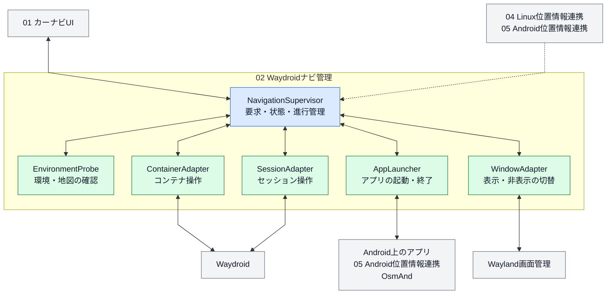
```mermaid
%%{init: {'flowchart': {'nodeSpacing': 36, 'rankSpacing': 60, 'curve': 'linear'}}}%%
flowchart TB
    UI["01 カーナビUI"]
    LOC["04 Linux位置情報連携<br/>05 Android位置情報連携"]
    subgraph Manager["02 Waydroidナビ管理"]
        S["NavigationSupervisor<br/>要求・状態・進行管理"]
        E["EnvironmentProbe<br/>環境・地図の確認"]
        C["ContainerAdapter<br/>コンテナ操作"]
        U["SessionAdapter<br/>セッション操作"]
        A["AppLauncher<br/>アプリの起動・終了"]
        W["WindowAdapter<br/>表示・非表示の切替"]
        S <--> E
        S <--> C
        S <--> U
        S <--> A
        S <--> W
    end
    UI <--> S
    LOC -.-> S
    C <--> WD["Waydroid"]
    U <--> WD
    A <--> AND["Android上のアプリ<br/>05 Android位置情報連携<br/>OsmAnd"]
    W <--> COMP["Wayland画面管理"]
    classDef core fill:#DBEAFE,stroke:#2563EB,color:#111827;
    classDef adapter fill:#DCFCE7,stroke:#15803D,color:#111827;
    classDef external fill:#F3F4F6,stroke:#6B7280,color:#111827;
    class S core;
    class E,C,U,A,W adapter;
    class UI,WD,AND,COMP,LOC external;
```

**モジュール間の接続**

| 接続するモジュール | 送る要求・情報 | 返す結果・情報 |
| --- | --- | --- |
| 01 カーナビUI → NavigationSupervisor | start / show / hide / stop | 進捗、処理結果、利用可否 |
| NavigationSupervisor → EnvironmentProbe | 環境・地図の確認要求 | 適合性、確認根拠 |
| NavigationSupervisor → ContainerAdapter | コンテナの起動・終了要求 | 処理結果、実際の稼働状態 |
| NavigationSupervisor → SessionAdapter | セッションの起動・終了要求 | 処理結果、実際の稼働状態 |
| NavigationSupervisor → AppLauncher | アプリの起動・終了要求 | 処理結果、実際の稼働状態 |
| NavigationSupervisor → WindowAdapter | 表示・非表示の切替要求 | 切替結果、確認した表示状態 |
| 04 Linux位置情報連携・05 Android位置情報連携 → NavigationSupervisor | 稼働状態、配送・登録状態の通知 | この接続では状態の観測だけを行う |

**外部ソフトとの接続**

| 操作するモジュール → 操作先 | 操作と確認の範囲 |
| --- | --- |
| ContainerAdapter → Waydroid | 許可した特権操作だけを実行し、コンテナの実状態を確認する |
| SessionAdapter → Waydroid | 実際のWayland利用者としてセッションを操作し、実状態を確認する |
| AppLauncher → Android上のアプリ | 登録済みの05 Android位置情報連携とOsmAndだけを操作し、実状態を確認する |
| WindowAdapter → Wayland画面管理 | 検証済みの方法で表示を切り替え、結果を確認する |

NavigationSupervisorが状態を一元管理する。各Adapterは結果を返し、他のAdapterを直接呼び出して起動順序を変えない。
起動スクリプトは`Session: RUNNING`だけで起動完了とせず、`sys.boot_completed=1`を確認してから管理プログラムとUIを起動する。これは`waydroid session start`が利用者セッションを開始する操作であり、AndroidのSystemUIやアプリを利用できる状態になるまでには別の起動時間があるためである。Android起動完了後、UI起動時にOsmAndを先行起動し、Waydroidウィンドウが生成された場合はSwayのスクラッチパッドへ退避して待機させる。ホーム画面の「ナビゲーション」要求ではナビ方式をOsmAndへ変更し、起動済みのOsmAndを表示面へ戻してから固定ナビ表示領域へ移動・リサイズする。画面最下部の共通「ナビ」要求では、01 カーナビUIが保持する直前のOsmAnd/LIVI選択を使用する。ホーム画面の「Waydroid」要求では、先に`waydroid show-full-ui`でWaydroidの表示面を準備し、その後にAndroidの`KEYCODE_HOME`を送ってホーム画面を最終的な前面画面にする。Launcher3は通常アプリ用の`waydroid app launch`ではホームへ切り替わらない場合があるため使用しない。HOMEキー送信だけに限定した`sudoers`規則を使用し、管理プログラムには任意のrootコマンド実行権限を与えない。HOMEキー送信またはホーム画面検出に失敗した場合は、直前のOsmAndをホームとして誤表示せずWaydroid表示面を退避し、Androidホームの失敗として通知する。ホーム画面をOsmAndとは異なるSway識別子で検出し、同じ固定領域へ配置する。Waydroidホームを表示しても直前のOsmAnd/LIVI選択は変更しない。OsmAndとホーム画面の起動はAndroid起動完了後に行い、準備直後の失敗には設定した回数まで再試行する。Raspberry Pi 5実機とDebian 13仮想環境ではSway Waylandセッションを採用し、UIから受け取った固定ナビ表示領域をSwayの外部ウィンドウ配置先として扱う。WindowAdapterは表示対象ごとのWaydroidウィンドウを検出し、同じWaylandコンポジタ上で固定領域へ移動・リサイズする。他の画面へ切り替える場合は現在の外部ウィンドウをスクラッチパッドへ退避し、再び選択した場合は表示面の配置を確認する。IPCでは受付応答だけで処理を完了せず、状態通知と最終的な`command_result`を受信してからUIへ完了状態を通知する。GNOMEセッションは対象外とし、テストスクリプトはSwayへ接続できない場合に起動を停止する。

<a id="dd-feature-flows"></a>
### 3.2 機能別処理フローチャート

丸みのある枠は開始・終了、四角は処理、ひし形は条件判断を示す。処理内の担当名で実行するモジュールを示す。
応答を待つ処理はUIの操作を止めない。結果到着・状態変化・期限切れを契機に続きへ進み、待機中もhide・stop・表示許可の失効を処理する。

<a id="dd-feature-f01"></a>
#### 3.2.1 実行環境の確認（NAV-F01）

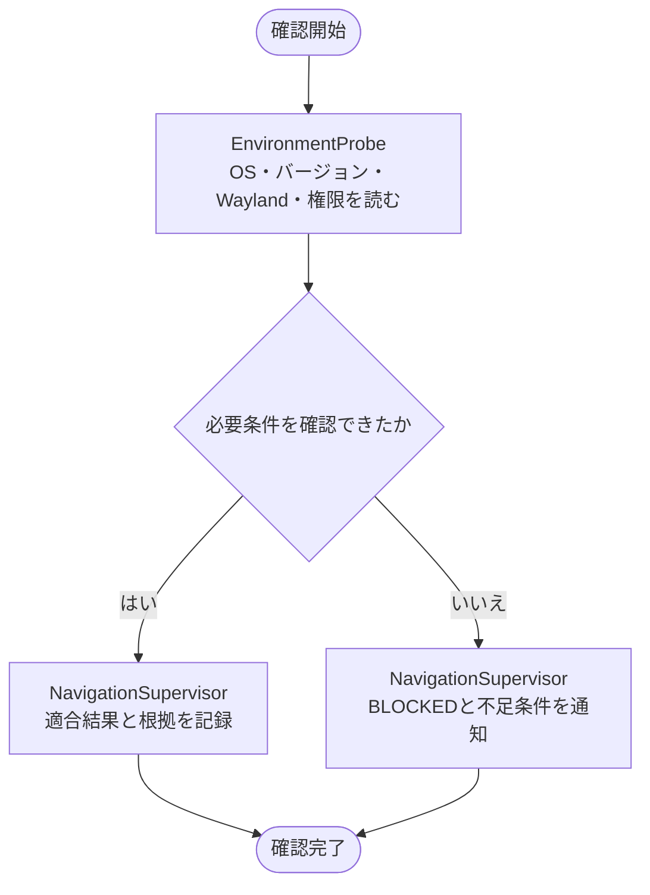
```mermaid
flowchart TB
    A(["確認開始"])
    B["EnvironmentProbe<br/>OS・バージョン・Wayland・権限を読む"]
    C{"必要条件を確認できたか"}
    D["NavigationSupervisor<br/>適合結果と根拠を記録"]
    X["NavigationSupervisor<br/>BLOCKEDと不足条件を通知"]
    Z(["確認完了"])
    A --> B
    B --> C
    C -->|"はい"| D
    C -->|"いいえ"| X
    D --> Z
    X --> Z
```

環境変数があるだけでWayland接続可能とは判断しない。採用カーネルのBinder・メモリ条件、実際の利用者権限、画面管理方法を確認する。確認のためにOS設定を自動変更しない。

<a id="dd-feature-f02"></a>
#### 3.2.2 オフライン利用条件の確認（NAV-F02）

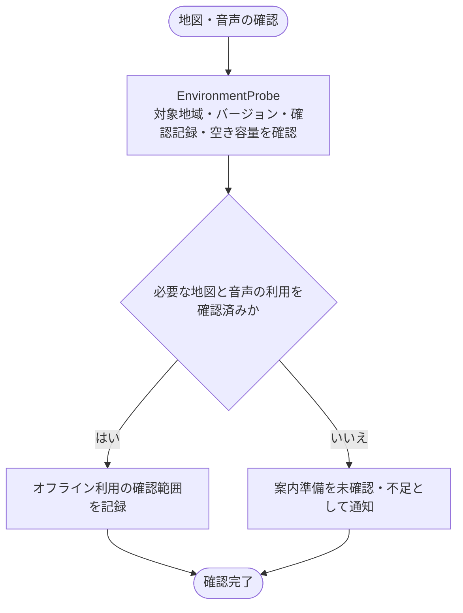
```mermaid
flowchart TB
    A(["地図・音声の確認"])
    B["EnvironmentProbe<br/>対象地域・バージョン・確認記録・空き容量を確認"]
    C{"必要な地図と音声の利用を確認済みか"}
    D["オフライン利用の確認範囲を記録"]
    X["案内準備を未確認・不足として通知"]
    Z(["確認完了"])
    A --> B
    B --> C
    C -->|"はい"| D
    C -->|"いいえ"| X
    D --> Z
    X --> Z
```

ファイルの存在だけで経路探索や日本語音声が利用できると判定しない。初期実装では導入記録と通信遮断試験を根拠にする。バージョン・対象地域・データ構成が変わったら記録を失効させ、再確認する。地図不足でもアプリを開く能力と案内能力を区別する。

<a id="dd-feature-f03"></a>
#### 3.2.3 ナビの起動（NAV-F03）

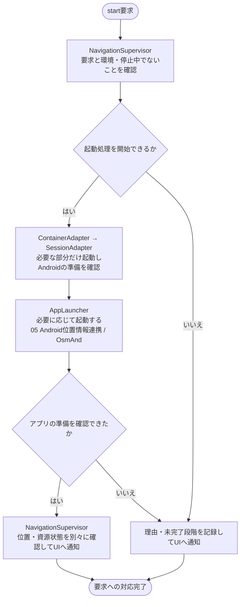
```mermaid
flowchart TB
    A(["start要求"])
    B["NavigationSupervisor<br/>要求と環境・停止中でないことを確認"]
    C{"起動処理を開始できるか"}
    D["ContainerAdapter → SessionAdapter<br/>必要な部分だけ起動しAndroidの準備を確認"]
    E["AppLauncher<br/>必要に応じて起動する<br/>05 Android位置情報連携 / OsmAnd"]
    F{"アプリの準備を確認できたか"}
    G["NavigationSupervisor<br/>位置・資源状態を別々に確認してUIへ通知"]
    X["理由・未完了段階を記録してUIへ通知"]
    Z(["要求への対応完了"])
    A --> B
    B --> C
    C -->|"はい"| D
    C -->|"いいえ"| X
    D --> E
    E --> F
    F -->|"はい"| G
    F -->|"いいえ"| X
    G --> Z
    X --> Z
```

各段階の失敗・期限切れも失敗経路へ進む。起動済みなら実状態を確認して再利用し、位置未測位だけでは地図閲覧を禁止しない。startは表示許可を含まない。非表示起動を保証できないAppLauncherでは自動起動を拒否する。

<a id="dd-feature-f04"></a>
#### 3.2.4 ナビ画面の表示（NAV-F04）

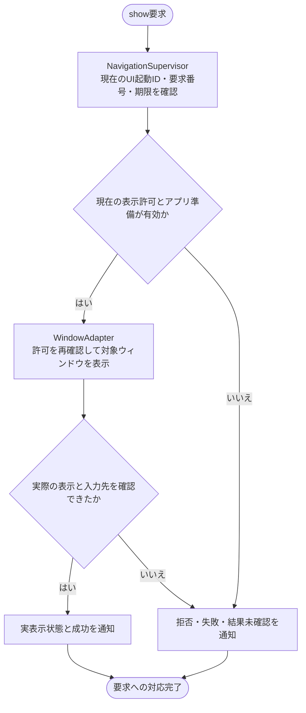
```mermaid
flowchart TB
    A(["show要求"])
    B["NavigationSupervisor<br/>現在のUI起動ID・要求番号・期限を確認"]
    C{"現在の表示許可とアプリ準備が有効か"}
    D["WindowAdapter<br/>許可を再確認して対象ウィンドウを表示"]
    E{"実際の表示と入力先を確認できたか"}
    F["実表示状態と成功を通知"]
    X["拒否・失敗・結果未確認を通知"]
    Z(["要求への対応完了"])
    A --> B
    B --> C
    C -->|"はい"| D
    C -->|"いいえ"| X
    D --> E
    E -->|"はい"| F
    F --> Z
    E -->|"いいえ"| X
    X --> Z
```

UIが優先順位を決定し、本ソフトは有効なshowだけを実行する。表示要求では、WindowAdapterでWaydroidの表示面を準備し、SessionAdapterでセッション稼働を確認した後、AppLauncherがOsmAndを起動する。要求の有効性確認から画面操作までの間にhide・stopが来た場合も、古い表示操作を中止する。

<a id="dd-feature-f05"></a>
#### 3.2.5 ナビ画面の非表示（NAV-F05）

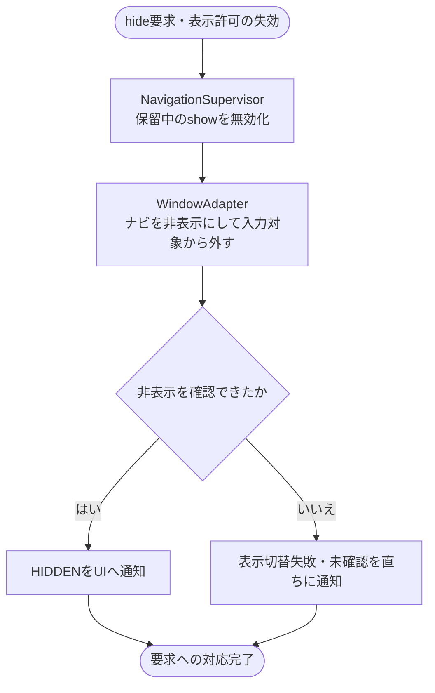
```mermaid
flowchart TB
    A(["hide要求・表示許可の失効"])
    B["NavigationSupervisor<br/>保留中のshowを無効化"]
    C["WindowAdapter<br/>ナビを非表示にして入力対象から外す"]
    D{"非表示を確認できたか"}
    E["HIDDENをUIへ通知"]
    X["表示切替失敗・未確認を直ちに通知"]
    Z(["要求への対応完了"])
    A --> B
    B --> C
    C --> D
    D -->|"はい"| E
    D -->|"いいえ"| X
    E --> Z
    X --> Z
```

hideでは05 Android位置情報連携、OsmAnd、Waydroidを停止しない。カメラの前面表示は01 カーナビUI側の責務であり、hide成功だけでカメラ表示成功とは扱わない。UIとの接続が失われた場合は表示許可を失効させる。

<a id="dd-feature-f06"></a>
#### 3.2.6 準備・位置・稼働状態の通知（NAV-F06）

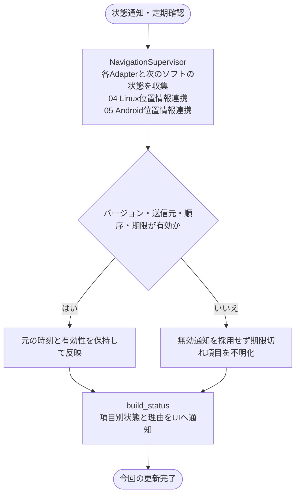
```mermaid
flowchart TB
    A(["状態通知・定期確認"])
    B["NavigationSupervisor<br/>各Adapterと次のソフトの状態を収集<br/>04 Linux位置情報連携<br/>05 Android位置情報連携"]
    C{"バージョン・送信元・順序・期限が有効か"}
    D["元の時刻と有効性を保持して反映"]
    X["無効通知を採用せず期限切れ項目を不明化"]
    E["build_status<br/>項目別状態と理由をUIへ通知"]
    Z(["今回の更新完了"])
    A --> B
    B --> C
    C -->|"はい"| D
    C -->|"いいえ"| X
    D --> E
    X --> E
    E --> Z
```

稼働中、位置の配送成功、Androidへの登録成功、OsmAndの位置表示は別の観測である。05 Android位置情報連携の登録成功だけをOsmAndがその位置を利用した証拠にしない。古い状態をまとめ直しても寿命を延長しない。

<a id="dd-feature-f07"></a>
#### 3.2.7 障害時の復旧調整（NAV-F07）

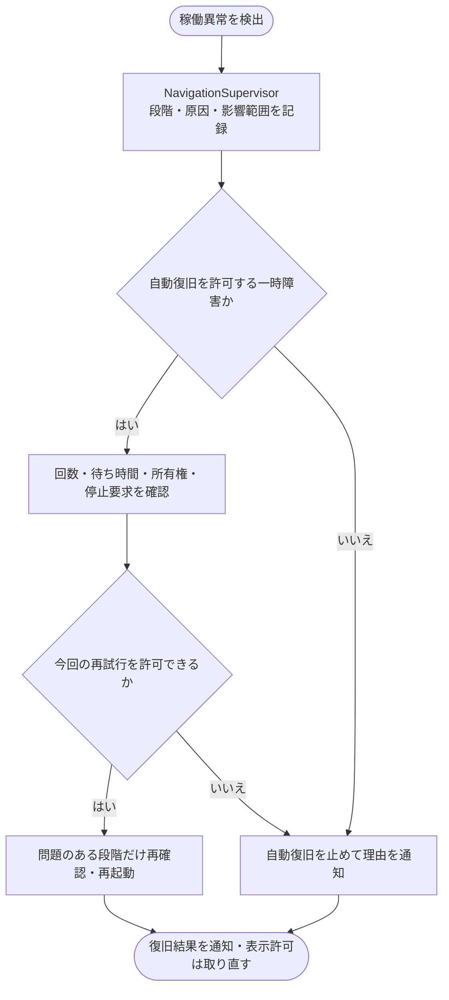
```mermaid
flowchart TB
    A(["稼働異常を検出"])
    B["NavigationSupervisor<br/>段階・原因・影響範囲を記録"]
    C{"自動復旧を許可する一時障害か"}
    D["回数・待ち時間・所有権・停止要求を確認"]
    E{"今回の再試行を許可できるか"}
    F["問題のある段階だけ再確認・再起動"]
    X["自動復旧を止めて理由を通知"]
    Z(["復旧結果を通知・表示許可は取り直す"])
    A --> B
    B --> C
    C -->|"はい"| D
    C -->|"いいえ"| X
    D --> E
    E -->|"はい"| F
    E -->|"いいえ"| X
    F --> Z
    X --> Z
```

権限不足・バージョン不適合・地図不足は再起動で修復しない。コンテナ再起動は全Androidアプリに影響するため、専用利用かつ停止許可がある場合だけ行う。復旧後も古いshowや経路操作を再実行しない。

<a id="dd-feature-f08"></a>
#### 3.2.8 ナビの終了（NAV-F08）

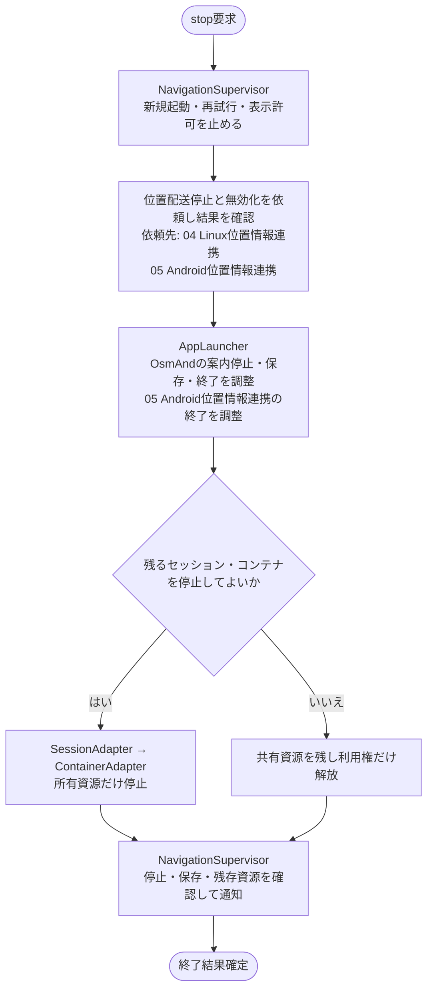
```mermaid
flowchart TB
    A(["stop要求"])
    B["NavigationSupervisor<br/>新規起動・再試行・表示許可を止める"]
    C["位置配送停止と無効化を依頼し結果を確認<br/>依頼先: 04 Linux位置情報連携<br/>05 Android位置情報連携"]
    D["AppLauncher<br/>OsmAndの案内停止・保存・終了を調整<br/>05 Android位置情報連携の終了を調整"]
    E{"残るセッション・コンテナを停止してよいか"}
    F["SessionAdapter → ContainerAdapter<br/>所有資源だけ停止"]
    G["共有資源を残し利用権だけ解放"]
    H["NavigationSupervisor<br/>停止・保存・残存資源を確認して通知"]
    Z(["終了結果確定"])
    A --> B
    B --> C
    C --> D
    D --> E
    E -->|"はい"| F
    E -->|"いいえ"| G
    F --> H
    G --> H
    H --> Z
```

04 Linux位置情報連携全体や共有する05 Android位置情報連携を無条件に終了せず、ナビ用の配送・登録だけを停止する。各段階に期限を設け、失敗・未確認でも残りの安全な後片付けへ進む。保存を確認できない強制終了は正常保存として報告しない。

<a id="dd-module-tree"></a>
### 3.3 モジュールツリー

```text
Waydroidナビ管理
|
+-- NavigationSupervisor（進行・状態管理）
|   +-- RequestRegistry（要求番号と処理結果）
|   +-- NavigationState（段階別の状態）
|   +-- LocationStatusWatcher（04 Linux位置情報連携、05 Android位置情報連携の状態確認）
|   +-- RecoveryPolicy（再試行の許可判断）
|   +-- StatusPublisher（UIへの状態通知）
|
+-- EnvironmentProbe（環境・オフライン条件の確認）
|   +-- ResourceRecord（地図・音声の導入確認記録）
|
+-- ContainerAdapter（コンテナ操作）
+-- SessionAdapter（利用者セッション操作）
+-- AppLauncher（登録済みアプリ操作）
+-- WindowAdapter（表示・非表示）
```

枝はモジュール内の構成要素を表し、実行順序ではない。関数は[3.7](#dd-functions-flow)、保持するデータは[5章](#dd-5)に分けて記載する。
複数のAdapterで使うCommandRunnerは固定引数で外部コマンドを実行する補助部品とし、終了コード・出力・期限切れを返す。業務上の成功判断は各Adapterが実状態を確認して行う。

<a id="dd-sequence"></a>
### 3.4 モジュール間の処理順序

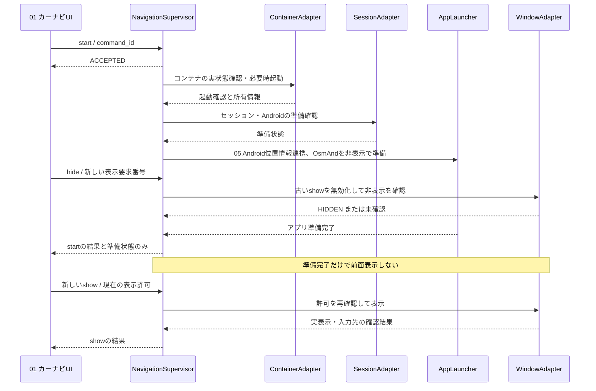
```mermaid
sequenceDiagram
    participant UI as 01 カーナビUI
    participant S as NavigationSupervisor
    participant C as ContainerAdapter
    participant U as SessionAdapter
    participant A as AppLauncher
    participant W as WindowAdapter
    UI->>S: start / command_id
    S-->>UI: ACCEPTED
    S->>C: コンテナの実状態確認・必要時起動
    C-->>S: 起動確認と所有情報
    S->>U: セッション・Androidの準備確認
    U-->>S: 準備状態
    S->>A: 05 Android位置情報連携、OsmAndを非表示で準備
    UI->>S: hide / 新しい表示要求番号
    S->>W: 古いshowを無効化して非表示を確認
    W-->>S: HIDDEN または未確認
    A-->>S: アプリ準備完了
    S-->>UI: startの結果と準備状態のみ
    Note over S,W: 準備完了だけで前面表示しない
    UI->>S: 新しいshow / 現在の表示許可
    S->>W: 許可を再確認して表示
    W-->>S: 実表示・入力先の確認結果
    S-->>UI: showの結果
```

| 処理の分担 | 実行規則 |
| --- | --- |
| 要求受付・状態更新 | NavigationSupervisorが順序を管理。長時間待つ外部コマンドを受付処理で実行しない |
| 起動・実状態確認 | 各Adapterへ依頼し、完了通知で次段階へ進む。同じ資源への変更操作は1件ずつ |
| 表示切替 | hide・停止・許可失効は、保留中のshowや再試行より優先する |
| 期限確認 | 単調時計で起動段階・要求・状態の期限を確認。通知停止中も動作させる |
| 終了 | 起動中の処理結果が遅れて届いても、停止済みの段階へ戻さない |

位置連携開始はAndroid準備後に04 Linux位置情報連携、05 Android位置情報連携へ調整を依頼する。位置未取得は状態通知として扱い、位置が得られるまで起動処理を無期限に待たせない。

<a id="dd-modules"></a>
### 3.5 モジュール詳細

各モジュールの入力、出力、内部データ、公開関数と禁止事項を示す。関数名とファイルは実装前の案である。

<a id="dd-module-1"></a>
#### 3.5.1 NavigationSupervisor（要求・進行・状態の管理）

| 項目 | 内容 |
| --- | --- |
| 入力 | UIの要求、各Adapterの結果、04 Linux位置情報連携、05 Android位置情報連携の状態、期限通知 |
| 出力 | 要求受付・実行結果、UI向けの状態、各Adapterへの依頼 |
| 内部データ | NavigationState、RequestRegistry、実行世代番号、所有情報、再試行履歴 |
| 公開関数 | load_config、handle_request、ensure_running、update_location_state、build_status、schedule_recovery、stop_navigation |

状態の更新を一元化する。WindowAdapterへ渡す許可はUIの現在の判断に基づき、本人が表示の優先順位を決めない。位置座標を配送しない。

<a id="dd-module-2"></a>
#### 3.5.2 EnvironmentProbe（実行環境・資源の確認）

| 項目 | 内容 |
| --- | --- |
| 入力 | 検証済み設定、OS・Waylandの実状態、地図・音声の導入記録 |
| 出力 | 項目別の適合・不適合・未確認、確認時刻と理由 |
| 内部データ | 採用バージョンとの照合結果、確認対象地域、資源記録の署名・バージョンなどの識別情報 |
| 公開関数 | check_environment、check_resources |

読み取り確認に限定し、カーネル設定・Androidイメージ・地図を自動変更しない。確認手段がなければ未確認とし、存在を推測しない。

<a id="dd-module-3"></a>
#### 3.5.3 ContainerAdapter（コンテナ操作）

| 項目 | 内容 |
| --- | --- |
| 入力 | 許可された開始・停止要求、専用利用設定、期限 |
| 出力 | 実際のコンテナ状態、操作結果、停止できる所有範囲 |
| 内部データ | 起動前の状態、自分で起動した証拠、共有利用の確認、処理中の操作 |
| 公開関数 | ensure_container、stop_container |

特権部分は固定操作に限定する。既存のコンテナを発見しただけで所有扱いしない。確認済みの専用利用でない限り自動停止・再起動を禁止する。

<a id="dd-module-4"></a>
#### 3.5.4 SessionAdapter（利用者セッション操作）

| 項目 | 内容 |
| --- | --- |
| 入力 | 実際のWayland利用者情報、セッション操作、期限 |
| 出力 | 利用者セッションとAndroid準備状態、操作結果 |
| 内部データ | 利用者UID、実接続先、セッション識別情報、起動済みかの観測 |
| 公開関数 | ensure_session、stop_session |

GUIをrootで起動しない。WAYLAND_DISPLAYの文字列だけを作って動作済みとしない。起動コマンドの終了とAndroid準備完了を別々に確認する。

<a id="dd-module-5"></a>
#### 3.5.5 AppLauncher（アプリの起動・終了）

| 項目 | 内容 |
| --- | --- |
| 入力 | 役割名（location_bridge / navigation）、確認済みパッケージ、起動・終了要求 |
| 出力 | アプリの導入・稼働・準備状態、終了保存の確認状況 |
| 内部データ | パッケージ照合、起動要求の識別情報、保存確認結果 |
| 公開関数 | ensure_app、stop_app |

UIから任意パッケージを指定させない。起動の前面化抑止と終了・保存確認が未検証なら未対応として返す。stop要求を自動的なforce-stopへ置き換えない。

<a id="dd-module-6"></a>
#### 3.5.6 WindowAdapter（画面の表示・非表示）

| 項目 | 内容 |
| --- | --- |
| 入力 | show / hide、UI起動ID、表示要求番号、期限、対象ウィンドウ |
| 出力 | VISIBLE / HIDDEN / UNKNOWN、入力先、結果と理由 |
| 内部データ | 現在の表示許可、処理中番号、最後に確認できたウィンドウ |
| 公開関数 | apply_visibility |

許可確認と実操作の間の取り消しを扱う。`waydroid show-full-ui`のように表示面を保持するコマンドは、要求処理を止めない別プロセスとして起動し、短いコマンド期限で強制終了しない。遅れたshowが実行されたら、最新状態に従って再び隠し失敗を通知する。表示抑止・取り消しが保証できない方法は採用しない。

<a id="dd-files"></a>
### 3.6 ファイル構成

以下の配置で内部実装を作成している。`waydroid_navigation_manager.py`はPi 5上で常駐させ、UIからの要求はJSON Lines over Unix domain socketで受け付ける。Waydroidの実機コマンド、表示管理方式、位置連携は環境ごとの検証が必要であり、設定未指定の外部操作は実行しない。

```text
src/raspberry_pi5/
  waydroid_navigation_manager.py
  navigation/
    supervisor.py
    environment_probe.py
    container_adapter.py
    session_adapter.py
    app_launcher.py
    window_adapter.py
    state.py
    request_registry.py
    location_status_watcher.py
    recovery_policy.py
    status_publisher.py
    command_runner.py
    json_ipc.py
    async_dispatcher.py
    resident_runtime.py
  systemd/
    l880k-navigation.service
  config/
    navigation.example.yaml
tests/navigation/
  test_requests.py
  test_startup.py
  test_visibility.py
  test_location_status.py
  test_shutdown.py
  test_recovery.py
```

| 配置 | 役割 |
| --- | --- |
| waydroid_navigation_manager.py | 設定を読み、モジュールを組み立て、常駐して要求・通知の受付を開始する入口 |
| navigation/json_ipc.py | Unixドメインソケット上でJSON Linesを送受信するIPCサーバー |
| navigation/async_dispatcher.py | UIを待たせず、ナビ操作を順番に実行する要求ディスパッチャー |
| navigation/resident_runtime.py | 二重起動防止、PID記録、終了時のロック解放 |
| systemd/l880k-navigation.service | 管理プログラムをログイン後に起動し、異常終了時に再起動するユーザーサービス定義 |
| supervisor.py / state.py | 進行の判断と状態データを分離する |
| 各Adapter | 外部の操作・出力解釈・実状態確認を閉じ込める |
| command_runner.py | 固定プログラム・引数配列・出力容量・期限を管理する。シェル文字列を受け付けない |
| navigation.example.yaml | 秘密値なしの設定例。実設定は別の保管先を起動時に指定する |
| tests/navigation | 外部操作を模擬して正常・失敗・競合を再現する |

実設定、導入記録、地図、Androidデータ、ログはソースツリーに含めない。公開関数以外の内部構造へ他モジュールが直接書き込まない。

<a id="dd-functions-flow"></a>
### 3.7 関数のフローチャート

以下は実装予定の関数である。各表は入力・返す結果・失敗時の扱いを示し、図は関数の処理順序を示す。外部操作待ちは期限付きで別処理に分け、結果を受け取って続行する。

| 所属モジュール | 関数 | 処理 |
| --- | --- | --- |
| NavigationSupervisor | `load_config` | [設定を読み込む](#dd-fn-1) |
| EnvironmentProbe | `check_environment` | [実行環境を確認する](#dd-fn-2) |
| EnvironmentProbe | `check_resources` | [地図と音声の準備を確認する](#dd-fn-3) |
| NavigationSupervisor | `handle_request` | [UIからの要求を受け付ける](#dd-fn-4) |
| NavigationSupervisor | `ensure_running` | [必要な段階だけナビを起動する](#dd-fn-5) |
| ContainerAdapter | `ensure_container` | [コンテナを準備する](#dd-fn-6) |
| SessionAdapter | `ensure_session` | [利用者セッションとAndroidを準備する](#dd-fn-7) |
| AppLauncher | `ensure_app` | [登録済みアプリを準備する](#dd-fn-8) |
| NavigationSupervisor | `update_location_state` | [位置連携の状態を更新する](#dd-fn-9) |
| NavigationSupervisor | `build_status` | [UIに返す状態をまとめる](#dd-fn-10) |
| WindowAdapter | `apply_visibility` | [表示または非表示を反映する](#dd-fn-11) |
| NavigationSupervisor | `schedule_recovery` | [再試行の可否と時刻を決める](#dd-fn-12) |
| NavigationSupervisor | `stop_navigation` | [所有範囲内でナビを終了する](#dd-fn-13) |
| AppLauncher | `stop_app` | [登録済みアプリの終了を調整する](#dd-fn-14) |
| SessionAdapter | `stop_session` | [利用者セッションを終了する](#dd-fn-15) |
| ContainerAdapter | `stop_container` | [専用コンテナを終了する](#dd-fn-16) |

<a id="dd-fn-1"></a>
#### 3.7.1 load_config（設定を読み込む）

| 項目 | 内容 |
| --- | --- |
| 所属 | NavigationSupervisor |
| 入力 | 設定ファイルの場所 |
| 返す結果 | 検証済み設定、または設定エラー |

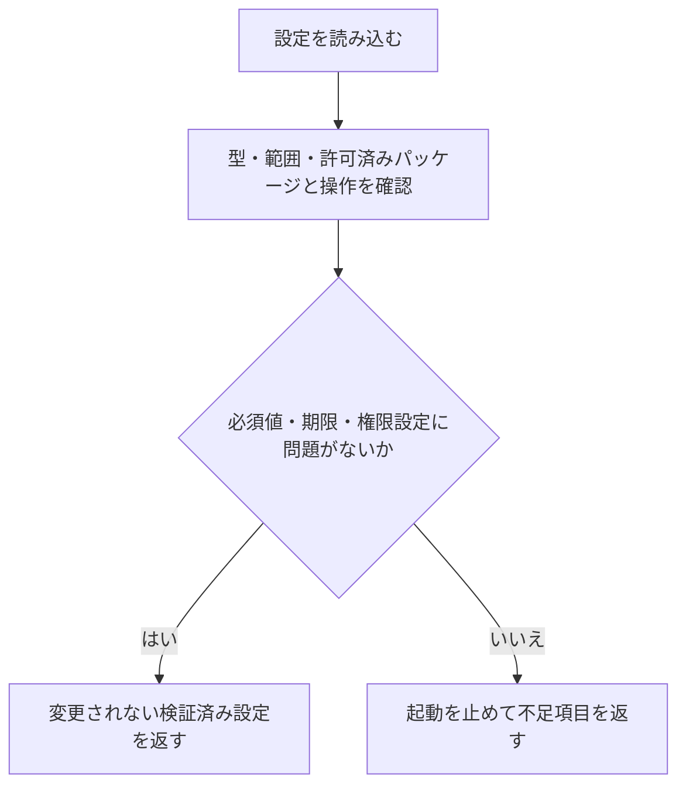
```mermaid
flowchart TB
    A["設定を読み込む"]
    B["型・範囲・許可済みパッケージと操作を確認"]
    C{"必須値・期限・権限設定に問題がないか"}
    D["変更されない検証済み設定を返す"]
    X["起動を止めて不足項目を返す"]
    A --> B
    B --> C
    C -->|"はい"| D
    C -->|"いいえ"| X
```

任意の実行コマンド・シェル・利用者HOMEを外部要求から設定させない。期限や再試行上限の未設定を無制限として扱わない。

<a id="dd-fn-2"></a>
#### 3.7.2 check_environment（実行環境を確認する）

| 項目 | 内容 |
| --- | --- |
| 所属 | EnvironmentProbe |
| 入力 | 採用バージョンの確認条件、利用者セッション情報 |
| 返す結果 | 項目別の適合・不適合・未確認と根拠 |

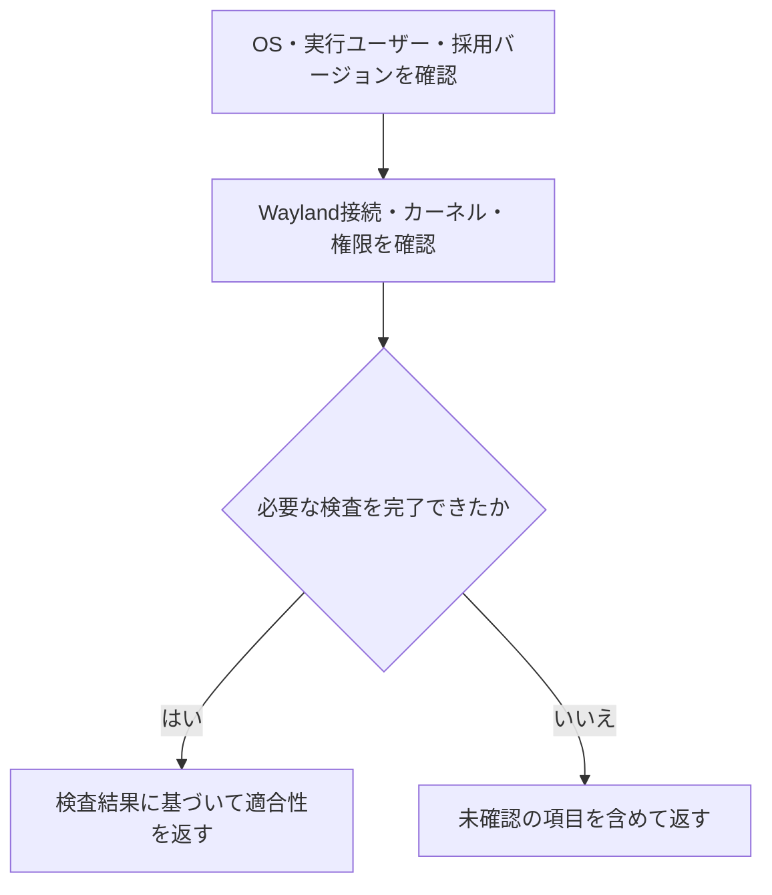
```mermaid
flowchart TB
    A["OS・実行ユーザー・採用バージョンを確認"]
    B["Wayland接続・カーネル・権限を確認"]
    C{"必要な検査を完了できたか"}
    D["検査結果に基づいて適合性を返す"]
    X["未確認の項目を含めて返す"]
    A --> B
    B --> C
    C -->|"はい"| D
    C -->|"いいえ"| X
```

Binderデバイスの存在だけでAndroid正常動作を断定しない。PSIなどの必要条件は採用イメージと導入付録に合わせて検査し、一般論だけで固定しない。

<a id="dd-fn-3"></a>
#### 3.7.3 check_resources（地図と音声の準備を確認する）

| 項目 | 内容 |
| --- | --- |
| 所属 | EnvironmentProbe |
| 入力 | 対象地域・音声・ナビ設定と導入記録 |
| 返す結果 | 確認済み範囲、不足、未確認、空き容量 |

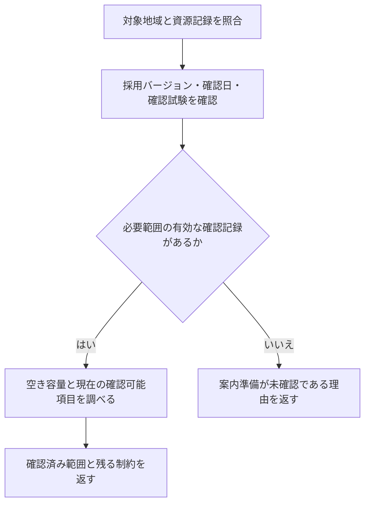
```mermaid
flowchart TB
    A["対象地域と資源記録を照合"]
    B["採用バージョン・確認日・確認試験を確認"]
    C{"必要範囲の有効な確認記録があるか"}
    D["空き容量と現在の確認可能項目を調べる"]
    E["確認済み範囲と残る制約を返す"]
    X["案内準備が未確認である理由を返す"]
    A --> B
    B --> C
    C -->|"はい"| D
    C -->|"いいえ"| X
    D --> E
```

ファイル一覧取得や自動資源検出の方法はT.B.D。確認できない情報を推測して埋めない。地図存在と対象経路の全域をカバーすることは別条件である。

<a id="dd-fn-4"></a>
#### 3.7.4 handle_request（UIからの要求を受け付ける）

| 項目 | 内容 |
| --- | --- |
| 所属 | NavigationSupervisor |
| 入力 | 認証済み接続、command_id、操作名、引数、期限、UI起動ID |
| 返す結果 | ACCEPTED / REJECTED、既知の結果、後続の処理結果 |

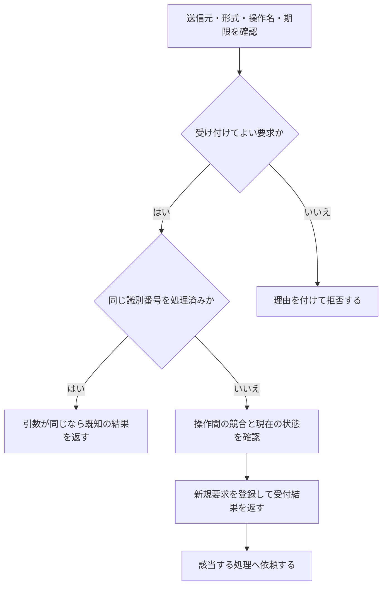
```mermaid
flowchart TB
    A["送信元・形式・操作名・期限を確認"]
    B{"受け付けてよい要求か"}
    C{"同じ識別番号を処理済みか"}
    D["引数が同じなら既知の結果を返す"]
    E["操作間の競合と現在の状態を確認"]
    F["新規要求を登録して受付結果を返す"]
    G["該当する処理へ依頼する"]
    X["理由を付けて拒否する"]
    A --> B
    B -->|"はい"| C
    B -->|"いいえ"| X
    C -->|"はい"| D
    C -->|"いいえ"| E
    E --> F
    F --> G
```

同じcommand_idで引数が異なる場合は拒否する。停止中のstartや無効なshowなど競合を解決できない要求も登録前に拒否する。異なる番号の重複startは実行中の起動へ対応付け、資源を多重起動しない。

<a id="dd-fn-5"></a>
#### 3.7.5 ensure_running（必要な段階だけナビを起動する）

| 項目 | 内容 |
| --- | --- |
| 所属 | NavigationSupervisor |
| 入力 | startの識別番号、実行世代、設定、全体期限 |
| 返す結果 | 段階別結果と起動完了、失敗、停止による中断 |

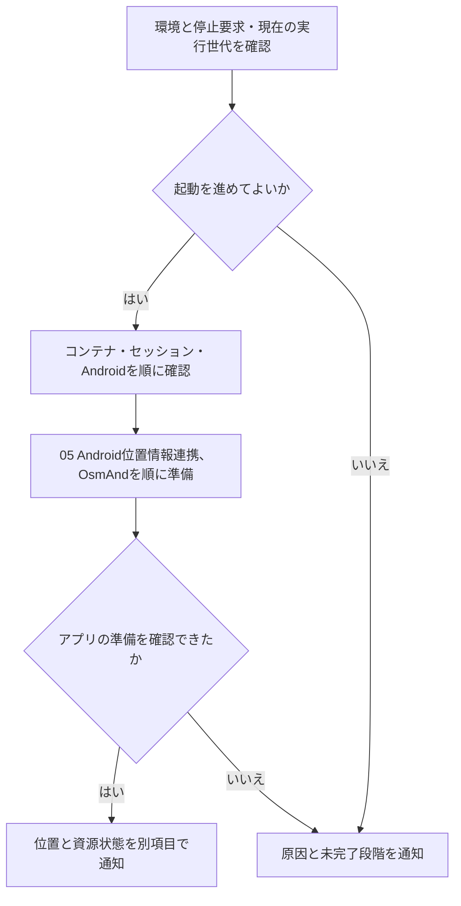
```mermaid
flowchart TB
    A["環境と停止要求・現在の実行世代を確認"]
    B{"起動を進めてよいか"}
    C["コンテナ・セッション・Androidを順に確認"]
    D["05 Android位置情報連携、OsmAndを順に準備"]
    E{"アプリの準備を確認できたか"}
    F["位置と資源状態を別項目で通知"]
    X["原因と未完了段階を通知"]
    A --> B
    B -->|"はい"| C
    B -->|"いいえ"| X
    C --> D
    D --> E
    E -->|"はい"| F
    E -->|"いいえ"| X
```

全段階で結果到着時に世代と期限を再確認し、失敗・停止・期限切れなら続行しない。失敗時の片付けは自分が開始した範囲だけに限定する。showは呼び出さない。
05 Android位置情報連携の準備失敗が位置連携だけに限定され、OsmAnd自体を利用できる場合は、location_stateに異常を保持して地図閲覧の準備へ進む。コンテナ・Android・OsmAndそのものの起動失敗とは区別する。

<a id="dd-fn-6"></a>
#### 3.7.6 ensure_container（コンテナを準備する）

| 項目 | 内容 |
| --- | --- |
| 所属 | ContainerAdapter |
| 入力 | 専用利用の設定、開始要求、期限 |
| 返す結果 | 実稼働状態、起動前状態、操作結果、所有情報 |

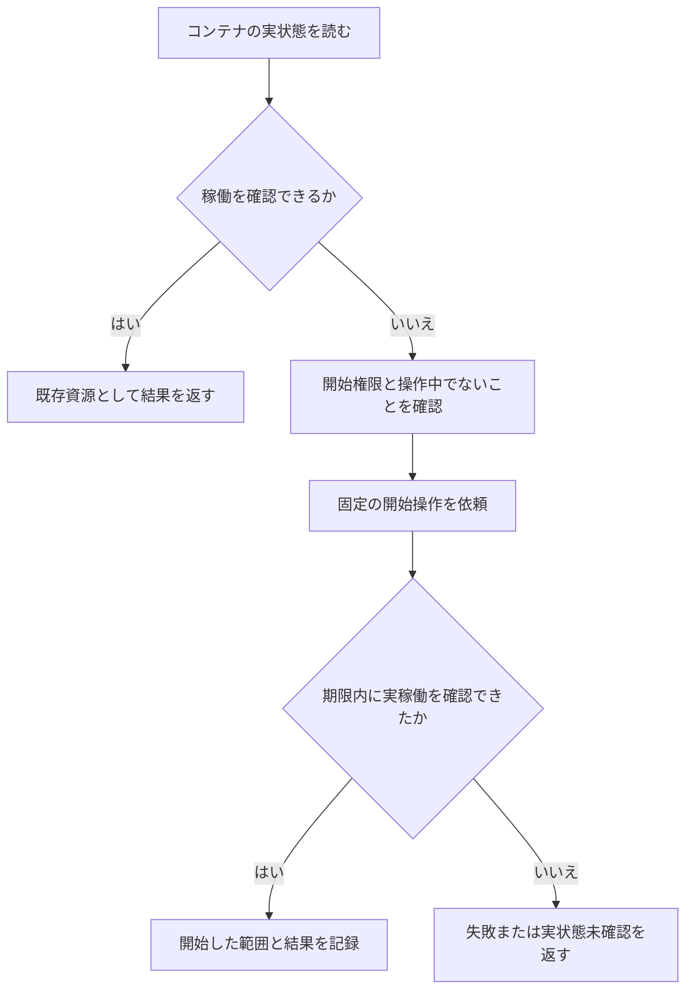
```mermaid
flowchart TB
    A["コンテナの実状態を読む"]
    B{"稼働を確認できるか"}
    C["既存資源として結果を返す"]
    D["開始権限と操作中でないことを確認"]
    E["固定の開始操作を依頼"]
    F{"期限内に実稼働を確認できたか"}
    G["開始した範囲と結果を記録"]
    X["失敗または実状態未確認を返す"]
    A --> B
    B -->|"はい"| C
    B -->|"いいえ"| D
    D --> E
    E --> F
    F -->|"はい"| G
    F -->|"いいえ"| X
```

開始前の状態が読めなければ、停止中と推測せず未確認で返す。開始権限がなければ操作しない。既に稼働しているコンテナを停止可能な所有物として記録しない。

<a id="dd-fn-7"></a>
#### 3.7.7 ensure_session（利用者セッションとAndroidを準備する）

| 項目 | 内容 |
| --- | --- |
| 所属 | SessionAdapter |
| 入力 | 実Waylandセッション、コンテナ状態、期限 |
| 返す結果 | セッション状態、Android準備状態、所有情報 |

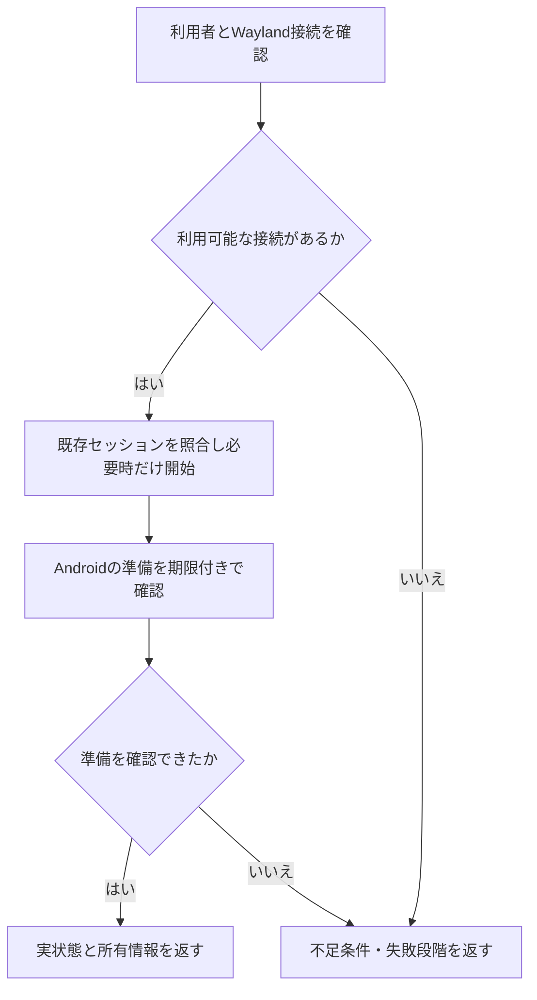
```mermaid
flowchart TB
    A["利用者とWayland接続を確認"]
    B{"利用可能な接続があるか"}
    C["既存セッションを照合し必要時だけ開始"]
    D["Androidの準備を期限付きで確認"]
    E{"準備を確認できたか"}
    F["実状態と所有情報を返す"]
    X["不足条件・失敗段階を返す"]
    A --> B
    B -->|"はい"| C
    B -->|"いいえ"| X
    C --> D
    D --> E
    E -->|"はい"| F
    E -->|"いいえ"| X
```

セッション開始コマンドが長時間継続する場合は、プロセス終了を起動成功の条件にしない。確認用の別操作でAndroid準備を観測し、コンテナ稼働と区別する。

<a id="dd-fn-8"></a>
#### 3.7.8 ensure_app（登録済みアプリを準備する）

| 項目 | 内容 |
| --- | --- |
| 所属 | AppLauncher |
| 入力 | 役割名、許可リスト、Android状態、非表示起動の条件、期限 |
| 返す結果 | 役割別の準備状態、実行結果、未対応理由 |

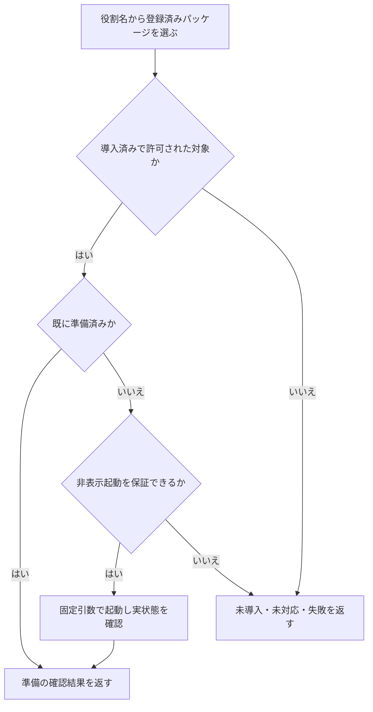
```mermaid
flowchart TB
    A["役割名から登録済みパッケージを選ぶ"]
    B{"導入済みで許可された対象か"}
    C{"既に準備済みか"}
    D{"非表示起動を保証できるか"}
    E["固定引数で起動し実状態を確認"]
    F["準備の確認結果を返す"]
    X["未導入・未対応・失敗を返す"]
    A --> B
    B -->|"はい"| C
    B -->|"いいえ"| X
    C -->|"はい"| F
    C -->|"いいえ"| D
    D -->|"はい"| E
    D -->|"いいえ"| X
    E --> F
```

05 Android位置情報連携は受信・登録経路の準備、OsmAndは指定アプリの動作と操作可能性で確認する。インストール済み一覧やプロセス存在だけで準備済みにしない。確認手段が未実装なら未確認を返す。

<a id="dd-fn-9"></a>
#### 3.7.9 update_location_state（位置連携の状態を更新する）

| 項目 | 内容 |
| --- | --- |
| 所属 | NavigationSupervisor |
| 入力 | 04 Linux位置情報連携、05 Android位置情報連携の状態通知、受信時の単調時刻 |
| 返す結果 | 配送状態、登録状態、元情報の期限、UI通知用の理由 |

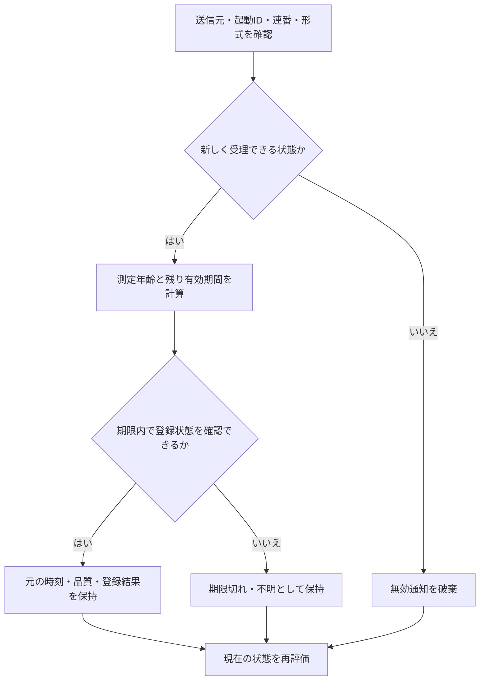
```mermaid
flowchart TB
    A["送信元・起動ID・連番・形式を確認"]
    B{"新しく受理できる状態か"}
    C["測定年齢と残り有効期間を計算"]
    D{"期限内で登録状態を確認できるか"}
    E["元の時刻・品質・登録結果を保持"]
    F["期限切れ・不明として保持"]
    X["無効通知を破棄"]
    G["現在の状態を再評価"]
    A --> B
    B -->|"はい"| C
    B -->|"いいえ"| X
    C --> D
    D -->|"はい"| E
    D -->|"いいえ"| F
    E --> G
    F --> G
    X --> G
```

破棄した通知で受信期限を更新しない。独立した期限確認でもGを実行する。座標自体の登録・配送は行わず、古い位置を現在の測位結果として報告しない。

<a id="dd-fn-10"></a>
#### 3.7.10 build_status（UIに返す状態をまとめる）

| 項目 | 内容 |
| --- | --- |
| 所属 | NavigationSupervisor |
| 入力 | 段階別の観測結果、要求結果、現在時刻 |
| 返す結果 | 項目別の状態・有効性・理由を持つ通知 |

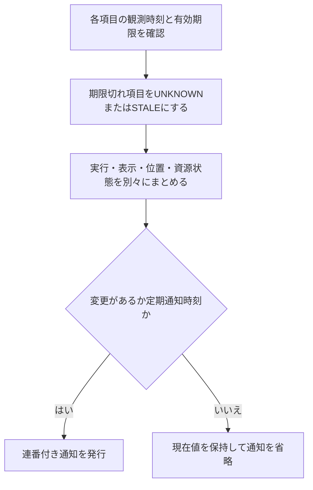
```mermaid
flowchart TB
    A["各項目の観測時刻と有効期限を確認"]
    B["期限切れ項目をUNKNOWNまたはSTALEにする"]
    C["実行・表示・位置・資源状態を別々にまとめる"]
    D{"変更があるか定期通知時刻か"}
    E["連番付き通知を発行"]
    F["現在値を保持して通知を省略"]
    A --> B
    B --> C
    C --> D
    D -->|"はい"| E
    D -->|"いいえ"| F
```

本管理ソフトの通知時刻と元情報の測定時刻を混同しない。位置品質を再通知するときも元の年齢を保持する。UI再接続では全状態を返すが、古い表示要求を復元しない。

<a id="dd-fn-11"></a>
#### 3.7.11 apply_visibility（表示または非表示を反映する）

| 項目 | 内容 |
| --- | --- |
| 所属 | WindowAdapter |
| 入力 | 表示種別、UI起動ID、表示要求番号、有効期限、対象識別情報 |
| 返す結果 | VISIBLE / HIDDEN / UNKNOWNと処理結果 |

```mermaid
flowchart TB
    A["現在の要求番号とUI接続状態を確認"]
    B{"hideまたは許可失効か"}
    C["保留中のshowを無効化して隠す"]
    D{"showの許可・準備・期限が今も有効か"}
    E["検証済みの方法で手前に表示"]
    F["実表示と入力先を再確認"]
    G["確認結果を返す"]
    X["理由を付けて拒否"]
    A --> B
    B -->|"はい"| C
    C --> F
    B -->|"いいえ"| D
    D -->|"はい"| E
    D -->|"いいえ"| X
    E --> F
    F --> G
```

受信した古いhideを新しいshowへ適用しない。失効による内部hideは現在の表示許可を取り消す。操作中に取り消されたshowは完了後にも照合し、必要なら再度隠す。実表示未確認は成功で返さない。

<a id="dd-fn-12"></a>
#### 3.7.12 schedule_recovery（再試行の可否と時刻を決める）

| 項目 | 内容 |
| --- | --- |
| 所属 | NavigationSupervisor |
| 入力 | 原因、段階、所有情報、再試行履歴、停止・表示条件 |
| 返す結果 | 予約した再試行、または復旧不可の理由 |

```mermaid
flowchart TB
    A["原因と影響する資源を分類"]
    B{"一時障害で自動復旧を許可できるか"}
    C["回数上限・待ち時間・停止要求を確認"]
    D{"再試行条件を満たすか"}
    E["履歴を保存して実行時刻を予約"]
    F["実行時に条件を再確認して依頼"]
    X["自動復旧を止めて通知"]
    A --> B
    B -->|"はい"| C
    B -->|"いいえ"| X
    C --> D
    D -->|"はい"| E
    D -->|"いいえ"| X
    E --> F
```

予約中にstop・共有利用・設定変更があれば取り消す。管理プログラムの再起動だけで再試行上限をリセットしない。復旧失敗は同じ履歴へ加算する。

<a id="dd-fn-13"></a>
#### 3.7.13 stop_navigation（所有範囲内でナビを終了する）

| 項目 | 内容 |
| --- | --- |
| 所属 | NavigationSupervisor |
| 入力 | stopの識別番号、所有記録、終了期限 |
| 返す結果 | 段階別停止結果、保存確認、残存共有資源 |

```mermaid
flowchart TB
    A["新規起動・再試行・表示を禁止"]
    B["ナビ用配送停止と無効化を依頼<br/>依頼先: 04 Linux位置情報連携<br/>05 Android位置情報連携"]
    C["OsmAndの案内停止・保存・終了を調整"]
    D["ナビ用の05 Android位置情報連携の終了または利用解放を調整"]
    E["停止許可のあるセッション・コンテナを順に終了"]
    F["全段階を期限と実状態で照合"]
    G{"全て必要な結果を確認できたか"}
    H["停止または共有資源解放の成功を返す"]
    X["未完了項目付きの結果を返す"]
    A --> B
    B --> C
    C --> D
    D --> E
    E --> F
    F --> G
    G -->|"はい"| H
    G -->|"いいえ"| X
```

停止前から利用されていた資源は残す。各段階で失敗しても無期限に待たず、安全に実施できる残りの後片付けを行う。OsmAnd保存が未確認なら全体を正常保存済みとしない。

<a id="dd-fn-14"></a>
#### 3.7.14 stop_app（登録済みアプリの終了を調整する）

| 項目 | 内容 |
| --- | --- |
| 所属 | AppLauncher |
| 入力 | 対象の識別情報、所有・共有状態、停止許可、期限 |
| 返す結果 | 停止確認、共有資源の解放、拒否、未確認 |

```mermaid
flowchart TB
    A["対象の実状態と所有範囲を確認"]
    B{"すでに停止済みか"}
    C["現在の停止状態を返す"]
    D{"対象を止める権限と根拠があるか"}
    E["案内停止・保存確認・アプリ終了"]
    F{"期限内に結果を確認できたか"}
    G["確認結果を返す"]
    X["停止せず共有・権限・所有不明を返す"]
    Y["停止や保存の未確認を返す"]
    A --> B
    B -->|"はい"| C
    B -->|"いいえ"| D
    D -->|"はい"| E
    D -->|"いいえ"| X
    E --> F
    F -->|"はい"| G
    F -->|"いいえ"| Y
```

OsmAndの穏当な終了方法と保存確認はT.B.D。公式app操作一覧に専用のstopがあるとは仮定せず、検証済みの方法がなければ未対応・未確認を返す。 終了要求前から停止済みでも、過去の保存が成功したことまでは保証しない。

<a id="dd-fn-15"></a>
#### 3.7.15 stop_session（利用者セッションを終了する）

| 項目 | 内容 |
| --- | --- |
| 所属 | SessionAdapter |
| 入力 | 対象の識別情報、所有・共有状態、停止許可、期限 |
| 返す結果 | 停止確認、共有資源の解放、拒否、未確認 |

```mermaid
flowchart TB
    A["対象の実状態と所有範囲を確認"]
    B{"すでに停止済みか"}
    C["現在の停止状態を返す"]
    D{"対象を止める権限と根拠があるか"}
    E["該当利用者のセッション終了"]
    F{"期限内に結果を確認できたか"}
    G["確認結果を返す"]
    X["停止せず共有・権限・所有不明を返す"]
    Y["停止や保存の未確認を返す"]
    A --> B
    B -->|"はい"| C
    B -->|"いいえ"| D
    D -->|"はい"| E
    D -->|"いいえ"| X
    E --> F
    F -->|"はい"| G
    F -->|"いいえ"| Y
```

コンテナの共有利用状況とAndroid利用者への影響も確認する。セッションの識別を失った場合は無条件に全セッションを終了しない。 終了要求前から停止済みでも、過去の保存が成功したことまでは保証しない。

<a id="dd-fn-16"></a>
#### 3.7.16 stop_container（専用コンテナを終了する）

| 項目 | 内容 |
| --- | --- |
| 所属 | ContainerAdapter |
| 入力 | 対象の識別情報、所有・共有状態、停止許可、期限 |
| 返す結果 | 停止確認、共有資源の解放、拒否、未確認 |

```mermaid
flowchart TB
    A["対象の実状態と所有範囲を確認"]
    B{"すでに停止済みか"}
    C["現在の停止状態を返す"]
    D{"対象を止める権限と根拠があるか"}
    E["固定のコンテナ停止操作"]
    F{"期限内に結果を確認できたか"}
    G["確認結果を返す"]
    X["停止せず共有・権限・所有不明を返す"]
    Y["停止や保存の未確認を返す"]
    A --> B
    B -->|"はい"| C
    B -->|"いいえ"| D
    D -->|"はい"| E
    D -->|"いいえ"| X
    E --> F
    F -->|"はい"| G
    F -->|"いいえ"| Y
```

専用利用と明示的な停止許可が両方確認できる場合だけ実行する。共有・所有不明なら稼働を維持する。 終了要求前から停止済みでも、過去の保存が成功したことまでは保証しない。

<a id="dd-4"></a>
## 4. インターフェース設計

本ソフトは専用画面を持たない。利用者への表示は01 カーナビUIが行い、ここでは要求・通知・外部操作の接点を定義する。名称は自作ソフト間の論理的な契約であり、Waydroid公式APIの名前と同一とは限らない。

<a id="dd-interface-diagrams"></a>
### インターフェース図

```mermaid
flowchart LR
    UI["01 カーナビUI"] -->|"start / show / hide / stop"| NAV["02 Waydroidナビ管理"]
    NAV -->|"受付・実行結果・段階別状態"| UI
    NAV -->|"固定した操作"| WD["Waydroid / OsmAnd / 画面管理"]
    WD -->|"実状態・操作結果"| NAV
    NAV -.->|"ナビ用連携の開始・停止調整"| LOC["04 Linux位置情報連携<br/>05 Android位置情報連携"]
    LOC -->|"準備・登録状態と有効性"| NAV
```

破線の連携開始・停止は実装予定の制御契約であり、04 Linux位置情報連携、05 Android位置情報連携側の受付方法・認証・応答も実装時にそろえる。位置情報本体は次の経路を通り、02 Waydroidナビ管理は配送しない。

```mermaid
flowchart LR
    P["03 現在地補正"] -->|"採用位置・精度・時刻"| L["04 Linux位置情報連携"]
    L -->|"期限内の位置・無効化"| A["05 Android位置情報連携"]
    A -->|"位置登録"| F["Android位置情報"]
    F -->|"アプリが取得"| O["OsmAnd"]
    A -.->|"登録状態だけ"| N["02 Waydroidナビ管理"]
```

UI側の[インターフェース設計](01_カーナビUI.md#dd-4)と対応する。ナビ画面からのホーム復帰・後方映像割込みは、Wayland画面管理と01 カーナビUIの組合せで検証する。

<a id="dd-41"></a>
### 4.1 要求一覧

| 操作 | 入力・条件 | 成功の意味 | 拒否・未確認の例 |
| --- | --- | --- | --- |
| start | 許可済みの01 カーナビUI、期限、`mode=osmand/livi` | 指定アプリの準備を確認。位置未取得や地図不足は別状態で返す | 環境不適合、停止中、対象アプリ未登録、期限切れ |
| show | 現在のUI起動ID・表示要求番号・有効期限・`mode=osmand/livi` | 未起動なら指定アプリを準備し、起動済みなら同じWaydroidウィンドウを再利用して前面表示と入力対象を確認 | アプリ未準備、古い番号、許可失効、表示結果未確認 |
| show_home | 現在のUI起動ID・表示要求番号・固定表示領域・`mode=home` | Waydroidホームを起動し、OsmAndとは別のウィンドウとして固定領域への配置を確認 | Waydroid未準備、ホーム画面未検出、Sway配置失敗 |
| focus | ナビ表示中のUIフォーカス移動、固定表示領域 | 保存済みIDの起動済みWaydroidウィンドウを直ちに前面化する。IDが無効な場合だけ再検出・再配置し、アプリ起動やWaydroidホーム表示は行わない | 起動済み画面なし、表示方式未対応、表示結果未確認 |
| focus_home | Androidアプリ画面表示中のUIフォーカス移動、固定表示領域 | 保存済みIDのWaydroidホームを直ちに前面化し、IDが無効な場合だけ再検出・再配置する | 起動済みホーム画面なし、表示方式未対応、表示結果未確認 |
| hide | 現在の表示要求番号。未完了showの取り消しも含む | ナビを前面・入力対象から外したと確認 | 表示方法未対応、非表示未確認 |
| stop | 明示的なナビ終了要求、終了期限 | 必要な停止・保存・利用解放の結果を確認 | 保存未確認、所有不明、期限超過。残存項目を返す |

要求には共通仕様のcommand_id、発行元、操作名、引数、有効期限を付ける。追加の論理フィールドはui_boot_id、display_generation、visibility_permission、manager_boot_idとする。表示以外の要求に表示許可を流用しない。

| 競合 | 処理 |
| --- | --- |
| 同じcommand_id・同じ内容 | 同じ結果を返す。未完了なら進捗を返し、再実行しない |
| 同じcommand_id・異なる内容 | 不正な再利用として拒否 |
| 起動中の別start | 既存の起動処理へ対応付け、依頼ごとの結果を返す |
| stop中のstart | STOPPINGとして拒否。停止後に新しい要求を受ける |
| 起動中のhide | 表示許可を取り消す。ナビ準備は必要なら継続する |
| 古いshowの遅延到着 | 拒否。現在のウィンドウを変更しない |
| UI再接続 | 新しいUI起動IDを認証して状態を照合。以前のshowを復元しない |

startは前面表示の要求ではない。明示的なhideを伴わずUIからの通信が失われた場合も、表示許可は期限で失効する。UIの単なる終了をナビstopへ変換しない。

<a id="dd-42"></a>
### 4.2 通知・応答一覧

| 通知 | 主な内容 | 更新契機 |
| --- | --- | --- |
| command_result | command_id、ACCEPTED / RUNNING / SUCCEEDED / REJECTED / FAILED、理由、結果未確認の情報 | 受付、段階変更、完了、期限切れ |
| navigation_status | phase、各段階の状態、failed_stage、readiness、理由 | 状態変更、定期確認、UI再接続 |
| visibility_status | requested_visibility、actual_visibility、表示要求番号、入力先の確認状況 | show / hide、外部変化、許可失効 |
| location_status | 04 Linux位置情報連携の配送状態、05 Android位置情報連携の登録状態、品質、元の時刻・年齢・有効性 | 04 Linux位置情報連携、05 Android位置情報連携の通知、期限切れ |
| resource_status | 地図・音声・確認範囲・確認記録、容量警告 | 起動確認、導入記録更新、定期確認 |
| recovery_status | 原因段階、試行回数、次回予定、上限到達 | 障害・復旧・再試行の予約と取消 |

共通仕様のschema_version、source、boot_id、sequence、有効性・理由を用いる。結果を確認できない場合はUNKNOWNとして扱い、最終結果の受信が遅れた場合は元のcommand_idにだけ反映する。
実行結果の通知時刻で位置状態の寿命を延ばさない。通知の外側は本管理ソフトの時刻、位置などの各項目には元の観測時刻・年齢を保持する。

| フィールド | 型の案 | 検証 |
| --- | --- | --- |
| schema_version | 正の整数 | 対応バージョンだけ受理 |
| command_id / boot_id / ui_boot_id | 長さ制限付きの識別文字列 | 未指定・過大・認証済み接続と不一致を拒否 |
| sequence / display_generation | 0以上の整数 | 同じ起動ID内の順序を確認。起動ID変更は再接続の認証で確認 |
| operation | 固定の列挙値 | prelaunch / start / show / show_home / hide / focus / focus_home / stopだけ |
| age_ms_at_send / valid_for_ms | 0以上の有限数値 | 単位はms。許容上限と残り期間を検査 |
| visibility_permission | 許可種別・世代・期限の組 | 単純な真偽値だけで永久許可しない |
| reason | 固定コードと長さ制限付き説明 | 秘密値・位置履歴・任意の外部出力を含めない |

実際の通信方式・符号化とフィールドの最大長は契約試験で固定する。要求の期限の伝え方も共通仕様と統一し、異なる時計の値を直接引き算しない。

<a id="dd-421"></a>
#### 4.2.1 UIとの通信方式

管理プログラムは画面UIとは別の常駐プロセスとして動作する。Pi 5上のユーザーサービスが`waydroid_navigation_manager.py`を起動する。管理プログラムへのUI接続後、OsmAndは先行起動して待機させ、ナビ画面の選択時は起動済みアプリの表示だけを切り替える。したがって、常駐させる対象はナビアプリそのものではなく、ナビアプリを管理するプログラムである。Waydroid全体の起動完了確認は、起動スクリプトまたは実機のセッション起動管理で`sys.boot_completed=1`を確認してからUIを開始する。

UIの`ServiceBridge`とは、同一Pi 5内のUnixドメインソケット（初期値: `/run/user/<uid>/l880k-navigation.sock`）で接続する。TCPポートは使用せず、ソケットのファイル権限によって同じユーザー、または許可したグループだけが接続できるようにする。通信形式はUTF-8のJSON Linesとし、1行を1つのJSONオブジェクトとして扱う。

```text
01 カーナビUI / ServiceBridge
        │ Unix domain socket
        │ UTF-8 JSON Lines（1行1要求・1行1応答）
        ▼
02 Waydroidナビ管理（常駐）
        ├─ Waydroidコンテナ・セッション
        └─ OsmAnd / LIVI（必要時のみ起動）
```

要求の例:

```json
{"command_id":"ui-8f1","operation":"start","arguments":{"mode":"osmand"}}
```

応答の例:

```json
{"accepted":true,"success":true,"state":"READY","reason":""}
```

状態変化は同じ接続へ`event`を持つJSONオブジェクトとして通知する。UIは受信した`command_id`と状態の`sequence`を確認し、古い応答や別起動の状態を画面へ反映しない。ソケットへ接続できない場合、Windowsでの画面単体確認では「管理プログラム未接続」と表示し、UI自体は起動できるようにする。

常駐サービスの導入時は`src/raspberry_pi5/systemd/l880k-navigation.service`をユーザーサービスとして配置し、`ExecStart`のリポジトリパスと設定ファイルの場所を実機に合わせて変更する。`systemctl --user enable --now l880k-navigation.service`でログイン時起動を有効にし、`systemctl --user status l880k-navigation.service`で常駐状態を確認する。

<a id="dd-43"></a>
### 4.3 UIへの状態表示

| 状況 | 01 カーナビUIへ渡す表示用の意味 | 許可する操作 |
| --- | --- | --- |
| 環境確認中 | ナビの実行環境を確認中 | hide・stop、他のUI画面 |
| Android起動中 | Androidを準備中 | hide・stop。重複起動はまとめる |
| 位置連携待ち | 地図閲覧は可能、位置連携は準備中・利用不可 | アプリが準備済みなら地図閲覧 |
| 未測位・位置失効 | 新しい有効位置を確認できない | 地図閲覧。現在地からの案内可否は別判定 |
| 地図・音声不足 | オフライン案内の準備不足 | 地図・設定画面の確認。案内利用可能とは表示しない |
| 後方画面への割込み | ナビは非表示、案内継続の可否は確認済み条件による | UIが再許可するまでshowしない |
| 表示切替未確認 | 表示・入力先を確認できない | 01 カーナビUIへ即時通知。統合運用の受入不合格 |
| 停止・保存未確認 | 保存または停止結果を確認できない | 結果確認と安全な再起動手順のみ |

本ソフトは「後方画面が表示できた」と判断しない。ナビを隠した実状態だけを通知する。位置のない状態で0,0を現在地として扱わない。

<a id="dd-44"></a>
### 4.4 外部コマンド・権限

| 操作窓口 | 確認するコマンドの候補 | 設計上の扱い |
| --- | --- | --- |
| ContainerAdapter | `waydroid container start` / `waydroid container stop` | 固定した特権操作だけを許可 |
| SessionAdapter | `waydroid session start` / `waydroid session stop` | 実Wayland利用者として実行 |
| AppLauncher | `waydroid app list` / `waydroid app launch` | 導入済みパッケージを設定と照合し、許可済み対象だけ起動 |
| 状態確認 | `waydroid status` | 一次観測。Android・アプリ・画面の準備完了とは別 |
| WindowAdapter | 採用コンポジタの検証済み操作 | show / hideをWaydroid共通コマンドだけで実現できるとは仮定しない |

Waydroidの操作区分は[公式CLI説明](https://docs.waydro.id/usage/waydroid-command-line-options)、アプリ操作は[公式アプリ操作説明](https://docs.waydro.id/usage/install-and-run-android-applications)を参照する。利用可能な引数・出力は採用バージョンで記録して検証する。上表は実装候補であり、表示抑止・保存確認の成立を保証しない。

- CommandRunnerはシェルを介さずプログラムと引数配列を渡す。UI入力を実行ファイル名やコマンド文字列として利用しない。
- 実行先・引数・環境変数は管理された設定から構築する。出力の文字数、実行時間、同時実行数に上限を設ける。
- タイムアウトは操作の取り消し完了ではない。遅れて変化した実状態を再観測し、結果未確認のまま次の破壊的操作を重ねない。
- ログの文言を曖昧に部分一致して成功判定しない。バージョンごとの出力解釈を試験し、未知の出力は未確認とする。
- 特権窓口は専用の限定サービス等で分離する案とし、管理プログラム全体・GUIをrootで動かさない。認可方式は実機で確定する。
- 初期化、イメージ更新、アプリ削除、データ削除、任意Androidシェルは通常運用のAPIに含めない。

<a id="dd-45"></a>
### 4.5 他ソフトとの分担

| 相手 | 本ソフトとの接点 | 本ソフトが行わないこと |
| --- | --- | --- |
| 01 カーナビUI | 要求・状態・表示許可 | UIの画面優先順位やタッチ部品の設計 |
| 03 現在地補正 | 04 Linux位置情報連携、05 Android位置情報連携経由の状態を参照 | 座標の再推定・GPSの二重入力 |
| 04 Linux位置情報連携 | ナビ用接続の開始・配送停止調整、状態受信 | 他の利用先を含む04 Linux位置情報連携全体の無断停止 |
| 05 Android位置情報連携 | 起動確認、登録状態、無効化・利用解放の確認 | 位置の再登録、最終既知位置が消えるとの断定 |
| 12 オーディオ連携 | 必要な案内状態の通知方式を別途確定 | Linuxの音楽音量をAndroidだけで制御できるとの仮定 |
| 13 Pi 5状態通知デーモン | システム終了時の停止結果を調整先へ返す | UIやナビ準備完了をPi本体の電源状態として扱う |

04 Linux位置情報連携、05 Android位置情報連携の制御窓口、案内発話状態の取得、13 Pi 5状態通知デーモンとの終了連携は関連設計と突き合わせて実装する。利用可能なAPIを確認する前に対応済みとしない。

<a id="dd-5"></a>
## 5. データ・設定設計

NavigationSupervisorが状態を一元管理する。要求・位置・表示許可は揮発データとし、古い動作を次回起動へ持ち越さない。

<a id="dd-51"></a>
### 5.1 状態データ一覧

| データ | 内容 | 更新・失効規則 |
| --- | --- | --- |
| phase / failed_stage | 起動段階、停止・復旧状態、失敗箇所 | Adapterの実観測と要求の結果で更新 |
| container_state / session_state / android_state | RUNNING / STOPPED / STARTING / UNKNOWN等 | 独立して観測し、親が動くことだけで子の正常を推測しない |
| app_state | 05 Android位置情報連携、OsmAnd別の導入・稼働・準備・失敗 | package役割と確認根拠を保持 |
| location_state | 配送・登録・品質、元の測定年齢、期限 | 04 Linux位置情報連携、05 Android位置情報連携の世代・順序を照合。通知停止中も期限で失効 |
| resource_state | 地域・音声・設定・確認記録・容量 | バージョンやデータ構成の変更で再確認が必要 |
| requested_visibility / actual_visibility | UI要求と実表示を別々に保持 | 許可失効・hide・UI再接続で古いshowを無効化 |
| requests | command_id別の引数・状態・期限・結果 | 上限付きで保持。未完了要求を結果不明のまま再実行しない |
| operation_epoch | 起動・停止・復旧の実行世代 | stopや新たな復旧で更新し、古い結果の後続操作を禁止 |
| ownership | 資源ごとの起動前状態、利用者、起動記録、専用・共有 | 単なる存在確認は所有権の証拠にしない |
| recovery_history | 原因別の回数、最終失敗、次回待機、上限 | 異常直後の管理プロセス再起動で上限を消さない |
| stop_result | 各段階の停止・保存確認、残存資源 | 未確認を成功へ変換しない |

準備状態からmap_view_available、offline_guidance_ready、fresh_location_available、can_showを別々に導く。アプリ起動成功だけで全てをtrueにしない。
位置が有効でも地図・音声やプロファイルが未確認なら、オフライン案内準備は未確認のままとする。
map_view_availableはアプリの地図閲覧準備、offline_guidance_readyは確認済み資源と設定、fresh_location_availableは期限内の位置登録状態、can_showは実表示方法と現在のUI許可を示す。fresh_location_availableだけではOsmAnd画面への反映を確認したとは扱わない。

<a id="dd-52"></a>
### 5.2 設定・保存方針

| 設定 | 意味・検証 |
| --- | --- |
| versions | OS、カーネル、Waydroid、Androidイメージ、OsmAnd、画面管理の採用組合せ |
| packages | location_bridge / navigationの確認済みパッケージ名。UIは変更不可 |
| environment_policy | 実行ユーザー、Wayland接続確認、必要機能、許可した操作方法 |
| timeouts | 段階別起動、状態確認、表示切替、停止、外部コマンドの上限。正の有限値 |
| freshness | 各状態の有効期間と通信遅延の評価。未設定なら利用可否を確定しない |
| recovery | 原因別の最大回数、最短待機、待機の増加率と上限、回数を戻す安定稼働条件 |
| ownership_policy | コンテナ・セッション・アプリ・位置配送先ごとの停止可能範囲 |
| resource_record | 対象地域、地図・音声・プロファイルの確認記録とバージョン |
| storage_limits | 地図・Android領域の空き容量警告、ログ・履歴の上限 |
| visibility_backend | 表示方法、起動時の前面化抑止、取り消しと結果確認の対応状況 |

実設定はconfig/navigation.yaml相当を配置先設定で指定する。現時点では具体的な期限・容量・回数をT.B.Dとし、必須値が未設定の自動機能を動作させない。
保存するのは検証済み設定、導入確認記録、容量を制限した診断・再試行履歴。UIの表示許可、現在位置、未完了の車体操作は復元しない。
管理ソフトの再起動時は実状態と所有記録を照合する。所有が不明な資源は既存共有資源として扱い、自動停止しない。
再試行履歴に単調時計の絶対値をそのまま永続保存しない。再起動時に壁時計を信頼できない場合は最短待機と上限到達状態を保守的に維持する。

<a id="dd-6"></a>
## 6. 処理・状態遷移

進行段階、位置状態、表示状態を分けて管理する。状態の名前は自作管理ソフトの定義であり、Waydroidの出力文字列そのものではない。

<a id="dd-61"></a>
### 6.1 状態遷移図

```mermaid
stateDiagram-v2
    [*] --> STOPPED
    STOPPED --> CHECKING: start
    CHECKING --> BLOCKED: 環境不適合
    CHECKING --> STARTING_CONTAINER: 検査済み
    STARTING_CONTAINER --> STARTING_SESSION: コンテナ確認
    STARTING_SESSION --> STARTING_BRIDGE: Android準備確認
    STARTING_BRIDGE --> STARTING_APP: 連携確認完了または期限付き判定
    STARTING_APP --> READY: アプリ準備と有効位置
    STARTING_APP --> READY_WITHOUT_FIX: アプリ準備と位置未取得
    READY --> READY_WITHOUT_FIX: 位置の失効
    READY_WITHOUT_FIX --> READY: 有効位置を確認
    READY --> RECOVERING: 復旧可能な障害
    READY_WITHOUT_FIX --> RECOVERING: 復旧可能な障害
    RECOVERING --> CHECKING: 制限内で再試行
    RECOVERING --> FAILED: 上限または許可なし
    STARTING_CONTAINER --> FAILED: 失敗・期限切れ
    STARTING_SESSION --> FAILED: 失敗・期限切れ
    STARTING_APP --> FAILED: 失敗・期限切れ
    READY --> STOPPING: stop
    READY_WITHOUT_FIX --> STOPPING: stop
    STOPPING --> STOPPED: 停止・利用解放確認
    STOPPING --> FAILED: 必要な結果を未確認
    FAILED --> CHECKING: 新しい明示的なstartと再確認
    BLOCKED --> CHECKING: 条件改善後に新しいstart
```

STARTING_BRIDGEは04 Linux位置情報連携、05 Android位置情報連携の連携準備を確認する段階であり、GPS測位待ちではない。05 Android位置情報連携の権限不足や位置連携の準備失敗は位置状態として通知し、OsmAndの地図閲覧準備へ進める場合は理由付きで継続する。
READY / READY_WITHOUT_FIXはアプリの準備を基準とする。READYでも地図・音声・表示連携の全てが検証済みとは限らず、利用能力は5.1の項目を参照する。
図を省略したCHECKING・全起動段階・RECOVERING・BLOCKED・FAILEDでもstopを受け付け、実際に開始した資源だけをSTOPPINGで処理する。

<a id="dd-62"></a>
### 6.2 表示・競合処理

| 事象 | 処理 |
| --- | --- |
| 起動完了 | UIへ準備状態だけを返す。自動的にshowしない |
| 有効なshow | 現在の表示許可を確認してWindowAdapterへ依頼 |
| hide・許可失効 | 保留showを無効化し、実表示の非表示化を確認 |
| 起動中のstop | 次段階へ進まず、進行中操作の結果を照合して片付ける |
| 共有資源へのstop | 許可されたナビ用利用だけ解放し、他用途を継続 |
| 位置未取得・失効 | アプリを再起動せず位置状態を更新。最後の座標を新しい測位として扱わない |
| UI再起動 | 新UIと状態を照合。以前の表示許可を失効させる |
| 管理ソフト再起動 | 実状態を観測して再利用。保存済みshowや不明なstartを再生しない |

```mermaid
stateDiagram-v2
    [*] --> UNKNOWN
    UNKNOWN --> HIDDEN: 非表示を確認
    HIDDEN --> SHOWING: 有効なshow
    SHOWING --> VISIBLE: 表示と入力先を確認
    SHOWING --> HIDING: hideまたは許可失効
    VISIBLE --> HIDING: hideまたは許可失効
    HIDING --> HIDDEN: 非表示を確認
    SHOWING --> UNKNOWN: 結果未確認
    HIDING --> UNKNOWN: 結果未確認
    VISIBLE --> UNKNOWN: 観測不能
```

UNKNOWNをHIDDENとみなさない。UIへ表示障害を通知し、カメラ優先を満たす実機確認ができるまで統合運用に使用しない。

<a id="dd-63"></a>
### 6.3 停止処理の結果確認

停止処理は、終了コマンドの終了コードだけで成功とは判定しない。各段階の要求結果と、停止後に観測した実状態を分けて記録する。

#### 停止手順

1. 新しい起動・表示・再試行要求を受け付けない。
2. OsmAndの案内停止を要求する。
3. OsmAndの保存完了と終了状態を確認する。
4. 位置連携アプリの終了状態を確認する。
5. WaylandセッションとWaydroidコンテナを、所有範囲内だけ停止する。
6. 画面が非表示になったことを確認する。
7. 各段階の結果を集約し、全体結果を確定する。

#### 結果状態

| 状態 | 判定条件 |
| --- | --- |
| `STOPPED` | 管理対象を停止し、各段階の実状態を確認できた |
| `STOPPED_WITH_SHARED_RESOURCE` | 共有セッション・共有コンテナなどを停止せず、管理対象だけ解放した |
| `PARTIALLY_STOPPED` | 一部は停止したが、残存資源または失敗段階がある |
| `NOT_CONFIRMED` | 停止要求は送ったが、実状態を確認できない段階がある |
| `FAILED` | 停止処理を実行できない、または安全な後処理に失敗した |
| `TIMEOUT` | 規定時間内に結果が返らなかった |

#### 判定規則

- 終了コード`0`だけでは停止成功にしない。
- 状態照会ができない場合は`NOT_CONFIRMED`とする。
- 自分で起動していない共有資源は停止しない。
- `force-stop`を通常終了の代替として自動実行しない。
- 保存完了が確認できない場合、保存済みとは扱わない。
- 一段階の失敗後も、安全に実行できる残りの後処理は続ける。
- UIへは全体結果だけでなく、アプリ・セッション・コンテナ・画面の段階別結果と理由を返す。

```mermaid
flowchart TB
    A["停止要求"] --> B["新規要求・再試行を停止"]
    B --> C["アプリ停止と保存完了を確認"]
    C --> D["位置連携・セッション状態を確認"]
    D --> E["所有範囲内のコンテナを停止"]
    E --> F["画面非表示を確認"]
    F --> G{"全段階の実状態を確認できたか"}
    G -->|"はい・共有資源なし"| H["STOPPED"]
    G -->|"はい・共有資源あり"| I["STOPPED_WITH_SHARED_RESOURCE"]
    G -->|"一部失敗"| J["PARTIALLY_STOPPED"]
    G -->|"状態を確認できない"| K["NOT_CONFIRMED"]
```

停止結果は次の形式で通知する。

```json
{
  "command_id": "stop-001",
  "result": "PARTIALLY_STOPPED",
  "app": {"stop_requested": true, "save_confirmed": false, "actual_state": "UNKNOWN"},
  "session": {"actual_state": "READY", "ownership": "SHARED"},
  "container": {"actual_state": "RUNNING", "ownership": "SHARED"},
  "reason": "アプリ終了と保存完了を確認できなかった"
}
```

<a id="dd-64"></a>
### 6.4 非同期要求処理

UIからの`start`、`show`、`hide`、`stop`要求は、JSON通信の受付処理で長時間待たせない。要求を受け付けた時点で`QUEUED`を返し、Waydroidの起動・停止や状態確認はバックグラウンドの要求ディスパッチャーで実行する。

```mermaid
sequenceDiagram
    participant UI as 01 カーナビUI
    participant IPC as JSON通信受付
    participant Queue as 要求キュー
    participant Worker as ナビ処理ワーカー
    participant W as Waydroid/OsmAnd
    UI->>IPC: JSON要求(command_id)
    IPC->>Queue: 要求を登録
    IPC-->>UI: accepted=true / state=QUEUED
    Queue->>Worker: 先着順に1件取り出す
    Worker->>W: 起動・表示・停止を実行
    W-->>Worker: 実行結果・状態
    Worker-->>IPC: command_result / status
    IPC-->>UI: JSONイベント(command_id)
```

要求処理は`AsyncCommandDispatcher`の1ワーカーで順番に実行する。これにより、起動中に停止が割り込んだり、停止中に別の起動が同時実行されたりすることを防ぐ。通信受付は別スレッドで動作し、UIはWaydroidコマンドの完了を待たない。

同じ`command_id`が実行中の場合は処理を重複させず、現在の`RUNNING`状態を返す。処理終了時は`command_result`イベントを送信し、`command_id`、成功・失敗、状態、理由を通知する。管理プログラムの終了時は新規要求を拒否し、実行中の要求を完了させてからワーカーを終了する。

<a id="dd-7"></a>
## 7. 異常処理

エラーは段階・原因・再試行可否・表示への影響を分けて通知する。ナビの異常を理由にUI・録画・電源管理を停止しない。

<a id="dd-71"></a>
### 7.1 状態別表示・復旧動作

| 異常 | 判定根拠 | 対応 |
| --- | --- | --- |
| Waylandなし・別ユーザー | 実接続失敗・UID不一致 | BLOCKED。環境文字列を推測して作らない |
| Binder停止・Android応答断 | 複数の実状態観測・期限切れ | 原因段階を通知。所有範囲内で回数制限付き復旧 |
| メモリ不足・描画負荷 | 資源観測、終了理由、実機ログ | 無制限再起動を避け、負荷・条件を通知 |
| パッケージ未導入・バージョン違い | 許可設定と導入一覧の不一致 | 自動インストールせず利用不可 |
| 地図・音声不足 | 有効な導入記録なし・オフライン試験不合格 | 案内準備を未完了とする。データを削除しない |
| 04 Linux位置情報連携、05 Android位置情報連携の切断・位置失効 | 有効期間の経過、登録失敗 | 状態を失効。OsmAndの残留表示は別途検証 |
| 前面化抑止不可・hide失敗 | 表示・入力先を制御できない | 統合表示機能を無効化し即時通知 |
| 共有・所有不明 | 停止許可の証拠なし | 資源を停止せず残存状態を通知 |
| 保存確認不可 | 終了確認の根拠なし | 未確認として通知。強制終了を正常保存としない |
| ログ・履歴容量超過 | 設定上限 | 古い診断記録を規則に従い整理。地図や録画は対象外 |

復旧にはinit、upgrade、アプリ削除、データディレクトリ削除を使用しない。必要な導入変更は、停車中にバックアップと復旧手順を確認して別作業として行う。

<a id="dd-8"></a>
## 8. 起動・終了・運用設計

Waylandの実利用者セッション内で管理ソフトを起動し、特権操作の窓口だけを分離する。サービス登録方式は採用デスクトップで確認し、rootの自動起動へGUIを混在させない。
導入・復旧手順は[付録1](../付録1_RaspberryPi5_Waydroid_OsmAnd導入手順.md)に記載する。Waydroid単体の起動確認と、本管理プログラム・位置連携・画面切替・負荷試験の完了は別に管理する。

<a id="dd-81"></a>
### 8.1 操作制限・利用条件

| 項目 | 運用規則 |
| --- | --- |
| 初回導入 | OS・イメージ・パッケージ・画面管理・地図・音声を記録し、実機試験後にバージョンを固定する |
| 通信圏外 | ローカルの地図・音声・位置連携を利用。起動時に外部サーバ応答を必須にしない |
| 地図更新 | 停車中に実施。バージョン変更後に対象地域と音声の動作を再確認する |
| 他アプリとの共存 | コンテナ共有時は自動停止・再起動を無効にする。停止可能な範囲を明示する |
| データ保護 | 地図・OsmAnd設定と録画削除対象を別管理。権限と保存場所を分ける |
| UI終了 | ナビを隠す・状態購読を終えるだけの場合と、明示的なstopを区別する |
| OS終了 | 決められた時間内に位置無効化・保存・停止を試み、結果を終了調整先へ返す |
| 認証・秘密情報 | 制御窓口を許可したローカル相手に限定。テザリング側へ公開しない |

地図は必要地域を事前保存する。導入時の操作は[OsmAnd公式の地図取得手順](https://osmand.net/docs/user/start-with/download-maps/)を参照し、本管理ソフトは確認記録を管理する。日本語音声を含めた通信圏外の実機試験を別途行う。

<a id="dd-82"></a>
### 8.2 常駐プロセスのライフサイクル

常駐対象はOsmAndやLIVIではなく、`waydroid_navigation_manager.py`である。Pi 5のWayland利用者セッションにsystemdユーザーサービスとして登録し、ログイン後に起動する。WaydroidのAndroid起動完了（`sys.boot_completed=1`）を確認した後、UIから管理プログラムへ接続し、OsmAndを先行起動して非表示で待機させる。ナビ画面の選択時は新しいWaydroid画面を毎回作らず、待機中のOsmAndを固定表示領域へ戻す。LIVIは採用確定まで起動対象に含めない。

```mermaid
stateDiagram-v2
    [*] --> STARTING
    STARTING --> RUNNING: ロック取得・設定読込・ソケット作成
    STARTING --> EXITED: 二重起動・設定不正
    RUNNING --> STOPPING: SIGTERM / SIGINT
    RUNNING --> CRASHED: 予期しない終了
    STOPPING --> EXITED: 要求完了・ソケット削除・ロック解放
    CRASHED --> STARTING: systemdが再起動
    CRASHED --> EXITED: 再起動回数上限
```

| 管理項目 | 実装・判定 |
| --- | --- |
| 二重起動防止 | `/run/user/<uid>/l880k-navigation.lock`を排他ロックし、取得できない場合は起動しない |
| PID記録 | ロックファイルへ現在のPIDを書き込む。PIDだけで稼働中とは判定せず、systemd状態とソケットを併せて確認する |
| 通信準備完了 | Unixドメインソケットを作成して受付を開始した時点を準備完了とする |
| 異常終了 | systemdの`Restart=on-failure`で3秒後に再起動する。短時間の連続失敗はsystemdの開始回数制限で停止する |
| SIGTERM | 新規JSON要求を停止し、キュー中・実行中のナビ処理を完了させ、ソケットとロックを解放して終了する |
| SIGKILL・電源断 | ロックはOSが解放する。次回起動時に古いロックファイルのPIDを信用せず、実ロック取得だけで二重起動を判定する |
| ログ | 標準出力・標準エラーをsystemd journalへ渡す。JSON要求の秘密情報や位置履歴は出力しない |

サービス定義は`src/raspberry_pi5/systemd/l880k-navigation.service`を使用する。実機では`ExecStart`のソースパスと設定ファイルを確認してから、`systemctl --user enable --now l880k-navigation.service`で有効化する。確認は`systemctl --user status l880k-navigation.service`、`journalctl --user -u l880k-navigation.service`、ソケットの存在確認を組み合わせて行う。

<a id="dd-9"></a>
## 9. 試験・受入条件

モジュールの単体試験、模擬した外部操作による結合試験、停車中のPi 5実機試験の順に確認する。以下は受入基準であり、試験実施済みの記録ではない。

<a id="dd-91"></a>
### 9.1 機能・競合試験

| 試験ID | 対象 | 入力・条件 | 受入条件 |
| --- | --- | --- | --- |
| NAV-T01 | F01 | Waylandなし・権限不足・未知のバージョン | BLOCKEDと不足項目を返す。設定変更なし |
| NAV-T02 | F02 | ネットワーク遮断、必要地域の地図・音声 | 記録した範囲で検索・経路探索・日本語音声を利用できる |
| NAV-T03 | F02 | 地図欠損・バージョン更新・音声なし | 案内準備を確認済みとしない。勝手なダウンロードなし |
| NAV-T04 | F03 | 同一・別番号で連続start | コンテナ・セッション・アプリの起動は多重化しない |
| NAV-T05 | F03 | 各段階で失敗・期限切れ・停止 | 失敗段階が明確。古い結果で次の段階へ進まない |
| NAV-T06 | F04/F05 | ナビ起動中にリバース・hide | 起動操作を含めて後方表示を奪わない |
| NAV-T07 | F04 | 古いshow、切断、UI再起動 | 旧許可で表示しない。要求ID混同なし |
| NAV-T08 | F05 | hideの実操作失敗 | HIDDENを返さず、01 カーナビUIへ即時異常通知 |
| NAV-T09 | F06 | 位置なし、登録不可、再送・逆順・期限切れ | 地図閲覧可能性と位置品質を区別。古い位置を新規測位扱いしない |
| NAV-T10 | F07 | Binder異常の繰り返し、管理ソフト再起動 | 再試行上限を維持。共有資源を再起動しない |
| NAV-T11 | F08 | ナビ終了と他用途のAndroid利用が競合 | 他用途を止めない。所有不明は安全側に残す |
| NAV-T12 | F08 | 保存未確認・応答なし | 期限内に未完了内容を通知。正常保存扱いなし |
| NAV-T13 | 全要求 | 任意パッケージ・シェル文字列・不正な引数 | 拒否し外部操作しない。秘密値をログへ出さない |
| NAV-T14 | 状態管理 | 通知更新と期限確認の競合 | 各項目の時刻・有効性が一致。新しい封筒で古い値の寿命を延ばさない |
| NAV-T15 | 外部出力 | 採用バージョン・未知出力・大量出力・実行超過 | 未知出力を成功扱いせず、出力容量と待ち時間を制限 |
| NAV-T16 | F08 | 完全終了後の再起動 | OsmAnd設定の保存・復元を実際に確認する |
| NAV-T17 | F04/F05 | タッチ入力先・ホーム復帰 | 実表示と入力先が一致し、ナビからUIへ戻れる |
| NAV-T18 | F03/F06 | 正常位置登録だがOsmAndが未反映 | Android登録成功とOsmAnd利用確認を区別する |

check_environment等の検査値、各Adapterの返答、UI要求の時刻・世代を模擬して分岐を試験する。実Waydroidの停止・再起動を伴う試験は録画データを保護した専用環境で行う。

<a id="dd-92"></a>
### 9.2 性能・実機受入条件

| 評価 | 測定・判定 |
| --- | --- |
| 起動時間 | 各段階と全体の所要時間を記録。期限は実機測定後に固定する |
| 表示割込み | show・hide・起動時の前面化を含め、カメラ優先を守れる最大遅延を測定する |
| 同時負荷 | 4方向録画、ナビ描画、音声案内、テザリング送信の同時運用でUI応答と録画継続を確認 |
| 位置連携 | テスト位置、未測位、失効、GPS復帰をOsmAndの画面で確認する |
| 非表示継続 | ナビ非表示中の案内・音声・位置更新が採用バージョンで継続するか確認 |
| 終了 | 待ち時間上限、保存・停止・残存資源を記録し、再起動後の復元を確認 |

バージョンの組合せ、接続方法、測定値、合否、ログ保存先を試験記録へ残す。数値が未確定のまま性能試験を合格としない。

<a id="dd-10"></a>
## 10. 未確定事項・実装課題

| 項目 | 確定する内容 | 未確定の間の扱い |
| --- | --- | --- |
| 採用バージョン | OS・カーネル・Waydroid・Android・OsmAnd・画面管理の組合せ | 環境適合を未確認 |
| パッケージ | OsmAnd配布形態と05 Android位置情報連携の署名・パッケージ名 | 任意対象を起動しない |
| 準備確認 | Android、05 Android位置情報連携、OsmAndの実状態検査と採用バージョンの出力 | 未確認をREADYへ変換しない |
| 表示管理 | 非表示起動、show / hide、入力先、競合時の取り消し | 統合自動表示を有効にしない |
| 位置連携制御 | 04 Linux位置情報連携、05 Android位置情報連携の開始・無効化・停止契約と認証 | 本ソフトから座標を注入しない |
| 地図・音声検査 | 対象地域、自動検出、導入記録の失効条件 | 確認済み範囲だけを通知 |
| 終了保存 | OsmAndの案内停止・穏当な終了・保存確認 | 未対応・未確認として扱う |
| 特権窓口 | 限定権限の実装と専用・共有資源の判定方法 | 自動停止を許可しない |
| 期限・復旧 | 段階別期限、表示最大遅延、再試行回数・待機 | 自動機能の必須設定として検証 |
| 音声連携 | 案内発話の検出、Linux側の音量低下・復帰 | 12 オーディオ連携と実機検証してから対応 |
| 終了調整 | 13 Pi 5状態通知デーモンやサービス管理との通知順序・停止猶予 | 保存・停止の完了を推測しない |

ソースコード、サービス定義、設定例、試験コードは本設計に基づき別途実装する。本書の記載だけをもって実機で動作確認済みとは扱わない。

<a id="dd-notes"></a>
## 用語の注釈

| 用語 | 意味 |
| --- | --- |
| コンテナ | AndroidをLinux上で動かすために分離された実行環境 |
| 利用者セッション | ログインした利用者の画面・操作環境。本書ではWayland上の実セッションを指す |
| Binder | Androidのプロセス同士が情報を渡す仕組み |
| パッケージ名 | Androidアプリを識別する名前。表示名とは異なる |
| 実行世代 | 起動・停止などの処理を区別する番号。古い処理結果を現在の処理へ混ぜないために使う |
| 所有範囲 | 本ソフトが開始・利用し、終了操作を許可されている資源の範囲 |
| 状態観測 | 起動要求を出したかではなく、対象が実際にどの状態か調べること |
| T.B.D | 未確定。検証や設計判断が完了してから値・方法を決める項目 |
