# 現在地補正 詳細設計書

| 項目 | 内容 |
| --- | --- |
| 文書ID | SW-DD-03 |
| 実行環境 | Raspberry Pi 5 / Linux |
| 実装状態 | 初期実装済み・実機未検証 |
| 対象ソース | `src/raspberry_pi5/position_correction_service.py`、`src/raspberry_pi5/positioning/` |
| 作成日 | 2026-09-14 |

[詳細設計一覧](README.md) / [共通仕様](00_共通仕様.md) / [上位設計](../ソフトウェア設計図.md#sec-410) / [付録4 現在地補正・OsmAnd位置連携の懸念点](../付録4_現在地補正・OsmAnd位置連携の懸念点.md)

## 目次
- [1. 目的・適用範囲](#dd-1)
- [2. 要求仕様・役割](#dd-2)
  - [2.1 機能一覧](#dd-functions)
  - [2.2 機能・モジュール・関数の対応](#dd-function-module-map)
- [3. 内部構成](#dd-3)
  - [3.1 モジュールの全体構成](#dd-overview)
  - [3.2 機能別処理フローチャート](#dd-feature-flows)
    - [3.2.1 入力の受信・検証（POS-F01）](#dd-feature-f01)
    - [3.2.2 測定時刻の整列（POS-F02）](#dd-feature-f02)
    - [3.2.3 校正と推定準備（POS-F03）](#dd-feature-f03)
    - [3.2.4 GPS位置の採用（POS-F04）](#dd-feature-f04)
    - [3.2.5 GPS喪失中の位置推定（POS-F05）](#dd-feature-f05)
    - [3.2.6 GPS復帰の確認（POS-F06）](#dd-feature-f06)
    - [3.2.7 位置・品質・無効状態の通知（POS-F07）](#dd-feature-f07)
    - [3.2.8 起動・終了・再接続（POS-F08）](#dd-feature-f08)
  - [3.3 モジュールツリー](#dd-module-tree)
  - [3.4 モジュール間の処理順序](#dd-sequence)
  - [3.5 モジュール詳細](#dd-modules)
    - [3.5.1 InputAdapter（入力の受信・検証）](#dd-module-1)
    - [3.5.2 TimeAligner（測定時刻の整列）](#dd-module-2)
    - [3.5.3 SensorCalibration（取付方向・ゼロ点の補正）](#dd-module-3)
    - [3.5.4 Estimator（推定処理・進行管理）](#dd-module-4)
    - [3.5.5 QualityEvaluator（品質と継続可否の判定）](#dd-module-5)
    - [3.5.6 PositionPublisher（位置・状態の通知）](#dd-module-6)
  - [3.6 ファイル構成](#dd-files)
  - [3.7 関数のフローチャート](#dd-functions-flow)
    - [3.7.1 load_config（設定を読み込む）](#dd-fn-1)
    - [3.7.2 normalize_observation（観測の形式と単位を揃える）](#dd-fn-2)
    - [3.7.3 align_observations（測定時刻を揃える）](#dd-fn-3)
    - [3.7.4 load_calibration（校正値を検証する）](#dd-fn-4)
    - [3.7.5 calibrate_stationary（静止中のゼロ点を確認する）](#dd-fn-5)
    - [3.7.6 initialize_estimate（推定の基準を準備する）](#dd-fn-6)
    - [3.7.7 process_cycle（観測と期限に応じて処理を進める）](#dd-fn-7)
    - [3.7.8 determine_motion（移動方向と停止状態を判定する）](#dd-fn-8)
    - [3.7.9 predict_motion（移動量と旋回量を予測する）](#dd-fn-9)
    - [3.7.10 update_with_gps（GPS観測を採用する）](#dd-fn-10)
    - [3.7.11 handle_gps_recovery（GPS復帰を確認する）](#dd-fn-11)
    - [3.7.12 evaluate_quality（位置の品質と継続可否を判定する）](#dd-fn-12)
    - [3.7.13 build_position（外部向け位置データを作る）](#dd-fn-13)
    - [3.7.14 publish_position（最新の有効位置を配信する）](#dd-fn-14)
    - [3.7.15 invalidate_position（位置を無効化する）](#dd-fn-15)
    - [3.7.16 handle_source_reset（送信元変更を処理する）](#dd-fn-16)
    - [3.7.17 stop_service（位置配信を止めて終了する）](#dd-fn-17)
- [4. インターフェース設計](#dd-4)
  - [4.1 外部ソフトとの接続図](#dd-interface-diagrams)
  - [4.2 入力観測の契約](#dd-inputs)
  - [4.3 出力メッセージの契約](#dd-outputs)
  - [4.4 接続・順序・無効化](#dd-delivery)
- [5. データ・設定設計](#dd-5)
  - [5.1 内部状態](#dd-state-data)
  - [5.2 設定項目と初期運用](#dd-config)
  - [5.3 保存・ログ](#dd-storage)
- [6. 処理・状態遷移](#dd-6)
  - [6.1 航法状態の遷移](#dd-state-machine)
  - [6.2 時刻の整列と有効期限](#dd-time)
  - [6.3 座標系と方位](#dd-coordinates)
  - [6.4 センサー校正と初期方位](#dd-calibration)
  - [6.5 移動予測と観測更新](#dd-filter)
  - [6.6 GPS喪失・後退・停止の扱い](#dd-motion)
  - [6.7 GPS復帰と基準の再設定](#dd-recovery)
  - [6.8 誤差の評価と配信可否](#dd-accuracy)
- [7. 異常処理](#dd-7)
  - [7.1 状態通知と復旧](#dd-fault-recovery)
  - [8. 起動・終了・運用設計](#dd-8)
  - [8.1 段階的な有効化](#dd-rollout)
  - [8.2 初期実装の起動と入力形式](#dd-implementation-run)
  - [8.3 USB GPS単独運用](#dd-gps-only)
- [9. 試験・受入条件](#dd-9)
  - [9.1 単体・結合試験](#dd-tests)
  - [9.2 性能・実機受入条件](#dd-acceptance)
- [10. 未確定事項・実装課題](#dd-10)
- [用語の注釈](#dd-notes)

<a id="dd-1"></a>

## 1. 目的・適用範囲

Raspberry Pi 5のLinux上で、GPS受信機の実測位置と、GPS喪失中のセンサーによる推定位置を一元管理する。出力先は04 Linux位置情報連携とし、05 Android位置情報連携を経由してOsmAndへ渡す。OsmAndの表示位置やAndroidへ送った位置を、GPSの実測値として再入力しない。

| 本ソフトが担当すること | 他のソフト・機器が担当すること |
| --- | --- |
| GPS入力の検証、採用位置の決定 | GPS受信機の測位、gpsdによる受信 |
| 車速・角速度・方向情報による短時間の位置推定 | 09 OBD2車両情報取得、15 サブコントローラ1後方系による車体信号取得 |
| 推定誤差、入力の古さ、推定継続時間の判定 | 04 Linux位置情報連携による配送と05 Android位置情報連携によるAndroidへの登録 |
| 補正状態・無効理由の通知 | 02 Waydroidナビ管理による連携状態の集約、01 カーナビUIによる表示 |
| 校正値の検証、推定状態の初期化 | IMUの型式・取付・配線の確定 |

GPSは本書では既存設計の呼称として用いる。複数の衛星測位方式に対応した受信機でも、採用した受信機とgpsdの出力を検証して利用する。

初期実装は水平面の位置補正を対象とし、地図への吸着、車線の判定、高度の推定、長時間の自律航法、加速度だけの二重積分を対象外とする。推定位置をドアロックや駐車中判定の根拠にしない。GPSが利用できても、未校正のIMUや未確認の車速を使う補正は開始しない。

本書の初期実装はPython標準機能だけでGPS採用、観測の時刻整列、短時間の車速・IMU推定、品質判定、JSON Lines配信を行う。FilterPy等の外部フィルタライブラリは、実車の観測誤差を測定した後に採用可否を判断する。数値条件はシミュレーション用の仮値と実車採用値を区別する。

<a id="dd-2"></a>

## 2. 要求仕様・役割

| 要求ID | 要求 | 確認する試験 |
| --- | --- | --- |
| POS-01 | GPS、OBD2車速、IMU、リバース状態の単位・時刻・品質を検証する | POS-T01、POS-T02、POS-T03 |
| POS-02 | 新しい有効GPSを通常時の基準とし、補正位置の循環入力を防ぐ | POS-T04、POS-T15 |
| POS-03 | 有効な基準位置・方位・車速・校正値が揃う場合だけ短時間の推測航法を行う | POS-T05、POS-T06 |
| POS-04 | 誤差、入力欠落、時間・距離の上限に達したら位置を無効化する | POS-T07、POS-T08 |
| POS-05 | GPS復帰候補を複数の異なる測定で確認し、外れ値と本当の復帰を区別する | POS-T09、POS-T10 |
| POS-06 | 車体の向きと移動方向を区別し、方向不明時に前進を仮定しない | POS-T06 |
| POS-07 | 再送、再接続、再起動で古い位置の有効期間を延ばさない | POS-T02、POS-T11、POS-T12 |
| POS-08 | 数値異常や設定不備時は補正を止め、GPS単独運転の可否を別に判定する | POS-T13、POS-T14 |
| POS-09 | UI・Androidの接続待ちや録画負荷で推定処理を無期限に止めない | POS-T12、POS-T16 |

<a id="dd-functions"></a>

### 2.1 機能一覧

| 機能ID | 機能 | 実現する動作 |
| --- | --- | --- |
| POS-F01 | 入力の受信・検証 | **受信する情報：** gpsdからGPS位置・速度・進路、09 OBD2車両情報取得から車速、IMUから角速度・加速度、15 サブコントローラ1後方系からリバース状態を受け取る。<br/>**確認する内容：** 各データの送信元、必須項目、値の範囲、単位、測定時刻、測定番号・連番、正常に取得された値かどうかを確認する。<br/>**処理結果：** 使用できるデータは車速m/s・角速度rad/sなどの共通単位に揃え、送信元と測定時刻を残して後続処理へ渡す。欠落・異常のある項目は理由を付けて使用不可とし、不明な値を0で代用しない。 |
| POS-F02 | 測定時刻の整列 | **対象の情報：** 受信したGPS位置・車速・IMU値・リバース状態と、それぞれの測定時刻を扱う。<br/>**揃える内容：** 各機器の時刻をPi 5上で比較できる形に対応付け、データが届いた順ではなく、実際に測定された時刻の順に処理する。例えば、古いGPS位置が新しい車速より遅れて届いても、現在時刻のGPS位置として扱わない。<br/>**処理結果：** 計算する時刻までの測定データ、前回の計算時刻からの経過時間、不足・期限切れのデータを後続処理へ渡す。同じ測定の再送、処理済み時刻より古い測定、時刻が不確かな測定を重複して計算へ取り込まない。 |
| POS-F03 | 校正と推定準備 | **確認する内容：** 使用するIMUの機器ID・取付方向・温度条件と、保存された校正値が一致するかを確認する。静止校正では、車体を停止・固定した状態で角速度のゼロ点のずれとばらつきを調べる。<br/>**準備する内容：** IMUの測定方向を車体の前・左・上へ合わせる。また、検証済みGPS位置を基準に、方向が分かる安定した移動区間のGPS進路から車体の初期方位を求め、推定位置と誤差の初期値を設定する。<br/>**条件不足時：** 校正値や初期方位が確定しなければセンサーによる位置推定を開始しない。GPS自体が有効ならGPS単独の位置出力は継続できる。 |
| POS-F04 | GPS位置の採用 | **対象の情報：** 新しく測定されたGPSの緯度・経度、測定時刻、測位品質、水平位置の誤差を確認する。速度と進路は、取得できているかを位置とは別に確認する。<br/>**採用の判断：** 位置が古くないこと、誤差が採用範囲内であること、前の位置からの移動が経過時間や車速と大きく矛盾しないことを確認する。異常な位置の飛びや同じ測定の再送は、そのまま新しい位置として採用しない。<br/>**処理結果：** 採用したGPS実測位置を通常時の現在地として出力し、補正に必要な条件が揃っている場合は内部の推定状態も更新する。新しいGPS測定がない間、前回の座標に新しい測定時刻を付け直して出力しない。 |
| POS-F05 | GPS喪失中の位置推定 | **開始条件：** GPS位置を取得・採用できなくなったとき、最後に採用したGPS位置、初期方位、校正済みIMU、新しい車速、確認済みの移動方向が揃い、補正機能が有効な場合だけ推定を開始する。<br/>**計算する内容：** 車速と経過時間から移動距離を求め、IMUの角速度から車体の向きの変化を求めて、現在地を更新する。同時に、位置・方位の誤差、GPS喪失後の経過時間、補正中の移動距離を更新する。<br/>**継続・停止の判断：** 時間・距離・誤差の上限、車速・IMU・方向情報の期限を毎回確認する。上限到達、入力欠落、方向不明では推定位置を無効にする。後退補正は検証済みの場合だけ許可し、停止中も補正時間の上限は延長しない。 |
| POS-F06 | GPS復帰の確認 | **確認する内容：** GPSが再び届いたら、異なる測定時刻の位置を必要な件数・時間幅だけ集め、各位置の品質と位置同士の移動が矛盾しないかを確認する。1回届いただけでは復帰確定としない。<br/>**復帰の判断：** 有効な推定位置とGPS位置との差が許容内なら、GPS観測を内部推定へ反映して通常のGPS位置出力へ戻す。差が大きい場合は、古い推定位置だけを正しい基準とせず、GPS候補自体の品質を確認して位置の基準を設定し直す。<br/>**処理結果：** 基準を設定し直した場合は位置が不連続に変わったことを通知する。復帰確認中も、元のGPS基準からの補正時間・距離・誤差の上限を維持し、未確定のGPSが届くたびに上限を延長しない。 |
| POS-F07 | 位置・品質・無効状態の通知 | **通知する相手：** 04 Linux位置情報連携へ、採用したGPS位置または許可条件内の推定位置を渡す。<br/>**通知する内容：** 緯度・経度、水平精度、取得できた速度・移動方向、GPS実測かセンサー推定か、測定・推定の対象時刻、データの古さ、利用可能な期限を付ける。速度や方向が不明な場合は無効として区別する。<br/>**位置を利用できない場合：** 新規位置の配信を止め、無効理由と最後の有効位置を識別する情報を通知する。送信待ちの古い位置を残さず、再送や状態通知によって位置の有効期間を延ばさない。通信が切れた場合も、受信側で期限切れを判定できる情報を保持する。 |
| POS-F08 | 起動・終了・再接続 | **起動時：** 設定・校正値・入力機器を確認し、GPS・車速・IMU・リバース状態の受信を開始する。新しい有効GPSを得るまでは位置不明を通知し、前回終了時の位置から推定を再開しない。補正用の設定だけが不足する場合は、GPS単独運転の可否を別に判定する。<br/>**再接続時：** 送信元の再起動や時計の変化を確認し、その入力に依存する保存中の測定データ・積分履歴を失効させる。新しい測定で準備し直し、独立して正常なGPS等の入力まで一律に停止しない。<br/>**終了時：** 新規位置の生成・配信を止め、位置の無効通知を期限付きで試みる。通知が届かなかった場合は未達を記録し、入力機器や通信との接続を閉じる。応答待ちで終了処理を無期限に止めない。 |

機能は利用者や他ソフトに提供する動作、モジュールは機能を実現するための部品、関数は各モジュール内の処理単位である。

<a id="dd-function-module-map"></a>

### 2.2 機能・モジュール・関数の対応

| 機能ID | 主な担当モジュール | 主な関数 |
| --- | --- | --- |
| POS-F01 | InputAdapter | normalize_observation |
| POS-F02 | TimeAligner | align_observations |
| POS-F03 | SensorCalibration、Estimator | load_calibration、calibrate_stationary、initialize_estimate |
| POS-F04 | Estimator、QualityEvaluator | process_cycle、update_with_gps、evaluate_quality |
| POS-F05 | Estimator、QualityEvaluator | determine_motion、predict_motion、evaluate_quality |
| POS-F06 | Estimator、QualityEvaluator | handle_gps_recovery |
| POS-F07 | PositionPublisher | build_position、publish_position、invalidate_position |
| POS-F08 | エントリーポイントと各モジュール | load_config、handle_source_reset、stop_service |

process_cycleが処理順序を決め、他の関数が同時に推定状態を書き換えない。起動処理はモジュールを組み合わせるための処理であり、独立した位置推定器を追加しない。

<a id="dd-3"></a>

## 3. 内部構成

InputAdapter、TimeAligner、SensorCalibration、Estimator、QualityEvaluator、PositionPublisherの6モジュールに分ける。1ソフト内の分担であり、6つのOSプロセスを必要とするわけではない。入力待ち・配信待ちは推定処理から分離し、推定状態の更新は1つの実行経路に限定する。

<a id="dd-overview"></a>

### 3.1 モジュールの全体構成

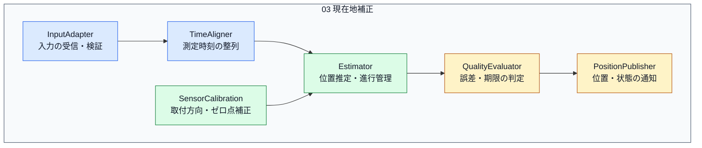
```mermaid
flowchart LR
    subgraph PositionCorrection["03 現在地補正"]
        direction LR
        I["InputAdapter<br/>入力の受信・検証"] --> T["TimeAligner<br/>測定時刻の整列"]
        T --> E["Estimator<br/>位置推定・進行管理"]
        C["SensorCalibration<br/>取付方向・ゼロ点補正"] --> E
        E --> Q["QualityEvaluator<br/>誤差・期限の判定"]
        Q --> P["PositionPublisher<br/>位置・状態の通知"]
    end
    style PositionCorrection fill:#F8FAFC,stroke:#475569,color:#111827;
    classDef input fill:#DBEAFE,stroke:#2563EB,color:#111827;
    classDef estimate fill:#DCFCE7,stroke:#15803D,color:#111827;
    classDef quality fill:#FEF3C7,stroke:#B45309,color:#111827;
    class I,T input;
    class C,E estimate;
    class Q,P quality;
```

| 接続 | 渡す内容 |
| --- | --- |
| InputAdapter → TimeAligner | 元の測定を識別できる、単位と形式を揃えた観測値 |
| TimeAligner → Estimator | 測定時刻順の観測、時間差、不足入力、方向情報 |
| SensorCalibration → Estimator | 車体座標に直したIMU値、校正値とその有効性 |
| Estimator → QualityEvaluator | 推定状態、誤差、基準GPSの年齢、入力の有効性 |
| QualityEvaluator → PositionPublisher | 配信許可、推定方法、有効期限、無効理由 |

矢印はデータの受渡しを示す。呼出し順序はEstimator内のprocess_cycleが管理し、QualityEvaluatorの判定を確認してからPositionPublisherを呼ぶ。外部ソフトとの接続は[4章](#dd-4)に示す。

<a id="dd-feature-flows"></a>

### 3.2 機能別処理フローチャート

四角は処理、ひし形は条件判定、丸みのある枠は開始・終了を表す。枠内には担当モジュールを記載する。各図は機能単位の流れであり、個々の関数の詳細は[3.7](#dd-functions-flow)に示す。

<a id="dd-feature-f01"></a>

#### 3.2.1 入力の受信・検証（POS-F01）

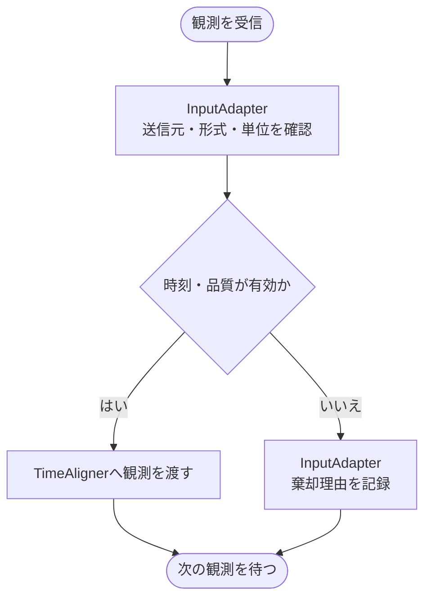
```mermaid
flowchart TB
 A(["観測を受信"]) --> B["InputAdapter<br/>送信元・形式・単位を確認"]
 B --> C{"時刻・品質が有効か"}
 C -->|"はい"| D["TimeAlignerへ観測を渡す"]
 C -->|"いいえ"| E["InputAdapter<br/>棄却理由を記録"]
 D --> Z(["次の観測を待つ"])
 E --> Z
```

gpsdの欠落フィールドや車速の未対応を0に置き換えない。gpsdの同じ測定時刻に属する分割通知は、別の新規測定として数えない。

<a id="dd-feature-f02"></a>

#### 3.2.2 測定時刻の整列（POS-F02）

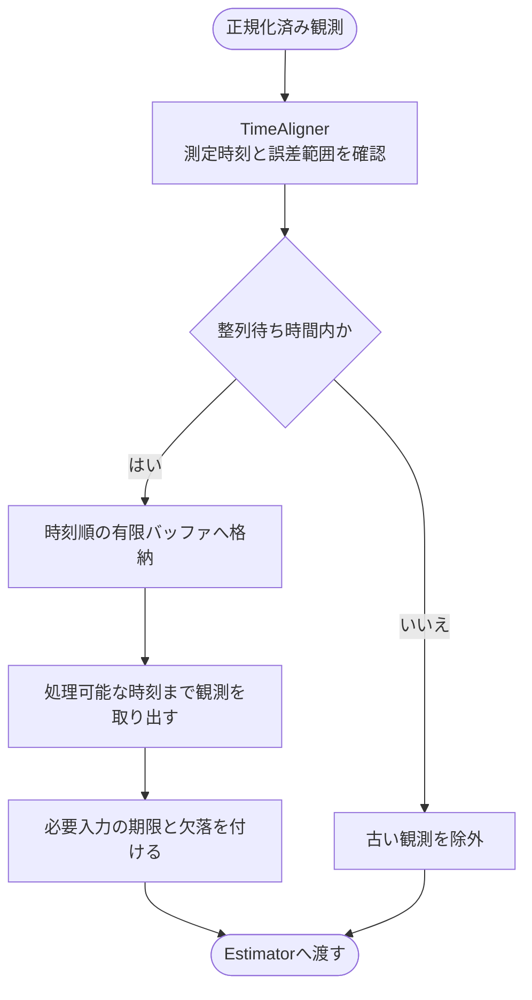
```mermaid
flowchart TB
 A(["正規化済み観測"]) --> B["TimeAligner<br/>測定時刻と誤差範囲を確認"]
 B --> C{"整列待ち時間内か"}
 C -->|"はい"| D["時刻順の有限バッファへ格納"]
 C -->|"いいえ"| X["古い観測を除外"]
 D --> E["処理可能な時刻まで観測を取り出す"]
 E --> F["必要入力の期限と欠落を付ける"]
 F --> Z(["Estimatorへ渡す"])
 X --> Z
```

測定済みの時刻より前に届いた位置を、現在時刻の位置として更新しない。整列待ち時間を過ぎた遅着観測は、初期実装では履歴を巻き戻さず棄却する。

<a id="dd-feature-f03"></a>

#### 3.2.3 校正と推定準備（POS-F03）

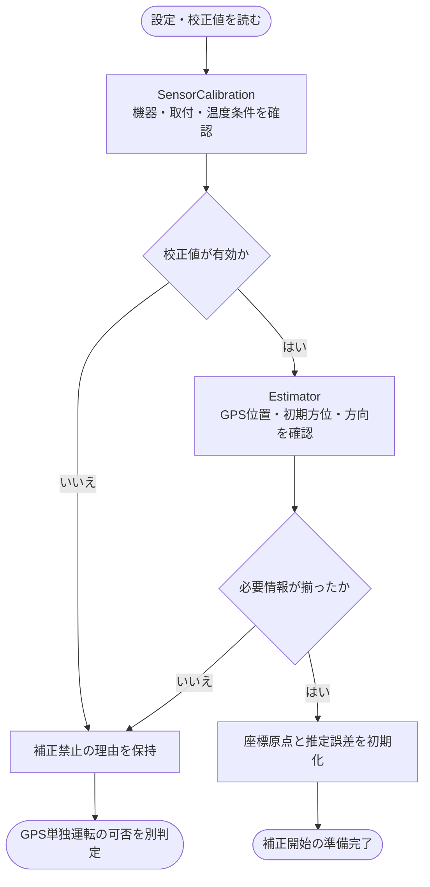
```mermaid
flowchart TB
 A(["設定・校正値を読む"]) --> B["SensorCalibration<br/>機器・取付・温度条件を確認"]
 B --> C{"校正値が有効か"}
 C -->|"いいえ"| X["補正禁止の理由を保持"]
 C -->|"はい"| D["Estimator<br/>GPS位置・初期方位・方向を確認"]
 D --> E{"必要情報が揃ったか"}
 E -->|"はい"| F["座標原点と推定誤差を初期化"]
 E -->|"いいえ"| X
 X --> Z(["GPS単独運転の可否を別判定"])
 F --> Y(["補正開始の準備完了"])
```

静止したGPSの進路を車体の向きとみなさない。IMU校正が完了しても、絶対方位が確定するまでは推測航法を許可しない。

<a id="dd-feature-f04"></a>

#### 3.2.4 GPS位置の採用（POS-F04）

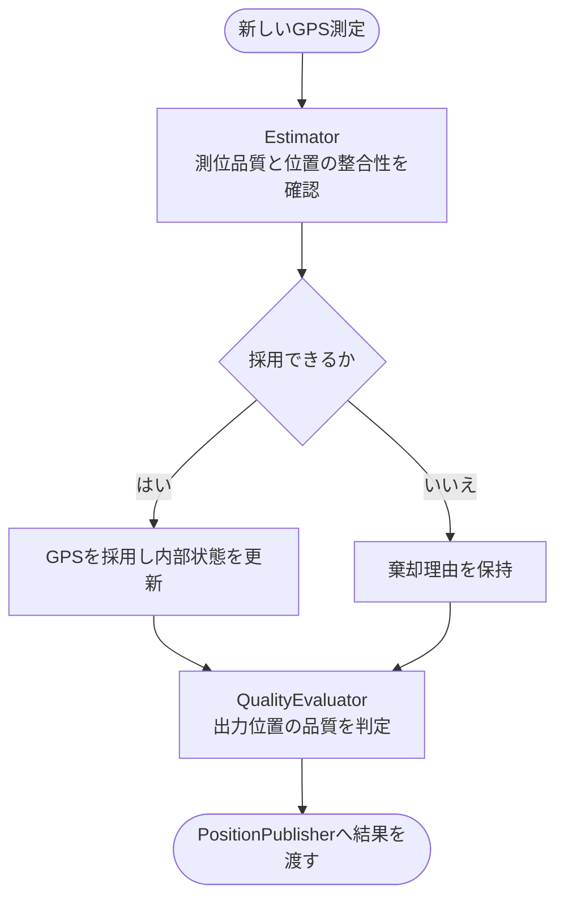
```mermaid
flowchart TB
 A(["新しいGPS測定"]) --> B["Estimator<br/>測位品質と位置の整合性を確認"]
 B --> C{"採用できるか"}
 C -->|"はい"| D["GPSを採用し内部状態を更新"]
 C -->|"いいえ"| E["棄却理由を保持"]
 D --> Q["QualityEvaluator<br/>出力位置の品質を判定"]
 E --> Q
 Q --> Z(["PositionPublisherへ結果を渡す"])
```

通常時の出力は検証済みGPSの実測位置とし、補正用フィルタは内部で追従させる。GPSがない周期に古い実測座標を新しいGPS位置として発行しない。

<a id="dd-feature-f05"></a>

#### 3.2.5 GPS喪失中の位置推定（POS-F05）

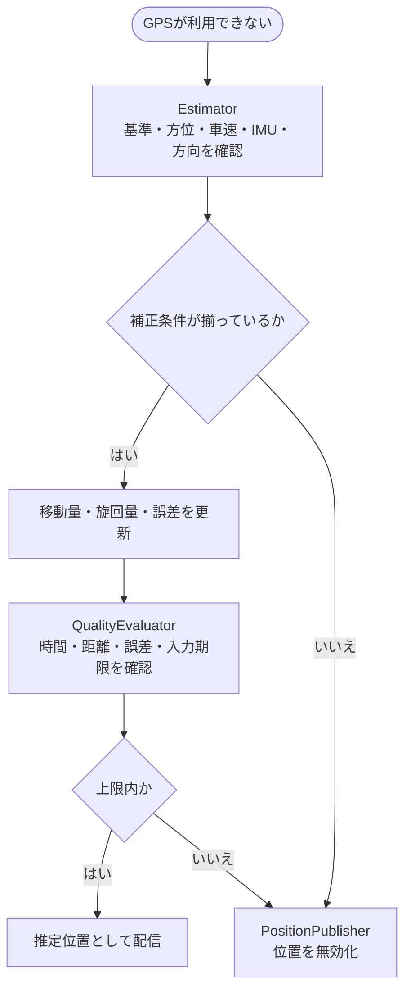
```mermaid
flowchart TB
 A(["GPSが利用できない"]) --> B["Estimator<br/>基準・方位・車速・IMU・方向を確認"]
 B --> C{"補正条件が揃っているか"}
 C -->|"はい"| D["移動量・旋回量・誤差を更新"]
 C -->|"いいえ"| X["PositionPublisher<br/>位置を無効化"]
 D --> E["QualityEvaluator<br/>時間・距離・誤差・入力期限を確認"]
 E --> F{"上限内か"}
 F -->|"はい"| Y["推定位置として配信"]
 F -->|"いいえ"| X
```

基準GPSを失ってからの経過時間は、停止中やGPS復帰確認中にも継続して数える。推測航法[注1](#note-dr)で得た位置を新しいGPS基準にしない。

<a id="dd-feature-f06"></a>

#### 3.2.6 GPS復帰の確認（POS-F06）

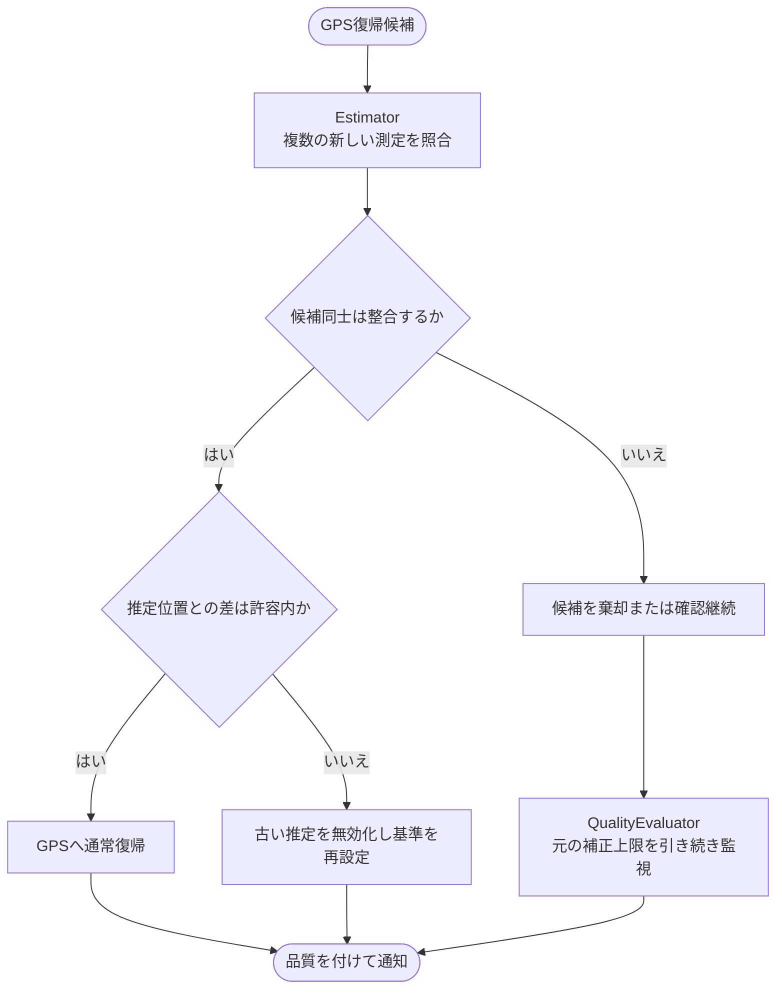
```mermaid
flowchart TB
 A(["GPS復帰候補"]) --> B["Estimator<br/>複数の新しい測定を照合"]
 B --> C{"候補同士は整合するか"}
 C -->|"いいえ"| X["候補を棄却または確認継続"]
 C -->|"はい"| D{"推定位置との差は許容内か"}
 D -->|"はい"| E["GPSへ通常復帰"]
 D -->|"いいえ"| F["古い推定を無効化し基準を再設定"]
 X --> Q["QualityEvaluator<br/>元の補正上限を引き続き監視"]
 E --> Z(["品質を付けて通知"])
 F --> Z
 Q --> Z
```

推定が大きくずれた場合も、正しいGPSを永久に棄却しない。再設定の確認条件は通常の外れ値判定と分ける。大きな位置差を補間で隠して正常復帰扱いにしない。

<a id="dd-feature-f07"></a>

#### 3.2.7 位置・品質・無効状態の通知（POS-F07）

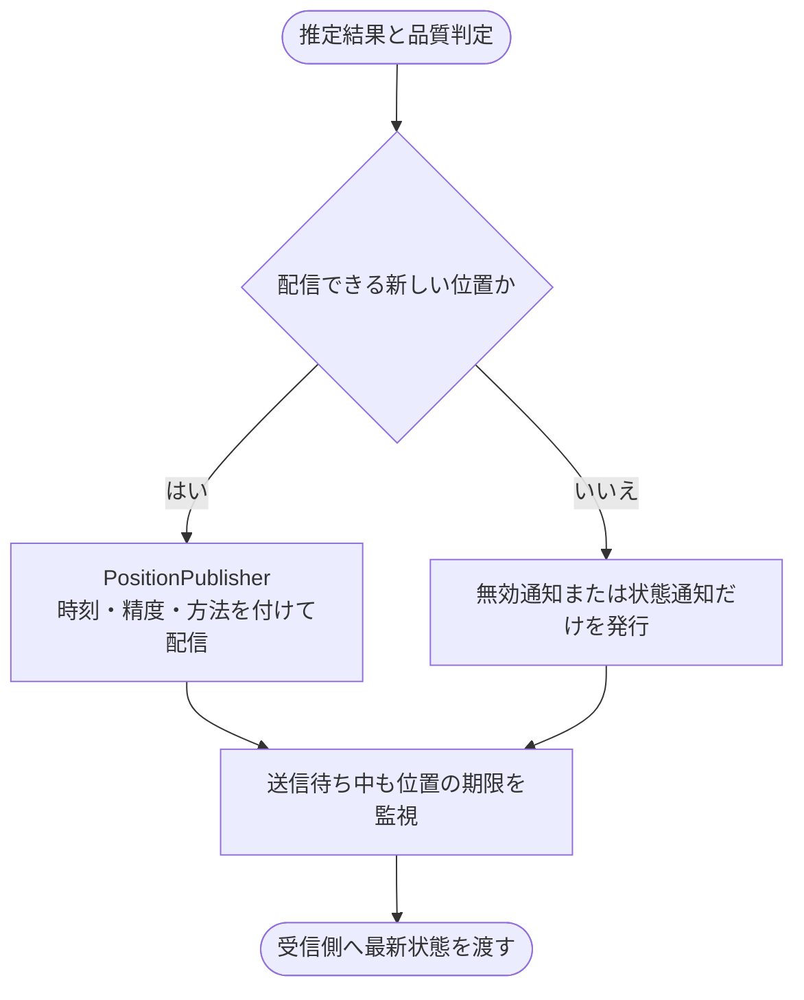
```mermaid
flowchart TB
 A(["推定結果と品質判定"]) --> B{"配信できる新しい位置か"}
 B -->|"はい"| C["PositionPublisher<br/>時刻・精度・方法を付けて配信"]
 B -->|"いいえ"| D["無効通知または状態通知だけを発行"]
 C --> E["送信待ち中も位置の期限を監視"]
 D --> E
 E --> Z(["受信側へ最新状態を渡す"])
```

無効化後に、キューに残った古いposition.updateを送らない。通信が切れている場合も、受信側の独立した期限監視で古い位置が失効する契約とする。

<a id="dd-feature-f08"></a>

#### 3.2.8 起動・終了・再接続（POS-F08）

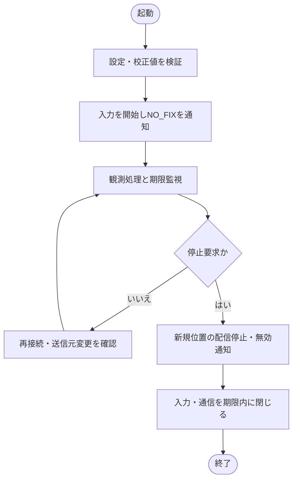
```mermaid
flowchart TB
 A(["起動"]) --> B["設定・校正値を検証"]
 B --> C["入力を開始しNO_FIXを通知"]
 C --> D["観測処理と期限監視"]
 D --> E{"停止要求か"}
 E -->|"いいえ"| F["再接続・送信元変更を確認"]
 F --> D
 E -->|"はい"| G["新規位置の配信停止・無効通知"]
 G --> H["入力・通信を期限内に閉じる"]
 H --> Z(["終了"])
```

前回の推定状態から自動的に航法を再開しない。GPS・IMU・車速・リバースの各送信元が再起動した場合は、その入力に依存する履歴を失効させる。

<a id="dd-module-tree"></a>

### 3.3 モジュールツリー

```text
position_correction_service
+-- InputAdapter
|   +-- GpsdInput             GPS測定の受信
|   +-- VehicleSpeedInput     09 OBD2車両情報取得から車速を受信
|   +-- ImuInput              選定したドライバからIMUを受信
|   +-- ReverseInput          15 サブコントローラ1後方系から受信
+-- TimeAligner
|   +-- ClockMapper           測定時刻をPi 5の時間軸へ対応付け
|   +-- ObservationBuffer     時刻順の有限バッファ
+-- SensorCalibration
|   +-- CalibrationStore      校正値のバージョン・機器・条件を検証
|   +-- AxisConverter         センサー座標から車体座標へ変換
+-- Estimator
|   +-- FilterEngine          既存フィルタと車両モデルを接続
|   +-- LocalFrame            WGS84と局所ENUの座標変換
|   +-- MotionResolver        前進・後退・停止・不明を判定
|   +-- RecoveryTracker       GPS復帰候補を管理
+-- QualityEvaluator
|   +-- FreshnessCheck        各入力の期限と測定間隔を確認
|   +-- ErrorBudget           統計的誤差とモデル誤差を管理
+-- PositionPublisher
    +-- EstimateBuilder       外部向けの位置情報を作成
    +-- LatestStateTransport   最新位置と無効状態を配信
```

下位の名前は各主要モジュール内の担当を示す。取得ドライバや通信方式が変わっても、Estimatorへ渡す観測形式は変えない。

<a id="dd-sequence"></a>

### 3.4 モジュール間の処理順序

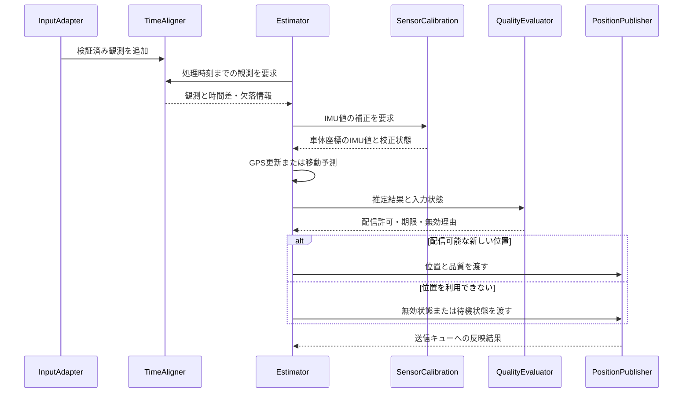
```mermaid
sequenceDiagram
    participant I as InputAdapter
    participant T as TimeAligner
    participant E as Estimator
    participant C as SensorCalibration
    participant Q as QualityEvaluator
    participant P as PositionPublisher
    I->>T: 検証済み観測を追加
    E->>T: 処理時刻までの観測を要求
    T-->>E: 観測と時間差・欠落情報
    E->>C: IMU値の補正を要求
    C-->>E: 車体座標のIMU値と校正状態
    E->>E: GPS更新または移動予測
    E->>Q: 推定結果と入力状態
    Q-->>E: 配信許可・期限・無効理由
    alt 配信可能な新しい位置
        E->>P: 位置と品質を渡す
    else 位置を利用できない
        E->>P: 無効状態または待機状態を渡す
    end
    P-->>E: 送信キューへの反映結果
```

ネットワーク送信完了を待って推定周期を遅らせない。配信受付、04 Linux位置情報連携への到達、Androidへの登録は別の状態として扱う。

<a id="dd-modules"></a>

### 3.5 モジュール詳細

各モジュールは次の情報だけを保持する。位置と共分散を書き換える権限はEstimatorに限定する。

<a id="dd-module-1"></a>

#### 3.5.1 InputAdapter（入力の受信・検証）

| 項目 | 内容 |
| --- | --- |
| 入力 | GPS・車速・IMU・リバースの生データ |
| 出力 | NormalizedObservation、入力状態 |
| 保持状態 | 送信元ごとの接続世代、最終連番、GPS測定識別子 |
| 主な関数 | normalize_observation、handle_source_reset |
| 設計規則 | 有限値、単位、必須フィールド、送信元を検証する。補正済み位置を受け付けない。入力不正は当該入力の異常として通知し、他の受信を停止しない。 |

<a id="dd-module-2"></a>

#### 3.5.2 TimeAligner（測定時刻の整列）

| 項目 | 内容 |
| --- | --- |
| 入力 | 正規化済み観測とPi 5受信時刻 |
| 出力 | 時刻順観測列、処理時刻、欠落と時刻誤差 |
| 保持状態 | 入力別有限バッファ、最終処理時刻、時計対応の世代 |
| 主な関数 | align_observations |
| 設計規則 | 異なる機器の単調時計を直接比較しない。1つの観測を複数回更新に使わず、保持した車速を使う場合も元の期限を残す。 |

<a id="dd-module-3"></a>

#### 3.5.3 SensorCalibration（取付方向・ゼロ点の補正）

| 項目 | 内容 |
| --- | --- |
| 入力 | 生IMU、校正ファイル、静止確認結果 |
| 出力 | 車体座標IMU、校正状態、バイアスの不確かさ |
| 保持状態 | 取付行列、機器ID、校正データのバージョン、温度範囲、静止区間統計 |
| 主な関数 | load_calibration、calibrate_stationary |
| 設計規則 | 取付変更・機器交換・範囲外温度で校正を失効する。GPS速度やOBD2車速の0だけで静止校正を開始しない。 |

<a id="dd-module-4"></a>

#### 3.5.4 Estimator（推定処理・進行管理）

| 項目 | 内容 |
| --- | --- |
| 入力 | 整列済み観測、校正値、設定、期限通知 |
| 出力 | 推定候補、推定方法、基準時刻、復帰結果 |
| 保持状態 | ENU原点、状態ベクトル、共分散、GPS基準、積算距離、方向状態 |
| 主な関数 | initialize_estimate、process_cycle、determine_motion、predict_motion、update_with_gps、handle_gps_recovery |
| 設計規則 | 1本の処理経路で更新する。LibraryAdapterに既存フィルタを包み、UI・Android APIを内部計算へ混ぜない。 |

<a id="dd-module-5"></a>

#### 3.5.5 QualityEvaluator（品質と継続可否の判定）

| 項目 | 内容 |
| --- | --- |
| 入力 | 推定候補、共分散、入力期限、補正経過時間 |
| 出力 | publishable、validity、理由、精度、有効期限 |
| 保持状態 | 入力ごとの失効状態、誤差評価パラメータ |
| 主な関数 | evaluate_quality |
| 設計規則 | 統計的な共分散だけで正常としない。方位初期化、モデル適用範囲、時間・距離上限も独立して判定する。 |

<a id="dd-module-6"></a>

#### 3.5.6 PositionPublisher（位置・状態の通知）

| 項目 | 内容 |
| --- | --- |
| 入力 | 品質判定済みの推定候補、無効・停止イベント |
| 出力 | position.update、position.invalidate、position.status |
| 保持状態 | 配信世代、連番、最新状態1件、最後に送った推定識別子 |
| 主な関数 | build_position、publish_position、invalidate_position、stop_service |
| 設計規則 | 無効化と最新値の置換を同じ排他処理で行う。再送で観測時刻・有効期間を更新しない。位置本文を通常ログへ保存しない。 |

<a id="dd-files"></a>

### 3.6 ファイル構成

現在の初期実装で使用するファイル構成は次のとおりである。04 Linux位置情報連携と05 Android位置情報連携は別ソフトのため、本実装には含めない。

```text
src/raspberry_pi5/
+-- position_correction_service.py   起動・終了、JSON入力受付、位置配信
+-- positioning/
|   +-- models.py                   観測・推定・品質・理由の型
|   +-- config.py                   TOML設定の検証
|   +-- inputs.py                   InputAdapter、gpsd入力
|   +-- time_aligner.py             TimeAligner
|   +-- calibration.py              SensorCalibration
|   +-- estimator.py                GPS採用と推定処理
|   +-- coordinates.py              LocalFrameと方位変換
|   +-- quality.py                  QualityEvaluator
|   +-- publisher.py                PositionPublisher
+-- config/positioning.example.toml 秘密値を含まない設定例

tests/positioning/
+-- test_inputs.py                  欠落・重複・単位・時刻
+-- test_coordinates.py             軸・方位・緯度経度変換
+-- test_estimator.py               直進・旋回・停止・後退
+-- test_recovery.py                GPS喪失・復帰・再初期化
+-- test_quality.py                 上限・数値異常・精度
+-- test_publisher.py               順序・失効・送信競合
+-- replay_scenarios.py             合成観測の時刻付き再生
```

| 用途 | 採用候補・方針 | 確認事項 |
| --- | --- | --- |
| 言語・データ型 | Python、標準dataclassとEnum | 採用Raspberry Pi OSのPythonのバージョンに合わせる |
| 数値計算 | Python標準のmathによる初期実装 | ARM64での処理時間、投影誤差、浮動小数点の検証 |
| 推定更新 | 初期実装は車速・角速度による平面運動モデル | 実車ログを取得した後、FilterPy等の導入効果と保守性を評価 |
| 座標変換 | 初期実装は小範囲の球面近似ENU | 長距離・標高・アンテナ位置を扱う場合はpyproj等を再評価 |
| GPS受信 | gpsdのJSON TPVを専用読取スレッドで受信 | 採用バージョンの通知分割と時刻精度 |
| IMU取得 | 選定機器の公式・保守可能なドライバ | 機器と取得APIはT.B.D |

FilterPyは状態・誤差行列の設定が必要で、初期値のまま車両推定を行えるものではない。本設計では運動モデルの予測と観測更新を明示的に分け、角度差を専用処理で正規化する。[FilterPy公式仕様](https://filterpy.readthedocs.io/en/latest/kalman/ExtendedKalmanFilter.html)

LibraryAdapterはFilterPyの非線形状態予測用の拡張点を利用し、線形のF xを非線形の運動式の代用にしない。観測次元の変更で内部行列が不整合にならないよう、GPS位置2次元と車速・方位1次元の更新を薄い窓口で検証する。ライブラリ本体をコピーして独自保守しない。[FilterPy実装](https://filterpy.readthedocs.io/en/latest/_modules/filterpy/kalman/EKF.html)

<a id="dd-functions-flow"></a>

### 3.7 関数のフローチャート

関数名を見出しの主表記とし、括弧内に日本語の役割を示す。引数・戻り値は論理型であり、具体的なPythonの型定義はmodels.pyへ集約する。外部I/Oの例外は入力・配信の窓口で結果へ変換し、数値計算の異常はQUALITY_FAULTとして無効化する。

<a id="dd-fn-1"></a>

#### 3.7.1 load_config（設定を読み込む）

| 項目 | 内容 |
| --- | --- |
| 担当 | 起動処理 / config.py |
| 入力 | 設定例と機器別の採用設定 |
| 出力 | ConfigResult（共通設定、GPS設定、補正設定の可否と理由） |

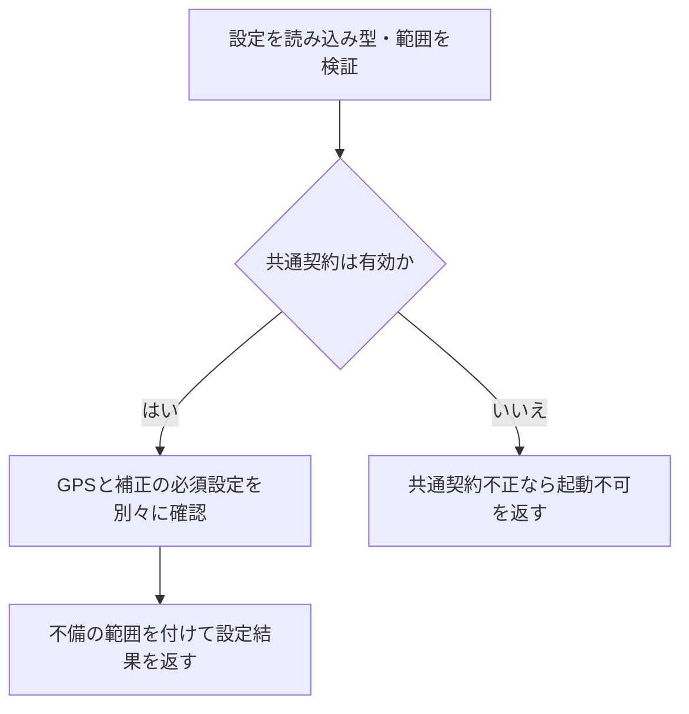
```mermaid
flowchart TB
    A["設定を読み込み型・範囲を検証"] --> B{"共通契約は有効か"}
    B -->|"はい"| C["GPSと補正の必須設定を別々に確認"]
    C --> D["不備の範囲を付けて設定結果を返す"]
    B -->|"いいえ"| X["共通契約不正なら起動不可を返す"]
```

共通契約不正ではソフトを起動しない。補正設定だけの不足ではdead_reckoning_enabled=falseとし、GPS品質・期限の設定が有効ならGPS単独で起動できる。

<a id="dd-fn-2"></a>

#### 3.7.2 normalize_observation（観測の形式と単位を揃える）

| 項目 | 内容 |
| --- | --- |
| 担当 | InputAdapter |
| 入力 | 生観測、許可送信元、Pi 5受信時刻 |
| 出力 | NormalizedObservationまたはRejectedObservation |

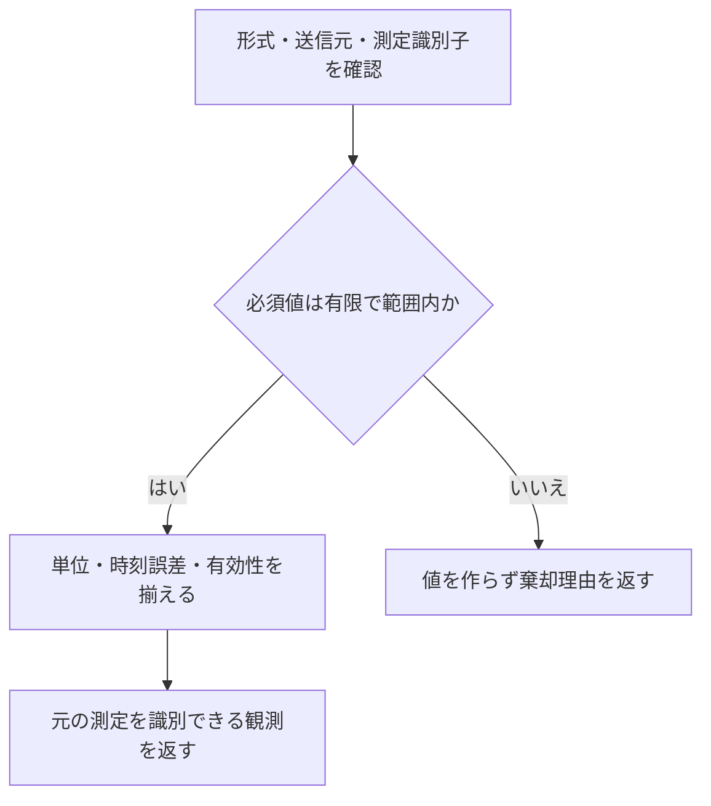
```mermaid
flowchart TB
    A["形式・送信元・測定識別子を確認"] --> B{"必須値は有限で範囲内か"}
    B -->|"はい"| C["単位・時刻誤差・有効性を揃える"]
    C --> D["元の測定を識別できる観測を返す"]
    B -->|"いいえ"| X["値を作らず棄却理由を返す"]
```

未提供の速度・方位はnullとする。GPSは受信機と測定時刻で重複判定し、分割通知の統合待ちに上限を設ける。同一epochを二重更新しない。

<a id="dd-fn-3"></a>

#### 3.7.3 align_observations（測定時刻を揃える）

| 項目 | 内容 |
| --- | --- |
| 担当 | TimeAligner |
| 入力 | 未処理観測、現在の単調時刻、最終処理時刻 |
| 出力 | 時刻順のFusionBatchと期限・欠落情報 |

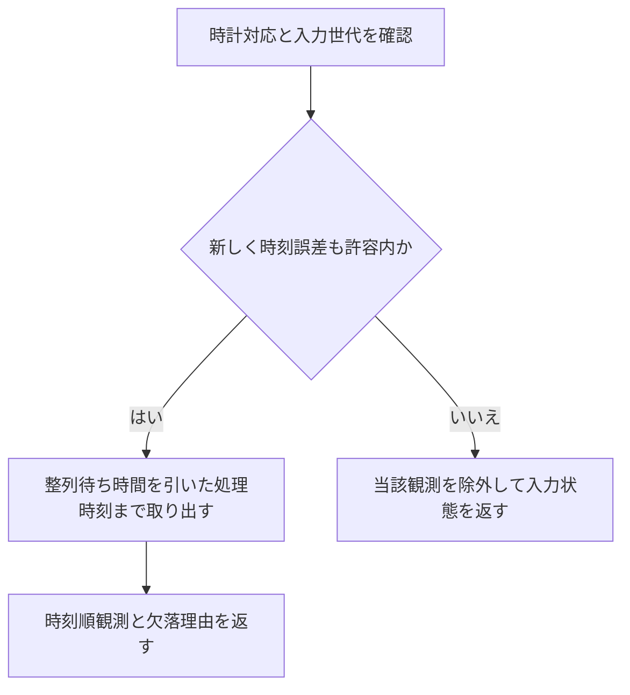
```mermaid
flowchart TB
    A["時計対応と入力世代を確認"] --> B{"新しく時刻誤差も許容内か"}
    B -->|"はい"| C["整列待ち時間を引いた処理時刻まで取り出す"]
    C --> D["時刻順観測と欠落理由を返す"]
    B -->|"いいえ"| X["当該観測を除外して入力状態を返す"]
```

既に処理した時刻より古い観測は現在の状態へ適用しない。同一時刻の異種観測は順序を固定し、同じ元観測を二重更新しない。バッファ上限超過で区間が欠けたら補正を無効化する。

<a id="dd-fn-4"></a>

#### 3.7.4 load_calibration（校正値を検証する）

| 項目 | 内容 |
| --- | --- |
| 担当 | SensorCalibration |
| 入力 | 校正ファイル、機器ID、取付設定のバージョン、温度条件 |
| 出力 | CalibrationResult |

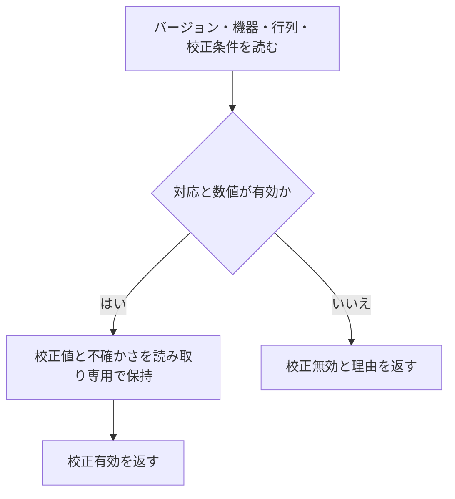
```mermaid
flowchart TB
    A["バージョン・機器・行列・校正条件を読む"] --> B{"対応と数値が有効か"}
    B -->|"はい"| C["校正値と不確かさを読み取り専用で保持"]
    C --> D["校正有効を返す"]
    B -->|"いいえ"| X["校正無効と理由を返す"]
```

取付行列は直交性と右手系を確認し、バイアス・分散は有限値を要求する。別機器の校正値を流用しない。

<a id="dd-fn-5"></a>

#### 3.7.5 calibrate_stationary（静止中のゼロ点を確認する）

| 項目 | 内容 |
| --- | --- |
| 担当 | SensorCalibration |
| 入力 | 期限付きの静止IMU区間、停止確認、温度 |
| 出力 | 校正候補または校正不可 |

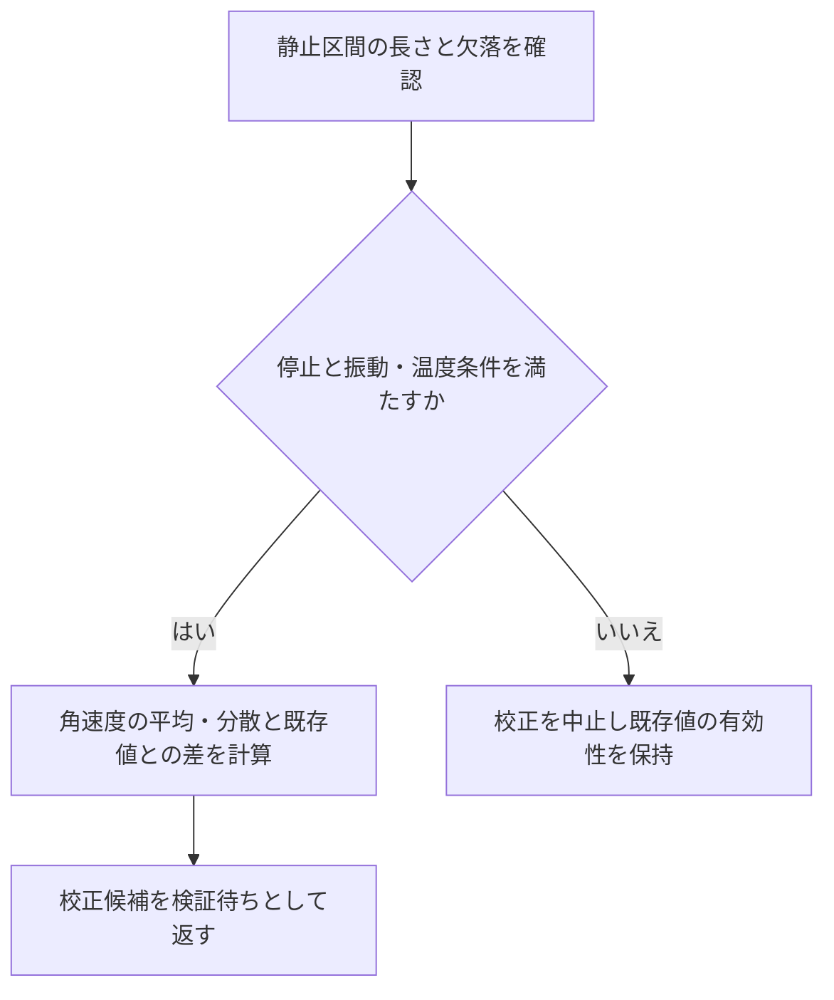
```mermaid
flowchart TB
    A["静止区間の長さと欠落を確認"] --> B{"停止と振動・温度条件を満たすか"}
    B -->|"はい"| C["角速度の平均・分散と既存値との差を計算"]
    C --> D["校正候補を検証待ちとして返す"]
    B -->|"いいえ"| X["校正を中止し既存値の有効性を保持"]
```

車速0だけでは条件成立としない。初期実装では停車・固定状態で明示的に実行し、候補を直ちに走行用設定へ上書きしない。絶対方位は静止ジャイロから得られない。

<a id="dd-fn-6"></a>

#### 3.7.6 initialize_estimate（推定の基準を準備する）

| 項目 | 内容 |
| --- | --- |
| 担当 | Estimator |
| 入力 | 検証済みGPS、初期方位、校正値、方向、誤差設定 |
| 出力 | 初期化済み推定状態またはGPS_ONLY |

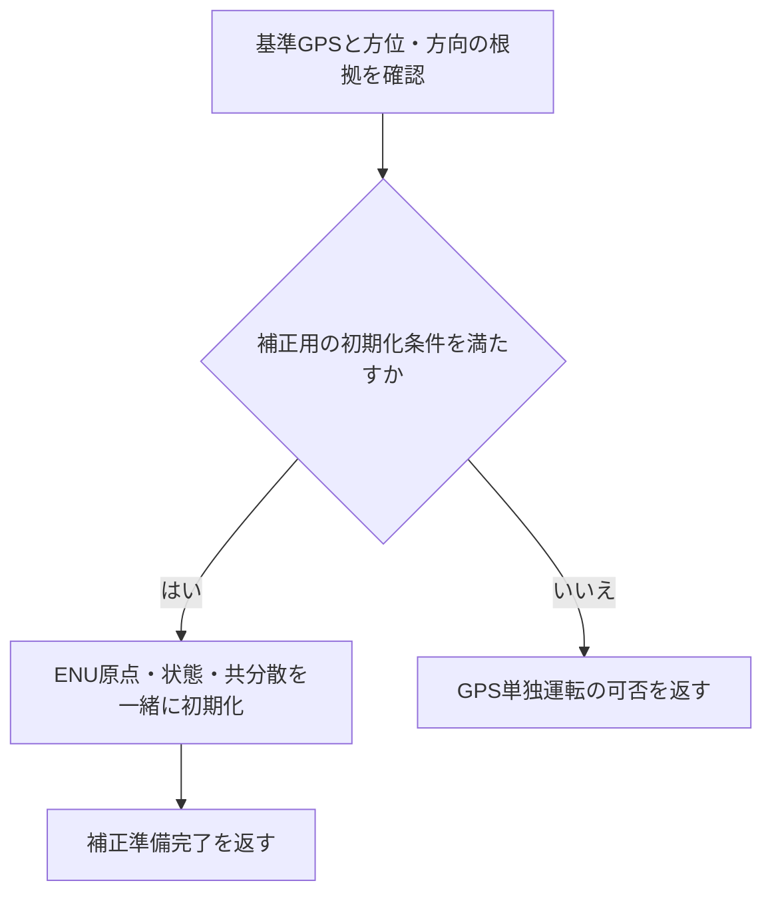
```mermaid
flowchart TB
    A["基準GPSと方位・方向の根拠を確認"] --> B{"補正用の初期化条件を満たすか"}
    B -->|"はい"| C["ENU原点・状態・共分散を一緒に初期化"]
    C --> D["補正準備完了を返す"]
    B -->|"いいえ"| X["GPS単独運転の可否を返す"]
```

前回位置・前回方位を現在の真値として復元しない。原点IDを更新し、GPS基準と補正経過時間の起点を同じ観測に揃える。

<a id="dd-fn-7"></a>

#### 3.7.7 process_cycle（観測と期限に応じて処理を進める）

| 項目 | 内容 |
| --- | --- |
| 担当 | Estimator |
| 入力 | FusionBatch、停止・期限イベント、内部状態 |
| 出力 | 位置候補と品質判定結果 |

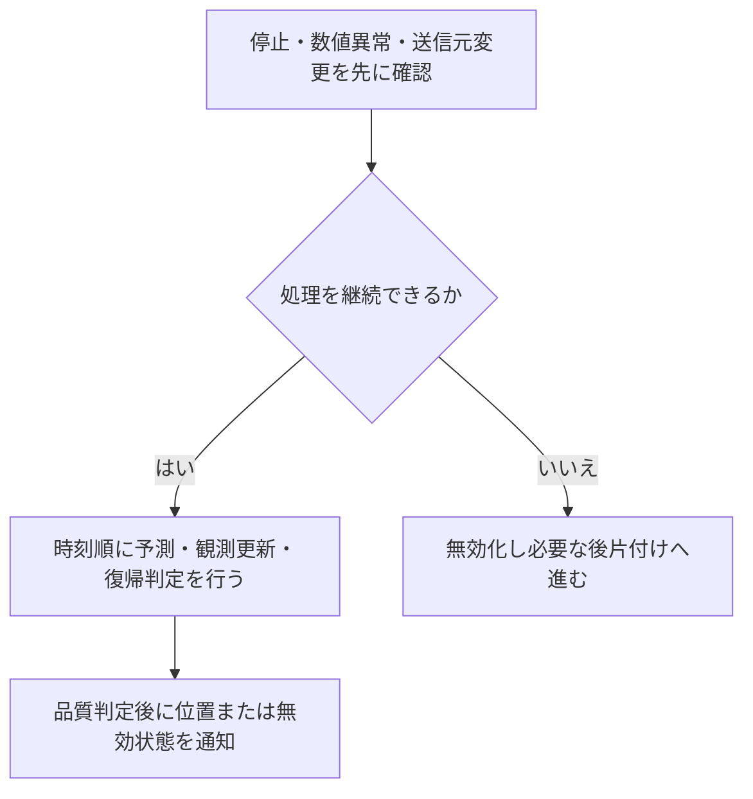
```mermaid
flowchart TB
    A["停止・数値異常・送信元変更を先に確認"] --> B{"処理を継続できるか"}
    B -->|"はい"| C["時刻順に予測・観測更新・復帰判定を行う"]
    C --> D["品質判定後に位置または無効状態を通知"]
    B -->|"いいえ"| X["無効化し必要な後片付けへ進む"]
```

GPS採用時はupdate_with_gps、喪失時はdetermine_motionとpredict_motionを使う。処理回数に上限を設け、入力がなくても期限判定を実行する。

<a id="dd-fn-8"></a>

#### 3.7.8 determine_motion（移動方向と停止状態を判定する）

| 項目 | 内容 |
| --- | --- |
| 担当 | Estimator |
| 入力 | 新しい車速、リバース、直前の方向、IMU、運用条件 |
| 出力 | MotionState（FORWARD / REVERSE / STOPPED / UNKNOWN） |

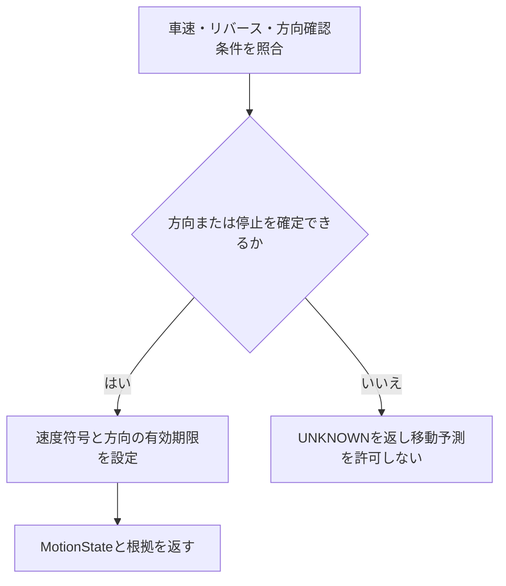
```mermaid
flowchart TB
    A["車速・リバース・方向確認条件を照合"] --> B{"方向または停止を確定できるか"}
    B -->|"はい"| C["速度符号と方向の有効期限を設定"]
    C --> D["MotionStateと根拠を返す"]
    B -->|"いいえ"| X["UNKNOWNを返し移動予測を許可しない"]
```

リバースOFFだけで前進確定としない。切替中はUNKNOWNとする。後退未検証の構成ではREVERSEを検出しても推測航法は許可しない。

<a id="dd-fn-9"></a>

#### 3.7.9 predict_motion（移動量と旋回量を予測する）

| 項目 | 内容 |
| --- | --- |
| 担当 | Estimator |
| 入力 | 前状態、区間IMU、符号付き車速、dt、校正値 |
| 出力 | 予測状態、共分散、積算距離 |

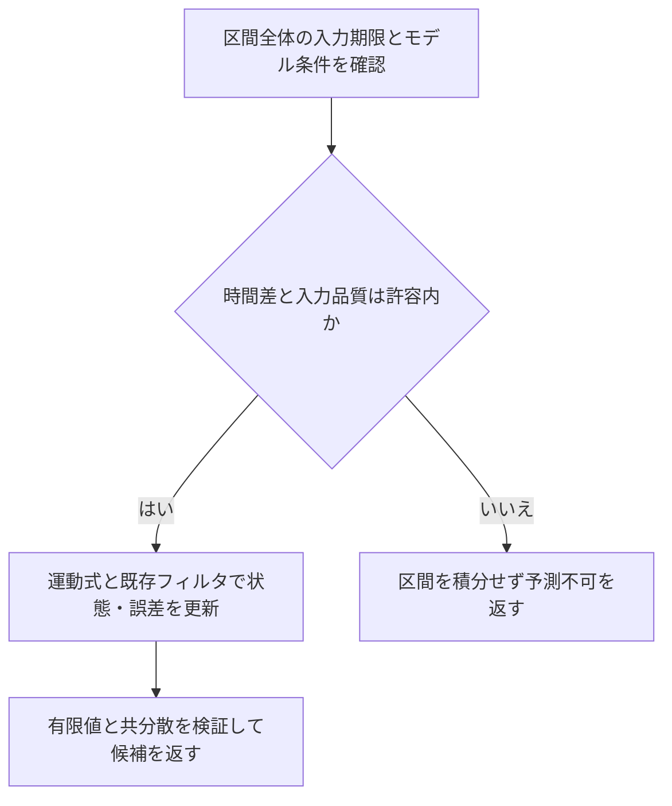
```mermaid
flowchart TB
    A["区間全体の入力期限とモデル条件を確認"] --> B{"時間差と入力品質は許容内か"}
    B -->|"はい"| C["運動式と既存フィルタで状態・誤差を更新"]
    C --> D["有限値と共分散を検証して候補を返す"]
    B -->|"いいえ"| X["区間を積分せず予測不可を返す"]
```

dtが大きい欠落区間を、古いIMU値を使って小分けに積分しない。車速観測の更新はその観測につき一度だけで、予測ごとに同じ車速を再学習しない。

<a id="dd-fn-10"></a>

#### 3.7.10 update_with_gps（GPS観測を採用する）

| 項目 | 内容 |
| --- | --- |
| 担当 | Estimator |
| 入力 | 新しいGpsObservation、同時刻の予測状態 |
| 出力 | GPS採否、内部更新結果、GPS出力候補 |

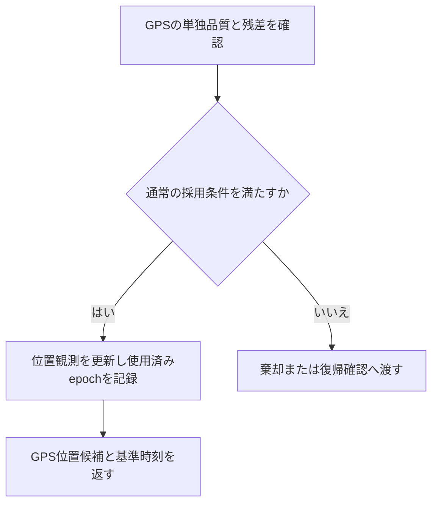
```mermaid
flowchart TB
    A["GPSの単独品質と残差を確認"] --> B{"通常の採用条件を満たすか"}
    B -->|"はい"| C["位置観測を更新し使用済みepochを記録"]
    C --> D["GPS位置候補と基準時刻を返す"]
    B -->|"いいえ"| X["棄却または復帰確認へ渡す"]
```

初回・大きなずれ・INVALIDからの復帰はhandle_gps_recoveryの独立確認を使う。GPS進路で方位を更新する場合は低速・方向不明を除外する。

<a id="dd-fn-11"></a>

#### 3.7.11 handle_gps_recovery（GPS復帰を確認する）

| 項目 | 内容 |
| --- | --- |
| 担当 | Estimator |
| 入力 | 復帰候補列、元の補正状態、独立したGPS品質条件 |
| 出力 | 確認継続 / 通常復帰 / 再初期化 / 棄却 |

```mermaid
flowchart TB
    A["異なる測定時刻のGPS候補を集める"] --> B{"件数・時間幅・相互整合性を満たすか"}
    B -->|"はい"| C["推定との差に応じ通常更新か再初期化を選ぶ"]
    C --> D["採用後だけGPS基準を更新する"]
    B -->|"いいえ"| X["候補確認を続け元の補正上限を維持"]
```

大差の場合は旧位置を無効化し、位置の不連続を明示する。確定前にGPS基準時刻や補正時間をリセットしない。

<a id="dd-fn-12"></a>

#### 3.7.12 evaluate_quality（位置の品質と継続可否を判定する）

| 項目 | 内容 |
| --- | --- |
| 担当 | QualityEvaluator |
| 入力 | 位置候補、共分散、入力期限、モデル状態、経過時間・距離 |
| 出力 | QualityDecision（publishable、validity、精度、期限、理由） |

```mermaid
flowchart TB
    A["数値・方位・校正・入力の条件を確認"] --> B{"すべての上限内か"}
    B -->|"はい"| C["推定方法と残り有効期間を計算"]
    C --> D["配信許可と品質を返す"]
    B -->|"いいえ"| X["配信不許可と理由を返す"]
```

GPS単独と推測航法では必要入力を分ける。DEGRADEDの推定位置も、明示的な配信許可と未失効の期限がなければ送らない。

<a id="dd-fn-13"></a>

#### 3.7.13 build_position（外部向け位置データを作る）

| 項目 | 内容 |
| --- | --- |
| 担当 | PositionPublisher |
| 入力 | 配信許可済み候補、座標原点、品質、時刻対応 |
| 出力 | PositionEstimateまたは生成不可 |

```mermaid
flowchart TB
    A["緯度経度と移動方向を外部単位へ変換"] --> B{"座標・精度・時刻契約が成立するか"}
    B -->|"はい"| C["方法・年齢・期限・入力識別子を付ける"]
    C --> D["位置データを返す"]
    B -->|"いいえ"| X["位置を作らず無効理由を返す"]
```

GPS単独では実測GPSの観測時刻を使う。推定位置では演算対象時刻を使い、最後のGPS測定の年齢は別フィールドへ保持する。方位不明はnull。

<a id="dd-fn-14"></a>

#### 3.7.14 publish_position（最新の有効位置を配信する）

| 項目 | 内容 |
| --- | --- |
| 担当 | PositionPublisher |
| 入力 | PositionEstimate、最新配信状態 |
| 出力 | 受付・送信状態と理由 |

```mermaid
flowchart TB
    A["期限・推定識別子・停止状態を再確認"] --> B{"送信してよい最新値か"}
    B -->|"はい"| C["配信連番を採番して最新状態を置き換える"]
    C --> D["非同期送信へ渡し受付結果を返す"]
    B -->|"いいえ"| X["送信せず失効または重複として返す"]
```

上書き型キューは1件とし、送信直前にも期限を確認する。同じ推定の再送は同じ連番を使い、状態通知だけで位置の年齢を若返らせない。

<a id="dd-fn-15"></a>

#### 3.7.15 invalidate_position（位置を無効化する）

| 項目 | 内容 |
| --- | --- |
| 担当 | PositionPublisher |
| 入力 | 無効理由、最後の位置連番、最新配信状態 |
| 出力 | 無効スナップショットと送信結果 |

```mermaid
flowchart TB
    A["送信状態の排他制御を取得"] --> B{"新しい無効通知が必要か"}
    B -->|"はい"| C["新しい連番で無効状態へ置き換える"]
    C --> D["古い位置を破棄し無効通知を送る"]
    B -->|"いいえ"| X["同じ無効状態を保持する"]
```

新しい有効位置が成立するまで、再接続時も最新状態は無効のままとする。無効通知が届かなくても下流の期限監視が働く必要がある。

<a id="dd-fn-16"></a>

#### 3.7.16 handle_source_reset（送信元変更を処理する）

| 項目 | 内容 |
| --- | --- |
| 担当 | InputAdapter / Estimator |
| 入力 | 送信元、旧・新世代、時計変化、推定状態 |
| 出力 | 入力失効、補正禁止または再初期化待ち |

```mermaid
flowchart TB
    A["変更した送信元のバッファと識別情報を破棄"] --> B{"推定の根拠に関わる変更か"}
    B -->|"はい"| C["依存する校正・方位・積分履歴を失効"]
    C --> D["新しい観測からの準備へ戻す"]
    B -->|"いいえ"| X["独立して有効な入力は維持する"]
```

入力側が変更イベントを発行し、Estimatorが直列に処理する。GPSが正常ならIMU再起動時もGPS単独運転は可能だが、古いIMU世代から補正を継続しない。

<a id="dd-fn-17"></a>

#### 3.7.17 stop_service（位置配信を止めて終了する）

| 項目 | 内容 |
| --- | --- |
| 担当 | 終了処理 / PositionPublisher |
| 入力 | 停止要求、停止猶予、各モジュール |
| 出力 | 停止結果と未完了理由 |

```mermaid
flowchart TB
    A["新規位置生成と入力受付を止める"] --> B{"通信先へ通知できるか"}
    B -->|"はい"| C["invalidate_positionを期限付きで実行"]
    C --> D["入力・通信を閉じ終了する"]
    B -->|"いいえ"| X["通知未達を記録して資源を閉じる"]
```

ACKを無期限に待たない。校正の正式採用以外で推定状態を永続化せず、次回起動では新しい基準測定を要求する。

<a id="dd-4"></a>

## 4. インターフェース設計

03 現在地補正は位置の採用元を1つに決める。09 OBD2車両情報取得が開いているUSBアダプタを重複して開かず、15 サブコントローラ1後方系が取得するリバース信号をPi 5のGPIOで取り直さない。

<a id="dd-interface-diagrams"></a>

### 4.1 外部ソフトとの接続図

**位置データの経路**

位置データは03 現在地補正から04 Linux位置情報連携・05 Android位置情報連携を通ってOsmAndへ届く。02 Waydroidナビ管理のモジュールは位置座標を配送・再計算しない。

```mermaid
flowchart TB
    G["GPS受信機 / gpsd"] --> P["03 現在地補正"]
    O["09 OBD2車両情報取得"] --> P
    I["IMU / 選定ドライバ"] --> P
    R["15 サブコントローラ1後方系"] --> P
    P --> L["04 Linux位置情報連携"]
    L --> A["05 Android位置情報連携"]
    A --> OS["Android位置情報"]
    OS --> N["OsmAnd"]
    classDef core fill:#DCFCE7,stroke:#15803D,color:#111827;
    classDef input fill:#DBEAFE,stroke:#2563EB,color:#111827;
    classDef external fill:#F3F4F6,stroke:#6B7280,color:#111827;
    class P core;
    class G,O,I,R input;
    class L,A,OS,N external;
```

| 接続 | 渡すもの |
| --- | --- |
| gpsd → 03 現在地補正 | 実測位置、速度・進路、品質、測定時刻 |
| 09 OBD2車両情報取得 → 03 現在地補正 | 車速、対応状態、取得時刻、有効性 |
| IMUドライバ → 03 現在地補正 | 角速度、加速度、温度、機器状態、測定時刻 |
| 15 サブコントローラ1後方系 → 03 現在地補正 | リバースON / OFF / UNKNOWN、入力品質、時刻 |
| 03 現在地補正 → 04 Linux位置情報連携 | position.update、position.invalidate、position.status |
| 04 Linux位置情報連携 → 05 Android位置情報連携 | 有効な位置、年齢・期限、無効通知 |
| 05 Android位置情報連携 → Android位置情報 → OsmAnd | Androidの位置登録とアプリによる利用 |

**Waydroidナビ管理のモジュールとの接続**

実線は開始・停止などの操作要求、両矢印は要求と結果の受渡し、破線は稼働・位置連携状態の通知を示す。位置データの経路は上の図に分け、以下の図では制御と状態通知だけを示す。

```mermaid
flowchart TB
    UI["01 カーナビUI"]
    subgraph Manager["02 Waydroidナビ管理"]
        S["NavigationSupervisor<br/>要求受付・状態集約<br/>開始停止の調整"]
        A["AppLauncher<br/>アプリの起動・終了確認"]
        S <--> A
    end
    L["04 Linux位置情報連携"]
    B["05 Android位置情報連携"]
    N["OsmAnd"]
    UI <--> S
    S --> L
    L -.-> S
    S --> B
    B -.-> S
    A <--> B
    A <--> N
    classDef supervisor fill:#DBEAFE,stroke:#2563EB,color:#111827;
    classDef adapter fill:#DCFCE7,stroke:#15803D,color:#111827;
    classDef external fill:#F3F4F6,stroke:#6B7280,color:#111827;
    class S supervisor;
    class A adapter;
    class UI,L,B,N external;
```

| 接続するモジュール・ソフト | 要求・通知の内容 |
| --- | --- |
| 01 カーナビUI → NavigationSupervisor | ナビの起動・表示・非表示・終了要求。表示操作を実行するモジュールは本図では省略 |
| NavigationSupervisor → 01 カーナビUI | navigation_status、location_status、処理結果。位置・補正品質の元の時刻と有効性を保持 |
| NavigationSupervisor → AppLauncher | 05 Android位置情報連携とOsmAndの起動・終了確認を依頼 |
| AppLauncher → NavigationSupervisor | アプリの導入・稼働・準備状態、起動・終了結果 |
| AppLauncher ↔ 05 Android位置情報連携 / OsmAnd | 登録済みアプリの起動・終了操作と実状態の確認 |
| NavigationSupervisor → 04 Linux位置情報連携 | ナビ用接続の開始、位置配送の停止・無効化を調整 |
| NavigationSupervisor → 05 Android位置情報連携 | ナビ用の位置受信・登録経路の準備、無効化・利用解放を調整。アプリの起動操作とは区別 |
| 04 Linux位置情報連携 → NavigationSupervisor | 03 現在地補正から受けた位置品質・有効性と、位置配送の状態 |
| 05 Android位置情報連携 → NavigationSupervisor | 位置の受信・登録状態、有効性、失効・拒否理由 |

NavigationSupervisor内のupdate_location_stateが位置連携状態を反映し、build_statusがUI向けの状態をまとめる。AppLauncher内のensure_app / stop_appはアプリの起動・終了を扱い、位置座標の登録処理は05 Android位置情報連携が担当する。

EnvironmentProbe、ContainerAdapter、SessionAdapter、WindowAdapterは環境確認・Waydroid起動・画面管理を担当するため、この位置連携図では省略する。全モジュールの構成は[02 Waydroidナビ管理の3.1](02_Waydroidナビ管理.md#dd-overview)、入出力の詳細は[同4章](02_Waydroidナビ管理.md#dd-4)を参照する。

開始・停止調整は実装予定の制御契約であり、04 Linux位置情報連携・05 Android位置情報連携側の受付方法・認証・応答を実装時に確定する。ナビを閉じるだけで03 現在地補正や共有中の位置連携ソフト全体を停止しない。

01 カーナビUIへの補正品質通知は、04 Linux位置情報連携・05 Android位置情報連携からNavigationSupervisorを通す経路を第一候補とする。03 現在地補正から直接通知を追加する場合は別契約として合意し、同じ状態の重複した更新元を作らない。

<a id="dd-inputs"></a>

### 4.2 入力観測の契約

| 観測型 | 必須となる内容 | 任意の内容・制約 |
| --- | --- | --- |
| GpsObservation | 受信機ID、測定epoch、mode、緯度・経度、時刻品質、採用可能な水平誤差モデル | speed、track、誤差推定、楕円体高。欠落値は独立して無効 |
| SpeedObservation | 車速m/s、対応状態、観測時刻、有効性 | 値は通常符号なし。符号の有無を型で明示 |
| ImuObservation | 機器ID、測定時刻、角速度rad/s、加速度m/s^2、飽和・欠落状態 | 温度、機器側の姿勢推定。姿勢の座標系・信頼性は別途検証 |
| ReverseObservation | ON / OFF / UNKNOWN、入力品質、元の測定時刻、送信世代・連番 | 配線断とOFFを必ず識別できるとは仮定しない |

gpsdのTPVは同じ測定epoch[注6](#note-epoch)で複数回届く場合があり、任意フィールドも省略される。必須フィールドが揃うまで有限時間だけまとめ、採用したepochは一度だけ観測更新する。測位modeが十分でも、時刻・座標・精度の検証は省略しない。[gpsd公式プロトコル](https://www.gpsd.io/gpsd_json.html)

GpsObservationの内部識別子は接続世代・device・測定epochから作る。GPS入力が過去の測定epochへ戻った場合は、UTC修正か受信機再起動かを判別するまで時刻対応を再確認する。接続を開き直しただけで同じ古い測定を新規扱いしない。

NormalizedObservationには、元識別子、受信時のPi 5単調時刻、推定した観測単調時刻、時刻誤差上限、元のage、有効期限、単位変換履歴を保持する。入力キャッシュの再送を新規測定として扱わない。

<a id="dd-outputs"></a>

### 4.3 出力メッセージの契約

[共通仕様](00_共通仕様.md)のヘッダを使用し、以下を本ソフト固有の値とする。実際の符号化とschema_versionは04 Linux位置情報連携と確定する。

| メッセージ | 内容 | 受信側の扱い |
| --- | --- | --- |
| position.update | PositionEstimate、方法、精度、年齢、有効期間 | 新しい未失効の位置だけを採用 |
| position.invalidate | 無効理由、最後の有効位置連番、新しいイベント連番 | 古い位置の登録を止める |
| position.status | 航法状態、入力状態、補正可否、時計・校正状態 | 位置の有効期限を更新せず状態表示へ使う |

| PositionEstimateの項目 | 型・単位 | 規則 |
| --- | --- | --- |
| latitude_deg / longitude_deg | 有限実数、WGS84 deg | 無効座標や0,0による代用を禁止 |
| horizontal_accuracy_m | 正の実数、m | 68%水平精度半径相当。定義と評価根拠を持つ |
| speed_mps / speed_valid | 非負実数またはnull / bool | 外部出力は移動速度の大きさ。符号は出力しない |
| bearing_deg / bearing_valid | [0,360) degまたはnull / bool | 真北0度・時計回りの移動方向。車体yawではない |
| method | GPS / DEAD_RECKONING | GPS復帰確認中の推定はDEAD_RECKONINGのまま |
| publishable / validity | bool / 共通仕様の列挙値 | GPSはVALID、許容範囲の推定はDEGRADEDを基本とする |
| observed_at_utc | UTCまたはnull | GPS測定時刻または推定対象時刻。送信時刻で上書きしない |
| age_ms_at_send / valid_for_ms | 非負整数、ms | 対象時刻からの年齢と有効期間。再送で延長しない |
| last_gps_age_ms | 非負整数またはnull | 最後に基準として採用したGPSからの年齢 |
| estimate_id / origin_id | 識別子 | 同じ推定の再送と原点再設定を区別する |
| discontinuity / reason | bool / 理由コード | 基準再設定による不連続を隠さない |
| input_refs | 入力識別子の集合 | 採用した入力世代・連番を追跡できる。生観測を全量送らない |

GPS単独時の位置はGPSアンテナ位置とする。補正時も同じ基準点へ変換して出力する。高度は本ソフトの必須出力とせず、水平推定から架空の高度を生成しない。

DEGRADEDは「無条件に登録可能」の意味ではない。publishable=true、期限内、必要精度内の推測航法だけを04 Linux位置情報連携が許可する。受信側がこの契約に未対応なら補正位置は配送しない。

Androidのaccuracyは68%水平精度半径、bearingは機器の向きではなく移動方向を表す。この意味に揃えて05 Android位置情報連携へ渡す。[Android Location公式仕様](https://developer.android.com/reference/android/location/Location)

<a id="dd-delivery"></a>

### 4.4 接続・順序・無効化

| 項目 | 設計規則 |
| --- | --- |
| 通信方式 | Pi 5内のIPCを基本候補とする。04 Linux位置情報連携への方式はT.B.D。任意の公開ポートを開かない |
| 発行元 | 03 現在地補正だけが採用位置を発行する |
| 連番 | update / invalidate / statusで共通の単調増加イベント連番を使い、位置識別子を別に保持する |
| 接続開始 | 許可相手・バージョンを確認し、最新状態1件を渡す。履歴の一括再生をしない |
| 配信待ち | 最新状態1件を保持。無効状態は古い有効位置を上書きする |
| 順序逆転 | 新しいinvalidateより古いupdateは、たとえ遅れて到達しても採用しない |
| 配信断 | 演算と出力配送の健全性を分ける。配送停止中も演算側で期限を判定する |
| 受信側停止 | 推定処理を止めず、キューの肥大化を防ぐ |
| 未達の無効通知 | 受信側が元位置の期限で失効する。無効通知の到達だけに依存しない |

UTCが不明でも内部では単調時刻と測定年齢を管理できる。ただしAndroid登録の時刻契約が未成立の間は、UTCを必要とする下流へ登録可能と通知しない。この場合はposition.statusで時刻不明を通知する。

<a id="dd-5"></a>

## 5. データ・設定設計

受信値、推定状態、配信値は別の型として扱う。推定結果で受信キャッシュを書き換えない。

<a id="dd-state-data"></a>

### 5.1 内部状態

| データ | 内容 | 所有するモジュール |
| --- | --- | --- |
| InputHealth | 入力別の状態・最終測定・期限・世代・棄却理由 | InputAdapter / TimeAligner |
| FusionBatch | 時刻順観測、処理時刻、最大時間差、入力欠落 | TimeAligner |
| CalibrationProfile | 機器ID、取付行列、バイアス、分散、温度、校正データのバージョン | SensorCalibration |
| FilterState | x、P、ENU原点、原点ID、推定時刻、初期化状態 | Estimator |
| NavigationState | NO_FIX等の状態、最後のGPS基準時刻、積算距離、GPS候補列 | Estimator |
| QualityDecision | 配信可否、精度、入力別の残り期限、無効理由 | QualityEvaluator |
| PublishedState | 最新の有効位置または無効状態、配信連番、送信状態 | PositionPublisher |

xは[e, n, psi, v, b]の5状態を第一候補とする。e/nは車体基準点の東・北位置m、psiは車体前方の向きrad、vは車体前方を正とする符号付き速度m/s、bは校正後に残る鉛直角速度のバイアスrad/sである。

Pは5×5の共分散行列[注5](#note-covariance)で、対角成分の単位はm^2、m^2、rad^2、(m/s)^2、(rad/s)^2になる。値だけでなく行列の対称性と半正定値性も確認する。未初期化方位を0radと仮定して推測航法へ入らない。

状態・共分散・推定時刻・入力参照はまとめて更新し、異なる時刻の値を混在させない。

<a id="dd-config"></a>

### 5.2 設定項目と初期運用

dead_reckoning_enabledは初期状態でfalseとする。以下の仮値は合成データの試験を開始するための例であり、コペンや特定IMUで確認された性能・推奨採用値ではない。実車では入力周期・遅延・誤差を測定したプロファイルを別途設定する。

| 設定項目 | シミュレーション例 | 未設定・不適合の場合 |
| --- | --- | --- |
| dead_reckoning_enabled | false | GPS単独運転 |
| fusion_rate_hz | 50 Hz | 補正禁止 |
| output_max_rate_hz | 5 Hz | 配信契約未確定として起動拒否 |
| reorder_delay_ms | 100 ms | 時刻整列条件未確定として補正禁止 |
| imu_max_age_ms | 200 ms | 補正禁止 |
| speed_max_age_ms | 500 ms | 補正禁止 |
| reverse_max_age_ms | 500 ms | 方向不明として補正禁止 |
| gps_max_age_ms | 2000 ms | GPS品質契約未確定として起動拒否 |
| max_prediction_gap_ms | 100 ms | 欠落区間の補正禁止 |
| max_clock_uncertainty_ms | 50 ms | 補正禁止 |
| dr_max_elapsed_s | 10 s | 補正禁止 |
| dr_max_distance_m | 200 m | 補正禁止 |
| dr_max_error_guard_m | 25 m | 補正禁止 |
| reacquire_min_samples | 3測定 | GPS復帰の自動確定を禁止 |
| reacquire_min_span_s | 2 s | 同じ瞬間の候補だけで復帰しない |
| output_max_valid_for_ms | 1000 ms | 配信契約未確定として起動拒否 |
| shutdown_timeout_s | 2 s | 終了期限未確定として起動拒否 |

| 機器別に確定する項目 | 用途・確認条件 |
| --- | --- |
| GPS精度モデル、gps_max_error_m、位置棄却条件 | 受信機の誤差出力の意味と実測誤差から決める。未設定なら座標を配信しない |
| GNSS進路を使う最低速度・最大旋回率 | 初期方位と車体yawの校正。低速・急旋回で進路を車体方向へ流用しない |
| 方向判定条件、後退許可、静止判定時間 | OBD2の分解能とリバース通知の品質を検証する |
| 取付行列、許容傾斜、温度範囲 | 平面モデルを使える姿勢・環境を限定する |
| Q、R、P初期値、GPS判定の残差上限 | 記録データから決定し、独立した試験データで確認 |
| 系統誤差の下限・増加率 | 車速尺度、タイミング、スリップ、IMUドリフトを誤差に反映 |
| GPSアンテナの取付距離 | 車体基準点と測位点のずれを補正 |
| ENU原点の有効半径 | 局所平面の近似誤差が上限内となる範囲 |
| 入力バッファ容量・処理上限 | 実測周期から決め、あふれや欠落を検知する |

整列待ち時間と最大出力年齢が矛盾しないか起動時に検証する。必要入力の期限が整列待ち時間・通信遅延・演算遅延以下なら、その設定で補正を有効化しない。更新周期を上げるだけで、1HzのGPS測定や遅いOBD2観測が新しくなるわけではない。

<a id="dd-storage"></a>

### 5.3 保存・ログ

| 保存対象 | 方針 |
| --- | --- |
| 校正値 | 機器ID・バージョン・取付・温度・取得条件とともに保存。検証後に一括置換 |
| 推定状態・共分散 | 揮発。停止前の推定から再開しない |
| 最終位置 | 通常は保存しない。保存する場合も参考表示専用で、再起動後の測位に使わない |
| 通常ログ | 状態遷移、理由、観測の年齢、棄却数、処理時間、校正データのバージョン。座標本文を含めない |
| 試験ログ | 明示的に有効化し、保持期間・容量・閲覧権限を制限 |
| 公開Git | 合成観測、設定例、試験コードだけ。実走行履歴・認証情報・個人の移動履歴は含めない |

実データを取得していない段階で「実車評価済み」の校正プロファイルを用意しない。

<a id="dd-6"></a>

## 6. 処理・状態遷移

GPSが利用できるか、センサー補正を開始できるか、生成した位置を配信できるかを別々に判定する。通信接続の状態だけで測位を正常扱いしない。

<a id="dd-state-machine"></a>

### 6.1 航法状態の遷移

```mermaid
stateDiagram-v2
    [*] --> NO_FIX
    NO_FIX --> GPS_TRACKING: GPS採用
    GPS_TRACKING --> DEAD_RECKONING: GPS不可・補正可能
    GPS_TRACKING --> INVALID: GPS不可・補正不可
    DEAD_RECKONING --> REACQUIRING: GPS復帰候補
    DEAD_RECKONING --> INVALID: 上限・入力不良
    INVALID --> REACQUIRING: GPS復帰候補
    REACQUIRING --> GPS_TRACKING: GPS復帰確定
    REACQUIRING --> DEAD_RECKONING: 候補棄却・補正可能
    REACQUIRING --> INVALID: 補正不可
    NO_FIX --> STOPPING: 停止
    GPS_TRACKING --> STOPPING: 停止
    DEAD_RECKONING --> STOPPING: 停止
    REACQUIRING --> STOPPING: 停止
    INVALID --> STOPPING: 停止
    STOPPING --> [*]
```

| 状態 | 位置出力 | 補足 |
| --- | --- | --- |
| NO_FIX | なし | 起動後に基準がない。前回位置を復元しない |
| GPS_TRACKING | 新しい有効GPSのみ、method=GPS | IMU未準備でもGPS単独運転は可能 |
| DEAD_RECKONING | 全条件内ならmethod=DEAD_RECKONING、validity=DEGRADED | 最後のGPS基準からの時間・距離・誤差を監視 |
| REACQUIRING | 元の補正条件が成立する間だけDEAD_RECKONING | 復帰候補だけでGPSとして発行しない。元がINVALIDなら位置出力なし |
| INVALID | なし、無効通知 | 補正条件が戻っただけでは再開しない。新しいGPS基準を要求 |
| STOPPING | なし、無効通知を試行 | 新規位置を作らず終了する |

短いGPS間欠でも基準からの経過時間は継続する。有効期限内の同じGPSを再通知してNO_FIXやINVALIDから抜けない。初回測位も機器別の連続品質確認後にGPS_TRACKINGへ移る。

<a id="dd-time"></a>

### 6.2 時刻の整列と有効期限

1. 入力ごとに元の観測時刻とPi 5での受信単調時刻を記録する。
2. 同じPi 5内でも時計の種類を確認する。別ホストの単調時刻は直接減算しない。
3. 受信年齢・通信遅延上限、または検証済みUTC同期から、Pi 5上の観測時刻と誤差範囲を求める。
4. 現在単調時刻からreorder_delay_msを引いた時刻まで、観測を時刻順に取り出す。
5. 観測時刻へ予測を進めてから観測更新を行う。遅着した過去の測定を現在時刻へ移して適用しない。
6. 周期処理の末尾で各入力と配信位置の期限を確認する。入力が来ない場合も監視する。

| 場面 | 処理 |
| --- | --- |
| 時刻の誤差が上限を超える | 補正に使わない。GPS単独の採用条件は別判定 |
| GPSのUTCが逆行する | 機器時刻とホスト時刻の対応を再検証し、基準と候補を失効 |
| ホストUTCの時刻合わせ | 単調時刻の積分は維持。UTC対応の不確かさを通知し、架空の測定時刻を付けない |
| GPSが同じepochを分割通知 | 1測定としてまとめ、既に更新したepochは再利用しない |
| 車速を次の観測まで保持 | 期限内の短時間保持だけ。元の車速を独立した新観測として繰り返し更新しない |
| IMU区間に欠落 | 最大許容間隔を超えた区間は補正を停止 |
| サスペンド・長時間停止後 | 時計差・欠落区間を検出しINVALID。古い速度で停止時間分を移動させない |

GPS位置の対象時刻は実測時刻、推定位置の対象時刻は実際に演算した時刻とする。配信時に現在時刻を付け直さない。

残り配信可能時間は、出力対象時刻からの残り期限と必要入力の残り期限、補正時間上限の残り時間の最小値から算出する。送信待ち時間・整列待ち時間も年齢に含める。誤差・距離は有効期間内での変化にも余裕を持たせ、余裕がなければ即時無効化する。下流は新しいstatusだけではこの期限を延ばさない。

リバースOFF等の値が一定でも、送信元で実際に再測定した新しいスナップショットなら新観測として受け付ける。古い測定の再送と混同しない。

<a id="dd-coordinates"></a>

### 6.3 座標系と方位

| 座標・方向 | 定義 |
| --- | --- |
| 外部位置 | WGS84緯度・経度deg。境界では項目名で区別 |
| 内部位置 | 局所ENU[注2](#note-enu)。eは東、nは北、上方向を正とする右手系 |
| 車体座標 | xは車体前方、yは左、zは上 |
| 内部yaw psi | 東向き0rad、上から見て反時計回りを正。角度差は[-pi, pi)へ正規化 |
| 外部bearing | 真北0deg、時計回りの移動方向 |
| IMU取付行列 | センサー座標を車体座標へ回転する行列。軸の入替えと符号を検証 |
| GPSアンテナ取付距離 l | 車体基準点からアンテナへの車体座標オフセット |

ENUへの変換はpyproj / PROJを用い、WGS84から地心直交座標を経て局所座標へ変換する。原点の緯度・経度・高さと楕円体を固定し、逆変換と経度・緯度の順を試験する。[PROJの局所座標変換](https://proj.org/en/stable/operations/conversions/topocentric.html)、[pyproj Transformer](https://pyproj4.github.io/pyproj/stable/api/transformer.html)

水平モデルで高さを固定する場合は投影上の仮定として記録し、測定高度として出力しない。GPSの平均海面高度と楕円体高を混ぜない。2D測位時の基準高と局所平面の有効半径は機器別プロファイルで確定し、誤差を評価できない範囲まで原点を延長しない。

旋回時には車体基準点とアンテナの移動が異なるため、GPS位置の観測式を次とする。

```text
R(psi) = [[cos(psi), -sin(psi)],
          [sin(psi),  cos(psi)]]

GPSアンテナ位置 = [e, n] + R(psi) * [l_x, l_y]
```

初期位置はGPS位置から取付距離を戻して求め、配信位置は同じ取付距離を加えてアンテナ位置に揃える。取付距離を無視できるかは誤差評価で決め、未測定の距離を既知の0mとしない。

取付距離が無視できる場合、前進時の移動方向はpsi、後退時はpsi+piを外部bearingへ変換する。取付距離を考慮する場合は、車体並進速度に旋回によるアンテナ速度を加え、その東・北速度からbearingを求める。停止・低速で信頼できる移動方向がない場合はbearing_valid=falseとする。

<a id="dd-calibration"></a>

### 6.4 センサー校正と初期方位

| 段階 | 処理 | 合格条件 |
| --- | --- | --- |
| 取付確認 | 軸方向、固定状態、アンテナ距離、機器IDを記録 | 取付行列と実際の左右旋回の符号が一致 |
| 静止校正 | 停車・固定状態で角速度の平均とばらつきを測定 | 必要時間、温度安定、振動・欠落条件内 |
| 残留バイアス | 静止校正後のずれを推定状態bとして扱う | 基準校正分とbを二重に引かない |
| 初期方位 | 有効GPS進路を、方向が既知の安定した移動区間で車体yawへ変換 | 最低速度、最大旋回率、方位誤差、方向条件を満たす |
| 経時確認 | 温度変化・機器再起動・取付変更を監視 | 許容範囲外なら補正停止・再校正待ち |

加速度は静止・振動・傾斜の補助判定に使い、単独積分で移動距離を補わない。OBD2車速の分解能以下の移動はあり得るため、車速0と加速度が小さいことだけで真の停止を証明できるとは扱わない。

初期モデルは検証した小さい傾斜範囲に限定する。傾斜車体のジャイロz成分を、無条件で水平面のyaw速度として用いない。必要な姿勢補正の方式を決め、未検証の坂道・傾斜・強い振動では補正を停止する。

磁気コンパスは初期実装では補正入力に含めない。車体金属・配線・電流による影響、磁北から真北への変換を検証できた場合に限り追加検討する。停車状態のIMUから絶対方位を得られるとは仮定しない。

<a id="dd-filter"></a>

### 6.5 移動予測と観測更新

既存の拡張カルマンフィルタ[注3](#note-ekf)を使い、運動モデルと観測モデルは本ソフト側で明示する。以下は平面モデルの設計式であり、実機性能を保証する式ではない。

```text
omega = 校正済み水平yaw角速度 - b
theta_mid = psi + omega * dt / 2

e_next   = e + v * cos(theta_mid) * dt
n_next   = n + v * sin(theta_mid) * dt
psi_next = wrap(psi + omega * dt)
v_next   = v
b_next   = b

P_next = F * P * F^T + Q(dt)
```

Fはこの運動式を状態xで微分した行列[注4](#note-jacobian)で、v・psi・bによる位置変化の項を含める。Qには角速度・速度変動・バイアス変動・モデル誤差を反映する。dtに応じて計算し、固定周期であると仮定しない。解析的な微分と数値差分を照合する。

| 更新対象 | 観測モデルと扱い |
| --- | --- |
| GPS位置 | 6.3のアンテナ位置を観測式とし、取付距離とyawの影響も観測行列へ含める |
| OBD2車速 | 方向が確定している場合のみ、符号を付けた車速をvへ適用 |
| GPS進路 | 速度・方向・旋回率が適用範囲内の測定だけを車体yawへ変換して適用 |
| ジャイロ | 予測入力として使用。校正誤差・残留バイアスを位置誤差へ反映 |
| 加速度 | 異常・静止・姿勢の補助。初期モデルでは速度観測の代用にしない |

同じGPSの位置・速度・進路には相関があるため、独立した高精度観測として無条件に重ねない。初期案ではGPS位置を通常更新に使い、進路は初期化・条件付き方位補正に限定する。共分散が不自然に小さくならないよう相関とモデル誤差を評価する。

残差は「観測と予測の差」、残差共分散はその差の不確かさを表す。GPS位置の差yと残差共分散Sについて、d2 = y^T solve(S, y)を判定値とする。角度差は必ずwrapする。品質不良GPSを誤差だけ大きくして全て受け入れたり、硬い距離上限だけで全て棄却したりしない。

更新前後にNaN・無限値・行列サイズ・対称性・負の分散を検証する。明らかな数値破綻を、絶対値化や無条件の丸めで隠さずINVALIDへ移す。既存フィルタの数値安定化された共分散更新を利用し、行列逆算などの基盤処理を独自に作り直さない。

<a id="dd-motion"></a>

### 6.6 GPS喪失・後退・停止の扱い

| 条件 | 動作 |
| --- | --- |
| GPS基準と初期方位が有効、車速・IMU・方向・校正が有効 | 補正を開始できる |
| GPSが不安定で棄却が続く | 最後の採用GPSからの補正時間を数える |
| 車速が未対応・古い | 加速度や過去のGPS速度で代替せず補正を無効化 |
| リバースがUNKNOWNまたは切替中 | 方向が確定するまで移動予測を停止し、位置を無効化 |
| リバースON | 後退運用が検証済みの場合だけ符号付き車速を使う。初期設定では後退補正禁止 |
| リバースOFF | 前進を示す十分条件ではない。検証済み運用条件と直前の方向確認を要求 |
| 停止を十分に確認 | 位置の移動量を0とするが、時間上限と方位・モデル誤差の監視は続ける |
| OBD2値が0だが停止の根拠不足 | STOPPEDと断定しない。低速移動の誤差を評価できなければ補正禁止 |
| 車輪スリップ、牽引、坂道の後ずさりが疑われる | 平面・方向モデルの適用外として補正停止 |

OBD2の符号なし車速とバックランプ信号だけでは、ニュートラルでの転動や坂道の後ずさりを完全には識別できない。初期の補正運用は検証済みの前進条件に限定する。確実な符号付き移動量が必要な運用には追加の方向・車輪計測等が必要であり、本構成で取得済みとは扱わない。

一度入力欠落や方向不明でINVALIDになった場合、最後の推定位置から継ぎ足して再開しない。新しいGPSで位置・方位を準備し直す。

<a id="dd-recovery"></a>

### 6.7 GPS復帰と基準の再設定

1. 新しいGPSの単独品質を確認し、異なるepochの候補を有限件だけ集める。
2. 必要な件数と時間幅を満たし、候補間の移動が車速・時間差と矛盾しないか確認する。
3. 元の推定が有効で差が許容内なら、誤差を考慮した観測更新で内部状態をGPSへ収束させる。
4. 初期化済みの内部状態の精度を確認した後、GPS_TRACKINGに戻す。
5. 元の推定がINVALIDまたはGPSとの差が大きい場合は、古い推定とは独立したGPS候補の品質で再初期化を判断する。
6. 再初期化時は旧位置を無効化し、新しいorigin_idとdiscontinuity=trueを付ける。初期方位が不明ならGPS単独運転とする。

上位設計の「ゆっくり収束」は、採用可能な観測に対する内部推定更新として実現する。初期出力契約では、GPSと推定の間に見かけの座標列を生成する表示専用補間は行わない。別途補間を追加する場合もGPS実測とは区別し、遅れと追加誤差を下流に伝える仕様が必要になる。

GPS復帰確認中は、最後の確定GPS基準からの時間・距離・誤差上限を維持する。候補が途切れた場合や候補だけが断続的に届く場合に、補正可能時間が延びないようにする。

<a id="dd-accuracy"></a>

### 6.8 誤差の評価と配信可否

GPS単独時は受信機の水平誤差出力の定義を確認し、機器別の誤差モデルで評価する。gpsdのepx・epy・eph等の信頼水準は受信機によって一定ではないため、無条件に1標準偏差や68%半径として使わない。定義と評価根拠がない場合は、実測から妥当なモデルを作るまで位置配送を許可しない。[gpsdの誤差推定の注意事項](https://www.gpsd.io/gpsd_json.html)

推定位置では、状態共分散Pを出力アンテナ位置へ変換した水平共分散P_horizontalを用いる。yawと取付距離に由来する位置誤差もこの変換に含める。

```text
P_horizontal = J_position * P * J_position^T + P_mount
lambda_max = P_horizontalの最大固有値

r68_stat = sqrt(chi_square_2d(0.68) * lambda_max)
r95_stat = sqrt(chi_square_2d(0.95) * lambda_max)

horizontal_accuracy_m = max(r68_stat, validated_accuracy_floor) + model_margin
error_guard_m = max(r95_stat, validated_guard_floor) + model_margin
```

これは2次元正規分布を仮定した誤差楕円を覆う円の保守的な評価案であり、実際の道路で必ず68%・95%を満たすという保証ではない。model_marginには未表現の尺度誤差・スリップ・タイミング・傾斜等の余裕を含め、GPS喪失中に根拠なく小さくしない。

試験データに対する包含率と実誤差を評価し、外れる区間に合わせてモデル・余裕・利用条件を改める。共分散が小さくても、方位不明、入力欠落、最大補正時間超過、モデル範囲外なら配信を禁止する。

水平精度、方位精度、速度精度は別の意味を持つ。水平位置が有効でも、低速のbearingを有効値として出力する必要はない。

<a id="dd-7"></a>

## 7. 異常処理

| 理由コード | 検出条件 | 動作 |
| --- | --- | --- |
| GPS_NO_FIX | 有効なGPS測位なし | 条件成立時だけ推測航法。それ以外はNO_FIX / INVALID |
| GPS_OUTLIER | 位置品質または残差不適合 | 採用せず、必要なら復帰候補として独立確認 |
| INPUT_STALE | 車速・IMU・方向等の期限切れ | 補正位置を無効化。正常GPSは別に評価 |
| TIME_UNCERTAIN | 時計対応・通信遅延の誤差過大 | 当該観測を補正に使わない |
| SOURCE_RESET | 送信元世代・測定時刻の不連続 | 該当バッファと依存する推定履歴を失効 |
| CALIBRATION_INVALID | 機器・取付・温度・校正データのバージョンの不一致 | GPS単独へ制限し、補正開始を禁止 |
| DIRECTION_UNKNOWN | 方向不明・切替・未検証の後退 | 推測航法を停止 |
| MODEL_OUT_OF_RANGE | 傾斜・振動・速度・旋回等の適用外 | 推測航法を停止 |
| DR_LIMIT | 時間・距離・誤差のいずれか上限 | INVALID、新しいGPS基準を要求 |
| NUMERIC_FAULT | 非有限値・行列破綻 | 候補を破棄、内部推定を失効 |
| BUFFER_GAP | 入力あふれ・予測区間欠落 | 古い入力で補間せず補正停止 |
| TRANSPORT_DOWN | 配信先へ接続不可 | 配信状態を異常にし最新状態だけ保持 |
| CONFIG_INVALID | 型・範囲・契約の不整合 | 不備の範囲に応じ起動拒否または補正禁止 |

原因を位置値の0や有効フラグだけに押し込まず、reasonで区別する。同時に複数の理由があれば主理由と補足理由を保持する。外部接続失敗の無制限再試行や、ログの無制限増加を禁止する。

<a id="dd-fault-recovery"></a>

### 7.1 状態通知と復旧

実装では`position.status`を1秒周期で配信し、UI接続直後の状態照会にも応答する。定期通知・照会応答・位置・無効通知に共通の起動IDと単調増加する連番を付ける。UI用の状態は最後に品質確認を通過して配信した位置から計算し、推定器内部の`dr_active`だけで補正中と通知しない。無効通知では保存中の表示対象位置を消去する。

| UI表示用フィールド | 意味 |
| --- | --- |
| `issued_monotonic` | 同一Pi 5上の単調時計による通知生成時刻。配送・UI待ち時間の控除用 |
| `position.update.display_valid_for_ms` | 品質判定が許可した、送信時点からの位置表示の残り時間 |
| `position.status.position_valid_for_ms` | 最後に配信した位置の表示期限までの残り時間。利用不可時は0 |
| `has_fix_history` | 現在のサービス起動中に、品質確認済みの位置を配信した履歴があるか。初回待ちと信号喪失を区別 |
| `state` | 有効な配信位置に応じて`GPS_ACTIVE`、`DR_ACTIVE`、利用不可なら`NO_FIX` |

GPS表示期限はGPS品質判定の残存時間を使う。補正表示期限は補正品質判定の残存時間を使い、最終GPSの古さを表示期限から再度差し引かない。これらはUI表示用であり、04・05の位置配送期限やOsmAnd側での採用確認を代用しない。定期通知や照会の度に位置の期限を再設定せず、残り時間を減らす。UIは位置期限と5秒の通知期限を100ms周期で確認し、期限切れを「更新停止」と表示する。サービス再起動時は位置と測位履歴を初期化する。

GPS取得、IMU校正、車速対応、位置推定、位置配送を別の健全性項目として通知する。02 Waydroidナビ管理・01 カーナビUIでは「GPSで測位中」「センサーで推定中」「位置不明」「補正を利用できない」「位置を転送できない」を区別できるようにする。

入力が復旧しても、時間整列・校正・方位・基準位置の条件を再確認する。内部エラーの後は最後の正常位置を新しい位置として送らない。GPS単独へ復旧できる場合も、GPS自体の時刻と精度の条件は満たす必要がある。

<a id="dd-8"></a>

## 8. 起動・終了・運用設計

Linuxの常駐サービスとして通常権限で動作させる。gpsdの受信、選定したIMU、必要なIPCにだけアクセスを許可する。UI・Waydroid・OsmAndの起動をサービス開始の必須条件にせず、接続先の準備待ちは有限時間で管理する。

| 段階 | 処理 |
| --- | --- |
| 起動 | 共通・GPS・補正設定と校正値を検証し、boot_idを新規生成 |
| 入力開始 | 各入力の接続を独立に開始し、位置がない間はNO_FIXを通知 |
| 初回測位 | 検証済みの新GPSを採用。補正準備は別に確認 |
| 運転中 | 観測更新とは独立したタイマーで期限と停止要求を監視 |
| 終了 | 新規入力・配信を止め、無効通知を期限付きで試行し資源を閉じる |
| 再起動 | 推定履歴を復元せず、新しい測定と校正確認から開始 |

13 Pi 5状態通知デーモンとの終了順序はLinuxのサービス管理で調整する。Pi 5の稼働通知を「GPS測位完了」や「位置補正可能」の意味へ流用しない。

<a id="dd-rollout"></a>

### 8.1 段階的な有効化

| 段階 | 有効にする範囲 | 次へ進む条件 |
| --- | --- | --- |
| 1 | 合成入力だけで単体試験 | 単位・座標・方向・期限・状態遷移が一致 |
| 2 | 実GPSの受信、GPS単独配信 | 受信機の精度・時刻契約とOsmAnd登録を確認 |
| 3 | 実IMU・OBD2を記録し補正結果は評価専用 | ドライバ、取付、周期、遅延、方向条件を確認 |
| 4 | 記録データでGPS喪失区間を再現 | 実測基準との誤差・上限停止・復帰試験に合格 |
| 5 | 条件を限定した補正位置の配送 | 機器別プロファイルと下流契約が確定 |
| 6 | 後退・傾斜等の追加範囲 | 追加条件ごとに評価し、未合格範囲は無効のまま |

GPS喪失試験はソフトの入力を遮断して実施し、GPS妨害波を発生させない。実車の走行中に運転者が画面操作やデバッグを行わない。

<a id="dd-implementation-run"></a>

### 8.2 初期実装の起動と入力形式

初期実装は次のコマンドで起動する。設定ファイルの`dead_reckoning_enabled`は、IMU・OBD2車速・リバース信号の実測と校正が終わるまで`false`にする。

```bash
cd ~/codex-latest
export PYTHONPATH="$PWD/src/raspberry_pi5"
python3 src/raspberry_pi5/position_correction_service.py \
  --config src/raspberry_pi5/config/positioning.example.toml
```

gpsdは設定したホスト・ポートへ接続し、TPVの有効な緯度・経度を`position.update`として配信する。車速・IMU・リバースは、09・15の実装が次のJSON Lines入力契約で接続する。現在のソケットは04 Linux位置情報連携の完成版ではなく、初期実装の検証用IPCである。

<a id="dd-gps-only"></a>

### 8.3 USB GPS単独運用

IMUをまだ採用しない段階では、USB GPS受信機をPi 5へ接続し、LinuxのgpsdからGPSだけを入力する。`dead_reckoning_enabled = false` を維持することで、IMU・OBD2車速・リバース信号が未接続でもGPS測位と04への位置配送を行える。

| 項目 | GPS単独運用の扱い |
| --- | --- |
| 必須入力 | USB GPS受信機、gpsdのTPV、緯度、経度、測位モード |
| 任意入力 | GPS受信機が出力する速度、進路、水平精度 |
| 不要な入力 | IMU、OBD2車速、リバース状態、IMU校正ファイル |
| 出力方法 | `method=GPS`。品質条件を満たさない場合は位置を無効化 |
| GPS受信断 | 最後の座標を新しい測位として再送せず、期限切れ後に位置を無効化 |
| 方位不明 | GPSの進路が得られない場合は方位を未設定とする。位置出力は継続する |
| 推定への切替 | IMU等の条件が揃うまで切り替えない。現在はGPS受信断中の推定を行わない |

USB GPSの機種によっては`eph`、`epx`、`epy`、速度、進路の一部を出力しない。水平精度がない場合は仮の精度を採用するが、実機試験で根拠を確認するまで運用値として信用しない。GPS単独でも、測位モード、測定時刻、水平精度、受信年齢を検査する。

Linux側の初期確認例：

```bash
sudo apt install gpsd gpsd-clients
gpsd -N -n /dev/ttyACM0
cgps -s
```

`/dev/ttyACM0`はUSB GPSの実際のデバイス名に置き換える。gpsdがTPVを返すことを確認してから、現在地補正サービスを起動する。USBデバイス名が再起動で変わる場合は、udevルール等で固定する。

```json
{"operation":"observation","observation":{"kind":"speed","source":"09 OBD2車両情報取得","source_id":"obd0","boot_id":"boot-1","sequence":1,"measurement_id":"speed-1","observed_monotonic":1234.5,"valid_for_ms":500,"values":{"speed_mps":8.3}}}
{"operation":"observation","observation":{"kind":"imu","source":"imu-driver","source_id":"imu0","boot_id":"boot-1","sequence":1,"measurement_id":"imu-1","observed_monotonic":1234.5,"valid_for_ms":200,"values":{"yaw_rate_rad_s":0.01}}}
{"operation":"observation","observation":{"kind":"reverse","source":"15 サブコントローラ1後方系","source_id":"reverse0","boot_id":"boot-1","sequence":1,"measurement_id":"reverse-1","observed_monotonic":1234.5,"valid_for_ms":500,"values":{"state":"OFF"}}}
```

出力は`position.update`、`position.invalidate`、`position.status`である。`position.update`が生成されても、04 Linux位置情報連携と05 Android位置情報連携が未実装の段階ではOsmAndへ自動登録されない。

<a id="dd-9"></a>

## 9. 試験・受入条件

実装時は入出力を記録・再生できるようにし、同じ入力・同じ設定で同じ状態遷移を再現する。壁時計や実ネットワーク待ちを単体試験の必須条件にせず、模擬時計・模擬入力・模擬配信先を使う。

<a id="dd-tests"></a>

### 9.1 単体・結合試験

| 試験ID | 試験 | 受入条件 |
| --- | --- | --- |
| POS-T01 | GPS部分通知、値欠落、NaN・無限値 | 不正位置を発行せず、速度・方位欠落を0で埋めない |
| POS-T02 | 同一epoch、重複連番、逆順、再送 | 二重の観測更新なし。有効期間を延長しない |
| POS-T03 | 車速km/h変換、角速度deg/s変換、軸入替え | m/s・rad/s・車体座標へ一致し、二重変換しない |
| POS-T04 | GPS良好、IMU未接続 | GPS単独配信が成立し、補正は禁止されたまま |
| POS-T05 | 直進・左右旋回・停止の合成観測 | 解析解との位置・向き・時間の誤差が試験許容値内 |
| POS-T06 | 後退、低速、方向切替、UNKNOWN | bearingと車体yawを混同せず、不明時に前進補正しない |
| POS-T07 | 補正時間・距離・誤差上限の直前・同値・超過 | 上限到達時に無効化し、その後の有効位置なし |
| POS-T08 | IMU間隔過大、車速失効、バッファあふれ | 欠落時間を古い入力で積分しない |
| POS-T09 | GPSが短い間隔で断続復帰 | 候補だけでは基準時刻と補正時間をリセットしない |
| POS-T10 | 推定位置と離れた正しいGPS、単発外れ値 | 正しいGPSは独立確認から復帰でき、単発外れ値では再設定しない |
| POS-T11 | 送信元再起動、UTC逆行、単調時計の長い間隔 | 入力世代・時刻対応を再検証し、旧履歴を継続しない |
| POS-T12 | 配信停止、再接続、invalidateとupdateの競合 | 最新状態だけ届き、古いupdateで無効状態が覆らない |
| POS-T13 | 共分散破綻、負分散、行列サイズ不一致 | NUMERIC_FAULTを通知し不正な位置を発行しない |
| POS-T14 | 校正機器不一致、取付行列不正、閾値不足 | 未検証の補正を有効化しない |
| POS-T15 | OsmAnd由来位置の誤入力 | 許可入力でないとして拒否し、補正の循環なし |
| POS-T16 | 録画・UI・位置配送の同時負荷と終了 | 期限判定と停止処理が止まらず、過負荷は欠落として検知 |

| 座標・数値の追加試験 | 確認内容 |
| --- | --- |
| ENU往復変換 | 原点、東西南北、原点有効半径付近で緯度経度の往復誤差を確認 |
| 角度境界 | 359度から1度、1度から359度で大回りしない |
| 取付距離 | 旋回時のアンテナ位置と車体基準点を混同しない |
| F / H行列 | 解析的な微分と数値差分を照合 |
| 観測相関 | 同じGPS情報を重ねても誤差が根拠なく縮小しない |
| 再現性 | 同じ入力と模擬時計で同じ採否・無効理由・状態遷移になる |

<a id="dd-acceptance"></a>

### 9.2 性能・実機受入条件

| 評価項目 | 計測方法・合格条件 |
| --- | --- |
| GPS単独誤差 | 既知点または独立した基準装置との比較。受信機別の採用範囲内 |
| GPS遮断時の誤差 | 開けた場所で記録したGPSを推定入力から隠し、基準との水平誤差を測る |
| 基準装置の限界 | 同じGPS受信機の記録との比較は相対評価。真の絶対精度の証明にはしない |
| 推定継続 | 採用する時間・距離・環境の全条件で上限内。超過時は必ず停止 |
| 誤差半径の妥当性 | 学習・調整用とは別のデータで包含率、中央値、95パーセンタイル、最大誤差を評価 |
| 復帰 | 外れ値棄却、通常復帰、大差からの再初期化が再現できる |
| 処理周期 | 採用周期内に処理完了。実測の上位遅延を用いて期限に余裕を設ける |
| 配信遅延 | 推定対象時刻からAndroid登録まで測定し、有効期限内に収まる |
| 負荷・容量 | 入力・送信キューとログが設定上限内。CPU・メモリの上限を実測して確定 |
| オフライン | テザリングなしでGPS・補正・Android登録が継続できる |
| 失効の表示 | 01 カーナビUI・02 Waydroidナビ管理が位置不明を表示。OsmAndの古い位置表示は別途確認 |

本書作成時点では実装・実機試験を行っていない。5.2の仮値を満たしたというだけで実車利用を合格としない。校正やパラメータを調整したデータとは別の経路・温度・入力負荷で再評価する。

<a id="dd-10"></a>

## 10. 未確定事項・実装課題

| 項目 | 決定に必要な確認 | 決定前の扱い |
| --- | --- | --- |
| IMU型式・ドライバ・取得周期 | Pi 5上の実測と機器資料 | 補正禁止 |
| 初期方位と傾斜補正 | 車体取付、走行条件、姿勢推定の検証 | GPS単独 |
| OBD2車速の対応・分解能・遅延 | L880Kと採用USBアダプタの計測 | 補正禁止 |
| 前進・後退の確認方法 | リバース信号品質、転動・切替の条件 | 後退補正禁止、方向不明時はINVALID |
| GPSの誤差と時刻の定義 | 受信機別の仕様・基準との比較 | 未検証の位置を配送しない |
| フィルタ・座標ライブラリの採用バージョン | ARM64環境、ライセンス、数値試験 | 第一候補のまま。実装済みとはしない |
| 誤差モデルと上限 | 独立した記録データによる評価 | dead_reckoning_enabled=false |
| アンテナ距離とENU原点範囲 | 取付測定と投影誤差試験 | 未測定値を既知として使わない |
| 04 Linux位置情報連携との具体的契約 | スキーマ、IPC、DEGRADEDの配送条件、順序・ACK | 合意した試験環境だけで接続 |
| Androidへの精度・時刻登録 | 05 Android位置情報連携での実機確認 | 未成立の時刻・精度で登録しない |
| 補正状態のUI表示経路 | 02 Waydroidナビ管理を通じた状態集約 | 直接通知経路を無断で追加しない |
| 表示用補間・マップマッチング | 遅延・誤差・循環入力の評価 | 初期実装の対象外 |

実装順序は、観測型と時刻処理、GPS単独出力、合成入力での推定、品質と失効、復帰処理、実機校正、04 Linux位置情報連携との結合とする。各段階の試験に合格するまで、未確認の補正を通常運用へ有効化しない。

<a id="dd-notes"></a>

## 用語の注釈

<a id="note-dr"></a>

**注1 推測航法（Dead Reckoning）**: 最後に分かっていた位置から、速度と向きの変化を積み上げて現在地を推定する方法。時間が経つほど誤差が増える。

<a id="note-enu"></a>

**注2 ENU**: 小さい範囲の位置を、東・北・上の距離で表す座標。緯度経度の角度のまま移動距離を足さないために使う。

<a id="note-ekf"></a>

**注3 拡張カルマンフィルタ（EKF）**: 移動モデルによる予測とセンサーの測定を、それぞれの誤差を考慮して組み合わせる計算。誤差の見積りが不適切なら精度は保証されない。

<a id="note-jacobian"></a>

**注4 微分行列（ヤコビ行列）**: 位置・速度・角度が少し変わったとき、計算結果がどれだけ変わるかを並べた表。誤差を次の時刻や別の座標へ伝えるために使う。

<a id="note-covariance"></a>

**注5 共分散**: 位置・向き・速度などの不確かさと、それらの関係を行列で表したもの。Pが小さいだけでは、入力欠落やモデル外の運動を検出できない。

<a id="note-epoch"></a>

**注6 測定epoch**: 1回の測定を識別する時刻。同じ測定が複数の通信メッセージに分かれて届いても、測定回数は1回として扱う。
