# Linux位置情報連携 詳細設計書

| 項目 | 内容 |
| --- | --- |
| 文書ID | SW-DD-04 |
| 実行環境 | Pi 5 |
| 実装状態 | 初期実装済み・実機未検証 |
| 対象ソース | `src/raspberry_pi5/location_bridge_service.py`、`src/raspberry_pi5/location_bridge/` |
| 作成日 | 2026-09-14 |
| 更新日 | 2026-09-17 |

[詳細設計一覧](README.md) / [共通仕様](00_共通仕様.md) / [上位設計](../ソフトウェア設計図.md#sec-49) / [付録4 現在地補正・OsmAnd位置連携の懸念点](../付録4_現在地補正・OsmAnd位置連携の懸念点.md)

## 目次

- [1. 目的・適用範囲](#dd-1)
- [2. 要求仕様・役割](#dd-2)
  - [2.1 機能一覧](#dd-functions)
  - [2.2 機能・モジュール・関数の対応](#dd-function-map)
- [3. 内部構成](#dd-3)
  - [3.1 モジュールの全体構成](#dd-overview)
  - [3.2 機能別処理フローチャート](#dd-feature-flows)
    - [3.2.1 接続先の確認（LBR-F01）](#dd-feature-1)
    - [3.2.2 採用位置の受付（LBR-F02）](#dd-feature-2)
    - [3.2.3 期限を保持した配送（LBR-F03）](#dd-feature-3)
    - [3.2.4 登録結果の照合（LBR-F04）](#dd-feature-4)
    - [3.2.5 無効化と期限監視（LBR-F05）](#dd-feature-5)
    - [3.2.6 再接続と運用終了（LBR-F06）](#dd-feature-6)
  - [3.3 モジュールツリー](#dd-module-tree)
  - [3.4 モジュール間の処理順序](#dd-sequence)
  - [3.5 モジュール詳細](#dd-modules)
    - [3.5.1 EstimateSubscriber（03 現在地補正からの受信）](#dd-module-1)
    - [3.5.2 PayloadValidator（値・品質・期限の検査）](#dd-module-2)
    - [3.5.3 BridgeTransport（Androidとの接続・配送）](#dd-module-3)
    - [3.5.4 AckTracker（受信確認と登録結果の管理）](#dd-module-4)
    - [3.5.5 HealthPublisher（02 Waydroidナビ管理への状態通知）](#dd-module-5)
  - [3.6 ファイル構成](#dd-files)
  - [3.7 関数のフローチャート](#dd-function-flows)
    - [3.7.1 connect_peer（Androidとの通信を開始する）](#dd-fn-connect-peer)
    - [3.7.2 negotiate_session（通信仕様のバージョンと登録能力を確認する）](#dd-fn-negotiate-session)
    - [3.7.3 accept_source_event（元位置の通知順序を確認する）](#dd-fn-accept-source-event)
    - [3.7.4 validate_position（配送できる位置か検査する）](#dd-fn-validate-position)
    - [3.7.5 prepare_delivery（現在の位置年齢を求める）](#dd-fn-prepare-delivery)
    - [3.7.6 send_latest（最新位置を1件送る）](#dd-fn-send-latest)
    - [3.7.7 handle_ack（登録結果を現在の要求と照合する）](#dd-fn-handle-ack)
    - [3.7.8 invalidate_delivery（配送と登録を無効化する）](#dd-fn-invalidate-delivery)
    - [3.7.9 check_deadlines（位置と応答の期限を監視する）](#dd-fn-check-deadlines)
    - [3.7.10 reconnect_latest（復旧後に最新状態を取り直す）](#dd-fn-reconnect-latest)
    - [3.7.11 publish_health（連携状態を通知する）](#dd-fn-publish-health)
    - [3.7.12 stop_bridge（位置連携サービスを終了する）](#dd-fn-stop-bridge)
- [4. インターフェース設計](#dd-4)
  - [4.1 接続先と担当モジュール](#dd-interface-diagrams)
  - [4.2 位置通知と識別子](#dd-position-contract)
  - [4.3 Androidとの通信契約](#dd-wire-contract)
  - [4.4 ナビ用開始・停止と状態通知](#dd-control-contract)
- [5. データ・設定設計](#dd-5)
  - [5.1 保持データと上限](#dd-data)
  - [5.2 年齢と期限の計算](#dd-freshness)
  - [5.3 運用設定](#dd-config)
- [6. 処理・状態遷移](#dd-6)
  - [6.1 接続状態と配送状態](#dd-states)
  - [6.2 競合時の優先順位](#dd-priority)
- [7. 異常処理](#dd-7)
- [8. 起動・終了・運用設計](#dd-8)
- [9. 試験・受入条件](#dd-9)
  - [9.1 単体・通信契約試験](#dd-tests)
  - [9.2 実機受入と計測項目](#dd-integration-tests)
- [10. 未確定事項・実装課題](#dd-10)
- [用語の注釈](#dd-glossary)

<a id="dd-1"></a>

## 1. 目的・適用範囲

03 現在地補正が採用した位置を、Pi 5のLinuxからWaydroid内の05 Android位置情報連携へ渡す。座標の再計算、道路への吸着、GPSと推定位置の選択は行わない。

位置の測定時刻・有効期限・推定方法を保持し、通信が復旧したときに過去の位置が現在地として再生されないことを重視する。Androidへの登録、OsmAndの起動、画面表示はそれぞれ05 Android位置情報連携、02 Waydroidナビ管理、01 カーナビUIの担当とする。

本書の通信契約を基に初期実装を作成した。実機で通信方式、Androidの到達先、遅延条件、認証方式が確定するまでは、位置配送を運用可能と扱わない。

初期実装はPython標準機能で、03のUnixソケットを購読し、最新位置1件だけを保持して、4バイト本文長付きJSONを05へ送る。送信直前の期限再検査、配送世代、重複送信防止、ACK照合、位置失効を実装している。相互TLS、systemdユニット、実車値の採用は未確定である。

<a id="dd-2"></a>

## 2. 要求仕様・役割

機能は本ソフトが実現する動作、モジュールはその分担、関数はモジュール内の処理単位を表す。

<a id="dd-functions"></a>

### 2.1 機能一覧

| 機能ID | 機能 | 実現する動作 |
| --- | --- | --- |
| LBR-F01 | 接続先の確認 | **受け取る情報・開始条件：** 開始要求と接続先設定を受け取り、05 Android位置情報連携の本人確認・起動ID・対応バージョン・位置登録能力を確認する。<br/>**確認・処理：** 認証とバージョンの確認が終わるまで座標を送らない。相手アプリの稼働と登録準備完了は別に判定する。<br/>**処理結果：** 接続状態と拒否理由を02 Waydroidナビ管理へ通知する。 |
| LBR-F02 | 採用位置の受付 | **受け取る情報・開始条件：** 03 現在地補正の位置更新・無効化・状態通知を受け取り、送信元、起動ID、通知連番を照合する。<br/>**確認・処理：** 座標・精度・方法・配信許可を検査する。GPS断中の推定位置はDEGRADEDだけで許可せず、publishableと運用条件を確認する。<br/>**処理結果：** 合格した最新位置1件だけを送信候補とし、不合格は理由付きで除外する。 |
| LBR-F03 | 期限を保持した配送 | **受け取る情報・開始条件：** 送信候補に対し、測定からの経過時間にLinux内で待った時間と必要な通信遅延の上限を加える。<br/>**確認・処理：** 送信間隔待ちの後にも期限を再確認する。古い未送信位置は新しい位置に置き換え、位置列を蓄積しない。<br/>**処理結果：** 測定時刻と元の識別子を変えず05 Android位置情報連携へ送る。寿命を使い切った位置は送らない。 |
| LBR-F04 | 登録結果の照合 | **受け取る情報・開始条件：** 05 Android位置情報連携から受信確認とAndroid API登録結果を受け取る。<br/>**確認・処理：** 接続ID、双方の起動ID、配送世代、要求連番、元位置の識別子を照合する。遅れて届いた古い結果は最新状態に採用しない。<br/>**処理結果：** 受信済み・登録済み・拒否・結果不明を分けて通知する。登録済みでもOsmAndの利用確認済みとは表示しない。 |
| LBR-F05 | 無効化と期限監視 | **受け取る情報・開始条件：** 03 現在地補正の無効通知、測定期限切れ、02 Waydroidナビ管理の配送停止を受け付ける。<br/>**確認・処理：** 送信候補を消し、配送世代を更新する。古い送信処理・登録結果が状態を有効へ戻さないようにする。<br/>**処理結果：** 無効通知を期限付きで送り、到達不明ならUNKNOWNを通知する。Android側の独立した期限監視にも失効を委ねる。 |
| LBR-F06 | 再接続と運用終了 | **受け取る情報・開始条件：** 切断時は未送信位置と確認待ちを破棄し、上限付き待ち時間の後に接続を試す。<br/>**確認・処理：** 再接続では新しい接続IDを用い、03 現在地補正の最新状態を取り直す。ナビ終了とLinuxサービス終了を区別する。<br/>**処理結果：** ナビ終了はナビ用配送のみ停止する。サービス終了は無効化を試して資源を解放し、03 現在地補正自体は停止しない。 |

<a id="dd-function-map"></a>

### 2.2 機能・モジュール・関数の対応

| 機能ID | 担当モジュール | 主な関数 |
| --- | --- | --- |
| LBR-F01 | BridgeTransport | connect_peer、negotiate_session |
| LBR-F02 | EstimateSubscriber / PayloadValidator | accept_source_event、validate_position |
| LBR-F03 | PayloadValidator / BridgeTransport | prepare_delivery、send_latest |
| LBR-F04 | AckTracker / HealthPublisher | handle_ack、publish_health |
| LBR-F05 | EstimateSubscriber / BridgeTransport / AckTracker | invalidate_delivery、check_deadlines |
| LBR-F06 | BridgeTransport / HealthPublisher | reconnect_latest、stop_bridge |

<a id="dd-3"></a>

## 3. 内部構成

状態変更を1つのイベント処理経路に集約する。通信待ちとタイマーは並行して動かしてよいが、最新位置・配送世代・登録結果を直接別々の処理から書き換えない。

<a id="dd-overview"></a>

### 3.1 モジュールの全体構成

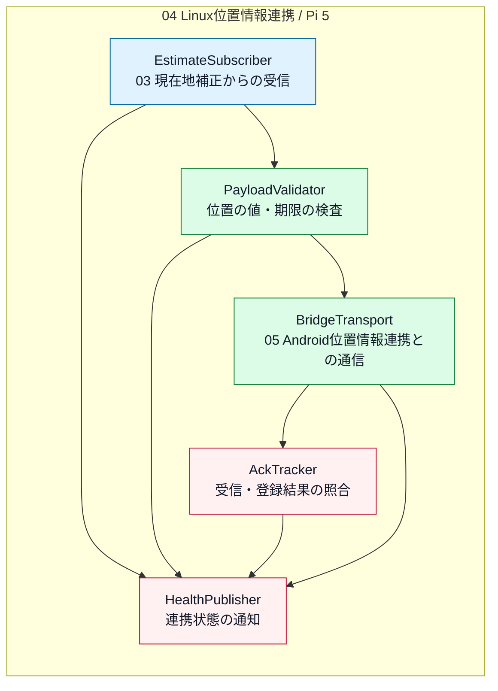
```mermaid
flowchart TB
 subgraph SW04["04 Linux位置情報連携 / Pi 5"]
  direction TB
  E["EstimateSubscriber<br/>03 現在地補正からの受信"]
  V["PayloadValidator<br/>位置の値・期限の検査"]
  T["BridgeTransport<br/>05 Android位置情報連携との通信"]
  A["AckTracker<br/>受信・登録結果の照合"]
  H["HealthPublisher<br/>連携状態の通知"]
  E --> V
  V --> T
  T --> A
  E --> H
  V --> H
  A --> H
  T --> H
 end
 classDef input fill:#e0f2fe,stroke:#0369a1,color:#111827
 classDef processing fill:#dcfce7,stroke:#15803d,color:#111827
 classDef status fill:#fff1f2,stroke:#be123c,color:#111827
 class E input
 class V,T processing
 class A,H status
```

| 接続 | 渡す情報 |
| --- | --- |
| EstimateSubscriber → PayloadValidator | 元の測定識別子と受信した位置。無効通知は送信候補を取り消す処理へ渡す |
| PayloadValidator → BridgeTransport | 検証結果と期限付き送信候補。座標を補正し直さない |
| BridgeTransport → AckTracker | 05 Android位置情報連携の応答と接続情報 |
| 各モジュール → HealthPublisher | 通信、位置品質、登録結果を別項目で通知するための状態 |

<a id="dd-feature-flows"></a>

### 3.2 機能別処理フローチャート

各図は機能の開始から結果までを示す。関数単位の分岐と戻り値は3.7に記載する。

<a id="dd-feature-1"></a>

#### 3.2.1 接続先の確認（LBR-F01）

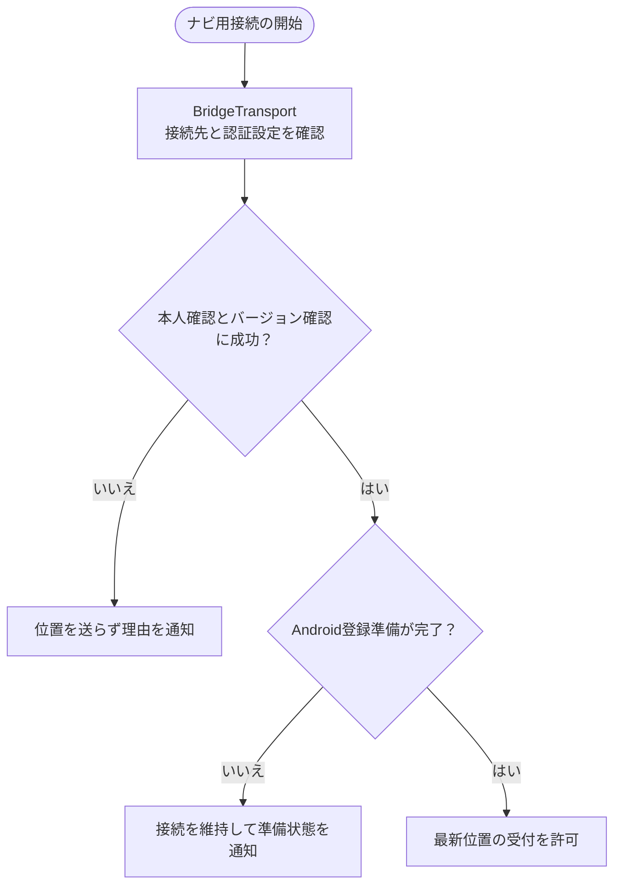
```mermaid
flowchart TB
 A(["ナビ用接続の開始"]) --> B["BridgeTransport<br/>接続先と認証設定を確認"]
 B --> C{"本人確認とバージョン確認に成功？"}
 C -->|"いいえ"| D["位置を送らず理由を通知"]
 C -->|"はい"| E{"Android登録準備が完了？"}
 E -->|"いいえ"| F["接続を維持して準備状態を通知"]
 E -->|"はい"| G["最新位置の受付を許可"]
```

<a id="dd-feature-2"></a>

#### 3.2.2 採用位置の受付（LBR-F02）

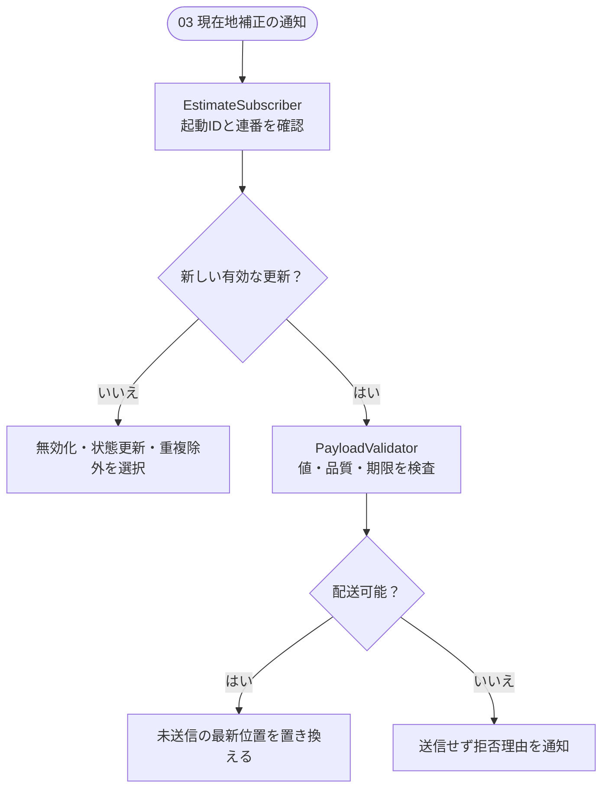
```mermaid
flowchart TB
 A(["03 現在地補正の通知"]) --> B["EstimateSubscriber<br/>起動IDと連番を確認"]
 B --> C{"新しい有効な更新？"}
 C -->|"いいえ"| D["無効化・状態更新・重複除外を選択"]
 C -->|"はい"| E["PayloadValidator<br/>値・品質・期限を検査"]
 E --> F{"配送可能？"}
 F -->|"はい"| G["未送信の最新位置を置き換える"]
 F -->|"いいえ"| H["送信せず拒否理由を通知"]
```

<a id="dd-feature-3"></a>

#### 3.2.3 期限を保持した配送（LBR-F03）

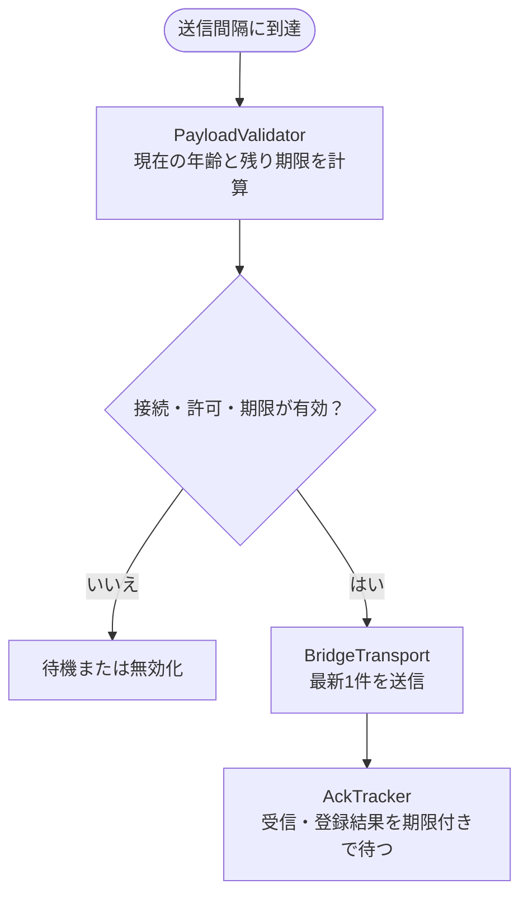
```mermaid
flowchart TB
 A(["送信間隔に到達"]) --> B["PayloadValidator<br/>現在の年齢と残り期限を計算"]
 B --> C{"接続・許可・期限が有効？"}
 C -->|"いいえ"| D["待機または無効化"]
 C -->|"はい"| E["BridgeTransport<br/>最新1件を送信"]
 E --> F["AckTracker<br/>受信・登録結果を期限付きで待つ"]
```

<a id="dd-feature-4"></a>

#### 3.2.4 登録結果の照合（LBR-F04）

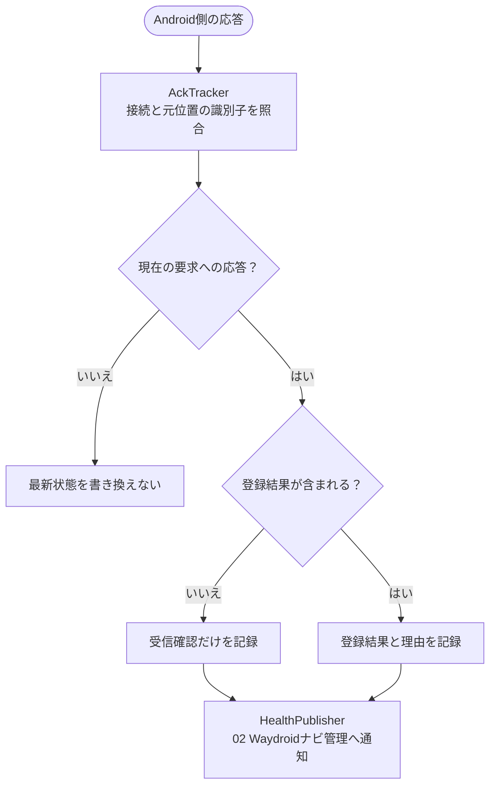
```mermaid
flowchart TB
 A(["Android側の応答"]) --> B["AckTracker<br/>接続と元位置の識別子を照合"]
 B --> C{"現在の要求への応答？"}
 C -->|"いいえ"| D["最新状態を書き換えない"]
 C -->|"はい"| E{"登録結果が含まれる？"}
 E -->|"いいえ"| F["受信確認だけを記録"]
 E -->|"はい"| G["登録結果と理由を記録"]
 F --> H["HealthPublisher<br/>02 Waydroidナビ管理へ通知"]
 G --> H
```

<a id="dd-feature-5"></a>

#### 3.2.5 無効化と期限監視（LBR-F05）

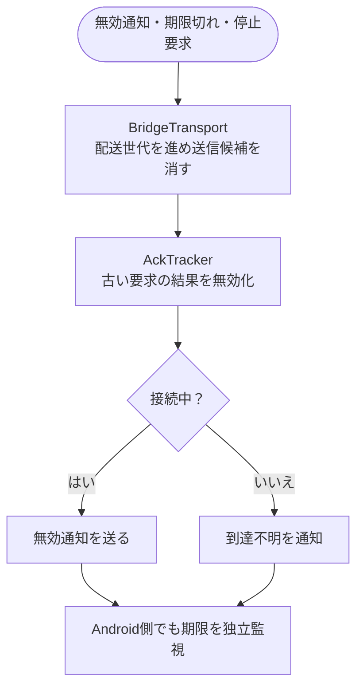
```mermaid
flowchart TB
 A(["無効通知・期限切れ・停止要求"]) --> B["BridgeTransport<br/>配送世代を進め送信候補を消す"]
 B --> C["AckTracker<br/>古い要求の結果を無効化"]
 C --> D{"接続中？"}
 D -->|"はい"| E["無効通知を送る"]
 D -->|"いいえ"| F["到達不明を通知"]
 E --> G["Android側でも期限を独立監視"]
 F --> G
```

<a id="dd-feature-6"></a>

#### 3.2.6 再接続と運用終了（LBR-F06）

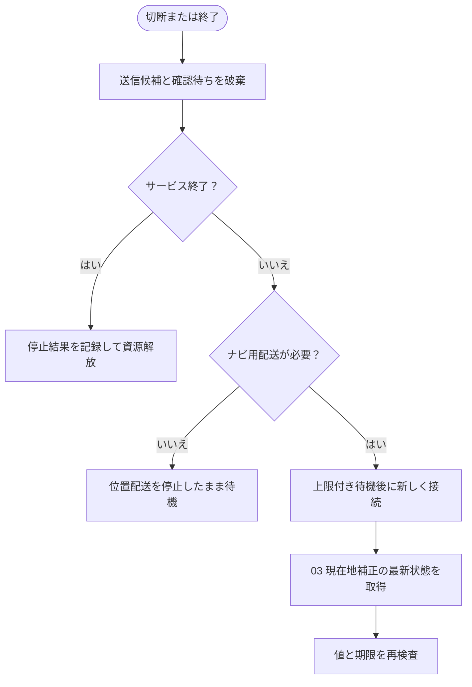
```mermaid
flowchart TB
 A(["切断または終了"]) --> B["送信候補と確認待ちを破棄"]
 B --> C{"サービス終了？"}
 C -->|"はい"| D["停止結果を記録して資源解放"]
 C -->|"いいえ"| E{"ナビ用配送が必要？"}
 E -->|"いいえ"| F["位置配送を停止したまま待機"]
 E -->|"はい"| G["上限付き待機後に新しく接続"]
 G --> H["03 現在地補正の最新状態を取得"]
 H --> I["値と期限を再検査"]
```

<a id="dd-module-tree"></a>

### 3.3 モジュールツリー

```text
location_bridge_service
+-- EstimateSubscriber
|   +-- accept_source_event
|   +-- request_snapshot
+-- PayloadValidator
|   +-- validate_position
|   +-- prepare_delivery
+-- BridgeTransport
|   +-- connect_peer / negotiate_session
|   +-- send_latest / invalidate_delivery
|   +-- reconnect_latest / stop_bridge
+-- AckTracker
|   +-- handle_ack
|   +-- check_deadlines
+-- HealthPublisher
    +-- publish_health
```

エントリーポイントは設定読込・モジュール生成・通知先の登録を行う。上記5モジュールを別々のOSプロセスにはしない。

<a id="dd-sequence"></a>

### 3.4 モジュール間の処理順序

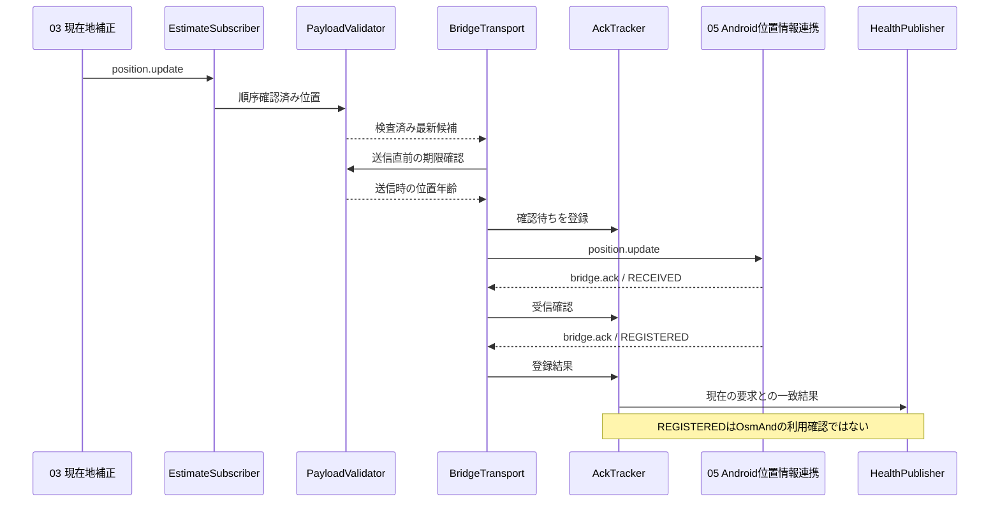
```mermaid
sequenceDiagram
 participant P as 03 現在地補正
 participant E as EstimateSubscriber
 participant V as PayloadValidator
 participant T as BridgeTransport
 participant A as AckTracker
 participant D as 05 Android位置情報連携
 participant H as HealthPublisher
 P->>E: position.update
 E->>V: 順序確認済み位置
 V-->>T: 検査済み最新候補
 T->>V: 送信直前の期限確認
 V-->>T: 送信時の位置年齢
 T->>A: 確認待ちを登録
 T->>D: position.update
 D-->>T: bridge.ack / RECEIVED
 T->>A: 受信確認
 D-->>T: bridge.ack / REGISTERED
 T->>A: 登録結果
 A->>H: 現在の要求との一致結果
 Note over A,H: REGISTEREDはOsmAndの利用確認ではない
```

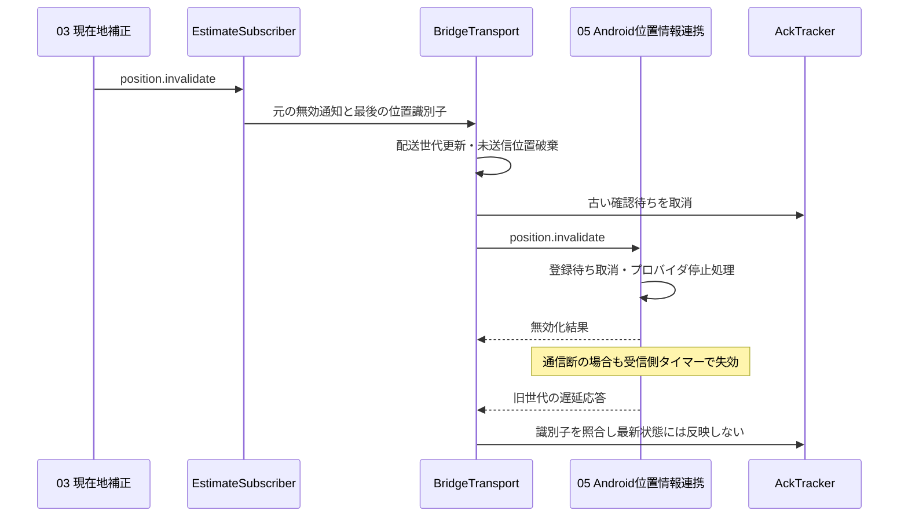
```mermaid
sequenceDiagram
 participant P as 03 現在地補正
 participant E as EstimateSubscriber
 participant T as BridgeTransport
 participant D as 05 Android位置情報連携
 participant A as AckTracker
 P->>E: position.invalidate
 E->>T: 元の無効通知と最後の位置識別子
 T->>T: 配送世代更新・未送信位置破棄
 T->>A: 古い確認待ちを取消
 T->>D: position.invalidate
 D->>D: 登録待ち取消・プロバイダ停止処理
 D-->>T: 無効化結果
 Note over D: 通信断の場合も受信側タイマーで失効
 D-->>T: 旧世代の遅延応答
 T->>A: 識別子を照合し最新状態には反映しない
```

<a id="dd-modules"></a>

### 3.5 モジュール詳細

モジュール間では不変の位置データと識別子を渡す。受信本文をそのまま実行したり、通信処理からOSコマンドを生成したりしない。

<a id="dd-module-1"></a>

#### 3.5.1 EstimateSubscriber（03 現在地補正からの受信）

| 項目 | 内容 |
| --- | --- |
| 入力 | position.update / position.invalidate / position.status、最新状態の応答 |
| 出力 | 順序を確認した通知、受信時単調時刻、元データの識別子 |
| 保持情報 | 承認済みsource_boot_id、最大通知連番、最後の位置連番。位置と状態の連番を混同しない |
| 処理 | 再接続後は同一購読内の最新スナップショットとそれ以降の通知を受け取る。途中の通知を取り逃した場合は再取得 |
| 関数 | accept_source_event、request_snapshot |
| 異常時 | 送信元変更・順序破損・入力断は送信許可を閉じる。別boot_idを遅延パケットだけで採用しない |

最新スナップショットは、取得時点の最大通知連番と、その時点で有効な位置または無効状態を一組で返す契約とする。既に受信した位置と同じsequenceでも、スナップショットがその位置の継続有効性を確認しており、後続の無効通知がなければ新しい接続の候補にできる。重複通知を新しい測定にするのではなく、元の時刻と期限で再検査する。スナップショット取得中の後続通知を取り逃さず、後続の無効通知があればそちらを優先する。

<a id="dd-module-2"></a>

#### 3.5.2 PayloadValidator（値・品質・期限の検査）

| 項目 | 内容 |
| --- | --- |
| 入力 | 元の位置、受信時刻、現在時刻、運用プロファイル |
| 出力 | ValidatedPositionまたは拒否理由。入力の緯度経度を変更しない |
| 保持情報 | 許容方法、遅延上限、精度上限、送信時刻の計算条件 |
| 処理 | 有限値、WGS84範囲、正の精度、optional値の有無、publishable、UTCと測定年齢を検査 |
| 関数 | validate_position、prepare_delivery |
| 異常時 | 欠損を0で代用しない。期限・遅延条件が未確定なら実位置配送を許可しない |

<a id="dd-module-3"></a>

#### 3.5.3 BridgeTransport（Androidとの接続・配送）

| 項目 | 内容 |
| --- | --- |
| 入力 | ナビ用開始停止、検証済み位置、無効化要求、通信イベント |
| 出力 | hello、位置更新、無効化、応答、接続状態 |
| 保持情報 | connection_id、delivery_epoch、tx_sequence、相手起動ID、最新候補1件、送信要求1件 |
| 処理 | 認証済み接続だけを利用。世代を変更したら旧送信処理の完了結果を採用しない |
| 関数 | connect_peer、negotiate_session、send_latest、invalidate_delivery、reconnect_latest、stop_bridge |
| 異常時 | 期限付き接続・送受信、待ち時間上限付き再試行。ナビ用停止で共有の03 現在地補正は止めない |

<a id="dd-module-4"></a>

#### 3.5.4 AckTracker（受信確認と登録結果の管理）

| 項目 | 内容 |
| --- | --- |
| 入力 | 応答、送信した要求の識別子、現在時刻、取消通知 |
| 出力 | 受信・登録・無効化結果と未確認理由 |
| 保持情報 | 現在要求、received_at、登録期限、取消済み世代、直近結果の有界履歴 |
| 処理 | RECEIVEDは通信受付、REGISTEREDはAndroid APIの成功として扱う。両者を別々に保持 |
| 関数 | handle_ack、check_deadlines |
| 異常時 | ACK期限切れはUNKNOWN。同一位置を新規連番にして再登録させない。回復は新接続・最新状態取得から行う |

<a id="dd-module-5"></a>

#### 3.5.5 HealthPublisher（02 Waydroidナビ管理への状態通知）

| 項目 | 内容 |
| --- | --- |
| 入力 | 接続、位置品質、確認待ち、登録結果、異常理由 |
| 出力 | bridge.status / location_status相当の共通形式通知 |
| 保持情報 | 本ソフトboot_idと状態通知連番、最新集約状態、通知抑制用の同一理由 |
| 処理 | 元位置の参照・年齢・期限を残し、状態通知を受けただけで測定期限が更新されないようにする |
| 関数 | publish_health |
| 異常時 | 通知先切断時は最新状態だけ保持。復旧時に状態を再送しても元位置を新しくしない |

<a id="dd-files"></a>

### 3.6 ファイル構成

```text
src/raspberry_pi5/
+-- location_bridge_service.py       起動・停止と依存関係の組立て
+-- location_bridge/
|   +-- subscriber.py               EstimateSubscriber
|   +-- validator.py                PayloadValidator
|   +-- transport.py                BridgeTransport
|   +-- acknowledgements.py         AckTracker
|   +-- health.py                   HealthPublisher
|   +-- models.py                   位置・応答・状態の型
|   +-- protocol.py                 通信形式と長さ制限
|   +-- config.py                   設定読込・検査
+-- config/location_bridge.example.toml
tests/location_bridge/
+-- test_validation.py
+-- test_ordering.py
+-- test_freshness.py
+-- test_acknowledgements.py
+-- test_lifecycle.py
+-- fixtures/                       架空位置・通信異常の試験データ
```

実装済みの配置。認証鍵と実位置の記録はこのツリーや公開Gitに含めない。protocol.pyと05 Android位置情報連携の型は同じ契約試験データで確認する。

<a id="dd-function-flows"></a>

### 3.7 関数のフローチャート

関数名は実装予定名。外部I/Oの終了通知は、現在の接続IDと配送世代を照合してから状態へ反映する。

<a id="dd-fn-connect-peer"></a>

#### 3.7.1 connect_peer（Androidとの通信を開始する）

| 項目 | 内容 |
| --- | --- |
| 入力 | 接続設定、開始要求の期限 |
| 戻り値・結果 | 接続候補または接続失敗。まだ位置送信は許可しない |

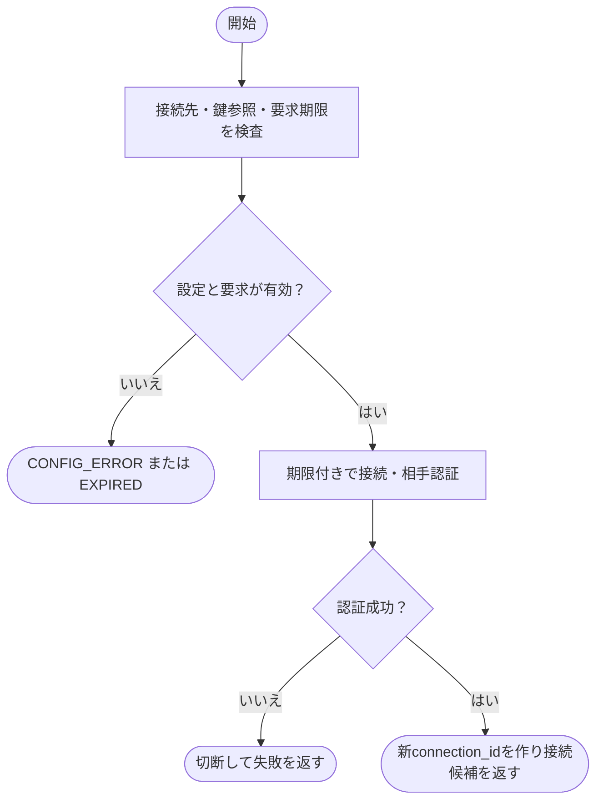
```mermaid
flowchart TB
 A(["開始"]) --> B["接続先・鍵参照・要求期限を検査"]
 B --> C{"設定と要求が有効？"}
 C -->|"いいえ"| D(["CONFIG_ERROR または EXPIRED"])
 C -->|"はい"| E["期限付きで接続・相手認証"]
 E --> F{"認証成功？"}
 F -->|"いいえ"| G(["切断して失敗を返す"])
 F -->|"はい"| H(["新connection_idを作り接続候補を返す"])
```

<a id="dd-fn-negotiate-session"></a>

#### 3.7.2 negotiate_session（通信仕様のバージョンと登録能力を確認する）

| 項目 | 内容 |
| --- | --- |
| 入力 | 認証済み接続、双方boot_id、能力 |
| 戻り値・結果 | 接続状態READYと登録準備状態、またはINCOMPATIBLE |

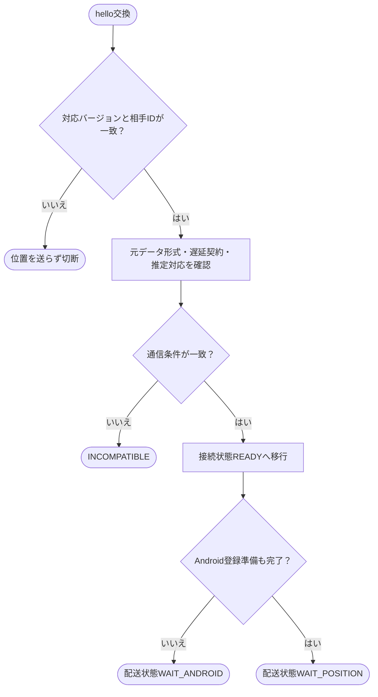
```mermaid
flowchart TB
 A(["hello交換"]) --> B{"対応バージョンと相手IDが一致？"}
 B -->|"いいえ"| C(["位置を送らず切断"])
 B -->|"はい"| D["元データ形式・遅延契約・推定対応を確認"]
 D --> E{"通信条件が一致？"}
 E -->|"いいえ"| F(["INCOMPATIBLE"])
 E -->|"はい"| G["接続状態READYへ移行"]
 G --> H{"Android登録準備も完了？"}
 H -->|"いいえ"| I(["配送状態WAIT_ANDROID"])
 H -->|"はい"| J(["配送状態WAIT_POSITION"])
```

<a id="dd-fn-accept-source-event"></a>

#### 3.7.3 accept_source_event（元位置の通知順序を確認する）

| 項目 | 内容 |
| --- | --- |
| 入力 | 03 現在地補正の通知、受信時刻 |
| 戻り値・結果 | 新位置、無効化、状態更新、または重複除外 |

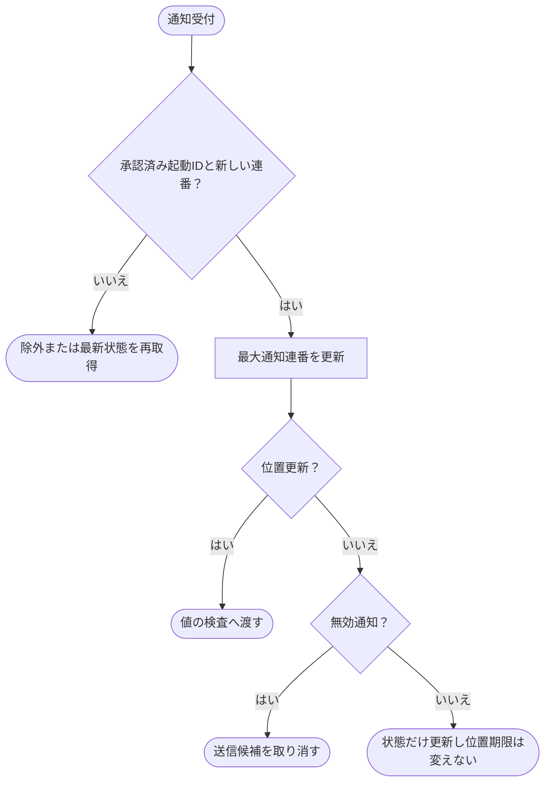
```mermaid
flowchart TB
 A(["通知受付"]) --> B{"承認済み起動IDと新しい連番？"}
 B -->|"いいえ"| C(["除外または最新状態を再取得"])
 B -->|"はい"| D["最大通知連番を更新"]
 D --> E{"位置更新？"}
 E -->|"はい"| F(["値の検査へ渡す"])
 E -->|"いいえ"| G{"無効通知？"}
 G -->|"はい"| H(["送信候補を取り消す"])
 G -->|"いいえ"| I(["状態だけ更新し位置期限は変えない"])
```

<a id="dd-fn-validate-position"></a>

#### 3.7.4 validate_position（配送できる位置か検査する）

| 項目 | 内容 |
| --- | --- |
| 入力 | 位置、対応能力、許容条件 |
| 戻り値・結果 | ValidatedPositionまたはreason |

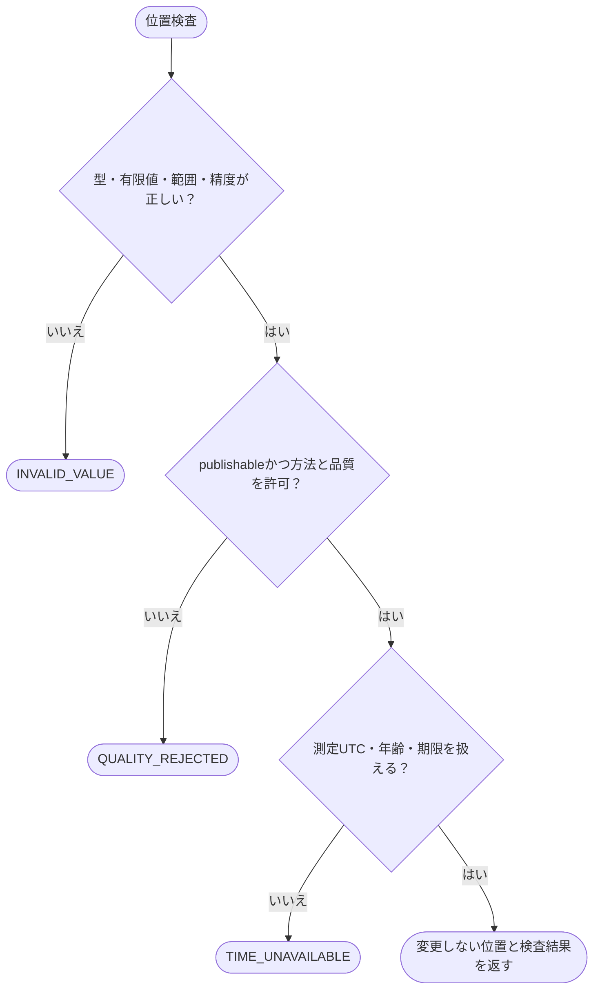
```mermaid
flowchart TB
 A(["位置検査"]) --> B{"型・有限値・範囲・精度が正しい？"}
 B -->|"いいえ"| X(["INVALID_VALUE"])
 B -->|"はい"| C{"publishableかつ方法と品質を許可？"}
 C -->|"いいえ"| Y(["QUALITY_REJECTED"])
 C -->|"はい"| D{"測定UTC・年齢・期限を扱える？"}
 D -->|"いいえ"| Z(["TIME_UNAVAILABLE"])
 D -->|"はい"| E(["変更しない位置と検査結果を返す"])
```

<a id="dd-fn-prepare-delivery"></a>

#### 3.7.5 prepare_delivery（現在の位置年齢を求める）

| 項目 | 内容 |
| --- | --- |
| 入力 | 検証済み位置、受信単調時刻、送信直前時刻 |
| 戻り値・結果 | 送信時年齢または期限切れ |

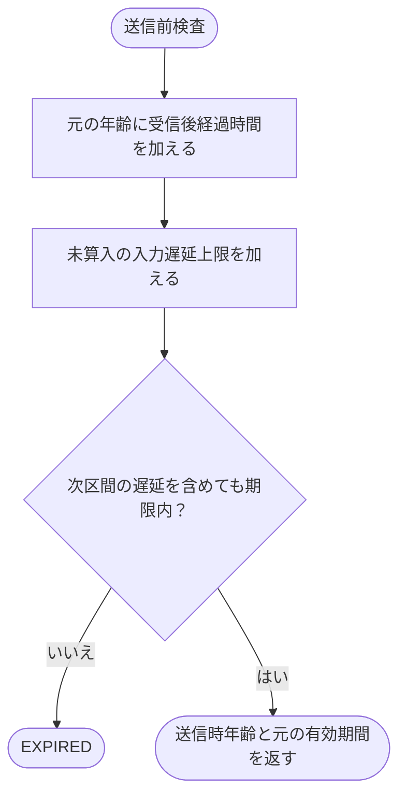
```mermaid
flowchart TB
 A(["送信前検査"]) --> B["元の年齢に受信後経過時間を加える"]
 B --> C["未算入の入力遅延上限を加える"]
 C --> D{"次区間の遅延を含めても期限内？"}
 D -->|"いいえ"| E(["EXPIRED"])
 D -->|"はい"| F(["送信時年齢と元の有効期間を返す"])
```

<a id="dd-fn-send-latest"></a>

#### 3.7.6 send_latest（最新位置を1件送る）

| 項目 | 内容 |
| --- | --- |
| 入力 | 最新候補、接続状態、配送世代 |
| 戻り値・結果 | 確認待ち要求または送信延期 |

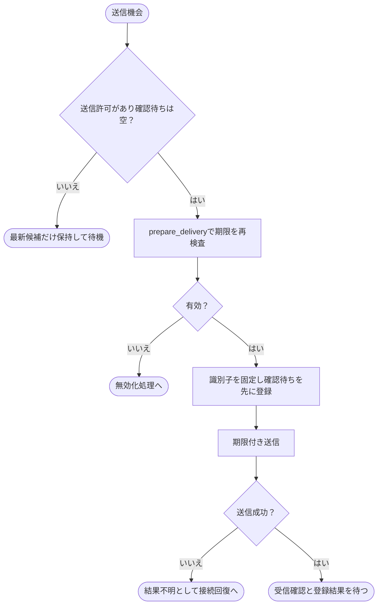
```mermaid
flowchart TB
 A(["送信機会"]) --> B{"送信許可があり確認待ちは空？"}
 B -->|"いいえ"| C(["最新候補だけ保持して待機"])
 B -->|"はい"| D["prepare_deliveryで期限を再検査"]
 D --> E{"有効？"}
 E -->|"いいえ"| F(["無効化処理へ"])
 E -->|"はい"| G["識別子を固定し確認待ちを先に登録"]
 G --> H["期限付き送信"]
 H --> I{"送信成功？"}
 I -->|"いいえ"| J(["結果不明として接続回復へ"])
 I -->|"はい"| K(["受信確認と登録結果を待つ"])
```

<a id="dd-fn-handle-ack"></a>

#### 3.7.7 handle_ack（登録結果を現在の要求と照合する）

| 項目 | 内容 |
| --- | --- |
| 入力 | bridge.ack、確認待ち要求 |
| 戻り値・結果 | 照合済み結果または無視 |

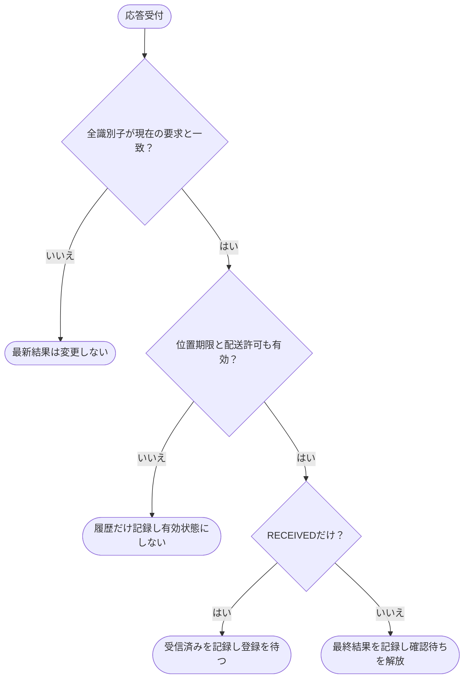
```mermaid
flowchart TB
 A(["応答受付"]) --> B{"全識別子が現在の要求と一致？"}
 B -->|"いいえ"| C(["最新結果は変更しない"])
 B -->|"はい"| D{"位置期限と配送許可も有効？"}
 D -->|"いいえ"| E(["履歴だけ記録し有効状態にしない"])
 D -->|"はい"| F{"RECEIVEDだけ？"}
 F -->|"はい"| G(["受信済みを記録し登録を待つ"])
 F -->|"いいえ"| H(["最終結果を記録し確認待ちを解放"])
```

<a id="dd-fn-invalidate-delivery"></a>

#### 3.7.8 invalidate_delivery（配送と登録を無効化する）

| 項目 | 内容 |
| --- | --- |
| 入力 | 無効理由、元通知参照または停止要求ID |
| 戻り値・結果 | 無効化要求、到達結果 |

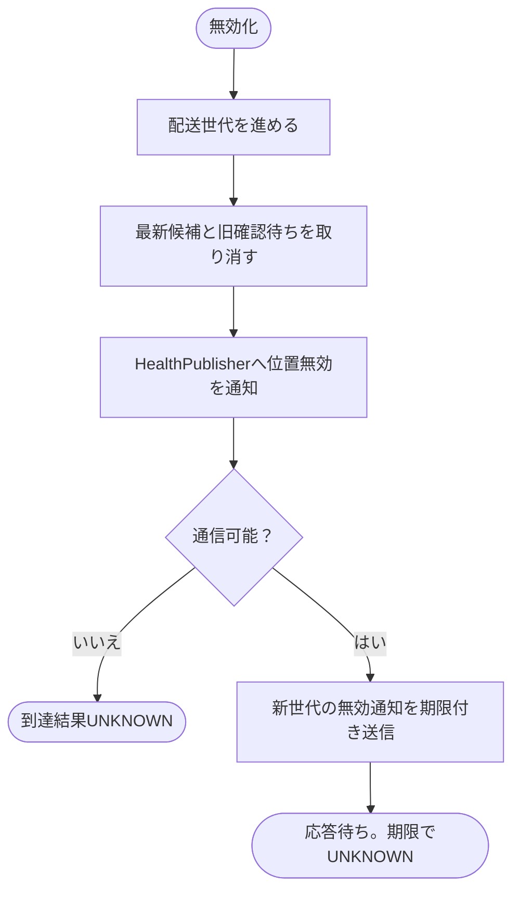
```mermaid
flowchart TB
 A(["無効化"]) --> B["配送世代を進める"]
 B --> C["最新候補と旧確認待ちを取り消す"]
 C --> D["HealthPublisherへ位置無効を通知"]
 D --> E{"通信可能？"}
 E -->|"いいえ"| F(["到達結果UNKNOWN"])
 E -->|"はい"| G["新世代の無効通知を期限付き送信"]
 G --> H(["応答待ち。期限でUNKNOWN"])
```

<a id="dd-fn-check-deadlines"></a>

#### 3.7.9 check_deadlines（位置と応答の期限を監視する）

| 項目 | 内容 |
| --- | --- |
| 入力 | 単調時刻、位置期限、確認期限 |
| 戻り値・結果 | 期限切れ処理の通知 |

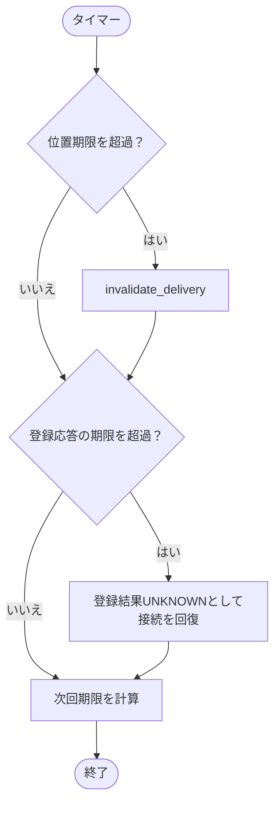
```mermaid
flowchart TB
 A(["タイマー"]) --> B{"位置期限を超過？"}
 B -->|"はい"| C["invalidate_delivery"]
 B -->|"いいえ"| D{"登録応答の期限を超過？"}
 C --> D
 D -->|"はい"| E["登録結果UNKNOWNとして接続を回復"]
 D -->|"いいえ"| F["次回期限を計算"]
 E --> F
 F --> G(["終了"])
```

<a id="dd-fn-reconnect-latest"></a>

#### 3.7.10 reconnect_latest（復旧後に最新状態を取り直す）

| 項目 | 内容 |
| --- | --- |
| 入力 | 切断理由、ナビ用配送の利用状態 |
| 戻り値・結果 | 新接続と最新状態、または待機 |

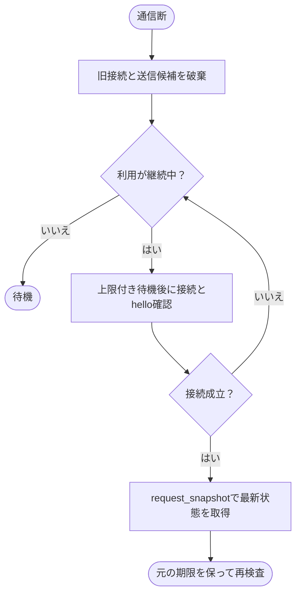
```mermaid
flowchart TB
 A(["通信断"]) --> B["旧接続と送信候補を破棄"]
 B --> C{"利用が継続中？"}
 C -->|"いいえ"| D(["待機"])
 C -->|"はい"| E["上限付き待機後に接続とhello確認"]
 E --> F{"接続成立？"}
 F -->|"いいえ"| C
 F -->|"はい"| G["request_snapshotで最新状態を取得"]
 G --> H(["元の期限を保って再検査"])
```

<a id="dd-fn-publish-health"></a>

#### 3.7.11 publish_health（連携状態を通知する）

| 項目 | 内容 |
| --- | --- |
| 入力 | 通信・位置品質・登録結果 |
| 戻り値・結果 | 02 Waydroidナビ管理向け状態 |

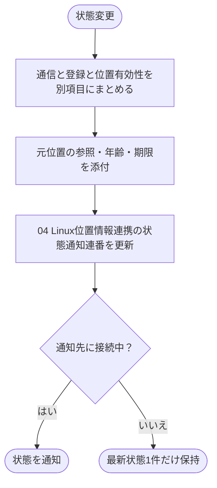
```mermaid
flowchart TB
 A(["状態変更"]) --> B["通信と登録と位置有効性を別項目にまとめる"]
 B --> C["元位置の参照・年齢・期限を添付"]
 C --> D["04 Linux位置情報連携の状態通知連番を更新"]
 D --> E{"通知先に接続中？"}
 E -->|"はい"| F(["状態を通知"])
 E -->|"いいえ"| G(["最新状態1件だけ保持"])
```

<a id="dd-fn-stop-bridge"></a>

#### 3.7.12 stop_bridge（位置連携サービスを終了する）

| 項目 | 内容 |
| --- | --- |
| 入力 | 停止期限 |
| 戻り値・結果 | 終了結果と未確認項目 |

```mermaid
flowchart TB
 A(["停止要求"]) --> B["新しい開始要求を拒否"]
 B --> C["invalidate_deliveryを実行"]
 C --> D["残り期限内で無効化結果を待つ"]
 D --> E["03 現在地補正の購読と通信・タイマーを終了"]
 E --> F["結果不明を含む終了状態を記録"]
 F --> G(["終了"])
```

<a id="dd-4"></a>

## 4. インターフェース設計

通信の役割を以下に定める。bridge.*は本プロジェクトの通信名であり、WaydroidやAndroidの標準APIではない。

<a id="dd-interface-diagrams"></a>

### 4.1 接続先と担当モジュール

```mermaid
flowchart TB
 subgraph SW03["03 現在地補正"]
  P["PositionPublisher"]
 end
 subgraph SW04["04 Linux位置情報連携"]
  E["EstimateSubscriber"]
  T["BridgeTransport"]
  H["HealthPublisher"]
  E --> T
  T --> H
 end
 subgraph SW05["05 Android位置情報連携"]
  R["ReceiverService"]
  L["LocationPublisher"]
  S["StatusReporter"]
  R --> L
  L --> S
 end
 subgraph SW02["02 Waydroidナビ管理"]
  N["NavigationSupervisor"]
  A["AppLauncher"]
  N --> A
 end
 P --> E
 T --> R
 S --> T
 N --> T
 H --> N
 A -.-> R
```

| 接続 | 内容 |
| --- | --- |
| PositionPublisher → EstimateSubscriber | 採用位置・無効通知・状態と最新スナップショット |
| NavigationSupervisor → BridgeTransport | ナビ用配送の開始・停止・無効化。位置座標そのものは通さない |
| AppLauncher → 05 Android位置情報連携 | アプリ起動確認。点線は位置パケットではなくアプリ管理 |
| StatusReporter → BridgeTransport → HealthPublisher → NavigationSupervisor | 受信・登録・失効結果。05 Android位置情報連携の通知元と元位置の参照を残す |

関連：[03 現在地補正](03_現在地補正.md#dd-4)、[05 Android位置情報連携](05_Android位置情報連携.md#dd-4)、[02 Waydroidナビ管理](02_Waydroidナビ管理.md#dd-4)。

<a id="dd-position-contract"></a>

### 4.2 位置通知と識別子

| 項目 | 規則 |
| --- | --- |
| 元通知 source / boot_id / sequence | 03 現在地補正の値を保持する。位置更新・無効化・状態通知が共有する通知連番 |
| estimate_id / origin_id / input_refs | 推定結果と元測定の参照を保持。再送のために別測定へ付け替えない |
| latitude_deg / longitude_deg | WGS84。緯度-90～90、経度-180～180の有限値 |
| horizontal_accuracy_m | 正の有限値。03 現在地補正の水平精度の意味を保持し、独自に小さくしない |
| speed_mps / speed_valid | 有効なら0以上。無効なら値はnullとし、0 km/hへ変換しない |
| bearing_deg / bearing_valid | 有効なら真北0度・時計回りで0以上360未満。車体姿勢ではなく移動方位 |
| method / validity / publishable | GPSまたはDEAD_RECKONING。配信許可と品質を別々に確認。推定位置は対応能力と運用許可も必要 |
| observed_at_utc / age_ms_at_send / valid_for_ms | 元測定のUTC、送信時年齢、測定からの有効期間。状態通知の時刻と混同しない |
| last_gps_age_ms / discontinuity / reason | GPS断継続時間、位置不連続、理由を保持して05 Android位置情報連携側の状態通知にも渡す |

通信の外側にはbridge_boot_id（04 Linux位置情報連携の起動ID）、receiver_boot_id（05 Android位置情報連携の起動ID）、connection_id、delivery_epoch、tx_sequenceを追加する。元通知のsequenceを配送連番で上書きしない。

<a id="dd-wire-contract"></a>

### 4.3 Androidとの通信契約

第一候補は、Waydroid専用ネットワーク上の認証付きTCP接続とする。04 Linux位置情報連携が接続を開始し05 Android位置情報連携が待受する。実装時は相互TLS等で相手を確認し、05 Android位置情報連携のアプリ専用領域に資格情報を置く。ポート・到達方法・証明書更新方法はT.B.D。通信先を車外へ公開しない。

フレーム形式の設計案は「4バイトの符号なしネットワーク順本文長 + UTF-8 JSON」。本文長上限・読取期限を確認してから確保し、無制限のJSON・深い入れ子・非有限数・重複キーを拒否する。双方のプロトコルのバージョンで合意してから使用する。

| メッセージ | 必須情報・意味 |
| --- | --- |
| bridge.hello | 通信仕様のバージョン、04 Linux位置情報連携/05 Android位置情報連携の起動ID、connection_id、対応データ形式のバージョン、推定位置対応、登録準備状態、遅延契約ID |
| position.update | 配送識別子一式、03 現在地補正の元位置、04 Linux位置情報連携送信時のage_ms_at_send |
| position.invalidate | 新しいdelivery_epoch、tx_sequence、無効理由、最後の位置参照。元通知または停止要求IDも付ける |
| bridge.ack | 識別子一式、対象位置参照、RECEIVED / REGISTERED / INVALIDATED / REJECTED / FAILED、理由 |
| bridge.status | 05 Android位置情報連携の現在状態と状態連番、現在位置参照、位置期限、権限・プロバイダ状態 |
| bridge.ping / bridge.pong | 応答性の監視。位置期限を更新しない |

同じ接続内のtx_sequenceは単調増加させる。再送は同じ要求IDとして扱い、05 Android位置情報連携は既知の結果を返すだけで再登録しない。最終応答不明では同一位置の無限再送をせず、接続を作り直して最新状態を取得する。

無効化はdelivery_epochを進めた通知として送る。05 Android位置情報連携は新世代を受理すると旧世代の登録待ちを破棄する。次の更新もその世代を使用する。04 Linux位置情報連携都合の無効化に03 現在地補正の架空sequenceを割り当てない。元位置の更新と無効通知は03 現在地補正側の順序でも判定する。

<a id="dd-control-contract"></a>

### 4.4 ナビ用開始・停止と状態通知

| 論理操作 | 動作 |
| --- | --- |
| start_delivery | 02 Waydroidナビ管理のowner_boot_id・command_id・期限を確認してナビ用配送を有効化。同じIDは再実行しない |
| stop_delivery | ナビ用配送を無効化し接続を解放。03 現在地補正の位置生成や別用途の位置利用は停止しない |
| get_bridge_state | 最新の通信・登録状態を返す。位置が期限内かは取得時にも再判定 |
| bridge.status → NavigationSupervisor | connection_state、delivery_state、position_validity、registration_state、position_ref、position_age、reasonを通知 |

同じ利用者からの重複した開始要求で利用数を増やさない。02 Waydroidナビ管理が再起動したら旧owner_boot_idを終了扱いにして新しい要求を待つ。操作結果は共通仕様のACCEPTED / SUCCEEDED等で返し、配送開始の成功を「現在地が登録済み」と取り違えない。

05 Android位置情報連携の登録結果は本ソフト経由でNavigationSupervisorへ集約する。AppLauncherのアプリ稼働確認は別経路とし、同じ登録状態を二重の更新元から上書きしない。

<a id="dd-5"></a>

## 5. データ・設定設計


<a id="dd-data"></a>

### 5.1 保持データと上限

| データ | 所有者 | 寿命・上限 |
| --- | --- | --- |
| SourceCursor | EstimateSubscriber | 承認済み起動IDと最大通知連番。通知がstatusでも連番は進めるが位置期限は変えない |
| LatestEstimate | BridgeTransport | 未送信最新1件。再接続・無効化・期限切れで破棄 |
| InflightRequest | AckTracker | 位置更新の最終結果待ち1件。制御無効化はこれを取り消して優先 |
| SessionState | BridgeTransport | 接続・配送世代・双方起動ID。起動や接続の変更で初期化 |
| BridgeHealth | HealthPublisher | 最新状態1件と容量制限した診断履歴。位置本文は通常ログに含めない |

05 Android位置情報連携が返す応答の履歴にも件数・時間上限を設ける。上限を超えた旧応答の重複確認ができなくても、最新位置を巻き戻すことは禁止する。

<a id="dd-freshness"></a>

### 5.2 年齢と期限の計算

```text
age_at_04_send =
    source_age_at_send
  + ingress_delay_bound
  + (mono_04_send - mono_04_receive)

age_at_05_receive =
    age_at_04_send + bridge_delay_bound

age_at_05_now =
    age_at_05_receive
  + (elapsed_05_now - elapsed_05_receive)

effective_limit = min(source_valid_for_ms, configured_age_limit_ms)
remaining_ms = effective_limit - age_at_05_now
```

同じ装置内の時間差だけを引く。各遅延上限は、その区間をまだ年齢へ算入していない場合だけ加える。送信待ちを含む上限の二重計上を避け、区間と計測点を試験記録に残す。remaining_msが0以下なら無効とする。

例として試験専用に、元年齢100 ms、入力遅延上限20 ms、04 Linux位置情報連携内待ち80 ms、橋渡し遅延上限50 ms、有効期間1,000 msと置くと、05 Android位置情報連携受信時の残りは750 ms。実車用の推奨値ではない。

遅延上限は単なる設定値で保証できない。送受信期限、時計の対応、遅延注入試験を組み合わせて成立を確認する。ACK往復時間だけを無条件に片道の上限としない。上限を確認できない区間は配送不可とする。

<a id="dd-config"></a>

### 5.3 運用設定

| 設定 | 初期方針・検査 |
| --- | --- |
| delivery_enabled | 実機プロファイルが未承認ならfalse |
| allow_dead_reckoning | 初期false。03 現在地補正の配信許可と05 Android位置情報連携の能力に加えて本設定も必要 |
| peer_endpoint / credential_ref | 接続先と秘密情報の参照。未設定・不正・信頼期限切れは拒否 |
| supported_schema_versions | 03 現在地補正/04 Linux位置情報連携/05 Android位置情報連携で確認したバージョンだけ許可 |
| send_interval_ms / ack_timeout_ms | T.B.D。位置の有効期間と処理能力に収まることを負荷試験 |
| ingress_delay_bound_ms / bridge_delay_bound_ms | T.B.D。根拠を持つ区間上限のみ使用 |
| max_position_age_ms / max_accuracy_m | T.B.D。03 現在地補正の上限を勝手に緩めない |
| max_frame_bytes / read_timeout_ms | 必須の有限上限。越えた相手は切断 |
| retry_initial_ms / retry_max_ms / shutdown_timeout_ms | T.B.D。指数的待機とばらつきを付け、待ち時間・終了時間を有限にする |

設定変更は検査後に新しい配送世代へ切り替える。認証・期限判定に関わる変更中は位置を配送しない。

<a id="dd-6"></a>

## 6. 処理・状態遷移


<a id="dd-states"></a>

### 6.1 接続状態と配送状態

```mermaid
stateDiagram-v2
 [*] --> DISCONNECTED
 DISCONNECTED --> CONNECTING: 利用要求
 CONNECTING --> NEGOTIATING: 相手認証成功
 NEGOTIATING --> READY: 通信条件一致
 NEGOTIATING --> DISCONNECTED: 不一致
 CONNECTING --> DISCONNECTED: 接続失敗
 READY --> DISCONNECTED: 切断
 READY --> STOPPING: 停止要求
 STOPPING --> DISCONNECTED: 資源解放
```

READYは通信可能という意味で、位置有効・Android登録可能を含めない。配送状態は別にDISABLED / WAIT_POSITION / WAIT_ANDROID / ACTIVE / INVALIDとする。

ACTIVEは現在の期限内位置についてREGISTEREDが確認された場合だけ。新位置の登録待ちでは、前の登録位置の期限も独立して監視し、送信中の位置を登録済みへ先回りさせない。

<a id="dd-priority"></a>

### 6.2 競合時の優先順位

| 優先順 | 処理 | 理由 |
| --- | --- | --- |
| 1 | 停止・権限取消・元位置の無効化・期限切れ | 古い登録処理を有効状態へ戻さない |
| 2 | 接続変更・送信元再起動 | 旧boot_idと旧接続の完了通知を除外 |
| 3 | 最新位置の検査と配送 | 未送信の古い位置より新しい有効位置を優先 |
| 4 | 登録応答・状態通知 | 現在の識別子と期限を再照合して採用 |

イベントを飛ばして無効化より古い更新を先に実行しない。順序の確定と候補の置換は同一イベント処理内で完了させる。

<a id="dd-7"></a>

## 7. 異常処理

| 異常 | 位置の扱い | 通知・復旧 |
| --- | --- | --- |
| 座標範囲外・NaN・精度不正 | 該当更新を拒否。以前の位置の寿命を延長しない | INVALID_VALUE。元データをログに丸ごと残さない |
| publishable=false / 不許可の推定 | 新規配送停止・無効化 | QUALITY_REJECTED。正常な次の更新を待つ |
| 測定UTC不明・遅延上限不明 | Android向け位置は配送しない | TIME_UNAVAILABLE。状態通知のみ |
| 通信・ACK期限切れ | 登録結果UNKNOWN、旧要求取消 | 接続回復。05 Android位置情報連携側でも独立失効 |
| Android権限不足 | 新規配送を停止しWAIT_ANDROID | PERMISSION_REQUIRED。設定の自動迂回をしない |
| バージョン・認証不一致 | 位置本文を送らない | INCOMPATIBLE / AUTH_FAILED |
| 03 現在地補正の無効通知後に古いACK | 有効へ戻さない | 診断用件数のみ加算 |
| 状態通知先の切断 | 位置の許可条件は保持して監視 | 最新状態を再通知。古いイベント列は再生しない |

<a id="dd-8"></a>

## 8. 起動・終了・運用設計

Pythonサービスとして起動する案とする。Linuxのユーザー・グループで03 現在地補正へのIPC利用と設定読取を制限し、root実行を前提にしない。

1. 設定と運用プロファイルを検査し、boot_idを新規作成する。
2. 5モジュールを準備し、入力・応答・タイマーを同一状態管理へ接続する。
3. 02 Waydroidナビ管理からの利用要求を待つ。サービスが起動しただけでは位置配送しない。
4. 利用開始時に05 Android位置情報連携と接続し、最新位置を検査する。
5. ナビ用停止は配送を無効化して利用を解放する。サービス終了時はさらにIPC・タイマーを停止する。

systemdユニットの具体名、依存順序、停止期限は導入時に確定する。無効化の送信失敗でOS終了を無期限に止めない。通常ログは理由コード・起動ID・連番・経過時間・件数を中心とし、位置の履歴は明示的な試験時だけ保存する。

<a id="dd-9"></a>

## 9. 試験・受入条件


<a id="dd-tests"></a>

### 9.1 単体・通信契約試験

| 試験ID / 機能 | 入力・操作 | 受入条件 |
| --- | --- | --- |
| LBR-T01 / F01 | 認証不一致、バージョン不一致、未準備Android | 座標本文を送らない。理由が異なる |
| LBR-T02 / F02 | 範囲外・NaN・null・速度無効・DEGRADED | 不正値拒否。無効速度を0化せず、許可済み推定だけ配送 |
| LBR-T03 / F02 | update10 → status11 → invalidate12 → 遅延update10 | 最大通知連番は12。有効状態へ戻らない |
| LBR-T04 / F03 | 送信待ち中に期限切れ、通信遅延を増やす | 送信直前再検査と05 Android位置情報連携側期限判定で拒否 |
| LBR-T05 / F04 | RECEIVEDのみ、REGISTERED逆順、旧接続応答 | 受信のみで登録済みにしない。旧結果は最新へ反映しない |
| LBR-T06 / F05 | 登録待ち中の無効化、無効通知喪失 | 新配送世代へ移行。05 Android位置情報連携側タイマーで期限内に失効 |
| LBR-T07 / F06 | 大量更新中に通信断と再接続 | 送信候補1件・確認待ち1件を超えず最新だけ配送 |
| LBR-T08 / F06 | 停止期限切れ、02 Waydroidナビ管理再起動、開始要求の重複 | 共有03 現在地補正を止めず、旧利用要求を再実行しない |
| LBR-T09 / F01～F06 | 双方の同一JSON契約例と破損フレーム | Python/Kotlinで型・識別子・拒否理由が一致 |

<a id="dd-integration-tests"></a>

### 9.2 実機受入と計測項目

Pi 5と採用Waydroidイメージで、インターネット接続なしでも位置連携が成立することを確認する。OsmAndの表示確認は05 Android位置情報連携の試験と合わせ、通信成功だけで合格にしない。

送信間隔、受信年齢、登録所要時間、欠落数、再接続時間、メモリ上限、停止時間を記録する。通常負荷だけでなくWaydroidと4カメラ録画を同時動作させた条件で測る。数値目標がT.B.Dの項目は、目標確定と合格記録が揃うまで運用許可しない。本書作成時点ではこれらの試験は未実施。

<a id="dd-10"></a>

## 10. 未確定事項・実装課題

| 課題 | 確定条件 |
| --- | --- |
| 通信方式・相互認証・ポート | 採用Waydroidで到達でき、車外と未認証相手から利用できない |
| Android登録能力の通知 | 05 Android位置情報連携で実際の権限・プロバイダ試験結果から生成できる |
| 遅延と有効期間 | 03 現在地補正/04 Linux位置情報連携/05 Android位置情報連携の測定点と上限を統合試験で確認 |
| 推定位置の運用許可 | 03 現在地補正の誤差・失効条件、05 Android位置情報連携の表示挙動を確認 |
| IPC・最新状態取得 | スナップショット取得と継続通知の間で欠落が発生しない |
| 依存ライブラリ・サービス配置 | 採用するOSのバージョンで動作確認し固定する。初期ソースは作成済みだが、実機での依存ライブラリ配置・サービス登録・起動確認は未実施 |

<a id="dd-glossary"></a>

## 用語の注釈

| 用語 | 本書での意味 |
| --- | --- |
| ACK（受信確認・応答） | 相手の応答。データ受付とAndroid登録成功は異なる段階 |
| boot_id | ソフトを起動し直すたびに変わる識別子。別の起動の通知を混ぜないために使用 |
| delivery_epoch（配送世代） | 無効化や設定変更の前後を区別する番号。元測定の連番ではない |
| 単調時計 | 経過時間を測る時計。別OSの値とは直接引き算しない |
| スナップショット | ある時点での最新位置または無効状態。過去位置の一覧ではない |
| バックオフ | 再接続失敗が続いたときに待ち時間を延ばすこと。最大待ち時間を設ける |
