# Android位置情報連携 詳細設計書

| 項目 | 内容 |
| --- | --- |
| 文書ID | SW-DD-05 |
| 実行環境 | Waydroid内Android |
| 実装状態 | 初期実装済み・実機未検証 |
| 対象ソース | `src/android/location_bridge/`（Kotlin） |
| 作成日 | 2026-09-14 |
| 更新日 | 2026-09-17 |

[詳細設計一覧](README.md) / [共通仕様](00_共通仕様.md) / [上位設計](../ソフトウェア設計図.md#sec-49) / [付録4 現在地補正・OsmAnd位置連携の懸念点](../付録4_現在地補正・OsmAnd位置連携の懸念点.md)

## 目次

- [1. 目的・適用範囲](#dd-1)
- [2. 要求仕様・役割](#dd-2)
  - [2.1 機能一覧](#dd-functions)
  - [2.2 機能・モジュール・関数の対応](#dd-function-map)
- [3. 内部構成](#dd-3)
  - [3.1 モジュールの全体構成](#dd-overview)
  - [3.2 機能別処理フローチャート](#dd-feature-flows)
    - [3.2.1 設定・権限の確認（ABR-F01）](#dd-feature-1)
    - [3.2.2 Linuxとの接続受付（ABR-F02）](#dd-feature-2)
    - [3.2.3 位置データの検査（ABR-F03）](#dd-feature-3)
    - [3.2.4 Androidへの位置登録（ABR-F04）](#dd-feature-4)
    - [3.2.5 失効・権限取消への対応（ABR-F05）](#dd-feature-5)
    - [3.2.6 状態確認と終了（ABR-F06）](#dd-feature-6)
  - [3.3 モジュールツリー](#dd-module-tree)
  - [3.4 モジュール間の処理順序](#dd-sequence)
  - [3.5 モジュール詳細](#dd-modules)
    - [3.5.1 ReceiverService（通信受付）](#dd-module-1)
    - [3.5.2 PayloadValidator（入力検査）](#dd-module-2)
    - [3.5.3 FreshnessMonitor（測定年齢と期限監視）](#dd-module-3)
    - [3.5.4 LocationPublisher（Androidへの位置登録）](#dd-module-4)
    - [3.5.5 StatusReporter（登録結果と状態通知）](#dd-module-5)
    - [3.5.6 SetupActivity（設定・権限確認画面）](#dd-module-6)
  - [3.6 ファイル構成](#dd-files)
  - [3.7 関数のフローチャート](#dd-function-flows)
    - [3.7.1 check_setup（導入と許可状態を確認する）](#dd-fn-check-setup)
    - [3.7.2 prepare_provider（位置登録経路を準備する）](#dd-fn-prepare-provider)
    - [3.7.3 accept_session（接続を採用する）](#dd-fn-accept-session)
    - [3.7.4 validate_update（値と配送順序を検査する）](#dd-fn-validate-update)
    - [3.7.5 compute_deadline（測定からの残り期限を計算する）](#dd-fn-compute-deadline)
    - [3.7.6 build_location（Android位置データを組み立てる）](#dd-fn-build-location)
    - [3.7.7 register_latest（最新位置をAndroidへ登録する）](#dd-fn-register-latest)
    - [3.7.8 handle_invalidate（無効通知を適用する）](#dd-fn-handle-invalidate)
    - [3.7.9 expire_position（期限切れ位置の登録を止める）](#dd-fn-expire-position)
    - [3.7.10 report_result（受信と登録結果を返信する）](#dd-fn-report-result)
    - [3.7.11 build_status（現在の連携状態を作る）](#dd-fn-build-status)
    - [3.7.12 stop_receiver（受信アプリの動作を終了する）](#dd-fn-stop-receiver)
- [4. インターフェース設計](#dd-4)
  - [4.1 外部ソフトとAndroid APIの接続](#dd-interface-diagrams)
  - [4.2 受信メッセージと応答](#dd-wire-contract)
  - [4.3 Androidの位置データへの変換](#dd-location-api)
  - [4.4 設定画面と操作](#dd-setup-ui)
- [5. データ・設定設計](#dd-5)
  - [5.1 保持情報と永続化](#dd-data)
  - [5.2 測定時刻と期限の扱い](#dd-freshness)
  - [5.3 設定と適用条件](#dd-config)
- [6. 処理・状態遷移](#dd-6)
  - [6.1 登録状態](#dd-states)
  - [6.2 登録と取消が競合した場合](#dd-races)
- [7. 異常処理](#dd-7)
- [8. 起動・終了・運用設計](#dd-8)
  - [8.1 アプリとサービスの起動](#dd-startup)
  - [8.2 終了と再起動](#dd-shutdown)
- [9. 試験・受入条件](#dd-9)
  - [9.1 単体・契約試験](#dd-tests)
  - [9.2 Waydroid・OsmAnd実機試験](#dd-integration-tests)
- [10. 未確定事項・実装課題](#dd-10)
- [用語の注釈](#dd-glossary)

<a id="dd-1"></a>

## 1. 目的・適用範囲

04 Linux位置情報連携から受けた現在地を、Waydroid内のAndroid位置情報APIへ登録する。OsmAndはAndroidの位置情報経路から取得するため、OsmAndをLinux側の独自ソケットへ直接接続しない。

採用案はテスト位置プロバイダによる模擬位置登録。採用Waydroidイメージ・Androidのバージョン・OsmAndのバージョンで利用可否を確認してから確定する。模擬位置であることを隠したり、推定位置をGPSの新規実測値として扱ったりしない。

Kotlinの初期実装を作成した。位置補正は03 現在地補正、Linux側の配送は04 Linux位置情報連携、ナビの起動調整は02 Waydroidナビ管理が担当する。Android版、模擬位置の許可、OsmAndの採用条件は実機未検証であり、REGISTEREDを表示成功とは扱わない。

<a id="dd-2"></a>

## 2. 要求仕様・役割

Linuxからの位置を受け取ること、Androidへ登録すること、OsmAndがその位置を利用することを別段階で扱う。

<a id="dd-functions"></a>

### 2.1 機能一覧

| 機能ID | 機能 | 実現する動作 |
| --- | --- | --- |
| ABR-F01 | 設定・権限の確認 | **開始条件・入力：** 設定画面で導入状態、接続先の信頼設定、模擬位置の許可、サービス動作条件を確認する。<br/>**確認・処理：** アプリがインストールされているだけでは登録を許可しない。採用するAndroidのバージョンで必要な権限とプロバイダ設定が実際に成立するか調べる。<br/>**処理結果：** 不足項目を表示し、権限未確認ならWAIT_PERMISSIONに留まる。 |
| ABR-F02 | Linuxとの接続受付 | **開始条件・入力：** 04 Linux位置情報連携からの接続とhelloを受け、相手・バージョン・接続ID・双方の起動IDを確認する。<br/>**確認・処理：** 許可済みの相手だけを受け付ける。新しい接続を採用すると旧接続の登録待ちを取り消す。<br/>**処理結果：** 合意済み接続をReceiverServiceが管理し、能力と準備状態を返す。 |
| ABR-F03 | 位置データの検査 | **開始条件・入力：** 位置更新について、元測定の識別子、配送世代、値、品質、時刻、有効期間を確認する。<br/>**確認・処理：** Linux側が確認済みでもAndroid側で再検査する。再送・旧世代・期限切れを拒否し、GPS断中の推定位置は明示許可を必要とする。<br/>**処理結果：** 合格した最新位置1件だけを登録待ちに置き、不合格理由を返す。 |
| ABR-F04 | Androidへの位置登録 | **開始条件・入力：** 登録待ち位置をAndroidのLocationデータへ変換する。速度・方位が無効なら属性を設定しない。<br/>**確認・処理：** 登録直前に接続・配送世代・期限・権限を再確認し、位置APIを呼ぶ。時刻・精度・推定方法を勝手に良く見せない。<br/>**処理結果：** API成功ならREGISTEREDを返す。OsmAndが読んだかどうかはこの応答では確定しない。 |
| ABR-F05 | 失効・権限取消への対応 | **開始条件・入力：** 受信停止、元位置の無効通知、測定期限切れ、権限取消を検知する。<br/>**確認・処理：** 新規登録と待ち位置を停止し、自アプリが管理するプロバイダを無効化・解放する。独立タイマーで通信処理停止中も期限を監視する。<br/>**処理結果：** EXPIRED等と理由をLinuxへ返す。OsmAndの最終既知位置が必ず消えるとは仮定しない。 |
| ABR-F06 | 状態確認と終了 | **開始条件・入力：** 02 Waydroidナビ管理からの起動確認、利用終了、Androidサービス終了を処理する。<br/>**確認・処理：** 通信と位置登録の状態を分けて通知し、サービス再起動時に前回の位置を読み戻して登録しない。<br/>**処理結果：** 受信・登録・タイマーを終了し、解放失敗は別途記録する。必要な再開は明示的な利用要求から行う。 |

<a id="dd-function-map"></a>

### 2.2 機能・モジュール・関数の対応

| 機能ID | 担当モジュール | 主な関数 |
| --- | --- | --- |
| ABR-F01 | SetupActivity / LocationPublisher | check_setup、prepare_provider |
| ABR-F02 | ReceiverService / StatusReporter | accept_session、report_result |
| ABR-F03 | PayloadValidator / FreshnessMonitor | validate_update、compute_deadline |
| ABR-F04 | LocationPublisher / StatusReporter | build_location、register_latest、report_result |
| ABR-F05 | FreshnessMonitor / LocationPublisher | expire_position、handle_invalidate |
| ABR-F06 | ReceiverService / StatusReporter / SetupActivity | build_status、stop_receiver |

<a id="dd-3"></a>

## 3. 内部構成

Kotlinのアプリ内を6モジュールに分ける。設定画面、通信待ち、位置登録の実行場所を分離し、登録・無効化の順序は1つの状態管理処理で確定する。

<a id="dd-overview"></a>

### 3.1 モジュールの全体構成

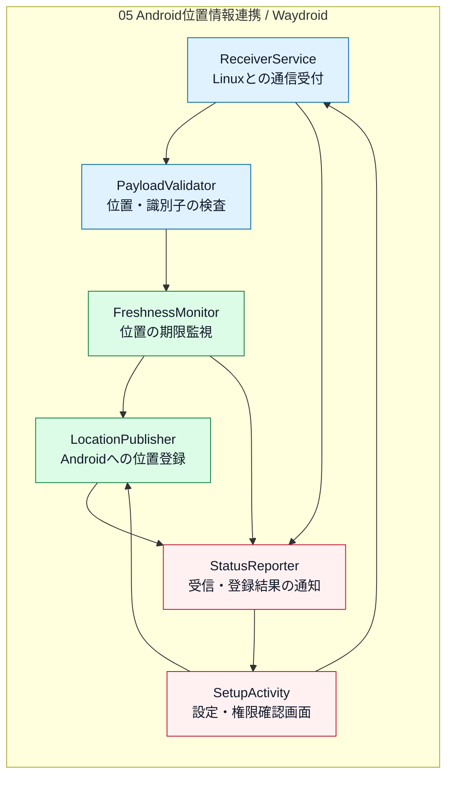
```mermaid
flowchart TB
 subgraph SW05["05 Android位置情報連携 / Waydroid"]
  direction TB
  R["ReceiverService<br/>Linuxとの通信受付"]
  V["PayloadValidator<br/>位置・識別子の検査"]
  F["FreshnessMonitor<br/>位置の期限監視"]
  L["LocationPublisher<br/>Androidへの位置登録"]
  S["StatusReporter<br/>受信・登録結果の通知"]
  U["SetupActivity<br/>設定・権限確認画面"]
  R --> V
  V --> F
  F --> L
  L --> S
  R --> S
  F --> S
  U --> R
  U --> L
  S --> U
 end
 classDef comm fill:#e0f2fe,stroke:#0369a1,color:#111827
 classDef logic fill:#dcfce7,stroke:#15803d,color:#111827
 classDef view fill:#fff1f2,stroke:#be123c,color:#111827
 class R,V comm
 class F,L logic
 class S,U view
```

| 接続 | 渡す情報 |
| --- | --- |
| ReceiverService → PayloadValidator | 認証済み通信で届いた本文と接続識別子 |
| PayloadValidator → FreshnessMonitor | 検査済み位置と送信時年齢 |
| FreshnessMonitor → LocationPublisher | 期限付き位置または期限切れ通知 |
| LocationPublisher → StatusReporter | 登録・無効化のAPI結果。OsmAnd読取結果ではない |
| SetupActivity → ReceiverService / LocationPublisher | 検査済み設定と開始停止操作。画面から座標を継続生成しない |

<a id="dd-feature-flows"></a>

### 3.2 機能別処理フローチャート

正常経路と失敗経路を分け、権限の不足や位置の失効で何を停止するかを示す。

<a id="dd-feature-1"></a>

#### 3.2.1 設定・権限の確認（ABR-F01）

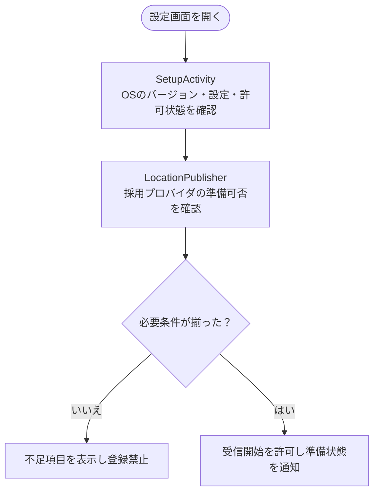
```mermaid
flowchart TB
 A(["設定画面を開く"]) --> B["SetupActivity<br/>OSのバージョン・設定・許可状態を確認"]
 B --> C["LocationPublisher<br/>採用プロバイダの準備可否を確認"]
 C --> D{"必要条件が揃った？"}
 D -->|"いいえ"| E["不足項目を表示し登録禁止"]
 D -->|"はい"| F["受信開始を許可し準備状態を通知"]
```

<a id="dd-feature-2"></a>

#### 3.2.2 Linuxとの接続受付（ABR-F02）

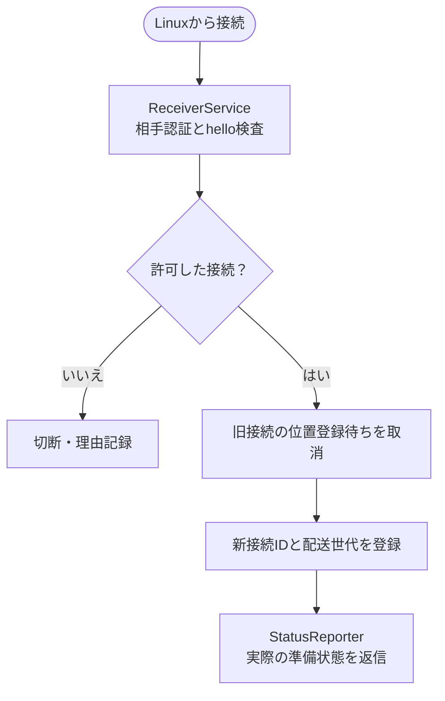
```mermaid
flowchart TB
 A(["Linuxから接続"]) --> B["ReceiverService<br/>相手認証とhello検査"]
 B --> C{"許可した接続？"}
 C -->|"いいえ"| D["切断・理由記録"]
 C -->|"はい"| E["旧接続の位置登録待ちを取消"]
 E --> F["新接続IDと配送世代を登録"]
 F --> G["StatusReporter<br/>実際の準備状態を返信"]
```

<a id="dd-feature-3"></a>

#### 3.2.3 位置データの検査（ABR-F03）

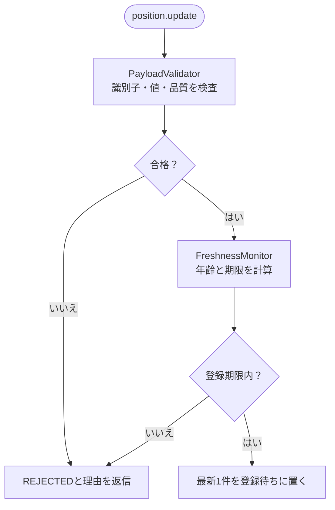
```mermaid
flowchart TB
 A(["position.update"]) --> B["PayloadValidator<br/>識別子・値・品質を検査"]
 B --> C{"合格？"}
 C -->|"いいえ"| D["REJECTEDと理由を返信"]
 C -->|"はい"| E["FreshnessMonitor<br/>年齢と期限を計算"]
 E --> F{"登録期限内？"}
 F -->|"いいえ"| D
 F -->|"はい"| G["最新1件を登録待ちに置く"]
```

<a id="dd-feature-4"></a>

#### 3.2.4 Androidへの位置登録（ABR-F04）

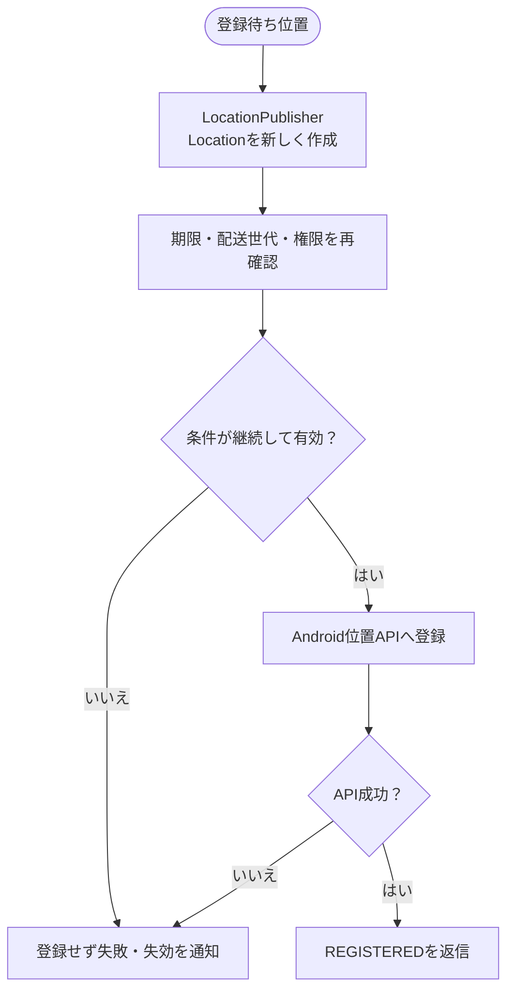
```mermaid
flowchart TB
 A(["登録待ち位置"]) --> B["LocationPublisher<br/>Locationを新しく作成"]
 B --> C["期限・配送世代・権限を再確認"]
 C --> D{"条件が継続して有効？"}
 D -->|"いいえ"| E["登録せず失敗・失効を通知"]
 D -->|"はい"| F["Android位置APIへ登録"]
 F --> G{"API成功？"}
 G -->|"いいえ"| E
 G -->|"はい"| H["REGISTEREDを返信"]
```

<a id="dd-feature-5"></a>

#### 3.2.5 失効・権限取消への対応（ABR-F05）

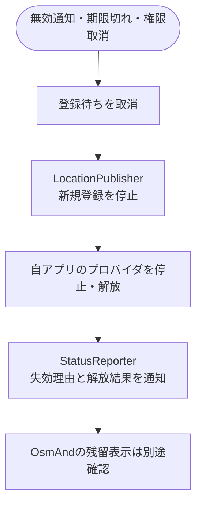
```mermaid
flowchart TB
 A(["無効通知・期限切れ・権限取消"]) --> B["登録待ちを取消"]
 B --> C["LocationPublisher<br/>新規登録を停止"]
 C --> D["自アプリのプロバイダを停止・解放"]
 D --> E["StatusReporter<br/>失効理由と解放結果を通知"]
 E --> F["OsmAndの残留表示は別途確認"]
```

<a id="dd-feature-6"></a>

#### 3.2.6 状態確認と終了（ABR-F06）

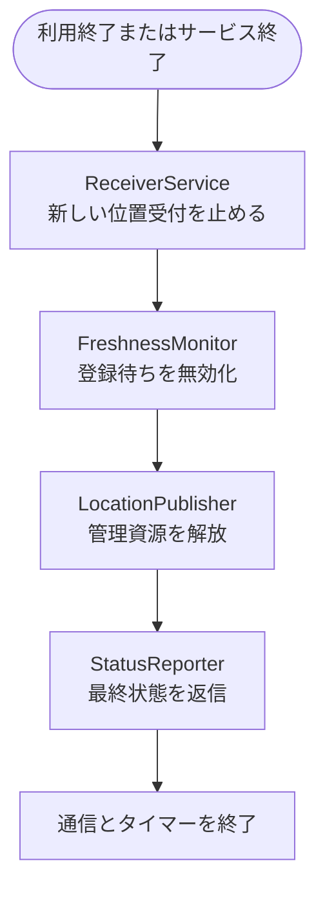
```mermaid
flowchart TB
 A(["利用終了またはサービス終了"]) --> B["ReceiverService<br/>新しい位置受付を止める"]
 B --> C["FreshnessMonitor<br/>登録待ちを無効化"]
 C --> D["LocationPublisher<br/>管理資源を解放"]
 D --> E["StatusReporter<br/>最終状態を返信"]
 E --> F["通信とタイマーを終了"]
```

<a id="dd-module-tree"></a>

### 3.3 モジュールツリー

```text
location_bridge
+-- ReceiverService
|   +-- accept_session / receive_frame
|   +-- handle_invalidate / stop_receiver
+-- PayloadValidator
|   +-- validate_update
+-- FreshnessMonitor
|   +-- compute_deadline / expire_position
+-- LocationPublisher
|   +-- prepare_provider
|   +-- build_location / register_latest
|   +-- release_provider
+-- StatusReporter
|   +-- report_result / build_status
+-- SetupActivity
    +-- check_setup / apply_settings
```

受信データの型・設定型は共通ファイルへ置くが、それ自体を独立した動作モジュールにはしない。

<a id="dd-sequence"></a>

### 3.4 モジュール間の処理順序

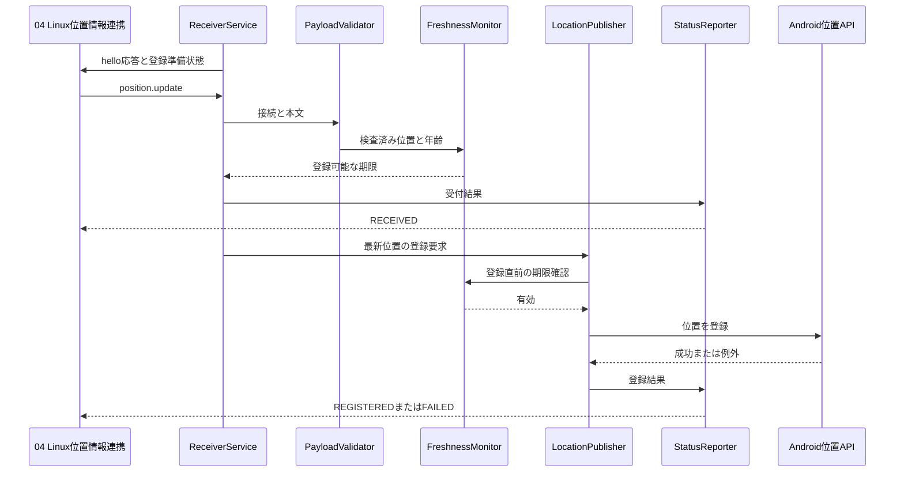
```mermaid
sequenceDiagram
 participant B as 04 Linux位置情報連携
 participant R as ReceiverService
 participant V as PayloadValidator
 participant F as FreshnessMonitor
 participant L as LocationPublisher
 participant S as StatusReporter
 participant A as Android位置API
 R->>B: hello応答と登録準備状態
 B->>R: position.update
 R->>V: 接続と本文
 V->>F: 検査済み位置と年齢
 F-->>R: 登録可能な期限
 R->>S: 受付結果
 S-->>B: RECEIVED
 R->>L: 最新位置の登録要求
 L->>F: 登録直前の期限確認
 F-->>L: 有効
 L->>A: 位置を登録
 A-->>L: 成功または例外
 L->>S: 登録結果
 S-->>B: REGISTEREDまたはFAILED
```

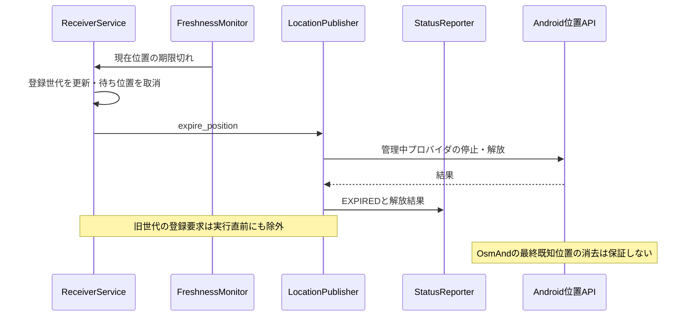
```mermaid
sequenceDiagram
 participant R as ReceiverService
 participant F as FreshnessMonitor
 participant L as LocationPublisher
 participant S as StatusReporter
 participant A as Android位置API
 F->>R: 現在位置の期限切れ
 R->>R: 登録世代を更新・待ち位置を取消
 R->>L: expire_position
 L->>A: 管理中プロバイダの停止・解放
 A-->>L: 結果
 L->>S: EXPIREDと解放結果
 Note over R,L: 旧世代の登録要求は実行直前にも除外
 Note over A: OsmAndの最終既知位置の消去は保証しない
```

<a id="dd-modules"></a>

### 3.5 モジュール詳細

登録待ちと無効化を共通の直列処理経路で扱う。通信I/O・画面処理・タイマーからLocationPublisherを無秩序に同時呼出ししない。

<a id="dd-module-1"></a>

#### 3.5.1 ReceiverService（通信受付）

| 項目 | 内容 |
| --- | --- |
| 入力 | 04 Linux位置情報連携の認証済み接続、位置更新、無効化、停止要求 |
| 出力 | 検査要求、登録要求、受信結果、接続状態 |
| 保持情報 | 自boot_id、peer_boot_id、connection_id、delivery_epoch、最終tx_sequence、登録待ち1件 |
| 処理 | TCP受信はUIスレッド外。上限付きフレームを復号し、状態変更を1つの処理経路へ渡す |
| 関数 | accept_session、receive_frame、handle_invalidate、stop_receiver |
| 異常時 | 不正フレーム・認証失敗・切断で新規登録を停止。必要な失効処理を実行 |

<a id="dd-module-2"></a>

#### 3.5.2 PayloadValidator（入力検査）

| 項目 | 内容 |
| --- | --- |
| 入力 | 位置本文、通信識別子、採用能力・設定 |
| 出力 | ValidatedUpdateまたは拒否理由 |
| 保持情報 | 元通知の起動IDと連番、既知の要求結果の有界履歴 |
| 処理 | 値・品質・期限情報と識別子を検査。重複は再登録せず、既知の応答だけを返す |
| 関数 | validate_update |
| 異常時 | 不正値を丸めて正常化しない。無効速度・方位を前回値で埋めない |

<a id="dd-module-3"></a>

#### 3.5.3 FreshnessMonitor（測定年齢と期限監視）

| 項目 | 内容 |
| --- | --- |
| 入力 | 04 Linux位置情報連携送信時年齢、区間遅延上限、Android受信経過時刻、測定有効期間 |
| 出力 | 位置の失効期限、期限切れイベント |
| 保持情報 | 現在位置参照、deadline_elapsed_ns、元測定のUTC、計算時の遅延契約 |
| 処理 | Androidの経過時間時計で監視し、Linux側の単調時刻を直接比較しない |
| 関数 | compute_deadline、expire_position |
| 異常時 | 時計・遅延条件が不明なら登録禁止。新しいstatus通知で位置期限を延長しない |

<a id="dd-module-4"></a>

#### 3.5.4 LocationPublisher（Androidへの位置登録）

| 項目 | 内容 |
| --- | --- |
| 入力 | ValidatedUpdate、登録期限、現在接続と登録世代、停止要求 |
| 出力 | API登録結果、プロバイダ状態、失敗理由 |
| 保持情報 | 管理対象provider名、実際の準備状態、登録済み位置参照 |
| 処理 | 登録ごとに新しいLocationを作る。登録直前の期限・権限・世代を確認する |
| 関数 | prepare_provider、build_location、register_latest、release_provider |
| 異常時 | SecurityException等を分類して登録停止。デフォルト位置0,0を送らない |

<a id="dd-module-5"></a>

#### 3.5.5 StatusReporter（登録結果と状態通知）

| 項目 | 内容 |
| --- | --- |
| 入力 | 受信結果、登録結果、失効、権限状態、接続状態 |
| 出力 | bridge.ack、bridge.status、設定画面表示用状態 |
| 保持情報 | 05 Android位置情報連携の状態連番、最新状態1件、既知の要求結果の有界履歴 |
| 処理 | 04 Linux位置情報連携へ元要求識別子を付けて返信。位置有効性とサービス稼働を別項目にする |
| 関数 | report_result、build_status |
| 異常時 | 切断後の応答を新接続へ流し込まない。復旧時は現在状態を新しく通知 |

<a id="dd-module-6"></a>

#### 3.5.6 SetupActivity（設定・権限確認画面）

| 項目 | 内容 |
| --- | --- |
| 入力 | 利用者操作、Androidの許可状態、StatusReporterの状態 |
| 出力 | 設定変更要求、準備チェック結果、開始停止要求 |
| 保持情報 | 表示中の設定案。確定設定と編集中の値を分ける |
| 処理 | 必要設定と状態を日本語で表示。権限はOSの正規の設定画面で利用者が許可する |
| 関数 | check_setup、apply_settings |
| 異常時 | 不正な設定を保存しない。画面を閉じるだけでは位置サービスを無条件停止しない |

<a id="dd-files"></a>

### 3.6 ファイル構成

```text
src/android/location_bridge/
+-- app/src/main/AndroidManifest.xml
+-- app/src/main/java/<package>/
|   +-- ReceiverService.kt
|   +-- PayloadValidator.kt
|   +-- FreshnessMonitor.kt
|   +-- LocationPublisher.kt
|   +-- StatusReporter.kt
|   +-- SetupActivity.kt
|   +-- protocol/BridgeMessage.kt
|   +-- protocol/FrameCodec.kt
|   +-- model/ValidatedUpdate.kt
|   +-- model/BridgeState.kt
|   +-- settings/BridgeSettings.kt
+-- app/src/main/res/                設定画面と日本語表示
+-- app/src/test/                    値・順序・期限の単体試験
+-- app/src/androidTest/             権限・API・サービスの実機試験
+-- build.gradle.kts                 採用バージョン確定後に作成
```

初期実装ではパッケージ名を`com.l880k.locationbridge`、minSdkを29、targetSdkを35、テスト用provider名を`l880k_test`とした。Waydroid採用イメージとの整合、署名、権限設定、認証鍵の配布は実機検証で確定する。資格情報はアプリ専用領域で管理し、署名鍵や認証鍵をソース配置に含めない。

<a id="dd-function-flows"></a>

### 3.7 関数のフローチャート

OS通知で処理が再開した場合にも現在の許可・接続・期限を確認する。コールバックが届いた順番だけで位置を有効にしない。

<a id="dd-fn-check-setup"></a>

#### 3.7.1 check_setup（導入と許可状態を確認する）

| 項目 | 内容 |
| --- | --- |
| 入力 | OS情報、設定、許可状態 |
| 戻り値・結果 | 不足項目一覧または準備可能 |

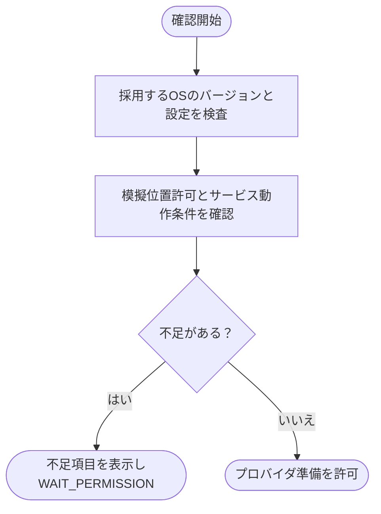
```mermaid
flowchart TB
 A(["確認開始"]) --> B["採用するOSのバージョンと設定を検査"]
 B --> C["模擬位置許可とサービス動作条件を確認"]
 C --> D{"不足がある？"}
 D -->|"はい"| E(["不足項目を表示しWAIT_PERMISSION"])
 D -->|"いいえ"| F(["プロバイダ準備を許可"])
```

<a id="dd-fn-prepare-provider"></a>

#### 3.7.2 prepare_provider（位置登録経路を準備する）

| 項目 | 内容 |
| --- | --- |
| 入力 | 承認済み設定と許可状態 |
| 戻り値・結果 | 準備済みproviderまたは失敗 |

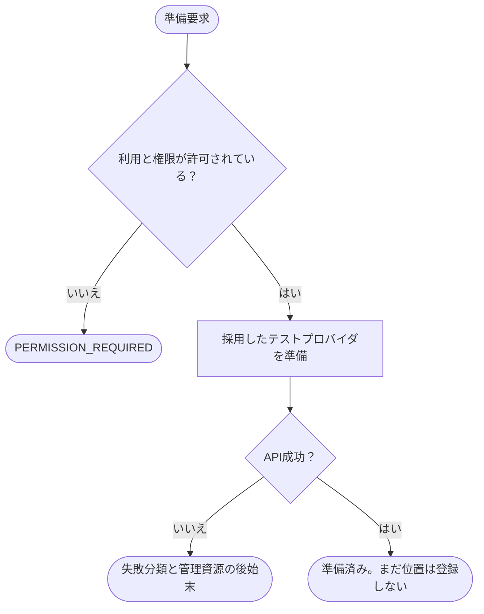
```mermaid
flowchart TB
 A(["準備要求"]) --> B{"利用と権限が許可されている？"}
 B -->|"いいえ"| C(["PERMISSION_REQUIRED"])
 B -->|"はい"| D["採用したテストプロバイダを準備"]
 D --> E{"API成功？"}
 E -->|"いいえ"| F(["失敗分類と管理資源の後始末"])
 E -->|"はい"| G(["準備済み。まだ位置は登録しない"])
```

<a id="dd-fn-accept-session"></a>

#### 3.7.3 accept_session（接続を採用する）

| 項目 | 内容 |
| --- | --- |
| 入力 | 相手認証結果、hello |
| 戻り値・結果 | 接続状態と能力応答 |

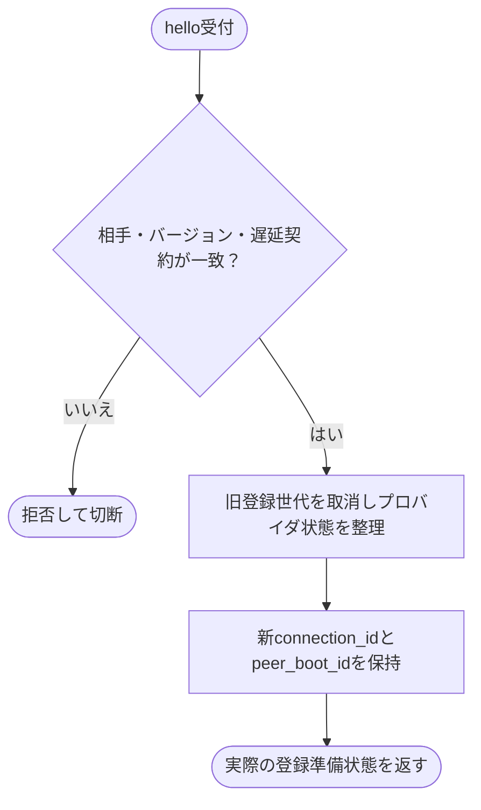
```mermaid
flowchart TB
 A(["hello受付"]) --> B{"相手・バージョン・遅延契約が一致？"}
 B -->|"いいえ"| C(["拒否して切断"])
 B -->|"はい"| D["旧登録世代を取消しプロバイダ状態を整理"]
 D --> E["新connection_idとpeer_boot_idを保持"]
 E --> F(["実際の登録準備状態を返す"])
```

<a id="dd-fn-validate-update"></a>

#### 3.7.4 validate_update（値と配送順序を検査する）

| 項目 | 内容 |
| --- | --- |
| 入力 | 位置更新、現在セッション |
| 戻り値・結果 | 検査済み位置・既知結果・拒否 |

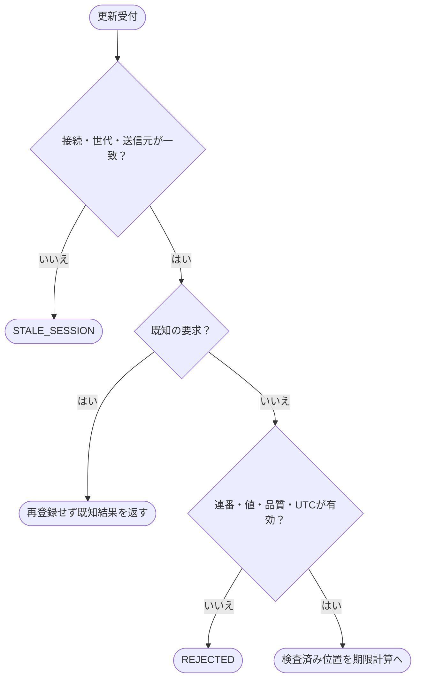
```mermaid
flowchart TB
 A(["更新受付"]) --> B{"接続・世代・送信元が一致？"}
 B -->|"いいえ"| X(["STALE_SESSION"])
 B -->|"はい"| C{"既知の要求？"}
 C -->|"はい"| D(["再登録せず既知結果を返す"])
 C -->|"いいえ"| E{"連番・値・品質・UTCが有効？"}
 E -->|"いいえ"| F(["REJECTED"])
 E -->|"はい"| G(["検査済み位置を期限計算へ"])
```

<a id="dd-fn-compute-deadline"></a>

#### 3.7.5 compute_deadline（測定からの残り期限を計算する）

| 項目 | 内容 |
| --- | --- |
| 入力 | 送信時年齢、遅延上限、Android受信時刻 |
| 戻り値・結果 | 失効時刻またはEXPIRED |

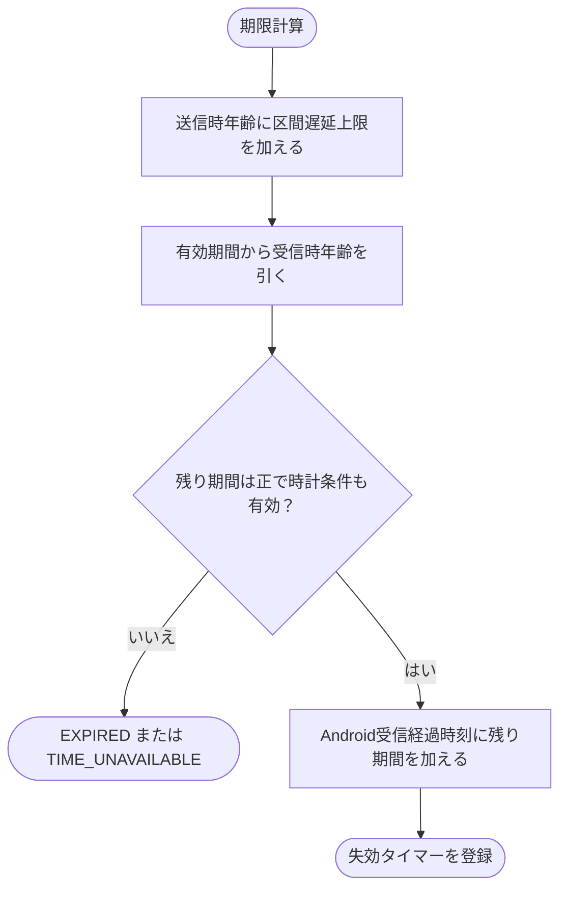
```mermaid
flowchart TB
 A(["期限計算"]) --> B["送信時年齢に区間遅延上限を加える"]
 B --> C["有効期間から受信時年齢を引く"]
 C --> D{"残り期間は正で時計条件も有効？"}
 D -->|"いいえ"| E(["EXPIRED または TIME_UNAVAILABLE"])
 D -->|"はい"| F["Android受信経過時刻に残り期間を加える"]
 F --> G(["失効タイマーを登録"])
```

<a id="dd-fn-build-location"></a>

#### 3.7.6 build_location（Android位置データを組み立てる）

| 項目 | 内容 |
| --- | --- |
| 入力 | 検査済み位置、登録直前年齢 |
| 戻り値・結果 | 新しいLocationまたは時刻変換失敗 |

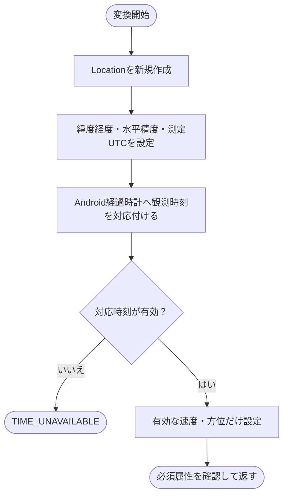
```mermaid
flowchart TB
 A(["変換開始"]) --> B["Locationを新規作成"]
 B --> C["緯度経度・水平精度・測定UTCを設定"]
 C --> D["Android経過時計へ観測時刻を対応付ける"]
 D --> E{"対応時刻が有効？"}
 E -->|"いいえ"| F(["TIME_UNAVAILABLE"])
 E -->|"はい"| G["有効な速度・方位だけ設定"]
 G --> H(["必須属性を確認して返す"])
```

<a id="dd-fn-register-latest"></a>

#### 3.7.7 register_latest（最新位置をAndroidへ登録する）

| 項目 | 内容 |
| --- | --- |
| 入力 | 登録待ち1件、世代、期限 |
| 戻り値・結果 | REGISTERED / REJECTED / FAILED |

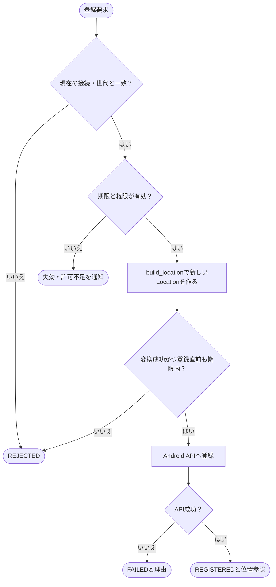
```mermaid
flowchart TB
 A(["登録要求"]) --> B{"現在の接続・世代と一致？"}
 B -->|"いいえ"| X(["REJECTED"])
 B -->|"はい"| C{"期限と権限が有効？"}
 C -->|"いいえ"| Y(["失効・許可不足を通知"])
 C -->|"はい"| D["build_locationで新しいLocationを作る"]
 D --> E{"変換成功かつ登録直前も期限内？"}
 E -->|"いいえ"| X
 E -->|"はい"| F["Android APIへ登録"]
 F --> G{"API成功？"}
 G -->|"いいえ"| H(["FAILEDと理由"])
 G -->|"はい"| I(["REGISTEREDと位置参照"])
```

<a id="dd-fn-handle-invalidate"></a>

#### 3.7.8 handle_invalidate（無効通知を適用する）

| 項目 | 内容 |
| --- | --- |
| 入力 | 新配送世代、無効理由、最後の位置参照 |
| 戻り値・結果 | INVALIDATEDまたは拒否 |

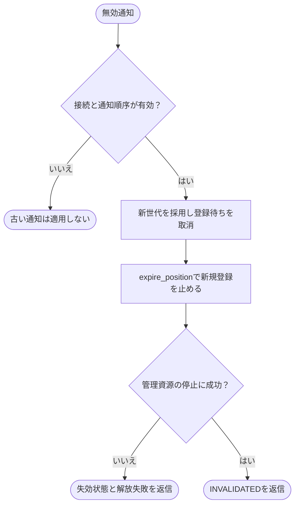
```mermaid
flowchart TB
 A(["無効通知"]) --> B{"接続と通知順序が有効？"}
 B -->|"いいえ"| C(["古い通知は適用しない"])
 B -->|"はい"| D["新世代を採用し登録待ちを取消"]
 D --> E["expire_positionで新規登録を止める"]
 E --> F{"管理資源の停止に成功？"}
 F -->|"いいえ"| G(["失効状態と解放失敗を返信"])
 F -->|"はい"| H(["INVALIDATEDを返信"])
```

<a id="dd-fn-expire-position"></a>

#### 3.7.9 expire_position（期限切れ位置の登録を止める）

| 項目 | 内容 |
| --- | --- |
| 入力 | 位置参照、現在時刻または失効理由 |
| 戻り値・結果 | 失効状態と資源解放結果 |

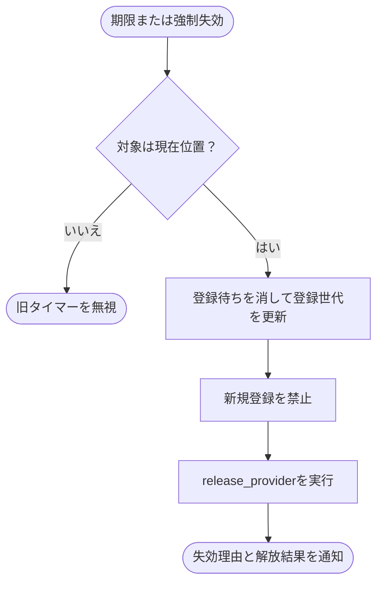
```mermaid
flowchart TB
 A(["期限または強制失効"]) --> B{"対象は現在位置？"}
 B -->|"いいえ"| C(["旧タイマーを無視"])
 B -->|"はい"| D["登録待ちを消して登録世代を更新"]
 D --> E["新規登録を禁止"]
 E --> F["release_providerを実行"]
 F --> G(["失効理由と解放結果を通知"])
```

<a id="dd-fn-report-result"></a>

#### 3.7.10 report_result（受信と登録結果を返信する）

| 項目 | 内容 |
| --- | --- |
| 入力 | 結果、元要求の全識別子 |
| 戻り値・結果 | 応答または送信不可記録 |

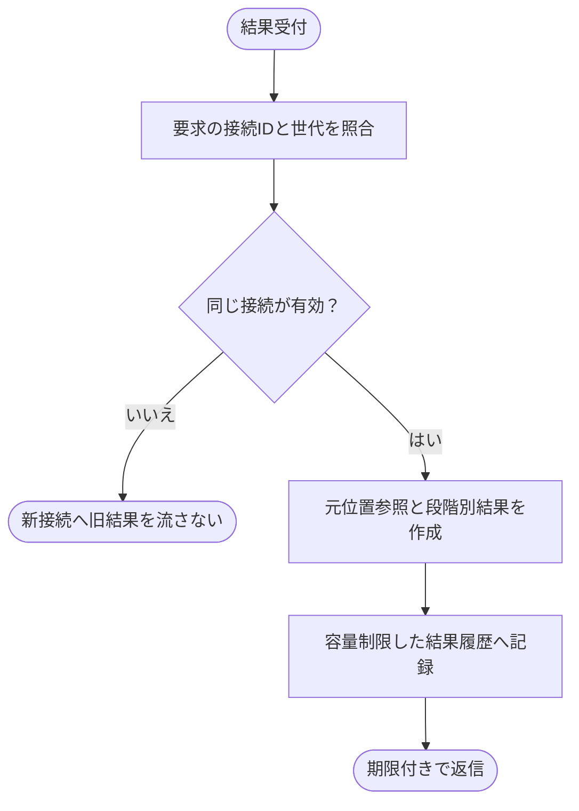
```mermaid
flowchart TB
 A(["結果受付"]) --> B["要求の接続IDと世代を照合"]
 B --> C{"同じ接続が有効？"}
 C -->|"いいえ"| D(["新接続へ旧結果を流さない"])
 C -->|"はい"| E["元位置参照と段階別結果を作成"]
 E --> F["容量制限した結果履歴へ記録"]
 F --> G(["期限付きで返信"])
```

<a id="dd-fn-build-status"></a>

#### 3.7.11 build_status（現在の連携状態を作る）

| 項目 | 内容 |
| --- | --- |
| 入力 | 実際のサービス・権限・位置・provider状態 |
| 戻り値・結果 | bridge.statusと設定画面用情報 |

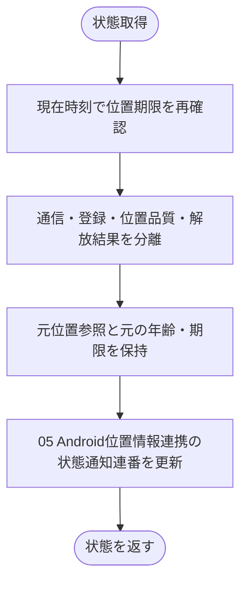
```mermaid
flowchart TB
 A(["状態取得"]) --> B["現在時刻で位置期限を再確認"]
 B --> C["通信・登録・位置品質・解放結果を分離"]
 C --> D["元位置参照と元の年齢・期限を保持"]
 D --> E["05 Android位置情報連携の状態通知連番を更新"]
 E --> F(["状態を返す"])
```

<a id="dd-fn-stop-receiver"></a>

#### 3.7.12 stop_receiver（受信アプリの動作を終了する）

| 項目 | 内容 |
| --- | --- |
| 入力 | 停止要求と終了期限 |
| 戻り値・結果 | 停止結果 |

```mermaid
flowchart TB
 A(["終了要求"]) --> B["新しい接続・更新を受付停止"]
 B --> C["登録世代を更新し待ち位置を破棄"]
 C --> D["プロバイダ停止と結果通知を期限付き実行"]
 D --> E["通信・タイマー・サービス資源を解放"]
 E --> F(["保存位置を残さず終了"])
```

<a id="dd-4"></a>

## 4. インターフェース設計


<a id="dd-interface-diagrams"></a>

### 4.1 外部ソフトとAndroid APIの接続

```mermaid
flowchart TB
 subgraph SW02["02 Waydroidナビ管理 / Linux"]
  N["NavigationSupervisor"]
  A["AppLauncher"]
  N --> A
 end
 subgraph SW04["04 Linux位置情報連携 / Linux"]
  T["BridgeTransport"]
  H["HealthPublisher"]
  T --> H
 end
 subgraph SW05["05 Android位置情報連携 / Waydroid"]
  R["ReceiverService"]
  L["LocationPublisher"]
  S["StatusReporter"]
  R --> L
  L --> S
 end
 subgraph ANDROID["Android標準機能・利用アプリ"]
  M["LocationManager<br/>テスト位置プロバイダ"]
  O["OsmAnd"]
  M --> O
 end
 N --> T
 T --> R
 S --> T
 H --> N
 A -.-> R
 A -.-> O
 L --> M
```

実線は位置・状態・利用要求、点線はアプリの起動確認を表す。NavigationSupervisorは位置を再計算しない。05 Android位置情報連携の登録状態は04 Linux位置情報連携のHealthPublisherを通してNavigationSupervisorへ届ける。

[02 Waydroidナビ管理](02_Waydroidナビ管理.md#dd-4)のAppLauncherはアプリの起動・終了、LocationPublisherは位置APIへの登録を担当する。OsmAndが採用プロバイダを読むことは導入試験で確認する。

<a id="dd-wire-contract"></a>

### 4.2 受信メッセージと応答

通信形式・識別子の共通定義は[04 Linux位置情報連携の通信契約](04_Linux位置情報連携.md#dd-wire-contract)を参照する。第一候補は相互認証付きTCP、4バイト本文長とUTF-8 JSON。05 Android位置情報連携は待受を行い、認証前の位置を受理しない。

| 受信内容 | 確認・応答 |
| --- | --- |
| bridge.hello | バージョン、双方boot_id、connection_id、遅延契約ID、位置形式を確認。05 Android位置情報連携の推定対応と実際の登録準備状態を返す |
| position.update | bridge_boot_id、receiver_boot_id、connection_id、delivery_epoch、tx_sequenceと03 現在地補正のsource / boot_id / sequenceを別々に検査 |
| position.invalidate | 新配送世代を採用して旧位置待ちを取消。登録停止・管理プロバイダの停止結果を返す |
| bridge.ping | 生存応答のみ。現在位置の有効期間は更新しない |
| bridge.ack | 元要求の全配送識別子と元位置参照、処理段階、理由を返す |
| bridge.status | 自boot_id・状態連番、接続・登録・位置期限・プロバイダ状態を返す |

RECEIVEDは検査を通った要求の受付確認。REGISTEREDはLocation APIの成功、INVALIDATEDは本アプリの無効化処理成功であり、OsmAndの表示更新・消去を保証する応答ではない。許可不足はREJECTED、API例外はFAILEDとして理由を区別する。

同一要求の重複では登録処理を再実行せず既知結果を返す。古い世代・古い接続の応答は現在の位置状態へ反映しない。元通知の新しいstatusは位置の測定連番や期限を更新しない。

<a id="dd-location-api"></a>

### 4.3 Androidの位置データへの変換

| 元データ | Android Locationへの設定・扱い |
| --- | --- |
| latitude_deg / longitude_deg | latitude / longitude。値とWGS84の意味を保持 |
| horizontal_accuracy_m | accuracy。03 現在地補正の精度をそのまま使用し、都合の良い固定値へ変更しない |
| observed_at_utc | timeへ測定UTCのミリ秒を設定。受信時刻に付け替えない |
| age_ms_at_send と遅延・待ち時間 | AndroidのelapsedRealtimeNanosを基準に観測時刻を対応付ける。5.2の規則を使用 |
| speed_valid=true | speedにm/s。falseなら属性を設定せず前回値を引き継がない |
| bearing_valid=true | bearingに移動方位。falseなら属性なし。車体向きへ置換しない |
| method / validity / publishable | 登録可否と状態通知に使用。推定値を実測GPSと表示させるために情報を消さない |
| 標高・速度精度等の未定義項目 | 値を捏造せず設定しない |

Locationの測定UTC・経過時間・精度等の必要属性を満たす。accuracyは68%水平誤差半径というAPIの意味に合わせ、採用した03 現在地補正の出力契約がその意味を満たすことを確認する。[Android Location仕様](https://developer.android.com/reference/android/location/Location)

位置登録にはaddTestProvider、setTestProviderEnabled、setTestProviderLocation等を用いる案。ここでいうproviderは、Androidが位置情報を受け取る登録先を指す。模擬位置の利用許可が必要で、登録位置には模擬位置の識別が残る。setTestProviderStatusによる失効通知には依存しない。管理中プロバイダだけを解放対象とする。[Android LocationManager仕様](https://developer.android.com/reference/android/location/LocationManager)

初期実装のprovider名は`l880k_test`とした。実機では同名プロバイダの残留・他アプリとの競合・OsmAnd側の選択条件を確認して確定する。Android全体で使用中の標準プロバイダ名を根拠なく置換しない。

<a id="dd-setup-ui"></a>

### 4.4 設定画面と操作

| 表示項目・操作 | 内容 |
| --- | --- |
| 導入状態 | Waydroid/Androidのバージョン、アプリのバージョン、採用プロバイダ、設定プロファイル |
| 許可状態 | 模擬位置設定と必要権限、サービス動作条件を個別表示 |
| 接続状態（`transport_status`） | 未接続・接続中・認証失敗・バージョン不一致を表示。秘密鍵は表示しない |
| 現在位置の状態（`data_validity` / `provider_status`） | 受信時刻ではなく測定年齢、GPS/推定、登録済み・失効・拒否理由を表示する。`REGISTERED`だけでOsmAndの表示反映済みとは扱わない |
| 開始 / 停止 | 利用要求としてReceiverServiceへ渡す。実際の動作結果を待って表示を更新 |
| 設定適用 | 入力検査後に保存し、新接続・新登録世代で再開 |
| OS設定を開く | 利用者が正規の権限設定を確認する。自動的な許可変更は行わない |

設定画面を閉じる操作とサービス停止は区別する。通信待ちや位置API呼出しで画面を止めない。運用画面で緯度経度の履歴を常時保存する機能は設けない。

<a id="dd-5"></a>

## 5. データ・設定設計


<a id="dd-data"></a>

### 5.1 保持情報と永続化

| データ | 保持先・扱い |
| --- | --- |
| ReceiverSession | メモリ。双方起動ID、接続ID、配送世代、最後の受信連番 |
| PendingLocation | メモリ最新1件。新更新・無効化・停止で置換または破棄 |
| RegisteredLocationRef | メモリ。位置参照、測定時刻、期限。再起動後は復元しない |
| ProviderState | メモリ。準備状態、管理中provider、解放失敗理由 |
| BridgeSettings | アプリ専用領域。接続・能力・検査上限。秘密情報は別管理 |
| KnownResults | 件数・時間制限した応答履歴。現在接続にだけ対応 |
| 資格情報 | Androidの利用可能な鍵保管機構とアプリ専用領域を使用。公開Git・共有ストレージへ出さない |

<a id="dd-freshness"></a>

### 5.2 測定時刻と期限の扱い

```text
age_at_receive_ms = age_at_04_send_ms + bridge_delay_bound_ms
deadline_elapsed_ns = elapsed_receive_ns
    + (effective_limit_ms - age_at_receive_ms) * 1_000_000

age_at_register_ms = age_at_receive_ms
    + (elapsed_register_ns - elapsed_receive_ns) / 1_000_000

location_elapsed_ns = elapsed_register_ns
    - age_at_register_ms * 1_000_000
```

effective_limit_msは元の有効期間とAndroid側上限の小さい方。受信時点ですでに期限切れなら登録しない。location_elapsed_nsが0以下になるなど対応が成立しない場合も拒否する。Linuxの単調時計値はこの計算へ直接入れない。

この対応時刻は、伝送遅延の上限を使った保守的な時刻として扱う。実際の観測時刻とのずれを含むため、採用Android API・OsmAndで許容されるかを確認する。UTC不明、時計の不連続、遅延契約不成立ではTIME_UNAVAILABLEとし、現在時刻を測定UTCとして捏造しない。

画面更新、ping、ACK、サービス生存通知ではdeadline_elapsed_nsを延長しない。期限監視はネットワーク読取の完了待ちに依存させない。Androidの休止・再開後も経過時間で再検査し、再開時に古い位置を登録しない。

<a id="dd-config"></a>

### 5.3 設定と適用条件

| 設定 | 検査・初期方針 |
| --- | --- |
| enabled | 実機方式未承認ならfalse |
| provider_name / provider_profile | 初期値は`l880k_test`。影響範囲とOsmAnd読取試験済みの組合せだけ許可 |
| allow_dead_reckoning | 初期false。03 現在地補正・04 Linux位置情報連携の許可と推定対応が揃った場合のみ有効 |
| trusted_peer / credentials | 04 Linux位置情報連携の認証設定。相手変更時は旧接続と位置を無効化 |
| max_frame_bytes / read_timeout_ms | 必須有限上限。本文長を確認してから確保 |
| bridge_delay_bound_ms / max_position_age_ms | T.B.D。04 Linux位置情報連携と共通の検証済み契約IDで一致させる |
| minSdk / targetSdk / service_type | 採用するAndroidのバージョンと実際の処理内容で確定 |
| shutdown_timeout_ms / timer_resolution_ms | T.B.D。期限監視と終了の遅れを測定し受入上限を設定 |

設定だけを保存し、最新位置の永続化は行わない。新設定で期限が短くなった場合は即再判定し、古い長い期限を維持しない。

<a id="dd-6"></a>

## 6. 処理・状態遷移


<a id="dd-states"></a>

### 6.1 登録状態

```mermaid
stateDiagram-v2
 [*] --> WAIT_PERMISSION
 WAIT_PERMISSION --> LISTENING: 必要条件成立
 LISTENING --> ACTIVE: 最新位置の登録成功
 ACTIVE --> ACTIVE: 新しい有効位置を登録
 ACTIVE --> EXPIRED: 期限切れ・無効化・切断
 EXPIRED --> ACTIVE: 新しい有効位置と準備完了
 ACTIVE --> WAIT_PERMISSION: 許可取消
 LISTENING --> WAIT_PERMISSION: 許可不足
 ACTIVE --> FAULT: API異常
 FAULT --> LISTENING: 復旧確認
 LISTENING --> STOPPING: 終了
 ACTIVE --> STOPPING: 終了
 EXPIRED --> STOPPING: 終了
 WAIT_PERMISSION --> STOPPING: 終了
 FAULT --> STOPPING: 終了
 STOPPING --> [*]
```

LISTENINGは受信可能、ACTIVEは期限内の登録成功状態。接続状態とプロバイダ準備状態は別データで持つ。EXPIREDから再開する場合もprepare_providerを含めて再確認し、失効前のLocationを再使用しない。

<a id="dd-races"></a>

### 6.2 登録と取消が競合した場合

無効化・停止・権限取消を受けた時点で登録世代を進める。登録待ちデータには受理時の世代を保存し、実行直前に一致を確認する。

API呼出し開始後に無効化が届いた場合、その登録を時間的に取り消せるとは仮定しない。完了直後に状態を再確認して失効処理を実行し、旧REGISTEREDでACTIVEへ復帰させない。外部アプリへ一瞬届く可能性と、期限監視が動ける最大遅延を実機試験で確認する。

タイマーは対象位置参照を含める。新しい位置を登録した後に古いタイマーが届いても、新位置を誤って失効させない。

<a id="dd-7"></a>

## 7. 異常処理

| 異常 | 登録と状態 | 復旧方針 |
| --- | --- | --- |
| 模擬位置許可なし・取消 | 新規登録禁止、WAIT_PERMISSION | 利用者の正規設定を確認。通常の位置権限だけで代用しない |
| 認証・バージョン・データ形式不一致 | 位置登録せず拒否 | 構成を修正。未知のメッセージを実行しない |
| UTC・年齢・座標が不正 | REJECTED、理由を返信 | 次の有効位置を待つ。0,0や現在時刻で埋めない |
| 無効通知・受信断・期限切れ | EXPIRED、管理providerの停止処理 | 新しい位置と準備条件が揃ってから再開 |
| 登録API例外 | FAILED、必要ならFAULT | 例外種別を分類し、無限再試行しない |
| プロバイダ解放失敗 | 登録禁止を維持しcleanup_failedを通知 | 成功を偽らず、権限・OS状態を確認 |
| サービス強制終了 | 状態通知が途絶える | 04 Linux位置情報連携・02 Waydroidナビ管理の監視でUNKNOWN。再起動後は空の状態から開始 |
| OsmAndに旧位置が残る | 本アプリは失効、表示は別問題 | 02 Waydroidナビ管理・01 カーナビUIで位置連携無効を示す。残留動作を受入試験 |

<a id="dd-8"></a>

## 8. 起動・終了・運用設計


<a id="dd-startup"></a>

### 8.1 アプリとサービスの起動

02 Waydroidナビ管理のAppLauncherでアプリの導入・起動を確認し、設定画面で必要条件を満たしてから受信サービスを開始する。起動だけで模擬位置権限を付与しない。

長時間受信にForeground Serviceを用いる場合は、処理内容に合った種別・権限・起動条件を採用するAndroidのバージョンで確認する。種別は制限回避のために選ばない。[Android Foreground Service種別](https://developer.android.com/develop/background-work/services/fgs/service-types)

Android 15以降を対象とするアプリでは、バックグラウンドのdataSync等に時間制限がある。常駐受信を無期限のdataSyncとして設計せず、採用方式の連続動作試験を行う。Foreground Service（利用者へ動作を通知しながら継続処理するAndroidサービス）の時間制限も確認する。[Android Foreground Serviceの時間制限](https://developer.android.com/develop/background-work/services/fgs/timeout)

通信はI/O用実行経路、設定画面はUI経路、登録と取消は直列の状態管理経路に分ける。実際のコルーチン構成とAndroidライフサイクルへの接続は採用バージョン確定後に実装する。

<a id="dd-shutdown"></a>

### 8.2 終了と再起動

1. 新しい位置・接続要求を停止する。
2. 登録世代を進め、待ち位置とタイマーを取り消す。
3. 新規登録を禁止し、管理しているプロバイダを停止・解放する。
4. 結果を期限内で04 Linux位置情報連携へ返し、通信を閉じる。
5. サービス資源を解放する。前回位置は保存しない。

onDestroy等の終了通知が必ず呼ばれるとは仮定しない。強制終了試験では04 Linux位置情報連携側の監視とOsmAnd残留位置を確認する。位置登録の仕組みが再起動後に残るかも採用イメージで検証し、所有していないproviderを無差別に削除する復旧処理は作らない。

<a id="dd-9"></a>

## 9. 試験・受入条件


<a id="dd-tests"></a>

### 9.1 単体・契約試験

| 試験ID / 機能 | 操作 | 受入条件 |
| --- | --- | --- |
| ABR-T01 / F01 | 許可なし・通常位置権限のみ・許可取消 | 模擬位置登録を成功扱いしない。不足を区別 |
| ABR-T02 / F02 | 偽接続、旧boot_id、対応しないバージョン | 位置を登録せず拒否 |
| ABR-T03 / F03 | 重複要求、旧世代、逆順更新 | 同じ位置を再登録せず古い状態に戻らない |
| ABR-T04 / F03 | NaN、範囲外、精度不正、速度/方位無効 | 不正拒否。任意属性の前回値が混ざらない |
| ABR-T05 / F04 | 異なるLinux/Android時計、UTC不明 | 直接時刻差を取らない。対応不能なら登録拒否 |
| ABR-T06 / F04 | API成功、API例外、登録中の取消 | REGISTEREDと失敗を区別。取消後にACTIVEへ戻らない |
| ABR-T07 / F05 | 通信待ち中の期限切れ・pingだけ継続 | 独立監視で失効。位置寿命を延長しない |
| ABR-T08 / F05 | provider解放の例外 | 位置登録禁止を維持し解放失敗を通知 |
| ABR-T09 / F06 | 再起動・画面再生成・OS休止復帰 | 旧位置を再注入しない。設定画面の再生成でサービスを重複起動しない |
| ABR-T10 / F02～F06 | 04 Linux位置情報連携と共通の契約試験データ | Python/Kotlinで識別子・拒否結果・期限判定が一致 |

<a id="dd-integration-tests"></a>

### 9.2 Waydroid・OsmAnd実機試験

| 確認項目 | 受入条件 |
| --- | --- |
| 位置の反映 | 停車中の試験で、指定した架空位置と移動列が採用OsmAndへ反映される |
| オフライン動作 | 地図を事前取得した状態でインターネットがなくても連携できる |
| 推定位置の扱い | 推定方法・精度・失効を自作ソフト側で保持。許可されない位置は登録しない |
| 失効表示 | 登録停止後のOsmAnd表示を記録し、01 カーナビUIに無効状態が届く |
| 長時間運用 | 採用サービス方式で必要時間継続し、停止条件・OS制限を確認 |
| 負荷と終了 | 4カメラ録画・ナビ同時条件で登録遅延、失効遅延、メモリ、終了時間が確定した上限内 |

REGISTERED応答だけで実機受入を合格にしない。採用バージョン・設定・操作・期待位置・実測遅延を試験記録に残す。本書作成時点では未実施。

<a id="dd-10"></a>

## 10. 未確定事項・実装課題

| 課題 | 確定する内容 |
| --- | --- |
| Androidのバージョン・SDK・署名 | 採用イメージ、minSdk / targetSdk、パッケージ名、配布署名 |
| 模擬位置登録方式 | provider名、既存providerへの影響、許可手順、OsmAndの受信条件 |
| 常駐方式 | Foreground Serviceの要否・正当な種別・起動制限と長時間動作 |
| 時刻対応 | 遅延上限を含む測定時刻の対応がAPI・OsmAndで成立する条件 |
| 無効化後の挙動 | キャッシュ位置とアプリ強制終了時の残留表示 |
| 通信と秘密管理 | 04 Linux位置情報連携と一致する認証、バージョン、フレーム制限、証明書更新方法 |

<a id="dd-glossary"></a>

## 用語の注釈

| 用語 | 意味 |
| --- | --- |
| テスト位置プロバイダ | Androidへ試験用位置を渡す経路。本設計では外部計算位置の受渡し候補 |
| 模擬位置 | GPS受信機そのものではなくアプリが登録した位置。識別を隠さない |
| Location | Androidが位置・精度・測定時刻などをまとめるデータ型 |
| Foreground Service | 利用者に動作を知らせながら処理を続けるAndroidサービス。無条件に常駐できるわけではない |
| 登録世代 | 取消前に受け付けた処理と取消後の処理を区別する内部番号 |
| 最終既知位置 | 位置更新が途絶えても利用アプリ等が保持している最後の位置 |
