# カメラ表示・録画 詳細設計書

| 項目 | 内容 |
| --- | --- |
| 文書ID | SW-DD-06 |
| 実行環境 | Pi 5 |
| 実装状態 | JPEG入力・MKV分割録画・UI表示・確定台帳連携を実装。実カメラ・Pi 5同時負荷は未検証 |
| 対象ソース | `src/raspberry_pi5/camera_service.py`、`camera/`、`ui/frame_presenter.py` |
| 作成日 | 2026-09-14 |
| 更新日 | 2026-09-26 |

[詳細設計一覧](README.md) / [共通仕様](00_共通仕様.md) / [上位設計](../ソフトウェア設計図.md#sec-42)

導入・起動方法と検証範囲は[付録8 カメラ表示・録画導入手順](../付録8_カメラ表示録画導入手順.md)に記載する。

## 目次

- [1. 目的・適用範囲](#dd-1)
- [2. 要求仕様・役割](#dd-2)
  - [2.1 機能一覧](#dd-functions)
  - [2.2 機能・モジュール・関数の対応](#dd-function-map)
- [3. 内部構成](#dd-3)
  - [3.1 モジュールの全体構成](#dd-overview)
  - [3.2 機能別処理フローチャート](#dd-feature-flows)
    - [3.2.1 4方向の映像取得（CAM-F01）](#dd-feature-1)
    - [3.2.2 UI・合成用の映像配信（CAM-F02）](#dd-feature-2)
    - [3.2.3 分割録画（CAM-F03）](#dd-feature-3)
    - [3.2.4 録画の確定と引き渡し（CAM-F04）](#dd-feature-4)
    - [3.2.5 異常監視と録画継続判断（CAM-F05）](#dd-feature-5)
    - [3.2.6 異常終了からの回復（CAM-F06）](#dd-feature-6)
    - [3.2.7 終了処理（CAM-F07）](#dd-feature-7)
  - [3.3 モジュールツリー](#dd-module-tree)
  - [3.4 モジュール間の処理順序](#dd-sequence)
  - [3.5 モジュール詳細](#dd-modules)
    - [3.5.1 CaptureAdapter（左右CSIカメラの取得）](#dd-module-1)
    - [3.5.2 StreamReceiver（前後サブコントローラの映像受信）](#dd-module-2)
    - [3.5.3 FrameDistributor（UIと合成処理への配信）](#dd-module-3)
    - [3.5.4 SegmentWriter（方向別の分割録画）](#dd-module-4)
    - [3.5.5 RecordingCatalog（録画台帳・回復・引き渡し）](#dd-module-5)
    - [3.5.6 HealthMonitor（入力・録画・保存領域の監視）](#dd-module-6)
  - [3.6 ファイル構成](#dd-files)
  - [3.7 関数のフローチャート](#dd-function-flows)
    - [3.7.1 open_local_camera（左右CSIカメラを開く）](#dd-fn-open-local-camera)
    - [3.7.2 connect_remote（前後サブコンの映像に接続する）](#dd-fn-connect-remote)
    - [3.7.3 accept_frame（入力フレームを受け付ける）](#dd-fn-accept-frame)
    - [3.7.4 subscribe_frames（映像の利用開始を受け付ける）](#dd-fn-subscribe-frames)
    - [3.7.5 publish_frame（最新映像を利用者へ渡す）](#dd-fn-publish-frame)
    - [3.7.6 release_frame（映像バッファの利用を終える）](#dd-fn-release-frame)
    - [3.7.7 reserve_storage（録画用の保存余裕を確保する）](#dd-fn-reserve-storage)
    - [3.7.8 start_segment（書込中の録画を作る）](#dd-fn-start-segment)
    - [3.7.9 rotate_segment（録画ファイルを分割する）](#dd-fn-rotate-segment)
    - [3.7.10 finalize_segment（録画ファイルを確定する）](#dd-fn-finalize-segment)
    - [3.7.11 mark_ready（確定録画を台帳へ登録する）](#dd-fn-mark-ready)
    - [3.7.12 recover_catalog（台帳とファイルを照合して回復する）](#dd-fn-recover-catalog)
    - [3.7.13 check_health（入力と録画の健全性を確認する）](#dd-fn-check-health)
    - [3.7.14 stop_recording（録画を終了する）](#dd-fn-stop-recording)
- [4. インターフェース設計](#dd-4)
  - [4.1 カメラ入力と利用ソフトの接続](#dd-interface-diagrams)
  - [4.2 UI・サラウンドビューへのフレーム契約](#dd-frame-contract)
  - [4.3 録画確定とアップロードへの引き渡し](#dd-recording-contract)
  - [4.4 状態・操作インターフェース](#dd-control-contract)
- [5. データ・設定設計](#dd-5)
  - [5.1 映像処理と記録形式](#dd-media-pipeline)
  - [5.2 台帳と保存ファイル](#dd-catalog)
  - [5.3 時刻と映像の同期](#dd-clocks)
  - [5.4 キューと保存容量](#dd-capacity)
  - [5.5 運用設定](#dd-config)
- [6. 処理・状態遷移](#dd-6)
  - [6.1 入力・録画・配信の状態](#dd-states)
  - [6.2 録画確定の順序](#dd-commit)
  - [6.3 異常終了からの回復](#dd-recovery)
- [7. 異常処理](#dd-7)
- [8. 起動・終了・運用設計](#dd-8)
  - [8.1 起動と録画開始](#dd-startup)
  - [8.2 停止とログ](#dd-shutdown)
- [9. 試験・受入条件](#dd-9)
  - [9.1 単体・障害注入試験](#dd-tests)
  - [9.2 実機性能と受入記録](#dd-performance)
- [10. 未確定事項・実装課題](#dd-10)
- [用語の注釈](#dd-glossary)

<a id="dd-1"></a>

## 1. 目的・適用範囲

前後左右の4方向の映像を取得し、01 カーナビUIへの映像配信、08 サラウンドビューへのフレーム提供、SSDへのドライブレコーダー録画を行う。

前方は16 サブコントローラ2前方系、後方は15 サブコントローラ1後方系からEthernetで受信する。左右はPi 5のMIPI CSI端子に接続したカメラを使用する。USBカメラへ読み替えない。

本ソフトはカメラ入力・録画ファイルの確定までを担当する。クラウド送信・検証後の削除は07 Google Driveアップロード・削除、画像合成は08 サラウンドビュー、表示優先順位は01 カーナビUIの担当。UI画面を閉じても録画を止めない。

初期実装では、左右をPicamera2でJPEG取得し、前後は既存サブコンのTCP JSON Lines/JPEG通信をゲートウェイ経由で受信する。録画はPyAVでJPEGを再圧縮せずMKVへ格納する。UIへはUnixソケットでJPEGのコピーを渡し、QMLのImageで表示する。4方向同時動作の性能は実機確認前である。H.264転送、共有メモリ、サラウンドビュー同期、温度連動の画質制御は将来拡張とする。

<a id="dd-2"></a>

## 2. 要求仕様・役割

表示・録画・入力監視を分け、1方向の切断で他方向の録画を止めない。ただしSSD異常など共通資源の障害は全方向の録画に影響するものとして扱う。

<a id="dd-functions"></a>

### 2.1 機能一覧

| 機能ID | 機能 | 実現する動作 |
| --- | --- | --- |
| CAM-F01 | 4方向の映像取得 | **開始条件・入力：** 左右CSIの設定と、前後のサブコントローラの接続先を検査して入力を開始する。<br/>**確認・処理：** camera_id・接続元・映像形式・ストリーム開始IDを確認する。カメラを重複して開かず、各方向を独立監視する。<br/>**処理結果：** 撮影時刻と受信時刻を区別したフレームまたは符号化済み映像を次の処理へ渡す。 |
| CAM-F02 | UI・合成用の映像配信 | **開始条件・入力：** 01 カーナビUIまたは08 サラウンドビューから利用開始要求を受け取る。<br/>**確認・処理：** 利用者ごとの容量上限を設け、遅い表示処理に録画を待たせない。購読ID、表示世代、フレーム寿命を確認する。<br/>**処理結果：** 最新映像を配信する。表示終了では利用者の配信だけを解放し、録画は継続する。 |
| CAM-F03 | 分割録画 | **開始条件・入力：** 入力が有効で保存領域に余裕がある場合、カメラごとに一意のfile_idで録画を開始する。<br/>**確認・処理：** 1分または3分を候補とする時間単位で分割し、単独で再生できる境界を使う。前後映像は可能なら再符号化せず保存する。<br/>**処理結果：** 書込中ファイルをWRITINGとして管理し、欠落・時刻不明・画質変更を記録する。 |
| CAM-F04 | 録画の確定と引き渡し | **開始条件・入力：** 分割境界または停止要求で現在ファイルを閉じる。<br/>**確認・処理：** 映像終端処理、ファイル同期、再生可能性、サイズ、識別情報を確認し、確定名への変更後に台帳をREADYへ更新する。<br/>**処理結果：** 確定したfile_idを07 Google Driveアップロード・削除へ通知する。未確定ファイルは渡さない。 |
| CAM-F05 | 異常監視と録画継続判断 | **開始条件・入力：** 入力断、映像遅延、CPU負荷、書込遅延、SSD残量、温度制限等の状態を監視する。<br/>**確認・処理：** 表示と録画の異常を区別し、個別入力故障は当該方向を止める。共有SSDの不足は全方向の新規録画を停止する。<br/>**処理結果：** 01 カーナビUIへ方向別状態と共通警告を通知する。未アップロード録画を勝手に削除しない。 |
| CAM-F06 | 異常終了からの回復 | **開始条件・入力：** サービス起動時に録画台帳と保存ファイルを照合する。<br/>**確認・処理：** WRITING、確定名だけ存在するファイル、台帳だけ存在する行を区別し、再生検査と識別子照合で回復可否を決める。<br/>**処理結果：** 正常確認したものだけREADYへ進める。判定不能はINCOMPLETEまたは隔離検査待ちにし、通常アップロードへ流さない。 |
| CAM-F07 | 終了処理 | **開始条件・入力：** OS停止やサービス停止要求で、新しいセグメントの開始を禁止する。<br/>**確認・処理：** 期限内に現在録画を閉じ、台帳を更新して映像利用者を解放する。クラウドへの全件送信完了は待たない。<br/>**処理結果：** 確定できない末尾は未完了として残し、次回起動で回復する。 |

<a id="dd-function-map"></a>

### 2.2 機能・モジュール・関数の対応

| 機能ID | 担当モジュール | 主な関数 |
| --- | --- | --- |
| CAM-F01 | CaptureAdapter / StreamReceiver | open_local_camera、connect_remote、accept_frame |
| CAM-F02 | FrameDistributor | subscribe_frames、publish_frame、release_frame |
| CAM-F03 | SegmentWriter / RecordingCatalog | start_segment、write_packet、rotate_segment |
| CAM-F04 | SegmentWriter / RecordingCatalog | finalize_segment、mark_ready |
| CAM-F05 | HealthMonitor / SegmentWriter | check_health、reserve_storage |
| CAM-F06 | RecordingCatalog | recover_catalog |
| CAM-F07 | SegmentWriter / FrameDistributor / RecordingCatalog | stop_recording |

<a id="dd-3"></a>

## 3. 内部構成

6モジュールを設ける。カメラ入力と録画は方向別の処理単位を持ち、表示用フレームは容量上限付きで配信する。台帳の更新はファイル単位の状態遷移で競合を防ぐ。

<a id="dd-overview"></a>

### 3.1 モジュールの全体構成

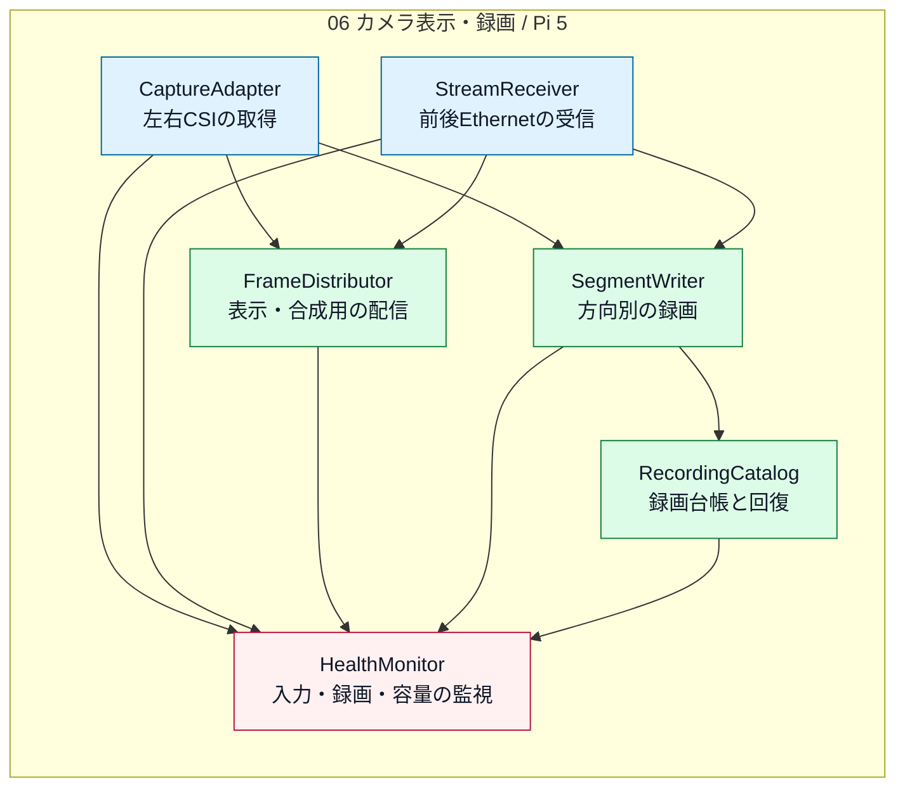
```mermaid
flowchart TB
 subgraph SW06["06 カメラ表示・録画 / Pi 5"]
  direction TB
  C["CaptureAdapter<br/>左右CSIの取得"]
  R["StreamReceiver<br/>前後Ethernetの受信"]
  D["FrameDistributor<br/>表示・合成用の配信"]
  W["SegmentWriter<br/>方向別の録画"]
  K["RecordingCatalog<br/>録画台帳と回復"]
  H["HealthMonitor<br/>入力・録画・容量の監視"]
  C --> D
  R --> D
  C --> W
  R --> W
  W --> K
  C --> H
  R --> H
  D --> H
  W --> H
  K --> H
 end
 classDef input fill:#e0f2fe,stroke:#0369a1,color:#111827
 classDef record fill:#dcfce7,stroke:#15803d,color:#111827
 classDef monitor fill:#fff1f2,stroke:#be123c,color:#111827
 class C,R input
 class D,W,K record
 class H monitor
```

| 経路 | 内容 |
| --- | --- |
| CaptureAdapter / StreamReceiver → FrameDistributor | 表示用に復号したフレームと撮影時刻・品質 |
| CaptureAdapter / StreamReceiver → SegmentWriter | 録画用の符号化データ。表示側を経由させない |
| SegmentWriter → RecordingCatalog | 書込開始、確定結果、未完了、ファイル参照 |
| 各モジュール → HealthMonitor | 方向別の入力・配信・録画状態、共有SSDの残量・エラー |

矢印はデータの受渡しで、1本につき別プロセスを必要とする意味ではない。符号化器・復号器・保存コンテナはSegmentWriter等の内部で既存ライブラリを利用する。

<a id="dd-feature-flows"></a>

### 3.2 機能別処理フローチャート

方向別の処理と、保存領域を共有する処理を分けて示す。

<a id="dd-feature-1"></a>

#### 3.2.1 4方向の映像取得（CAM-F01）

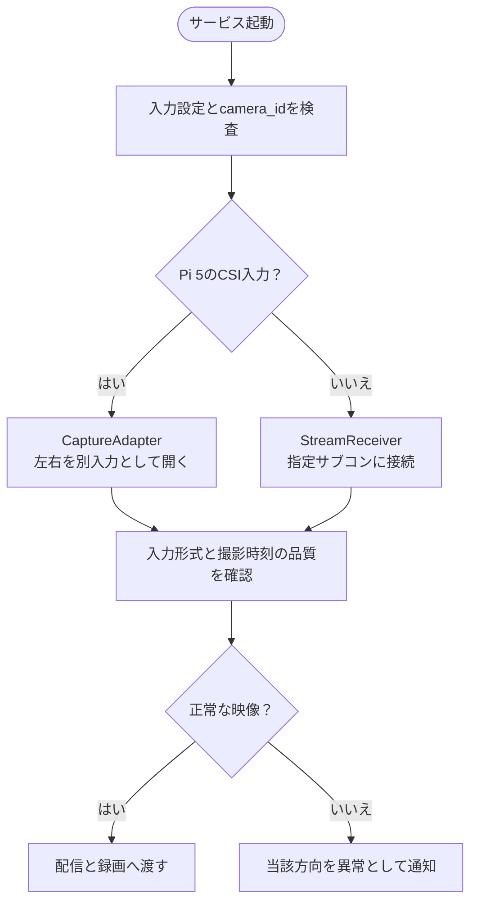
```mermaid
flowchart TB
 A(["サービス起動"]) --> B["入力設定とcamera_idを検査"]
 B --> C{"Pi 5のCSI入力？"}
 C -->|"はい"| D["CaptureAdapter<br/>左右を別入力として開く"]
 C -->|"いいえ"| E["StreamReceiver<br/>指定サブコンに接続"]
 D --> F["入力形式と撮影時刻の品質を確認"]
 E --> F
 F --> G{"正常な映像？"}
 G -->|"はい"| H["配信と録画へ渡す"]
 G -->|"いいえ"| I["当該方向を異常として通知"]
```

<a id="dd-feature-2"></a>

#### 3.2.2 UI・合成用の映像配信（CAM-F02）

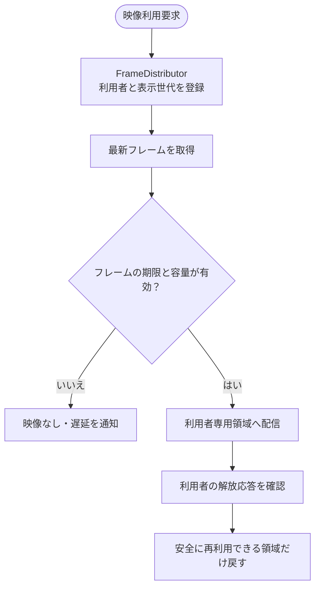
```mermaid
flowchart TB
 A(["映像利用要求"]) --> B["FrameDistributor<br/>利用者と表示世代を登録"]
 B --> C["最新フレームを取得"]
 C --> D{"フレームの期限と容量が有効？"}
 D -->|"いいえ"| E["映像なし・遅延を通知"]
 D -->|"はい"| F["利用者専用領域へ配信"]
 F --> G["利用者の解放応答を確認"]
 G --> H["安全に再利用できる領域だけ戻す"]
```

<a id="dd-feature-3"></a>

#### 3.2.3 分割録画（CAM-F03）

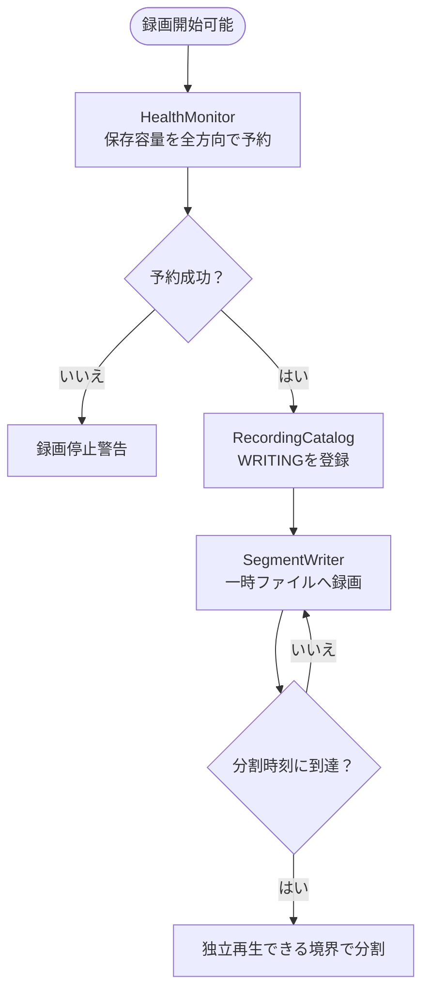
```mermaid
flowchart TB
 A(["録画開始可能"]) --> B["HealthMonitor<br/>保存容量を全方向で予約"]
 B --> C{"予約成功？"}
 C -->|"いいえ"| D["録画停止警告"]
 C -->|"はい"| E["RecordingCatalog<br/>WRITINGを登録"]
 E --> F["SegmentWriter<br/>一時ファイルへ録画"]
 F --> G{"分割時刻に到達？"}
 G -->|"いいえ"| F
 G -->|"はい"| H["独立再生できる境界で分割"]
```

<a id="dd-feature-4"></a>

#### 3.2.4 録画の確定と引き渡し（CAM-F04）

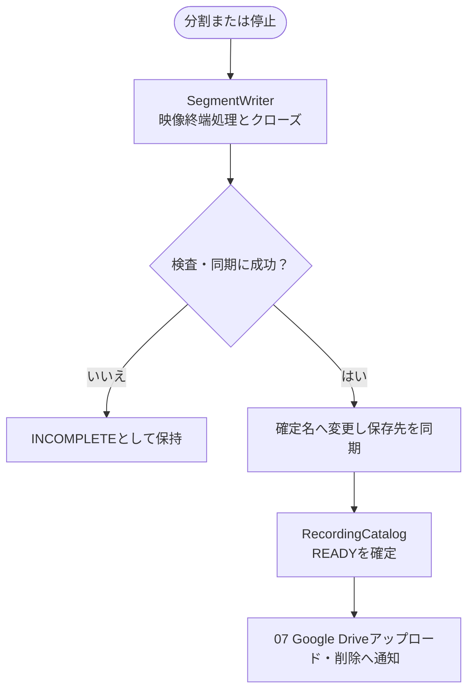
```mermaid
flowchart TB
 A(["分割または停止"]) --> B["SegmentWriter<br/>映像終端処理とクローズ"]
 B --> C{"検査・同期に成功？"}
 C -->|"いいえ"| D["INCOMPLETEとして保持"]
 C -->|"はい"| E["確定名へ変更し保存先を同期"]
 E --> F["RecordingCatalog<br/>READYを確定"]
 F --> G["07 Google Driveアップロード・削除へ通知"]
```

<a id="dd-feature-5"></a>

#### 3.2.5 異常監視と録画継続判断（CAM-F05）

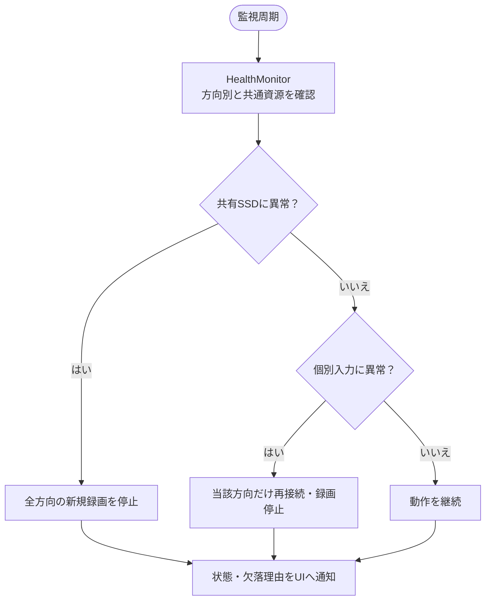
```mermaid
flowchart TB
 A(["監視周期"]) --> B["HealthMonitor<br/>方向別と共通資源を確認"]
 B --> C{"共有SSDに異常？"}
 C -->|"はい"| D["全方向の新規録画を停止"]
 C -->|"いいえ"| E{"個別入力に異常？"}
 E -->|"はい"| F["当該方向だけ再接続・録画停止"]
 E -->|"いいえ"| G["動作を継続"]
 D --> H["状態・欠落理由をUIへ通知"]
 F --> H
 G --> H
```

<a id="dd-feature-6"></a>

#### 3.2.6 異常終了からの回復（CAM-F06）

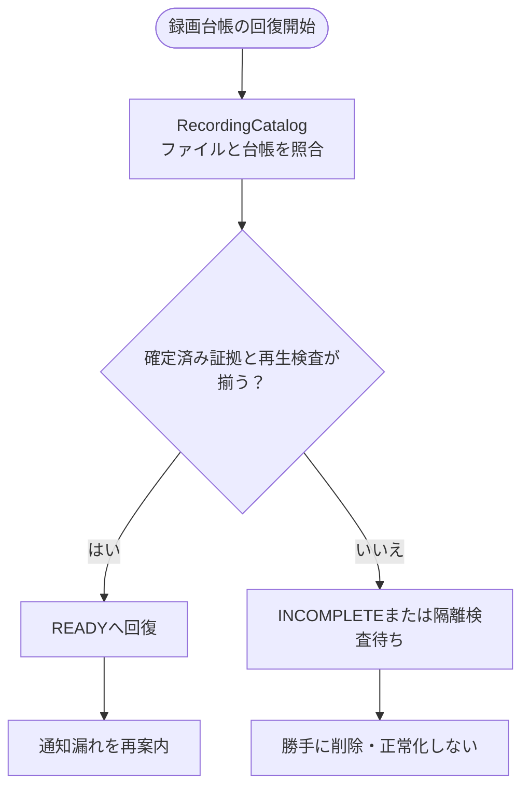
```mermaid
flowchart TB
 A(["録画台帳の回復開始"]) --> B["RecordingCatalog<br/>ファイルと台帳を照合"]
 B --> C{"確定済み証拠と再生検査が揃う？"}
 C -->|"はい"| D["READYへ回復"]
 C -->|"いいえ"| E["INCOMPLETEまたは隔離検査待ち"]
 D --> F["通知漏れを再案内"]
 E --> G["勝手に削除・正常化しない"]
```

<a id="dd-feature-7"></a>

#### 3.2.7 終了処理（CAM-F07）

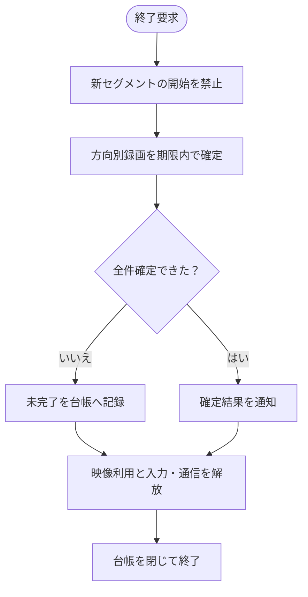
```mermaid
flowchart TB
 A(["終了要求"]) --> B["新セグメントの開始を禁止"]
 B --> C["方向別録画を期限内で確定"]
 C --> D{"全件確定できた？"}
 D -->|"いいえ"| E["未完了を台帳へ記録"]
 D -->|"はい"| F["確定結果を通知"]
 E --> G["映像利用と入力・通信を解放"]
 F --> G
 G --> H["台帳を閉じて終了"]
```

<a id="dd-module-tree"></a>

### 3.3 モジュールツリー

```text
camera_service
+-- CaptureAdapter
|   +-- open_local_camera / accept_frame
+-- StreamReceiver
|   +-- connect_remote / accept_frame
+-- FrameDistributor
|   +-- subscribe_frames / publish_frame
|   +-- release_frame / unsubscribe_frames
+-- SegmentWriter
|   +-- start_segment / write_packet
|   +-- rotate_segment / finalize_segment / stop_recording
+-- RecordingCatalog
|   +-- mark_writing / mark_ready / mark_incomplete
|   +-- recover_catalog
+-- HealthMonitor
    +-- check_health / reserve_storage / publish_health
```

<a id="dd-sequence"></a>

### 3.4 モジュール間の処理順序

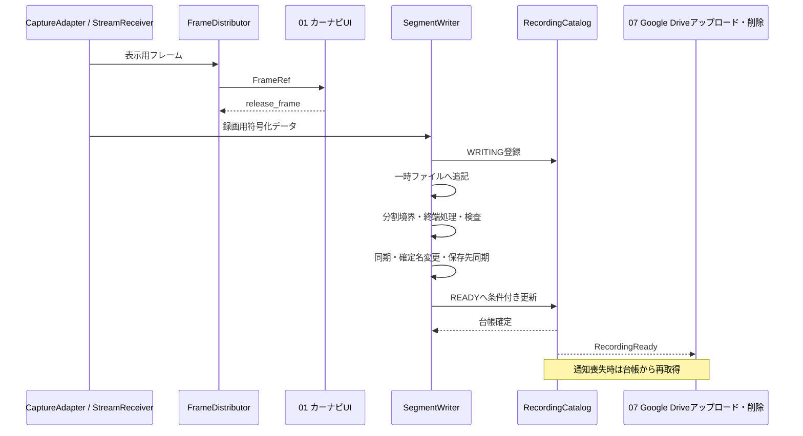
```mermaid
sequenceDiagram
 participant I as CaptureAdapter / StreamReceiver
 participant D as FrameDistributor
 participant U as 01 カーナビUI
 participant W as SegmentWriter
 participant K as RecordingCatalog
 participant G as 07 Google Driveアップロード・削除
 I->>D: 表示用フレーム
 D->>U: FrameRef
 U-->>D: release_frame
 I->>W: 録画用符号化データ
 W->>K: WRITING登録
 W->>W: 一時ファイルへ追記
 W->>W: 分割境界・終端処理・検査
 W->>W: 同期・確定名変更・保存先同期
 W->>K: READYへ条件付き更新
 K-->>W: 台帳確定
 K-->>G: RecordingReady
 Note over K,G: 通知喪失時は台帳から再取得
```

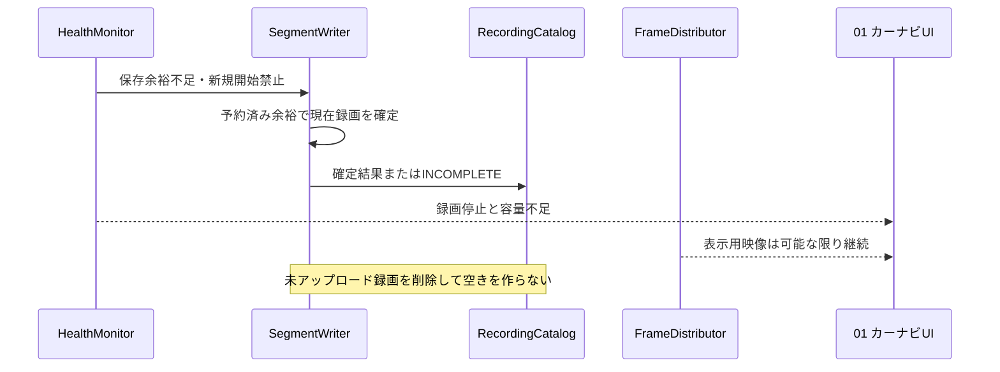
```mermaid
sequenceDiagram
 participant H as HealthMonitor
 participant W as SegmentWriter
 participant K as RecordingCatalog
 participant D as FrameDistributor
 participant U as 01 カーナビUI
 H->>W: 保存余裕不足・新規開始禁止
 W->>W: 予約済み余裕で現在録画を確定
 W->>K: 確定結果またはINCOMPLETE
 H-->>U: 録画停止と容量不足
 D-->>U: 表示用映像は可能な限り継続
 Note over W,K: 未アップロード録画を削除して空きを作らない
```

<a id="dd-modules"></a>

### 3.5 モジュール詳細

カメラ処理に必要な既存ライブラリの内部を独自実装し直さず、入力・出力と障害の境界を本ソフトで管理する。

<a id="dd-module-1"></a>

#### 3.5.1 CaptureAdapter（左右CSIカメラの取得）

| 項目 | 内容 |
| --- | --- |
| 入力 | 左右のデバイス識別子、画質設定、開始停止要求 |
| 出力 | 撮影時刻付きフレーム、録画用符号化データ、入力状態 |
| 保持情報 | 方向別camera_handle、stream_session_id、sequence、時刻対応、設定世代 |
| 処理 | libcamera/Picamera2等の採用APIで取得。表示と録画のために同じカメラを二重に開かない |
| 関数 | open_local_camera、accept_frame |
| 異常時 | 入力を閉じる前に利用中バッファの所有を確認。復旧時は新しいstream_session_idを発行 |

<a id="dd-module-2"></a>

#### 3.5.2 StreamReceiver（前後サブコントローラの映像受信）

| 項目 | 内容 |
| --- | --- |
| 入力 | 許可済みサブコン、転送プロファイル、符号化ストリーム、撮影時刻情報 |
| 出力 | 録画用パケットと表示用復号フレーム、欠落・時刻同期状態 |
| 保持情報 | peer_id、camera_id、stream_session_id、パケット順序、復号状態 |
| 処理 | 前後の対応を固定。再接続で旧映像を破棄し、新しい復号開始点を待つ |
| 関数 | connect_remote、accept_frame |
| 異常時 | 受信時刻を撮影時刻に偽装しない。欠落後は有効なキーフレームから再開 |

<a id="dd-module-3"></a>

#### 3.5.3 FrameDistributor（UIと合成処理への配信）

| 項目 | 内容 |
| --- | --- |
| 入力 | フレーム、利用開始終了、解放通知 |
| 出力 | 期限・所有権付きFrameRefと映像有効性 |
| 保持情報 | 利用者ID、subscription_id、display_generation、容量制限付き専用バッファ |
| 処理 | 表示は最新優先。遅い利用者の処理待ちを入力や録画へ伝えない |
| 関数 | subscribe_frames、publish_frame、release_frame、unsubscribe_frames |
| 異常時 | 利用者が解放しない領域をタイムアウトだけで再利用しない。利用者を切り離し上限を保つ |

<a id="dd-module-4"></a>

#### 3.5.4 SegmentWriter（方向別の分割録画）

| 項目 | 内容 |
| --- | --- |
| 入力 | 符号化パケット、分割条件、保存容量予約、終了要求 |
| 出力 | 一時・確定ファイル、サイズ・欠落・時間情報、確定結果 |
| 保持情報 | カメラ別writer、file_id、GOP状態、分割予定、未確定ファイル数、容量予約 |
| 処理 | 閉じたGOP境界とコンテナ終端を確認。非同期確定でも前ファイル確定を別に追跡 |
| 関数 | start_segment、write_packet、rotate_segment、finalize_segment、stop_recording |
| 異常時 | 書込失敗を正常な短い録画として扱わない。閉じられないものはINCOMPLETEへ |

<a id="dd-module-5"></a>

#### 3.5.5 RecordingCatalog（録画台帳・回復・引き渡し）

| 項目 | 内容 |
| --- | --- |
| 入力 | 書込開始、確定結果、未完了、保存領域の照合結果 |
| 出力 | 状態更新、RecordingReady、回復結果 |
| 保持情報 | SQLite接続、台帳形式のバージョン、file_id別状態、相対パス、確定証拠 |
| 処理 | 状態と期待する旧状態を照合して更新。07 Google Driveアップロード・削除担当のUPLOADING以降を06 カメラ表示・録画が巻き戻さない |
| 関数 | mark_writing、mark_ready、mark_incomplete、recover_catalog |
| 異常時 | DB更新失敗はREADY通知しない。ファイルと台帳の不一致を回復対象として保持 |

<a id="dd-module-6"></a>

#### 3.5.6 HealthMonitor（入力・録画・保存領域の監視）

| 項目 | 内容 |
| --- | --- |
| 入力 | 方向別状態、書込量、空き容量、処理遅延、利用者滞留 |
| 出力 | 録画開始可否、容量予約、camera.status / recording.status、警告 |
| 保持情報 | 全方向合計の予約量、最低空き容量、最終フレーム時刻、欠落数 |
| 処理 | 入力・表示・録画の状態を分ける。空き容量だけでなく未確定録画と台帳書込余裕も考慮 |
| 関数 | check_health、reserve_storage、publish_health |
| 異常時 | OSと共有するSSDに余裕がなければ録画を停止。未検証録画の削除権限を持たない |

<a id="dd-files"></a>

### 3.6 ファイル構成

```text
src/raspberry_pi5/
+-- camera_service.py                 起動・終了・依存関係の組立て
+-- camera/
|   +-- inputs.py                    CaptureAdapter / StreamReceiver
|   +-- frames.py                    Frame / FrameDistributor / JPEG検査
|   +-- segment_writer.py            SegmentWriter
|   +-- catalog.py                   RecordingCatalog
|   +-- health.py                    HealthMonitor
|   +-- service.py                   CameraService / 入力・録画スレッド管理
|   +-- client.py                    UI用の状態・映像照会
|   +-- config.py                    入力と画質・容量設定
+-- config/camera.example.json
+-- requirements-camera.txt
+-- systemd/l880k-camera.service
+-- ui/frame_presenter.py            QQuickImageProvider / 表示期限監視
tests/camera/
+-- test_camera.py                   実JPEG・動画・TCP結合・障害注入
+-- test_camera_ui.py                QML読込・実画像・失効・方向変更
```

上記ファイルを実装済み。試験画像はテスト中に生成し、実録画やGoogle Drive資格情報をGitへ含めない。

<a id="dd-function-flows"></a>

### 3.7 関数のフローチャート

保存処理では「次の録画を開始したこと」と「前の録画を確定できたこと」を別結果として返す。

<a id="dd-fn-open-local-camera"></a>

#### 3.7.1 open_local_camera（左右CSIカメラを開く）

| 項目 | 内容 |
| --- | --- |
| 入力 | camera_id、デバイス識別子、画質プロファイル |
| 戻り値・結果 | 入力ハンドルまたは失敗 |

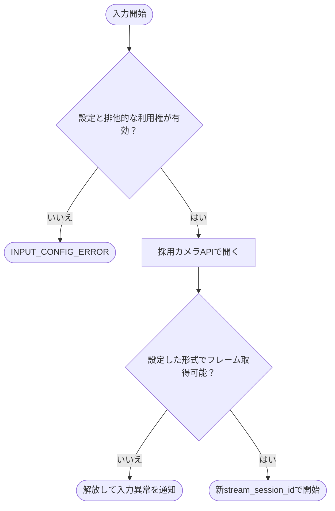
```mermaid
flowchart TB
 A(["入力開始"]) --> B{"設定と排他的な利用権が有効？"}
 B -->|"いいえ"| C(["INPUT_CONFIG_ERROR"])
 B -->|"はい"| D["採用カメラAPIで開く"]
 D --> E{"設定した形式でフレーム取得可能？"}
 E -->|"いいえ"| F(["解放して入力異常を通知"])
 E -->|"はい"| G(["新stream_session_idで開始"])
```

<a id="dd-fn-connect-remote"></a>

#### 3.7.2 connect_remote（前後サブコンの映像に接続する）

| 項目 | 内容 |
| --- | --- |
| 入力 | camera_id、許可相手、転送設定 |
| 戻り値・結果 | 接続済み映像または再試行状態 |

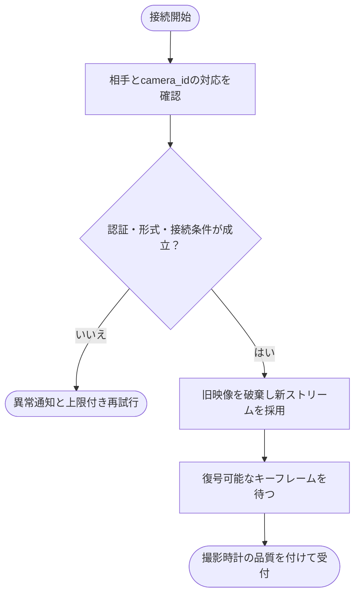
```mermaid
flowchart TB
 A(["接続開始"]) --> B["相手とcamera_idの対応を確認"]
 B --> C{"認証・形式・接続条件が成立？"}
 C -->|"いいえ"| D(["異常通知と上限付き再試行"])
 C -->|"はい"| E["旧映像を破棄し新ストリームを採用"]
 E --> F["復号可能なキーフレームを待つ"]
 F --> G(["撮影時計の品質を付けて受付"])
```

<a id="dd-fn-accept-frame"></a>

#### 3.7.3 accept_frame（入力フレームを受け付ける）

| 項目 | 内容 |
| --- | --- |
| 入力 | 入力データ、ストリーム情報 |
| 戻り値・結果 | 映像配信・録画用データまたは拒否 |

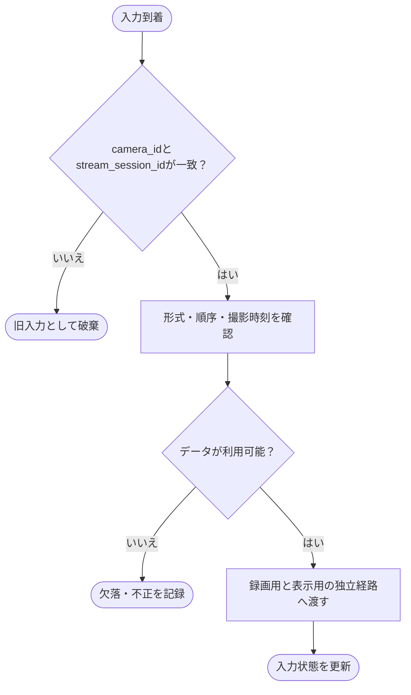
```mermaid
flowchart TB
 A(["入力到着"]) --> B{"camera_idとstream_session_idが一致？"}
 B -->|"いいえ"| C(["旧入力として破棄"])
 B -->|"はい"| D["形式・順序・撮影時刻を確認"]
 D --> E{"データが利用可能？"}
 E -->|"いいえ"| F(["欠落・不正を記録"])
 E -->|"はい"| G["録画用と表示用の独立経路へ渡す"]
 G --> H(["入力状態を更新"])
```

<a id="dd-fn-subscribe-frames"></a>

#### 3.7.4 subscribe_frames（映像の利用開始を受け付ける）

| 項目 | 内容 |
| --- | --- |
| 入力 | 利用者、camera_id、表示世代、要求期限 |
| 戻り値・結果 | subscription_idまたは拒否 |

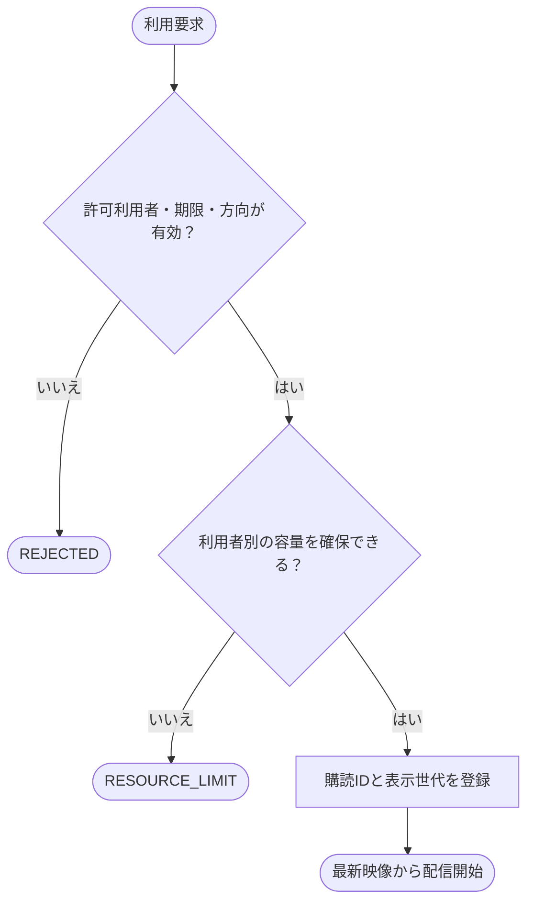
```mermaid
flowchart TB
 A(["利用要求"]) --> B{"許可利用者・期限・方向が有効？"}
 B -->|"いいえ"| C(["REJECTED"])
 B -->|"はい"| D{"利用者別の容量を確保できる？"}
 D -->|"いいえ"| E(["RESOURCE_LIMIT"])
 D -->|"はい"| F["購読IDと表示世代を登録"]
 F --> G(["最新映像から配信開始"])
```

<a id="dd-fn-publish-frame"></a>

#### 3.7.5 publish_frame（最新映像を利用者へ渡す）

| 項目 | 内容 |
| --- | --- |
| 入力 | FrameEnvelope、購読情報 |
| 戻り値・結果 | FrameRefまたはドロップ理由 |

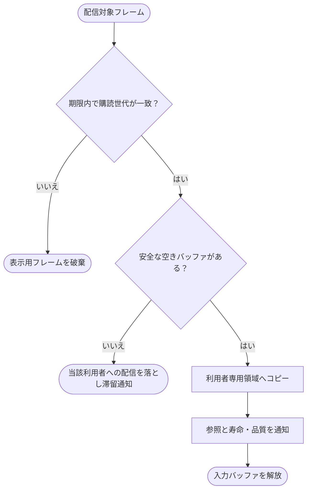
```mermaid
flowchart TB
 A(["配信対象フレーム"]) --> B{"期限内で購読世代が一致？"}
 B -->|"いいえ"| C(["表示用フレームを破棄"])
 B -->|"はい"| D{"安全な空きバッファがある？"}
 D -->|"いいえ"| E(["当該利用者への配信を落とし滞留通知"])
 D -->|"はい"| F["利用者専用領域へコピー"]
 F --> G["参照と寿命・品質を通知"]
 G --> H(["入力バッファを解放"])
```

<a id="dd-fn-release-frame"></a>

#### 3.7.6 release_frame（映像バッファの利用を終える）

| 項目 | 内容 |
| --- | --- |
| 入力 | 利用者ID、buffer_id、generation |
| 戻り値・結果 | 解放結果 |

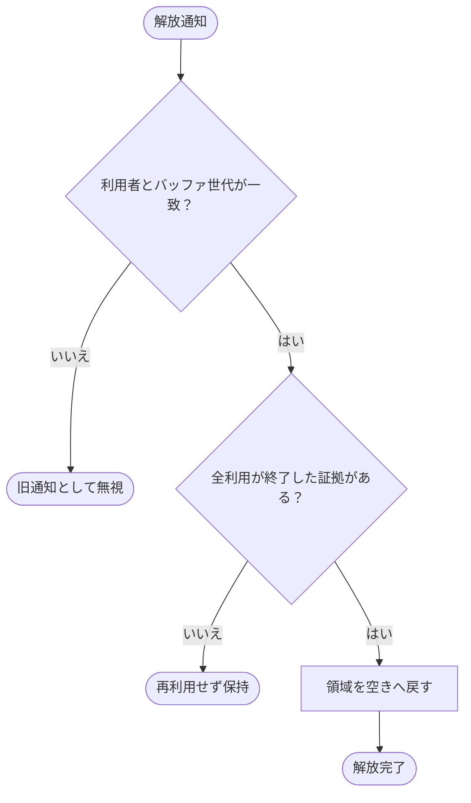
```mermaid
flowchart TB
 A(["解放通知"]) --> B{"利用者とバッファ世代が一致？"}
 B -->|"いいえ"| C(["旧通知として無視"])
 B -->|"はい"| D{"全利用が終了した証拠がある？"}
 D -->|"いいえ"| E(["再利用せず保持"])
 D -->|"はい"| F["領域を空きへ戻す"]
 F --> G(["解放完了"])
```

<a id="dd-fn-reserve-storage"></a>

#### 3.7.7 reserve_storage（録画用の保存余裕を確保する）

| 項目 | 内容 |
| --- | --- |
| 入力 | 方向別必要量、未確定量、SSD空き |
| 戻り値・結果 | 予約IDまたは容量不足 |

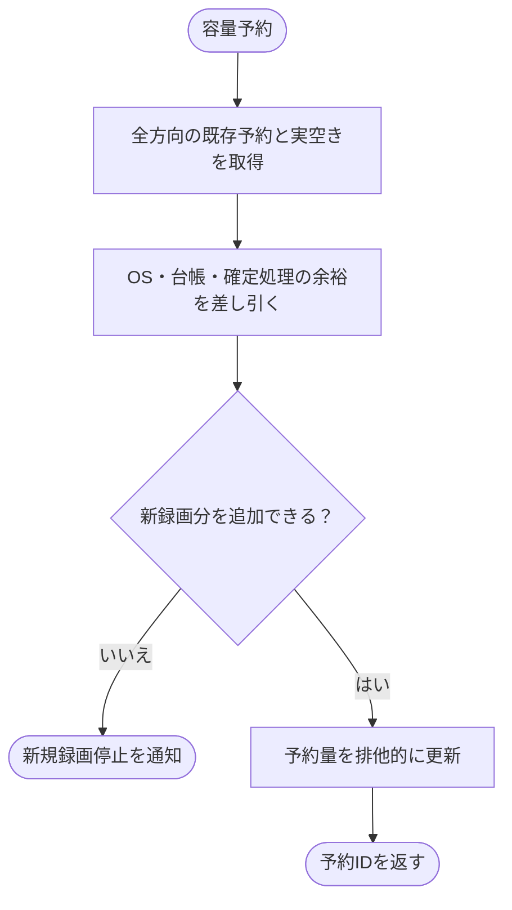
```mermaid
flowchart TB
 A(["容量予約"]) --> B["全方向の既存予約と実空きを取得"]
 B --> C["OS・台帳・確定処理の余裕を差し引く"]
 C --> D{"新録画分を追加できる？"}
 D -->|"いいえ"| E(["新規録画停止を通知"])
 D -->|"はい"| F["予約量を排他的に更新"]
 F --> G(["予約IDを返す"])
```

<a id="dd-fn-start-segment"></a>

#### 3.7.8 start_segment（書込中の録画を作る）

| 項目 | 内容 |
| --- | --- |
| 入力 | camera_id、容量予約、符号化設定 |
| 戻り値・結果 | WRITINGファイルまたは開始失敗 |

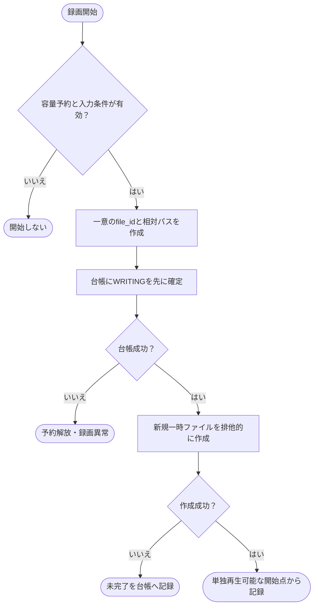
```mermaid
flowchart TB
 A(["録画開始"]) --> B{"容量予約と入力条件が有効？"}
 B -->|"いいえ"| C(["開始しない"])
 B -->|"はい"| D["一意のfile_idと相対パスを作成"]
 D --> E["台帳にWRITINGを先に確定"]
 E --> F{"台帳成功？"}
 F -->|"いいえ"| G(["予約解放・録画異常"])
 F -->|"はい"| H["新規一時ファイルを排他的に作成"]
 H --> I{"作成成功？"}
 I -->|"いいえ"| J(["未完了を台帳へ記録"])
 I -->|"はい"| K(["単独再生可能な開始点から記録"])
```

<a id="dd-fn-rotate-segment"></a>

#### 3.7.9 rotate_segment（録画ファイルを分割する）

| 項目 | 内容 |
| --- | --- |
| 入力 | 分割時刻、GOP情報、容量予約 |
| 戻り値・結果 | 分割要求または継続・停止 |

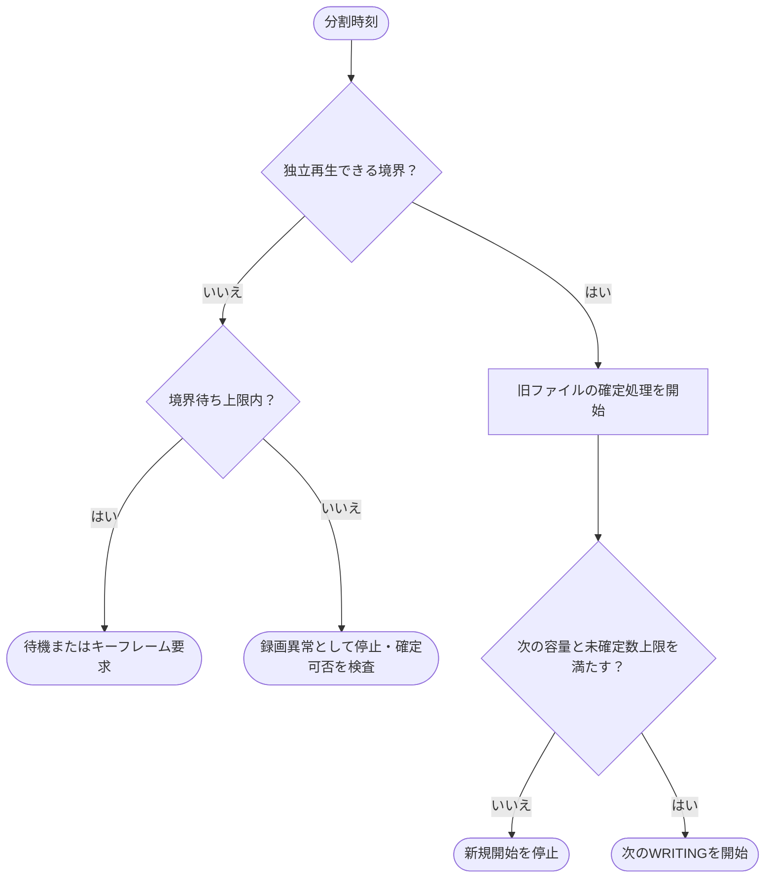
```mermaid
flowchart TB
 A(["分割時刻"]) --> B{"独立再生できる境界？"}
 B -->|"いいえ"| C{"境界待ち上限内？"}
 C -->|"はい"| D(["待機またはキーフレーム要求"])
 C -->|"いいえ"| E(["録画異常として停止・確定可否を検査"])
 B -->|"はい"| F["旧ファイルの確定処理を開始"]
 F --> G{"次の容量と未確定数上限を満たす？"}
 G -->|"いいえ"| H(["新規開始を停止"])
 G -->|"はい"| I(["次のWRITINGを開始"])
```

<a id="dd-fn-finalize-segment"></a>

#### 3.7.10 finalize_segment（録画ファイルを確定する）

| 項目 | 内容 |
| --- | --- |
| 入力 | WRITINGファイル、終了理由、期限 |
| 戻り値・結果 | 確定証拠またはINCOMPLETE |

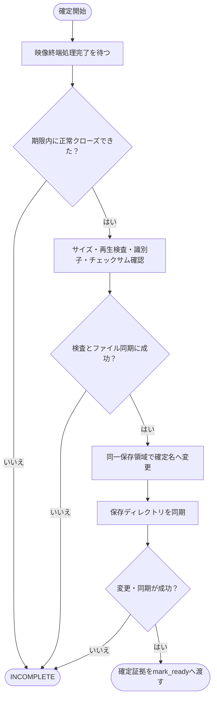
```mermaid
flowchart TB
 A(["確定開始"]) --> B["映像終端処理完了を待つ"]
 B --> C{"期限内に正常クローズできた？"}
 C -->|"いいえ"| X(["INCOMPLETE"])
 C -->|"はい"| D["サイズ・再生検査・識別子・チェックサム確認"]
 D --> E{"検査とファイル同期に成功？"}
 E -->|"いいえ"| X
 E -->|"はい"| F["同一保存領域で確定名へ変更"]
 F --> G["保存ディレクトリを同期"]
 G --> H{"変更・同期が成功？"}
 H -->|"いいえ"| X
 H -->|"はい"| I(["確定証拠をmark_readyへ渡す"])
```

<a id="dd-fn-mark-ready"></a>

#### 3.7.11 mark_ready（確定録画を台帳へ登録する）

| 項目 | 内容 |
| --- | --- |
| 入力 | file_id、確定証拠 |
| 戻り値・結果 | READYまたは回復待ち |

```mermaid
flowchart TB
 A(["確定結果"]) --> B{"台帳の対象と期待状態が一致？"}
 B -->|"いいえ"| C(["競合として再確認"])
 B -->|"はい"| D["サイズ・相対パス・時間・欠落情報を登録"]
 D --> E["トランザクションでREADYを確定"]
 E --> F{"DB確定成功？"}
 F -->|"いいえ"| G(["通知せず回復待ち"])
 F -->|"はい"| H(["RecordingReadyを通知"])
```

<a id="dd-fn-recover-catalog"></a>

#### 3.7.12 recover_catalog（台帳とファイルを照合して回復する）

| 項目 | 内容 |
| --- | --- |
| 入力 | 起動時の台帳と保存領域 |
| 戻り値・結果 | 回復一覧・隔離一覧 |

```mermaid
flowchart TB
 A(["回復開始"]) --> B["排他管理下で台帳とファイルを照合"]
 B --> C{"07 Google Driveアップロード・削除担当の状態？"}
 C -->|"はい"| D(["状態を変更せず不一致だけ通知"])
 C -->|"いいえ"| E{"識別・確定証拠・再生検査が成立？"}
 E -->|"はい"| F(["READYへ条件付き回復"])
 E -->|"いいえ"| G(["INCOMPLETEまたは隔離検査待ち"])
```

<a id="dd-fn-check-health"></a>

#### 3.7.13 check_health（入力と録画の健全性を確認する）

| 項目 | 内容 |
| --- | --- |
| 入力 | 時刻、入力・書込状態、容量 |
| 戻り値・結果 | 方向別状態と共通制限 |

```mermaid
flowchart TB
 A(["監視周期"]) --> B["最終入力・欠落・書込遅延・空きを集計"]
 B --> C{"共有保存領域に異常？"}
 C -->|"はい"| D["全方向の新規録画禁止"]
 C -->|"いいえ"| E["方向別に入力・表示・録画を判定"]
 D --> F["publish_healthでUIへ通知"]
 E --> F
 F --> G(["次回監視へ"])
```

<a id="dd-fn-stop-recording"></a>

#### 3.7.14 stop_recording（録画を終了する）

| 項目 | 内容 |
| --- | --- |
| 入力 | 停止期限、方向別writer |
| 戻り値・結果 | 確定済みと未完了の一覧 |

```mermaid
flowchart TB
 A(["終了要求"]) --> B["新規セグメントと利用要求を禁止"]
 B --> C["各writerを残り期限内で確定"]
 C --> D["成功はREADY・失敗は未完了として台帳更新"]
 D --> E["配信利用者と入力・ネットワークを解放"]
 E --> F["DBを閉じ容量予約を終了"]
 F --> G(["アップロードを待たず終了"])
```

<a id="dd-4"></a>

## 4. インターフェース設計


<a id="dd-interface-diagrams"></a>

### 4.1 カメラ入力と利用ソフトの接続

```mermaid
flowchart TB
 subgraph INPUT["映像入力"]
  F["16 サブコントローラ2前方系<br/>前方カメラ"]
  B["15 サブコントローラ1後方系<br/>後方カメラ"]
  C["Pi 5 左右CSIカメラ"]
 end
 subgraph SW06["06 カメラ表示・録画"]
  R["StreamReceiver"]
  A["CaptureAdapter"]
  D["FrameDistributor"]
  W["SegmentWriter"]
  K["RecordingCatalog"]
  H["HealthMonitor"]
  R --> D
  A --> D
  R --> W
  A --> W
  W --> K
  W --> H
 end
 subgraph UI["01 カーナビUI"]
  S["ServiceBridge"]
  V["FrameChannel / frame_presenter"]
  Q["QML映像表示"]
  V --> Q
 end
 subgraph SUR["08 サラウンドビュー"]
  Y["FrameSynchronizer"]
 end
 subgraph UP["07 Google Driveアップロード・削除"]
  G["CatalogReader"]
 end
 F -->|"Ethernet"| R
 B -->|"Ethernet"| R
 C -->|"MIPI CSI"| A
 S --> D
 D --> V
 D --> Y
 K --> G
 H --> S
```

前後のリバース・ウィンカー等の車体信号は映像ストリームとは別経路。バックギア検知を本ソフトの映像受信成功から推測しない。

| camera_id | 物理入力・所有者 | 本ソフト内の入口 |
| --- | --- | --- |
| front | 16 サブコントローラ2前方系のカメラ | StreamReceiver。Ethernet映像 |
| rear | 15 サブコントローラ1後方系のカメラ | StreamReceiver。Ethernet映像 |
| left | Pi 5左側MIPI CSIカメラ | CaptureAdapter |
| right | Pi 5右側MIPI CSIカメラ | CaptureAdapter |

<a id="dd-frame-contract"></a>

### 4.2 UI・サラウンドビューへのフレーム契約

| FrameRef項目 | 意味・確認 |
| --- | --- |
| camera_id / stream_session_id / sequence | 方向・入力開始ID・フレーム連番。再接続後は旧IDのフレームを拒否 |
| subscription_id / consumer_boot_id | 利用要求と利用者起動の識別。別利用者へ流用しない |
| display_generation | UI画面切替要求の世代。古い要求の映像で現在画面を上書きしない |
| captured_at / capture_clock_id / clock_quality | 撮影時刻と時計の種類・品質。対応が不明なら撮影時刻を比較不能とする |
| received_at_mono / age_ms / valid_for_ms | Pi 5の受信時刻、算定できる撮影年齢、有効期間。受信時刻を撮影時刻へ置換しない |
| width / height / pixel_format / stride | 利用者が読み出す形式と1行の長さ。各値とバッファサイズを照合 |
| buffer_id / buffer_generation / length | 有効な転送領域の識別と長さ。プロセス内の生ポインタを通信データにしない |
| validity / reason / discontinuity | 正常・遅延・時計不明・入力再接続・欠落等 |

01 カーナビUIのServiceBridgeが利用要求を出し、映像はFrameChannel / frame_presenterへ渡す。AppStateには映像本文を格納しない。[01 カーナビUI](01_カーナビUI.md#dd-4)

初期実装はJPEGのコピー配信を採用する。`subscribe_video`で方向・利用者ID・表示世代を登録し、`get_frame`で最新1件を照会する。`unsubscribe_video`で表示用の登録だけを解除する。貸出共有メモリは使わないため、コピー後の領域解放は各プロセスの管理に任せる。`buffer_id`・`stride`と通信上の`release_frame`は共有メモリ対応時の拡張とする。利用登録は最大16件、照会が10秒間途絶えた登録は失効する。

表示待ちは最新1件を基本とするが、貸出中領域は別に有限数を設定する。容量を使い切った利用者への新規配信を落とし、録画は待たせない。ゼロコピー化は所有権と解放の実機試験後に検討する。

実装済みの`CameraClient`は受信画像を最新1件だけ保持し、Qt側が50ms周期で取り出す。JSON Lines上では`pixel_format=JPEG`、`jpeg_base64`、幅・高さ・方向・開始ID・連番・表示世代を渡す。UIは照会往復時間も差し引いて表示期限を管理し、画像途絶や方向変更で前の画像を消す。AppStateには方向別状態だけを保持し、JPEGはFramePresenterへ渡す。

08 サラウンドビューへは同じ契約のフレームを渡すが、4方向同期のための有限フレーム窓を個別設定する。時刻不明なら正しく同期できた合成として扱わない。[08 サラウンドビュー](08_サラウンドビュー.md#dd-4)

<a id="dd-recording-contract"></a>

### 4.3 録画確定とアップロードへの引き渡し

| 情報 | 内容 |
| --- | --- |
| RecordingReady | file_id、camera_id、台帳形式のバージョン、通知ID。任意ファイルパスを実行指示として送らない |
| 録画台帳 | 相対パス、サイズ、チェックサム、開始終了、欠落、状態。07 Google Driveアップロード・削除は通知されたfile_idを台帳で再確認 |
| 状態更新 | 06 カメラ表示・録画はWRITING / INCOMPLETE / READYの確定を担当。07 Google Driveアップロード・削除はUPLOADING以降を担当 |
| 通知喪失 | 07 Google Driveアップロード・削除のCatalogReaderがREADYを再取得。通知は重複してよくfile_idで同じ作業と判断 |
| 削除完了 | 07 Google Driveアップロード・削除が検証後にDELETEDへ更新。06 カメラ表示・録画は保存容量を再計測するだけで独自削除しない |

SQLiteを共有台帳の候補とし、各ソフトは期待する旧状態を条件に更新する。06 カメラ表示・録画の回復処理でUPLOADING / VERIFIED / DELETING等をREADYへ戻さない。07 Google Driveアップロード・削除のアップロード・削除中ファイルへ06 カメラ表示・録画が追記しない。

初期実装の台帳は07と同じSQLiteファイルを使用する。録画側は`capture_segments`テーブルでWRITING / FINALIZING / INCOMPLETEを管理し、確定動画だけを`CatalogReader.register_ready`で既存の`recordings`テーブルへ登録する。共有台帳の`user_version=1`を維持し、07は録画側テーブルを更新しない。RecordingReady専用通知は送らず、07の定期台帳取得で受け渡す。台帳登録直後にアップロード・削除が進んでも、録画側は登録済みfile_idを再生成しない。

READY以降の動画本体と確定メタデータは不変。通知が成功してもファイル確定を省略しない。[07 Google Driveアップロード・削除](07_GoogleDriveアップロード.md#dd-4)、[00 共通仕様](00_共通仕様.md)

<a id="dd-control-contract"></a>

### 4.4 状態・操作インターフェース

| 操作・通知 | 内容 |
| --- | --- |
| subscribe_video / unsubscribe_video相当 | UIからの映像利用開始・終了。共通command_id、期限、camera_id、subscription_id、display_generationを照合 |
| release_frame | 利用者・buffer_id・buffer_generationを照合し、他世代の領域を解放しない |
| camera.status | 方向別input_state、frame_age、clock_quality、fps、drop_count、reason |
| recording.status | 方向別record_state、現在file_id、最終確定、書込遅延、SSD状態、欠落理由 |
| 録画開始・停止 | OSサービス運用で制御。UIの画面切替・映像購読終了と連動させない |
| 位置・車速の付帯情報 | 03 現在地補正・09 OBD2車両情報取得の時刻と有効性を保持した情報を利用。独自にGPS/OBD2を重複オープンしない |

論理操作名を実装時に01 カーナビUIと固定する。未知のcamera_id・任意パス・任意パイプライン文字列を操作要求から受け付けない。付帯情報が欠けても録画を待たせず、nullと理由を保存する。

現在のIPCは`status`、`subscribe_video`、`get_frame`、`unsubscribe_video`、`settings`、`apply_settings`。状態は`camera.status`へ方向別の入力状態・録画状態・欠落数・保存残量をまとめる。`schema_version=1`、`boot_id`、`sequence`、有効期間3秒を付ける。UIは1秒周期の照会と100ms周期の期限監視で接続断を表示する。GPS・車速メタデータの付与、`recording.status`単独通知は未実装である。

`settings`は`accepted`と現在の録画設定を返す。`apply_settings`は`settings`内の`recording_enabled`（bool）、`segment_duration_s`（60/120/180秒）だけを受け付ける。共通台帳の`settings.camera_ui_settings`相当（key/value形式）へJSONを保存してから実行時設定を交換する。再起動時も保存値を読み、JSONファイルよりこの2項目を優先する。不正値・保存失敗では交換しない。

録画OFF時も入力と表示配信を維持する。録画処理は書込中動画を確定し、待機キューを捨てて新規書込を止める。設定適用応答の`state=APPLIED`は動画確定完了を意味しない。完了は録画状態で確認する。分割時間変更は次の画像処理から新しい設定で判定する。

録画一覧・再生は01 カーナビUIの`RecordingLibrary`が台帳を読取専用で検索する。確定動画を共通ファイルロック下で一時領域へコピーし、QtMultimediaで再生する。元動画や送信状態は変更しない。削除済み動画は対象外。上限512MiB、詳細は[付録9](../付録9_UI追加機能導入手順.md)を参照。

<a id="dd-5"></a>

## 5. データ・設定設計


<a id="dd-media-pipeline"></a>

### 5.1 映像処理と記録形式

```mermaid
flowchart LR
 subgraph NET["前後の受信"]
  N["JPEG / TCP JSON Lines入力"]
  P["パケット整列・形式確認"]
  N --> P
 end
 subgraph LOCAL["左右CSI"]
  C["取得フレーム"]
  E["Picamera2によるJPEG取得"]
  C --> E
 end
 P --> M["録画コンテナへの格納"]
 P --> D["表示用復号"]
 E --> M
 C --> V["表示用配信"]
 D --> V
 M --> S["SSD / 分割ファイル"]
```

実装ではPyAVを使い、JPEGの各画像を独立したキーフレームとしてMKVへ多重化する。Pi 5の受信時刻に基づくPTSをミリ秒単位で保存し、映像の欠落を短い時間へ詰め直さない。CSI取得にはPicamera2の`capture_file(..., format="jpeg")`を使用し、同じカメラを二重に開かない。[PyAV時刻仕様](https://pyav.org/docs/stable/api/time.html)、[Picamera2公式取得例](https://github.com/raspberrypi/picamera2/blob/main/examples/capture_to_buffer.py)

Pi 5の映像符号化はソフトウェア処理を考慮する必要がある。前後の符号化済み映像は、形式が適合すれば再符号化せずコンテナへ格納し、表示に必要な経路だけ復号する。4方向の高画質同時処理が可能とは未確認。[Raspberry Pi公式カメラソフトウェア資料](https://www.raspberrypi.com/documentation/computers/camera_software.html)

録画待ちは方向別に最大16画像、UIは最新1画像とする。録画キューが満杯なら追加画像を破棄して欠落数を記録する。終端処理・全フレーム再生検査は方向別の録画スレッドで行うため、その間の入力もキュー上限の対象になる。確定処理中も他方向の録画と表示は継続する。

初期設定は60秒または容量上限で分割し、入力開始ID・解像度が変わった場合も分割する。H.264 / GStreamerは通信量と保存量の削減が必要になった場合の拡張候補。未検証動画の自動削除は実装しない。

<a id="dd-catalog"></a>

### 5.2 台帳と保存ファイル

| 台帳項目 | 内容 |
| --- | --- |
| file_id | 一意ID。開始UTCだけを識別子にしない |
| camera_id / boot_id / stream_session_id / segment_sequence | 方向、サービス起動、入力開始、録画順序 |
| relative_path / temporary_path | 録画ルート内の相対パス。パストラバーサル・シンボリックリンク等によるルート外参照を拒否 |
| state / state_version | WRITING等の共通状態、競合を検出する更新バージョン |
| start_utc / end_utc / clock_quality | 時刻不明はnull。サブコン撮影時計の対応品質も保持 |
| duration_ms / codec / width / height / fps | 実際に記録した形式・長さ。設定値だけで正常を判断しない |
| size_bytes / checksum_type / checksum | 確定した内容。07 Google Driveアップロード・削除の検証方式と一致するアルゴリズムを採用 |
| first_frame_ref / last_frame_ref / gap_count / gap_reason | 記録範囲と欠落・再接続の情報 |
| position_ref / speed_ref / metadata_validity | 付帯情報と有効性。欠損時に0座標や停止状態を捏造しない |
| finalize_evidence / recovery_reason | 終端確認・同期・検査結果と回復判断の根拠 |

ファイル名は例としてcamera_id / boot_id / segment_sequenceを含む構造とし、実際の拡張子は採用形式で固定する。一時ファイルは.partial等の識別可能な名前で新規作成し、既存ファイルを上書きしない。確定名への変更は同じファイルシステム内で行う。

07 Google Driveアップロード側に共通台帳APIを実装済み。録画側を実装する際は、close・ファイル同期・コンテナ検査・確定名への変更が完了してから`drive_upload.catalog_reader.CatalogReader.register_ready(relative_path, camera_id, file_id)`を呼ぶ。READY後の動画は変更しない。既存録画の移動・差替え・削除は`CatalogReader.file_guard()`と同じ管理ロックに従う。現在の台帳は確定後の受渡し項目に対応し、本章のWRITING回復・詳細映像メタデータの全項目は未実装。録画側統合試験が完了するまでクラウド側の自動削除は無効とする。

位置・車速の詳細な時系列を保存する場合は別の台帳子テーブルへfile_idで紐付ける。動画確定後に動画本文へ追記せず、付帯情報の保存範囲・保持期間を運用設定にする。

<a id="dd-clocks"></a>

### 5.3 時刻と映像の同期

Pi 5内のフレームは取得APIの撮影時刻がどの時計かを確認し、Pi 5側の共通時間軸へ対応付ける。前後サブコンの時刻は別ホストの時計なので、そのまま引き算しない。

転送方式にRTP等を採用しても、映像PTSやRTP時刻だけで4方向の共通撮影時刻が得られるとは仮定しない。採用する時計同期方式、PTSとの対応、遅延と誤差の上限を決め、clock_qualityとして通知する。

撮影時計の対応が不明でも、受信順の録画は可能な範囲で継続し、撮影UTC不明を記録する。表示には遅延不明を通知し、08 サラウンドビューで同期良好な映像として利用させない。通信復旧後にバッファへ残っていた古い映像を現在の撮影として配信しない。

<a id="dd-capacity"></a>

### 5.4 キューと保存容量

| 対象 | 上限到達時の扱い |
| --- | --- |
| UI向け待ちフレーム | 最新1件を優先。未配信の古いフレームを置換 |
| 貸出中バッファ | 有限数。未解放を再使用せず、その利用者への配信を落とす |
| 08 サラウンドビュー向け同期窓 | 有限時間・有限件数。同期できない古いフレームを破棄して品質通知 |
| 録画用パケット | 有限量。詰まりを隠して連続録画扱いにせず、欠落を記録し再開可能境界を待つ |
| 非同期確定ファイル | 方向別・全体で有限数。確定が追いつかなければ新規セグメント停止 |
| 保存容量 | 全方向で排他的に予約。OS・台帳・確定処理用の空きを差し引く |

試算式は「合計ビットレート / 8 × 保持秒数 + コンテナ・台帳余裕」。例として4方向各4 Mbit/sなら動画本体は約7.2 GB/時（10進単位）。これは容量試算例で、採用画質やPi 5の処理保証ではない。

新規録画の予約には、最大ビットレート、分割長、最大GOP待ち、未確定ファイル数、書込途中の増加量を含める。可変ビットレートの最大値が制約できなければ時間だけで容量を保証しない。SSD残量は録画中にも再確認する。

07 Google Driveアップロード・削除による削除を依頼・待機する場合も、VERIFIED前の動画を消して空けない。共有SSDのOS領域まで枯渇させないよう、録画開始停止の閾値と再開閾値を別にして頻繁な再開停止を防ぐ。

<a id="dd-config"></a>

### 5.5 運用設定

| 設定 | 方針・確定条件 |
| --- | --- |
| camera_map / peer_identity | 前後左右と物理入力を固定し重複を拒否 |
| capture_profile / transport_profile | 解像度・fps・形式・符号化・受信方式を実測後確定 |
| segment_duration_s | 60または180を候補。実際は独立再生可能境界で分割 |
| max_gop_wait_ms / max_finalize_count | 有限上限必須。超過時は録画異常として停止・通知 |
| recording_root / catalog_path | 録画専用領域を指定。パスを操作コマンドから変更しない |
| reserve_bytes / low_space_bytes / resume_space_bytes | OS・台帳・確定用余裕と停止再開条件。T.B.D |
| frame_valid_for_ms / queue_limits | 方向別・利用者別にT.B.D。遅延とメモリ上限を試験 |
| shutdown_timeout_ms / reconnect_limits | 有限の停止・再接続条件。T.B.D |
| location_metadata_enabled | 必要性・保持期間を確認して設定。初期は不要な位置履歴を保存しない |

<a id="dd-6"></a>

## 6. 処理・状態遷移


<a id="dd-states"></a>

### 6.1 入力・録画・配信の状態

```mermaid
stateDiagram-v2
 [*] --> WAIT_INPUT
 WAIT_INPUT --> RECORDING: 入力正常かつ容量予約済み
 RECORDING --> FINALIZING: 分割または停止
 FINALIZING --> RECORDING: 確定成功かつ継続可能
 FINALIZING --> PAUSED: 入力断・容量不足
 RECORDING --> FAULT: 書込異常
 FAULT --> PAUSED: 未完了記録
 PAUSED --> RECORDING: 入力と保存条件の復旧確認
 PAUSED --> STOPPED: 終了
 FINALIZING --> STOPPED: 終了時の確定完了
 STOPPED --> [*]
```

これは方向別録画の代表状態。入力はDISCONNECTED / STARTING / STREAMING / STALE / FAULT、表示配信はNO_CONSUMER / ACTIVE / BACKPRESSUREを別に管理する。表示利用者が0でも録画はRECORDINGを継続できる。

非同期確定を採用した場合、方向別に現在writerと確定中writerを別オブジェクトで管理する。画質設定変更は次のセグメントから適用し、1本の動画の途中で無条件に形式を変更しない。

<a id="dd-commit"></a>

### 6.2 録画確定の順序

1. 容量を予約して一意のfile_idを作り、WRITING行を台帳へ確定する。
2. 一時ファイルを新規作成し、符号化データを書き込む。
3. 分割・停止時に映像終端処理の完了を確認し、書込先を閉じる。
4. サイズ・コンテナ読出し・記録範囲を確認し、採用チェックサムを計算する。
5. ファイルの必要な同期を行い、同じ保存領域内で確定名へ変更してディレクトリを同期する。
6. 確定証拠とメタデータを条件付き更新し、台帳をREADYへ確定する。
7. 台帳確定後にRecordingReadyを通知する。

ファイル変更とSQLite更新は単一のトランザクションにならない。どの段階で停止しても次節の回復で照合する。動画とメタデータの両方が確認できないものを拡張子だけでREADYにしない。

同期処理を行っても、SSDや電源の動作によって電源断時の保存が完全には保証されない。停電耐性は別途実機評価し、未確定の末尾セグメントを失う可能性を残す。

<a id="dd-recovery"></a>

### 6.3 異常終了からの回復

| 検出した状態 | 回復処理 |
| --- | --- |
| WRITING行のみでファイルなし | 開始途中の異常としてINCOMPLETE。正常な空動画を作らない |
| WRITINGと一時ファイル | 終端・識別子・再生検査。検証できないものはINCOMPLETEとして保持 |
| WRITINGと確定名ファイル | 確定証拠を照合し再検査。成立すればREADYへ回復 |
| READYと一致する確定ファイル | 内容を変更せず07 Google Driveアップロード・削除の台帳取得対象とする。通知は再実施可能 |
| READYだがファイル欠損・内容不一致 | READYとして新規引渡しを許可せず、台帳を隔離管理して07 Google Driveアップロード・削除へ不一致通知 |
| ファイルだけで台帳なし | 勝手に削除しない。所有・識別・メタデータを確認できるまで隔離検査待ち |
| UPLOADING以降の行 | 06 カメラ表示・録画は状態を変更せず、07 Google Driveアップロード・削除の回復処理へ不一致を通知 |
| DB破損・対応しない台帳形式のバージョン | 新規録画・引渡しを停止。バックアップと復旧手順を確認 |

隔離検査待ちは運用上の回復分類であり、未定義の共通録画状態を追加する意味ではない。台帳にquarantined等の引渡し禁止フラグを追加する場合は07 Google Driveアップロード・削除との契約変更として合意する。実装前にREADY不一致を原子的にブロックする手順を確定する。

起動時回復と通常録画の同じfile_idへの変更を排他的に行う。修復を試す場合は元ファイルを保存し、別ファイルと新しいfile_idで検証する。未完了動画の上書き修復を通常回復に含めない。

<a id="dd-7"></a>

## 7. 異常処理

| 異常 | 動作 | 通知・保持 |
| --- | --- | --- |
| 前方・後方通信断 | 当該方向を切断状態にし復号待ちを破棄。他方向は継続 | camera_id、切断開始、欠落、再接続ID |
| CSIカメラ取得失敗 | 当該入力を解放して有限の再試行 | INPUT_ERROR。黒画面を正常録画として作らない |
| 表示利用者の滞留 | 当該利用者への配信を間引き・停止 | DISPLAY_BACKPRESSURE。録画は独立継続 |
| 録画経路の過負荷 | 欠落記録、境界から再開、必要なら新規録画停止 | ENCODER_OVERLOAD / WRITE_LAG |
| SSD余裕不足 | 全方向の新規開始を禁止。確定用予約を使い現在録画を閉じる | STORAGE_LOW。未検証録画は削除しない |
| 書込・同期失敗 | 未完了として保持し新規開始を制限 | STORAGE_ERROR。READY通知しない |
| 時刻同期不明 | 時刻品質を落として通知。同期良好な合成へ渡さない | CLOCK_UNKNOWN。受信時刻で撮影時刻を捏造しない |
| 台帳と動画の不一致 | 引渡し停止と回復検査 | CATALOG_MISMATCH。07 Google Driveアップロード・削除の処理中状態を勝手に変更しない |
| 終了期限超過 | 未完了を残して終了へ進む | 次回回復対象。無期限にOS停止を妨げない |

<a id="dd-8"></a>

## 8. 起動・終了・運用設計


<a id="dd-startup"></a>

### 8.1 起動と録画開始

1. カメラ設定、保存先、台帳形式のバージョン、容量上限、サービス権限を検査する。
2. 起動IDを作り、台帳とファイルを照合する。
3. 方向別の入力を開始し、正常入力と容量予約が揃った方向から録画を開始する。
4. UIと合成処理からの利用要求を受け付け、状態を通知する。

ACC ONに伴うPi 5の起動からOS停止までの運用を上位要求とし、本ソフトはサービスのライフサイクルで動く。Pi 5に新しいACC GPIO配線があるとは仮定しない。01 カーナビUIと独立して起動し、画面が未起動でも録画可能とする。

systemdのユーザー・グループ、カメラ/録画領域アクセス、他サービスとの依存順序は導入時に確定する。インターネットへカメラ入力・操作APIを公開しない。

<a id="dd-shutdown"></a>

### 8.2 停止とログ

停止時は新規録画を止め、現在録画の確定に時間を優先配分する。利用者の終了待ちやクラウド送信完了を無期限に待たない。07 Google Driveアップロード・削除が未送信データを台帳から再取得できる状態で終了する。

ログはcamera_id、file_id、stream_session_id、状態、理由、フレーム数、欠落数、書込・確定時間を記録する。映像・位置・車番等の個人情報を通常ログへ埋め込まない。試験動画と実車録画を区別し、実車データの保存・クラウド送信・削除の権限と保持期間を運用で定める。

<a id="dd-9"></a>

## 9. 試験・受入条件


<a id="dd-tests"></a>

### 9.1 単体・障害注入試験

| 試験ID / 機能 | 操作 | 受入条件 |
| --- | --- | --- |
| CAM-T01 / F01 | 前後左右を識別できる模擬映像を入力 | camera_idの混同・重複カメラオープンなし |
| CAM-T02 / F01 | 前後再接続、古いパケット、GOP欠落 | 旧映像を混ぜず新開始IDと有効境界で再開 |
| CAM-T03 / F02 | UI切替の遅延応答、旧購読の映像 | display_generation不一致を表示しない |
| CAM-T04 / F02 | 解放遅延・解放なし・旧generation解放 | 読取中領域を再使用しない。メモリ上限を維持 |
| CAM-T05 / F03 | 長いGOP・確定遅延・画質変更 | 時間超過を計測し上限で停止。単独再生と未確定数上限を満たす |
| CAM-T06 / F04 | 終端・同期・rename・DB確定を各段階で失敗 | 未確定動画を07 Google Driveアップロード・削除へ渡さない |
| CAM-T07 / F04 | READY通知の喪失・重複 | 台帳から回収でき、同一file_idの重複処理なし |
| CAM-T08 / F05 | 4方向同時の容量予約とSSD残量低下 | 予約競合を防止しOS用余裕を維持。未アップロード動画を削除しない |
| CAM-T09 / F06 | WRITINGのみ・一時のみ・確定名のみ・DB不一致 | 6.3の分類どおり回復。07 Google Driveアップロード・削除担当状態を巻き戻さない |
| CAM-T10 / F07 | 停止期限超過とプロセス強制終了 | 未完了が次回回復対象となり、確定動画を壊さない |
| CAM-T11 / F01～F05 | 撮影時計の差・同期不明・遅延注入 | 撮影時刻と受信時刻を混同せず08 サラウンドビューへ品質を通知 |
| CAM-T12 / F02～F07 | UIを閉じる・再起動する | 録画と07 Google Driveアップロード・削除のアップロードをUI終了に巻き込まない |

障害注入は専用の試験用保存領域と模擬台帳で実施する。実車の既存録画を破壊して試験しない。

<a id="dd-performance"></a>

### 9.2 実機性能と受入記録

| 項目 | 計測・受入 |
| --- | --- |
| 4方向映像 | 採用解像度・fps・ビットレートで各入力の実fps、遅延、欠落を記録 |
| 録画品質 | 各確定動画の単独再生、方向、時刻・欠落情報の整合 |
| 同時負荷 | Waydroid/OsmAnd、UI、4方向録画、必要な合成、アップロードを併用してCPU・温度・メモリ・I/Oを測定 |
| 表示と録画の分離 | 遅いUIや合成処理で録画経路が無期限に停止しない |
| 容量と保持時間 | 実ビットレートから保存可能時間を計算し、通信断期間の要求と比較 |
| 確定・停止時間 | 最大GOP、終端、同期、台帳更新を含む上限を測定 |
| 電源断回復 | 試験媒体で段階的に実施し、確定済みと末尾未確定を区別できる |

初期実装の画質・キュー上限・停止期限は設定ファイルへ記載した。これらは実車の性能保証値ではなく、実カメラの遅延、4方向同時負荷、SSD電源断耐性の受入試験は未実施。自動試験では実JPEG、実MKV、TCPゲートウェイ、QML実画像描画と障害注入を確認する。

<a id="dd-10"></a>

## 10. 未確定事項・実装課題

| 課題 | 確定する内容 |
| --- | --- |
| カメラと映像転送 | 対応機種、API、前後転送方式、認証、再接続契約 |
| 符号化・復号・コンテナ | Pi 5実測で採用可能な構成。GOPと分割、MP4/MKVの選択 |
| 撮影時刻の対応 | 4方向の時計同期・誤差・PTS対応。08 サラウンドビューの許容範囲との整合 |
| 保存容量 | 画質・保持時間・OS用余裕・予約量と再開閾値 |
| 07 Google Driveアップロード・削除との台帳契約 | バージョン、状態更新の競合、READY不一致時の原子的な引渡し禁止手順 |
| 映像転送の実装 | UIの共有領域・解放契約と、08 サラウンドビューの有限同期窓 |
| 停止と電源断 | systemd停止順序、確定期限、SSD特性と末尾回復 |

現在の実装で残る事項は次のとおり。

- 前後通信は既存サブコンのJPEG方式。サブコンのGPIO監視と画像取得が同じループのため、画像処理が重い場合の車体信号監視遅延は別途改善が必要。
- 前後の撮影時計は同期未確認として`UNSYNCHRONIZED`、左右は撮影UTC未取得として`UNKNOWN`を渡す。受信後の鮮度は監視するが、撮影からサブコン送信までの遅延を保証しない。サラウンドビューの同期成立には使用しない。
- READY後のファイル欠損・改変は07の読込前検査に委ねる。台帳にないファイルの自動登録・削除、破損動画の自動修復は行わない。
- JPEGはH.264より通信・保存量が大きくなりやすい。例示の1280×720 / 10fpsも実測前の設定であり、全フレーム再生検査中の欠落も計測する。
- 温度やCPU負荷に応じた画質低下、GOP対応、合成用同期窓、共有メモリ配信、遠隔カメラの暗号化・相互認証は未実装。

<a id="dd-glossary"></a>

## 用語の注釈

| 用語 | 意味 |
| --- | --- |
| フレーム | 映像を構成する1枚の画像 |
| セグメント | 一定時間ごとに区切った録画ファイル |
| GOP / キーフレーム | 圧縮映像の画像のまとまりと基準画像。独立再生できる分割境界に関係する |
| 再多重化 | 映像を再圧縮せずMP4等の保存形式に格納し直す処理 |
| バッファの所有権 | 誰が読んでよいか、いつ書換え・再利用してよいかの約束 |
| バックプレッシャー | 後段が遅くデータが詰まる状態。表示の詰まりを録画へ伝えないようにする |
| fsync相当の同期 | OSに保留された書込を保存装置へ反映させる処理。装置故障まで保証するものではない |
| PTS | 映像の再生時刻。別カメラと共有された撮影時刻とは限らない |
