# Google Driveアップロード・削除 詳細設計書

| 項目 | 内容 |
| --- | --- |
| 文書ID | SW-DD-07 |
| 実行環境 | Pi 5 |
| 実装状態 | 内部実装済み・Drive実接続とLinux実機削除は未検証 |
| 対象ソース | `src/raspberry_pi5/drive_upload_service.py`、`src/raspberry_pi5/drive_upload/` |
| 作成日 | 2026-09-14 |
| 更新日 | 2026-09-25 |

[詳細設計一覧](README.md) / [共通仕様](00_共通仕様.md) / [上位設計](../ソフトウェア設計図.md#sec-423)

## 目次

- [1. 目的・適用範囲](#dd-1)
- [2. 要求仕様・役割](#dd-2)
  - [2.1 機能一覧](#dd-functions)
  - [2.2 機能・モジュール・関数の対応](#dd-function-map)
- [3. 内部構成](#dd-3)
  - [3.1 モジュールの全体構成](#dd-overview)
  - [3.2 機能別処理フローチャート](#dd-feature-flows)
    - [3.2.1 送信条件の確認（UP-F01）](#dd-feature-1)
    - [3.2.2 確定録画の受付（UP-F02）](#dd-feature-2)
    - [3.2.3 途中から再開できる送信（UP-F03）](#dd-feature-3)
    - [3.2.4 保存内容の検証（UP-F04）](#dd-feature-4)
    - [3.2.5 検証済みローカル動画の削除（UP-F05）](#dd-feature-5)
    - [3.2.6 中断回復と運用停止（UP-F06）](#dd-feature-6)
  - [3.3 モジュールツリー](#dd-module-tree)
  - [3.4 モジュール間の処理順序](#dd-sequence)
  - [3.5 モジュール詳細](#dd-modules)
    - [3.5.1 NetworkPolicy（通信許可）](#dd-module-1)
    - [3.5.2 CatalogReader（確定録画の選択）](#dd-module-2)
    - [3.5.3 UploadWorker（分割送信）](#dd-module-3)
    - [3.5.4 RemoteVerifier（クラウドの内容検査）](#dd-module-4)
    - [3.5.5 LocalCleaner（ローカル動画の限定削除）](#dd-module-5)
    - [3.5.6 RecoveryWorker（再開・停止・状態通知）](#dd-module-6)
  - [3.6 ファイル構成](#dd-files)
  - [3.7 関数のフローチャート](#dd-function-flows)
    - [3.7.1 evaluate_network（送信条件を判定する）](#dd-fn-evaluate-network)
    - [3.7.2 claim_recording（送信する録画を確保する）](#dd-fn-claim-recording)
    - [3.7.3 prepare_upload（送信先と再開情報を準備する）](#dd-fn-prepare-upload)
    - [3.7.4 send_chunk（動画の一部を送る）](#dd-fn-send-chunk)
    - [3.7.5 resume_upload（受領済み範囲を調べて再開する）](#dd-fn-resume-upload)
    - [3.7.6 verify_remote（クラウド上の動画を照合する）](#dd-fn-verify-remote)
    - [3.7.7 delete_verified（検証済みの1件を削除する）](#dd-fn-delete-verified)
    - [3.7.8 recover_pending（中断した作業を回復する）](#dd-fn-recover-pending)
    - [3.7.9 schedule_retry（再試行日時を決める）](#dd-fn-schedule-retry)
    - [3.7.10 publish_status（送信状況を通知する）](#dd-fn-publish-status)
    - [3.7.11 stop_uploads（送信処理を終了する）](#dd-fn-stop-uploads)
- [4. インターフェース設計](#dd-4)
  - [4.1 外部接続と担当モジュール](#dd-interface-diagrams)
  - [4.2 台帳・操作・状態の契約](#dd-contract)
  - [4.3 Google Drive APIと認証](#dd-drive-api)
- [5. データ・設定設計](#dd-5)
  - [5.1 永続データ](#dd-data)
  - [5.2 削除の必須条件](#dd-delete-guard)
  - [5.3 設定・処理上限](#dd-config)
- [6. 処理・状態遷移](#dd-6)
  - [6.1 正常処理と待機](#dd-states)
  - [6.2 失敗段階別の回復](#dd-recovery)
- [7. 異常処理](#dd-7)
- [8. 起動・終了・運用設計](#dd-8)
- [9. 試験・受入条件](#dd-9)
  - [9.1 単体・障害注入試験](#dd-tests)
  - [9.2 実機受入と性能](#dd-integration-tests)
- [10. 未確定事項・実装課題](#dd-10)
- [用語の注釈](#dd-glossary)

<a id="dd-1"></a>

## 1. 目的・適用範囲

06 カメラ表示・録画が閉じて確定した動画を、許可済みスマートフォンのテザリング経由でGoogle Driveへ順次保存する。保存先・ファイル識別子・内容を検証できた動画だけローカルから削除する。

対象は録画台帳に登録された確定動画に限定する。OS、地図、設定、書込中動画を同期対象にせず、フォルダ全体を同期して差分を削除する方式は採用しない。通信停止や認証失敗時には録画を残す。

クラウド送信・照合・限定削除・中断回復を実装済み。初期設定は送信・自動削除とも無効とする。実Drive接続、Linuxでの削除と電源断、録画サービスとの統合試験は未実施。利用者がクラウド側を後日削除した場合の復元は保証しない。認証・導入・試験手順は[付録7 Google Driveアップロード導入手順](../付録7_GoogleDriveアップロード導入手順.md)を参照する。

<a id="dd-2"></a>

## 2. 要求仕様・役割

機能は実現する動作、モジュールは処理の分担、関数はモジュール内の処理単位を表す。3.7のフローチャートは処理単位の論理名を用い、実際のPython関数への対応は3.6に示す。

<a id="dd-functions"></a>

### 2.1 機能一覧

| 機能ID | 機能 | 実現する動作 |
| --- | --- | --- |
| UP-F01 | 送信条件の確認 | **開始条件・入力：** OSの接続プロファイル、実際の経路、利用者の送信許可、通信量上限を受け取る。<br/>**確認・処理：** SSID名やインターネット到達性だけで許可しない。承認した接続と通信経路が一致するか、録画・表示に必要な帯域を残せるか確認する。<br/>**処理結果：** 新規送信の許可と停止理由を決定し、接続変更時には次の送信単位から停止する。 |
| UP-F02 | 確定録画の受付 | **開始条件・入力：** 06 カメラ表示・録画のRecordingReady通知と録画台帳を受け取る。<br/>**確認・処理：** 通知をきっかけに台帳を読み直し、READY・ルート内の通常ファイル・サイズ・内容の一致を検査する。原則古い確定順に処理する。<br/>**処理結果：** 処理所有IDを条件付きで登録する。通知重複は同じfile_idとして扱い、未完了・隔離対象は受け付けない。 |
| UP-F03 | 途中から再開できる送信 | **開始条件・入力：** 処理対象、許可ネットワーク、専用フォルダ、認証情報の参照を受け取る。<br/>**確認・処理：** 保存するDrive IDを先に永続化し、分割送信の進捗を記録する。再開時はサーバーの受領範囲を確認し、ローカルの送信済み推測を使わない。<br/>**処理結果：** 完了候補を照合へ渡す。切断や完了応答喪失ではローカルを保持する。 |
| UP-F04 | 保存内容の検証 | **開始条件・入力：** remote_id、元file_id、専用フォルダ、期待サイズ・チェックサムを受け取る。<br/>**確認・処理：** Driveから情報を取得してID・親フォルダ・ゴミ箱状態・内容を照合する。チェックサム欠落や不一致は検証成功としない。<br/>**処理結果：** 一致した検証記録をVERIFIEDとして永続化する。API呼出し成功だけで削除許可しない。 |
| UP-F05 | 検証済みローカル動画の削除 | **開始条件・入力：** 自動削除許可とVERIFIED行を受け取る。<br/>**確認・処理：** クラウドの現状とローカルの同一性を削除直前にも確認する。録画ルート外、別ファイルへの差替え、未検証内容は拒否する。<br/>**処理結果：** DELETINGを先に記録して対象1件だけ削除し、ディレクトリ同期後にDELETEDへ進める。 |
| UP-F06 | 中断回復と運用停止 | **開始条件・入力：** サービス起動時の台帳、送信中断、停止要求を受け取る。<br/>**確認・処理：** UPLOADING・VERIFIED・DELETINGを別々に回復する。認証・容量問題と一時的な通信障害を分け、終了時に全件完了を待たない。<br/>**処理結果：** 復旧可能な処理のみ再開し、未確認は保持して状態通知する。 |

<a id="dd-function-map"></a>

### 2.2 機能・モジュール・関数の対応

| 機能ID | 担当モジュール | 主な関数 |
| --- | --- | --- |
| UP-F01 | NetworkPolicy | evaluate_network |
| UP-F02 | CatalogReader | claim_recording |
| UP-F03 | UploadWorker | prepare_upload、send_chunk、resume_upload |
| UP-F04 | RemoteVerifier | verify_remote |
| UP-F05 | LocalCleaner / RemoteVerifier | delete_verified |
| UP-F06 | RecoveryWorker | recover_pending、schedule_retry、stop_uploads、publish_status |

<a id="dd-3"></a>

## 3. 内部構成

6モジュールを用いる。録画台帳（録画ファイルの状態を記録する管理データ）で1ファイルにつき1つの処理所有者を確定し、送信と削除の重複実行を防ぐ。ネットワーク待ちを台帳の長時間ロックにしない。

<a id="dd-overview"></a>

### 3.1 モジュールの全体構成

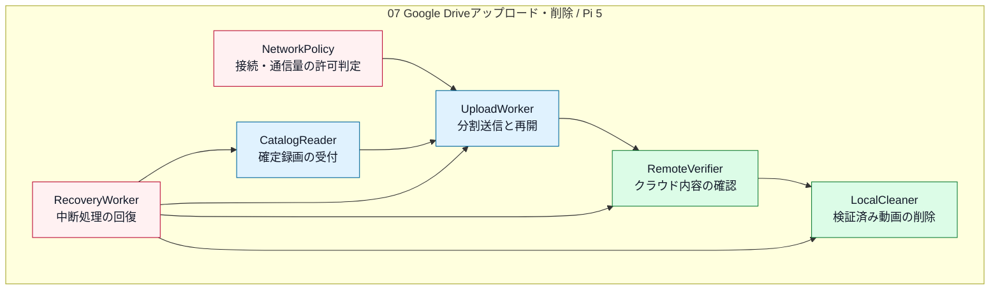
```mermaid
flowchart TB
 subgraph SW07["07 Google Driveアップロード・削除 / Pi 5"]
  N["NetworkPolicy<br/>接続・通信量の許可判定"]
  C["CatalogReader<br/>確定録画の受付"]
  U["UploadWorker<br/>分割送信と再開"]
  V["RemoteVerifier<br/>クラウド内容の確認"]
  L["LocalCleaner<br/>検証済み動画の削除"]
  R["RecoveryWorker<br/>中断処理の回復"]
  N --> U
  C --> U
  U --> V
  V --> L
  R --> C
  R --> U
  R --> V
  R --> L
 end
 classDef data fill:#e0f2fe,stroke:#0369a1,color:#111827
 classDef work fill:#dcfce7,stroke:#15803d,color:#111827
 classDef guard fill:#fff1f2,stroke:#be123c,color:#111827
 class C,U data
 class V,L work
 class N,R guard
```

| 接続 | 受け渡す情報 |
| --- | --- |
| CatalogReader → UploadWorker | READYの不変ファイル情報と処理所有ID |
| NetworkPolicy → UploadWorker | 許可ネットワーク・利用可能帯域・通信量予算 |
| UploadWorker → RemoteVerifier | 送信完了候補のremote_idと期待する内容 |
| RemoteVerifier → LocalCleaner | 永続化した検証結果。送信成功通知だけでは渡さない |
| RecoveryWorker → 各処理 | 中断段階に応じた再開要求。盲目的に先頭から送信しない |

<a id="dd-feature-flows"></a>

### 3.2 機能別処理フローチャート

各機能の開始条件、判断、正常・異常時の結果を示す。関数単位の入力と出力は3.7に記載する。

<a id="dd-feature-1"></a>

#### 3.2.1 送信条件の確認（UP-F01）

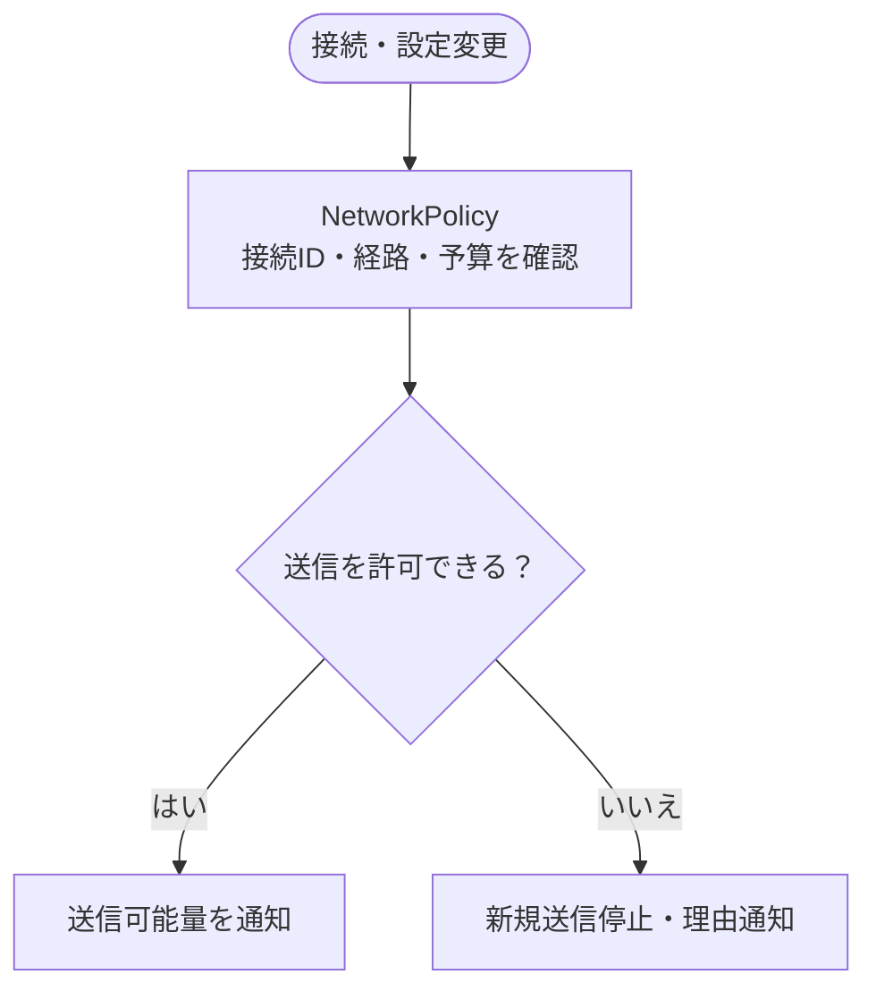
```mermaid
flowchart TB
 A(["接続・設定変更"]) --> B["NetworkPolicy<br/>接続ID・経路・予算を確認"]
 B --> C{"送信を許可できる？"}
 C -->|"はい"| D["送信可能量を通知"]
 C -->|"いいえ"| E["新規送信停止・理由通知"]
```

<a id="dd-feature-2"></a>

#### 3.2.2 確定録画の受付（UP-F02）

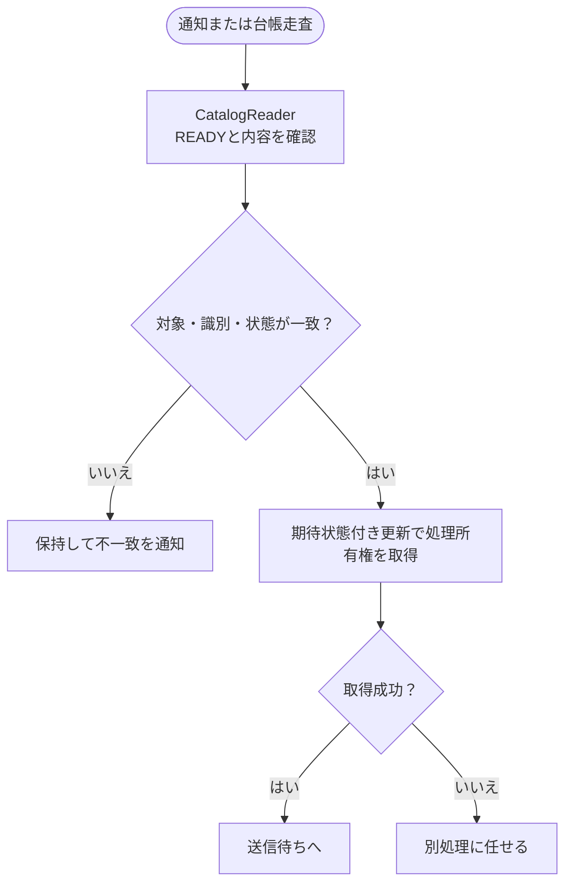
```mermaid
flowchart TB
 A(["通知または台帳走査"]) --> B["CatalogReader<br/>READYと内容を確認"]
 B --> C{"対象・識別・状態が一致？"}
 C -->|"いいえ"| D["保持して不一致を通知"]
 C -->|"はい"| E["期待状態付き更新で処理所有権を取得"]
 E --> F{"取得成功？"}
 F -->|"はい"| G["送信待ちへ"]
 F -->|"いいえ"| H["別処理に任せる"]
```

<a id="dd-feature-3"></a>

#### 3.2.3 途中から再開できる送信（UP-F03）

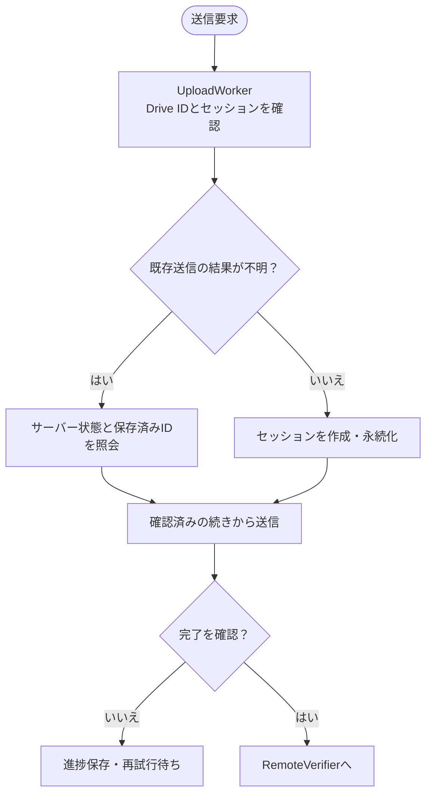
```mermaid
flowchart TB
 A(["送信要求"]) --> B["UploadWorker<br/>Drive IDとセッションを確認"]
 B --> C{"既存送信の結果が不明？"}
 C -->|"はい"| D["サーバー状態と保存済みIDを照会"]
 C -->|"いいえ"| E["セッションを作成・永続化"]
 D --> F["確認済みの続きから送信"]
 E --> F
 F --> G{"完了を確認？"}
 G -->|"いいえ"| H["進捗保存・再試行待ち"]
 G -->|"はい"| I["RemoteVerifierへ"]
```

<a id="dd-feature-4"></a>

#### 3.2.4 保存内容の検証（UP-F04）

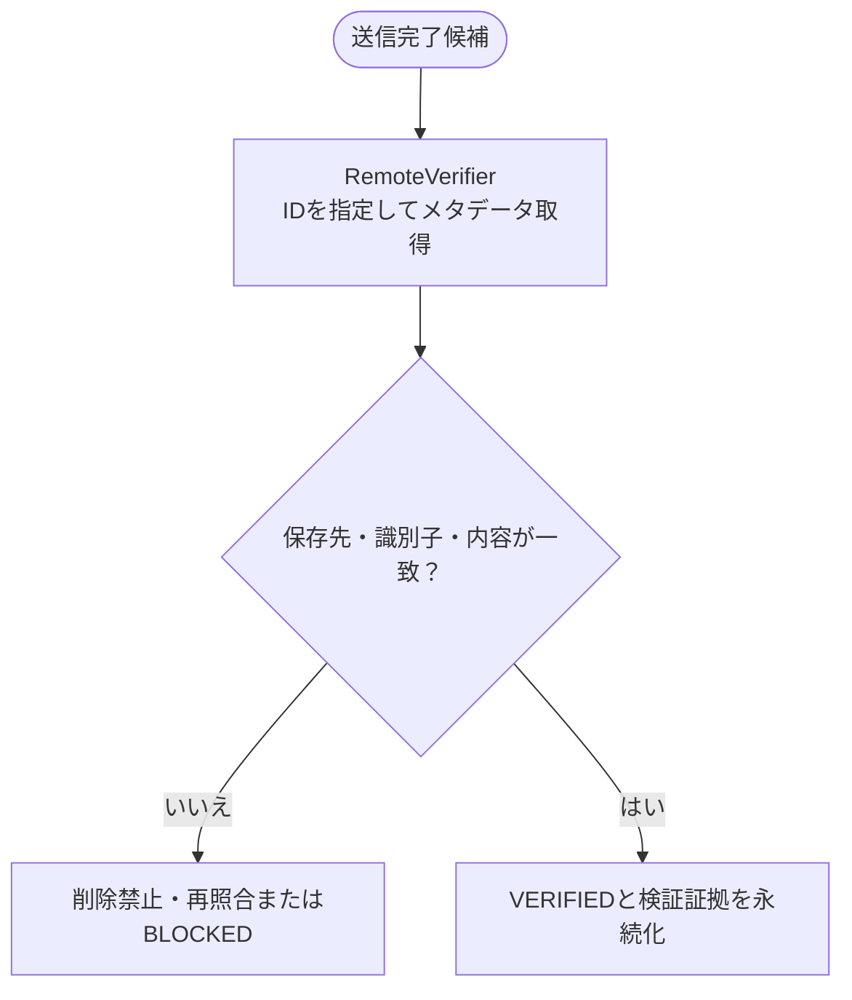
```mermaid
flowchart TB
 A(["送信完了候補"]) --> B["RemoteVerifier<br/>IDを指定してメタデータ取得"]
 B --> C{"保存先・識別子・内容が一致？"}
 C -->|"いいえ"| D["削除禁止・再照合またはBLOCKED"]
 C -->|"はい"| E["VERIFIEDと検証証拠を永続化"]
```

<a id="dd-feature-5"></a>

#### 3.2.5 検証済みローカル動画の削除（UP-F05）

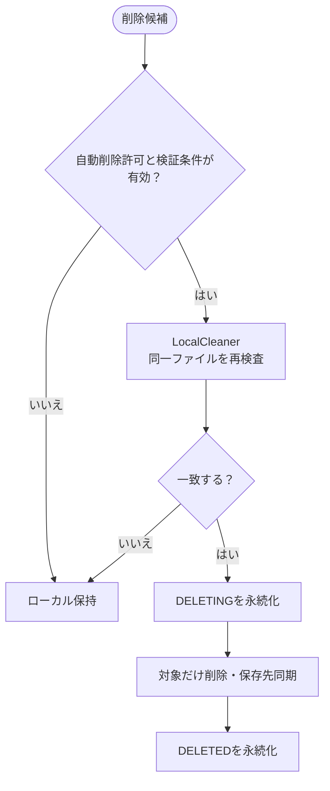
```mermaid
flowchart TB
 A(["削除候補"]) --> B{"自動削除許可と検証条件が有効？"}
 B -->|"いいえ"| C["ローカル保持"]
 B -->|"はい"| D["LocalCleaner<br/>同一ファイルを再検査"]
 D --> E{"一致する？"}
 E -->|"いいえ"| C
 E -->|"はい"| F["DELETINGを永続化"]
 F --> G["対象だけ削除・保存先同期"]
 G --> H["DELETEDを永続化"]
```

<a id="dd-feature-6"></a>

#### 3.2.6 中断回復と運用停止（UP-F06）

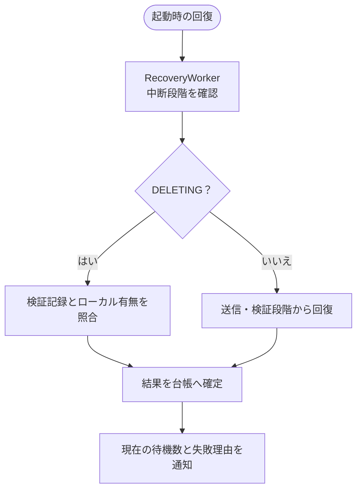
```mermaid
flowchart TB
 A(["起動時の回復"]) --> B["RecoveryWorker<br/>中断段階を確認"]
 B --> C{"DELETING？"}
 C -->|"はい"| D["検証記録とローカル有無を照合"]
 C -->|"いいえ"| E["送信・検証段階から回復"]
 D --> F["結果を台帳へ確定"]
 E --> F
 F --> G["現在の待機数と失敗理由を通知"]
```

<a id="dd-module-tree"></a>

### 3.3 モジュールツリー

```text
drive_upload_service
+-- NetworkPolicy
|   +-- evaluate_network
+-- CatalogReader
|   +-- claim_recording
+-- UploadWorker
|   +-- prepare_upload / send_chunk / resume_upload
+-- RemoteVerifier
|   +-- verify_remote
+-- LocalCleaner
|   +-- delete_verified
+-- RecoveryWorker
    +-- recover_pending / schedule_retry
    +-- publish_status / stop_uploads
```

<a id="dd-sequence"></a>

### 3.4 モジュール間の処理順序

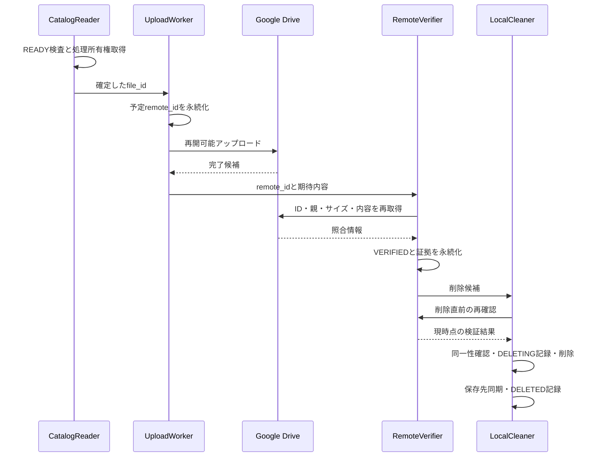
```mermaid
sequenceDiagram
 participant C as CatalogReader
 participant U as UploadWorker
 participant G as Google Drive
 participant V as RemoteVerifier
 participant L as LocalCleaner
 C->>C: READY検査と処理所有権取得
 C->>U: 確定したfile_id
 U->>U: 予定remote_idを永続化
 U->>G: 再開可能アップロード
 G-->>U: 完了候補
 U->>V: remote_idと期待内容
 V->>G: ID・親・サイズ・内容を再取得
 G-->>V: 照合情報
 V->>V: VERIFIEDと証拠を永続化
 V->>L: 削除候補
 L->>V: 削除直前の再確認
 V-->>L: 現時点の検証結果
 L->>L: 同一性確認・DELETING記録・削除
 L->>L: 保存先同期・DELETED記録
```

どのネットワーク応答を失っても、台帳のfile_idと先に確保したremote_idを基準に照合する。クラウドの同名ファイルを探して削除対象を推定しない。

<a id="dd-modules"></a>

### 3.5 モジュール詳細

SQLiteの短いトランザクションで期待する旧状態と所有IDを確認する。ファイル読込やHTTP応答待ちの間に台帳をロックし続けない。

<a id="dd-module-1"></a>

#### 3.5.1 NetworkPolicy（通信許可）

| 項目 | 内容 |
| --- | --- |
| 入力 | 接続プロファイル・経路・予算・熱負荷 |
| 出力 | 許可状態と送信上限 |
| 保持情報 | profile_id、route_generation、予算予約量、当日通信量 |
| 処理 | 新しいチャンク前に再確認。再送分も通信量に含める。経路変更は現在要求を中止し次の要求を許可しない |
| 関数 | evaluate_network |
| 異常時 | 接続種別・予算不明なら送信停止。すでに送ったデータは取り消せない |

<a id="dd-module-2"></a>

#### 3.5.2 CatalogReader（確定録画の選択）

| 項目 | 内容 |
| --- | --- |
| 入力 | RecordingReady、共有台帳、保存先 |
| 出力 | 所有権取得済みのUploadItem |
| 保持情報 | 台帳形式のバージョン、file_id、state_version、owner_boot_id |
| 処理 | 通知喪失時もREADYを有限件ずつ走査。06 カメラ表示・録画の回復と排他管理し、不変性を確認 |
| 関数 | claim_recording |
| 異常時 | 未確定・不一致を送らず、07 Google Driveアップロード・削除が担当するBLOCKEDへ条件付き遷移して通知 |

<a id="dd-module-3"></a>

#### 3.5.3 UploadWorker（分割送信）

| 項目 | 内容 |
| --- | --- |
| 入力 | UploadItem、ネットワーク許可、資格情報参照 |
| 出力 | 進捗・remote_id・完了候補 |
| 保持情報 | 予定remote_id、session_uri、受領済み範囲、試行番号 |
| 処理 | 許可フォルダにバイナリ動画として作成。IDと進捗を永続化し、サーバー回答を基準に再開 |
| 関数 | prepare_upload、send_chunk、resume_upload |
| 異常時 | 結果不明を成功にしない。期限切れセッションでも既存ID照合を先に行う |

<a id="dd-module-4"></a>

#### 3.5.4 RemoteVerifier（クラウドの内容検査）

| 項目 | 内容 |
| --- | --- |
| 入力 | 期待file_id・サイズ・ハッシュとremote_id |
| 出力 | 検証証拠または拒否理由 |
| 保持情報 | account_ref、folder_id、remote_version、検証時刻、検証内容 |
| 処理 | 明示取得したメタデータを照合し、欠落は成功にしない。検証証拠とVERIFIEDを同じDB更新で確定 |
| 関数 | verify_remote |
| 異常時 | 権限不足・変更・ゴミ箱・ハッシュ欠落では削除許可を出さない |

<a id="dd-module-5"></a>

#### 3.5.5 LocalCleaner（ローカル動画の限定削除）

| 項目 | 内容 |
| --- | --- |
| 入力 | VERIFIED行、自動削除許可 |
| 出力 | DELETEDまたは保持理由 |
| 保持情報 | 削除対象のfile_id・inode等・相対パス・処理所有ID |
| 処理 | 書込不可の専用領域で全処理者と排他。対象を再検査し、DELETINGを記録してから1件だけ削除 |
| 関数 | delete_verified |
| 異常時 | パス逸脱・差替え・サイズ変化で削除禁止。再帰削除やワイルドカードを使わない |

<a id="dd-module-6"></a>

#### 3.5.6 RecoveryWorker（再開・停止・状態通知）

| 項目 | 内容 |
| --- | --- |
| 入力 | 中断台帳、停止要求、各処理の結果 |
| 出力 | 再開指示、UI向け状態、終了結果 |
| 保持情報 | 起動ID、再試行期限、最新状態、処理上限 |
| 処理 | 単一起動を確認して旧所有権を回復。台帳で中断段階を判定し、終了時に新規仕事を止める |
| 関数 | recover_pending、schedule_retry、publish_status、stop_uploads |
| 異常時 | DB異常では新規送信と削除を止める。容量不足を理由に録画を消さない |

<a id="dd-files"></a>

### 3.6 ファイル構成

```text
src/raspberry_pi5/
+-- drive_upload_service.py
+-- drive_upload/
|   +-- network_policy.py       NetworkPolicy
|   +-- catalog_reader.py       CatalogReader
|   +-- uploader.py             UploadWorker
|   +-- verifier.py             RemoteVerifier
|   +-- cleaner.py              LocalCleaner
|   +-- recovery.py             RecoveryWorker
|   +-- google_drive.py         Google OAuth認証とDrive API v3
|   +-- local_files.py          通常ファイル・識別値・リンクの検査
|   +-- config.py               設定と理由コード
+-- config/drive_upload.example.json
+-- requirements-drive.txt
+-- systemd/l880k-drive-upload.service
+-- ui/state/upload_status.py  UI側の送信状態・通知期限
tests/drive_upload/
+-- test_drive_upload.py       中断・再開・照合・削除・通信許可
+-- test_upload_status.py      通知期限・接続状態・連番
```

実装済みの配置。実データ、秘密鍵、認証情報はソースや公開Gitへ含めない。

| フローチャートの論理関数 | 実装上の入口 |
| --- | --- |
| evaluate_network | `NetworkPolicy.before_request` / `reserve_chunk` |
| claim_recording | `CatalogReader.next_item` / `update`。単一起動ロックとstate_versionで競合を防ぐ |
| prepare_upload | `UploadWorker.upload`内でID保存、既存ID照合、セッション生成 |
| send_chunk / resume_upload | `GoogleDriveClient.send_chunk` / `resume_upload` |
| verify_remote | `RemoteVerifier.verify_remote` |
| delete_verified | `LocalCleaner.delete_verified` |
| recover_pending | `CatalogReader.recover_pending`と保存済み段階からの`RecoveryWorker.tick` |
| schedule_retry / publish_status | `RecoveryWorker`の同名関数 |
| stop_uploads | `run_service`のSIGINT/SIGTERM処理と`NetworkPolicy.check_control` |

<a id="dd-function-flows"></a>

### 3.7 関数のフローチャート

各関数はfile_id、処理所有ID、現在状態を照合する。キャンセル・再起動で古いHTTP応答が届いても新しい作業の結果へ反映しない。

<a id="dd-fn-evaluate-network"></a>

#### 3.7.1 evaluate_network（送信条件を判定する）

| 項目 | 内容 |
| --- | --- |
| 担当 | NetworkPolicy |
| 入力 | OS接続状態・実経路・通信量予約 |
| 戻り値・結果 | ALLOWEDまたは停止理由 |

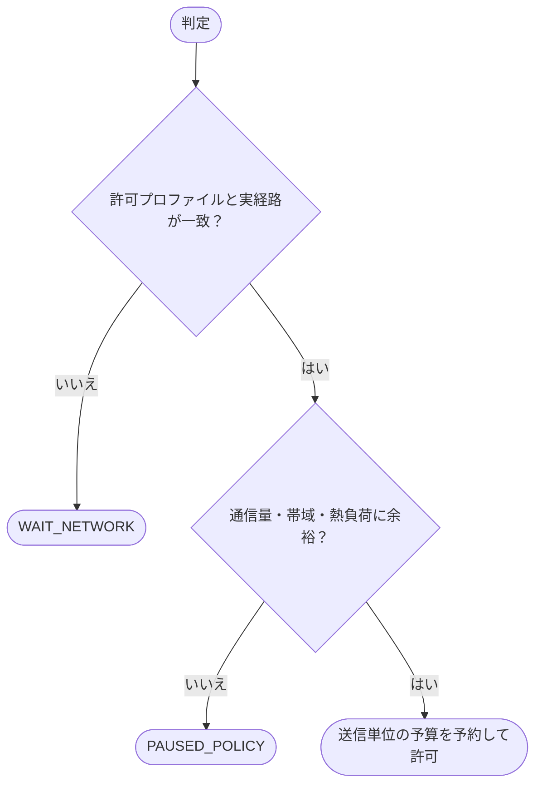
```mermaid
flowchart TB
 A(["判定"]) --> B{"許可プロファイルと実経路が一致？"}
 B -->|"いいえ"| X(["WAIT_NETWORK"])
 B -->|"はい"| C{"通信量・帯域・熱負荷に余裕？"}
 C -->|"いいえ"| Y(["PAUSED_POLICY"])
 C -->|"はい"| D(["送信単位の予算を予約して許可"])
```

<a id="dd-fn-claim-recording"></a>

#### 3.7.2 claim_recording（送信する録画を確保する）

| 項目 | 内容 |
| --- | --- |
| 担当 | CatalogReader |
| 入力 | 通知file_idまたはREADY一覧 |
| 戻り値・結果 | UploadItemまたは保留 |

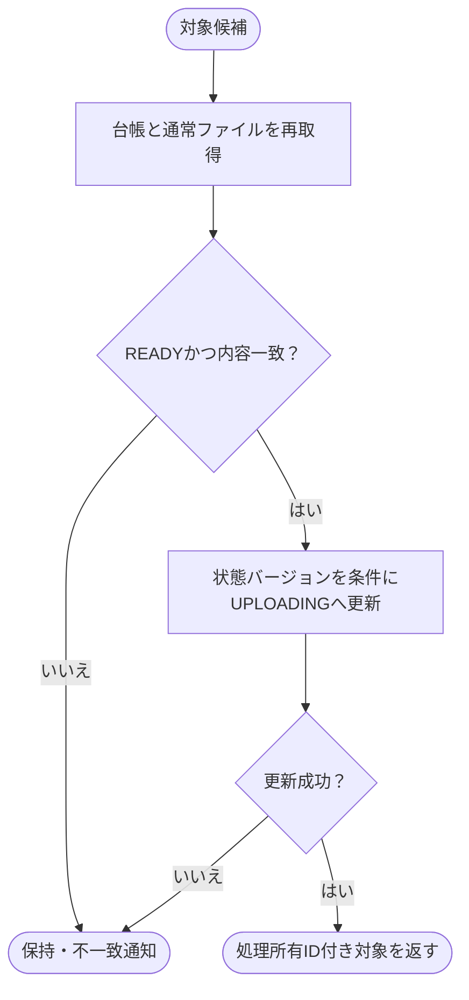
```mermaid
flowchart TB
 A(["対象候補"]) --> B["台帳と通常ファイルを再取得"]
 B --> C{"READYかつ内容一致？"}
 C -->|"いいえ"| X(["保持・不一致通知"])
 C -->|"はい"| D["状態バージョンを条件にUPLOADINGへ更新"]
 D --> E{"更新成功？"}
 E -->|"いいえ"| X
 E -->|"はい"| F(["処理所有ID付き対象を返す"])
```

<a id="dd-fn-prepare-upload"></a>

#### 3.7.3 prepare_upload（送信先と再開情報を準備する）

| 項目 | 内容 |
| --- | --- |
| 担当 | UploadWorker |
| 入力 | 対象と専用フォルダ・認証 |
| 戻り値・結果 | セッションまたは照合待ち |

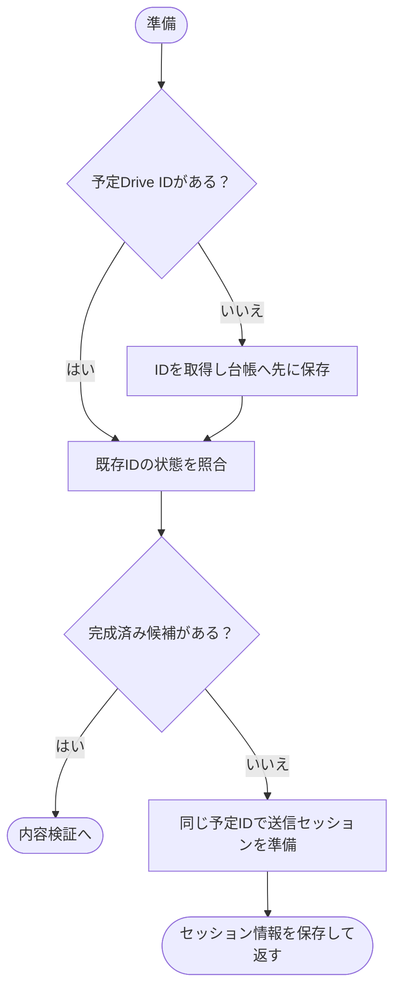
```mermaid
flowchart TB
 A(["準備"]) --> B{"予定Drive IDがある？"}
 B -->|"いいえ"| C["IDを取得し台帳へ先に保存"]
 B -->|"はい"| D["既存IDの状態を照合"]
 C --> D
 D --> E{"完成済み候補がある？"}
 E -->|"はい"| F(["内容検証へ"])
 E -->|"いいえ"| G["同じ予定IDで送信セッションを準備"]
 G --> H(["セッション情報を保存して返す"])
```

<a id="dd-fn-send-chunk"></a>

#### 3.7.4 send_chunk（動画の一部を送る）

| 項目 | 内容 |
| --- | --- |
| 担当 | UploadWorker |
| 入力 | セッション・受領位置・送信許可 |
| 戻り値・結果 | 進捗または完了候補 |

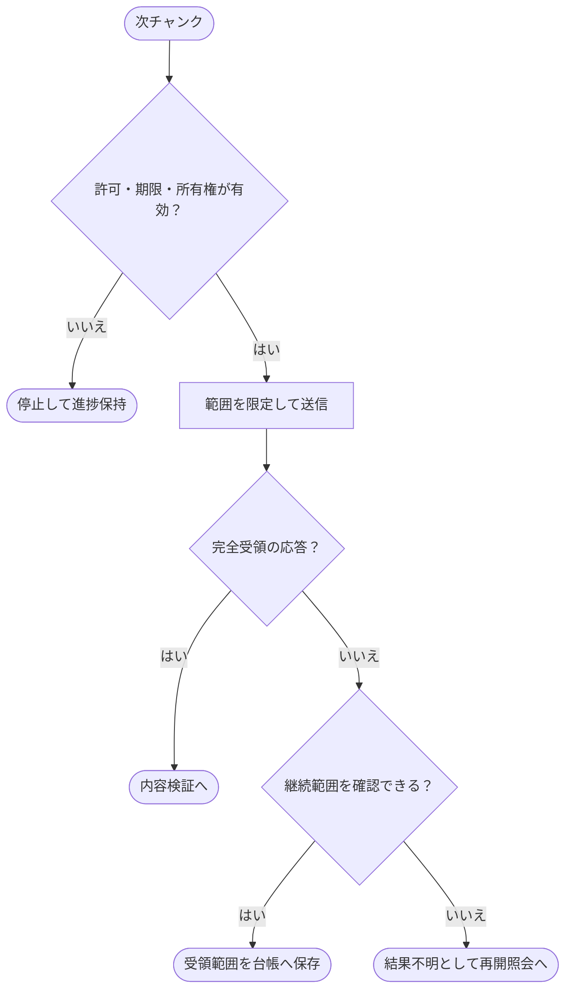
```mermaid
flowchart TB
 A(["次チャンク"]) --> B{"許可・期限・所有権が有効？"}
 B -->|"いいえ"| X(["停止して進捗保持"])
 B -->|"はい"| C["範囲を限定して送信"]
 C --> D{"完全受領の応答？"}
 D -->|"はい"| E(["内容検証へ"])
 D -->|"いいえ"| F{"継続範囲を確認できる？"}
 F -->|"はい"| G(["受領範囲を台帳へ保存"])
 F -->|"いいえ"| H(["結果不明として再開照会へ"])
```

<a id="dd-fn-resume-upload"></a>

#### 3.7.5 resume_upload（受領済み範囲を調べて再開する）

| 項目 | 内容 |
| --- | --- |
| 担当 | UploadWorker |
| 入力 | 保存セッション・予定Drive ID |
| 戻り値・結果 | 再開位置または照合結果 |

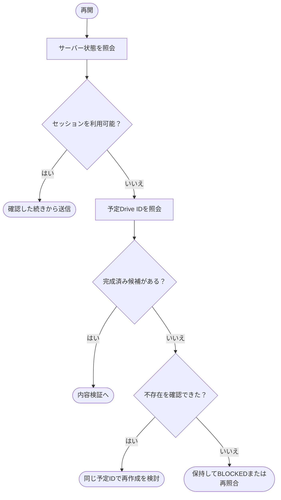
```mermaid
flowchart TB
 A(["再開"]) --> B["サーバー状態を照会"]
 B --> C{"セッションを利用可能？"}
 C -->|"はい"| D(["確認した続きから送信"])
 C -->|"いいえ"| E["予定Drive IDを照会"]
 E --> F{"完成済み候補がある？"}
 F -->|"はい"| G(["内容検証へ"])
 F -->|"いいえ"| H{"不存在を確認できた？"}
 H -->|"はい"| I(["同じ予定IDで再作成を検討"])
 H -->|"いいえ"| J(["保持してBLOCKEDまたは再照合"])
```

<a id="dd-fn-verify-remote"></a>

#### 3.7.6 verify_remote（クラウド上の動画を照合する）

| 項目 | 内容 |
| --- | --- |
| 担当 | RemoteVerifier |
| 入力 | 期待内容とremote_id |
| 戻り値・結果 | VERIFIEDまたは不一致 |

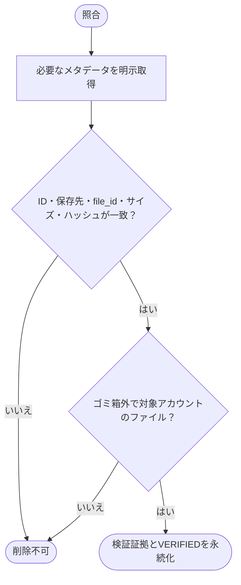
```mermaid
flowchart TB
 A(["照合"]) --> B["必要なメタデータを明示取得"]
 B --> C{"ID・保存先・file_id・サイズ・ハッシュが一致？"}
 C -->|"いいえ"| X(["削除不可"])
 C -->|"はい"| D{"ゴミ箱外で対象アカウントのファイル？"}
 D -->|"いいえ"| X
 D -->|"はい"| E(["検証証拠とVERIFIEDを永続化"])
```

初回検証は所有権を確認してUPLOADINGからVERIFIEDへ更新する。削除直前・DELETING回復時の再検証は新しい証拠だけを返し、進行中の状態をVERIFIEDへ巻き戻さない。

<a id="dd-fn-delete-verified"></a>

#### 3.7.7 delete_verified（検証済みの1件を削除する）

| 項目 | 内容 |
| --- | --- |
| 担当 | LocalCleaner |
| 入力 | VERIFIED行と削除許可 |
| 戻り値・結果 | DELETEDまたは保持 |

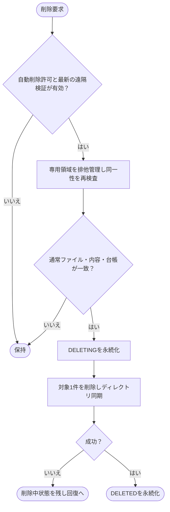
```mermaid
flowchart TB
 A(["削除要求"]) --> B{"自動削除許可と最新の遠隔検証が有効？"}
 B -->|"いいえ"| X(["保持"])
 B -->|"はい"| C["専用領域を排他管理し同一性を再検査"]
 C --> D{"通常ファイル・内容・台帳が一致？"}
 D -->|"いいえ"| X
 D -->|"はい"| E["DELETINGを永続化"]
 E --> F["対象1件を削除しディレクトリ同期"]
 F --> G{"成功？"}
 G -->|"いいえ"| H(["削除中状態を残し回復へ"])
 G -->|"はい"| I(["DELETEDを永続化"])
```

<a id="dd-fn-recover-pending"></a>

#### 3.7.8 recover_pending（中断した作業を回復する）

| 項目 | 内容 |
| --- | --- |
| 担当 | RecoveryWorker |
| 入力 | 台帳とローカル状態 |
| 戻り値・結果 | 再開・確定・保留 |

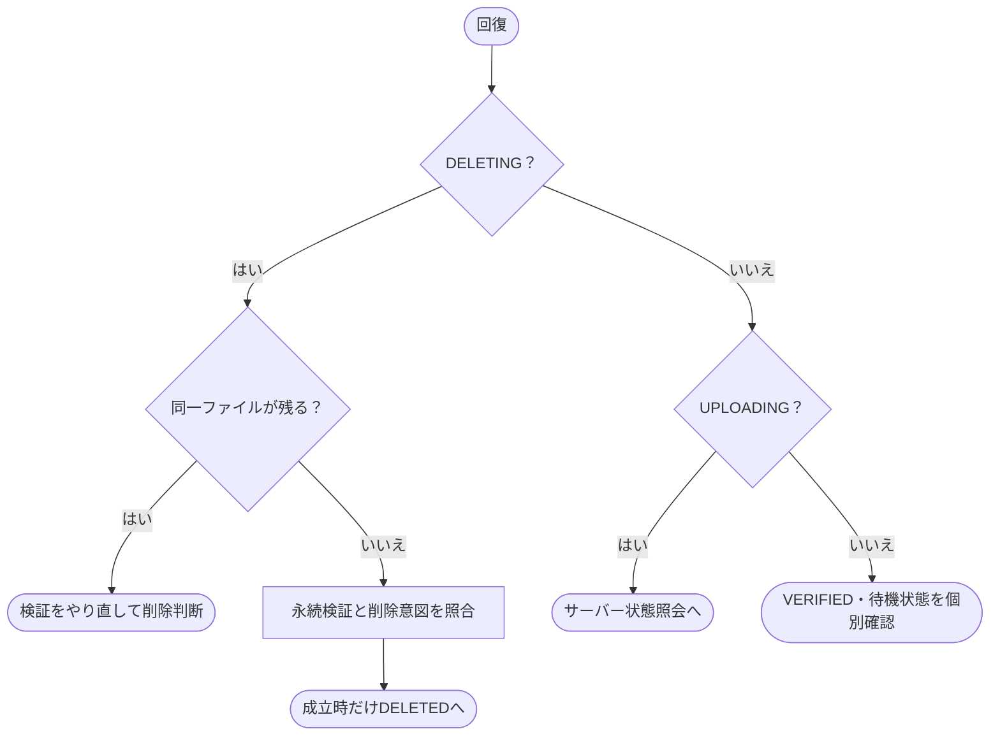
```mermaid
flowchart TB
 A(["回復"]) --> B{"DELETING？"}
 B -->|"はい"| C{"同一ファイルが残る？"}
 C -->|"はい"| D(["検証をやり直して削除判断"])
 C -->|"いいえ"| E["永続検証と削除意図を照合"]
 E --> F(["成立時だけDELETEDへ"])
 B -->|"いいえ"| G{"UPLOADING？"}
 G -->|"はい"| H(["サーバー状態照会へ"])
 G -->|"いいえ"| I(["VERIFIED・待機状態を個別確認"])
```

<a id="dd-fn-schedule-retry"></a>

#### 3.7.9 schedule_retry（再試行日時を決める）

| 項目 | 内容 |
| --- | --- |
| 担当 | RecoveryWorker |
| 入力 | 失敗分類・回数・現在時刻 |
| 戻り値・結果 | RETRY_WAITまたはBLOCKED |

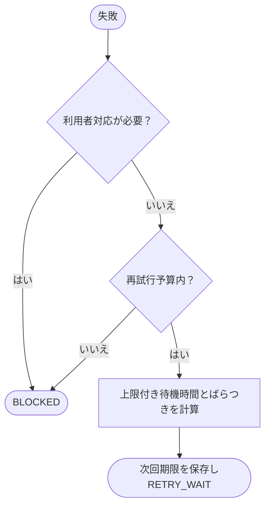
```mermaid
flowchart TB
 A(["失敗"]) --> B{"利用者対応が必要？"}
 B -->|"はい"| C(["BLOCKED"])
 B -->|"いいえ"| D{"再試行予算内？"}
 D -->|"いいえ"| C
 D -->|"はい"| E["上限付き待機時間とばらつきを計算"]
 E --> F(["次回期限を保存しRETRY_WAIT"])
```

<a id="dd-fn-publish-status"></a>

#### 3.7.10 publish_status（送信状況を通知する）

| 項目 | 内容 |
| --- | --- |
| 担当 | RecoveryWorker |
| 入力 | 台帳集計・通信・エラー |
| 戻り値・結果 | upload.status |

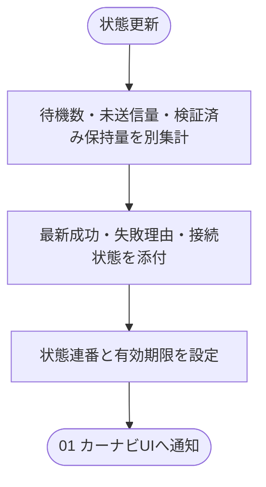
```mermaid
flowchart TB
 A(["状態更新"]) --> B["待機数・未送信量・検証済み保持量を別集計"]
 B --> C["最新成功・失敗理由・接続状態を添付"]
 C --> D["状態連番と有効期限を設定"]
 D --> E(["01 カーナビUIへ通知"])
```

<a id="dd-fn-stop-uploads"></a>

#### 3.7.11 stop_uploads（送信処理を終了する）

| 項目 | 内容 |
| --- | --- |
| 担当 | RecoveryWorker |
| 入力 | 停止期限 |
| 戻り値・結果 | 中断情報と終了結果 |

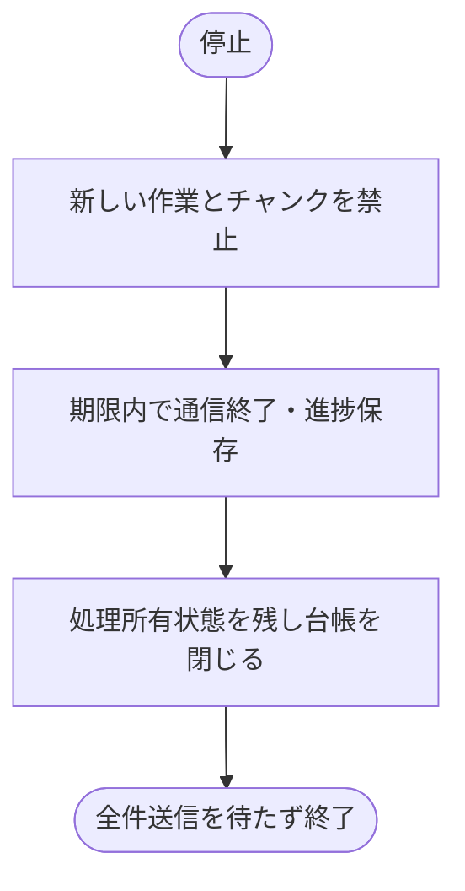
```mermaid
flowchart TB
 A(["停止"]) --> B["新しい作業とチャンクを禁止"]
 B --> C["期限内で通信終了・進捗保存"]
 C --> D["処理所有状態を残し台帳を閉じる"]
 D --> E(["全件送信を待たず終了"])
```

<a id="dd-4"></a>

## 4. インターフェース設計


<a id="dd-interface-diagrams"></a>

### 4.1 外部接続と担当モジュール

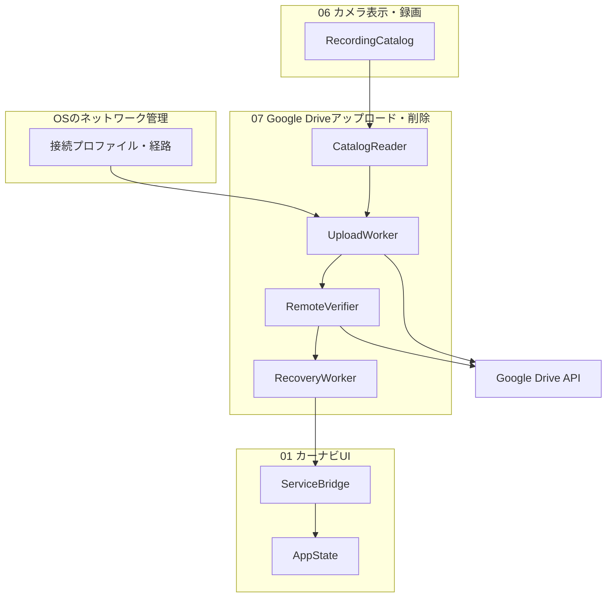
```mermaid
flowchart TB
 subgraph REC["06 カメラ表示・録画"]
  K["RecordingCatalog"]
 end
 subgraph UP["07 Google Driveアップロード・削除"]
  C["CatalogReader"]
  U["UploadWorker"]
  V["RemoteVerifier"]
  R["RecoveryWorker"]
  C --> U
  U --> V
  V --> R
 end
 subgraph OS["OSのネットワーク管理"]
  N["接続プロファイル・経路"]
 end
 G["Google Drive API"]
 subgraph UI["01 カーナビUI"]
  S["ServiceBridge"]
  A["AppState"]
  S --> A
 end
 K --> C
 N --> U
 U --> G
 V --> G
 R --> S
```
図中のOS情報は内部のNetworkPolicyで許可判定してからUploadWorkerへ渡す。UIは録画台帳の録画状態を直接変更しない。

[06 カメラ表示・録画](06_カメラ表示録画.md#dd-recording-contract)と共通のfile_idを使用する。SQLiteの録画台帳形式のバージョン、処理所有者ID、状態バージョンを検査する。録画サービスはclose・fsync・全フレーム再生検査・確定名への変更後に`CatalogReader.register_ready`を呼ぶ。録画側の`capture_segments`テーブルと送信側の`recordings`テーブルは同じDB内に置き、07は録画側テーブルを更新しない。手動検証には`register --closed-file`を使用する。フォルダ走査で動画を勝手にREADYへ変換しない。

<a id="dd-contract"></a>

### 4.2 台帳・操作・状態の契約

| 情報・操作 | 内容 |
| --- | --- |
| RecordingReady | 初期実装は通知ソケットを使わず、共通APIによるREADY登録と台帳の定期取得で受け渡す |
| 対象の選択 | READY・UPLOADING・RETRY_WAITの期限到来行。削除有効時はVERIFIED・DELETINGも対象。単一起動ロック下で確定順、同時刻はfile_id順に取得 |
| pause_upload / resume_upload | 現行実装はローカル管理CLIの`pause` / `resume`。SQLiteに休止状態を保存し、送信・削除の開始前に確認する。UIからの変更要求は未接続 |
| retry_blocked | サービス停止中に管理CLIの`retry --file-id`を使用する。内容不一致・削除証拠不良は解除しない |
| upload.status | 状態別件数・バイト数、最大20件の理由コードとfile_id、休止状態。再開URIや録画パスを返さない |
| 不一致の通知 | 現行はファイルの再検査で不一致を検出し、BLOCKEDとして保持する。06 カメラ表示・録画からの不一致通知受信は未接続 |
台帳パスに`.uploader.lock`を付けたファイルでアップロードサービスの単一起動を保証する。`.files.lock`は録画確定・既存録画の移動・差替え・削除の共通ロックで、録画側も必ず使用する。READY後の動画は不変とする。DBの更新はstate_version付きで行い、古い行の更新を拒否する。初期実装では`register_ready`以外からのWRITING/INCOMPLETE登録や録画回復通知は未接続である。

状態ソケットは`$XDG_RUNTIME_DIR/l880k-drive-upload.sock`で、`status` / `GET_STATE` / `GET_HEALTH`と`pause` / `resume`を受け付ける。UIのServiceBridgeが1秒周期で最新スナップショットを照会する。`schema_version=1`、`source_service`、`boot_id`、`sequence`、`age_ms`、`valid_for_ms=5000`を使用し、同じ通知を再取得してもUIの期限を延長しない。カメラ画面のクラウド同期欄に状態と未完了件数を表示する。

`pause` / `resume`は台帳の一時停止フラグだけを保存し、`accepted`、`paused`、設定上の`enabled`を返す。現在の送信単位が終わるまで停止に時間がかかる場合がある。認証・許可ネットワーク・自動削除の条件を変更しない。UIは3秒の応答待ちを超えた場合に成功表示せず、自動再送しない。送信・削除の結果は既存の状態照会で確認する。

状態通知は共通のsource・boot_id・sequence・年齢・有効期間を持つ。通知の途絶をUI側でも検出し、「アップロード正常」の表示を維持しない。

<a id="dd-drive-api"></a>

### 4.3 Google Drive APIと認証

Google Drive API v3を採用する。認証には公式のgoogle-auth / google-auth-oauthlib、HTTPにはrequestsを使用する。プロセス再起動後も再開URIを復元するため、再開可能アップロードのHTTP要求を`GoogleDriveClient`で管理する。APIアダプターは308、受領範囲、期限切れ、事前生成IDを扱い、無条件のHTTP自動再送やリダイレクトを無効にする。[Google Driveのアップロード仕様](https://developers.google.com/workspace/drive/api/guides/manage-uploads)

files.getではid、parents、trashed、size、md5Checksum、appProperties、version等の必要項目を指定して取得する。動画はGoogleドキュメントへ変換せずバイナリとして保存する。MD5は内容転送の一致確認に使用し、認証や改ざん耐性の保証として扱わない。追加の強いハッシュを使う場合も独立に確認できる値と照合する。[Google Drive files仕様](https://developers.google.com/workspace/drive/api/reference/rest/v3/files)

利用者のOAuth認証を用い、`drive.file`スコープで初期設定コマンドが作成した専用フォルダを利用する。`account_ref`はDrive aboutのuser.permissionIdとする。資格情報は設定先の所有者限定ファイルへ原子的に保存する。アクセストークン、更新トークン、セッションURIをログへ出さない。認証と専用フォルダ作成は明示的な初期設定コマンドで行い、常駐処理から認証画面を開かない。[Google Driveの認可スコープ](https://developers.google.com/workspace/drive/api/guides/api-specific-auth)

<a id="dd-5"></a>

## 5. データ・設定設計


<a id="dd-data"></a>

### 5.1 永続データ

| 項目 | 用途 |
| --- | --- |
| file_id / relative_path / camera_id / size_bytes / checksum | 録画確定時に登録した期待内容。不変 |
| state / state_version / owner_boot_id | 状態遷移と処理所有権。古い応答の反映を拒否 |
| planned_remote_id | 作成前に予定IDを保存。完了後も同じIDを使用 |
| settings.destination | account_refとfolder_idを台帳単位で固定 |
| session_uri / acknowledged_bytes | 秘密扱いの再開URIと確認済みバイト数。サーバー受領範囲が正 |
| verification_evidence | 確認時刻・遠隔バージョン・照合対象を含むJSON。VERIFIED更新と一緒に永続化 |
| delete_intent / local_identity / deleted_at | 削除前の意思記録、同一ファイル確認、完了記録 |
| retry_count / retry_after / blocked_reason | 再試行と利用者対応の区別 |
| network_budget.day / bytes | UTC日次送信量の予約。再送も消費として扱う |
再試行期限はUNIX時刻で永続化し、常駐処理の確認間隔と帯域制御には単調時計を使用する。起動時に600秒を超えて未来にある再試行期限を丸める。時計の大幅な前進で期限が早く到来する場合はあるが、確認周期と最大再試行回数で連打を制限する。日次予算はUTC日付に依存するため、実機の時刻同期を前提とする。

<a id="dd-delete-guard"></a>

### 5.2 削除の必須条件

削除可否は次の全条件のANDとする。

1. 自動削除が明示的に許可され、台帳がVERIFIEDである。
2. 保存アカウント・専用フォルダ・remote_id・file_id・サイズ・内容が一致する。
3. 削除直前にも遠隔の存在・ゴミ箱外・内容を確認できる。通信できない場合は保持する。
4. ローカルは録画ルート内の通常ファイルで、台帳に一致し、内容が変化していない。
5. 対象と親ディレクトリは信頼したサービスだけが変更でき、全変更者の排他条件が成立する。
6. DELETINGの永続記録に成功してから削除する。

パス文字列の確認とunlinkの間の差替えを防ぐため、専用ディレクトリの権限・管理ロック・ディレクトリ参照を使った操作を組み合わせる。シンボリックリンクを辿らず、ハードリンクや所有が不明なファイルも拒否する。排他性を確認できない環境では自動削除しない。

クラウドの確認とローカル削除は一つの原子的操作ではない。確認直後に利用者が遠隔動画を消す等の同時操作まで防げないため、運用上も専用保存先の変更者を限定する。削除検証試験はダミー動画と専用試験フォルダで行う。

<a id="dd-config"></a>

### 5.3 設定・処理上限

| 設定 | 方針 |
| --- | --- |
| enabled / auto_delete_enabled | 送信と削除を別設定。初期検証では削除false |
| account_ref / folder_id / credential_path | 承認済み保存先と認証ファイルの場所。変更時は既存作業を混在させない |
| allowed_profile_ids | NetworkManagerの接続UUIDの配列。HTTP要求前にDNS候補ごとの`ip -j route get`と`nmcli`を検査。環境変数のHTTPプロキシは使用しない |
| daily_byte_budget / bandwidth_bytes_per_second | 既定1GiB/UTC日、平均1MiB/s。チャンク送信前に予算を消費し、再送分も集計。HTTP/TLS等の通信量は別途余裕が必要 |
| 同時送信数 | 1固定。設定項目として増やせない |
| chunk_bytes / io_timeout_s / max_retries | 既定1MiB、15秒、8回。256KiBの倍数で分割し、失敗時は10秒から最大600秒の指数待機。Retry-Afterが長い場合はそちらを優先 |
| exclusive_recording_root | 専用領域と共通ロックを確認した場合だけtrue。直前照合は固定処理で、省略する設定は設けない |
| poll_interval_s | 既定2秒。候補1行だけ取得し、状態の問題一覧は20件までとする |

NetworkManagerが管理していない接続、経路を判定できない環境は送信待機とする。経路検査とHTTP送信は原子的ではなく、送信中の経路変更を即時に強制遮断する機構は未実装。厳密な経路固定が必要な実機ではOS側のルーティング・ファイアウォール制約を追加する。熱負荷に応じた可変帯域制御も未実装で、現行は固定帯域制限と低いCPU/I/O優先度を使用する。

<a id="dd-6"></a>

## 6. 処理・状態遷移


<a id="dd-states"></a>

### 6.1 正常処理と待機

```mermaid
stateDiagram-v2
 [*] --> READY
 READY --> UPLOADING: 所有権取得と送信開始
 UPLOADING --> VERIFIED: 遠隔内容の検証成功
 UPLOADING --> RETRY_WAIT: 一時障害
 UPLOADING --> BLOCKED: 認証・内容・容量の問題
 RETRY_WAIT --> UPLOADING: 許可条件と再試行期限成立
 BLOCKED --> UPLOADING: 原因解消と再試行承認
 VERIFIED --> DELETING: 削除直前再確認成功
 DELETING --> DELETED: 削除と保存先同期完了
 DELETED --> [*]
```
VERIFIEDは自動削除無効・遠隔再確認不能なら保持する。READYは06 カメラ表示・録画が確定した状態を引き継ぐ。WRITING / INCOMPLETEは送信対象にしない。削除後に遠隔動画が無くなっても、台帳をREADYへ戻して存在しないローカルを送信しようとしない。

<a id="dd-recovery"></a>

### 6.2 失敗段階別の回復

| 中断位置 | 回復動作 |
| --- | --- |
| 予定ID保存前 | 未送信として通常準備。先に遠隔ファイルを作る実装は禁止 |
| セッション作成応答喪失 | 予定IDと送信状態を照会してから再開 |
| 部分送信中 | サーバー受領範囲を照会し継続。セッション期限切れは既存IDを確認 |
| 完了応答喪失 | 予定IDで存在・内容を照合。一致なら検証へ。不明なら保持 |
| VERIFIED後 | 同一内容を再確認して削除判断。検証証拠なしなら削除しない |
| DELETINGでファイルあり | 同一性と遠隔内容を再確認して削除を再試行 |
| DELETINGでファイルなし | 永続検証と削除意図があれば保存先を同期しDELETEDへ。証拠なしは異常 |
| DB破損・台帳形式のバージョン不一致 | 送信と削除を停止。読み取れない状態から推測削除しない |

<a id="dd-7"></a>

## 7. 異常処理

| 異常 | 動作 |
| --- | --- |
| ネットワーク解除・経路変更 | 新チャンクを止め、進捗を保持。送信済みバイトは戻せない |
| 認証期限・同意取消 | 更新を有限回試し、失敗ならBLOCKED。秘密値を通知に出さない |
| APIレート制限・一時サーバー障害 | 応答の理由と再試行指定を確認し上限付き待機 |
| Drive容量不足・フォルダ権限喪失 | BLOCKED。ローカル保持。遠隔を自動削除して空けない |
| 内容不一致・ハッシュ未取得 | VERIFIEDへ進めない。自動で遠隔上書きしない |
| ローカル差替え・ルート逸脱 | 削除禁止。不一致を記録し利用者対応待ち |
| 録画I/O・熱負荷上昇 | 現行は固定の帯域制限と低優先度。負荷連動の休止は未実装であり、必要時は管理CLIで休止する |

<a id="dd-8"></a>

## 8. 起動・終了・運用設計

起動時は設定・専用保存先・台帳形式のバージョンを確認し、単一起動ロックを取得して中断状態を回復する。現行は登録済みの不変動画だけを処理し、06 カメラ表示・録画の回復処理との連携は未接続。UI未起動でも台帳作業は独立して動く。

終了時は新規作業を止め、HTTPの接続・読取タイムアウトとunitの90秒停止期限を使用する。DNS解決等はOSの制約にも依存する。確認できた受領範囲を保存し、結果不明なら次回サーバーへ照会する。全件送信や削除完了をOS停止条件にしない。再起動時は旧所有者が停止したことをロックで確認して所有権を取り直す。

転送済み・未送信・検証済み保持・削除済みを別集計する。Driveの容量不足とローカルSSD不足を区別して通知する。運転中に認証画面操作を要求せず、停車中に設定する。

<a id="dd-9"></a>

## 9. 試験・受入条件


<a id="dd-tests"></a>

### 9.1 単体・障害注入試験

| 試験 | 受入条件 |
| --- | --- |
| UP-T01 / UP-F01：別SSID・同名SSID・経路切替 | 許可経路以外へ新規送信しない。再送を含め通信量集計 |
| UP-T02 / UP-F02：重複通知・複数処理者・台帳不一致 | 1file_idにつき1所有者。未確定を送らない |
| UP-T03 / UP-F03：部分送信・308・応答喪失・セッション期限切れ | 受領範囲から再開。予定IDを変えて無制限に複製しない |
| UP-T04 / UP-F04：別親・ゴミ箱・ハッシュ欠落・内容不一致 | 検証失敗としてローカル保持 |
| UP-T05 / UP-F05：パス逸脱・リンク・差替え | 録画ルート外と別ファイルを一切削除しない |
| UP-T06 / UP-F05：DELETING直前直後の強制終了 | 永続証拠を照合して回復。未検証ファイルは削除しない |
| UP-T07 / UP-F06：認証取消・容量不足・台帳破損 | BLOCKEDまたは停止。再試行連打・推測削除なし |
| UP-T08 / UP-F06：OS終了・UI終了 | 中断位置を保存。全件送信を待たず、UI終了だけで作業を止めない |

<a id="dd-integration-tests"></a>

### 9.2 実機受入と性能

試験専用Driveフォルダへダミー動画を送り、ダウンロードした内容との一致も確認する。スマートフォンの切断・再接続、4カメラ録画同時動作、容量不足、長期未接続を試す。転送速度・録画遅延・通信量・再開時間・削除記録を残す。各目標値はT.B.Dで、未確定のまま合格にしない。模擬APIを使う単体試験を実装しているが、実Drive接続とLinuxの削除・電源断試験は未実施。

<a id="dd-10"></a>

## 10. 未確定事項・実装課題

| 課題 | 確定条件 |
| --- | --- |
| OAuthと保存先 | 最小権限で専用フォルダを利用・更新できる |
| SDK・再開・ID指定 | 部分送信と完了応答喪失の契約試験が成立 |
| 台帳回復ロック | 06 カメラ表示・録画とのREADY不一致・起動順の合意 |
| 通信量と帯域 | テザリング契約と録画性能に収まる上限 |
| 自動削除 | 専用領域の排他・証拠・異常終了試験の合格後に有効化 |

<a id="dd-glossary"></a>

## 用語の注釈

| 用語 | 意味 |
| --- | --- |
| 再開可能アップロード | 切断後に受領済み位置を確認して続きから送れる方式 |
| チェックサム | 動画の内容が一致するか確認する値 |
| 処理所有権 | 同じ動画を複数処理が同時に送信・削除しないための担当記録 |
| VERIFIED | 保存内容を照合し、その結果を台帳へ記録した状態 |
| DELETING | 削除する意思を先に記録し、削除完了はまだ確定していない状態 |
