# サラウンドビュー 詳細設計書

| 項目 | 内容 |
| --- | --- |
| 文書ID | SW-DD-08 |
| 実行環境 | Pi 5 |
| 実装状態 | 未実装・段階開発の設計案 |
| 対象ソース | `src/raspberry_pi5/surround_view_service.py`（作成予定） |
| 作成日 | 2026-09-14 |
| 更新日 | 2026-09-17 |

[詳細設計一覧](README.md) / [共通仕様](00_共通仕様.md) / [上位設計](../ソフトウェア設計図.md#sec-43)

## 目次

- [1. 目的・適用範囲](#dd-1)
- [2. 要求仕様・役割](#dd-2)
  - [2.1 機能一覧](#dd-functions)
  - [2.2 機能・モジュール・関数の対応](#dd-function-map)
- [3. 内部構成](#dd-3)
  - [3.1 モジュールの全体構成](#dd-overview)
  - [3.2 機能別処理フローチャート](#dd-feature-flows)
    - [3.2.1 駐車条件の判定（SV-F01）](#dd-feature-1)
    - [3.2.2 校正データの確認（SV-F02）](#dd-feature-2)
    - [3.2.3 4方向の時刻合わせ（SV-F03）](#dd-feature-3)
    - [3.2.4 歪み補正と俯瞰合成（SV-F04）](#dd-feature-4)
    - [3.2.5 表示配信と条件喪失時の停止（SV-F05）](#dd-feature-5)
  - [3.3 モジュールツリー](#dd-module-tree)
  - [3.4 モジュール間の処理順序](#dd-sequence)
  - [3.5 モジュール詳細](#dd-modules)
    - [3.5.1 EligibilityGate（利用条件の確認）](#dd-module-1)
    - [3.5.2 FrameSynchronizer（4方向の時刻合わせ）](#dd-module-2)
    - [3.5.3 CalibrationLoader（校正の読込・検査）](#dd-module-3)
    - [3.5.4 Undistorter（レンズ歪み補正）](#dd-module-4)
    - [3.5.5 BirdEyeProjector（地面座標への変換）](#dd-module-5)
    - [3.5.6 Blender（重なり領域の合成）](#dd-module-6)
    - [3.5.7 QualityPublisher（映像・利用可否の通知）](#dd-module-7)
  - [3.6 ファイル構成](#dd-files)
  - [3.7 関数のフローチャート](#dd-function-flows)
    - [3.7.1 evaluate_eligibility（停車・駐車条件を確認する）](#dd-fn-evaluate-eligibility)
    - [3.7.2 load_calibration（校正セットを検査する）](#dd-fn-load-calibration)
    - [3.7.3 build_remap（歪み補正マップを準備する）](#dd-fn-build-remap)
    - [3.7.4 select_frame_set（同時刻に近い4方向を選ぶ）](#dd-fn-select-frame-set)
    - [3.7.5 undistort_frame（画像の歪みを補正する）](#dd-fn-undistort-frame)
    - [3.7.6 project_ground（地面の俯瞰画像へ変換する）](#dd-fn-project-ground)
    - [3.7.7 blend_views（4方向の重なりを合成する）](#dd-fn-blend-views)
    - [3.7.8 publish_result（期限内の合成結果を通知する）](#dd-fn-publish-result)
    - [3.7.9 invalidate_output（表示許可を取り消す）](#dd-fn-invalidate-output)
    - [3.7.10 stop_surround（合成と映像利用を終了する）](#dd-fn-stop-surround)
- [4. インターフェース設計](#dd-4)
  - [4.1 利用ソフトとモジュールの接続](#dd-interface-diagrams)
  - [4.2 入力・出力契約](#dd-contract)
  - [4.3 校正・画像処理ライブラリ](#dd-image-api)
- [5. データ・設定設計](#dd-5)
  - [5.1 校正セットと座標系](#dd-calibration)
  - [5.2 同期判定と画像寿命](#dd-freshness)
  - [5.3 モード・設定と初期値](#dd-config)
- [6. 処理・状態遷移](#dd-6)
  - [6.1 利用状態](#dd-states)
  - [6.2 校正変更・負荷増大時の処理](#dd-runtime)
- [7. 異常処理](#dd-7)
- [8. 起動・終了・運用設計](#dd-8)
- [9. 試験・受入条件](#dd-9)
  - [9.1 単体・境界条件試験](#dd-tests)
  - [9.2 停車中の実機受入](#dd-integration-tests)
- [10. 未確定事項・実装課題](#dd-10)
- [用語の注釈](#dd-glossary)

<a id="dd-1"></a>

## 1. 目的・適用範囲

前後左右4カメラの映像から、駐車支援用の俯瞰映像を生成する。入力は06 カメラ表示・録画が配信するフレームだけを使用し、カメラを重複して開かない。元映像の録画は同ソフトが継続する。

本機能は停車・駐車条件が確認できる場合に限定する。走行中、車速不明、駐車情報未確認では表示を許可しない。後退中も含めて速度のある駐車操作へ範囲を広げる場合は、別途要求と閾値の承認が必要。

初期設定は無効。4分割表示、歪み補正、地面への射影・合成の順に検証する。四隅や車体下の見えていない範囲を、安全な空間として補完しない。自動駐車・障害物検知・距離保証は対象外。

<a id="dd-2"></a>

## 2. 要求仕様・役割

機能は実現する動作、モジュールは処理の分担、関数はモジュール内の処理単位を表す。本書のソース構成と通信名は未実装の設計案であり、採用ライブラリの標準APIと区別する。

<a id="dd-functions"></a>

### 2.1 機能一覧

| 機能ID | 機能 | 実現する動作 |
| --- | --- | --- |
| SV-F01 | 駐車条件の判定 | **開始条件・入力：** 09 OBD2車両情報取得の車速、確認済みの駐車判定入力、UI利用要求を受け取る。<br/>**確認・処理：** 値・単位・起動ID・順序・期限を確認する。0 km/hだけで駐車とせず、駐車情報の取得方法が未確定なら許可しない。<br/>**処理結果：** 利用可否と理由、許可世代を通知する。条件喪失は直ちに表示取消へ進める。 |
| SV-F02 | 校正データの確認 | **開始条件・入力：** 4カメラの実デバイス・レンズ・寸法・取付情報と保存した校正セットを受け取る。<br/>**確認・処理：** 同じ取付条件、画像方向、解像度、モデル、校正データのバージョンかを検査する。解像度変更時に行列を無条件で流用しない。<br/>**処理結果：** 全方向をまとめた有効な校正セットと補正マップを準備する。不一致なら俯瞰合成を止める。 |
| SV-F03 | 4方向の時刻合わせ | **開始条件・入力：** 06 カメラ表示・録画のFrameRefと撮影時計の対応品質を受け取る。<br/>**確認・処理：** 受信順ではなく撮影時刻の共通時間軸で選ぶ。許容時刻差・各フレーム年齢・時計誤差を確認し、待ち時間と保持件数を制限する。<br/>**処理結果：** 条件を満たす4方向を一組で渡す。揃わない古い画像を引き伸ばして使わない。 |
| SV-F04 | 歪み補正と俯瞰合成 | **開始条件・入力：** 有効フレーム集合、校正セット、有効領域マスクを受け取る。<br/>**確認・処理：** OpenCV等で歪みを補正し、地面平面へ射影して重なりを合成する。車体・非観測領域と欠落画像を別マスクで除外する。<br/>**処理結果：** 校正データのバージョン・入力時刻・有効領域付きの俯瞰映像を作る。高さのある物体の形状・距離は保証しない。 |
| SV-F05 | 表示配信と条件喪失時の停止 | **開始条件・入力：** 合成結果、最新の利用許可、入力期限、UI表示世代を受け取る。<br/>**確認・処理：** 出力直前に全条件を再確認し、期限内結果だけ通知する。非表示・負荷上昇時は合成を休止し、録画を優先する。<br/>**処理結果：** 古い結果は破棄して無効通知する。終了時はフレーム利用を解放するが、元録画を停止しない。 |

<a id="dd-function-map"></a>

### 2.2 機能・モジュール・関数の対応

| 機能ID | 担当モジュール | 主な関数 |
| --- | --- | --- |
| SV-F01 | EligibilityGate / QualityPublisher | evaluate_eligibility、invalidate_output |
| SV-F02 | CalibrationLoader / Undistorter | load_calibration、build_remap |
| SV-F03 | FrameSynchronizer | select_frame_set |
| SV-F04 | Undistorter / BirdEyeProjector / Blender | undistort_frame、project_ground、blend_views |
| SV-F05 | QualityPublisher / EligibilityGate | publish_result、invalidate_output、stop_surround |

<a id="dd-3"></a>

## 3. 内部構成

7モジュールに分ける。表示許可と画像処理を分離し、処理開始時だけでなく出力直前にも許可と鮮度を確認する。長い画像処理の完了を待たずに表示許可を取り消せるようにする。

<a id="dd-overview"></a>

### 3.1 モジュールの全体構成

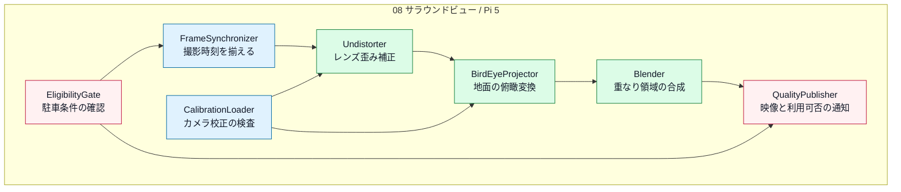
```mermaid
flowchart TB
 subgraph SW08["08 サラウンドビュー / Pi 5"]
  E["EligibilityGate<br/>駐車条件の確認"]
  F["FrameSynchronizer<br/>撮影時刻を揃える"]
  C["CalibrationLoader<br/>カメラ校正の検査"]
  U["Undistorter<br/>レンズ歪み補正"]
  B["BirdEyeProjector<br/>地面の俯瞰変換"]
  L["Blender<br/>重なり領域の合成"]
  Q["QualityPublisher<br/>映像と利用可否の通知"]
  E --> F
  F --> U
  C --> U
  C --> B
  U --> B
  B --> L
  L --> Q
  E --> Q
 end
 classDef source fill:#e0f2fe,stroke:#0369a1,color:#111827
 classDef image fill:#dcfce7,stroke:#15803d,color:#111827
 classDef guard fill:#fff1f2,stroke:#be123c,color:#111827
 class F,C source
 class U,B,L image
 class E,Q guard
```

| 接続 | 受け渡す情報 |
| --- | --- |
| EligibilityGate → FrameSynchronizer / QualityPublisher | 表示許可・許可世代・失効期限。画像が出来ても許可がなければ出さない |
| FrameSynchronizer → Undistorter | 同時刻に近い4方向のフレーム集合と時刻誤差 |
| CalibrationLoader → 補正・射影 | 同じ校正データのバージョンの行列、歪み係数、地面座標への変換 |
| Blender → QualityPublisher | 合成画像・有効領域マスク・入力参照 |

<a id="dd-feature-flows"></a>

### 3.2 機能別処理フローチャート

各機能の開始条件、判断、正常・異常時の結果を示す。関数単位の入力と出力は3.7に記載する。

<a id="dd-feature-1"></a>

#### 3.2.1 駐車条件の判定（SV-F01）

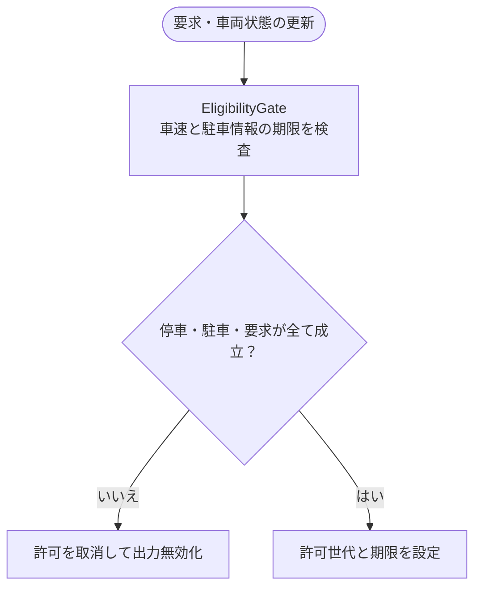
```mermaid
flowchart TB
 A(["要求・車両状態の更新"]) --> B["EligibilityGate<br/>車速と駐車情報の期限を検査"]
 B --> C{"停車・駐車・要求が全て成立？"}
 C -->|"いいえ"| D["許可を取消して出力無効化"]
 C -->|"はい"| E["許可世代と期限を設定"]
```

<a id="dd-feature-2"></a>

#### 3.2.2 校正データの確認（SV-F02）

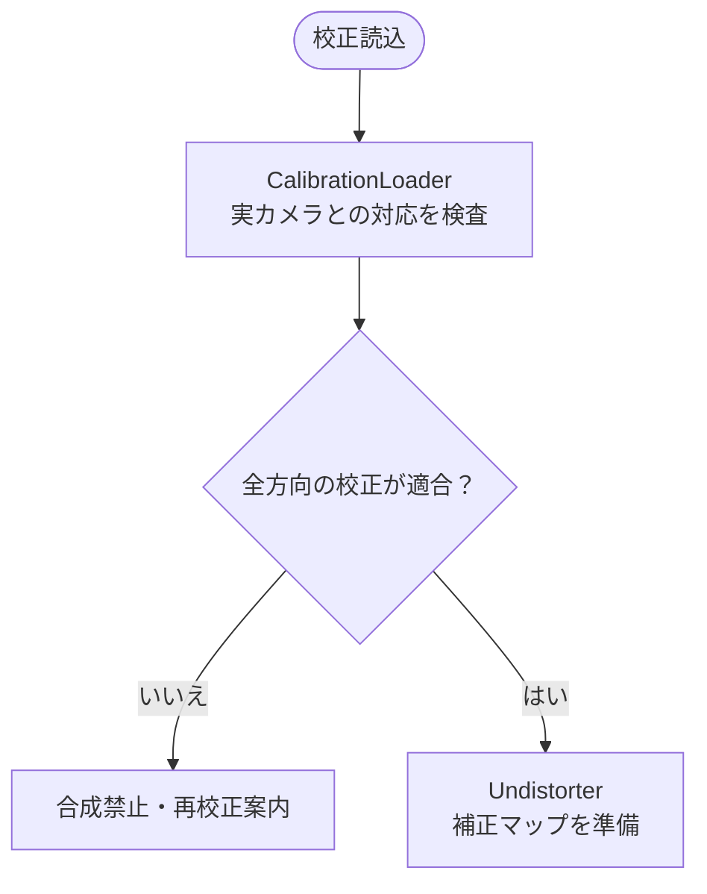
```mermaid
flowchart TB
 A(["校正読込"]) --> B["CalibrationLoader<br/>実カメラとの対応を検査"]
 B --> C{"全方向の校正が適合？"}
 C -->|"いいえ"| D["合成禁止・再校正案内"]
 C -->|"はい"| E["Undistorter<br/>補正マップを準備"]
```

<a id="dd-feature-3"></a>

#### 3.2.3 4方向の時刻合わせ（SV-F03）

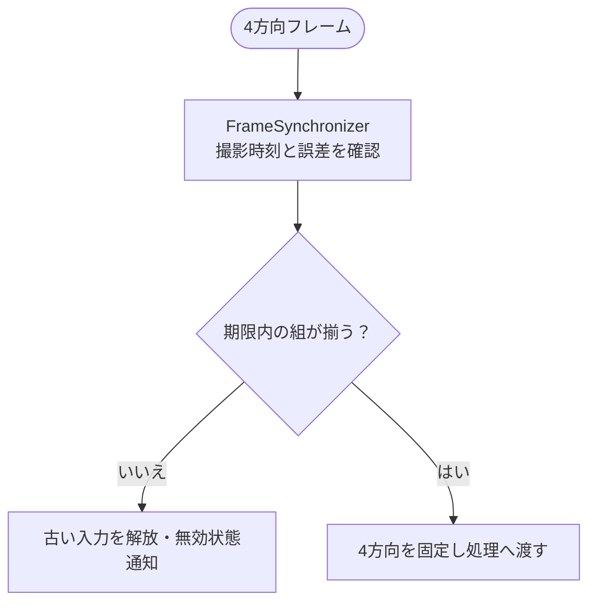
```mermaid
flowchart TB
 A(["4方向フレーム"]) --> B["FrameSynchronizer<br/>撮影時刻と誤差を確認"]
 B --> C{"期限内の組が揃う？"}
 C -->|"いいえ"| D["古い入力を解放・無効状態通知"]
 C -->|"はい"| E["4方向を固定し処理へ渡す"]
```

<a id="dd-feature-4"></a>

#### 3.2.4 歪み補正と俯瞰合成（SV-F04）

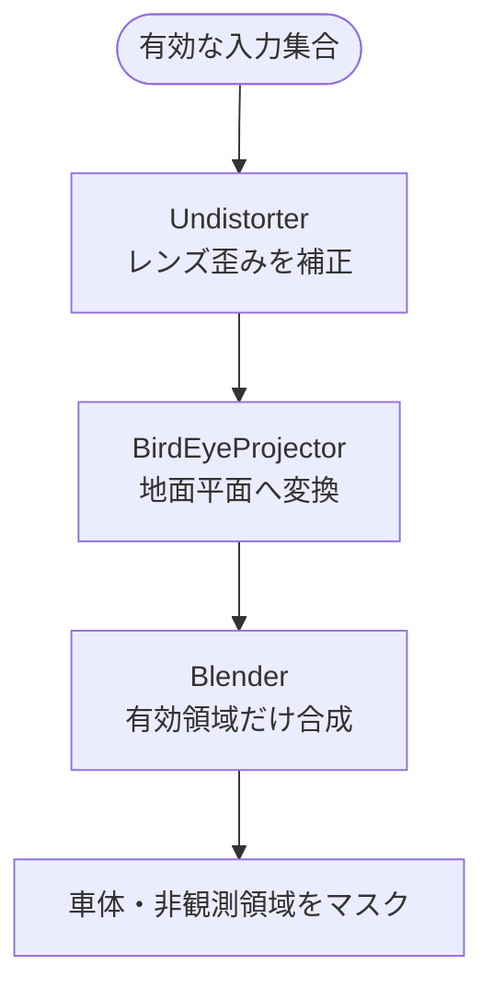
```mermaid
flowchart TB
 A(["有効な入力集合"]) --> B["Undistorter<br/>レンズ歪みを補正"]
 B --> C["BirdEyeProjector<br/>地面平面へ変換"]
 C --> D["Blender<br/>有効領域だけ合成"]
 D --> E["車体・非観測領域をマスク"]
```

<a id="dd-feature-5"></a>

#### 3.2.5 表示配信と条件喪失時の停止（SV-F05）

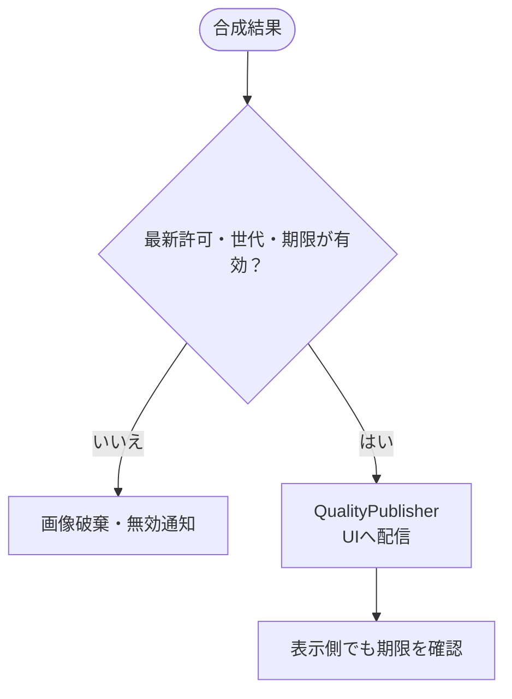
```mermaid
flowchart TB
 A(["合成結果"]) --> B{"最新許可・世代・期限が有効？"}
 B -->|"いいえ"| C["画像破棄・無効通知"]
 B -->|"はい"| D["QualityPublisher<br/>UIへ配信"]
 D --> E["表示側でも期限を確認"]
```

<a id="dd-module-tree"></a>

### 3.3 モジュールツリー

```text
surround_view_service
+-- EligibilityGate
|   +-- evaluate_eligibility
+-- FrameSynchronizer
|   +-- select_frame_set
+-- CalibrationLoader
|   +-- load_calibration
+-- Undistorter
|   +-- build_remap / undistort_frame
+-- BirdEyeProjector
|   +-- project_ground
+-- Blender
|   +-- blend_views
+-- QualityPublisher
    +-- publish_result / invalidate_output / stop_surround
```

<a id="dd-sequence"></a>

### 3.4 モジュール間の処理順序

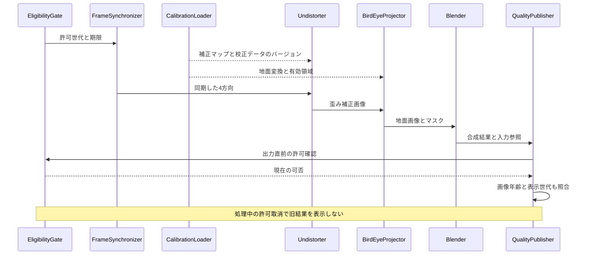
```mermaid
sequenceDiagram
 participant E as EligibilityGate
 participant F as FrameSynchronizer
 participant C as CalibrationLoader
 participant U as Undistorter
 participant B as BirdEyeProjector
 participant L as Blender
 participant Q as QualityPublisher
 E->>F: 許可世代と期限
 C-->>U: 補正マップと校正データのバージョン
 C-->>B: 地面変換と有効領域
 F->>U: 同期した4方向
 U->>B: 歪み補正画像
 B->>L: 地面画像とマスク
 L->>Q: 合成結果と入力参照
 Q->>E: 出力直前の許可確認
 E-->>Q: 現在の可否
 Q->>Q: 画像年齢と表示世代も照合
 Note over E,Q: 処理中の許可取消で旧結果を表示しない
```

条件を失った通知は画像の完成待ちをせず送る。UIも表示許可とフレーム期限を独立監視し、通信断で最後の画像が残り続けないようにする。

<a id="dd-modules"></a>

### 3.5 モジュール詳細

校正セット、入力集合、許可世代、UI表示世代を処理結果まで引き継ぐ。1枚の出力で複数の校正データのバージョンを混在させない。

<a id="dd-module-1"></a>

#### 3.5.1 EligibilityGate（利用条件の確認）

| 項目 | 内容 |
| --- | --- |
| 入力 | 車速・駐車判定・UI要求・時刻 |
| 出力 | allow、reason、eligibility_epoch、expires_at |
| 保持情報 | 入力別の最新値と起動ID・連番、許可世代 |
| 処理 | 全条件のANDで許可。連続停車確認とヒステリシスは実機確定。条件喪失を遅延させない |
| 関数 | evaluate_eligibility |
| 異常時 | 不明・期限切れ・走行を拒否。GPS推定速度を無断で代替しない |

<a id="dd-module-2"></a>

#### 3.5.2 FrameSynchronizer（4方向の時刻合わせ）

| 項目 | 内容 |
| --- | --- |
| 入力 | 期限付きFrameRef、時刻対応誤差 |
| 出力 | FrameSetまたは揃わない理由 |
| 保持情報 | 方向別の有限キュー、最新ストリームID、共通時刻 |
| 処理 | 誤差込みの最大時刻差を満たす最新組を選択。余った参照を必ず解放 |
| 関数 | select_frame_set |
| 異常時 | 時刻不明・欠落で正常な4方向を作らない。再接続時は旧組を破棄 |

<a id="dd-module-3"></a>

#### 3.5.3 CalibrationLoader（校正の読込・検査）

| 項目 | 内容 |
| --- | --- |
| 入力 | 校正ファイルと現在カメラ情報 |
| 出力 | 不変CalibrationSet |
| 保持情報 | 校正データのバージョン、ハッシュ、camera_id、解像度、レンズモデル |
| 処理 | 4方向の整合、行列の次元・有限値・座標系・取付を検査し、一組で適用 |
| 関数 | load_calibration |
| 異常時 | 部分成功で合成しない。変更時は処理世代を進める |

<a id="dd-module-4"></a>

#### 3.5.4 Undistorter（レンズ歪み補正）

| 項目 | 内容 |
| --- | --- |
| 入力 | 画像、モデル別マップ |
| 出力 | 補正画像と画素有効マスク |
| 保持情報 | 校正と画像寸法ごとの再利用マップ |
| 処理 | 魚眼・通常モデルを区別し、採用モデルに合うOpenCV関数でremap |
| 関数 | build_remap、undistort_frame |
| 異常時 | モデル不一致・領域外を無効化。黒画素を路面情報として扱わない |

<a id="dd-module-5"></a>

#### 3.5.5 BirdEyeProjector（地面座標への変換）

| 項目 | 内容 |
| --- | --- |
| 入力 | 補正画像、地面変換、出力座標設定 |
| 出力 | 方向別地面画像と有効範囲 |
| 保持情報 | 校正済み変換行列、m/pixel、原点 |
| 処理 | 補正後の画像座標から同じ地面平面へ変換。変換を二重適用しない |
| 関数 | project_ground |
| 異常時 | 地平線近傍・射影不能・非観測領域を除外 |

<a id="dd-module-6"></a>

#### 3.5.6 Blender（重なり領域の合成）

| 項目 | 内容 |
| --- | --- |
| 入力 | 方向別地面画像とマスク |
| 出力 | 合成画像、観測マスク、品質指標 |
| 保持情報 | 固定重みマップと車体マスク |
| 処理 | 有効な重みだけ正規化。未観測画素を過去映像や生成画像で補完しない |
| 関数 | blend_views |
| 異常時 | 入力不足は縮退・無効状態。通常4方向合成として返さない |

<a id="dd-module-7"></a>

#### 3.5.7 QualityPublisher（映像・利用可否の通知）

| 項目 | 内容 |
| --- | --- |
| 入力 | 合成結果、許可状態、UI購読 |
| 出力 | SurroundFrameRefとsurround.status |
| 保持情報 | 出力連番、購読ID、display_generation、有界バッファ |
| 処理 | 最も古い入力の期限と許可期限を出力へ引継ぐ。制御取消と映像を同一世代で扱う |
| 関数 | publish_result、invalidate_output、stop_surround |
| 異常時 | 遅延・通信断で最終画面を正常に固定しない。未解放領域を再利用しない |

<a id="dd-files"></a>

### 3.6 ファイル構成

```text
src/raspberry_pi5/
+-- surround_view_service.py
+-- surround/
|   +-- eligibility.py / synchronizer.py
|   +-- calibration.py / undistorter.py
|   +-- projector.py / blender.py
|   +-- publisher.py / models.py / config.py
+-- config/surround.example.toml
+-- calibration/surround/            承認した校正セット
tests/surround/
+-- test_eligibility.py / test_sync.py
+-- test_calibration.py / test_masks.py
+-- test_output_expiry.py
```

作成予定の配置。実データ、秘密鍵、認証情報はソースや公開Gitへ含めない。

<a id="dd-function-flows"></a>

### 3.7 関数のフローチャート

画像処理関数は入力参照とバージョンを保持して結果を返す。終了・例外経路でも取得済みフレームを解放する。

<a id="dd-fn-evaluate-eligibility"></a>

#### 3.7.1 evaluate_eligibility（停車・駐車条件を確認する）

| 項目 | 内容 |
| --- | --- |
| 担当 | EligibilityGate |
| 入力 | 入力状態と利用要求 |
| 戻り値・結果 | 許可または拒否理由 |

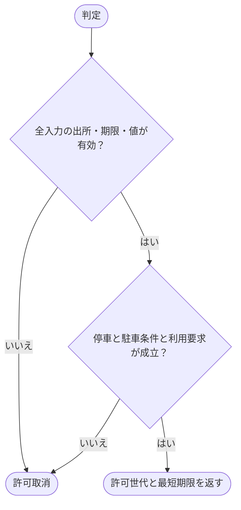
```mermaid
flowchart TB
 A(["判定"]) --> B{"全入力の出所・期限・値が有効？"}
 B -->|"いいえ"| X(["許可取消"])
 B -->|"はい"| C{"停車と駐車条件と利用要求が成立？"}
 C -->|"いいえ"| X
 C -->|"はい"| D(["許可世代と最短期限を返す"])
```

<a id="dd-fn-load-calibration"></a>

#### 3.7.2 load_calibration（校正セットを検査する）

| 項目 | 内容 |
| --- | --- |
| 担当 | CalibrationLoader |
| 入力 | 4方向の校正と実カメラ情報 |
| 戻り値・結果 | CalibrationSetまたは不適合 |

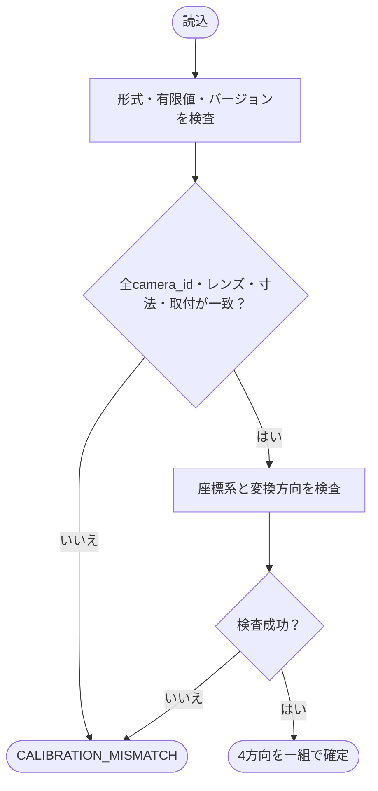
```mermaid
flowchart TB
 A(["読込"]) --> B["形式・有限値・バージョンを検査"]
 B --> C{"全camera_id・レンズ・寸法・取付が一致？"}
 C -->|"いいえ"| X(["CALIBRATION_MISMATCH"])
 C -->|"はい"| D["座標系と変換方向を検査"]
 D --> E{"検査成功？"}
 E -->|"いいえ"| X
 E -->|"はい"| F(["4方向を一組で確定"])
```

<a id="dd-fn-build-remap"></a>

#### 3.7.3 build_remap（歪み補正マップを準備する）

| 項目 | 内容 |
| --- | --- |
| 担当 | Undistorter |
| 入力 | 校正モデル・画像寸法 |
| 戻り値・結果 | マップと画素有効範囲 |

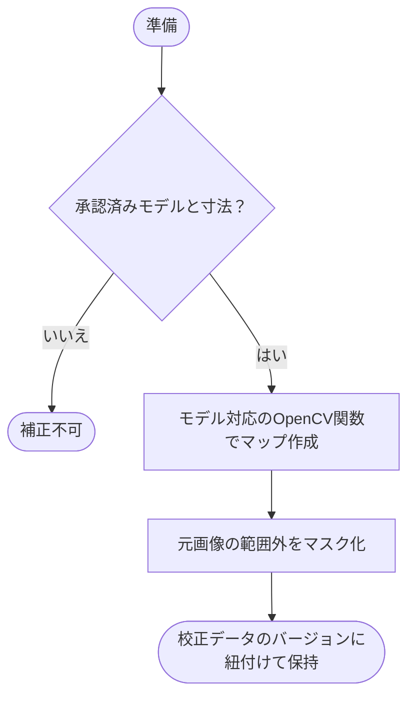
```mermaid
flowchart TB
 A(["準備"]) --> B{"承認済みモデルと寸法？"}
 B -->|"いいえ"| X(["補正不可"])
 B -->|"はい"| C["モデル対応のOpenCV関数でマップ作成"]
 C --> D["元画像の範囲外をマスク化"]
 D --> E(["校正データのバージョンに紐付けて保持"])
```

<a id="dd-fn-select-frame-set"></a>

#### 3.7.4 select_frame_set（同時刻に近い4方向を選ぶ）

| 項目 | 内容 |
| --- | --- |
| 担当 | FrameSynchronizer |
| 入力 | 方向別キューと時刻誤差 |
| 戻り値・結果 | FrameSetまたは待機 |

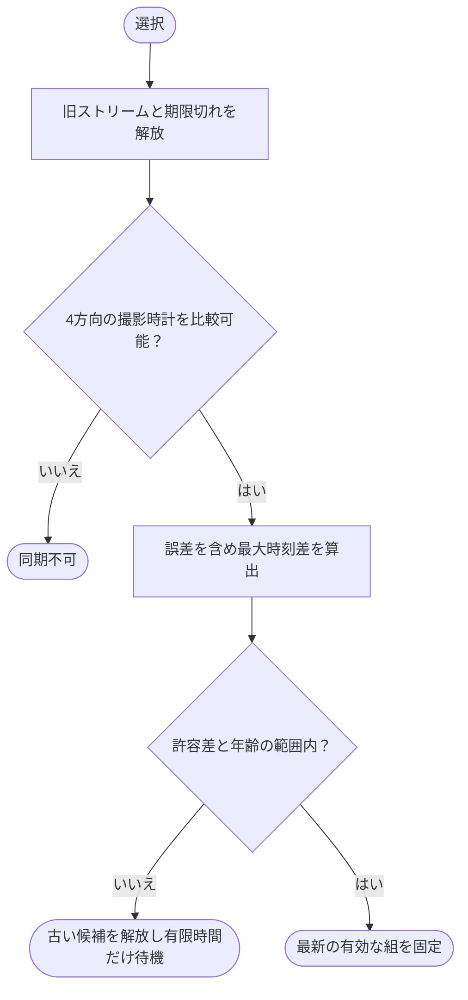
```mermaid
flowchart TB
 A(["選択"]) --> B["旧ストリームと期限切れを解放"]
 B --> C{"4方向の撮影時計を比較可能？"}
 C -->|"いいえ"| X(["同期不可"])
 C -->|"はい"| D["誤差を含め最大時刻差を算出"]
 D --> E{"許容差と年齢の範囲内？"}
 E -->|"いいえ"| F(["古い候補を解放し有限時間だけ待機"])
 E -->|"はい"| G(["最新の有効な組を固定"])
```

<a id="dd-fn-undistort-frame"></a>

#### 3.7.5 undistort_frame（画像の歪みを補正する）

| 項目 | 内容 |
| --- | --- |
| 担当 | Undistorter |
| 入力 | フレームとマップ |
| 戻り値・結果 | 補正画像・マスク |

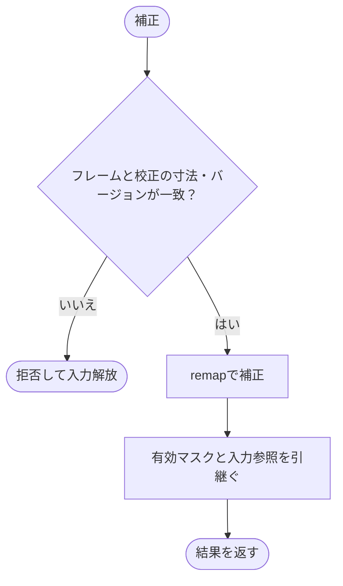
```mermaid
flowchart TB
 A(["補正"]) --> B{"フレームと校正の寸法・バージョンが一致？"}
 B -->|"いいえ"| X(["拒否して入力解放"])
 B -->|"はい"| C["remapで補正"]
 C --> D["有効マスクと入力参照を引継ぐ"]
 D --> E(["結果を返す"])
```

<a id="dd-fn-project-ground"></a>

#### 3.7.6 project_ground（地面の俯瞰画像へ変換する）

| 項目 | 内容 |
| --- | --- |
| 担当 | BirdEyeProjector |
| 入力 | 補正画像と変換行列 |
| 戻り値・結果 | 地面画像と観測マスク |

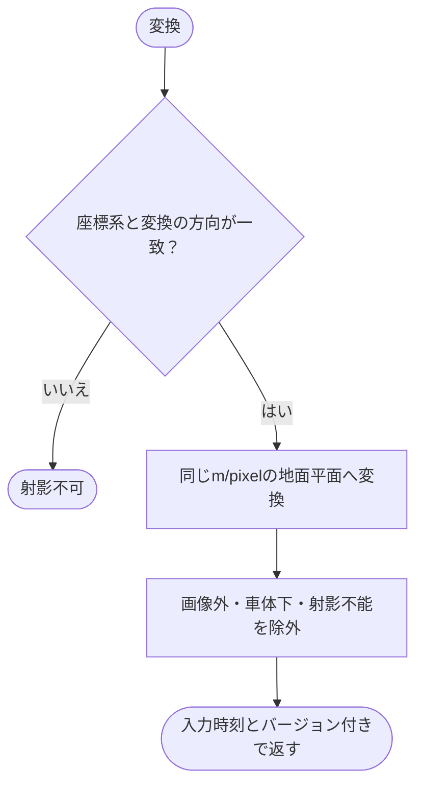
```mermaid
flowchart TB
 A(["変換"]) --> B{"座標系と変換の方向が一致？"}
 B -->|"いいえ"| X(["射影不可"])
 B -->|"はい"| C["同じm/pixelの地面平面へ変換"]
 C --> D["画像外・車体下・射影不能を除外"]
 D --> E(["入力時刻とバージョン付きで返す"])
```

<a id="dd-fn-blend-views"></a>

#### 3.7.7 blend_views（4方向の重なりを合成する）

| 項目 | 内容 |
| --- | --- |
| 担当 | Blender |
| 入力 | 地面画像・重み・マスク |
| 戻り値・結果 | 合成画像と品質 |

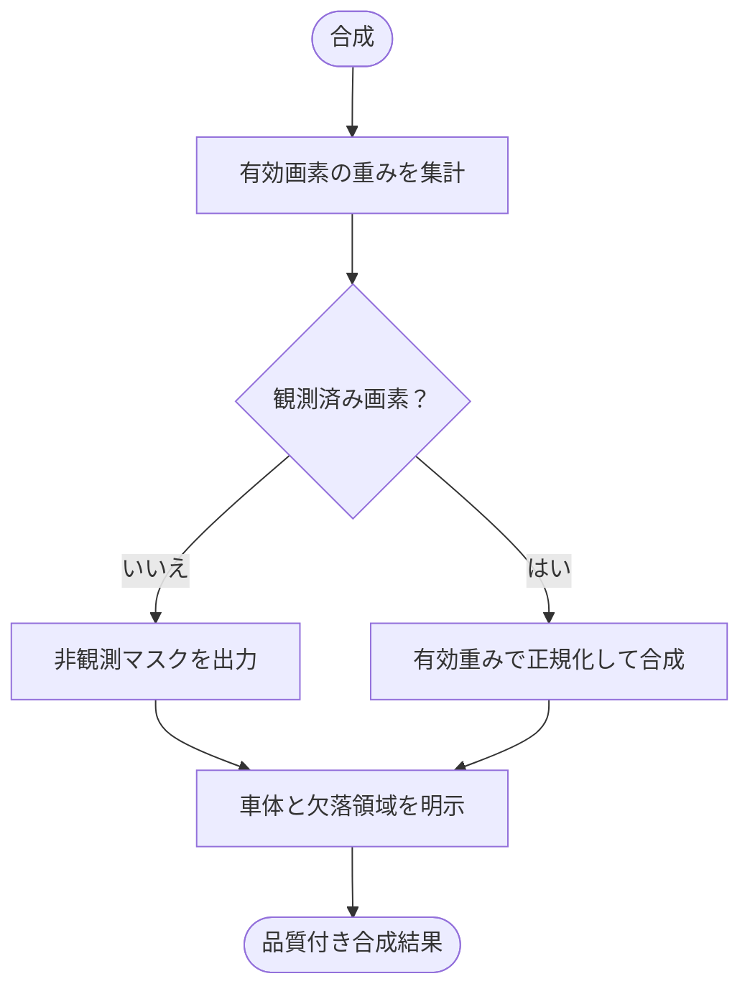
```mermaid
flowchart TB
 A(["合成"]) --> B["有効画素の重みを集計"]
 B --> C{"観測済み画素？"}
 C -->|"いいえ"| D["非観測マスクを出力"]
 C -->|"はい"| E["有効重みで正規化して合成"]
 D --> F["車体と欠落領域を明示"]
 E --> F
 F --> G(["品質付き合成結果"])
```

<a id="dd-fn-publish-result"></a>

#### 3.7.8 publish_result（期限内の合成結果を通知する）

| 項目 | 内容 |
| --- | --- |
| 担当 | QualityPublisher |
| 入力 | 結果・許可・表示世代 |
| 戻り値・結果 | 出力または破棄 |

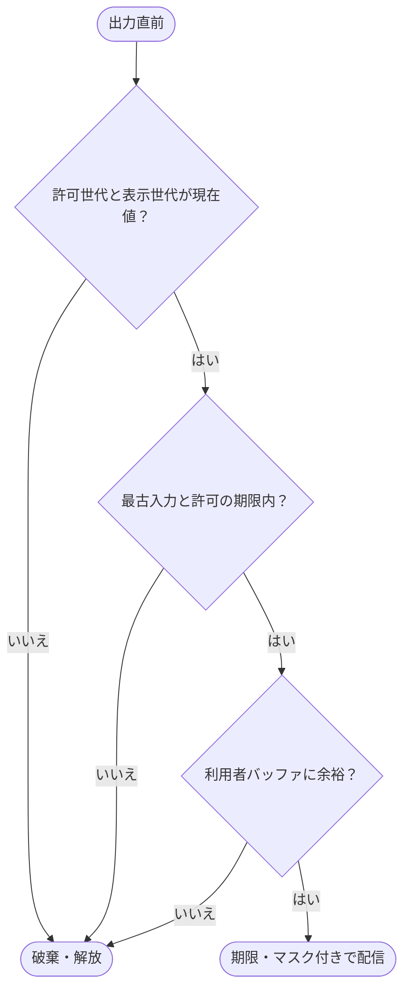
```mermaid
flowchart TB
 A(["出力直前"]) --> B{"許可世代と表示世代が現在値？"}
 B -->|"いいえ"| X(["破棄・解放"])
 B -->|"はい"| C{"最古入力と許可の期限内？"}
 C -->|"いいえ"| X
 C -->|"はい"| D{"利用者バッファに余裕？"}
 D -->|"いいえ"| X
 D -->|"はい"| E(["期限・マスク付きで配信"])
```

<a id="dd-fn-invalidate-output"></a>

#### 3.7.9 invalidate_output（表示許可を取り消す）

| 項目 | 内容 |
| --- | --- |
| 担当 | QualityPublisher |
| 入力 | 失効理由と現世代 |
| 戻り値・結果 | 無効状態通知 |

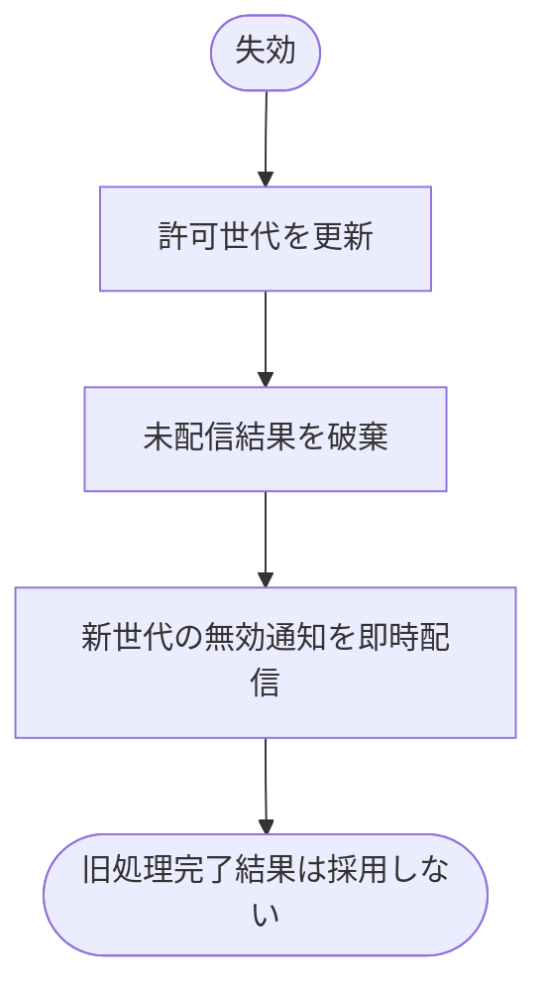
```mermaid
flowchart TB
 A(["失効"]) --> B["許可世代を更新"]
 B --> C["未配信結果を破棄"]
 C --> D["新世代の無効通知を即時配信"]
 D --> E(["旧処理完了結果は採用しない"])
```

<a id="dd-fn-stop-surround"></a>

#### 3.7.10 stop_surround（合成と映像利用を終了する）

| 項目 | 内容 |
| --- | --- |
| 担当 | QualityPublisher |
| 入力 | 終了要求と期限 |
| 戻り値・結果 | 解放結果 |

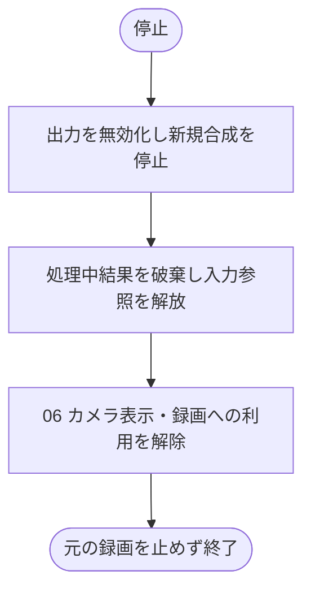
```mermaid
flowchart TB
 A(["停止"]) --> B["出力を無効化し新規合成を停止"]
 B --> C["処理中結果を破棄し入力参照を解放"]
 C --> D["06 カメラ表示・録画への利用を解除"]
 D --> E(["元の録画を止めず終了"])
```

<a id="dd-4"></a>

## 4. インターフェース設計


<a id="dd-interface-diagrams"></a>

### 4.1 利用ソフトとモジュールの接続

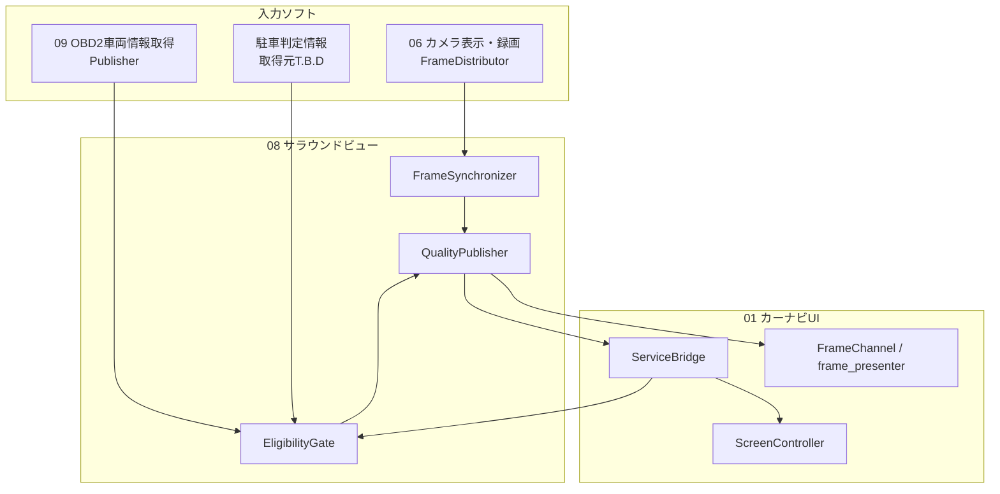
```mermaid
flowchart TB
 subgraph IN["入力ソフト"]
  C["06 カメラ表示・録画<br/>FrameDistributor"]
  V["09 OBD2車両情報取得<br/>Publisher"]
  P["駐車判定情報<br/>取得元T.B.D"]
 end
 subgraph SW08["08 サラウンドビュー"]
  F["FrameSynchronizer"]
  E["EligibilityGate"]
  Q["QualityPublisher"]
  F --> Q
  E --> Q
 end
 subgraph UI["01 カーナビUI"]
  S["ServiceBridge"]
  T["ScreenController"]
  R["FrameChannel / frame_presenter"]
  S --> T
 end
 C --> F
 V --> E
 P --> E
 S --> E
 Q --> S
 Q --> R
```
画像処理の途中モジュールは3.1に示す。UIの表示判断はScreenControllerが行い、画像はFrameChannelへ渡す。バックカメラ単独表示は別機能であり、俯瞰映像が不許可でも06 カメラ表示・録画の後方映像経路を壊さない。

参照：[06 カメラ表示・録画](06_カメラ表示録画.md#dd-frame-contract)、[09 OBD2車両情報取得](09_OBD2車両情報.md#dd-4)、[01 カーナビUI](01_カーナビUI.md#dd-4)。

<a id="dd-contract"></a>

### 4.2 入力・出力契約

| 契約 | 内容 |
| --- | --- |
| FrameRef | camera_id、stream_session_id、sequence、撮影時刻・時計品質、画像形式、参照と世代、年齢・有効期間 |
| VehicleSpeed | m/s、support_state、validity、測定年齢、起動ID・連番。未知を0としない |
| ParkingEvidence | 取得元、状態、validity、期限。リバースONのみを駐車済みとしない。初期は未定義なので許可不可 |
| 表示要求 | command_id、owner_boot_id、期限、display_generation、選択モード |
| SurroundFrameRef | 元4方向の参照、校正データのバージョン、許可世代、表示世代、画像参照、有効マスク、最短期限 |
| surround.status | allow、reason、mode、camera_quality、sync_skew、calibration_version、output_age、負荷状態 |
| 映像解放 | 利用者ID・バッファID・世代を照合。貸出中領域は時間切れだけで再利用しない |
フレーム本体をUIのAppStateに格納しない。画面切替後の古い結果はdisplay_generationで除外する。無効通知を落としても、UIは自身の経過時間で期限を確認する。

<a id="dd-image-api"></a>

### 4.3 校正・画像処理ライブラリ

魚眼モデルの校正とマップ生成にはOpenCVのfisheye系、通常モデルには対応する通常系を用いる。レンズを魚眼と仮定して同じ係数を使い回さない。[OpenCV魚眼モデル](https://docs.opencv.org/4.13.0/db/d58/group__calib3d__fisheye.html)

remapとwarpPerspective等の既存変換を用い、出力座標から入力画像への対応・補間・境界処理を明確にする。使用する行列が補正前画像用か補正後画像用かを校正データに記録する。[OpenCV幾何変換](https://docs.opencv.org/4.x/da/d54/group__imgproc__transform.html)

自動パノラマ合成だけで車体周辺の地面座標が決まるとは考えない。既知の地面基準点と固定したカメラ取付を用いて校正し、実装では採用するOpenCVのバージョンを固定する。

<a id="dd-5"></a>

## 5. データ・設定設計


<a id="dd-calibration"></a>

### 5.1 校正セットと座標系

| 項目 | 内容 |
| --- | --- |
| calibration_version / checksum | 4方向を一組で管理するバージョンと内容識別 |
| camera_id / device_identity / lens_model | 実カメラ・レンズとの対応。front/rear/left/right |
| width / height / crop / orientation | 解像度・切出し・画像回転・左右反転の設定 |
| K / distortion / rectified_K | 内部行列、モデル固有の歪み係数、補正後の内部行列 |
| ground_transform / transform_direction | 補正画像と地面座標の対応・変換方向 |
| valid_mask / vehicle_mask | 観測可能範囲と車体占有領域。車体下を現在映像で埋めない |
| mounting_profile / calibration_conditions | 取付位置・向き・車高・校正時の条件 |
| acceptance_record | 基準点誤差・境界ずれ・対象範囲と試験結果 |
座標は車体中心等の固定基準を原点とし、車体前方+x、左+y、上+zを採用する設計案。俯瞰画像は前方を上、左を左とし、pixel/mの対応を明記する。原点の実位置、車体寸法、表示範囲は測定して確定する。見た目が合うだけで変換方向を判断しない。

<a id="dd-freshness"></a>

### 5.2 同期判定と画像寿命

```text
frame_interval_i = [capture_time_i - uncertainty_i,
                    capture_time_i + uncertainty_i]

worst_case_skew =
    max(capture_time_i + uncertainty_i)
  - min(capture_time_i - uncertainty_i)

output_deadline =
    min(each_input_deadline, eligibility_deadline)
```
同じPi 5上の比較可能な時間軸へ対応できた時刻だけを用いる。前後サブコンの単調時計を左右CSIの時計と直接比較しない。時計誤差不明なら同期不可とする。

操作要求の期限は受付時に検査する。受理済みの映像利用はsubscription_idと利用者接続で管理し、操作要求の期限をそのまま全フレームの表示終了時刻にはしない。利用解除・UI切断・表示世代変更で配信を停止する。利用継続の期限を別途設ける場合は、独立した更新手順を定め、その期限もoutput_deadlineへ含める。

時刻差が許容値以内でも、4枚とも古ければ無効。処理終了時にも入力年齢と出力期限を再確認する。期限を合成完了時刻から付け直さず、途中で待った時間も画像寿命に含める。有限キューを超える候補は解放し、同じ過去画像を新しい連番で再配信しない。

<a id="dd-config"></a>

### 5.3 モード・設定と初期値

| 設定 | 方針 |
| --- | --- |
| enabled | 初期false。駐車判定入力の確定・実機合格後に許可 |
| mode | QUAD / UNDISTORTED / BIRD_EYEを段階別に承認。4分割も駐車条件を確認 |
| parking_source / vehicle_speed_source | 入力の出所と期限。未設定・未知は表示禁止 |
| stationary_threshold / confirm_duration | T.B.D。OBD2車速の分解能を含めて確認し、停止値だけで絶対停止を保証しない |
| sync_skew_max / frame_age_max / clock_error_max | T.B.D。最悪誤差と処理時間を含む上限 |
| output_size / meters_per_pixel / target_fps | T.B.D。Pi 5の録画・ナビ同時負荷で確定 |
| queue_limits / max_processing_time | 有限件数・時間。超過で古い画像を出さない |
| calibration_path / mask_path | 承認済み校正を指定。UIから任意ファイルを読み込まない |

<a id="dd-6"></a>

## 6. 処理・状態遷移


<a id="dd-states"></a>

### 6.1 利用状態

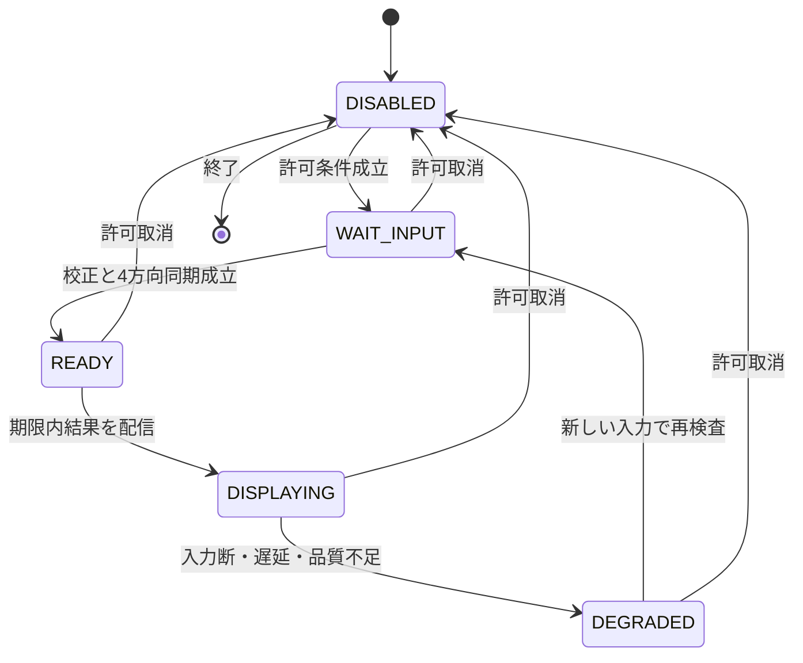
```mermaid
stateDiagram-v2
 [*] --> DISABLED
 DISABLED --> WAIT_INPUT: 許可条件成立
 WAIT_INPUT --> READY: 校正と4方向同期成立
 READY --> DISPLAYING: 期限内結果を配信
 DISPLAYING --> DEGRADED: 入力断・遅延・品質不足
 DEGRADED --> WAIT_INPUT: 新しい入力で再検査
 READY --> DISABLED: 許可取消
 WAIT_INPUT --> DISABLED: 許可取消
 DISPLAYING --> DISABLED: 許可取消
 DEGRADED --> DISABLED: 許可取消
 DISABLED --> [*]: 終了
```
DEGRADEDでは通常の4方向俯瞰を提供しない。欠落方向の表示を残す場合は診断用マスク付き出力として別扱いにし、初期運用では俯瞰を非表示にする。

<a id="dd-runtime"></a>

### 6.2 校正変更・負荷増大時の処理

校正・解像度・取付設定の変更では許可を取り消し、処理中結果を破棄して新しい校正セットを一括適用する。古い校正バージョンのフレームと新しい校正バージョンの変換を混ぜない。

負荷が高い場合は承認済みの低負荷プロファイルへ切り替えるか合成を休止する。06 カメラ表示・録画の録画設定を直接変更しない。出力解像度だけを変更する場合も、地面スケールと出力マスクを一緒に更新する。

路面平面の仮定から外れる坂、縁石、人、車等は伸びや二重像が生じ得る。継ぎ目を滑らかにしたことを距離精度の改善と扱わない。

<a id="dd-7"></a>

## 7. 異常処理

| 異常 | 動作 |
| --- | --- |
| 車速・駐車情報不明 | 許可取消と無効通知。停止と推測しない |
| 時計対応不明・遅延超過 | 同期組を作らず、旧フレームを解放 |
| 校正・取付・解像度不一致 | 合成禁止。自動スケール補正でごまかさない |
| カメラ1台断 | 通常の4方向表示を停止。欠落領域を明示 |
| 画像処理例外・メモリ不足 | 保有フレームを解放し、負荷を下げて有限再試行 |
| UI解放応答なし | 当該配信を停止。領域を安全確認前に再利用しない |
| 録画負荷・高温 | 合成休止を優先し、状態をUIへ通知 |

<a id="dd-8"></a>

## 8. 起動・終了・運用設計

起動時は設定と校正だけを準備し、駐車条件と利用要求が揃うまで映像利用を開始しない。入力側の06 カメラ表示・録画は独立して動く。

終了時は先に出力を無効化し、未完了結果を破棄し、貸出・取得済みフレームを解放する。UIを閉じた場合は合成用の利用だけを解除する。再開時は最新車両値・最新フレームから始める。

校正は平坦な試験場所で車体を確実に停止し、位置と寸法が分かる基準マーカーを使って行う。運転者の直接確認に代わる装置として運用しない。

<a id="dd-9"></a>

## 9. 試験・受入条件


<a id="dd-tests"></a>

### 9.1 単体・境界条件試験

| 試験 | 受入条件 |
| --- | --- |
| SV-T01 / SV-F01：車速0・未知・期限切れ・駐車入力なし | 未知や0のみで駐車許可しない |
| SV-T02 / SV-F02：寸法・レンズ・camera_id・校正データのバージョン不一致 | 俯瞰合成を拒否 |
| SV-T03 / SV-F03：遅延・時計差・再接続・並べ替え | 最悪時刻差と年齢を満たす組だけ採用 |
| SV-T04 / SV-F04：既知の格子・地面マーカー・画像方向 | 前後左右、縮尺、投影先が既知値と一致 |
| SV-T05 / SV-F04：欠落・画像外・車体下 | 非観測領域を安全な地面として埋めない |
| SV-T06 / SV-F05：合成中に許可取消・UI世代更新 | 古い結果を表示しない |
| SV-T07 / SV-F05：UI滞留・高負荷・終了 | メモリ上限を維持し録画を止めず解放 |

<a id="dd-integration-tests"></a>

### 9.2 停車中の実機受入

4分割、歪み補正、地面合成を段階別に評価する。基準点の位置誤差、継ぎ目誤差、最古入力年齢、処理遅延、出力fps、CPU・メモリ、録画への影響を記録する。高さのある試験物体が歪む条件も確認し、精度を保証できる範囲を限定する。数値目標・実機試験はT.B.Dであり、機能の実装完了とは扱わない。

<a id="dd-10"></a>

## 10. 未確定事項・実装課題

| 課題 | 確定内容 |
| --- | --- |
| 駐車判定 | 信号取得元と確認条件。未確定なら機能無効 |
| カメラ・校正 | 4方向の実機取付、レンズ、地面基準点、誤差目標 |
| 同期 | 前後Ethernetと左右CSIの時計対応・誤差上限 |
| 出力性能 | 録画・ナビと併用可能な画質と遅延 |
| 縮退表示 | 部分表示を許可する範囲とUIの無効表示方法 |

<a id="dd-glossary"></a>

## 用語の注釈

| 用語 | 意味 |
| --- | --- |
| 校正 | カメラの歪み・取付位置と現実の座標の関係を測定する作業 |
| 俯瞰変換 | 地面を上から見た座標へ画像を変換する処理 |
| ホモグラフィ | 一つの平面上の画像座標を別の平面座標へ対応させる変換 |
| 有効領域マスク | 実際に観測できる画素と、見えていない範囲を区別する情報 |
| 許可世代 | 表示許可が変わった前後の処理結果を区別する番号 |
