# OBD2車両情報取得 詳細設計書

| 項目 | 内容 |
| --- | --- |
| 文書ID | SW-DD-09 |
| 実行環境 | Pi 5 |
| 実装状態 | 通信共通基盤を実装済み・L880K実車プロファイルは未確定 |
| 対象ソース | `src/raspberry_pi5/obd2_service.py`、`src/raspberry_pi5/obd2/` |
| 作成日 | 2026-09-14 |
| 更新日 | 2026-09-20 |

[詳細設計一覧](README.md) / [共通仕様](00_共通仕様.md) / [上位設計](../ソフトウェア設計図.md#sec-45)

## 目次

- [1. 目的・適用範囲](#dd-1)
- [2. 要求仕様・役割](#dd-2)
  - [2.1 機能一覧](#dd-functions)
  - [2.2 機能・モジュール・関数の対応](#dd-function-map)
- [3. 内部構成](#dd-3)
  - [3.1 モジュールの全体構成](#dd-overview)
  - [3.2 機能別処理フローチャート](#dd-feature-flows)
    - [3.2.1 USB接続とK-Line通信の開始（OBD-F01）](#dd-feature-1)
    - [3.2.2 取得可能な項目の確認（OBD-F02）](#dd-feature-2)
    - [3.2.3 優先順位付きの定期読取（OBD-F03）](#dd-feature-3)
    - [3.2.4 応答の検査と値の共有（OBD-F04）](#dd-feature-4)
    - [3.2.5 失効と切断からの回復（OBD-F05）](#dd-feature-5)
  - [3.3 モジュールツリー](#dd-module-tree)
  - [3.4 モジュール間の処理順序](#dd-sequence)
  - [3.5 モジュール詳細](#dd-modules)
    - [3.5.1 AdapterConnection（USBケーブル接続と転送）](#dd-module-1)
    - [3.5.2 CapabilityProbe（対応項目の確認）](#dd-module-2)
    - [3.5.3 PollScheduler（読取順序の決定）](#dd-module-3)
    - [3.5.4 ResponseDecoder（応答検査と単位変換）](#dd-module-4)
    - [3.5.5 VehicleStateCache（項目別の値と期限）](#dd-module-5)
    - [3.5.6 Publisher（車両状態の配信）](#dd-module-6)
    - [3.5.7 KLineSession（K-Line通信制御）](#dd-module-7)
  - [3.6 ファイル構成](#dd-files)
  - [3.7 関数のフローチャート](#dd-function-flows)
    - [3.7.1 connect_adapter（対象USB機器へ接続する）](#dd-fn-connect-adapter)
    - [3.7.2 probe_capabilities（取得可能な項目を調べる）](#dd-fn-probe-capabilities)
    - [3.7.3 select_next_query（次の読取を選ぶ）](#dd-fn-select-next-query)
    - [3.7.4 send_query（許可した読取要求を送る）](#dd-fn-send-query)
    - [3.7.5 decode_response（応答を内部単位へ変換する）](#dd-fn-decode-response)
    - [3.7.6 apply_sample（当該項目だけ更新する）](#dd-fn-apply-sample)
    - [3.7.7 expire_values（古い値を使用不可にする）](#dd-fn-expire-values)
    - [3.7.8 publish_state（車両状態を配信する）](#dd-fn-publish-state)
    - [3.7.9 reconnect_adapter（切断後に取り直す）](#dd-fn-reconnect-adapter)
    - [3.7.10 stop_obd（車両通信を終了する）](#dd-fn-stop-obd)
    - [3.7.11 initialize_kline（ECUとの通信を開始する）](#dd-fn-init-kline)
    - [3.7.12 receive_frame（エコーと応答を分離して検査する）](#dd-fn-receive-frame)
- [4. インターフェース設計](#dd-4)
  - [4.1 接続図と利用者](#dd-interface-diagrams)
  - [4.2 取得項目とK-Line要求定義](#dd-commands)
  - [4.3 配信データと利用条件](#dd-data-contract)
  - [4.4 USB転送方式と読取制限](#dd-library)
- [5. データ・設定設計](#dd-5)
  - [5.1 最新値と状態の保持](#dd-data)
  - [5.2 取得時刻と鮮度](#dd-time)
  - [5.3 ポーリングと設定](#dd-config)
- [6. 処理・状態遷移](#dd-6)
  - [6.1 接続と取得状態](#dd-states)
  - [6.2 応答の対応付けと再接続](#dd-reconnect)
- [7. 異常処理](#dd-7)
- [8. 起動・終了・運用設計](#dd-8)
- [9. 試験・受入条件](#dd-9)
  - [9.1 模擬応答による試験](#dd-tests)
  - [9.2 実車適合と計測](#dd-integration-tests)
- [10. 未確定事項・実装課題](#dd-10)
- [用語の注釈](#dd-glossary)

<a id="dd-1"></a>

## 1. 目的・適用範囲

Raspberry Pi 5のUSBポートに接続したUSB–OBD変換ケーブルを通し、車体側はK-LineでL880KコペンのECUから車両情報を取得する。01 カーナビUI、03 現在地補正、08 サラウンドビュー等へ値・取得可否・出所・鮮度を通知する。

通信経路は「Pi 5 → USBシリアル → K-Line対応USB–OBD変換ケーブル → 車体OBDコネクタ → K-Line → ECU」とする。USB側の転送方式と車体側の診断プロトコルを分け、CAN通信を使用する設計にはしない。GPIOへ車体通信線を直接接続しない。

K-Lineは車体側の通信線・電気方式を示し、それだけで要求データや換算式は決まらない。L880K用の初期化・フレーム形式・データ識別子を確認済みプロファイルとして持つ。汎用の標準OBD-II PIDやpython-OBDで取得できる前提は採用しない。

車両制御、ECU書換え、故障コード消去は対象外。診断通信の開始・維持と確認済みデータ読取に必要な送信だけを許可する。バックギア・ウィンカーは担当サブコンの信号を利用し、未取得の車速をGPS速度で埋めてECU車速として配信しない。共通基盤のソースは初期実装済み、実車適合試験は未実施。

<a id="dd-2"></a>

## 2. 要求仕様・役割

機能は実現する動作、モジュールは処理の分担、関数はモジュール内の処理単位を表す。本書のソース構成は初期実装へ反映済みであり、採用ライブラリの標準APIと区別する。L880K固有の通信プロファイルが未確定のため、初期実装は未確認の車体コマンドを送信しない。

<a id="dd-functions"></a>

### 2.1 機能一覧

| 機能ID | 機能 | 実現する動作 |
| --- | --- | --- |
| OBD-F01 | USB接続とK-Line通信の開始 | **開始条件・入力：** 承認済みUSB識別情報、シリアル設定、L880K用K-Lineプロファイルを読み込む。<br/>**確認・処理：** 同じアダプタの排他的利用と対象の一致を確認する。自動探索で関係のないUSBシリアル機器へ診断要求を送らない。<br/>**処理結果：** 接続世代を新しく作り、確認済み初期化を実行してECU応答を検証する。USB接続成功だけでK-Line通信成功にはしない。 |
| OBD-F02 | 取得可能な項目の確認 | **開始条件・入力：** アダプタと実車の応答、確認済みプロトコル情報を受け取る。<br/>**確認・処理：** 許可済みの対応確認要求を有限回送り、SUPPORTED・UNSUPPORTED・UNKNOWNを区別する。一度の無応答を未対応確定にしない。<br/>**処理結果：** 通常取得する項目集合を作り、対応確認結果を通知する。 |
| OBD-F03 | 優先順位付きの定期読取 | **開始条件・入力：** 対応項目、周期、前回取得時刻、車両通信負荷を使う。<br/>**確認・処理：** 車速を優先しつつ、他項目を無期限に待たせない。要求は1件ずつ送り、遅れた周期分をまとめて連続送信しない。<br/>**処理結果：** 次の要求を選び、タイムアウトや負荷増大では取得頻度を下げて通知する。 |
| OBD-F04 | 応答の検査と値の共有 | **開始条件・入力：** 要求に対応した応答、ECU識別、送受信時刻を受け取る。<br/>**確認・処理：** エコー分離、フレーム長・チェックサム・要求との対応を検査し、プロファイルのデータ位置・換算式で内部単位へ変換する。失敗値を0にせず、成功した項目だけ測定参照を更新する。<br/>**処理結果：** 項目別の車両値をUIと利用ソフトへ配信する。 |
| OBD-F05 | 失効と切断からの回復 | **開始条件・入力：** 項目期限切れ、USB抜去、ECU無応答、停止要求を受け取る。<br/>**確認・処理：** 切断では全項目を使用不可にし、個別無応答ではその項目の期限を独立監視する。旧接続の応答を新しい接続へ適用しない。<br/>**処理結果：** 失効理由を通知し、再接続後は対応確認と新規取得から始める。 |

<a id="dd-function-map"></a>

### 2.2 機能・モジュール・関数の対応

| 機能ID | 担当モジュール | 主な関数 |
| --- | --- | --- |
| OBD-F01 | AdapterConnection / KLineSession | connect_adapter、initialize_kline |
| OBD-F02 | CapabilityProbe | probe_capabilities |
| OBD-F03 | PollScheduler / KLineSession / AdapterConnection | select_next_query、send_query、write_bytes |
| OBD-F04 | KLineSession / ResponseDecoder / VehicleStateCache / Publisher | receive_frame、decode_response、apply_sample、publish_state |
| OBD-F05 | VehicleStateCache / KLineSession / AdapterConnection | expire_values、initialize_kline、reconnect_adapter、stop_obd |

<a id="dd-3"></a>

## 3. 内部構成

7モジュールを設ける。USB機器の操作はAdapterConnection、K-Lineの初期化・フレーム送受信はKLineSessionが担当する。ケーブルは本ソフトだけが開き、同時に未完了の診断要求は1件に制限する。利用ソフトが増えても車両への要求数をそのまま増やさず、最新状態を共有する。

<a id="dd-overview"></a>

### 3.1 モジュールの全体構成

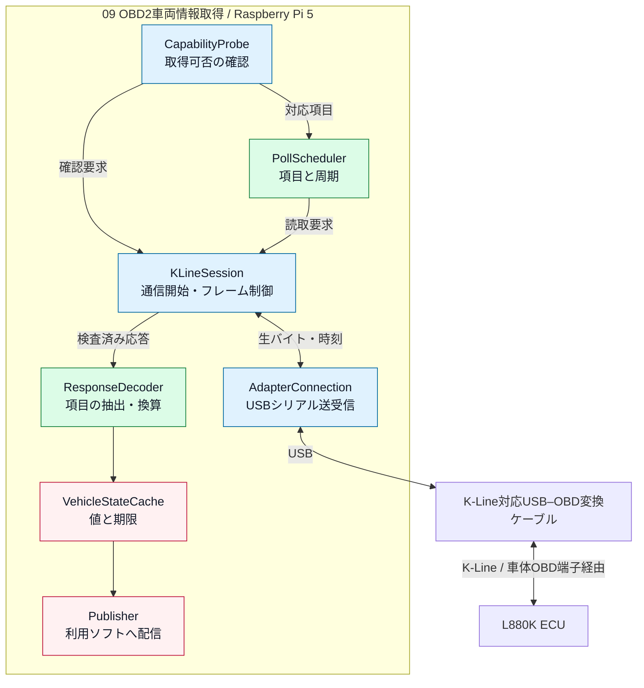
```mermaid
flowchart TB
 subgraph SW09["09 OBD2車両情報取得 / Raspberry Pi 5"]
  P["PollScheduler<br/>項目と周期"]
  C["CapabilityProbe<br/>取得可否の確認"]
  K["KLineSession<br/>通信開始・フレーム制御"]
  A["AdapterConnection<br/>USBシリアル送受信"]
  D["ResponseDecoder<br/>項目の抽出・換算"]
  V["VehicleStateCache<br/>値と期限"]
  U["Publisher<br/>利用ソフトへ配信"]
  C -->|"確認要求"| K
  C -->|"対応項目"| P
  P -->|"読取要求"| K
  K <-->|"生バイト・時刻"| A
  K -->|"検査済み応答"| D
  D --> V
  V --> U
 end
 A <-->|"USB"| Cable["K-Line対応USB–OBD変換ケーブル"]
 Cable <-->|"K-Line / 車体OBD端子経由"| ECU["L880K ECU"]
 classDef io fill:#e0f2fe,stroke:#0369a1,color:#111827
 classDef logic fill:#dcfce7,stroke:#15803d,color:#111827
 classDef out fill:#fff1f2,stroke:#be123c,color:#111827
 class A,K,C io
 class P,D logic
 class V,U out
```

| 接続 | 受け渡す情報 |
| --- | --- |
| CapabilityProbe → KLineSession | 実車用プロファイルに登録した確認要求。全アドレス・全サービスを総当たりしない。 |
| PollScheduler → KLineSession | 取得項目ID、期限、対応する許可済み要求定義。 |
| KLineSession ↔ AdapterConnection | USB側の送受信バイトとタイムアウト。ケーブルの電気変換はソフトが代行しない。 |
| KLineSession → ResponseDecoder | エコー分離・フレーム検査後の応答、要求・接続世代・セッション・送受信時刻。 |
| ResponseDecoder → VehicleStateCache | プロファイルの定義で換算した値、単位、出所、時刻品質。 |
| VehicleStateCache → Publisher | 項目別の更新・失効。他項目の観測時刻を一括更新しない。 |

<a id="dd-feature-flows"></a>

### 3.2 機能別処理フローチャート

各機能の開始条件、判断、正常・異常時の結果を示す。関数単位の入力と出力は3.7に記載する。

<a id="dd-feature-1"></a>

#### 3.2.1 USB接続とK-Line通信の開始（OBD-F01）

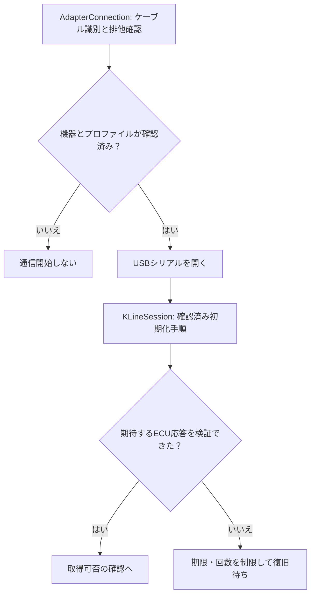
```mermaid
flowchart TB
 A["AdapterConnection: ケーブル識別と排他確認"] --> B{"機器とプロファイルが確認済み？"}
 B -->|"いいえ"| X["通信開始しない"]
 B -->|"はい"| C["USBシリアルを開く"]
 C --> D["KLineSession: 確認済み初期化手順"]
 D --> E{"期待するECU応答を検証できた？"}
 E -->|"はい"| F["取得可否の確認へ"]
 E -->|"いいえ"| G["期限・回数を制限して復旧待ち"]
```

<a id="dd-feature-2"></a>

#### 3.2.2 取得可能な項目の確認（OBD-F02）

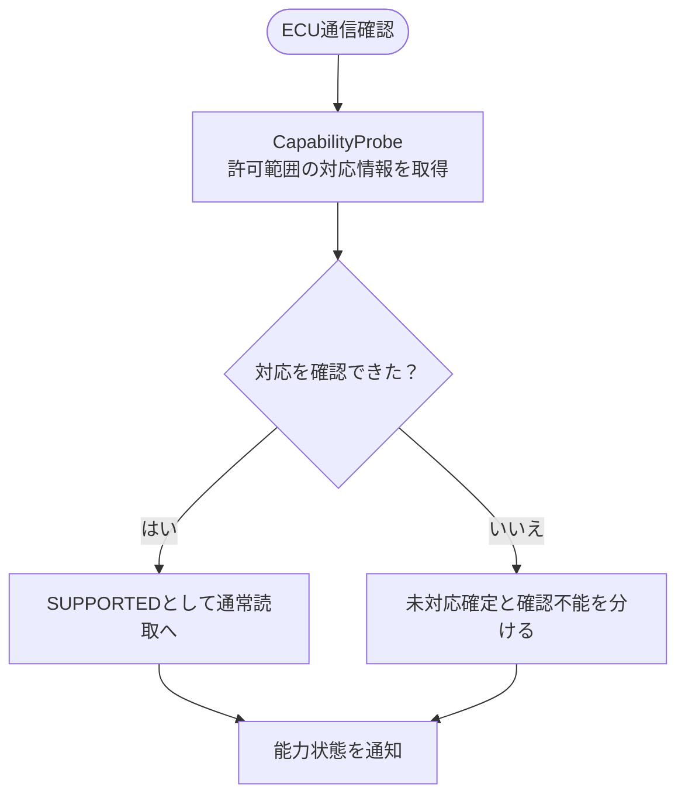
```mermaid
flowchart TB
 A(["ECU通信確認"]) --> B["CapabilityProbe<br/>許可範囲の対応情報を取得"]
 B --> C{"対応を確認できた？"}
 C -->|"はい"| D["SUPPORTEDとして通常読取へ"]
 C -->|"いいえ"| E["未対応確定と確認不能を分ける"]
 D --> F["能力状態を通知"]
 E --> F
```

<a id="dd-feature-3"></a>

#### 3.2.3 優先順位付きの定期読取（OBD-F03）

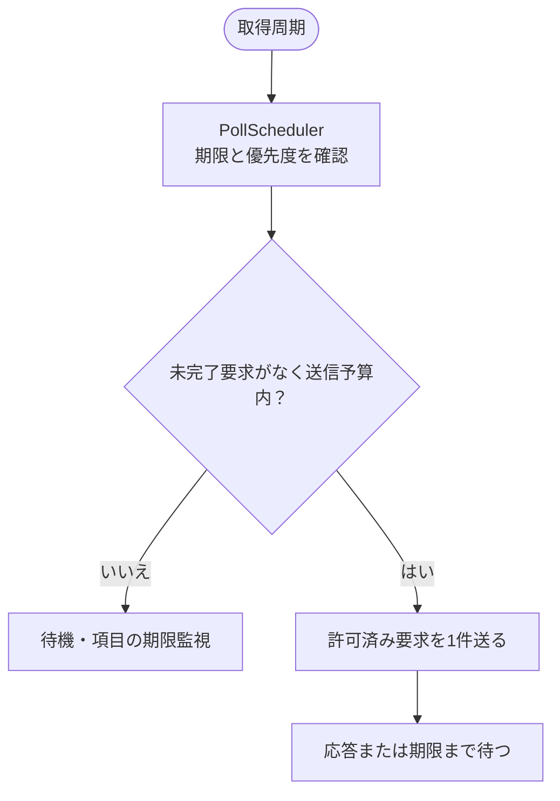
```mermaid
flowchart TB
 A(["取得周期"]) --> B["PollScheduler<br/>期限と優先度を確認"]
 B --> C{"未完了要求がなく送信予算内？"}
 C -->|"いいえ"| D["待機・項目の期限監視"]
 C -->|"はい"| E["許可済み要求を1件送る"]
 E --> F["応答または期限まで待つ"]
```

<a id="dd-feature-4"></a>

#### 3.2.4 応答の検査と値の共有（OBD-F04）

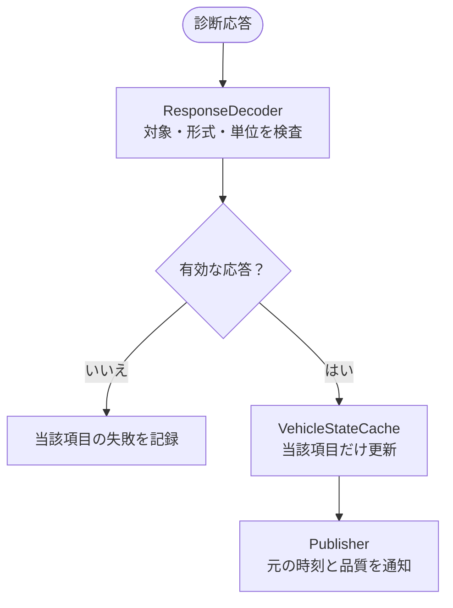
```mermaid
flowchart TB
 A(["診断応答"]) --> B["ResponseDecoder<br/>対象・形式・単位を検査"]
 B --> C{"有効な応答？"}
 C -->|"いいえ"| D["当該項目の失敗を記録"]
 C -->|"はい"| E["VehicleStateCache<br/>当該項目だけ更新"]
 E --> F["Publisher<br/>元の時刻と品質を通知"]
```

<a id="dd-feature-5"></a>

#### 3.2.5 失効と切断からの回復（OBD-F05）

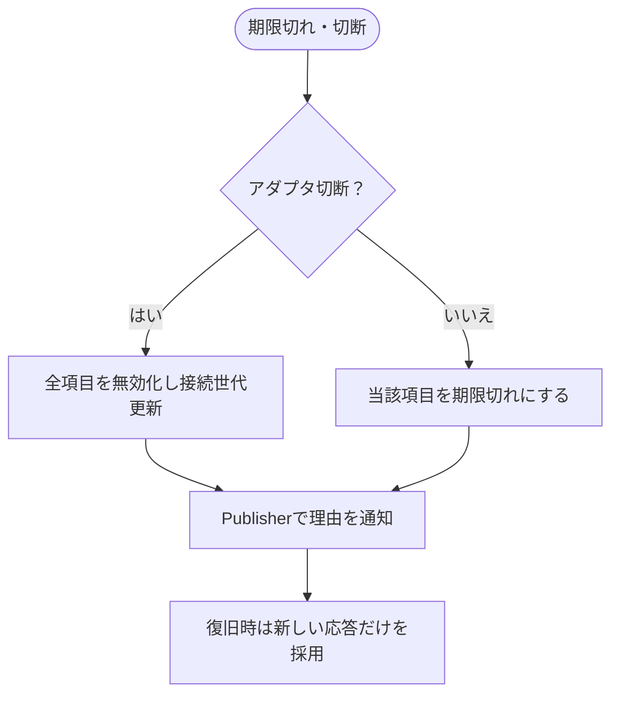
```mermaid
flowchart TB
 A(["期限切れ・切断"]) --> B{"アダプタ切断？"}
 B -->|"はい"| C["全項目を無効化し接続世代更新"]
 B -->|"いいえ"| D["当該項目を期限切れにする"]
 C --> E["Publisherで理由を通知"]
 D --> E
 E --> F["復旧時は新しい応答だけを採用"]
```

<a id="dd-module-tree"></a>

### 3.3 モジュールツリー

```text
obd2_service
+-- AdapterConnection
|   +-- connect_adapter / write_bytes / read_bytes
|   +-- reconnect_adapter / stop_obd
+-- KLineSession
|   +-- initialize_kline / send_query / receive_frame
|   +-- 通信維持・期限・同期回復
+-- CapabilityProbe
|   +-- probe_capabilities
+-- PollScheduler
|   +-- select_next_query
+-- ResponseDecoder
|   +-- decode_response
+-- VehicleStateCache
|   +-- apply_sample / expire_values
+-- Publisher
    +-- publish_state
```

<a id="dd-sequence"></a>

### 3.4 モジュール間の処理順序

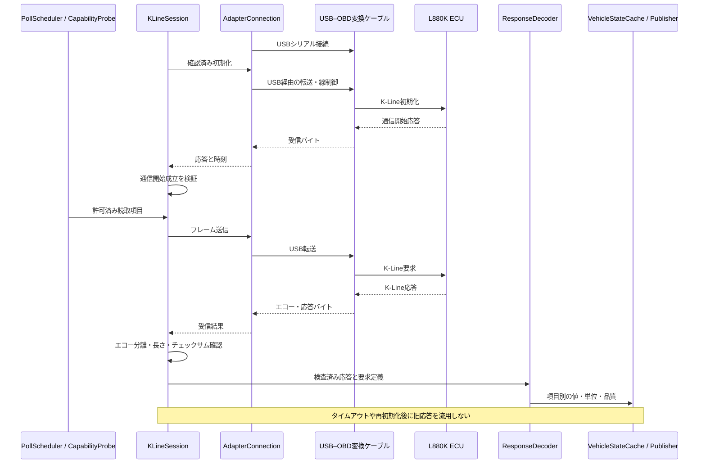
```mermaid
sequenceDiagram
 participant P as PollScheduler / CapabilityProbe
 participant K as KLineSession
 participant A as AdapterConnection
 participant W as USB–OBD変換ケーブル
 participant E as L880K ECU
 participant D as ResponseDecoder
 participant V as VehicleStateCache / Publisher
 A->>W: USBシリアル接続
 K->>A: 確認済み初期化
 A->>W: USB経由の転送・線制御
 W->>E: K-Line初期化
 E-->>W: 通信開始応答
 W-->>A: 受信バイト
 A-->>K: 応答と時刻
 K->>K: 通信開始成立を検証
 P->>K: 許可済み読取項目
 K->>A: フレーム送信
 A->>W: USB転送
 W->>E: K-Line要求
 E-->>W: K-Line応答
 W-->>A: エコー・応答バイト
 A-->>K: 受信結果
 K->>K: エコー分離・長さ・チェックサム確認
 K->>D: 検査済み応答と要求定義
 D->>V: 項目別の値・単位・品質
 Note over K,V: タイムアウトや再初期化後に旧応答を流用しない
```

ケーブルによる送信エコーの有無は実機で確認する。通信開始をケーブル内部で実行する製品では、その制御APIと完了応答を別途適合させる。

<a id="dd-modules"></a>

### 3.5 モジュール詳細

USB入出力、K-Lineの通信制御、L880Kの項目換算を分ける。検証済みライブラリが利用できる部分は再利用するが、未選定のライブラリが車種固有処理を提供すると仮定しない。

<a id="dd-module-1"></a>

#### 3.5.1 AdapterConnection（USBケーブル接続と転送）

| 項目 | 内容 |
| --- | --- |
| 入力 | 承認済みUSB識別、シリアル設定、送信バイト、読書き期限、必要な線制御。 |
| 出力 | 受信バイト列、実際の送受信結果、接続状態。ECUの値へは換算しない。 |
| 保持情報 | device_identity、port、connection_epoch、read/write期限、ケーブル機能情報。 |
| 処理 | USBシリアルを排他的に取得。短いreadや部分writeを扱い、無期限に待たない。 |
| 関数 | connect_adapter、write_bytes、read_bytes、reconnect_adapter、stop_obd。 |
| 異常時 | USB抜去・I/O例外をKLineSessionへ通知し、全値を無効化。未確認のDTR/RTS/BREAK操作を実行しない。 |

<a id="dd-module-2"></a>

#### 3.5.2 CapabilityProbe（対応項目の確認）

| 項目 | 内容 |
| --- | --- |
| 入力 | 確認済みプロファイルとECU応答 |
| 出力 | 項目別support_stateと確認根拠 |
| 保持情報 | ECU識別、項目別の確認根拠、profile_version、調査回数、確認日時 |
| 処理 | K-Line通信成立後、プロファイルに登録した読取・対応確認だけを行う。標準PID対応ビットマップがあるとは仮定しない。接続機器・ECU変更時は再確認 |
| 関数 | probe_capabilities |
| 異常時 | NO DATAを即UNSUPPORTEDにしない。UNKNOWNとして間隔を空けて確認 |

<a id="dd-module-3"></a>

#### 3.5.3 PollScheduler（読取順序の決定）

| 項目 | 内容 |
| --- | --- |
| 入力 | 対応集合、周期、失敗回数、前回取得 |
| 出力 | 次要求と期限 |
| 保持情報 | next_due、優先度、最終要求、送信予算 |
| 処理 | 優先度と期限で選び、遅い項目も上限待ち時間を設定。滞留周期を再生しない |
| 関数 | select_next_query |
| 異常時 | 長いDTC読取で車速期限が守れなければDTCを延期。負荷上限超過で減速 |

<a id="dd-module-4"></a>

#### 3.5.4 ResponseDecoder（応答検査と単位変換）

| 項目 | 内容 |
| --- | --- |
| 入力 | 検査済みK-Line応答、要求・接続世代・ECU識別、項目の抽出定義 |
| 出力 | VehicleSampleまたは拒否理由 |
| 保持情報 | profile_id/version、データ識別子、応答中の位置・長さ・符号・バイト順・換算式・単位、ECU選択方針 |
| 処理 | 許可したサービス・データ識別子を照合してバイト列から値を抽出。プロファイルの式で内部単位へ換算し、無応答・否定応答・不正値を区別 |
| 関数 | decode_response |
| 異常時 | 複数ECUを平均せず、出所不明はUNKNOWN。例外で全デーモンを止めない |

<a id="dd-module-5"></a>

#### 3.5.5 VehicleStateCache（項目別の値と期限）

| 項目 | 内容 |
| --- | --- |
| 入力 | 検査済み値、失敗、切断、現在時刻 |
| 出力 | 最新状態と無効通知 |
| 保持情報 | 値・測定参照・期限・品質を項目別に保持 |
| 処理 | 現在利用値と履歴を分ける。再送・status通知で測定期限を延ばさない |
| 関数 | apply_sample、expire_values |
| 異常時 | 切断時は全値を使用不可。失敗時の過去値は履歴として区別 |

<a id="dd-module-6"></a>

#### 3.5.6 Publisher（車両状態の配信）

| 項目 | 内容 |
| --- | --- |
| 入力 | 項目更新、能力、失効、接続状態 |
| 出力 | vehicle.update / vehicle.invalidate / vehicle.status。専用UnixドメインソケットへJSON Linesで配信 |
| 保持情報 | boot_id、共通通知sequence、最新スナップショット |
| 処理 | 利用者ごとに最新優先の有限キュー。項目の測定参照は状態通知連番と分離 |
| 関数 | publish_state |
| 異常時 | 利用者切断を車両通信断にしない。復旧で古い値を新規測定として配信しない |

<a id="dd-module-7"></a>

#### 3.5.7 KLineSession（K-Line通信制御）

| 項目 | 内容 |
| --- | --- |
| 入力 | L880K用プロファイル、許可済み要求ID、USB受信バイト、通信期限。 |
| 出力 | 通信成立/失敗、検査済み応答、送受信時刻、失敗理由。 |
| 保持情報 | session_epoch、初期化段階、active_query、受信バッファ、エコー規則、通信維持期限。 |
| 処理 | 確認済み初期化、送信間隔、要求フレーム生成、部分受信の蓄積、エコー分離、長さ・宛先・チェックサム検査を担当。 |
| 関数 | initialize_kline、send_query、receive_frame。 |
| 異常時 | 初期化失敗・同期喪失・セッション失効で取得を停止し値を失効。未確認の別プロトコルへ自動切替しない。 |
| 線制御 | 必要な初期化波形を採用ケーブルが生成できるか検証する。Linuxの待機処理だけで厳密な波形を保証しない。 |

<a id="dd-files"></a>

### 3.6 ファイル構成

```text
src/raspberry_pi5/
+-- obd2_service.py
+-- obd2/
|   +-- connection.py            USBシリアル転送
|   +-- kline_session.py         K-Line初期化・フレーム・期限
|   +-- capabilities.py
|   +-- scheduler.py / decoder.py
|   +-- state_cache.py / publisher.py
|   +-- commands.py             承認済み要求IDの許可リスト
|   +-- profiles/               L880K用の確認済み通信・換算定義
|   +-- models.py / config.py
+-- config/obd2.example.toml
tests/obd2/
+-- test_allowlist.py / test_decoder.py
+-- test_kline_init.py / test_kline_frames.py / test_echo.py
+-- test_scheduler.py / test_expiry.py
+-- test_reconnect.py / fixtures/
```

初期実装の配置。実データ、秘密鍵、認証情報はソースや公開Gitへ含めない。`obd2.example.toml`は未確認状態のため、そのままでは車体へ接続・送信しない。

初期実装では、設定読み込み、USBシリアル接続、読み取り専用要求の許可リスト、K-Lineセッション、応答デコード、項目別期限、状態配信、停止処理を実装した。`status = "confirmed"`、`confirmed = true`、初期化手順、要求定義、応答デコード定義がすべて揃わない限り、`Obd2Service`は送信処理へ進まない。L880Kの実車適合、ケーブル固有の線制御、要求バイト列、換算式は実車試験後に設定へ追加する。

<a id="dd-function-flows"></a>

### 3.7 関数のフローチャート

query_idは本ソフトの要求識別子。車両応答がそのIDを返すとは仮定せず、直列化・応答サービス/データ識別子・応答元・接続世代・K-Lineセッションを組み合わせて対応付ける。

<a id="dd-fn-connect-adapter"></a>

#### 3.7.1 connect_adapter（対象USB機器へ接続する）

| 項目 | 内容 |
| --- | --- |
| 担当 | AdapterConnection |
| 入力 | USB識別とケーブル機能・通信プロファイル |
| 戻り値・結果 | USB接続状態。K-Line通信成立とは別。 |

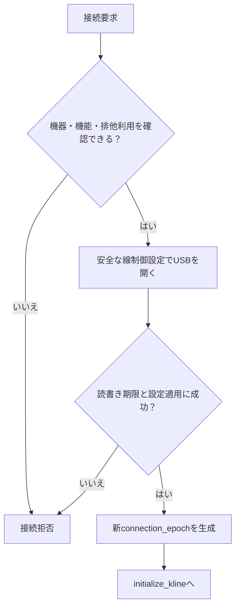
```mermaid
flowchart TB
 A["接続要求"] --> B{"機器・機能・排他利用を確認できる？"}
 B -->|"いいえ"| X["接続拒否"]
 B -->|"はい"| C["安全な線制御設定でUSBを開く"]
 C --> D{"読書き期限と設定適用に成功？"}
 D -->|"いいえ"| X
 D -->|"はい"| E["新connection_epochを生成"]
 E --> F["initialize_klineへ"]
```

<a id="dd-fn-probe-capabilities"></a>

#### 3.7.2 probe_capabilities（取得可能な項目を調べる）

| 項目 | 内容 |
| --- | --- |
| 担当 | CapabilityProbe |
| 入力 | 許可した対応確認要求 |
| 戻り値・結果 | 対応集合 |

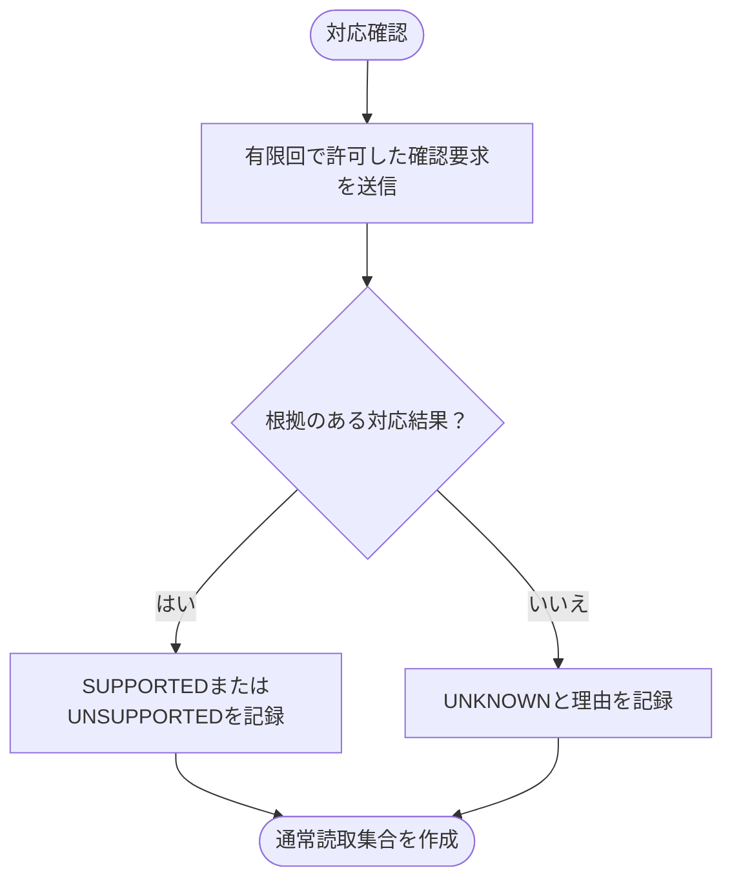
```mermaid
flowchart TB
 A(["対応確認"]) --> B["有限回で許可した確認要求を送信"]
 B --> C{"根拠のある対応結果？"}
 C -->|"はい"| D["SUPPORTEDまたはUNSUPPORTEDを記録"]
 C -->|"いいえ"| E["UNKNOWNと理由を記録"]
 D --> F(["通常読取集合を作成"])
 E --> F
```

<a id="dd-fn-select-next-query"></a>

#### 3.7.3 select_next_query（次の読取を選ぶ）

| 項目 | 内容 |
| --- | --- |
| 担当 | PollScheduler |
| 入力 | 周期・期限・対応集合 |
| 戻り値・結果 | 要求1件または待機 |

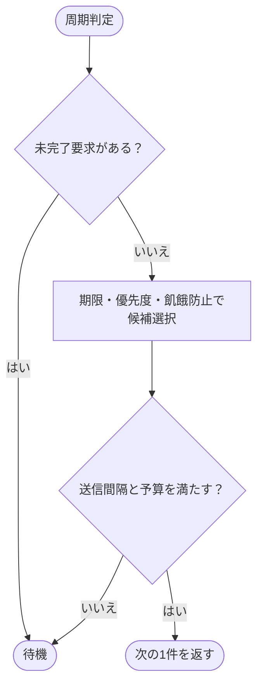
```mermaid
flowchart TB
 A(["周期判定"]) --> B{"未完了要求がある？"}
 B -->|"はい"| X(["待機"])
 B -->|"いいえ"| C["期限・優先度・飢餓防止で候補選択"]
 C --> D{"送信間隔と予算を満たす？"}
 D -->|"いいえ"| X
 D -->|"はい"| E(["次の1件を返す"])
```

<a id="dd-fn-send-query"></a>

#### 3.7.4 send_query（許可した読取要求を送る）

| 項目 | 内容 |
| --- | --- |
| 担当 | KLineSession |
| 入力 | 許可済み要求IDと期限 |
| 戻り値・結果 | 検査済み応答または失敗理由 |

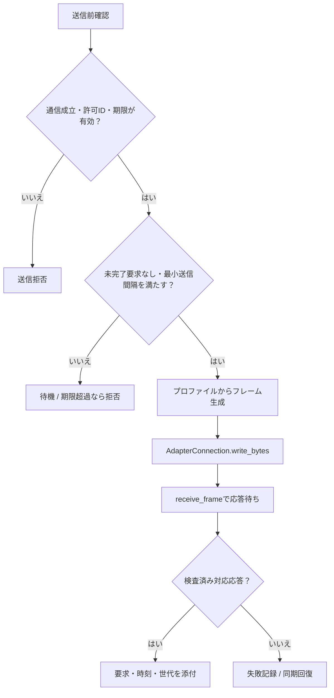
```mermaid
flowchart TB
 A["送信前確認"] --> B{"通信成立・許可ID・期限が有効？"}
 B -->|"いいえ"| X["送信拒否"]
 B -->|"はい"| C{"未完了要求なし・最小送信間隔を満たす？"}
 C -->|"いいえ"| W["待機 / 期限超過なら拒否"]
 C -->|"はい"| D["プロファイルからフレーム生成"]
 D --> E["AdapterConnection.write_bytes"]
 E --> F["receive_frameで応答待ち"]
 F --> G{"検査済み対応応答？"}
 G -->|"はい"| H["要求・時刻・世代を添付"]
 G -->|"いいえ"| I["失敗記録 / 同期回復"]
```

部分writeは残りだけを有限期限内で送る。送信成立が不明な要求を即座に丸ごと再送しない。

<a id="dd-fn-decode-response"></a>

#### 3.7.5 decode_response（応答を内部単位へ変換する）

| 項目 | 内容 |
| --- | --- |
| 担当 | ResponseDecoder |
| 入力 | 要求・応答・ECU・時刻 |
| 戻り値・結果 | 値または理由 |

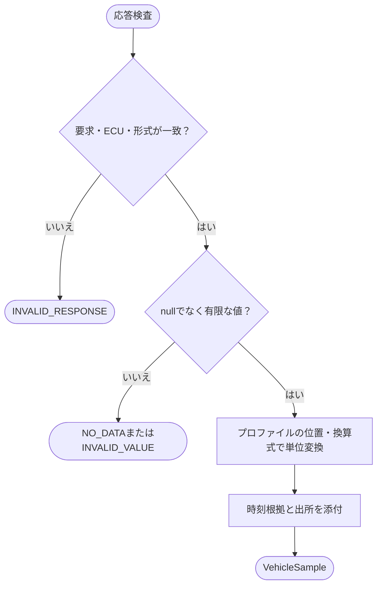
```mermaid
flowchart TB
 A(["応答検査"]) --> B{"要求・ECU・形式が一致？"}
 B -->|"いいえ"| X(["INVALID_RESPONSE"])
 B -->|"はい"| C{"nullでなく有限な値？"}
 C -->|"いいえ"| Y(["NO_DATAまたはINVALID_VALUE"])
 C -->|"はい"| D["プロファイルの位置・換算式で単位変換"]
 D --> E["時刻根拠と出所を添付"]
 E --> F(["VehicleSample"])
```

<a id="dd-fn-apply-sample"></a>

#### 3.7.6 apply_sample（当該項目だけ更新する）

| 項目 | 内容 |
| --- | --- |
| 担当 | VehicleStateCache |
| 入力 | 検査済みサンプル |
| 戻り値・結果 | 更新状態 |

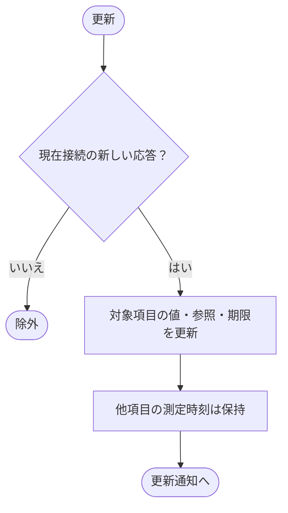
```mermaid
flowchart TB
 A(["更新"]) --> B{"現在接続の新しい応答？"}
 B -->|"いいえ"| X(["除外"])
 B -->|"はい"| C["対象項目の値・参照・期限を更新"]
 C --> D["他項目の測定時刻は保持"]
 D --> E(["更新通知へ"])
```

<a id="dd-fn-expire-values"></a>

#### 3.7.7 expire_values（古い値を使用不可にする）

| 項目 | 内容 |
| --- | --- |
| 担当 | VehicleStateCache |
| 入力 | 現在時刻・切断理由 |
| 戻り値・結果 | 無効項目一覧 |

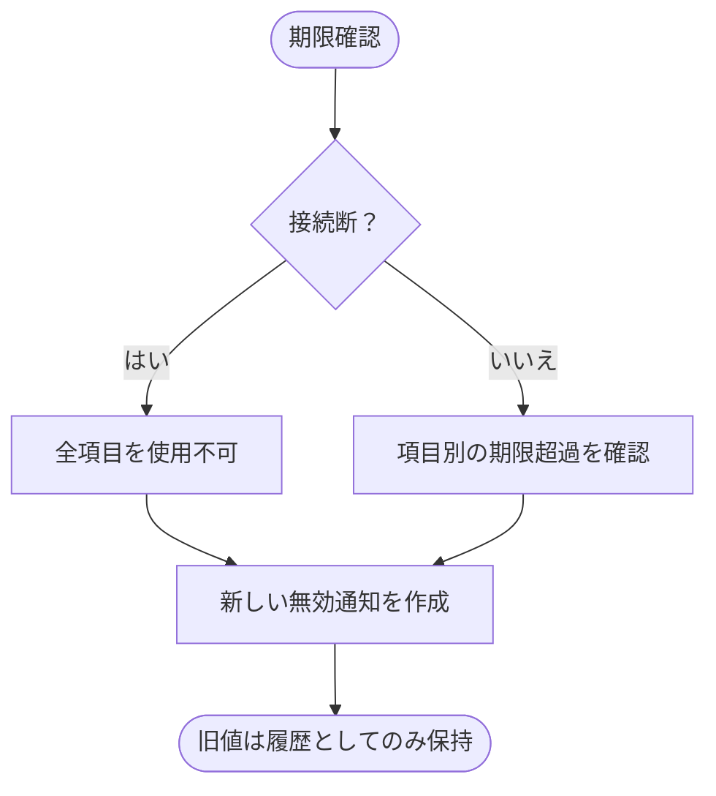
```mermaid
flowchart TB
 A(["期限確認"]) --> B{"接続断？"}
 B -->|"はい"| C["全項目を使用不可"]
 B -->|"いいえ"| D["項目別の期限超過を確認"]
 C --> E["新しい無効通知を作成"]
 D --> E
 E --> F(["旧値は履歴としてのみ保持"])
```

<a id="dd-fn-publish-state"></a>

#### 3.7.8 publish_state（車両状態を配信する）

| 項目 | 内容 |
| --- | --- |
| 担当 | Publisher |
| 入力 | 更新・無効・状態 |
| 戻り値・結果 | 共通形式の通知 |

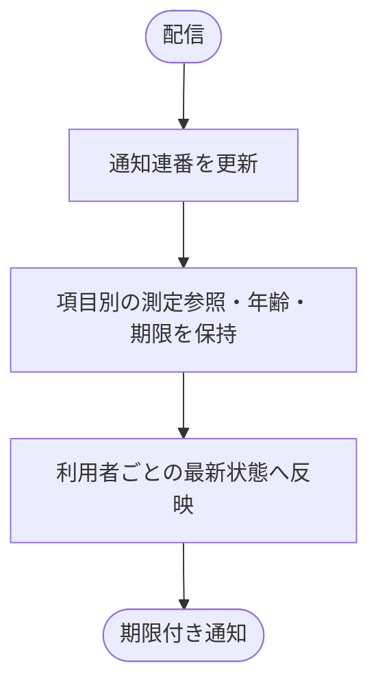
```mermaid
flowchart TB
 A(["配信"]) --> B["通知連番を更新"]
 B --> C["項目別の測定参照・年齢・期限を保持"]
 C --> D["利用者ごとの最新状態へ反映"]
 D --> E(["期限付き通知"])
```

<a id="dd-fn-reconnect-adapter"></a>

#### 3.7.9 reconnect_adapter（切断後に取り直す）

| 項目 | 内容 |
| --- | --- |
| 担当 | AdapterConnection |
| 入力 | 切断理由・運用許可 |
| 戻り値・結果 | 新接続または待機 |

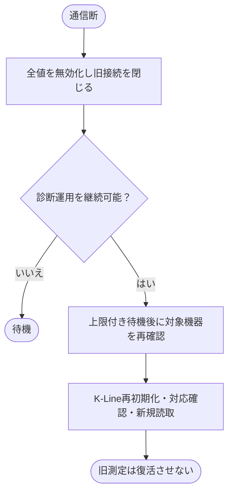
```mermaid
flowchart TB
 A(["通信断"]) --> B["全値を無効化し旧接続を閉じる"]
 B --> C{"診断運用を継続可能？"}
 C -->|"いいえ"| X(["待機"])
 C -->|"はい"| D["上限付き待機後に対象機器を再確認"]
 D --> E["K-Line再初期化・対応確認・新規読取"]
 E --> F(["旧測定は復活させない"])
```

<a id="dd-fn-stop-obd"></a>

#### 3.7.10 stop_obd（車両通信を終了する）

| 項目 | 内容 |
| --- | --- |
| 担当 | AdapterConnection |
| 入力 | 停止要求と期限 |
| 戻り値・結果 | 終了状態 |

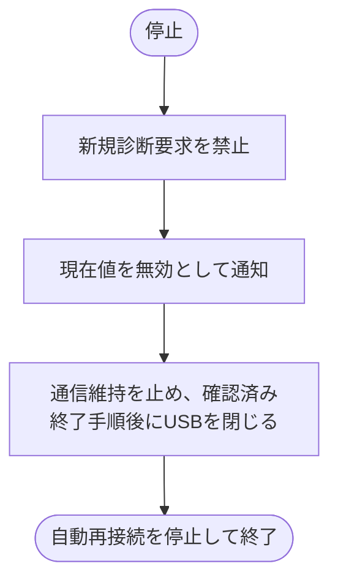
```mermaid
flowchart TB
 A(["停止"]) --> B["新規診断要求を禁止"]
 B --> C["現在値を無効として通知"]
 C --> D["通信維持を止め、確認済み終了手順後にUSBを閉じる"]
 D --> E(["自動再接続を停止して終了"])
```

<a id="dd-fn-init-kline"></a>

#### 3.7.11 initialize_kline（ECUとの通信を開始する）

| 項目 | 内容 |
| --- | --- |
| 担当 | KLineSession |
| 入力 | 確認済みinit_profile、ケーブル機能、試行回数と期限 |
| 戻り値・結果 | READYまたはINIT_FAILED。失敗中は通常読取禁止 |

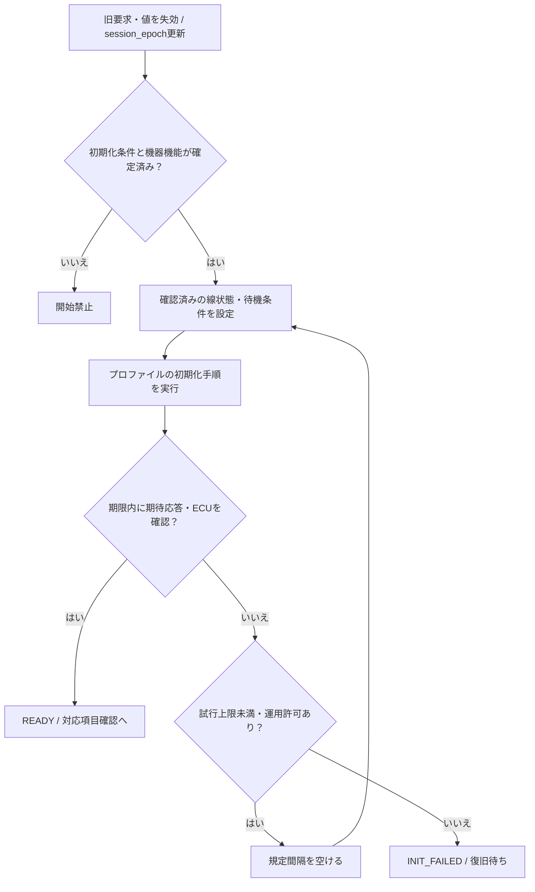
```mermaid
flowchart TB
 A["旧要求・値を失効 / session_epoch更新"] --> B{"初期化条件と機器機能が確定済み？"}
 B -->|"いいえ"| X["開始禁止"]
 B -->|"はい"| C["確認済みの線状態・待機条件を設定"]
 C --> D["プロファイルの初期化手順を実行"]
 D --> E{"期限内に期待応答・ECUを確認？"}
 E -->|"はい"| F["READY / 対応項目確認へ"]
 E -->|"いいえ"| G{"試行上限未満・運用許可あり？"}
 G -->|"はい"| H["規定間隔を空ける"]
 H --> C
 G -->|"いいえ"| I["INIT_FAILED / 復旧待ち"]
```

車種に合う初期化方式・波形・通信速度はT.B.D。未検証のアドレス・速度・コマンドを自動で総当たりしない。

<a id="dd-fn-receive-frame"></a>

#### 3.7.12 receive_frame（エコーと応答を分離して検査する）

| 項目 | 内容 |
| --- | --- |
| 担当 | KLineSession |
| 入力 | active_query、受信バイト、プロファイルのエコー・長さ・チェックサム定義 |
| 戻り値・結果 | ResponseFrameまたはTIMEOUT / FRAME_ERROR / NEGATIVE_RESPONSE |

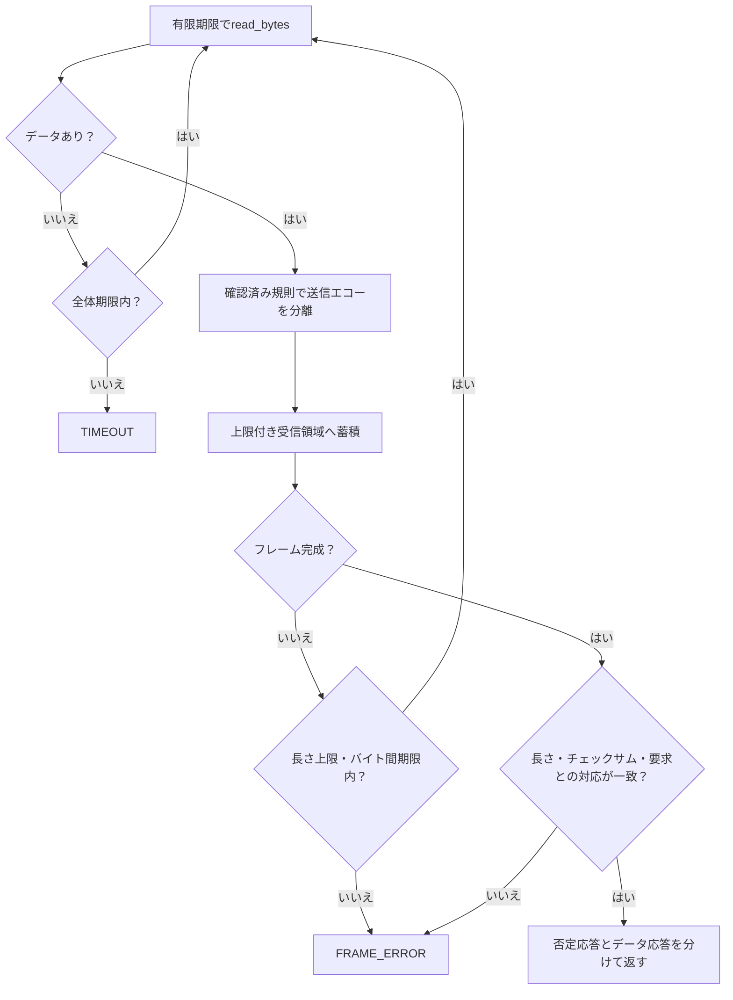
```mermaid
flowchart TB
 A["有限期限でread_bytes"] --> B{"データあり？"}
 B -->|"いいえ"| T{"全体期限内？"}
 T -->|"はい"| A
 T -->|"いいえ"| X["TIMEOUT"]
 B -->|"はい"| C["確認済み規則で送信エコーを分離"]
 C --> D["上限付き受信領域へ蓄積"]
 D --> E{"フレーム完成？"}
 E -->|"いいえ"| F{"長さ上限・バイト間期限内？"}
 F -->|"はい"| A
 F -->|"いいえ"| Y["FRAME_ERROR"]
 E -->|"はい"| G{"長さ・チェックサム・要求との対応が一致？"}
 G -->|"いいえ"| Y
 G -->|"はい"| H["否定応答とデータ応答を分けて返す"]
```

受信1回で1フレーム届くと仮定しない。エコー無効設定のケーブルで応答先頭を捨てない。未知フレームを値として採用せず、同期不明ならセッションを再初期化する。

<a id="dd-4"></a>

## 4. インターフェース設計


<a id="dd-interface-diagrams"></a>

### 4.1 接続図と利用者

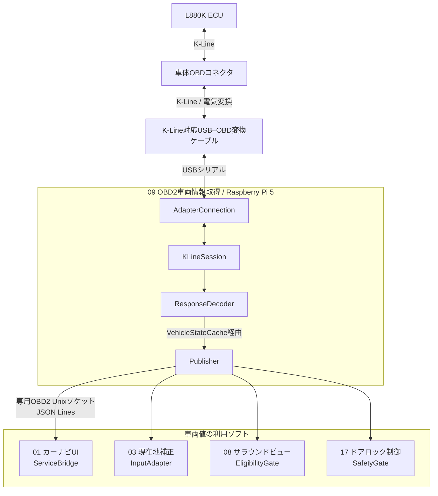
```mermaid
flowchart TB
 ECU["L880K ECU"] <-->|"K-Line"| V["車体OBDコネクタ"]
 V <-->|"K-Line / 電気変換"| Cable["K-Line対応USB–OBD変換ケーブル"]
 subgraph SW09["09 OBD2車両情報取得 / Raspberry Pi 5"]
  A["AdapterConnection"]
  K["KLineSession"]
  D["ResponseDecoder"]
  P["Publisher"]
  A <--> K
  K --> D
  D -->|"VehicleStateCache経由"| P
 end
 Cable <-->|"USBシリアル"| A
 subgraph USERS["車両値の利用ソフト"]
  U["01 カーナビUI<br/>ServiceBridge"]
  L["03 現在地補正<br/>InputAdapter"]
  S["08 サラウンドビュー<br/>EligibilityGate"]
  Lock["17 ドアロック制御<br/>SafetyGate"]
 end
 P -->|"専用OBD2 Unixソケット<br/>JSON Lines"| U
 P --> L
 P --> S
 P --> Lock
```

内部の詳細経路は3.1参照。01 カーナビUIはWaydroid管理用ソケットとは別のOBD2専用Unixドメインソケットを購読する。利用ソフトはUSB機器を重複して開かずPublisherを利用する。バックギア・左右ウィンカーはこの経路へ移さない。

参照：[ハードウェアのOBD章](../../HW設計/ハードウェア設計書.md#sec-424)、[03 現在地補正](03_現在地補正.md#dd-4)、[08 サラウンドビュー](08_サラウンドビュー.md#dd-4)。

<a id="dd-commands"></a>

### 4.2 取得項目とK-Line要求定義

| 項目 | 論理項目ID | 要求・換算の決定 | 内部単位・扱い |
| --- | --- | --- | --- |
| 車速 | vehicle_speed | L880K用のサービス・識別子・データ位置・係数を確認 | m/s。無応答はnull、0と区別 |
| エンジン回転数 | engine_rpm | 同上 | rpm |
| 冷却水温 | coolant_temperature | 同上 | degC。CPU温度とは別 |
| ECU電圧 | ecu_voltage | ECUの取得可否と換算を確認 | V。測定箇所を明記 |
| 吸気温 | intake_temperature | 取得可否・要求・換算を確認 | degC |
| スロットル開度 | throttle_position | 同上 | % |
| エンジン負荷 | engine_load | ECU算出値の意味を含め確認 | % |
| 燃料残量 | fuel_level | 取得可否・要求・換算を確認 | %。未取得は非表示 |
| 故障コード | diagnostic_codes | L880Kの読取サービスとコード体系を確認 | 読取のみ。標準DTC形式と決めつけない |
| 通信状態 | communication_state | USB接続、K-Line初期化、ECU応答を別管理 | 取得値ではなくサービス状態 |

要求バイト列・識別子・応答オフセット・符号・バイト順・換算式は、すべて対象ECUの確認後に確定する。標準Mode 01のPIDをこの表の既定値にしない。L880Kで標準項目の応答が確認できた場合だけ、そのECU用プロファイルへ登録する。

ケーブル電圧測定はK-Line通信に必須の機能ではないため初期の取得対象にしない。電圧取得機能が別途確認できた場合もECU電圧とは別項目にする。燃費計算は必要な実測項目が未確定のため初期出力に含めない。

<a id="dd-data-contract"></a>

### 4.3 配信データと利用条件

| 項目 | 内容 |
| --- | --- |
| schema_version / source / boot_id / sequence | 共通通知識別子。update・invalidate・statusで単調増加 |
| key / value / unit | vehicle_speed等の項目ID、値、m/s等の単位。無効値はnull |
| support_state | SUPPORTED / UNSUPPORTED / UNKNOWN。取得成否とは別 |
| validity / reason | VALID / DEGRADED / STALE / UNKNOWN / FAULTと理由 |
| sample_id / query_id / connection_epoch | 測定応答と通信の参照。状態再送では新規測定IDを作らない |
| source_service / source_identifier / source_pid / ecu_identity | 実際の要求サービスとデータ識別子・ECU。source_pidは標準PID確認時だけ設定し、それ以外はnull。PIDを仮造しない |
| profile_id / profile_version / session_epoch | 換算根拠とK-Line初期化ごとの世代。別設定・旧セッションの応答を流用しない |
| observed_at_utc / acquired_at_utc | 実測時刻が分かる場合のUTCと、ホスト取得時刻を別項目にする |
| age_ms_at_send / valid_for_ms / time_quality | 測定年齢を評価できる場合の値と期限。時刻品質不明を通知。OBD2サービス側は期限切れ時に`vehicle.invalidate`を送信し、01 カーナビUIも受信値の`valid_for_ms`を100ms周期で監視して表示を消去する |
| query_started_mono / response_received_mono | Pi 5内の要求開始と応答完了。別ホストでは直接引き算しない |
測定時刻が不明な場合のage_ms_at_sendはnullとする拡張案であり、validity=DEGRADEDまたはUNKNOWN、time_quality=UNKNOWNを付ける。利用者は安全判断・位置積分へ採用しない。各ソフトとこの型を契約試験し、nullを0へ変換しない。

01 カーナビUIは、OBD2イベントの`schema_version=1`だけを受け入れる。未対応のスキーマ、スキーマ番号がない構造化イベント、型が不正なスキーマは破棄する。`boot_id`をサービス起動世代、`sequence`をその世代内の通知連番として検査し、同じ世代で連番が前回以下の通知は破棄する。サービス再起動後の新しい`boot_id`は受け入れるが、切り替え前の世代から遅れて届いた通知は破棄する。これにより、再接続前の車速や詳細値が画面へ戻ることを防ぐ。

01 カーナビUIは取得した参考値として表示できるが、03 現在地補正・08 サラウンドビュー・17 ドアロック制御は用途に必要な鮮度・出所が成立する値だけを利用する。

<a id="dd-library"></a>

### 4.4 USB転送方式と読取制限

基本設計は、生バイトのUSBシリアル入出力とK-Line電気変換が可能なケーブルを使い、KLineSessionが対象ECUの通信手順を管理する方式とする。Python側のUSBシリアル転送にはpySerialを候補とする。pySerialには読取・書込タイムアウト、バイト列送受信、BREAK等のAPIがあるが、K-LineやL880K固有診断を自動実装するライブラリではない。[pySerial公式API](https://pyserial.readthedocs.io/en/latest/pyserial_api.html)

python-OBD／ELM327の標準PID取得は本設計の基本経路にしない。ただし、K-Line方式であることだけを理由にELM327型が必ず非対応とは断定しない。ATコマンド型ケーブルと生バイト転送型ケーブルはホスト側操作が異なるため、採用機器がATコマンド型なら別のAdapterConnection実装と通信開始手順を検証し、この生バイト設計へそのまま接続しない。

ケーブルはK-Lineの電圧・送受信・必要な初期化に対応した製品を選ぶ。USB–TTL変換器や端子形状だけ合うケーブルでは代用しない。必要な初期化をUSB側の線制御で生成できない場合、確認済みのケーブル内制御機能等が必要となる。型番未確定のため対応を保証しない。

送信を許可するのは、承認済みの通信開始・必要な通信維持・読取・終了に限る。サービス番号・アドレス・要求バイトをUIから任意指定させない。消去・アクチュエータ操作・書込は許可リストに含めない。

<a id="dd-5"></a>

## 5. データ・設定設計


<a id="dd-data"></a>

### 5.1 最新値と状態の保持

| 保持対象 | 更新条件 |
| --- | --- |
| VehicleValue[key] | 成功した当該項目の新しい応答だけで更新 |
| LastKnownValue[key] | 履歴として別保持。失効後に現在値として使わない |
| Capabilities | 対応確認完了時。機器・ECU・接続条件変更で再調査 |
| ActiveQuery | 1件だけ。要求ID、期待応答、開始時刻、期限、connection_epoch、session_epoch |
| KLineSessionState | 初期化状態、通信維持期限、エコー規則、受信バッファ、同期状態 |
| VehicleProfile | 車両・ECU・ケーブル識別、初期化・フレーム定義、項目要求と換算式、確認根拠・バージョン |
| ConnectionState | USB・アダプタ・ECU通信を段階別に保持 |
| FailureCounters | 項目別の無応答・不正・期限切れ・接続断 |
| LatestSnapshot | 項目ごとの測定参照を残す。通知をまとめても観測時刻を揃えない |

<a id="dd-time"></a>

### 5.2 取得時刻と鮮度

多くの診断応答では実センサーの測定時刻そのものを取得できない。応答が届いた時刻を正確な測定時刻と偽らない。要求開始・応答完了・ECU内部更新周期の確認結果を組み合わせて、用途に必要な測定年齢の上限を評価する。

ECUの最大更新遅延を確認できる場合は、保守的な年齢を「確認済みのECU更新遅延上限 + 要求から応答までの時間 + 応答後の経過時間」とする。確認できない場合は時刻品質UNKNOWNとして補正・駐車判断には使わない。

アダプタの応答キャッシュや短縮応答機能で旧値が再生されないことを確認する。新しいquery_idを付けただけで新規測定とは判断しない。車速の応答値は分解能によって細かな移動を表せない可能性もあるため、0の連続応答だけで完全停止を保証しない。

UTC同期なしでもホスト内の要求時間と期限監視は継続できる。時計の不連続・接続再開では旧値を失効させ、03 現在地補正が旧速度で停止時間分を積分しないようにする。

<a id="dd-config"></a>

### 5.3 ポーリングと設定

| 設定 | 方針 |
| --- | --- |
| device_identity / port / cable_backend | 安定したUSB識別、生バイト転送方式とケーブル機能。デバイス番号だけで選ばない。 |
| host_serial / kline_baudrate | USB側のシリアル設定と車体側通信速度を区別。生バイト型で一致が必要な場合も採用ケーブルで確認。値はT.B.D。 |
| protocol_profile / profile_version / ecu_selection | 確認済みL880K用通信定義と対象ECU。未確定なら初期化・読取を開始しない。 |
| init_profile / init_timeout / init_retry_limit | 初期化手順・期待応答・時間条件・試行上限。推測値や総当たりは禁止。 |
| frame_format / checksum / echo_mode | ヘッダ、長さ、終端条件、チェックサム、送信エコーの有無と規則。 |
| request_definitions / decode_definitions | 許可するサービス・データ識別子、応答の位置・長さ・符号・バイト順・係数・オフセット・範囲・単位。 |
| query_timeout / inter_byte_timeout / min_query_gap | 全応答期限・バイト間期限・送信間隔を別管理。受信長上限も有限値。 |
| keepalive_policy / session_timeout | 維持通信が必要かを確認。必要時だけ承認済み要求を他要求と直列化。ACC OFF・停止時は止める。 |
| poll_intervals / value_ttls / request_budget | 車速等の優先順位と期限。K-Lineの通信時間・維持通信を含め実効周期を測る。 |
| timing_profile | ECU更新遅延とキャッシュの条件。未確認なら位置積分や安全判断へ使用不可。 |
| retry_limits / backoff_max / shutdown_timeout | 無応答・再初期化を連発せず、終了も有限期限。 |
| dtc_policy | 許可済み読取だけ。車速期限を妨げる場合は延期。 |
| poll_modes / polling_mode | `minimal`は常時必要な車速・冷却水温など、`full`は車両情報画面表示中だけ取得する詳細項目。UIが画面を離れたらminimalへ戻す。 |

値がT.B.Dのまま診断バイトを送らない。プロファイル変更時は旧値を失効させ、新しいセッションで取得し直す。周期遅延分をまとめて送信せず、受信エラーや負荷増大時は取得頻度を下げて品質を通知する。

取得モードはUIからOBD2専用ソケットへ`set_polling_mode`として要求する。サービスは要求を受理した後、`minimal`または`full`の許可済み項目だけを対象に対応確認と周期読取を行う。UIの車両情報画面を表示していない間は、現在地補正などで必要な最小項目だけを取得し、詳細項目の要求を送信しない。

<a id="dd-6"></a>

## 6. 処理・状態遷移


<a id="dd-states"></a>

### 6.1 接続と取得状態

```mermaid
stateDiagram-v2
 [*] --> DISCONNECTED
 DISCONNECTED --> CONNECTING: 承認済みケーブル検出
 CONNECTING --> INITIALIZING: USB接続成功
 INITIALIZING --> PROBING: K-Line通信成立
 INITIALIZING --> RETRY_WAIT: 初期化失敗
 PROBING --> POLLING: 項目確認成功
 PROBING --> DEGRADED: 一部確認不能
 POLLING --> DEGRADED: 項目異常・周期未達
 DEGRADED --> POLLING: 新規応答で回復
 POLLING --> RETRY_WAIT: セッション失効・同期喪失
 PROBING --> RETRY_WAIT: 同期喪失
 DEGRADED --> RETRY_WAIT: セッション失効
 RETRY_WAIT --> INITIALIZING: 間隔・回数・運用許可を確認
 CONNECTING --> DISCONNECTED: USB失敗
 INITIALIZING --> DISCONNECTED: USB抜去
 PROBING --> DISCONNECTED: USB抜去
 POLLING --> DISCONNECTED: USB抜去
 DEGRADED --> DISCONNECTED: USB抜去
 RETRY_WAIT --> DISCONNECTED: USB抜去
 DISCONNECTED --> STOPPING: 停止要求
 CONNECTING --> STOPPING: 停止要求
 INITIALIZING --> STOPPING: 停止要求
 PROBING --> STOPPING: 停止要求
 POLLING --> STOPPING: 停止要求
 DEGRADED --> STOPPING: 停止要求
 RETRY_WAIT --> STOPPING: 停止要求
 STOPPING --> [*]
```

K-Line通信が失効した場合はUSB機器が存在していても値を失効させる。INITIALIZINGとPROBINGを通過するまで通常取得を始めない。POLLINGでも個別項目のUNSUPPORTEDやSTALEは残る。

<a id="dd-reconnect"></a>

### 6.2 応答の対応付けと再接続

query_idはホスト内識別子であり、ECUが返すとは限らない。要求を1件ずつ扱い、接続世代・K-Lineセッション・宛先/送信元・応答サービス・データ識別子・長さ・チェックサムをプロファイルに従い確認する。

タイムアウトした要求の遅延応答、送信エコー、初期化応答を次の項目へ適用しない。受信残りを消しただけで同期回復済みとは判断せず、確認済みの同期回復条件を満たさなければセッションを失効させる。再初期化のたびsession_epochを更新する。

USB切断ではconnection_epochも更新し、全項目を使用不可にする。復旧後はK-Line初期化、項目確認、新規読取の順に再開する。UIのDTC読取はcommand_idと期限を検査し、重複・期限切れ要求を遅れて送信しない。

<a id="dd-7"></a>

## 7. 異常処理

| 異常 | 動作 |
| --- | --- |
| 真の0と無応答 | 0は成功値、無応答はNO_DATA。異なる状態として通知 |
| 未対応確定 | 通常ポーリング対象から外す。高速再試行しない |
| 複数ECU・出所不明 | 承認済み選択規則がなければ採用しない |
| チェックサム・長さ・識別子不正 | 応答を拒否。同期不明ならK-Line再初期化。値を更新しない |
| エコー・分割フレーム | ケーブル規則と有限受信領域で組み立て、エコーをECU値にしない |
| 初期化失敗・セッション失効 | 通常読取禁止、値失効、間隔・回数制限付きの再初期化 |
| 単位・換算式・値不正 | 該当項目を拒否。プロファイルを推測で補わない |
| 一項目の通信遅延 | 他項目の時刻を更新せず、周期と期限を再評価 |
| USB抜去・アダプタ故障 | 全項目無効、旧接続破棄、上限付き再接続 |
| 未許可コマンド要求 | 送信前に拒否し、制御や消去は実行しない |
| 終了要求後の応答 | 新しい有効値として配信しない |

<a id="dd-8"></a>

## 8. 起動・終了・運用設計

`python src/raspberry_pi5/obd2_service.py --config src/raspberry_pi5/config/obd2.example.toml --dry-run`で設定検査を行う。実車では`l880k-obd2.service`として常駐させ、開発用Debian起動スクリプトではWaydroid管理とは別プロセスで起動する。実車運用は、設定検査と模擬応答試験を通したL880K用プロファイルで起動する。USBを開いた後にK-Line初期化と対象ECUの応答確認を行う。通常ユーザーに必要なUSBシリアルアクセスだけを与え、他ソフトとの同時利用を禁止する。

利用許可はサービス運用・電源管理と連動する。ACC OFF後の終了猶予中も診断要求を出し続けないよう、OS停止だけでなく診断停止の通知経路を確定する。Pi 5に新しいACC GPIOがあるとは仮定しない。

停止時は新規読取と通信維持要求を止め、状態を無効化する。確認済みの終了手順が必要なら有限期限内で実施し、線制御を適切な非動作状態に戻してUSBを閉じる。USBを閉じることはアダプタの車体側給電停止を意味しないため、常時給電時の待機電流はハードウェア側でも確認する。生通信ログには識別情報が含まれ得るので、公開Gitには模擬応答だけを置く。

<a id="dd-9"></a>

## 9. 試験・受入条件


<a id="dd-tests"></a>

### 9.1 模擬応答による試験

| 試験 | 受入条件 |
| --- | --- |
| OBD-T01 / OBD-F01：別USB機器・複数候補 | 関係のない機器へコマンドを送らない |
| OBD-T02 / OBD-F02：対応・明示非対応・NO DATA | 3種類を区別し無応答を即非対応にしない |
| OBD-T03 / OBD-F03：遅い項目・周期遅れ・DTC要求 | 要求1件の上限と通信予算を守り、周期遅れを連打しない |
| OBD-T04 / OBD-F04：0・null・単位違い・NaN・複数ECU | 値と失敗を区別し、車速m/s等へ正しく変換 |
| OBD-T05 / OBD-F04：status再送・別項目更新 | 元測定の期限を延長しない |
| OBD-T06 / OBD-F05：タイムアウト後の遅延応答・再接続 | 旧応答で新しい項目や接続を更新しない |
| OBD-T07 / OBD-F03：消去・任意コマンド・期限切れ操作 | 送信回数0で拒否 |
| OBD-T08 / OBD-F05：診断停止・OS終了 | 読取・通信維持を止め旧値を無効化 |
| OBD-T09 / OBD-F01：USB成功・K-Line初期化失敗 | CONNECTEDだけで通常取得に進まず、回数制限を守る |
| OBD-T10 / OBD-F04：送信エコー有無・分割受信・複数フレーム | エコーと応答を分離し、完全で対応するフレームだけを採用 |
| OBD-T11 / OBD-F04：不正チェックサム・長さ・否定応答 | 値を更新せず、理由を分けて通知 |
| OBD-T12 / OBD-F05：USB継続中のセッション失効 | 旧値失効、新session_epochで再初期化・新規取得 |
| OBD-T13 / OBD-F03：維持要求と読取の競合 | 未完了要求は1件、送信間隔・通信予算を守る |
| OBD-T14 / OBD-F04：換算境界・符号・バイト順 | 確認済み応答例から正しい値へ変換。標準PID式を自動流用しない |
| OBD-T15 / OBD-F01：プロファイル未確定・ケーブル機能不足 | 初期化や診断データを送信しない |

<a id="dd-integration-tests"></a>

### 9.2 実車適合と計測

対象車の年式・ECU、ケーブル型番・USBチップ・ドライバ、K-Lineの初期化方式・速度・波形、応答フレーム、エコー、要求項目と換算根拠を記録する。USB側のAPI呼出し成功だけで車体側の初期化成立としない。

公開されたL880K所有者の実装報告ではKWP通信と車速・回転数・水温等の取得例がある。ただし使用機器はELM327系であり、本設計のUSB生バイトケーブルや対象年式・ECUの動作保証にはならない。KWP系を検証候補とし、初期化・データ定義は実機確認までT.B.Dとする。[実装者によるL880K診断アプリの報告](https://devblog.lac.co.jp/entry/20241216)

模擬通信・車体を外した電気確認の後、停車中に既知の少数読取から確認する。実効周期、応答時間、ECU更新遅延、無応答率、値の分解能と計器との差を測定し、取得できない項目を明示する。未知アドレスの総当たり、走行中の画面操作・デバッグは行わない。共通基盤の単体試験は実装済み、実車適合試験は未実施。

<a id="dd-10"></a>

## 10. 未確定事項・実装課題

| 課題 | 確定内容 |
| --- | --- |
| ケーブル適合 | K-Line電気対応、生バイト転送、初期化機能、USBチップ・ドライバ、線制御とエコー。型番T.B.D。 |
| 車両適合 | 対象年式・ECU、K-Line上の診断方式、初期化・速度・アドレス。KWP系を検証候補。 |
| 要求と換算 | サービス・データ識別子、フレーム長・チェックサム、応答オフセット・符号・係数・単位。 |
| 実装手段 | `src/raspberry_pi5/requirements-obd2.txt`のpySerialでUSB生バイトを転送する。未確認のAPI・時間精度を前提にしない。 |
| 鮮度・負荷 | ECU更新周期、バイト間・全体期限、通信維持、取得頻度、利用者へ出す時刻品質。 |
| 停止連携 | ACC OFF後に診断と通信維持を止める通知経路。USB切断と車体側給電停止は別。 |

<a id="dd-glossary"></a>

## 用語の注釈

| 用語 | 意味 |
| --- | --- |
| K-Line | 車体側の診断通信線・電気方式。本設計ではUSB–OBD変換ケーブル経由で扱う |
| KWP | K-Line上で使われる診断プロトコルの一例。対象ECUへの適合は別途確認 |
| プロファイル | 対象車両・ECU・ケーブルの初期化、要求、応答形式、換算式をまとめた確認済み設定 |
| エコー | 送信したバイトが自分の受信側へ戻ること。ECUの応答と区別する |
| PID / データ識別子 | 診断サービス内の情報を識別する番号。車種固有の識別子を標準PIDと同一視しない |
| ECU | 車両内の電子制御装置。複数から応答する場合がある |
| DTC | 車両が記録する故障コード。本ソフトは読取だけ |
| ポーリング | 決めた周期で値を読み出す要求を送ること |
| UNSUPPORTED / UNKNOWN | 非対応を確認済みの状態と、対応可否がまだ不明な状態 |
