# 冷却ファン制御 詳細設計書

| 項目 | 内容 |
| --- | --- |
| 文書ID | SW-DD-10 |
| 実行環境 | Pi 5 |
| 実装状態 | 内部実装済み・実機未検証・安全設定既定 |
| 対象ソース | `src/raspberry_pi5/fan_control_service.py`、`src/raspberry_pi5/telemetry_ipc.py` |
| 作成日 | 2026-09-14 |
| 更新日 | 2026-09-25 |

[詳細設計一覧](README.md) / [共通仕様](00_共通仕様.md) / [上位設計](../ソフトウェア設計図.md#sec-47)

## 目次

- [1. 目的・適用範囲](#dd-1)
- [2. 要求仕様・役割](#dd-2)
  - [2.1 機能一覧](#dd-functions)
  - [2.2 機能・モジュール・関数の対応](#dd-function-map)
- [3. 内部構成](#dd-3)
  - [3.1 モジュールの全体構成](#dd-overview)
  - [3.2 機能別処理フローチャート](#dd-feature-flows)
    - [3.2.1 制御条件と端子の確認（FAN-F01）](#dd-feature-1)
    - [3.2.2 CPU温度と回転数の取得（FAN-F02）](#dd-feature-2)
    - [3.2.3 温度に応じたPWM指令（FAN-F03）](#dd-feature-3)
    - [3.2.4 冷却ファンの回転監視と回転数制御（FAN-F04）](#dd-feature-4)
    - [3.2.5 異常時の冷却と警告（FAN-F05）](#dd-feature-5)
    - [3.2.6 停止と再開（FAN-F06）](#dd-feature-6)
  - [3.3 モジュールツリー](#dd-module-tree)
  - [3.4 モジュール間の処理順序](#dd-sequence)
  - [3.5 モジュール詳細](#dd-modules)
    - [3.5.1 TemperatureReader（CPU温度の取得）](#dd-module-1)
    - [3.5.2 TachCounter（冷却ファン回転数計測）](#dd-module-2)
    - [3.5.3 ControlPolicy（冷却目標と異常判断）](#dd-module-3)
    - [3.5.4 PwmDriver（PWMの出力）](#dd-module-4)
    - [3.5.5 FanHealthPublisher（状態・警告の通知）](#dd-module-5)
  - [3.6 ファイル構成](#dd-files)
  - [3.7 関数のフローチャート](#dd-function-flows)
    - [3.7.1 validate_profile（制御条件を検査する）](#dd-fn-validate-profile)
    - [3.7.2 initialize_pwm（PWM出力を準備する）](#dd-fn-initialize-pwm)
    - [3.7.3 read_temperature（CPU温度を取得する）](#dd-fn-read-temperature)
    - [3.7.4 record_edge（TACHの片側エッジを記録する）](#dd-fn-record-edge)
    - [3.7.5 calculate_rpm（冷却ファンのRPMを計算する）](#dd-fn-calculate-rpm)
    - [3.7.6 select_target（温度に応じた目標を選ぶ）](#dd-fn-select-target)
    - [3.7.7 check_rotation（回転異常を判定する）](#dd-fn-check-rotation)
    - [3.7.8 adjust_feedback（冷却ファンの回転誤差を補正する）](#dd-fn-adjust-feedback)
    - [3.7.9 apply_duty（指令を実出力へ変換する）](#dd-fn-apply-duty)
    - [3.7.10 enter_failsafe（冷却優先へ切り替える）](#dd-fn-enter-failsafe)
    - [3.7.11 publish_health（冷却状態を通知する）](#dd-fn-publish-health)
    - [3.7.12 stop_fan_control（停止時の端子状態を適用する）](#dd-fn-stop-fan-control)
- [4. インターフェース設計](#dd-4)
  - [4.1 接続と端子](#dd-interface-diagrams)
  - [4.2 OS入力・PWM実装](#dd-os-api)
  - [4.3 状態通知と負荷低減要求](#dd-contract)
- [5. データ・設定設計](#dd-5)
  - [5.1 温度・回転数・指令の保持](#dd-data)
  - [5.2 回転数の計算と品質](#dd-rpm)
  - [5.3 PWM変換と段階的な回転制御](#dd-control-law)
  - [5.4 設定一覧](#dd-config)
- [6. 処理・状態遷移](#dd-6)
  - [6.1 制御状態と異常の優先順位](#dd-states)
  - [6.2 復帰・出力競合の扱い](#dd-runtime)
- [7. 異常処理](#dd-7)
- [8. 起動・終了・運用設計](#dd-8)
- [9. 試験・受入条件](#dd-9)
  - [9.1 模擬入力・制御試験](#dd-tests)
  - [9.2 実回路と冷却性能の受入](#dd-integration-tests)
- [10. 未確定事項・実装課題](#dd-10)
- [用語の注釈](#dd-glossary)

<a id="dd-1"></a>

## 1. 目的・適用範囲

12V動作の4ピンPWM冷却ファン1台を、Pi 5のPWM出力で制御する。PWM周波数は標準仕様に合わせて25kHzを初期値とし、許容範囲を21kHz-28kHzとする。同じ冷却ファンのTACHを取得し、CPU温度に応じた冷却と回転監視を行う。

筐体制約により冷却ファンは1台とする。通知にはその冷却ファンの回転数だけを含め、存在しないファンの状態を推測・通知しない。

温度取得異常・高温・冷却ファンの回転異常時は、検証済みの駆動方式で最大冷却を要求する。プロセス停止やOS停止時の冷却継続はソフト単独では保証できない。閾値・駆動段・停止時出力が未確認なら自動制御を有効にせず、回路側の既定冷却を確認する。

<a id="dd-2"></a>

## 2. 要求仕様・役割

機能は実現する動作、モジュールは処理の分担、関数はモジュール内の処理単位を表す。本書の関数名・通知名は実装内部の契約であり、採用ライブラリの標準APIと区別する。

<a id="dd-functions"></a>

### 2.1 機能一覧

| 機能ID | 機能 | 実現する動作 |
| --- | --- | --- |
| FAN-F01 | 制御条件と端子の確認 | **開始条件・入力：** ファン型式、PWM周波数、反転論理、PPR、温度表、端子割当を読み込む。<br/>**確認・処理：** 採用Pi 5のPWM方式と端子の競合を確認する。GPIO番号とOS内のチップ番号を同じ番号と仮定しない。<br/>**処理結果：** 検証済みプロファイルでのみ自動制御を開始し、不明な波形を出力しない。 |
| FAN-F02 | CPU温度と回転数の取得 | **開始条件・入力：** CPU温度のOSインターフェースと冷却ファンのTACHエッジを受け取る。<br/>**確認・処理：** 温度の出所・単位・期限を確認する。TACHは採用した片側エッジを数え、測定窓とPPRから回転数を求める。<br/>**処理結果：** 温度とファン回転数を品質付きで渡す。存在しないファンの値は生成しない。 |
| FAN-F03 | 温度に応じたPWM指令 | **開始条件・入力：** 有効なCPU温度、前回指令、温度帯設定を使用する。<br/>**確認・処理：** 温度表とヒステリシスで目標を選び、通常時の急な指令低下を抑える。始動に必要な指令と最低継続デューティを区別する。<br/>**処理結果：** 1台のファンへの指令をPwmDriverへ渡す。初期段階は温度対デューティ表で動かす。 |
| FAN-F04 | ファン回転監視と回転数制御 | **開始条件・入力：** ファンの回転数、PWM指令、始動猶予、目標回転数を使用する。<br/>**確認・処理：** 回転要求がある時だけ停止・低回転を判定する。閉ループ段階では承認済み係数で回転誤差を補正し、補正量と積分量を制限する。<br/>**処理結果：** 1台のファンへ補正指令を出す。TACH不明なら閉ループを停止し冷却優先へ移る。 |
| FAN-F05 | 異常時の冷却と警告 | **開始条件・入力：** 高温、温度取得失敗、TACH異常、PWM設定失敗、制御周期遅延を検知する。<br/>**確認・処理：** 温度低下側の変化制限より異常時の冷却を優先する。最大指令の要求・OS設定成功・回転確認を別状態で管理する。<br/>**処理結果：** CPU温度、ファンの監視結果、冷却異常をUIへ通知し、承認済み経路へ負荷低減を要求する。 |
| FAN-F06 | 停止と再開 | **開始条件・入力：** サービス停止、設定変更、OS再開を受け取る。<br/>**確認・処理：** 正常終了時の端子状態を検証済み回路プロファイルに従って扱う。無条件にPWM無効化・GPIO解放を行って最大回転を仮定しない。<br/>**処理結果：** 終了結果を通知する。再開時は温度・回転・PWM所有権を取り直し、過去の積分値を使わない。 |

<a id="dd-function-map"></a>

### 2.2 機能・モジュール・関数の対応

| 機能ID | 担当モジュール | 主な関数 |
| --- | --- | --- |
| FAN-F01 | PwmDriver / ControlPolicy | validate_profile、initialize_pwm |
| FAN-F02 | TemperatureReader / TachCounter | read_temperature、record_edge、calculate_rpm |
| FAN-F03 | ControlPolicy / PwmDriver | select_target、apply_duty |
| FAN-F04 | TachCounter / ControlPolicy | check_rotation、adjust_feedback |
| FAN-F05 | ControlPolicy / FanHealthPublisher | enter_failsafe、publish_health |
| FAN-F06 | PwmDriver / FanHealthPublisher | stop_fan_control |

<a id="dd-3"></a>

## 3. 内部構成

5モジュールに分ける。制御判断は単一の周期処理で行い、GPIOイベントと温度値は測定時刻付きで受け渡す。PWM波形をPythonのsleepループで生成する方式は採用しない。

<a id="dd-overview"></a>

### 3.1 モジュールの全体構成

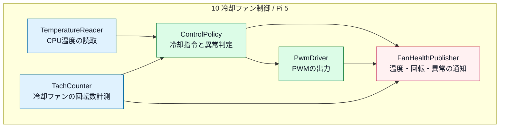
```mermaid
flowchart TB
 subgraph SW10["10 冷却ファン制御 / Pi 5"]
  T["TemperatureReader<br/>CPU温度の読取"]
  C["TachCounter<br/>冷却ファンの回転数計測"]
  P["ControlPolicy<br/>冷却指令と異常判定"]
  D["PwmDriver<br/>PWMの出力"]
  H["FanHealthPublisher<br/>温度・回転・異常の通知"]
  T --> P
  C --> P
  P --> D
  P --> H
  D --> H
  C --> H
 end
 classDef input fill:#e0f2fe,stroke:#0369a1,color:#111827
 classDef control fill:#dcfce7,stroke:#15803d,color:#111827
 classDef status fill:#fff1f2,stroke:#be123c,color:#111827
 class T,C input
 class P,D control
 class H status
```

| 接続 | 受け渡す情報 |
| --- | --- |
| TemperatureReader → ControlPolicy | CPU温度、観測時刻、取得成否。水温ではない |
| TachCounter → ControlPolicy | 冷却ファンのRPMと測定窓、パルス品質 |
| ControlPolicy → PwmDriver | ファンに対する有効デューティと指令世代 |
| PwmDriver → FanHealthPublisher | 設定成否。実波形・実回転確認とは区別 |
| ControlPolicy → FanHealthPublisher | 高温・取得異常・回転異常と負荷低減要求 |

<a id="dd-feature-flows"></a>

### 3.2 機能別処理フローチャート

各機能の開始条件、判断、正常・異常時の結果を示す。関数単位の入力と出力は3.7に記載する。

<a id="dd-feature-1"></a>

#### 3.2.1 制御条件と端子の確認（FAN-F01）

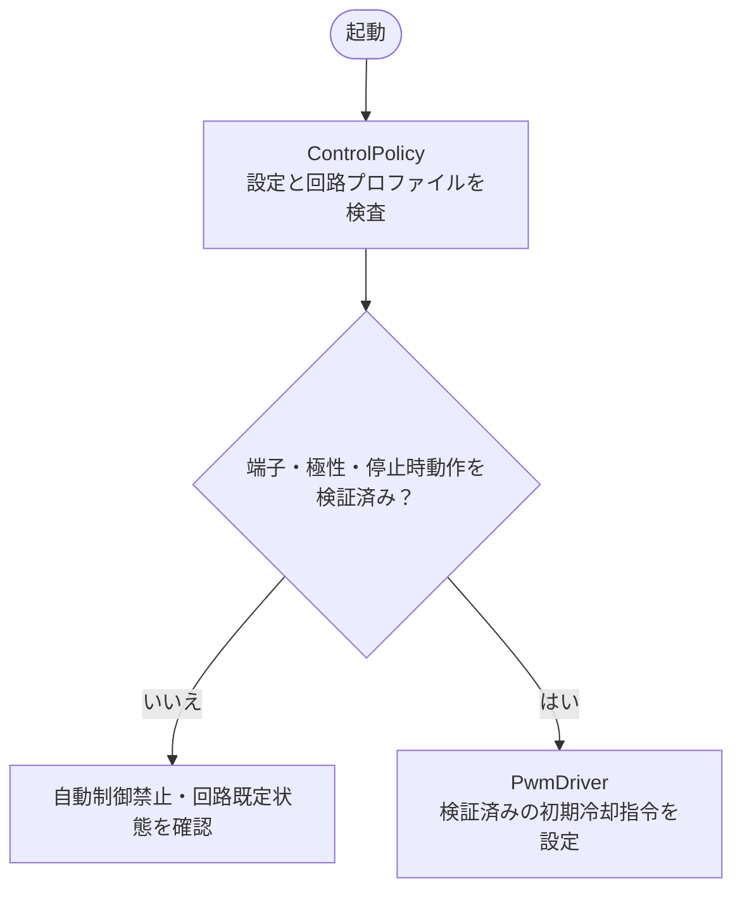
```mermaid
flowchart TB
 A(["起動"]) --> B["ControlPolicy<br/>設定と回路プロファイルを検査"]
 B --> C{"端子・極性・停止時動作を検証済み？"}
 C -->|"いいえ"| D["自動制御禁止・回路既定状態を確認"]
 C -->|"はい"| E["PwmDriver<br/>検証済みの初期冷却指令を設定"]
```

<a id="dd-feature-2"></a>

#### 3.2.2 CPU温度と回転数の取得（FAN-F02）

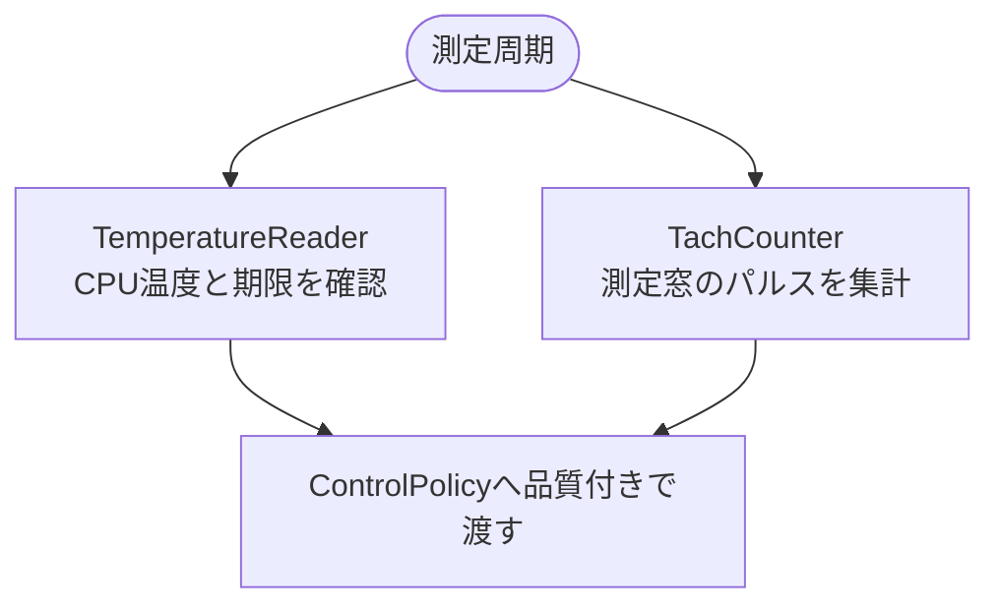
```mermaid
flowchart TB
 A(["測定周期"]) --> B["TemperatureReader<br/>CPU温度と期限を確認"]
 A --> C["TachCounter<br/>測定窓のパルスを集計"]
 B --> D["ControlPolicyへ品質付きで渡す"]
 C --> D
```

<a id="dd-feature-3"></a>

#### 3.2.3 温度に応じたPWM指令（FAN-F03）

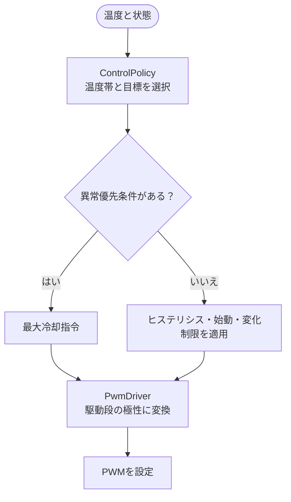
```mermaid
flowchart TB
 A(["温度と状態"]) --> B["ControlPolicy<br/>温度帯と目標を選択"]
 B --> C{"異常優先条件がある？"}
 C -->|"はい"| D["最大冷却指令"]
 C -->|"いいえ"| E["ヒステリシス・始動・変化制限を適用"]
 D --> F["PwmDriver<br/>駆動段の極性に変換"]
 E --> F
 F --> G["PWMを設定"]
```

<a id="dd-feature-4"></a>

#### 3.2.4 冷却ファンの回転監視と回転数制御（FAN-F04）

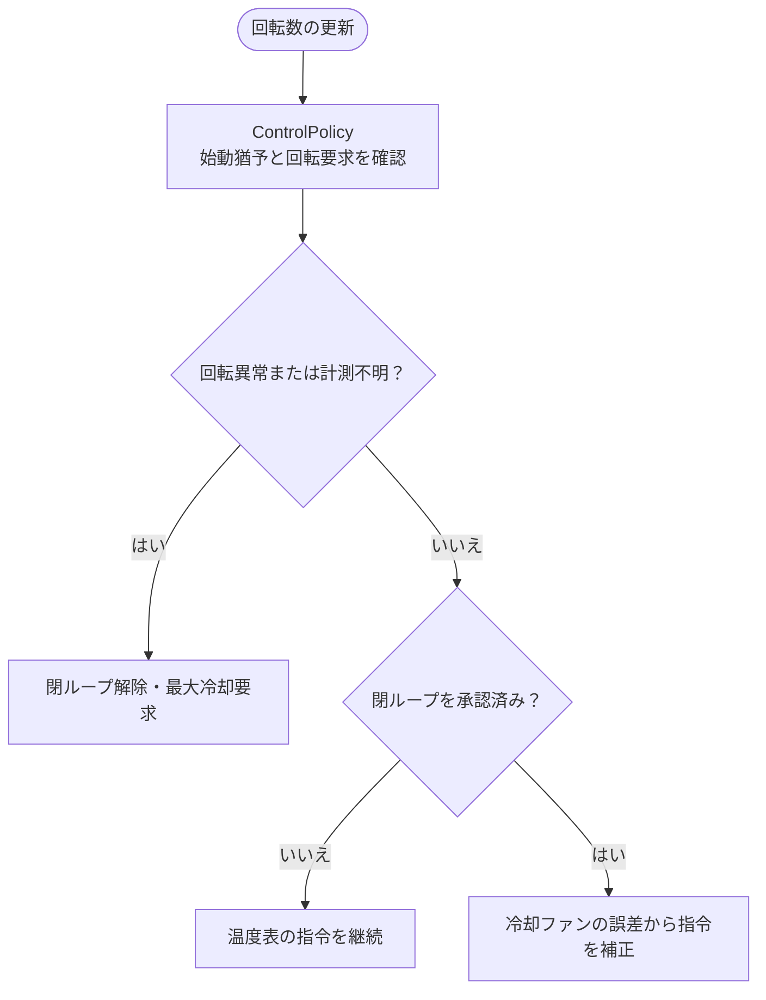
```mermaid
flowchart TB
 A(["回転数の更新"]) --> B["ControlPolicy<br/>始動猶予と回転要求を確認"]
 B --> C{"回転異常または計測不明？"}
 C -->|"はい"| D["閉ループ解除・最大冷却要求"]
 C -->|"いいえ"| E{"閉ループを承認済み？"}
 E -->|"いいえ"| F["温度表の指令を継続"]
 E -->|"はい"| G["冷却ファンの誤差から指令を補正"]
```

<a id="dd-feature-5"></a>

#### 3.2.5 異常時の冷却と警告（FAN-F05）

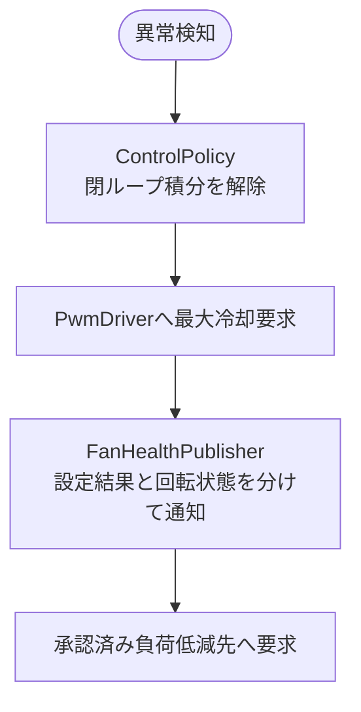
```mermaid
flowchart TB
 A(["異常検知"]) --> B["ControlPolicy<br/>閉ループ積分を解除"]
 B --> C["PwmDriverへ最大冷却要求"]
 C --> D["FanHealthPublisher<br/>設定結果と回転状態を分けて通知"]
 D --> E["承認済み負荷低減先へ要求"]
```

<a id="dd-feature-6"></a>

#### 3.2.6 停止と再開（FAN-F06）

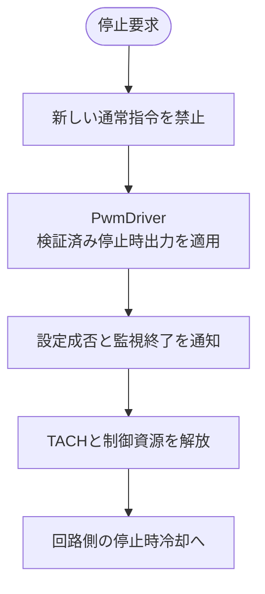
```mermaid
flowchart TB
 A(["停止要求"]) --> B["新しい通常指令を禁止"]
 B --> C["PwmDriver<br/>検証済み停止時出力を適用"]
 C --> D["設定成否と監視終了を通知"]
 D --> E["TACHと制御資源を解放"]
 E --> F["回路側の停止時冷却へ"]
```

<a id="dd-module-tree"></a>

### 3.3 モジュールツリー

```text
fan_control_service
+-- TemperatureReader
|   +-- read_temperature
+-- TachCounter
|   +-- record_edge / calculate_rpm
+-- ControlPolicy
|   +-- validate_profile / select_target
|   +-- check_rotation / adjust_feedback / enter_failsafe
+-- PwmDriver
|   +-- initialize_pwm / apply_duty / stop_fan_control
+-- FanHealthPublisher
    +-- publish_health
```

<a id="dd-sequence"></a>

### 3.4 モジュール間の処理順序

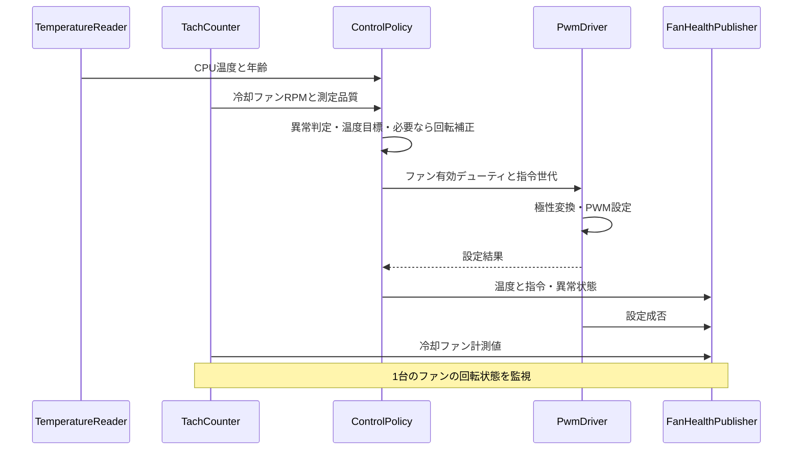
```mermaid
sequenceDiagram
 participant T as TemperatureReader
 participant C as TachCounter
 participant P as ControlPolicy
 participant D as PwmDriver
 participant H as FanHealthPublisher
 T->>P: CPU温度と年齢
 C->>P: 冷却ファンRPMと測定品質
 P->>P: 異常判定・温度目標・必要なら回転補正
 P->>D: ファン有効デューティと指令世代
 D->>D: 極性変換・PWM設定
 D-->>P: 設定結果
 P->>H: 温度と指令・異常状態
 D->>H: 設定成否
 C->>H: 冷却ファン計測値
 Note over C,H: 1台のファンの回転状態を監視
```

PWM設定成功は波形を測定した結果ではない。ソフトの要求値、OSへの設定値、冷却ファンの実測RPMをそれぞれ記録する。

<a id="dd-modules"></a>

### 3.5 モジュール詳細

温度・TACH・PWMを模擬できる境界を設ける。実GPIOを使わない単体試験で反転・異常優先・計算を確認してからベンチ試験へ進む。

<a id="dd-module-1"></a>

#### 3.5.1 TemperatureReader（CPU温度の取得）

| 項目 | 内容 |
| --- | --- |
| 入力 | OSのCPU温度情報 |
| 出力 | degC、測定時刻、品質 |
| 保持情報 | センサー識別、直近値と期限 |
| 処理 | thermal zoneの番号だけで決めずtype等と機器構成で確認。単位変換は入口で一度だけ行う |
| 関数 | read_temperature |
| 異常時 | 読取失敗・不正値・期限切れを通知し、前回低温値を有効のまま残さない |

<a id="dd-module-2"></a>

#### 3.5.2 TachCounter（冷却ファン回転数計測）

| 項目 | 内容 |
| --- | --- |
| 入力 | BCM20に対応する入力エッジと時刻 |
| 出力 | RPM、計測窓、パルス数、品質 |
| 保持情報 | PPR、片側エッジ、イベント連番、有限パルス履歴 |
| 処理 | エッジを数えて実際の計測秒数からRPMを計算。イベント欠落と真のパルス0を区別 |
| 関数 | record_edge、calculate_rpm |
| 異常時 | 溢れ・順序異常・入力切断はRPM不明。停止を推測しない |

<a id="dd-module-3"></a>

#### 3.5.3 ControlPolicy（冷却目標と異常判断）

| 項目 | 内容 |
| --- | --- |
| 入力 | 温度、RPM、前回指令、運用設定 |
| 出力 | 共通ファン指令、状態、警告 |
| 保持情報 | 温度帯、始動猶予、異常フラグ、積分値、指令世代 |
| 処理 | 異常優先、通常温度表、承認後の回転補正の順。復帰は正常継続を確認 |
| 関数 | validate_profile、select_target、check_rotation、adjust_feedback、enter_failsafe |
| 異常時 | 温度不明・高温・回転異常は検証済み最大冷却。出力方式不明では波形を推測しない |

<a id="dd-module-4"></a>

#### 3.5.4 PwmDriver（PWMの出力）

| 項目 | 内容 |
| --- | --- |
| 入力 | 有効デューティ、25kHz（21kHz-28kHz）、駆動段プロファイル |
| 出力 | 要求値とOS設定結果 |
| 保持情報 | PWM実デバイス・チャネル、極性、最後の適用世代 |
| 処理 | Linux PWM sysfsのPWMデバイスとチャンネルを確認して専有。lgpioはTACH入力だけに使用し、PWM波形には使用しない。外部駆動段の反転はこの層で吸収 |
| 関数 | initialize_pwm、apply_duty、stop_fan_control |
| 異常時 | 設定失敗はDRIVER_FAULT。読み戻しを物理波形の証明にしない |

<a id="dd-module-5"></a>

#### 3.5.5 FanHealthPublisher（状態・警告の通知）

| 項目 | 内容 |
| --- | --- |
| 入力 | 温度、RPM、指令、設定結果、異常 |
| 出力 | fan.statusと負荷低減要求 |
| 保持情報 | boot_id、sequence、最新状態と理由 |
| 処理 | 1台のファン計測を明示。最大要求中でも回転不明なら冷却正常と表示しない |
| 関数 | publish_health |
| 異常時 | 通知先停止でも制御を続け、無期限通知キューを作らない |

<a id="dd-files"></a>

### 3.6 ファイル構成

```text
src/raspberry_pi5/
+-- fan_control_service.py                 開始点
+-- telemetry_ipc.py                       状態通知ソケット
+-- fan_control/
|   +-- temperature.py / tach.py
|   +-- policy.py / pwm_driver.py
|   +-- publisher.py / models.py / config.py
+-- config/fan_control.example.toml
tests/fan_control/
+-- test_temperature.py / test_tach.py
+-- test_polarity.py / test_policy.py
+-- test_failsafe.py / test_shutdown.py
```

実装済みの配置。`--dry-run`ではGPIOとUnixソケットへ触れず、制御則と通知内容を確認できる。実データ、秘密鍵、認証情報はソースや公開Gitへ含めない。

<a id="dd-function-flows"></a>

### 3.7 関数のフローチャート

デューティはファン入力端子での有効比率を0～1で表す。GPIOのHIGH比率と混同せず、PwmDriverでのみ変換する。例外処理も冷却要求と実際の出力結果を分ける。

<a id="dd-fn-validate-profile"></a>

#### 3.7.1 validate_profile（制御条件を検査する）

| 項目 | 内容 |
| --- | --- |
| 担当 | ControlPolicy |
| 入力 | ファン・駆動回路・OS設定 |
| 戻り値・結果 | 承認プロファイルまたは拒否 |

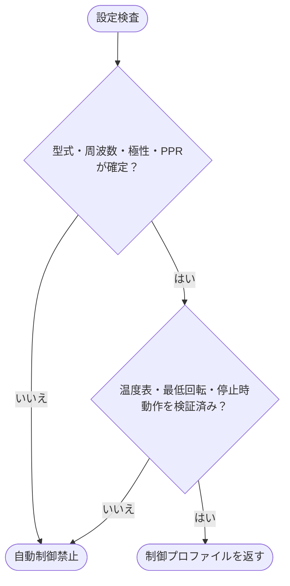
```mermaid
flowchart TB
 A(["設定検査"]) --> B{"型式・周波数・極性・PPRが確定？"}
 B -->|"いいえ"| X(["自動制御禁止"])
 B -->|"はい"| C{"温度表・最低回転・停止時動作を検証済み？"}
 C -->|"いいえ"| X
 C -->|"はい"| D(["制御プロファイルを返す"])
```

<a id="dd-fn-initialize-pwm"></a>

#### 3.7.2 initialize_pwm（PWM出力を準備する）

| 項目 | 内容 |
| --- | --- |
| 担当 | PwmDriver |
| 入力 | 検証済みプロファイル |
| 戻り値・結果 | 出力準備または失敗 |

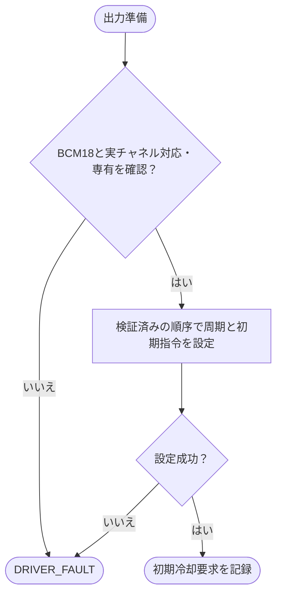
```mermaid
flowchart TB
 A(["出力準備"]) --> B{"BCM18と実チャネル対応・専有を確認？"}
 B -->|"いいえ"| X(["DRIVER_FAULT"])
 B -->|"はい"| C["検証済みの順序で周期と初期指令を設定"]
 C --> D{"設定成功？"}
 D -->|"いいえ"| X
 D -->|"はい"| E(["初期冷却要求を記録"])
```

<a id="dd-fn-read-temperature"></a>

#### 3.7.3 read_temperature（CPU温度を取得する）

| 項目 | 内容 |
| --- | --- |
| 担当 | TemperatureReader |
| 入力 | 承認済み温度入力 |
| 戻り値・結果 | 温度または不明 |

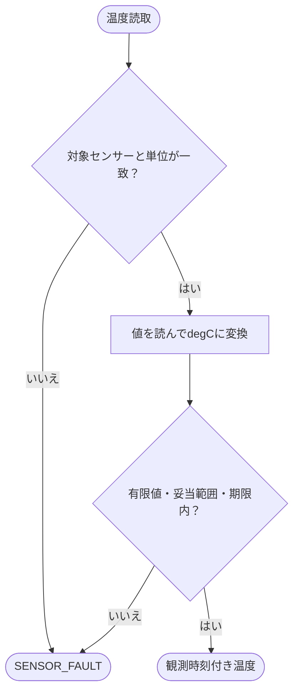
```mermaid
flowchart TB
 A(["温度読取"]) --> B{"対象センサーと単位が一致？"}
 B -->|"いいえ"| X(["SENSOR_FAULT"])
 B -->|"はい"| C["値を読んでdegCに変換"]
 C --> D{"有限値・妥当範囲・期限内？"}
 D -->|"いいえ"| X
 D -->|"はい"| E(["観測時刻付き温度"])
```

<a id="dd-fn-record-edge"></a>

#### 3.7.4 record_edge（TACHの片側エッジを記録する）

| 項目 | 内容 |
| --- | --- |
| 担当 | TachCounter |
| 入力 | GPIOイベントと時刻 |
| 戻り値・結果 | 受理または品質低下 |

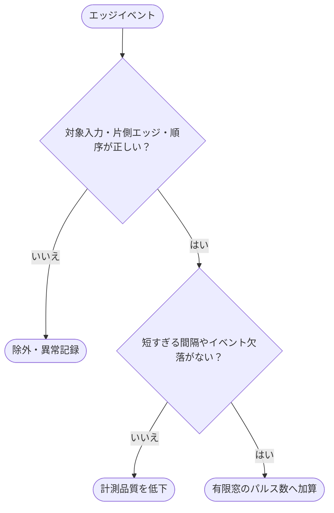
```mermaid
flowchart TB
 A(["エッジイベント"]) --> B{"対象入力・片側エッジ・順序が正しい？"}
 B -->|"いいえ"| X(["除外・異常記録"])
 B -->|"はい"| C{"短すぎる間隔やイベント欠落がない？"}
 C -->|"いいえ"| D(["計測品質を低下"])
 C -->|"はい"| E(["有限窓のパルス数へ加算"])
```

<a id="dd-fn-calculate-rpm"></a>

#### 3.7.5 calculate_rpm（冷却ファンのRPMを計算する）

| 項目 | 内容 |
| --- | --- |
| 担当 | TachCounter |
| 入力 | 計測窓・パルス数・PPR |
| 戻り値・結果 | RPMと品質 |

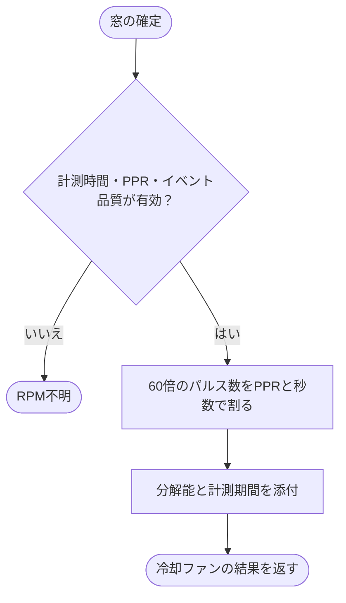
```mermaid
flowchart TB
 A(["窓の確定"]) --> B{"計測時間・PPR・イベント品質が有効？"}
 B -->|"いいえ"| X(["RPM不明"])
 B -->|"はい"| C["60倍のパルス数をPPRと秒数で割る"]
 C --> D["分解能と計測期間を添付"]
 D --> E(["冷却ファンの結果を返す"])
```

<a id="dd-fn-select-target"></a>

#### 3.7.6 select_target（温度に応じた目標を選ぶ）

| 項目 | 内容 |
| --- | --- |
| 担当 | ControlPolicy |
| 入力 | 温度・状態・前回帯域 |
| 戻り値・結果 | 目標デューティまたはRPM |

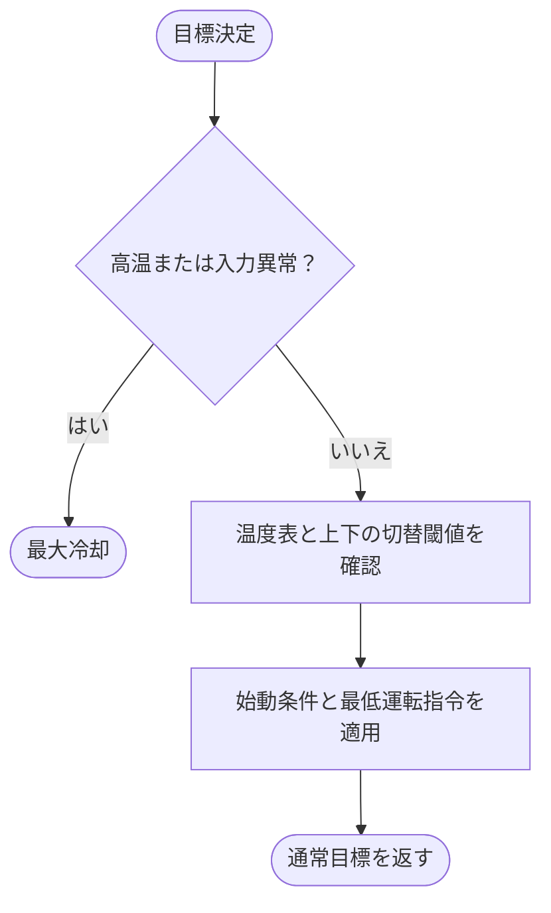
```mermaid
flowchart TB
 A(["目標決定"]) --> B{"高温または入力異常？"}
 B -->|"はい"| C(["最大冷却"])
 B -->|"いいえ"| D["温度表と上下の切替閾値を確認"]
 D --> E["始動条件と最低運転指令を適用"]
 E --> F(["通常目標を返す"])
```

<a id="dd-fn-check-rotation"></a>

#### 3.7.7 check_rotation（回転異常を判定する）

| 項目 | 内容 |
| --- | --- |
| 担当 | ControlPolicy |
| 入力 | RPM・回転要求・始動猶予 |
| 戻り値・結果 | 正常・猶予・異常 |

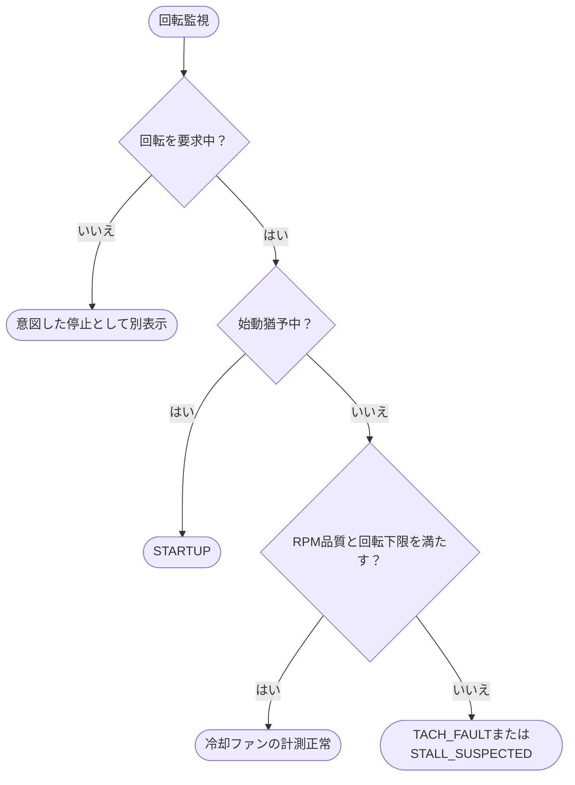
```mermaid
flowchart TB
 A(["回転監視"]) --> B{"回転を要求中？"}
 B -->|"いいえ"| C(["意図した停止として別表示"])
 B -->|"はい"| D{"始動猶予中？"}
 D -->|"はい"| E(["STARTUP"])
 D -->|"いいえ"| F{"RPM品質と回転下限を満たす？"}
 F -->|"はい"| G(["冷却ファンの計測正常"])
 F -->|"いいえ"| H(["TACH_FAULTまたはSTALL_SUSPECTED"])
```

<a id="dd-fn-adjust-feedback"></a>

#### 3.7.8 adjust_feedback（冷却ファンの回転誤差を補正する）

| 項目 | 内容 |
| --- | --- |
| 担当 | ControlPolicy |
| 入力 | 目標RPM・実測RPM・dt |
| 戻り値・結果 | 制限済み共通指令 |

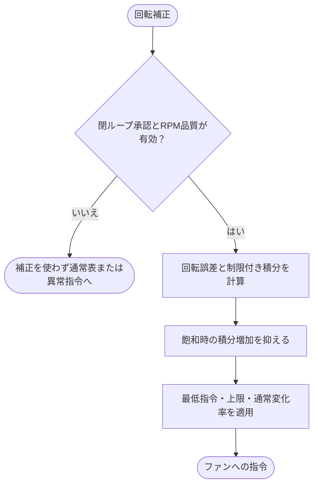
```mermaid
flowchart TB
 A(["回転補正"]) --> B{"閉ループ承認とRPM品質が有効？"}
 B -->|"いいえ"| C(["補正を使わず通常表または異常指令へ"])
 B -->|"はい"| D["回転誤差と制限付き積分を計算"]
 D --> E["飽和時の積分増加を抑える"]
 E --> F["最低指令・上限・通常変化率を適用"]
 F --> G(["ファンへの指令"])
```

<a id="dd-fn-apply-duty"></a>

#### 3.7.9 apply_duty（指令を実出力へ変換する）

| 項目 | 内容 |
| --- | --- |
| 担当 | PwmDriver |
| 入力 | 有効デューティと指令世代 |
| 戻り値・結果 | 設定結果 |

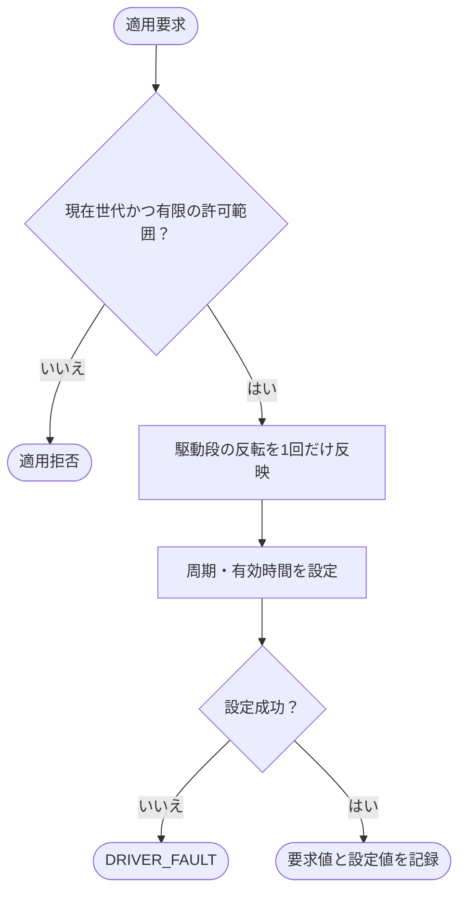
```mermaid
flowchart TB
 A(["適用要求"]) --> B{"現在世代かつ有限の許可範囲？"}
 B -->|"いいえ"| X(["適用拒否"])
 B -->|"はい"| C["駆動段の反転を1回だけ反映"]
 C --> D["周期・有効時間を設定"]
 D --> E{"設定成功？"}
 E -->|"いいえ"| F(["DRIVER_FAULT"])
 E -->|"はい"| G(["要求値と設定値を記録"])
```

<a id="dd-fn-enter-failsafe"></a>

#### 3.7.10 enter_failsafe（冷却優先へ切り替える）

| 項目 | 内容 |
| --- | --- |
| 担当 | ControlPolicy |
| 入力 | 異常理由 |
| 戻り値・結果 | 最大要求と警告 |

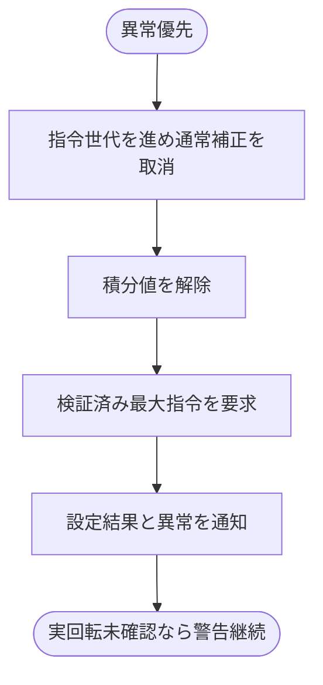
```mermaid
flowchart TB
 A(["異常優先"]) --> B["指令世代を進め通常補正を取消"]
 B --> C["積分値を解除"]
 C --> D["検証済み最大指令を要求"]
 D --> E["設定結果と異常を通知"]
 E --> F(["実回転未確認なら警告継続"])
```

<a id="dd-fn-publish-health"></a>

#### 3.7.11 publish_health（冷却状態を通知する）

| 項目 | 内容 |
| --- | --- |
| 担当 | FanHealthPublisher |
| 入力 | 温度・回転・指令・異常 |
| 戻り値・結果 | fan.status |

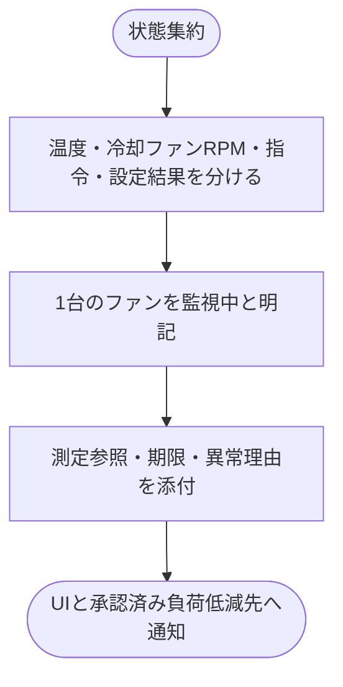
```mermaid
flowchart TB
 A(["状態集約"]) --> B["温度・冷却ファンRPM・指令・設定結果を分ける"]
 B --> C["1台のファンを監視中と明記"]
 C --> D["測定参照・期限・異常理由を添付"]
 D --> E(["UIと承認済み負荷低減先へ通知"])
```

<a id="dd-fn-stop-fan-control"></a>

#### 3.7.12 stop_fan_control（停止時の端子状態を適用する）

| 項目 | 内容 |
| --- | --- |
| 担当 | PwmDriver |
| 入力 | 停止プロファイルと期限 |
| 戻り値・結果 | 終了結果 |

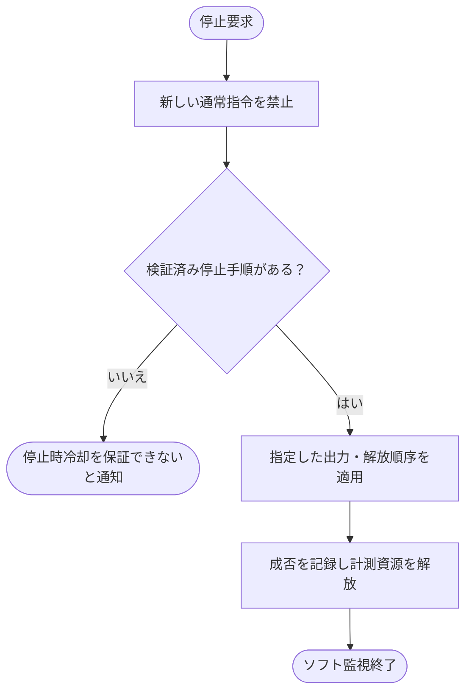
```mermaid
flowchart TB
 A(["停止要求"]) --> B["新しい通常指令を禁止"]
 B --> C{"検証済み停止手順がある？"}
 C -->|"いいえ"| D(["停止時冷却を保証できないと通知"])
 C -->|"はい"| E["指定した出力・解放順序を適用"]
 E --> F["成否を記録し計測資源を解放"]
 F --> G(["ソフト監視終了"])
```

<a id="dd-4"></a>

## 4. インターフェース設計


<a id="dd-interface-diagrams"></a>

### 4.1 接続と端子

```mermaid
flowchart TB
 T["OSのCPU温度情報"]
 subgraph SW10["10 冷却ファン制御"]
  R["TemperatureReader"]
  C["TachCounter"]
  P["ControlPolicy"]
  D["PwmDriver"]
  H["FanHealthPublisher"]
  R --> P
  C --> P
  P --> D
  P --> H
 end
 G["PWM駆動回路<br/>BCM18 / 物理12"]
 F1["12V冷却ファン"]
 I["TACH入力保護<br/>BCM20 / 物理38"]
 U["01 カーナビUI<br/>ServiceBridge"]
 T --> R
 D --> G
 G --> F1
 F1 --> I
 I --> C
 H --> U
```

| 端子・配線 | 用途 |
| --- | --- |
| Pi 5 BCM18 / 物理ピン12 | 駆動回路経由で冷却ファンPWMへ |
| Pi 5 BCM20 / 物理ピン38 | 3.3V適合入力回路経由で冷却ファンTACHを取得 |
| 冷却ファンの12VとGND | 12V供給可能な拡張ボードまたは12V分岐へ。GPIO給電ではない |
[ハードウェア設計の冷却章](../../HW設計/ハードウェア設計書.md#sec-444)とGPIO対応表に従う。ハードウェア概要の旧5Vファン記述は本書の接続仕様には採用しない。駆動回路の極性、プルアップ、Pi 5無給電時の逆流を実装前に確認する。

ソフトはGPIO端子へ12Vが入ることを防げない。端子適合と保護は回路側の条件であり、ソフト試験の成功で代用しない。

<a id="dd-os-api"></a>

### 4.2 OS入力・PWM実装

TemperatureReaderはLinuxのthermal zone等からCPU温度を読み、typeと採用機器で対象を確認する。ゾーン番号を固定するだけの実装は避け、採用ABIの単位を確認してdegCへ変換する。[Linux thermalインターフェース](https://www.kernel.org/doc/html/latest/driver-api/thermal/sysfs-api.html)

PwmDriverはLinux PWM sysfsの`pwmchip`と`pwmN`を使用する。25kHzの周期は40,000ns、デューティは0-40,000nsへ変換する。`lgpio.tx_pwm`はソフトウェアPWMのため4ピンPWMファンの25kHz出力経路には使用しない。PWMチップとチャンネルはPi 5の実機で確認し、設定した周波数・デューティはオシロスコープまたは周波数計で測定する。OSの設定値読戻しだけでは物理波形を保証できない。[Linux PWMインターフェース](https://www.kernel.org/doc/html/latest/driver-api/pwm.html)

TachCounterはlgpioのGPIOエッジイベントを使用する。採用API・GPIOチップ・ライン番号・イベント時計は実機で確認する。BCM20がそのままgpiochipのoffsetになるとは決めつけない。PWM GPIOをlgpioの別PWMや他ソフトが同時に駆動しない。

<a id="dd-contract"></a>

### 4.3 状態通知と負荷低減要求

| 項目 | 内容 |
| --- | --- |
| cpu_temperature / temperature_validity | degC、測定年齢、期限、センサー識別 |
| fan_rpm / tach_validity | 冷却ファンの回転数、計測窓、PPR、パルス数、イベント欠落 |
| requested_duty / applied_duty | ファンに対する要求値とOSへ適用した値。実波形ではない |
| pwm_frequency_hz / pwm_backend | 出力周波数と出力経路。既定は25,000Hz / kernel |
| driver_state / control_state / faults | 設定成否、制御モード、複数の異常理由 |
| fan.status | source・boot_id・sequence・各測定の参照・期限を保持した通知 |
| thermal_limit_request | 要求ID、理由、希望する低負荷段階、期限。承認済み相手だけに送る |

1台構成への変更に伴い、状態通知には`fan_rpm`と`pwm_duty`を使用する。旧仕様の`fan1_rpm`、`common_pwm_duty`、`fan2_rpm`、`fan2_tach`は送信しない。

負荷低減候補は07 Google Driveアップロード・削除の休止、08 サラウンドビューの合成休止、06 カメラ表示・録画の承認済みプロファイルへの変更とする。相手の受理・完了を確認し、応答なしを実行済みにしない。具体的なコマンドは各ソフトと合意後に有効化する。

本ソフトから強制的にプロセスを終了したり、電源遮断したりしない。OSの温度保護機能は無効化しない。UIの音楽・画面操作より冷却判断を優先するが、利用者の直接GPIO操作口は設けない。

<a id="dd-5"></a>

## 5. データ・設定設計


<a id="dd-data"></a>

### 5.1 温度・回転数・指令の保持

| データ | 内容と寿命 |
| --- | --- |
| TemperatureSample | センサーID、値、観測時刻、期限。前回正常値と現在の取得成否を分離 |
| TachWindow | 窓開始終了、片側パルス数、イベント品質。有限窓で保持 |
| ControlState | 温度帯、目標、始動期限、異常フラグ、積分値、指令世代 |
| PwmState | 実デバイス参照、周波数、極性、要求値、設定結果 |
| HealthState | 最新状態通知と有限の異常履歴 |
| HardwareProfile | 承認済み型式・配線・反転・PPR・始動・停止条件 |
再起動で積分値や古いRPMを復元しない。設定と検証済みプロファイルは保存するが、現在状態は新たに計測する。制御周期の遅れはdtとして記録し、長い停止後に積分値を一気に増やさない。

<a id="dd-rpm"></a>

### 5.2 回転数の計算と品質

```text
rpm = 60 * pulse_count / (pulses_per_revolution * window_seconds)
rpm_step = 60 / (pulses_per_revolution * window_seconds)
```
数えるのは立上りまたは立下りのどちらか一方。両エッジを数えるならPPRとの関係が変わるため、片側を初期方式とする。PPRは型式で確認し、一般例の2を無断で固定しない。

パルス0は、有効な計測窓と入力回路が成立した場合に限り0 rpmとして計算できる。入力断線や計測処理停止ではRPM不明となる。また回転要求中のパルス0だけでは機械停止とTACH断線を確定できないので、STALL_SUSPECTEDまたはTACH_FAULTとして扱う。

最短エッジ間隔・ノイズ除去条件は最大回転数とPPRに合わせる。強すぎる除去で正しいパルスを落とさない。イベント取りこぼし・バッファ溢れを検出した窓では、少ないパルス数を実回転数として使用しない。

<a id="dd-control-law"></a>

### 5.3 PWM変換と段階的な回転制御

```text
fan_duty = clamp(command, validated_min, 1.0)

gpio_high_ratio =
    fan_duty                 # 非反転駆動
    1.0 - fan_duty           # 反転駆動

period_ns = 1_000_000_000 / pwm_frequency_hz
```
上記は外部駆動段の論理例であり、Linux側polarity設定との二重反転を避ける。実際の有効時間計算は採用APIの定義に合わせ、0%・中間・100%を波形と回転で確認する。停止可能なファンでも、0%で必ず停止するとは仮定しない。

段階1は温度対デューティ表とファン回転監視。段階2は温度対目標RPMとフィードフォワード指令にPI補正を加える候補とし、実機調整後だけ有効化する。

閉ループではP項・積分量・変化率を制限する。上限・下限でさらに飽和方向へ積分しない。始動中、TACH不良、指令変更、設定変更、長い周期欠落では積分を解除する。異常時の最大冷却要求は通常の上昇速度制限を迂回し、復帰後の急な低下は抑える。

<a id="dd-config"></a>

### 5.4 設定一覧

| 設定 | 決定条件 |
| --- | --- |
| hardware_profile / pwm_binding / tach_binding | Pi 5実機・端子・回路の検証済み対応 |
| pwm_frequency_hz / pwm_backend / pwm_chip_path / pwm_channel | 4ピンPWM標準の25kHz（21kHz-28kHz）と、Pi 5実機のLinux PWMデバイス・チャンネル・波形確認。既定backendはkernel |
| tach_ppr / edge_type / noise_limit | ファン仕様とパルス計測。T.B.D |
| control_period / sample_ttl / tach_window | 測定分解能と異常検出時間の両方を満たす |
| temperature_curve / hysteresis | 筐体・周囲温度・負荷で実測し、上昇と下降の閾値を分ける |
| startup_duty / startup_grace / min_running_duty | 確実に始動し回り続ける値。停止可能範囲と区別 |
| warning_temperature / critical_temperature | 実機・メーカー仕様・OS保護と整合させる。T.B.D |
| feedback_enabled / kp / ki / integral_limit | 初期feedback_enabled=false。調整・試験後に有効化 |
| shutdown_profile / hardware_default | 正常終了・強制終了・OS停止・Pi無給電時の実動作を確認 |
未確認設定で通常運用しない。設定不正でサービスを止める場合も冷却停止を放置してよい意味ではなく、先に回路既定の冷却手段を確保する。

<a id="dd-6"></a>

## 6. 処理・状態遷移


<a id="dd-states"></a>

### 6.1 制御状態と異常の優先順位

```mermaid
stateDiagram-v2
 [*] --> CONFIG_CHECK
 CONFIG_CHECK --> STARTUP: 検証済み設定
 CONFIG_CHECK --> CONFIG_FAULT: 未確認・不正
 STARTUP --> NORMAL: 始動と入力確認
 STARTUP --> FAILSAFE: 入力・回転異常
 NORMAL --> FAILSAFE: 高温・取得異常
 FAILSAFE --> STARTUP: 正常継続と復帰条件成立
 NORMAL --> STOPPING: 終了
 FAILSAFE --> STOPPING: 終了
 CONFIG_FAULT --> STOPPING: 終了
 STOPPING --> [*]
```
FAILSAFEにTHERMAL_ALERT、SENSOR_FAULT、TACH_FAULT、DRIVER_FAULT等の複数理由を保持する。最も深刻な1件だけ表示して他の故障を消さない。CONFIG_FAULTでは駆動方式が不明なので、推測で100%波形を出さない。

優先順は駆動不能の通知、異常時最大冷却、始動、通常温度制御、承認済み回転補正とする。始動猶予はTACH判定のためであり、高温・温度取得異常を無視する猶予ではない。

<a id="dd-runtime"></a>

### 6.2 復帰・出力競合の扱い

異常解消は新しい正常測定が所定時間継続したことを確認する。古い正常値の再通知で復帰しない。閉ループへ戻る際は積分を初期化し、現在指令から滑らかに移行する。

異常通知で指令世代を進め、遅れて届いた通常デューティの設定要求をPwmDriverで拒否する。既に実行中のOS操作は取消可能とは限らないので、終了直後にも世代を照合して最大冷却要求を再適用する。

制御プロセスが固まった場合、ソフト内タイマーも動けない。監視再起動だけで冷却を保証せず、波形停止・固定レベル・GPIO解放・Pi無給電時の回路動作を別に評価する。

<a id="dd-7"></a>

## 7. 異常処理

| 異常 | 出力と通知 |
| --- | --- |
| 温度取得失敗・期限切れ | 検証済み最大冷却を要求しSENSOR_FAULT |
| 高温・温度上昇継続 | 最大冷却、THERMAL_ALERT、承認済み負荷低減要求 |
| ファン低回転・パルスなし | 始動猶予後に異常。閉ループ停止・最大冷却要求 |
| TACH入力品質不良 | RPM不明。0 rpmや正常へ変換しない |
| ファン停止 | TACH異常または低回転として検出し、最大冷却要求と警告を出す |
| PWM書込失敗・所有競合 | DRIVER_FAULT。最大要求成功と表示しない |
| 周期遅延・OS休止復帰 | 古い入力と積分を破棄して初期冷却から再確認 |
| 状態通知先停止 | 制御は継続。最新状態だけ保持 |

<a id="dd-8"></a>

## 8. 起動・終了・運用設計

起動前に12V供給と駆動回路の既定状態を検証する。サービスはUIから独立して起動し、温度と回転を監視する。OS・カーネルが持つ別のファン制御と同じPWMチャネルを二重に使用しない。

正常終了では検証済み停止プロファイルを適用し、最後の要求と設定結果を記録する。PWMをdisableすればファンが最大回転になる、またはenableを保持すればプロセス終了後も継続する、と一律には決めない。

ファンの12Vが常時給電ならOS停止後も回り続けてバッテリーを消費する可能性がある。停止後の必要冷却時間と待機消費はハードウェア電源設計と合わせて決める。ソフト無動作時に止める必要があるなら、ソフトだけに依存しない電源・制御機構を検討する。

<a id="dd-9"></a>

## 9. 試験・受入条件


<a id="dd-tests"></a>

### 9.1 模擬入力・制御試験

| 試験 | 受入条件 |
| --- | --- |
| FAN-T01 / FAN-F01：未設定・誤極性・競合端子 | 推測PWMを出さず自動制御禁止 |
| FAN-T02 / FAN-F02：温度異常・期限切れ・単位違い | 低温扱いせず冷却優先 |
| FAN-T03 / FAN-F02：既知PPR・窓・エッジ・欠落 | RPM計算と分解能が一致。欠落時は品質不明 |
| FAN-T04 / FAN-F03：境界温度を反復 | 不要な頻繁切替を抑え、異常上昇には即最大要求 |
| FAN-T05 / FAN-F04：始動・停止要求・TACH0・断線 | 意図した停止と回転異常を区別。断線を機械停止と断定しない |
| FAN-T06 / FAN-F04：飽和・過大dt・TACH不良 | 積分暴走なし。通常補正を無効化 |
| FAN-T07 / FAN-F05：最大指令設定失敗 | 冷却正常と通知せずDRIVER_FAULT |
| FAN-T08 / FAN-F06：旧指令・設定変更・再開 | 旧世代を適用せず、過去積分・RPMを復活させない |

<a id="dd-integration-tests"></a>

### 9.2 実回路と冷却性能の受入

| 確認 | 受入条件 |
| --- | --- |
| 0%・中間・100%波形 | 周波数、GPIO側極性、ファン端子の有効比率が設計どおり |
| 1台PWM | 負荷を含む立上り・立下りと入力電圧が適合 |
| ファン監視 | 外部の回転測定とTACH換算を比較し、異常を期限内検知 |
| 最大負荷・周囲温度 | ナビと4カメラ録画等の併用でCPU温度・冷却余裕・騒音を評価 |
| プロセス強制終了・OS停止・Pi無給電 | 実際のファン動作と逆流・待機消費を確認 |
| 負荷低減連携 | 相手の受理と実際の処理休止を照合 |

回転異常の模擬は試験用信号や安全な切断方法で行い、通電中の羽根を手で止めない。温度目標と検出時間は実機条件で確定する。本書作成時点で実装・実回路試験は未実施。

<a id="dd-10"></a>

## 10. 未確定事項・実装課題

| 課題 | 確定内容 |
| --- | --- |
| ファン・駆動回路 | 型式、25kHz対応、PPR、反転、最小/始動指令 |
| Pi 5対応PWMとTACH | Linux PWMのpwmchip・チャンネル、OSのバージョン、lgpioのTACH入力、ピン競合 |
| 温度表・回転補正 | 温度帯、警告、ヒステリシス、PI係数と上限 |
| 停止・故障時 | 回路既定状態、常時12Vの消費、プロセス無動作時の冷却 |
| 文書整合 | ハードウェア概要の旧5V表記と12V冷却章の統一は別途必要 |
| 負荷低減 | 各ソフトが受理できる要求と完了確認 |

<a id="dd-glossary"></a>

## 用語の注釈

| 用語 | 意味 |
| --- | --- |
| PWM | 一定周期でON/OFFし、有効な時間の比率で指令する信号 |
| TACH / PPR | 回転に応じたパルス出力と1回転あたりのパルス数 |
| ヒステリシス | 温度上昇時と下降時で切替条件を変え、頻繁な切替を防ぐこと |
| 閉ループ制御 | 実測RPMと目標RPMの差を使って指令を調整する方法 |
| 積分の制限 | 指令が上限等に張り付いた時に補正量が増え続けるのを防ぐ処理 |
| フェイルセーフ | 異常時に冷却を優先する設計。ソフトだけでは保証できない範囲がある |
