# LIVI連携 詳細設計書

| 項目 | 内容 |
| --- | --- |
| 文書ID | SW-DD-11 |
| 実行環境 | Pi 5 |
| 実装状態 | ネイティブプロセス起動・Sway配置・JSON Lines IPCを実装済み。実機確認は未完了 |
| 対象ソース | `src/raspberry_pi5/livi_integration_service.py` / `src/raspberry_pi5/livi/` |
| 作成日 | 2026-09-14 |
| 更新日 | 2026-09-17 |

[詳細設計一覧](README.md) / [共通仕様](00_共通仕様.md) / [上位設計](../ソフトウェア設計図.md#sec-411)

## 目次

- [1. 目的・適用範囲](#dd-1)
- [2. 要求仕様・役割](#dd-2)
  - [2.1 機能一覧](#dd-functions)
  - [2.2 機能・モジュール・関数の対応](#dd-function-map)
- [3. 内部構成](#dd-3)
  - [3.1 モジュールの全体構成](#dd-overview)
  - [3.2 機能別処理フローチャート](#dd-feature-flows)
    - [3.2.1 LIVI起動と接続待機（LIV-01）](#dd-feature-1)
    - [3.2.2 スマートフォン接続状態の更新（LIV-02）](#dd-feature-2)
    - [3.2.3 優先画面を守る表示切替（LIV-03）](#dd-feature-3)
    - [3.2.4 音声利用の連携（LIV-04）](#dd-feature-4)
    - [3.2.5 切断・異常からの復旧（LIV-05）](#dd-feature-5)
    - [3.2.6 管理対象だけの終了（LIV-06）](#dd-feature-6)
  - [3.3 モジュールツリー](#dd-module-tree)
  - [3.4 モジュール間の処理順序](#dd-sequence)
  - [3.5 モジュール詳細](#dd-modules)
    - [3.5.1 LiviIntegration（要求と全体状態の管理）](#dd-module-1)
    - [3.5.2 NativeProcessAdapter（プロセスの起動と終了監視）](#dd-module-2)
    - [3.5.3 LiviWindowAdapter（Sway配置）](#dd-module-3)
    - [3.5.4 接続状態の扱い](#dd-module-4)
  - [3.6 ファイル構成](#dd-files)
  - [3.7 関数のフローチャート](#dd-function-flows)
    - [3.7.1 handle_request（要求を受け付ける）](#dd-fn-handle-request)
    - [3.7.2 start（LIVIを起動する）](#dd-fn-start)
    - [3.7.3 show（固定領域へ表示する）](#dd-fn-show)
    - [3.7.4 stop（LIVIを停止する）](#dd-fn-stop)
- [4. インターフェース設計](#dd-4)
  - [4.1 ソフト間の接続](#dd-interfaces)
  - [4.2 要求と応答](#dd-commands)
  - [4.3 外部機能の確認表](#dd-capabilities)
- [5. データ・設定設計](#dd-5)
  - [5.1 状態データ](#dd-data)
  - [5.2 設定・保存範囲](#dd-config)
- [6. 処理・状態遷移](#dd-6)
- [7. 異常処理](#dd-7)
- [8. 起動・終了・運用設計](#dd-8)
- [9. 試験・受入条件](#dd-9)
  - [9.1 単体・結合試験](#dd-tests)
- [10. 未確定事項・実装課題](#dd-10)
- [用語の注釈](#dd-glossary)

<a id="dd-1"></a>

## 1. 目的・適用範囲

外部ソフトLIVIをAndroid Auto用に起動し、スマートフォンとの接続状態、表示可否、音声利用をカーナビへ伝える。Android Autoの通信方式・映像復号・通話処理そのものはLIVIに任せ、自作しない。

対象はRaspberry Pi 5上の連携ソフト。スマートフォン未接続でも[01 カーナビUI](01_カーナビUI.md)、[02 Waydroidナビ管理](02_Waydroidナビ管理.md)、[06 カメラ表示・録画](06_カメラ表示録画.md)は独立して利用する。画面の最終選択は01 カーナビUI、音声の優先調整は[12 オーディオ連携](12_オーディオ連携.md)が担当する。

LIVI公式ではAndroid Auto対応が案内されているが、本機で採用するバージョン・接続機器・外部制御方法は未確定とする。以下の関数やメッセージは本プロジェクトの設計案であり、LIVIの公開API名ではない。[LIVI公式リポジトリ](https://github.com/f-io/LIVI)

<a id="dd-2"></a>

## 2. 要求仕様・役割

機能は実現する動作、モジュールは処理の分担、関数はモジュール内の処理単位を表す。LIVI本体の起動・表示制御は実装済みだが、スマートフォン接続状態や音声利用イベントをLIVI本体から取得する外部APIは未確認のため、推測実装しない。

<a id="dd-functions"></a>

### 2.1 機能一覧

| 機能ID | 機能 | 実現する動作 |
| --- | --- | --- |
| LIV-01 | LIVI起動と接続待機 | **開始条件・入力：** UIのstart要求、検証済み実行設定。スマートフォンは未接続でもよい。<br/>**確認・処理：** 操作の期限と重複を検証する。表示セッション、採用バージョン、機能一覧を確認し、許可された実行パスと固定引数だけで起動する。既に管理中なら二重起動しない。<br/>**処理結果：** プロセス起動結果とWAIT_PHONEまたは接続確認不能の状態を返す。電話なしを起動失敗とはしない。 |
| LIV-02 | スマートフォン接続状態の更新 | **開始条件・入力：** LIVIの接続・切断・状態照会結果。<br/>**確認・処理：** 現在のプロセス起動に属する通知だけを採用する。接続相手またはセッションが変われば接続世代を更新する。通知欠落や取得機能不足は未接続と断定しない。<br/>**処理結果：** CONNECTED / DISCONNECTED / UNKNOWNと確認時刻をUIへ通知する。画面準備完了は別フィールドで通知する。 |
| LIV-03 | 優先画面を守る表示切替 | **開始条件・入力：** UIからのshow / hide要求、画面選択世代、接続・表示準備状態。<br/>**確認・処理：** showには01 カーナビUIの承認を要求する。後方カメラ等が優先されればLIVIを前面化しない。外部操作の完了時にも最新世代を照合し、遅れた表示完了で画面を戻さない。<br/>**処理結果：** 表示済み・保留・表示不可を区別する。hideでLIVIプロセスを終了しない。 |
| LIV-04 | 音声利用の連携 | **開始条件・入力：** LIVIの確認済み音声開始・更新・終了イベント。<br/>**確認・処理：** 通話・案内など取得可能な種別を内部契約へ変換する。起動・接続・音声セッションIDで識別し、同じ開始の二重受信や古い終了を除外する。優先度は12 オーディオ連携へ委ねる。<br/>**処理結果：** 音声利用の受付結果と連携可否。イベントが取得できない場合は自動音量調整不可を通知する。 |
| LIV-05 | 切断・異常からの復旧 | **開始条件・入力：** 電話切断、LIVI終了、状態確認の期限切れ。<br/>**確認・処理：** 当該接続の表示承認と音声利用だけを無効化する。プロセス異常は回数制限付きで再起動するが、電話未接続だけで再起動を繰り返さない。<br/>**処理結果：** UIへ代替画面の選択を依頼する。復旧時は最新状態から再開し、古いshow・playを再実行しない。 |
| LIV-06 | 管理対象だけの終了 | **開始条件・入力：** UIまたはサービス管理からのstop要求。<br/>**確認・処理：** 新規操作と再起動予約を止め、表示と音声利用を解除する。自分が起動したプロセスを期限付きで停止し終了を確認する。<br/>**処理結果：** 終了確認済みの場合だけSTOPPEDを返す。停止失敗時はPID等の管理情報を保持して異常を通知する。 |

<a id="dd-function-map"></a>

### 2.2 機能・モジュール・関数の対応

| 機能ID | 担当モジュール | 主な関数 |
| --- | --- | --- |
| LIV-01 | LiviIntegration / NativeProcessAdapter | handle_request / start |
| LIV-02 | LiviIntegration | status / _publish（電話接続はUNKNOWN） |
| LIV-03 | LiviIntegration / LiviWindowAdapter | show / hide / focus |
| LIV-04 | 未実装 | LIVI本体の音声イベント取得方法を確認後に追加 |
| LIV-05 | NativeProcessAdapter / LiviWindowAdapter | start失敗・表示失敗の明示通知 |
| LIV-06 | LiviIntegration / NativeProcessAdapter | stop / close |

<a id="dd-3"></a>

## 3. 内部構成

LiviIntegrationがJSON Lines要求を一列に処理する。NativeProcessAdapterがLIVI本体の起動・停止を所有し、LiviWindowAdapterがPIDを優先してSwayの固定領域へ配置する。電話接続と音声はLIVIの実際の外部APIを確認できるまでUNKNOWN・未連携として扱い、プロセス起動だけで接続済みとは判定しない。

<a id="dd-overview"></a>

### 3.1 モジュールの全体構成

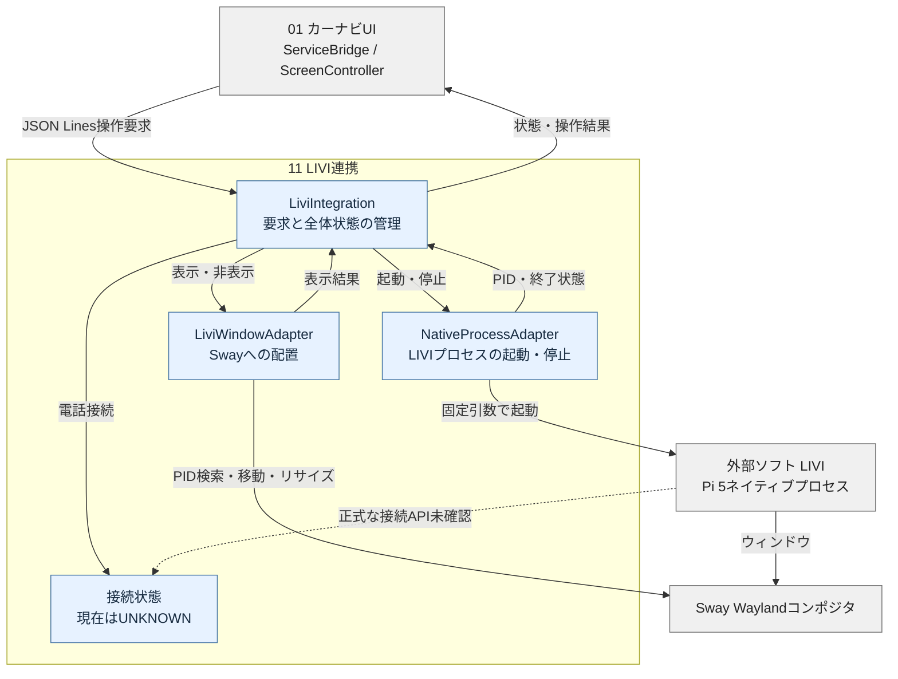
```mermaid
flowchart TB
 UI["01 カーナビUI<br/>ServiceBridge / ScreenController"]
 subgraph SW["11 LIVI連携"]
 direction TB
 S["LiviIntegration<br/>要求と全体状態の管理"]
 P["NativeProcessAdapter<br/>LIVIプロセスの起動・停止"]
 D["LiviWindowAdapter<br/>Swayへの配置"]
 C["接続状態<br/>現在はUNKNOWN"]
 S -->|起動・停止| P
 S -->|表示・非表示| D
 P -->|PID・終了状態| S
 D -->|表示結果| S
 S -->|電話接続| C
 end
 L["外部ソフト LIVI<br/>Pi 5ネイティブプロセス"]
 W["Sway Waylandコンポジタ"]
 UI -->|JSON Lines操作要求| S
 S -->|状態・操作結果| UI
 P -->|固定引数で起動| L
 L -->|ウィンドウ| W
 D -->|PID検索・移動・リサイズ| W
 L -.->|正式な接続API未確認| C
 classDef own fill:#e7f2ff,stroke:#4776a5,color:#172b40
 classDef ext fill:#f0f0f0,stroke:#777,color:#222
 class S,P,C,D own
 class UI,L,W ext
```

| 接続 | 受け渡す情報 |
| --- | --- |
| 01 カーナビUI → LiviIntegration | `command_id`、操作名、固定表示領域を含むJSON Lines要求。 |
| NativeProcessAdapter → LiviIntegration | 管理対象のPID、終了状態、起動失敗理由。プロセス稼働だけでスマートフォン接続とは判定しない。 |
| LiviWindowAdapter → LiviIntegration | Sway上の可視状態と配置結果。 |
| LiviIntegration → 01 カーナビUI | `boot_id`、`sequence`、プロセス状態、ウィンドウ状態、電話接続状態。 |
| LIVI → 接続状態 | 外部APIが確認できるまで接続情報は取り込まない。 |

<a id="dd-feature-flows"></a>

### 3.2 機能別処理フローチャート

各機能の開始条件、判断、正常・異常時の結果を示す。3.2.1と3.2.3は現在実装の起動・表示に対応する。3.2.2、3.2.4、3.2.5の電話接続・音声・自動復旧部分は、LIVIの正式な外部API確認後に追加する。関数単位の入力と出力は3.7に記載する。

<a id="dd-feature-1"></a>

#### 3.2.1 LIVI起動と接続待機（LIV-01）

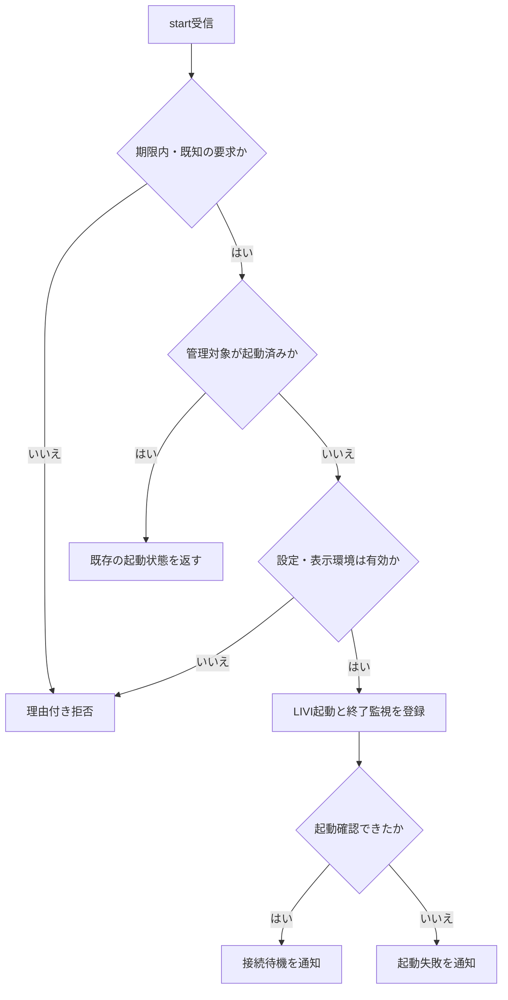
```mermaid
flowchart TB
 A["start受信"] --> B{"期限内・既知の要求か"}
 B -->|いいえ| R["理由付き拒否"]
 B -->|はい| C{"管理対象が起動済みか"}
 C -->|はい| E["既存の起動状態を返す"]
 C -->|いいえ| D{"設定・表示環境は有効か"}
 D -->|いいえ| R
 D -->|はい| F["LIVI起動と終了監視を登録"]
 F --> G{"起動確認できたか"}
 G -->|はい| H["接続待機を通知"]
 G -->|いいえ| I["起動失敗を通知"]
```

<a id="dd-feature-2"></a>

#### 3.2.2 スマートフォン接続状態の更新（LIV-02）

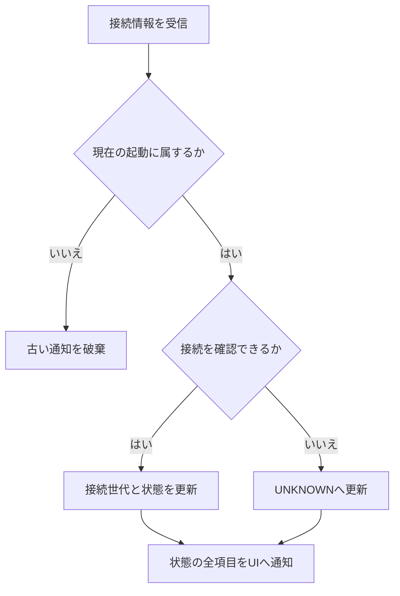
```mermaid
flowchart TB
 A["接続情報を受信"] --> B{"現在の起動に属するか"}
 B -->|いいえ| X["古い通知を破棄"]
 B -->|はい| C{"接続を確認できるか"}
 C -->|はい| D["接続世代と状態を更新"]
 C -->|いいえ| E["UNKNOWNへ更新"]
 D --> F["状態の全項目をUIへ通知"]
 E --> F
```

<a id="dd-feature-3"></a>

#### 3.2.3 優先画面を守る表示切替（LIV-03）

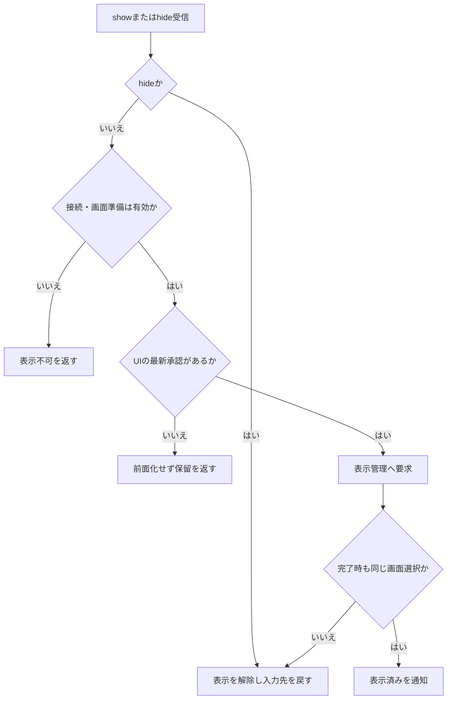
```mermaid
flowchart TB
 A["showまたはhide受信"] --> B{"hideか"}
 B -->|はい| H["表示を解除し入力先を戻す"]
 B -->|いいえ| C{"接続・画面準備は有効か"}
 C -->|いいえ| R["表示不可を返す"]
 C -->|はい| D{"UIの最新承認があるか"}
 D -->|いいえ| P["前面化せず保留を返す"]
 D -->|はい| E["表示管理へ要求"]
 E --> F{"完了時も同じ画面選択か"}
 F -->|はい| G["表示済みを通知"]
 F -->|いいえ| H
```

<a id="dd-feature-4"></a>

#### 3.2.4 音声利用の連携（LIV-04）

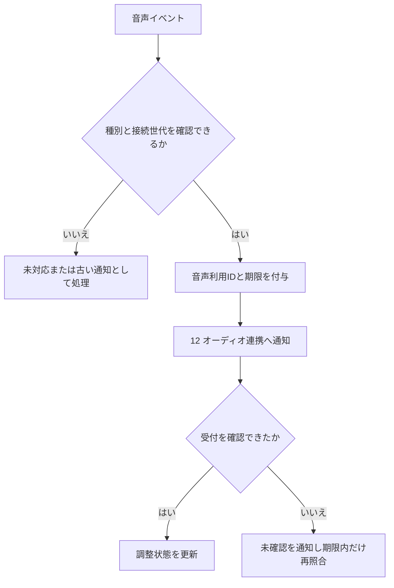
```mermaid
flowchart TB
 A["音声イベント"] --> B{"種別と接続世代を確認できるか"}
 B -->|いいえ| R["未対応または古い通知として処理"]
 B -->|はい| C["音声利用IDと期限を付与"]
 C --> D["12 オーディオ連携へ通知"]
 D --> E{"受付を確認できたか"}
 E -->|はい| F["調整状態を更新"]
 E -->|いいえ| G["未確認を通知し期限内だけ再照合"]
```

<a id="dd-feature-5"></a>

#### 3.2.5 切断・異常からの復旧（LIV-05）

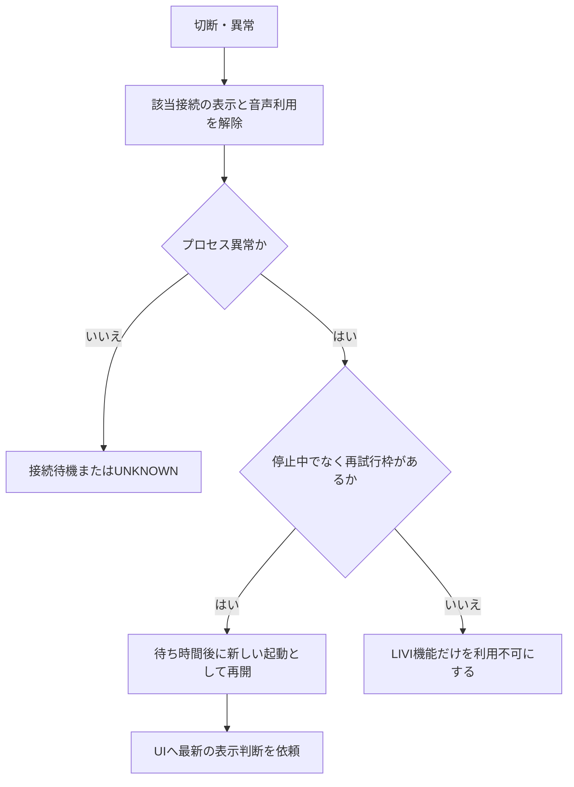
```mermaid
flowchart TB
 A["切断・異常"] --> B["該当接続の表示と音声利用を解除"]
 B --> C{"プロセス異常か"}
 C -->|いいえ| W["接続待機またはUNKNOWN"]
 C -->|はい| D{"停止中でなく再試行枠があるか"}
 D -->|はい| E["待ち時間後に新しい起動として再開"]
 D -->|いいえ| F["LIVI機能だけを利用不可にする"]
 E --> G["UIへ最新の表示判断を依頼"]
```

<a id="dd-feature-6"></a>

#### 3.2.6 管理対象だけの終了（LIV-06）

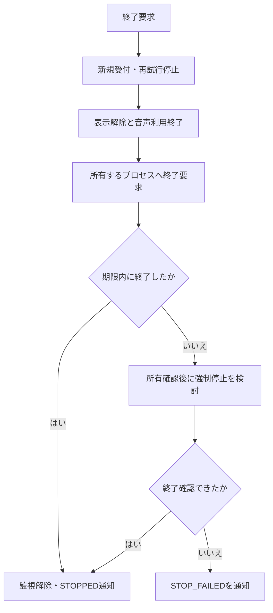
```mermaid
flowchart TB
 A["終了要求"] --> B["新規受付・再試行停止"]
 B --> C["表示解除と音声利用終了"]
 C --> D["所有するプロセスへ終了要求"]
 D --> E{"期限内に終了したか"}
 E -->|はい| F["監視解除・STOPPED通知"]
 E -->|いいえ| G["所有確認後に強制停止を検討"]
 G --> H{"終了確認できたか"}
 H -->|はい| F
 H -->|いいえ| I["STOP_FAILEDを通知"]
```

<a id="dd-module-tree"></a>

### 3.3 モジュールツリー

```text
livi_integration_service.py
`-- LiviIntegration
    |-- NativeProcessAdapter
    |   |-- start()
    |   |-- stop()
    |   |-- is_running()
    |   `-- pid
    |-- LiviWindowAdapter
    |   |-- show()
    |   |-- hide()
    |   |-- focus()
    |   `-- _find_target()
    `-- status / _publish()
```

<a id="dd-sequence"></a>

### 3.4 モジュール間の処理順序

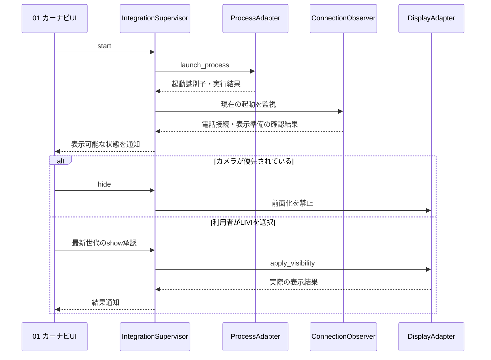
```mermaid
sequenceDiagram
 participant U as 01 カーナビUI
 participant S as IntegrationSupervisor
 participant P as ProcessAdapter
 participant C as ConnectionObserver
 participant D as DisplayAdapter
 U->>S: start
 S->>P: launch_process
 P-->>S: 起動識別子・実行結果
 S->>C: 現在の起動を監視
 C-->>S: 電話接続・表示準備の確認結果
 S-->>U: 表示可能な状態を通知
 alt カメラが優先されている
 U->>S: hide
 S->>D: 前面化を禁止
 else 利用者がLIVIを選択
 U->>S: 最新世代のshow承認
 S->>D: apply_visibility
 D-->>S: 実際の表示結果
 S-->>U: 結果通知
 end
```

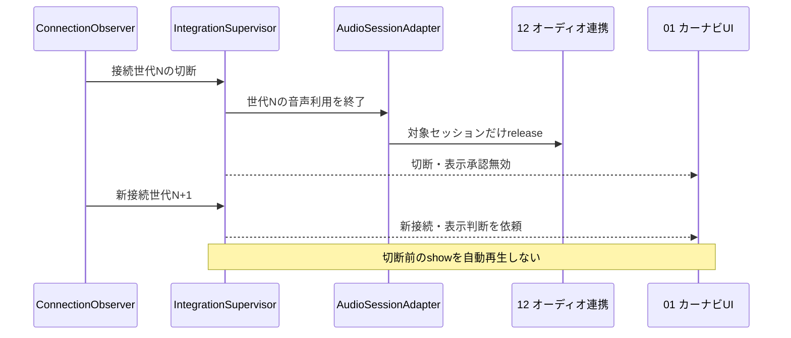
```mermaid
sequenceDiagram
 participant C as ConnectionObserver
 participant S as IntegrationSupervisor
 participant A as AudioSessionAdapter
 participant O as 12 オーディオ連携
 participant U as 01 カーナビUI
 C->>S: 接続世代Nの切断
 S->>A: 世代Nの音声利用を終了
 A->>O: 対象セッションだけrelease
 S-->>U: 切断・表示承認無効
 C->>S: 新接続世代N+1
 S-->>U: 新接続・表示判断を依頼
 Note over S,U: 切断前のshowを自動再生しない
```

各外部呼出しには期限を設ける。UIへの状態通知と操作応答は別に送り、電話接続待ちを理由にstart応答を永久に保留しない。

<a id="dd-modules"></a>

### 3.5 モジュール詳細

Adapterは外部の操作方法を本プロジェクトの形式へ変換する部分[注1]。現在の実装はLIVIプロセスとSwayウィンドウのライフサイクルに限定し、未確認の電話接続APIや音声APIをSUPPORTEDとは扱わない。

<a id="dd-module-1"></a>

#### 3.5.1 LiviIntegration（要求と全体状態の管理）

| 項目 | 内容 |
| --- | --- |
| 入力 | UIからのstart / show / hide / focus / stop / status要求。 |
| 出力 | `command_id`に対応する結果、`boot_id`と`sequence`付き状態通知。 |
| 保持情報 | 要求表示状態、実表示状態、プロセス状態、電話接続状態、失敗理由。 |
| 処理 | 要求を検証してNativeProcessAdapterとLiviWindowAdapterへ順に渡す。電話未接続でもプロセス起動は待機状態として成功にする。 |
| 関数 | handle_request / _start / _show / _stop / status / _publish |
| 異常時 | LIVIだけを利用不可とし、01 カーナビUIや06 カメラ表示・録画を停止しない。 |

<a id="dd-module-2"></a>

#### 3.5.2 NativeProcessAdapter（プロセスの起動と終了監視）

| 項目 | 内容 |
| --- | --- |
| 入力 | 設定された実行ファイル、固定引数配列、作業ディレクトリ、起動・終了期限。 |
| 出力 | 自分が起動したプロセスのPID、起動結果、終了結果。 |
| 保持情報 | 自分で作成したプロセスハンドルとログファイル。 |
| 処理 | shellを介さず引数配列で起動する。既に管理中なら二重起動せず、停止時は自分のハンドルだけを終了する。 |
| 関数 | start / stop / is_running / pid |
| 異常時 | 実行ファイル不在、起動直後終了、停止確認不能を理由付きで返す。 |

<a id="dd-module-3"></a>

#### 3.5.3 LiviWindowAdapter（Sway配置）

| 項目 | 内容 |
| --- | --- |
| 入力 | LIVI PID、Swayツリー、固定表示領域、show / hide / focus要求。 |
| 出力 | 実ウィンドウの可視状態、Sway操作結果、失敗理由。 |
| 保持情報 | SwayコンテナID、実表示状態、表示領域。 |
| 処理 | SwayツリーからPID一致を最優先で探す。同名ウィンドウだけに頼らず、全画面解除、floating化、枠なし化、リサイズ、移動、フォーカスの順に実行する。Swayは中心を保ってリサイズするため、サイズ変更後に最終座標を指定する。1280×720の標準UIでは上部バー62px、下部バー78pxを除いた領域（x=0、y=62、幅1280、高さ580）を用いる。 |
| 関数 | set_viewport / show / hide / focus |
| 異常時 | 対象ウィンドウを特定できない、Sway操作が失敗した場合はUNKNOWNを返す。 |

ホームなど別画面へ移る際は`move scratchpad`でLIVIを退避し、プロセスは継続する。ナビへ戻る際はSwayツリーを再取得し、対象が非表示用ワークスペース`__i3_scratch`内にある場合に限り`scratchpad show`で復帰させてから配置する。通常ワークスペース内では背面に回って`visible=false`となっていても復帰コマンドを送らない。表示中の`scratchpad show`は逆に画面を隠すため、ナビボタンの再押下と上部バー操作では保存済みIDへ`focus`だけを送り、検索・移動・リサイズを省略する。保存IDへの操作が失敗した場合だけ対象を再検出して配置する。再接続で要求が重なっても、一件ずつ処理して復帰操作の競合を防ぐ。

<a id="dd-module-4"></a>

#### 3.5.4 接続状態の扱い

| 項目 | 内容 |
| --- | --- |
| 現在の実装 | `phone_connection` は常にUNKNOWNから開始し、LIVIプロセスの稼働だけではCONNECTEDに変更しない。 |
| 未実装 | LIVI本体から電話接続・音声イベントを取得する正式なAPIまたは通知経路。 |
| 方針 | API仕様と対象バージョンを実機で確認した後、別モジュールとして追加する。確認できるまでUIは「接続状態不明」として扱う。 |

<a id="dd-files"></a>

### 3.6 ファイル構成

```text
src/raspberry_pi5/
|-- livi_integration_service.py    # JSON Lines常駐サービスの起動入口
|-- livi/
    |-- service.py                  # LiviIntegration
    |-- process_adapter.py          # NativeProcessAdapter
    |-- window_adapter.py            # LiviWindowAdapter
    `-- __init__.py
|-- systemd/l880k-livi.service     # 実機の常駐登録例
`-- config/livi.example.json       # 実行ファイルとSway配置設定
tests/livi_integration/
|-- test_livi.py
`-- __init__.py
```

実行ファイル本体、認証情報、電話接続情報はソースや公開Gitへ含めない。`livi.example.json`をコピーして、実機上のLIVIインストール先だけを設定する。

<a id="dd-function-flows"></a>

### 3.7 関数のフローチャート

以下は現在実装している自作関数の処理。成功は外部処理の実行確認を意味し、メッセージを送っただけでは成功にしない。後半の接続・音声関数は、正式なLIVI外部APIを確認した後の拡張設計として残す。

<a id="dd-fn-handle-request"></a>

#### 3.7.1 handle_request（要求を受け付ける）

| 項目 | 内容 |
| --- | --- |
| 担当 | LiviIntegration |
| 入力 | command_id、operation、arguments。 |
| 戻り値・結果 | operationごとの成功・失敗、状態、理由。 |

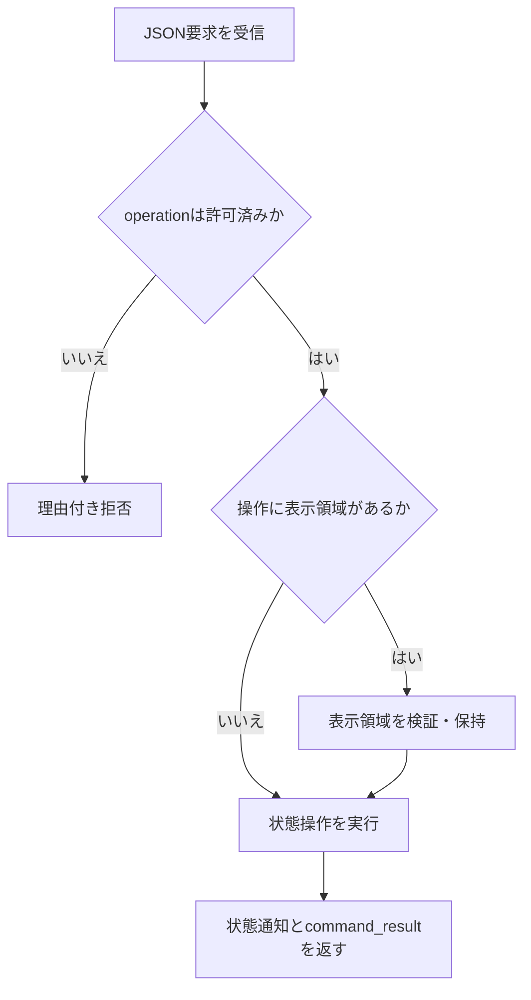
```mermaid
flowchart TB
 A["JSON要求を受信"] --> B{"operationは許可済みか"}
 B -->|いいえ| X["理由付き拒否"]
 B -->|はい| C{"操作に表示領域があるか"}
 C -->|はい| D["表示領域を検証・保持"]
 C -->|いいえ| E["状態操作を実行"]
 D --> E
 E --> F["状態通知とcommand_resultを返す"]
```

<a id="dd-fn-start"></a>

#### 3.7.2 start（LIVIを起動する）

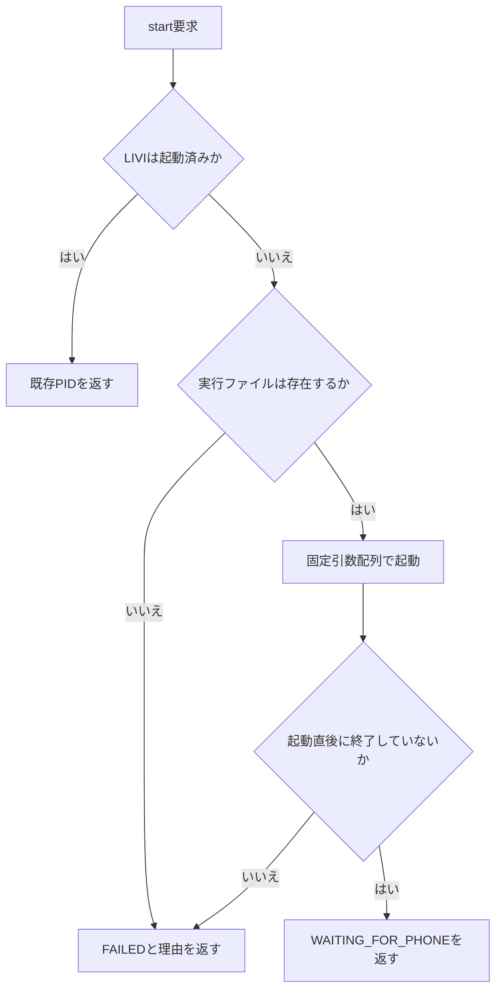
```mermaid
flowchart TB
 A["start要求"] --> B{"LIVIは起動済みか"}
 B -->|はい| C["既存PIDを返す"]
 B -->|いいえ| D{"実行ファイルは存在するか"}
 D -->|いいえ| X["FAILEDと理由を返す"]
 D -->|はい| E["固定引数配列で起動"]
 E --> F{"起動直後に終了していないか"}
 F -->|はい| G["WAITING_FOR_PHONEを返す"]
 F -->|いいえ| X
```

<a id="dd-fn-show"></a>

#### 3.7.3 show（固定領域へ表示する）

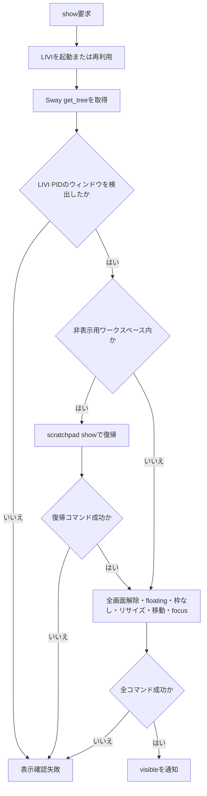
```mermaid
flowchart TB
 A["show要求"] --> B["LIVIを起動または再利用"]
 B --> C["Sway get_treeを取得"]
 C --> D{"LIVI PIDのウィンドウを検出したか"}
 D -->|いいえ| X["表示確認失敗"]
 D -->|はい| H{"非表示用ワークスペース内か"}
 H -->|はい| I["scratchpad showで復帰"]
 I --> J{"復帰コマンド成功か"}
 J -->|いいえ| X
 J -->|はい| E["全画面解除・floating・枠なし・リサイズ・移動・focus"]
 H -->|いいえ| E
 E --> F{"全コマンド成功か"}
 F -->|はい| G["visibleを通知"]
 F -->|いいえ| X
```

<a id="dd-fn-stop"></a>

#### 3.7.4 stop（LIVIを停止する）

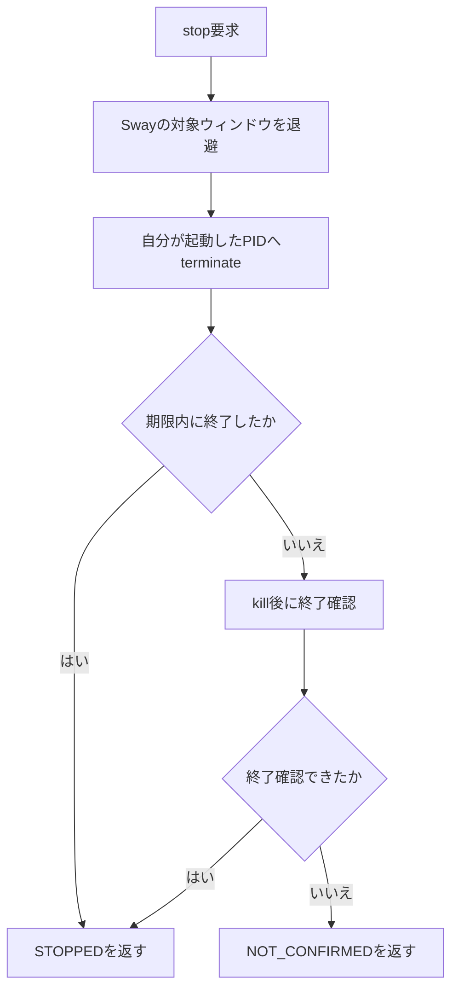
```mermaid
flowchart TB
 A["stop要求"] --> B["Swayの対象ウィンドウを退避"]
 B --> C["自分が起動したPIDへterminate"]
 C --> D{"期限内に終了したか"}
 D -->|はい| E["STOPPEDを返す"]
 D -->|いいえ| F["kill後に終了確認"]
 F --> G{"終了確認できたか"}
 G -->|はい| E
 G -->|いいえ| X["NOT_CONFIRMEDを返す"]
```

<a id="dd-fn-start-integration"></a>

#### 3.7.5 start_integration（将来拡張の設計案）

| 項目 | 内容 |
| --- | --- |
| 担当 | IntegrationSupervisor |
| 入力 | command、設定、現在状態。 |
| 戻り値・結果 | 起動済み結果または起動開始・拒否。 |

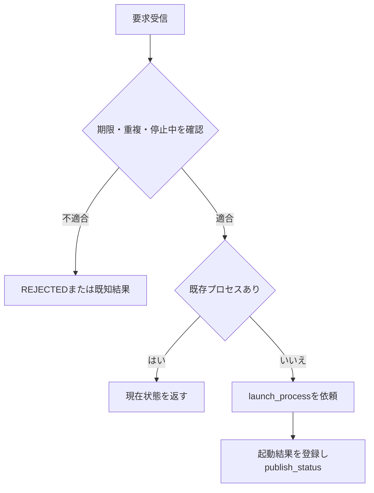
```mermaid
flowchart TB
 A["要求受信"] --> B{"期限・重複・停止中を確認"}
 B -->|不適合| X["REJECTEDまたは既知結果"]
 B -->|適合| C{"既存プロセスあり"}
 C -->|はい| D["現在状態を返す"]
 C -->|いいえ| E["launch_processを依頼"]
 E --> F["起動結果を登録しpublish_status"]
```

<a id="dd-fn-launch-process"></a>

#### 3.7.6 launch_process（接続API確認後の拡張案）

| 項目 | 内容 |
| --- | --- |
| 担当 | ProcessAdapter |
| 入力 | 検証済みパス・引数配列・期限。 |
| 戻り値・結果 | ProcessHandleまたは起動失敗。 |

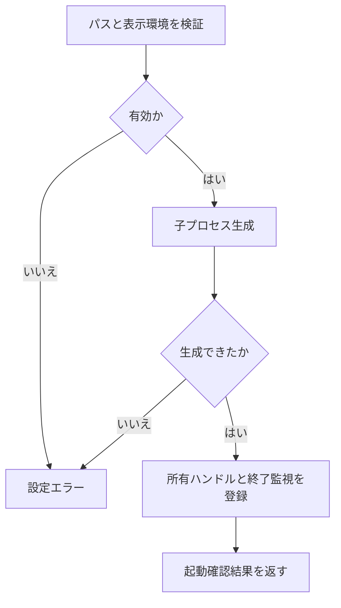
```mermaid
flowchart TB
 A["パスと表示環境を検証"] --> B{"有効か"}
 B -->|いいえ| X["設定エラー"]
 B -->|はい| C["子プロセス生成"]
 C --> D{"生成できたか"}
 D -->|いいえ| X
 D -->|はい| E["所有ハンドルと終了監視を登録"]
 E --> F["起動確認結果を返す"]
```

<a id="dd-fn-observe-connection"></a>

#### 3.7.7 observe_connection（接続API確認後の拡張案）

| 項目 | 内容 |
| --- | --- |
| 担当 | ConnectionObserver |
| 入力 | 外部イベント・起動識別子。 |
| 戻り値・結果 | ConnectionObservation。 |

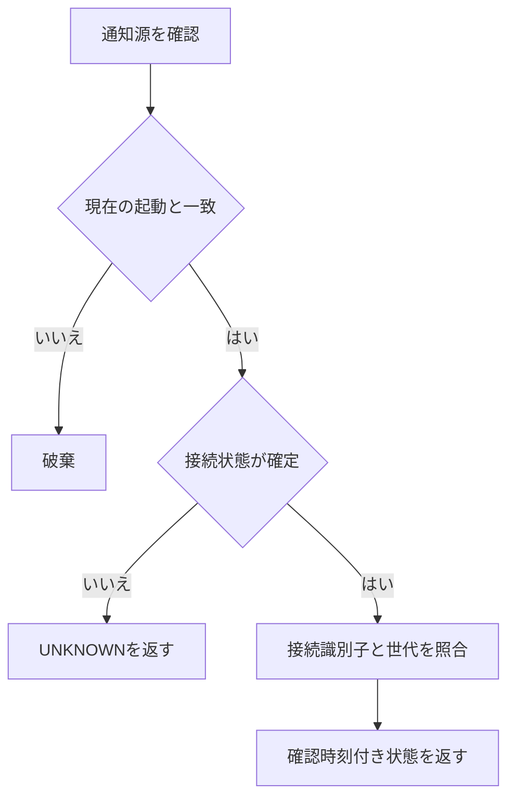
```mermaid
flowchart TB
 A["通知源を確認"] --> B{"現在の起動と一致"}
 B -->|いいえ| X["破棄"]
 B -->|はい| C{"接続状態が確定"}
 C -->|いいえ| D["UNKNOWNを返す"]
 C -->|はい| E["接続識別子と世代を照合"]
 E --> F["確認時刻付き状態を返す"]
```

<a id="dd-fn-apply-visibility"></a>

#### 3.7.8 apply_visibility（将来の承認世代拡張案）

| 項目 | 内容 |
| --- | --- |
| 担当 | DisplayAdapter |
| 入力 | 表示要求・UI承認・現在の接続。 |
| 戻り値・結果 | DisplayResult。 |

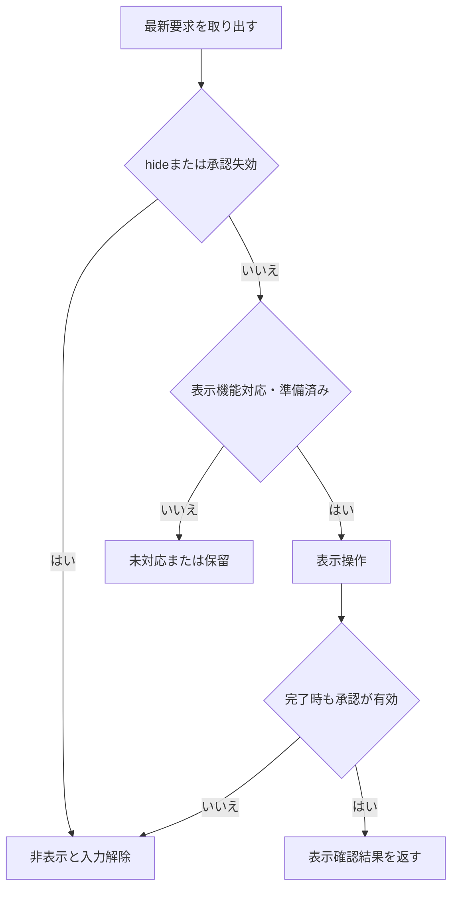
```mermaid
flowchart TB
 A["最新要求を取り出す"] --> B{"hideまたは承認失効"}
 B -->|はい| H["非表示と入力解除"]
 B -->|いいえ| C{"表示機能対応・準備済み"}
 C -->|いいえ| X["未対応または保留"]
 C -->|はい| D["表示操作"]
 D --> E{"完了時も承認が有効"}
 E -->|いいえ| H
 E -->|はい| F["表示確認結果を返す"]
```

<a id="dd-fn-forward-audio-session"></a>

#### 3.7.9 forward_audio_session（音声API確認後の拡張案）

| 項目 | 内容 |
| --- | --- |
| 担当 | AudioSessionAdapter |
| 入力 | 音声イベント・接続世代。 |
| 戻り値・結果 | 受付結果・有効な音声利用表。 |

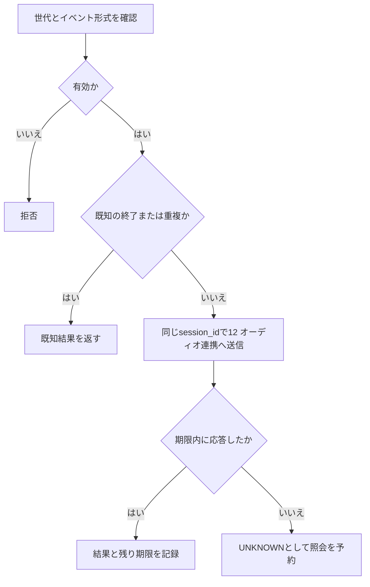
```mermaid
flowchart TB
 A["世代とイベント形式を確認"] --> B{"有効か"}
 B -->|いいえ| X["拒否"]
 B -->|はい| C{"既知の終了または重複か"}
 C -->|はい| D["既知結果を返す"]
 C -->|いいえ| E["同じsession_idで12 オーディオ連携へ送信"]
 E --> F{"期限内に応答したか"}
 F -->|はい| G["結果と残り期限を記録"]
 F -->|いいえ| H["UNKNOWNとして照会を予約"]
```

<a id="dd-fn-handle-disconnect"></a>

#### 3.7.10 handle_disconnect（接続API確認後の拡張案）

| 項目 | 内容 |
| --- | --- |
| 担当 | IntegrationSupervisor |
| 入力 | 切断対象の接続世代。 |
| 戻り値・結果 | 当該世代だけ解除した状態。 |

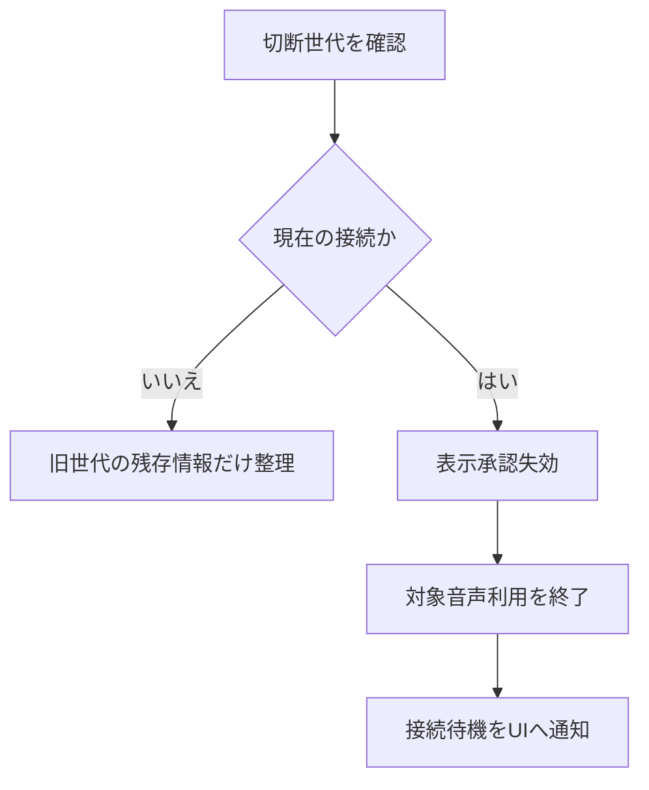
```mermaid
flowchart TB
 A["切断世代を確認"] --> B{"現在の接続か"}
 B -->|いいえ| X["旧世代の残存情報だけ整理"]
 B -->|はい| C["表示承認失効"]
 C --> D["対象音声利用を終了"]
 D --> E["接続待機をUIへ通知"]
```

<a id="dd-fn-schedule-recovery"></a>

#### 3.7.11 schedule_recovery（再試行拡張の設計案）

| 項目 | 内容 |
| --- | --- |
| 担当 | IntegrationSupervisor |
| 入力 | 障害理由・回数・停止状態。 |
| 戻り値・結果 | 再試行予約または利用不可。 |

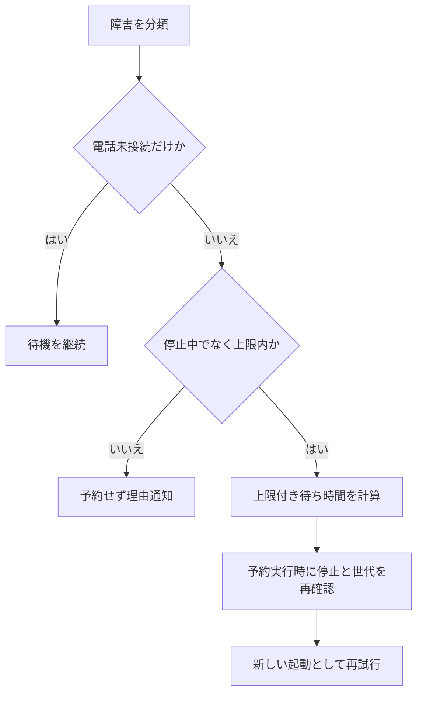
```mermaid
flowchart TB
 A["障害を分類"] --> B{"電話未接続だけか"}
 B -->|はい| W["待機を継続"]
 B -->|いいえ| C{"停止中でなく上限内か"}
 C -->|いいえ| X["予約せず理由通知"]
 C -->|はい| D["上限付き待ち時間を計算"]
 D --> E["予約実行時に停止と世代を再確認"]
 E --> F["新しい起動として再試行"]
```

<a id="dd-fn-publish-status"></a>

#### 3.7.12 publish_status（将来拡張の設計案）

| 項目 | 内容 |
| --- | --- |
| 担当 | IntegrationSupervisor |
| 入力 | 各状態・確認期限・改訂番号。 |
| 戻り値・結果 | LiviStatus。 |

```mermaid
flowchart TB
 A["状態をまとめる"] --> B["期限切れ情報をUNKNOWNへ変更"]
 B --> C["個人情報を除外"]
 C --> D["sequenceを進める"]
 D --> E["最新値優先でUIへ配信"]
```

<a id="dd-fn-stop-integration"></a>

#### 3.7.13 stop_integration（将来拡張の設計案）

| 項目 | 内容 |
| --- | --- |
| 担当 | IntegrationSupervisor |
| 入力 | 終了期限・所有ハンドル。 |
| 戻り値・結果 | STOPPEDまたはSTOP_FAILED。 |

```mermaid
flowchart TB
 A["受付と再起動予約を停止"] --> B["表示承認と音声利用を解除"]
 B --> C["所有するプロセスへ終了要求"]
 C --> D{"終了確認できたか"}
 D -->|はい| E["監視解除しSTOPPED"]
 D -->|いいえ| F["所有確認付き強制停止"]
 F --> G{"終了確認できたか"}
 G -->|はい| E
 G -->|いいえ| H["管理情報を残しSTOP_FAILED"]
```

<a id="dd-4"></a>

## 4. インターフェース設計

内部の論理契約とLIVIの実際の外部APIを分ける。未確認のURLやCLIオプションを実装済みの操作として扱わない。

<a id="dd-interfaces"></a>

### 4.1 ソフト間の接続

```mermaid
flowchart LR
 subgraph UI["01 カーナビUI"]
 SC["ScreenController"]
 SB["ServiceBridge"]
 SC --> SB
 end
 subgraph LI["11 LIVI連携"]
 IS["LiviIntegration"]
 DA["LiviWindowAdapter"]
 PA["NativeProcessAdapter"]
 IS --> DA
 IS --> PA
 end
 subgraph AU["12 オーディオ連携"]
 AF["AudioFocusManager"]
 end
SB -->|JSON Lines操作| IS
IS -->|状態と結果| SB
PA -->|LIVIプロセス| L["LIVIネイティブプロセス"]
DA -->|Sway移動・リサイズ| W["Sway Waylandコンポジタ"]
```

| 送信元 → 受信先 | 論理データ | 扱い |
| --- | --- | --- |
| 01 カーナビUI → LiviIntegration | JSON Lines要求 | `command_id`、`operation`、`arguments.viewport`を送る。対応操作はstart / show / hide / focus / stop / status。 |
| LiviIntegration → 01 カーナビUI | status / command_result | `boot_id`、`sequence`、PID、プロセス状態、ウィンドウ状態、phone_connectionを返す。 |
| NativeProcessAdapter → LIVI | 固定引数配列 | shellを使わず、設定された実行ファイルを起動する。 |
| LiviWindowAdapter → Sway | swaymsg | PID一致の外部ウィンドウを固定領域へ移動・リサイズする。 |
| LIVI → 電話接続状態 | 外部イベント・照会結果 | 正式な取得方法が未確認のため、現実装では接続状態をUNKNOWNとする。 |

<a id="dd-commands"></a>

### 4.2 要求と応答

| 操作 | 受理条件 | 成功条件・拒否理由 |
| --- | --- | --- |
| start | 設定済み、終了処理中でない | 管理対象の起動が確認できた時点で成功。電話接続は成功条件に含めない。 |
| show | 実行ファイル、Sway、固定表示領域が有効 | LIVI起動後にPID一致のウィンドウを確認し、表示領域へ配置する。確認不能はUNKNOWN。 |
| hide | 管理する表示先を特定できる | 非表示・入力解除の確認。既に非表示なら成功。 |
| stop | 所有プロセスの情報がある | Sway退避後に自分が起動したPIDを停止する。期限超過はNOT_CONFIRMED。 |
| 重複要求 | 発行元boot_idとcommand_idが既知 | 同じ結果を返す。異なる引数で同じIDを使った場合は拒否。 |
| 通信断後 | 受付結果不明 | 状態照会で確認する。古いshowやstopを新IDで無条件再発行しない。 |

表示要求の期限は受付可能な時間、表示承認の有効性はUIがその画面を選んでいる期間である。承認失効を受けたら受付期限内でも表示しない。

<a id="dd-capabilities"></a>

### 4.3 外部機能の確認表

| 機能 | 確定する内容 | 未確認時 |
| --- | --- | --- |
| LIVI起動 | 実行ファイル、固定引数、作業ディレクトリ、子プロセスの終了方法 | 実行ファイル未設定・不在として失敗を返す。 |
| 電話接続検出 | イベントAPI・照会方法・切断検出 | phone_connection=UNKNOWN。 |
| 画面操作 | Sway上のPID検索、表示・非表示・フォーカス | PIDウィンドウを確認できない場合はUNKNOWN。 |
| 音声種別 | 通話・案内・音楽を識別する通知と終了通知 | 自動音声優先調整を未対応とする。 |
| 接続経路 | 採用バージョン・端末での有線または無線動作 | 両方式利用可能と表示しない。 |
| ネットワーク | 無線投影とスマートフォンテザリングの併用条件 | 07 Google Driveアップロード・削除の回線確保と競合を確認。 |

外部の状態取得手段が欠ける場合は「接続済み」を推測せず、利用者によるLIVI画面での操作を残す。後方カメラ優先を維持できない外部表示方式は採用しない。

<a id="dd-5"></a>

## 5. データ・設定設計

配信の共通フィールドは[00 共通仕様](00_共通仕様.md)に従う。電話接続状態と表示・音声状態は独立して保持する。

<a id="dd-data"></a>

### 5.1 状態データ

| 項目 | 型・内容 | 更新・破棄規則 |
| --- | --- | --- |
| boot_id / sequence | 起動ID / 整数 | 連携ソフト起動ごとにboot_idを変え、配信ごとにsequenceを進める。 |
| boot_id / sequence | 起動ID / 整数 | サービス起動ごとにboot_idを変え、状態通知ごとにsequenceを進める。 |
| process_state | RUNNING / STOPPED / FAILED | NativeProcessAdapterが管理するPIDの状態。 |
| window_state / actual_visibility | visible / hidden / UNKNOWN | Sway配置結果を返す。プロセス稼働だけでvisibleにしない。 |
| phone_connection | UNKNOWN | 正式なLIVI接続APIを確認するまで固定値UNKNOWN。 |
| requested_visibility | visible / hidden | UIから最後に受けた要求。 |
| failure_reason | 文字列 | 実行ファイル不在、Sway失敗など利用者が判断できる理由。個人情報を含めない。 |

<a id="dd-config"></a>

### 5.2 設定・保存範囲

| 設定 | 検証 | 初期方針 |
| --- | --- | --- |
| executable / args | 実行ファイルと固定文字列配列。shell構文を受け付けない | `livi.example.json`をコピーして実機のインストール先を設定する。 |
| working_directory | 実行時の作業ディレクトリ | LIVIのインストール先に合わせる。 |
| display_backend / window_identifiers | `sway`、補助識別子 | PID一致を優先し、タイトルだけで操作しない。 |
| ipc.socket_path / ipc.lock_path | JSON Linesソケットと二重起動防止ロック | UIと同じユーザーのruntime領域を使用する。 |
| timeouts | startup / window / visibility / stop | 正の秒数。期限切れは失敗またはUNKNOWNとして通知する。 |
| command_log | LIVI標準出力・標準エラーの保存先 | 秘密情報を含む可能性があるため権限と保持期間を別途管理する。 |

実行設定だけを設定ファイルで管理する。表示要求とプロセスハンドルは再起動後に復元しない。電話接続やペアリング秘密情報はLIVI側の管理に任せ、自作ソフトへ複製しない。

<a id="dd-6"></a>

## 6. 処理・状態遷移

| 現在状態 | 契機 | 次状態・処理 |
| --- | --- | --- |
| STOPPED | start / show | 実行ファイルを確認してRUNNINGまたはFAILED。 |
| RUNNING | start | 既存PIDを再利用し、二重起動しない。 |
| RUNNING | show | SwayツリーからPID一致のウィンドウを探し、visibleまたはUNKNOWN。 |
| visible | hide | ウィンドウをスクラッチパッドへ退避しhidden。 |
| hidden | focus | 再配置してvisible。対象不在ならUNKNOWN。 |
| 任意 | stop | ウィンドウ退避、所有PID停止、確認後STOPPED。 |

状態通知は`boot_id`と`sequence`で順序を確認する。電話接続・音声イベントは取得経路を確認するまで処理せず、プロセス状態やSway表示状態と混同しない。

<a id="dd-7"></a>

## 7. 異常処理

| 異常 | 検出 | 処置 | 戻してはいけない状態 |
| --- | --- | --- | --- |
| 起動失敗 | 生成例外・早期終了 | 回数制限付き再試行、UIへ原因通知 | 電話接続済み表示。 |
| 電話切断 | 検証済み通知 | 当該世代の音声と画面承認を解除 | 切断前の自動前面化。 |
| 古い通知 | 起動・接続世代不一致 | 破棄または旧世代の残存分だけ整理 | 新しい音声利用の解除。 |
| 表示操作失敗 | 完了確認不能・期限切れ | UIへ復帰判断を依頼し表示を再照合 | 表示成功扱い。 |
| LIVIが勝手に前面化 | 表示管理で不一致検出 | 優先画面を戻す。制御不能なら自動連携を無効化 | 後方カメラの無断終了。 |
| 12 オーディオ連携との通信断 | 応答期限 | 音声調整UNKNOWN、期限付き再照合 | 調整済み表示。 |
| UI再起動・通信断 | 発行元変更・承認期限 | 旧承認失効、再接続後に最新選択を受け取る | 古い表示要求の再実行。 |
| 停止失敗 | 所有プロセスが残る | 管理情報を残しSTOP_FAILED | 同名プロセス一括kill。 |

<a id="dd-8"></a>

## 8. 起動・終了・運用設計

通常ユーザーのSway Wayland表示セッションで起動する。LIVI連携サービスは`l880k-livi.service`またはDebian 13試験スクリプトから常駐起動し、LIVI本体はUIのshow要求時に必要なら起動する。電話接続待ちで01 カーナビUIを止めない。

LIVIは内部に画面を合成するコンポジタを持ち、通常はそのコンポジタを経由して画面を生成する。本システムでは外側のSwayが自作UIとLIVIの外部ウィンドウを配置するため、LIVI内部コンポジタを無効にしても外側のSwayによる固定領域配置は継続できる。`LIVI_NO_COMPOSITOR=1`は内部コンポジタだけを無効にする診断設定であり、LIVI本体やLIVI連携サービスを無効にする設定ではない。

Debian 13をVirtualBoxで動かす開発環境では、GPUが十分に提供されず、`llvmpipe`によるCPU描画になる場合がある。この状態でLIVI内部コンポジタを有効にすると、wlroots・EGL・DMA-BUFの描画経路でクラッシュすることがある。`llvmpipe`のsegmentation fault発生後に`LIVI_NO_COMPOSITOR=1`で表示が継続した場合、内部コンポジタの描画経路が原因候補であると記録する。メモリ不足やLIVI本体の起動失敗とは別の状態として扱う。

`LIVI_NO_COMPOSITOR=1`はVirtualBoxでの画面表示試験用とし、Raspberry Pi 5の標準設定にはしない。Pi 5実機ではV3D、GBM、EGL、Waylandの実描画経路で内部コンポジタを有効にして確認する。無効化設定を実機で採用する場合は、Android Auto・CarPlay映像、タッチ入力、音声入出力、画面固定配置を個別に受け入れ試験し、映像合成や入力経路の機能低下がないことを確認する。

終了順序は、新規受付停止 → Swayの対象ウィンドウ退避 → 自分が起動したLIVIプロセス停止 → ソケットとロック解放とする。LIVI本体の自動起動設定が別にある場合は、二重起動しないよう無効化または所有関係を確認する。

実行権限とデバイス権限を限定し、制御APIをインターネットへ公開しない。更新時はバージョンを固定して機能確認表を再試験する。LIVIの自動接続・全画面設定が01 カーナビUIの画面管理を妨げないことを採用条件とする。

<a id="dd-9"></a>

## 9. 試験・受入条件

以下は実装時の試験計画であり、外部機器での動作確認結果ではない。

<a id="dd-tests"></a>

### 9.1 単体・結合試験

| 試験ID | 入力・条件 | 受入条件 |
| --- | --- | --- |
| LIV-T01 | 電話なしでstart | LIVI起動状態と未接続状態が分離され、UI・OsmAnd・録画が使える。 |
| LIV-T02 | startの重複受信 | 1プロセスだけ生成。同じcommand_idに同じ結果。 |
| LIV-T03 | 期限切れshow | 前面化せずREJECTED。 |
| LIV-T04 | show実行途中で後方画面へ変更 | 遅れた完了でLIVIへ戻らず入力先もカメラ側を維持。 |
| LIV-T05 | 電話の抜差しと旧切断イベント | 新接続世代を旧イベントで解除しない。 |
| LIV-T06 | 音声開始の重複・終了欠落 | 二重登録なし。期限後に残留が解消される。 |
| LIV-T07 | LIVI異常終了の連続発生 | 再試行上限で停止。他サービスを停止しない。 |
| LIV-T08 | UI再起動 | 旧表示承認は無効。最新画面選択を受けてから表示。 |
| LIV-T09 | 偽のプロセス名・同名別PID | 所有していないプロセスに終了操作をしない。 |
| LIV-T10 | VirtualBoxでllvmpipeのsegmentation fault後に`LIVI_NO_COMPOSITOR=1`で起動 | 内部コンポジタを使わずLIVI画面を外側のSwayへ配置できる。診断設定であることを状態・ログへ残す。 |
| LIV-T11 | Pi 5実機で内部コンポジタを有効化 | V3D・GBM・EGLを使った描画が継続し、映像・タッチ・音声・固定配置が受入条件を満たす。 |
| LIV-T10 | 音声・接続API未対応 | UNKNOWNまたはUNSUPPORTED。推測で有効化しない。 |
| LIV-T11 | 停止待ち中に再接続 | 停止予約を取り消さず新規表示もしない。 |
| LIV-T12 | 無線投影とテザリング併用 | 回線競合の有無を確認。録画アップロードを成功扱いで失わない。 |

<a id="dd-10"></a>

## 10. 未確定事項・実装課題

| 項目 | 確定する内容 | 完了条件 |
| --- | --- | --- |
| 採用LIVI | バージョン・配布物・起動引数・必要機器 | Pi 5と対象電話の組合せで再現可能。 |
| 接続通知 | 公開APIまたは採用バージョンに固定した連携実装 | 切断・再接続・古い通知を識別可能。 |
| 表示連携 | UIとLIVIで共有できる表示管理方式 | 後方画面の優先と入力先を保証。 |
| 音声連携 | 通話等の通知、音声経路、期限更新 | 12 オーディオ連携との結合試験合格。 |
| 通信方式 | Pi 5内IPC、相手認証、通知再取得 | 00 共通仕様の要求・結果契約と一致。 |
| 外部ソフト更新 | 対応バージョン一覧と互換性判定 | 未知のバージョンを自動的に対応済みとしない。 |

<a id="dd-glossary"></a>

## 用語の注釈

| 番号 | 用語 | 説明 |
| --- | --- | --- |
| 注1 | Adapter | 外部ソフトの操作方法を、内部で共通に扱う形式へ変換する部分。 |
| 注2 | コンポジタ | 画面を合成し、どのウィンドウへタッチ入力を渡すか管理する表示ソフト。 |
| 注3 | 接続世代 | 切断前と再接続後の情報を区別する番号。電話の名前が同じでも別の接続として扱う。 |
| 注4 | 音声利用の期限 | 終了通知が欠けても、古い音声利用が永久に残らないための有効期間。 |
