# オーディオ連携 詳細設計書

| 項目 | 内容 |
| --- | --- |
| 文書ID | SW-DD-12 |
| 実行環境 | Pi 5 |
| 実装状態 | UIからのMopidy再生・音量・検索・プレイリスト編集、USB出力の存在監視を実装。音声優先度・DAC出力制御は未実装 |
| 対象ソース | `src/raspberry_pi5/ui/controllers/mopidy_client.py`、`feature_controller.py`。独立した`audio_integration_service.py`は作成予定 |
| 作成日 | 2026-09-14 |
| 更新日 | 2026-09-27 |

[詳細設計一覧](README.md) / [共通仕様](00_共通仕様.md) / [上位設計](../ソフトウェア設計図.md#sec-48)

## 目次

- [1. 目的・適用範囲](#dd-1)
- [2. 要求仕様・役割](#dd-2)
  - [2.1 機能一覧](#dd-functions)
  - [2.2 機能・モジュール・関数の対応](#dd-function-map)
- [3. 内部構成](#dd-3)
  - [3.1 モジュールの全体構成](#dd-overview)
  - [3.2 機能別処理フローチャート](#dd-feature-flows)
    - [3.2.1 音楽再生の操作（AUD-01）](#dd-feature-1)
    - [3.2.2 通常音量の変更と同期（AUD-02）](#dd-feature-2)
    - [3.2.3 案内・通話中の音楽調整（AUD-03）](#dd-feature-3)
    - [3.2.4 音声終了と残留調整の解消（AUD-04）](#dd-feature-4)
    - [3.2.5 USB DACの監視と復帰（AUD-05）](#dd-feature-5)
    - [3.2.6 再接続・終了時の状態管理（AUD-06）](#dd-feature-6)
  - [3.3 モジュールツリー](#dd-module-tree)
  - [3.4 モジュール間の処理順序](#dd-sequence)
  - [3.5 モジュール詳細](#dd-modules)
    - [3.5.1 MopidyAdapter（外部プレイヤーとの接続）](#dd-module-1)
    - [3.5.2 PlaybackState（確認済み再生状態の保持）](#dd-module-2)
    - [3.5.3 AudioFocusManager（音声優先度の管理）](#dd-module-3)
    - [3.5.4 HostAudioAdapter（音楽ストリームと出力先の制御）](#dd-module-4)
    - [3.5.5 UiPublisher（操作受付と状態配信）](#dd-module-5)
  - [3.6 ファイル構成](#dd-files)
  - [3.7 関数のフローチャート](#dd-function-flows)
    - [3.7.1 handle_command（UIの音楽操作を受け付ける）](#dd-fn-handle-command)
    - [3.7.2 execute_playback_command（再生命令をMopidyへ送る）](#dd-fn-execute-playback-command)
    - [3.7.3 refresh_playback（現在の再生情報を取得する）](#dd-fn-refresh-playback)
    - [3.7.4 set_base_volume（利用者指定の通常音量を設定する）](#dd-fn-set-base-volume)
    - [3.7.5 update_audio_session（音声利用表を更新する）](#dd-fn-update-audio-session)
    - [3.7.6 expire_audio_sessions（期限切れの音声利用を解消する）](#dd-fn-expire-audio-sessions)
    - [3.7.7 recompute_focus（音楽の目標音量係数を決める）](#dd-fn-recompute-focus)
    - [3.7.8 apply_music_gain（音楽だけの一時音量を反映する）](#dd-fn-apply-music-gain)
    - [3.7.9 reconcile_output（登録DACと音楽経路を照合する）](#dd-fn-reconcile-output)
    - [3.7.10 publish_audio_status（音楽と音声調整の状態を通知する）](#dd-fn-publish-audio-status)
    - [3.7.11 stop_audio_integration（音楽出力を抑えて終了する）](#dd-fn-stop-audio-integration)
- [4. インターフェース設計](#dd-4)
  - [4.0 現在のUI連携実装](#dd-current-ui)
    - [4.0.1 公式音楽サービスの画面管理](#dd-official-music)
  - [4.1 制御・音声の経路](#dd-interfaces)
  - [4.2 Mopidy API対応](#dd-mopidy-api)
  - [4.3 音声利用メッセージ](#dd-audio-contract)
- [5. データ・設定設計](#dd-5)
  - [5.1 音量と再生データ](#dd-data)
  - [5.2 設定と永続化](#dd-config)
- [6. 処理・状態遷移](#dd-6)
- [7. 異常処理](#dd-7)
- [8. 起動・終了・運用設計](#dd-8)
- [9. 試験・受入条件](#dd-9)
  - [9.1 単体・結合試験](#dd-tests)
- [10. 未確定事項・実装課題](#dd-10)
- [用語の注釈](#dd-glossary)

<a id="dd-1"></a>

## 1. 目的・適用範囲

Mopidyによる音楽再生を、01 カーナビUI、OsmAndの案内音声、LIVIの音声と連携させる。音楽の復号・ライブラリ管理・再生処理はMopidyが担当し、選曲・再生・停止・音量操作・再生状態表示は自作QML UIからMopidy APIを通して行う。

自作部分は再生操作の受渡し、確認済み再生状態の通知、音楽だけの一時的な音量低減、USB DACの選択・異常検出を担当する。アンプはACC連動リレーで給電し、本ソフトからアンプ電源GPIOを操作しない。

関連設計：[01 カーナビUI](01_カーナビUI.md)、[02 Waydroidナビ管理](02_Waydroidナビ管理.md)、[11 LIVI連携](11_LIVI連携.md)。

<a id="dd-2"></a>

## 2. 要求仕様・役割

機能は実現する動作、モジュールは処理の分担、関数はモジュール内の処理単位を表す。3章の独立常駐ソフトと音声調整の構成は今後の設計案。現在のUI内Mopidy通信実装は[4.0](#dd-current-ui)で区別し、導入手順は[付録9](../付録9_UI追加機能導入手順.md)に記載する。

<a id="dd-functions"></a>

### 2.1 機能一覧

| 機能ID | 機能 | 実現する動作 |
| --- | --- | --- |
| AUD-01 | 音楽再生の操作 | **開始条件・入力：** UIの再生・一時停止・停止・選曲要求、Mopidyの接続状態。<br/>**確認・処理：** 期限と重複を確認し、許可操作をMopidy APIへ変換する。選曲は現在の再生リスト識別子を照合する。操作結果と実際の再生状態を確認する。<br/>**処理結果：** CommandResultと確認済み再生状態。通信断で結果不明の場合は成功にせずUNKNOWNを通知する。 |
| AUD-02 | 通常音量の変更と同期 | **開始条件・入力：** 01 カーナビUIからの利用者音量変更。<br/>**確認・処理：** 通常音量はMopidyのミキサー値を基準にし、確認後にbase_volumeを更新する。内部0〜1と外部の音量範囲を変換する。案内中も一時低減係数とは独立して扱う。<br/>**処理結果：** 最新の通常音量と一時音量を別々に通知・保存する。案内終了で古い通常音量へ戻さない。 |
| AUD-03 | 案内・通話中の音楽調整 | **開始条件・入力：** 確認済みの案内・通話等の音声利用イベント。<br/>**確認・処理：** 音声利用IDと期限を登録する。通話等のEXCLUSIVEを案内のDUCKINGより優先し、案内が重複しても係数を掛け重ねない。Mopidy音楽ストリームだけを低減または消音する。<br/>**処理結果：** NORMAL / DUCKING / EXCLUSIVEと適用確認結果。案内・通話の音量を一緒に下げない。 |
| AUD-04 | 音声終了と残留調整の解消 | **開始条件・入力：** 終了通知、接続切断、音声利用の期限到達。<br/>**確認・処理：** 終了対象の送信元・起動・接続・音声IDを照合して削除する。通知欠落では期限付き照会を行い、古い利用を永久保持しない。復帰前にDACと現在の音量を再確認する。<br/>**処理結果：** 有効な他の音声利用があれば調整を維持し、なければ最新通常音量相当へ戻す。勝手なplay命令は出さない。 |
| AUD-05 | USB DACの監視と復帰 | **開始条件・入力：** 音声デバイスの追加・削除、ホスト音声基盤の再接続。<br/>**確認・処理：** 事前登録したDAC識別情報で出力先を照合する。消失時は音楽を消音・停止側へ移し、別のHDMI出力へ自動的に流さない。再接続時はストリームと利用者の再生意図を確認する。<br/>**処理結果：** OUTPUT_UNAVAILABLEまたは復旧確認待ち。DAC復帰だけで自動再生しない。 |
| AUD-06 | 再接続・終了時の状態管理 | **開始条件・入力：** Mopidy再起動、本ソフトの終了要求。<br/>**確認・処理：** 再接続では操作を保留して実状態を読み直し、古いplayや選曲要求は再生しない。終了時は新規受付を止め、管理する音楽を止めてから一時調整を解除する。<br/>**処理結果：** 確認後に操作可能へ戻る。停止中に通常音量へ急復帰させず、外部Mopidyの終了は所有している場合だけ行う。 |

<a id="dd-function-map"></a>

### 2.2 機能・モジュール・関数の対応

| 機能ID | 担当モジュール | 主な関数 |
| --- | --- | --- |
| AUD-01 | UiPublisher / MopidyAdapter / PlaybackState | handle_command / execute_playback_command / refresh_playback |
| AUD-02 | MopidyAdapter / PlaybackState / AudioFocusManager | set_base_volume / refresh_playback / recompute_focus |
| AUD-03 | AudioFocusManager / HostAudioAdapter | update_audio_session / recompute_focus / apply_music_gain |
| AUD-04 | AudioFocusManager / HostAudioAdapter | expire_audio_sessions / recompute_focus / apply_music_gain |
| AUD-05 | HostAudioAdapter / AudioFocusManager / UiPublisher | reconcile_output / publish_audio_status |
| AUD-06 | MopidyAdapter / PlaybackState / AudioFocusManager / HostAudioAdapter | refresh_playback / stop_audio_integration |

<a id="dd-3"></a>

## 3. 内部構成

MopidyAdapterが外部APIを扱い、PlaybackStateが確認済みの再生情報を保持する。AudioFocusManagerはどの音声を優先するか判断し、HostAudioAdapterはMopidy音楽ストリームだけへ一時音量を反映する。UiPublisherは操作受付と状態配信の窓口とする。

<a id="dd-overview"></a>

### 3.1 モジュールの全体構成

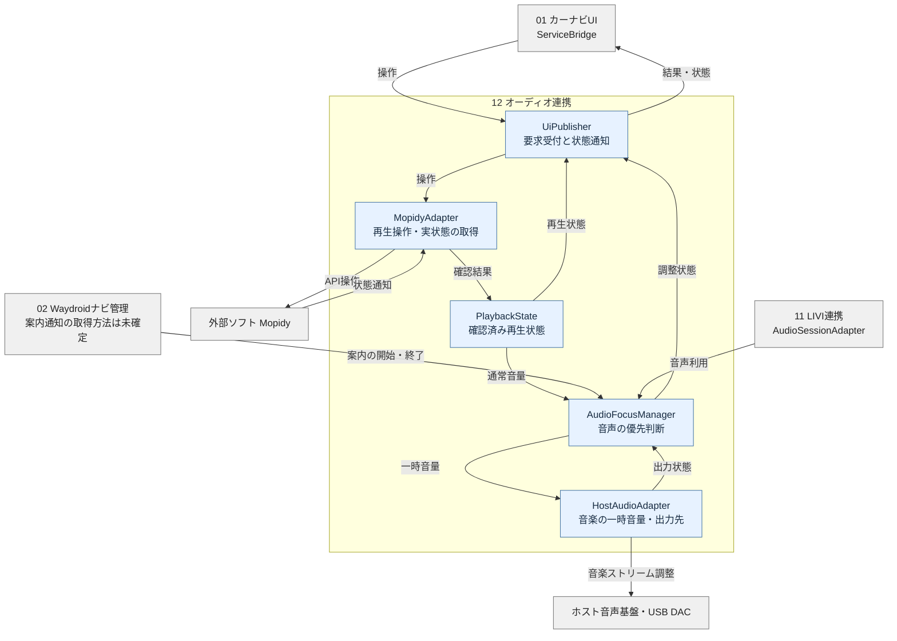
```mermaid
flowchart TB
 U["01 カーナビUI<br/>ServiceBridge"]
 subgraph SW["12 オーディオ連携"]
 direction TB
 P["UiPublisher<br/>要求受付と状態通知"]
 M["MopidyAdapter<br/>再生操作・実状態の取得"]
 S["PlaybackState<br/>確認済み再生状態"]
 F["AudioFocusManager<br/>音声の優先判断"]
 H["HostAudioAdapter<br/>音楽の一時音量・出力先"]
 P -->|操作| M
 M -->|確認結果| S
 S -->|再生状態| P
 S -->|通常音量| F
 F -->|一時音量| H
 H -->|出力状態| F
 F -->|調整状態| P
 end
 MP["外部ソフト Mopidy"]
 N["02 Waydroidナビ管理<br/>案内通知の取得方法は未確定"]
 L["11 LIVI連携<br/>AudioSessionAdapter"]
 HS["ホスト音声基盤・USB DAC"]
 U -->|操作| P
 P -->|結果・状態| U
 M -->|API操作| MP
 MP -->|状態通知| M
 N -->|案内の開始・終了| F
 L -->|音声利用| F
 H -->|音楽ストリーム調整| HS
 classDef own fill:#e7f2ff,stroke:#4776a5,color:#172b40
 classDef ext fill:#f0f0f0,stroke:#777,color:#222
 class P,M,S,F,H own
 class U,MP,I,N,L,HS ext
```

| 接続 | 受け渡す情報 |
| --- | --- |
| UiPublisher → MopidyAdapter | 検証済みのplay / pause / stop / 選曲 / 音量変更。 |
| MopidyAdapter → PlaybackState | 実プレイヤーの状態と確認時刻。API送信成功と再生確認を分ける。 |
| PlaybackState → AudioFocusManager | 最新の通常音量。案内中の低減値を通常音量に書き戻さない。 |
| 02 Waydroidナビ管理・11 LIVI連携 → AudioFocusManager | 確認可能な音声開始・更新・終了。音声データそのものとは別経路。 |
| AudioFocusManager → HostAudioAdapter | 現在の優先状態から求めたMopidy音楽専用ゲイン[注1]。 |
| HostAudioAdapter → AudioFocusManager | 指定DACと音楽ストリームの存在、適用結果。 |

<a id="dd-feature-flows"></a>

### 3.2 機能別処理フローチャート

各機能の開始条件、判断、正常・異常時の結果を示す。関数単位の入力と出力は3.7に記載する。

<a id="dd-feature-1"></a>

#### 3.2.1 音楽再生の操作（AUD-01）

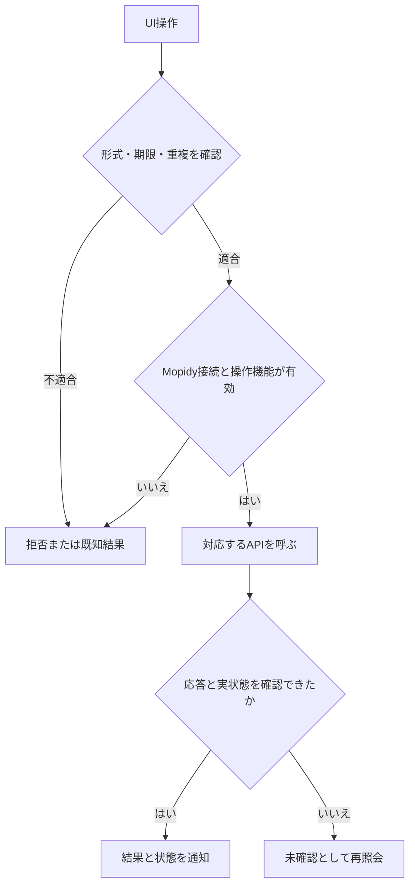
```mermaid
flowchart TB
 A["UI操作"] --> B{"形式・期限・重複を確認"}
 B -->|不適合| R["拒否または既知結果"]
 B -->|適合| C{"Mopidy接続と操作機能が有効"}
 C -->|いいえ| R
 C -->|はい| D["対応するAPIを呼ぶ"]
 D --> E{"応答と実状態を確認できたか"}
 E -->|はい| F["結果と状態を通知"]
 E -->|いいえ| G["未確認として再照会"]
```

<a id="dd-feature-2"></a>

#### 3.2.2 通常音量の変更と同期（AUD-02）

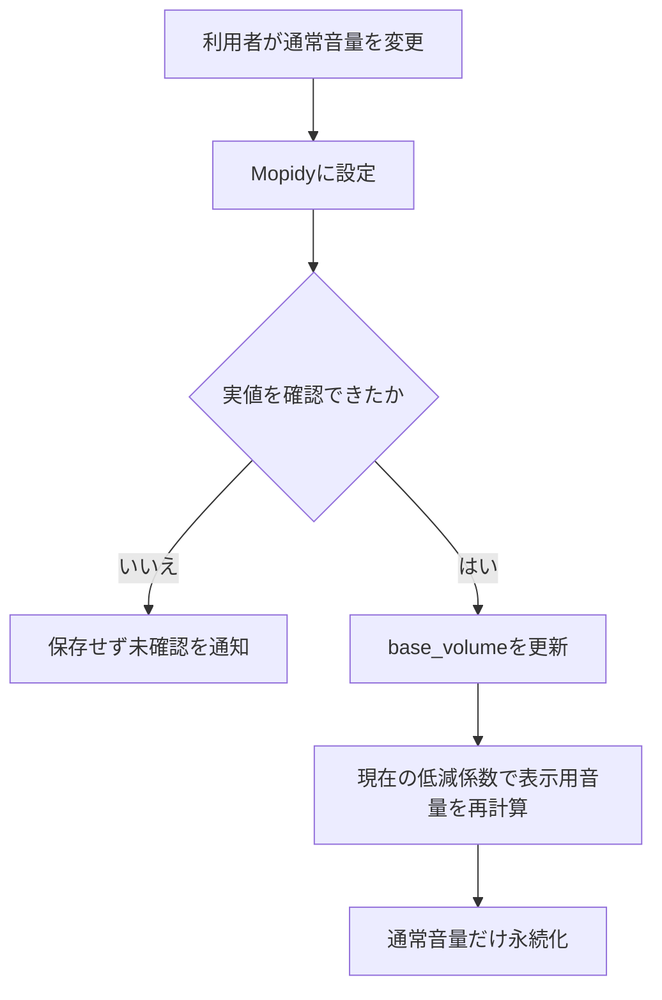
```mermaid
flowchart TB
 A["利用者が通常音量を変更"] --> B["Mopidyに設定"]
 B --> C{"実値を確認できたか"}
 C -->|いいえ| X["保存せず未確認を通知"]
 C -->|はい| D["base_volumeを更新"]
 D --> E["現在の低減係数で表示用音量を再計算"]
 E --> F["通常音量だけ永続化"]
```

<a id="dd-feature-3"></a>

#### 3.2.3 案内・通話中の音楽調整（AUD-03）

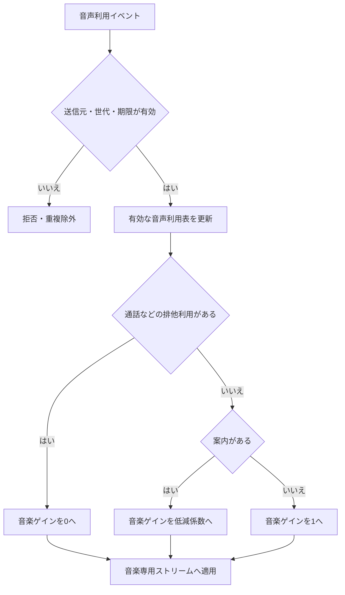
```mermaid
flowchart TB
 A["音声利用イベント"] --> B{"送信元・世代・期限が有効"}
 B -->|いいえ| R["拒否・重複除外"]
 B -->|はい| C["有効な音声利用表を更新"]
 C --> D{"通話などの排他利用がある"}
 D -->|はい| E["音楽ゲインを0へ"]
 D -->|いいえ| F{"案内がある"}
 F -->|はい| G["音楽ゲインを低減係数へ"]
 F -->|いいえ| H["音楽ゲインを1へ"]
 E --> I["音楽専用ストリームへ適用"]
 G --> I
 H --> I
```

<a id="dd-feature-4"></a>

#### 3.2.4 音声終了と残留調整の解消（AUD-04）

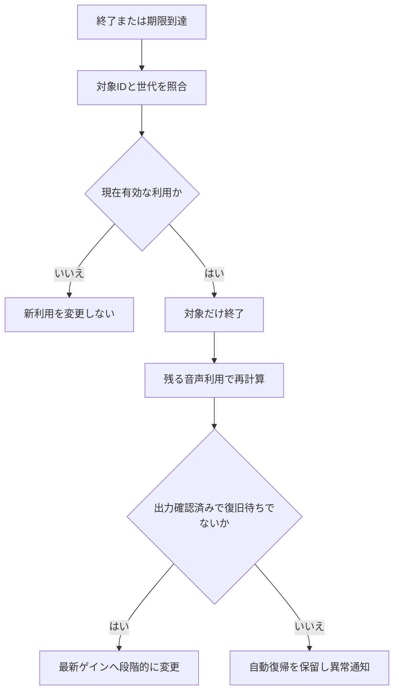
```mermaid
flowchart TB
 A["終了または期限到達"] --> B["対象IDと世代を照合"]
 B --> C{"現在有効な利用か"}
 C -->|いいえ| X["新利用を変更しない"]
 C -->|はい| D["対象だけ終了"]
 D --> E["残る音声利用で再計算"]
 E --> F{"出力確認済みで復旧待ちでないか"}
 F -->|はい| G["最新ゲインへ段階的に変更"]
 F -->|いいえ| H["自動復帰を保留し異常通知"]
```

<a id="dd-feature-5"></a>

#### 3.2.5 USB DACの監視と復帰（AUD-05）

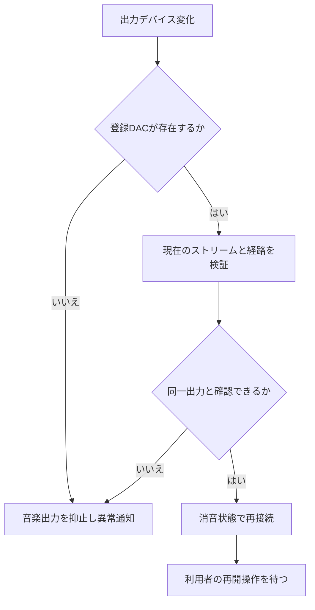
```mermaid
flowchart TB
 A["出力デバイス変化"] --> B{"登録DACが存在するか"}
 B -->|いいえ| C["音楽出力を抑止し異常通知"]
 B -->|はい| D["現在のストリームと経路を検証"]
 D --> E{"同一出力と確認できるか"}
 E -->|いいえ| C
 E -->|はい| F["消音状態で再接続"]
 F --> G["利用者の再開操作を待つ"]
```

<a id="dd-feature-6"></a>

#### 3.2.6 再接続・終了時の状態管理（AUD-06）

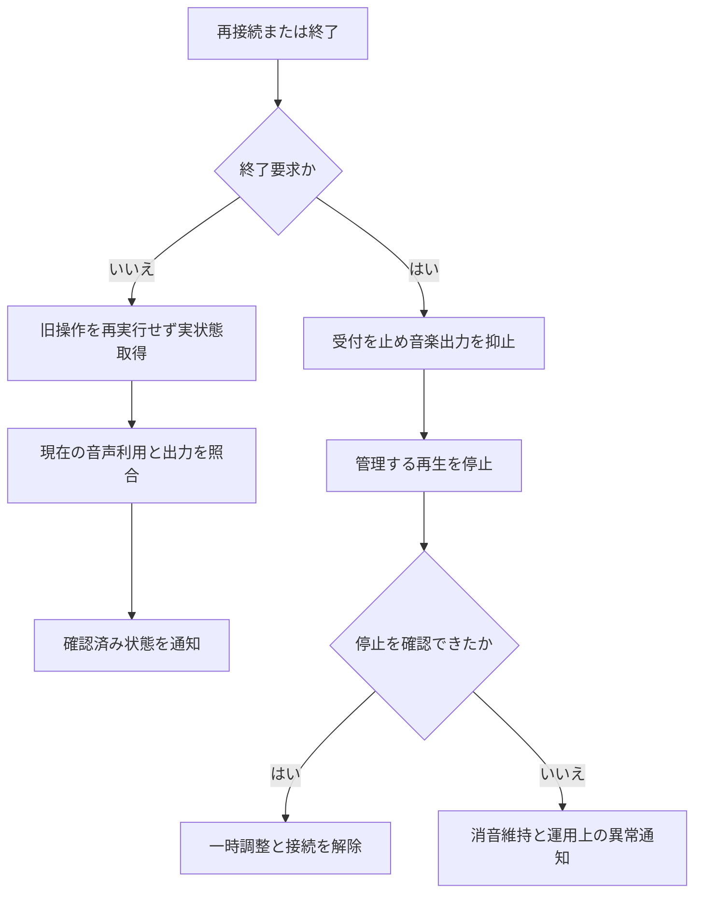
```mermaid
flowchart TB
 A["再接続または終了"] --> B{"終了要求か"}
 B -->|いいえ| C["旧操作を再実行せず実状態取得"]
 C --> D["現在の音声利用と出力を照合"]
 D --> E["確認済み状態を通知"]
 B -->|はい| F["受付を止め音楽出力を抑止"]
 F --> G["管理する再生を停止"]
 G --> H{"停止を確認できたか"}
 H -->|はい| I["一時調整と接続を解除"]
 H -->|いいえ| J["消音維持と運用上の異常通知"]
```

<a id="dd-module-tree"></a>

### 3.3 モジュールツリー

```text
audio_integration
|-- UiPublisher
|   |-- handle_command()
|   `-- publish_audio_status()
|-- MopidyAdapter
|   |-- execute_playback_command()
|   |-- set_base_volume()
|   `-- refresh_playback()
|-- PlaybackState
|   `-- 確認済み状態の検証・更新
|-- AudioFocusManager
|   |-- update_audio_session()
|   |-- expire_audio_sessions()
|   `-- recompute_focus()
|-- HostAudioAdapter
|   |-- apply_music_gain()
|   `-- reconcile_output()
`-- stop_audio_integration()
```

<a id="dd-sequence"></a>

### 3.4 モジュール間の処理順序

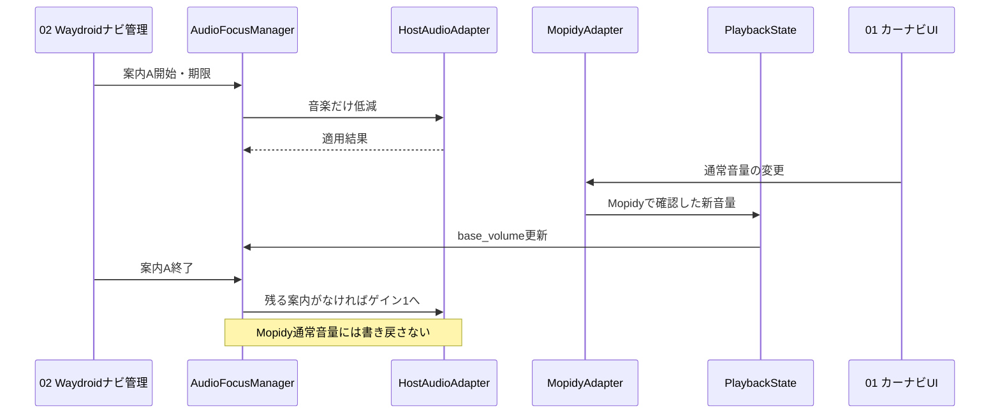
```mermaid
sequenceDiagram
 participant N as 02 Waydroidナビ管理
 participant F as AudioFocusManager
 participant H as HostAudioAdapter
 participant M as MopidyAdapter
 participant S as PlaybackState
 participant U as 01 カーナビUI
 N->>F: 案内A開始・期限
 F->>H: 音楽だけ低減
 H-->>F: 適用結果
 U->>M: 通常音量の変更
 M->>S: Mopidyで確認した新音量
 S->>F: base_volume更新
 N->>F: 案内A終了
 F->>H: 残る案内がなければゲイン1へ
 Note over F,H: Mopidy通常音量には書き戻さない
```

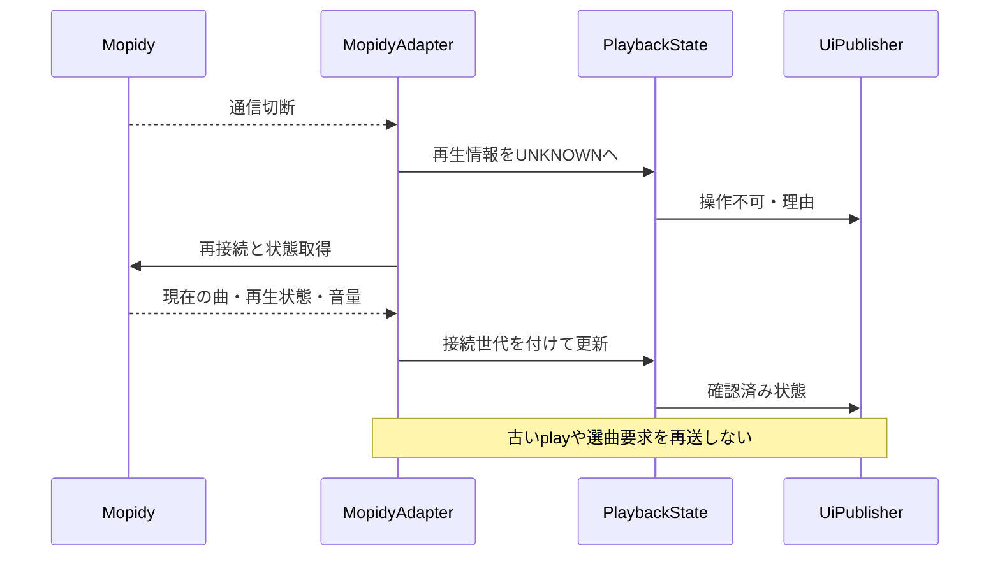
```mermaid
sequenceDiagram
 participant MP as Mopidy
 participant A as MopidyAdapter
 participant S as PlaybackState
 participant P as UiPublisher
 MP-->>A: 通信切断
 A->>S: 再生情報をUNKNOWNへ
 S->>P: 操作不可・理由
 A->>MP: 再接続と状態取得
 MP-->>A: 現在の曲・再生状態・音量
 A->>S: 接続世代を付けて更新
 S->>P: 確認済み状態
 Note over A,P: 古いplayや選曲要求を再送しない
```

図の案内開始・終了は論理契約。OsmAndから02 Waydroidナビ管理が確実に取り出す実装方法はT.B.Dであり、音声が聞こえるだけでこの通知が得られるとは扱わない。

<a id="dd-modules"></a>

### 3.5 モジュール詳細

既製APIの値と利用者向け状態を分ける。低減処理の所有者はAudioFocusManagerに一元化し、11 LIVI連携や01 カーナビUIが別々にUSB DAC全体の音量を変更しない。

<a id="dd-module-1"></a>

#### 3.5.1 MopidyAdapter（外部プレイヤーとの接続）

| 項目 | 内容 |
| --- | --- |
| 入力 | 検証済み再生操作、Mopidy応答・イベント。 |
| 出力 | CommandResult、確認済み再生状態、通常音量。 |
| 保持情報 | 接続世代、要求ID対応表、操作期限、取得中のイベント。 |
| 処理 | JSON-RPC操作と通知を処理する。再接続では状態を照会し直す。複数照会中にイベントが来た場合は影響項目を再取得し、不整合な組合せを確定扱いしない。 |
| 関数 | execute_playback_command / set_base_volume / refresh_playback |
| 異常時 | 未対応バックエンド、曲消失、API失敗を区別する。通信切断で実行結果が不明ならUNKNOWN。 |

<a id="dd-module-2"></a>

#### 3.5.2 PlaybackState（確認済み再生状態の保持）

| 項目 | 内容 |
| --- | --- |
| 入力 | MopidyAdapterの実状態、接続世代、確認時刻。 |
| 出力 | 変更通知と読み取り専用の状態一式。 |
| 保持情報 | 曲ID、再生状態、再生位置ms、base_volume、確認期限。 |
| 処理 | 古い接続世代を捨てる。再生位置は確認時刻とセットにし、UI推定表示と実測位置を区別する。通常音量の保存は確認済み値だけ。 |
| 関数 | refresh_playbackの結果を検証して反映する内部処理 |
| 異常時 | 不明値はnullとvalidityで表し、曲なし・音量0へ変換しない。 |

<a id="dd-module-3"></a>

#### 3.5.3 AudioFocusManager（音声優先度の管理）

| 項目 | 内容 |
| --- | --- |
| 入力 | 音声利用イベント、期限、通常音量、出力状態。 |
| 出力 | 目標music_gain、音声優先状態、適用要求の改訂番号。 |
| 保持情報 | 有効な音声利用表、focus_revision、現在と目標のゲイン。 |
| 処理 | EXCLUSIVEなら0、案内中は設定係数、通常は1を選ぶ。複数案内の係数は最小値を1回採用し、掛け重ねない。終了対象だけ除去する。 |
| 関数 | update_audio_session / expire_audio_sessions / recompute_focus |
| 異常時 | 通知機能未対応なら自動優先調整を無効化。相手の期限更新がない利用は終了扱いとし異常を通知。 |

<a id="dd-module-4"></a>

#### 3.5.4 HostAudioAdapter（音楽ストリームと出力先の制御）

| 項目 | 内容 |
| --- | --- |
| 入力 | 目標ゲイン、改訂番号、登録DAC、ホスト音声イベント。 |
| 出力 | 実適用ゲイン、出力可否、ストリーム識別子。 |
| 保持情報 | 音声基盤の接続世代、音楽ストリームID、出力デバイスID。 |
| 処理 | Mopidy音楽のみに一時ゲインを設定する。ストリーム生成・再生成時も最新の優先状態を反映する。DAC全体のマスター音量で低減を代用しない。 |
| 関数 | apply_music_gain / reconcile_output |
| 異常時 | 対象を特定できない場合は未対応とし、自動音量増加を行わない。再接続時の一瞬の大音量も経路設定の受入対象とする。 |

<a id="dd-module-5"></a>

#### 3.5.5 UiPublisher（操作受付と状態配信）

| 項目 | 内容 |
| --- | --- |
| 入力 | 01 カーナビUIの要求、確認済み再生情報、音声優先・出力情報。 |
| 出力 | 非同期応答、AudioStatus、操作可能機能。 |
| 保持情報 | command結果表、送信sequence、最新状態。 |
| 処理 | 許可操作と値範囲を検証し、重複操作を防ぐ。表示音量を通常設定と一時調整に分ける。遅いUIへは最新状態を送り続け古い状態を蓄積しない。 |
| 関数 | handle_command / publish_audio_status |
| 異常時 | 通信断で音楽サービスを停止しない。古い要求は復旧後に実行せず再照会を求める。 |

<a id="dd-files"></a>

### 3.6 ファイル構成

```text
src/raspberry_pi5/
|-- audio_integration_service.py     # 起動・終了の入口
`-- audio_integration/
    |-- mopidy_adapter.py
    |-- playback_state.py
    |-- audio_focus_manager.py
    |-- host_audio_adapter.py
    |-- ui_publisher.py
    `-- models.py
tests/audio_integration/
|-- test_playback.py
|-- test_base_volume.py
|-- test_audio_sessions.py
|-- test_output_recovery.py
`-- test_shutdown.py
```

作成予定の配置。実データ、秘密鍵、認証情報はソースや公開Gitへ含めない。

<a id="dd-function-flows"></a>

### 3.7 関数のフローチャート

再生・音量操作は利用者の意図と確認結果を分離する。以下の自作関数名はMopidyのAPI名とは異なる。

<a id="dd-fn-handle-command"></a>

#### 3.7.1 handle_command（UIの音楽操作を受け付ける）

| 項目 | 内容 |
| --- | --- |
| 担当 | UiPublisher |
| 入力 | command_id・操作名・引数・期限。 |
| 戻り値・結果 | 受付結果または拒否。 |

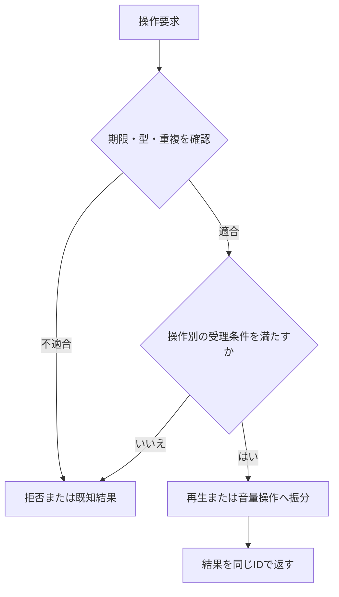
```mermaid
flowchart TB
 A["操作要求"] --> B{"期限・型・重複を確認"}
 B -->|不適合| R["拒否または既知結果"]
 B -->|適合| C{"操作別の受理条件を満たすか"}
 C -->|いいえ| R
 C -->|はい| D["再生または音量操作へ振分"]
 D --> E["結果を同じIDで返す"]
```

pause / stopは、DACが消失していてもMopidyへ接続できれば受理する。playや再生を伴う選曲は出力経路の確認を必要とする。RECOVERY_WAIT中の明示的な再開要求は、登録DAC・現在の音声利用・通常音量上限を再確認してから受理し、復旧待ちを解除する。通話が続いていれば再開後も音楽ゲイン0を維持する。

<a id="dd-fn-execute-playback-command"></a>

#### 3.7.2 execute_playback_command（再生命令をMopidyへ送る）

| 項目 | 内容 |
| --- | --- |
| 担当 | MopidyAdapter |
| 入力 | 許可操作・曲ID・接続世代。 |
| 戻り値・結果 | 操作結果と再照会結果。 |

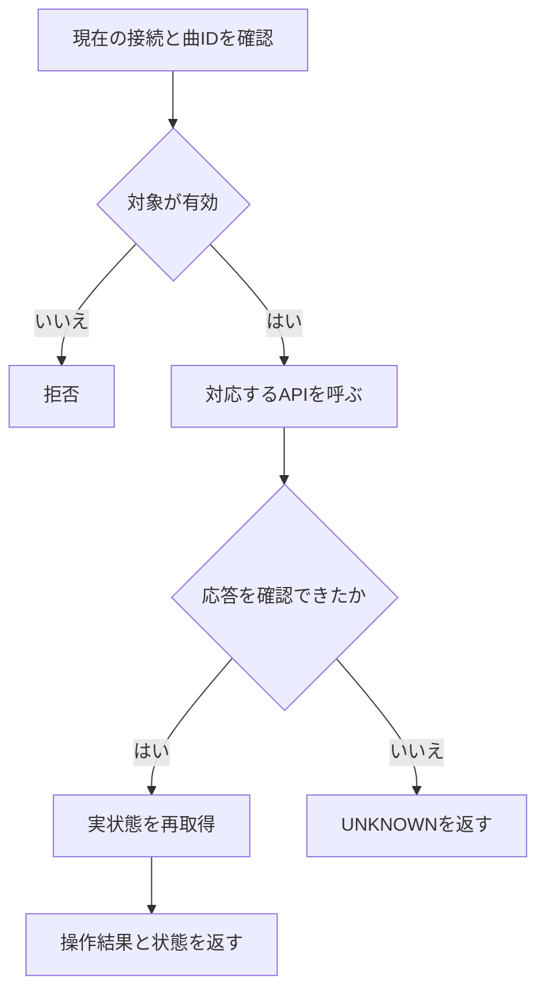
```mermaid
flowchart TB
 A["現在の接続と曲IDを確認"] --> B{"対象が有効"}
 B -->|いいえ| X["拒否"]
 B -->|はい| C["対応するAPIを呼ぶ"]
 C --> D{"応答を確認できたか"}
 D -->|はい| E["実状態を再取得"]
 D -->|いいえ| F["UNKNOWNを返す"]
 E --> G["操作結果と状態を返す"]
```

<a id="dd-fn-refresh-playback"></a>

#### 3.7.3 refresh_playback（現在の再生情報を取得する）

| 項目 | 内容 |
| --- | --- |
| 担当 | MopidyAdapter / PlaybackState |
| 入力 | 現在の接続世代・API応答・イベント。 |
| 戻り値・結果 | 確認時刻付き状態またはUNKNOWN。 |

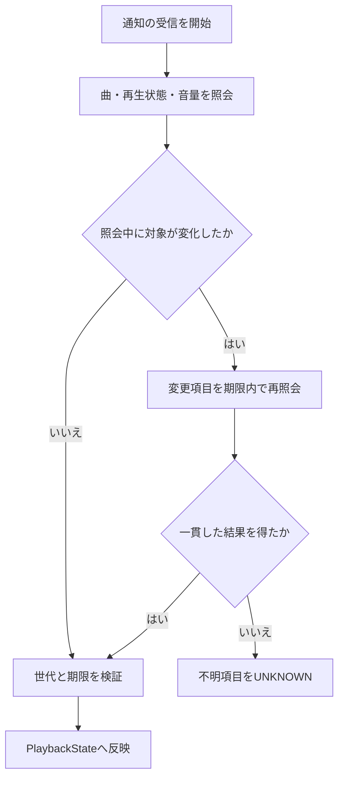
```mermaid
flowchart TB
 A["通知の受信を開始"] --> B["曲・再生状態・音量を照会"]
 B --> C{"照会中に対象が変化したか"}
 C -->|はい| D["変更項目を期限内で再照会"]
 D --> E{"一貫した結果を得たか"}
 C -->|いいえ| F["世代と期限を検証"]
 E -->|はい| F
 E -->|いいえ| X["不明項目をUNKNOWN"]
 F --> G["PlaybackStateへ反映"]
```

<a id="dd-fn-set-base-volume"></a>

#### 3.7.4 set_base_volume（利用者指定の通常音量を設定する）

| 項目 | 内容 |
| --- | --- |
| 担当 | MopidyAdapter |
| 入力 | 内部音量0〜1、要求ID。 |
| 戻り値・結果 | 確認済みbase_volume。 |

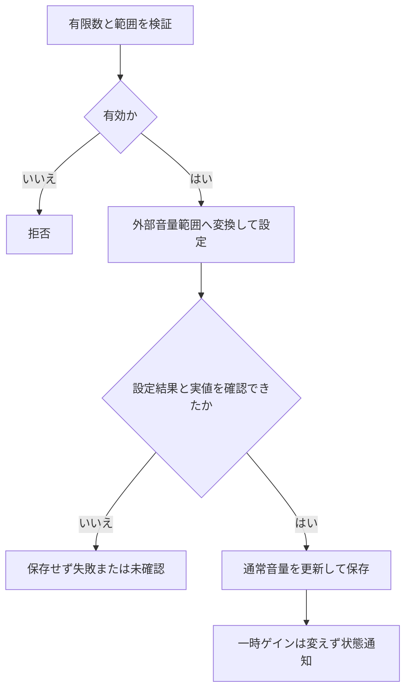
```mermaid
flowchart TB
 A["有限数と範囲を検証"] --> B{"有効か"}
 B -->|いいえ| X["拒否"]
 B -->|はい| C["外部音量範囲へ変換して設定"]
 C --> D{"設定結果と実値を確認できたか"}
 D -->|いいえ| E["保存せず失敗または未確認"]
 D -->|はい| F["通常音量を更新して保存"]
 F --> G["一時ゲインは変えず状態通知"]
```

<a id="dd-fn-update-audio-session"></a>

#### 3.7.5 update_audio_session（音声利用表を更新する）

| 項目 | 内容 |
| --- | --- |
| 担当 | AudioFocusManager |
| 入力 | ACQUIRE / RENEW / RELEASE、送信元・世代・ID。 |
| 戻り値・結果 | 受付結果とfocus_revision。 |

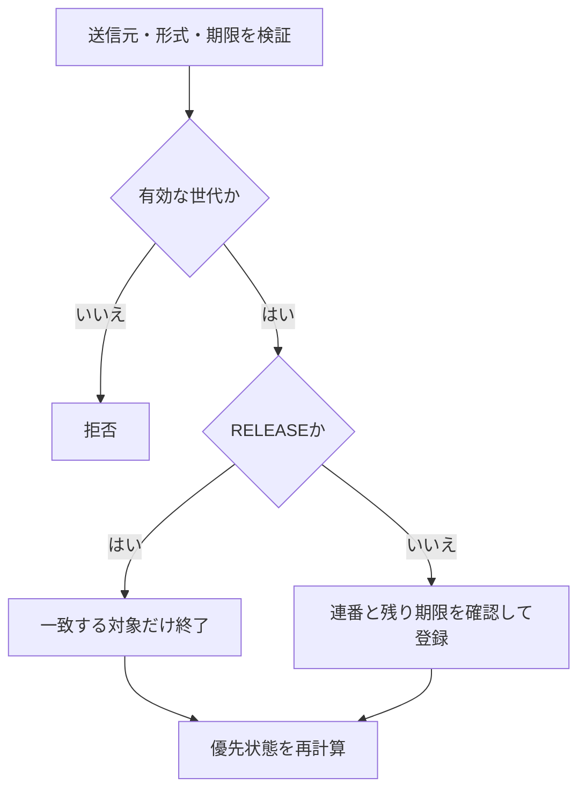
```mermaid
flowchart TB
 A["送信元・形式・期限を検証"] --> B{"有効な世代か"}
 B -->|いいえ| X["拒否"]
 B -->|はい| C{"RELEASEか"}
 C -->|はい| D["一致する対象だけ終了"]
 C -->|いいえ| E["連番と残り期限を確認して登録"]
 D --> F["優先状態を再計算"]
 E --> F
```

<a id="dd-fn-expire-audio-sessions"></a>

#### 3.7.6 expire_audio_sessions（期限切れの音声利用を解消する）

| 項目 | 内容 |
| --- | --- |
| 担当 | AudioFocusManager |
| 入力 | 有効表・現在の単調時刻。 |
| 戻り値・結果 | 期限切れを除いた表。 |

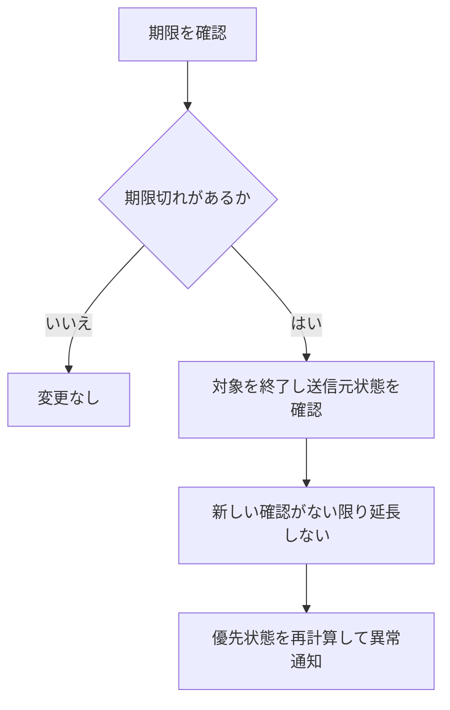
```mermaid
flowchart TB
 A["期限を確認"] --> B{"期限切れがあるか"}
 B -->|いいえ| E["変更なし"]
 B -->|はい| C["対象を終了し送信元状態を確認"]
 C --> D["新しい確認がない限り延長しない"]
 D --> F["優先状態を再計算して異常通知"]
```

<a id="dd-fn-recompute-focus"></a>

#### 3.7.7 recompute_focus（音楽の目標音量係数を決める）

| 項目 | 内容 |
| --- | --- |
| 担当 | AudioFocusManager |
| 入力 | 有効音声利用・base_volume・出力可否。 |
| 戻り値・結果 | 目標ゲインと調整状態。 |

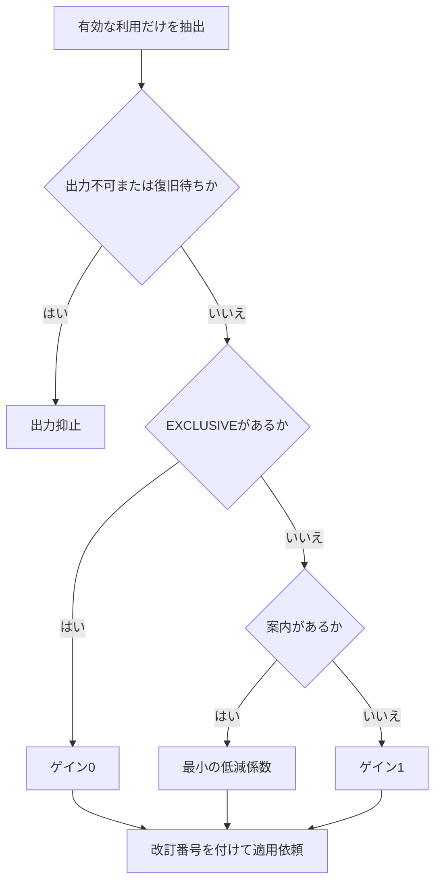
```mermaid
flowchart TB
 A["有効な利用だけを抽出"] --> B{"出力不可または復旧待ちか"}
 B -->|はい| X["出力抑止"]
 B -->|いいえ| C{"EXCLUSIVEがあるか"}
 C -->|はい| D["ゲイン0"]
 C -->|いいえ| E{"案内があるか"}
 E -->|はい| F["最小の低減係数"]
 E -->|いいえ| G["ゲイン1"]
 D --> H["改訂番号を付けて適用依頼"]
 F --> H
 G --> H
```

<a id="dd-fn-apply-music-gain"></a>

#### 3.7.8 apply_music_gain（音楽だけの一時音量を反映する）

| 項目 | 内容 |
| --- | --- |
| 担当 | HostAudioAdapter |
| 入力 | music_gain・focus_revision・出力世代。 |
| 戻り値・結果 | 適用済みゲインまたは失敗。 |

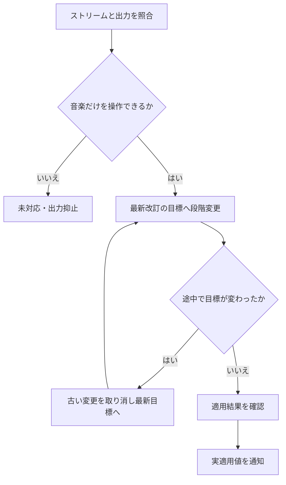
```mermaid
flowchart TB
 A["ストリームと出力を照合"] --> B{"音楽だけを操作できるか"}
 B -->|いいえ| X["未対応・出力抑止"]
 B -->|はい| C["最新改訂の目標へ段階変更"]
 C --> D{"途中で目標が変わったか"}
 D -->|はい| E["古い変更を取り消し最新目標へ"]
 E --> C
 D -->|いいえ| F["適用結果を確認"]
 F --> G["実適用値を通知"]
```

<a id="dd-fn-reconcile-output"></a>

#### 3.7.9 reconcile_output（登録DACと音楽経路を照合する）

| 項目 | 内容 |
| --- | --- |
| 担当 | HostAudioAdapter |
| 入力 | デバイス一覧・登録識別情報。 |
| 戻り値・結果 | 出力可否と現在の出力世代。 |

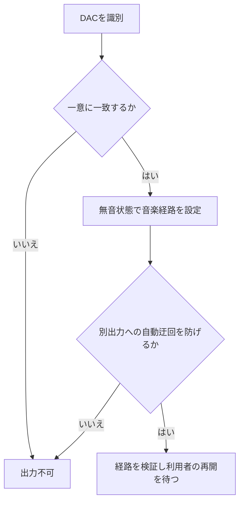
```mermaid
flowchart TB
 A["DACを識別"] --> B{"一意に一致するか"}
 B -->|いいえ| X["出力不可"]
 B -->|はい| C["無音状態で音楽経路を設定"]
 C --> D{"別出力への自動迂回を防げるか"}
 D -->|いいえ| X
 D -->|はい| E["経路を検証し利用者の再開を待つ"]
```

<a id="dd-fn-publish-audio-status"></a>

#### 3.7.10 publish_audio_status（音楽と音声調整の状態を通知する）

| 項目 | 内容 |
| --- | --- |
| 担当 | UiPublisher |
| 入力 | PlaybackState・優先状態・適用結果。 |
| 戻り値・結果 | AudioStatus。 |

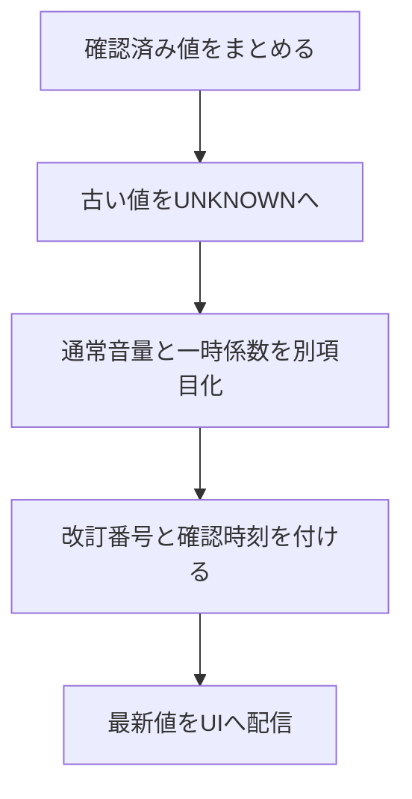
```mermaid
flowchart TB
 A["確認済み値をまとめる"] --> B["古い値をUNKNOWNへ"]
 B --> C["通常音量と一時係数を別項目化"]
 C --> D["改訂番号と確認時刻を付ける"]
 D --> E["最新値をUIへ配信"]
```

<a id="dd-fn-stop-audio-integration"></a>

#### 3.7.11 stop_audio_integration（音楽出力を抑えて終了する）

| 項目 | 内容 |
| --- | --- |
| 担当 | audio_integration_serviceの終了入口 |
| 入力 | 終了期限・再生状態・音声利用表。 |
| 戻り値・結果 | 終了結果または停止未確認。 |

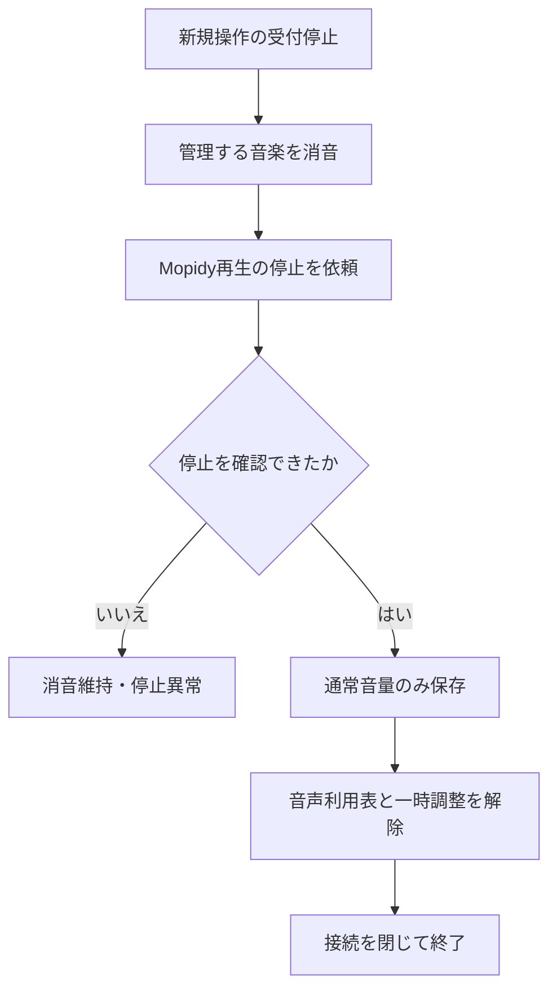
```mermaid
flowchart TB
 A["新規操作の受付停止"] --> B["管理する音楽を消音"]
 B --> C["Mopidy再生の停止を依頼"]
 C --> D{"停止を確認できたか"}
 D -->|いいえ| X["消音維持・停止異常"]
 D -->|はい| E["通常音量のみ保存"]
 E --> F["音声利用表と一時調整を解除"]
 F --> G["接続を閉じて終了"]
```

<a id="dd-4"></a>

## 4. インターフェース設計

<a id="dd-current-ui"></a>
### 4.0 現在のUI連携実装

```mermaid
flowchart LR
    View["MusicScreen.qml"] -->|"再生・選曲・音量・シーク"| Features["FeatureController.music"]
    Features -->|"画面と別の処理枠"| Client["MopidyClient"]
    Client <-->|"HTTP JSON-RPC"| Mopidy["Mopidy"]
    Client -->|"実状態の読戻し"| Features
    Features -->|"audio / musicLibrary"| View
```

- HTTP要求番号と応答番号を照合し、エラーまたは拒否応答を成功にしない。操作後に曲名・再生状態・時間・キュー・音量を読み戻す。
- `core.playback`のplay/pause/stop/next/previous/seek、`core.mixer`のget_volume/set_volume、`core.tracklist`のget_tl_tracks/add、`core.library.browse`を使用する。キュー内の選曲には`tlid`を渡す。APIは[Mopidy Core API](https://docs.mopidy.com/stable/reference/core/)と[HTTP API](https://docs.mopidy.com/stable/reference/http/)に従う。
- UIの照会周期は1秒、各HTTP要求のタイムアウトは2秒、最後の取得成功から5秒で更新停止とする。同じ照会・操作を重ねて送信しない。操作を再接続後に自動再送しない。
- 音源はMopidy側のライブラリを使用する。フォルダ・検索結果は全取得後に50件単位で表示し、先頭500件での切捨ては行わない。HTTP応答は2MBまで。応答サイズ超過時は失敗を表示する。仮の曲情報を表示しない。
- `core.library.search`、`core.playlists.as_list/lookup/create/save/delete`を使用する。プレイリスト編集は停車確認時、または車速そのものを取得できない警告付き代替モードで受け付ける。有効な走行車速がある場合や、停車確認期限だけが切れた場合は受け付けない。編集前の内容を保存/削除直前に照合し、外部変更時は拒否する。確認と保存の間の競合をAPI単体では排除できないため、運用中の編集元を単一UIに限定する。書込未対応バックエンドの拒否も利用者へ通知する。
- `AudioOutputMonitor.status`は`pactl --format=json list sinks`を3秒タイムアウトで照会する。`audio_sink_name`と`properties.device.bus=usb`を照合する。1秒周期・照会重複なし・結果5秒失効。接続表示はデバイスの存在だけであり、Mopidyの出力先一致や発音確認を意味しない。照会失敗は状態不明であり切断や回復と断定しない。
- 音量がnullのときは操作不可。ナビ案内による自動音量低減、USB DACの出力制御、独立音声管理プロセス、クラウド音源認証、音源スキャンは未実装。3章のAudioFocusManager/HostAudioAdapterによる経路保証は今後の設計であり、今回の存在監視では代替しない。
- UI終了でMopidy本体を終了しない。Mopidyの実音声出力と実車結合試験は別途実施する。

コマンドと状態は[00 共通仕様](00_共通仕様.md)へ合わせる。音声データの経路と、優先度を変更する通知の経路は別とする。

<a id="dd-official-music"></a>
#### 4.0.1 公式音楽サービスの画面管理

YouTube MusicとSpotifyは公式Webプレーヤーを使用する。Mopidyの非公式拡張や音声抽出処理には接続しない。契約・認証・検索・選曲・再生は公式サイトが担当し、自作UIは起動・表示・終了のみを担当する。YouTube Premium契約で利用する主音源はYouTube Musicとし、Spotifyを契約済みとは扱わない。

```mermaid
flowchart TB
    View["MusicScreen.qml<br/>音源選択・開く・終了"] --> Features["FeatureController<br/>観測済みMopidy再生の一時停止"]
    Features --> Controller["OfficialMusicController<br/>停車条件・画面選択・要求世代"]
    State["AppState<br/>車速の値と有効期限"] --> Controller
    Controller --> Browser["OfficialMusicBrowser<br/>専用プロセスとプロファイルの管理"]
    Browser -->|"許可済み公式URL"| Chromium["Chromium<br/>公式サイトの認証・再生"]
    Browser -->|"所有PID・コンテナIDのみ"| Sway["Sway<br/>音楽領域への配置・退避"]
    Chromium --> Audio["ホストの音声出力<br/>USB DAC等"]
```

| 実装・処理 | 入力と動作 | 保証しない内容 |
| --- | --- | --- |
| `select` / `open` / `stop` | 音源IDを許可リストで検証。YouTube MusicまたはSpotifyの音源ボタンを押すと、停車確認済みまたはOBD2車速未取得の警告付き代替モードで自動起動する。音源を変えたら前のブラウザを終了してから新しいブラウザを起動 | 有効な走行車速がある場合の起動、サイトへのログイン・再生成功 |
| `set_viewport` | QMLからウィンドウ内の論理ピクセル座標を受信。SwayのUI位置を加算 | QMLへの完全埋込み |
| `_sync` / `_tick` | 画面選択・停車確認またはOBD2未取得の代替状態・要求世代から表示可否を決定。別の実行枠で直列処理 | 有効な走行車速を受信した瞬間の完全な安全インターロック |
| `reconcile` | 所有PIDのウィンドウだけを配置・専用の非表示ワークスペースへ退避。`scratchpad show`の反復による表示反転は行わない | 個人ブラウザの制御、公式サービスの状態取得 |
| `_complete` | 古い要求世代の完了を捨て、失敗後の自動再起動を抑止 | 自動再ログイン・自動再生 |
| `close` | 所有ブラウザだけに終了要求。3秒応答しなければ強制終了を要求し2秒待つ。認証プロファイルは維持 | 電源断時のブラウザ終了・プロファイル保存完了 |

UIは500ms周期で配置状態を確認し、Swayの各要求は2秒で打ち切る。起動から20秒を超えてウィンドウが見つからなければ失敗とする。表示中に別画面へ移った場合は専用の非表示ワークスペースへ移動してブラウザとページ状態を保持し、音声継続は公式サイトに任せる。UI正常終了や別音源選択ではブラウザを閉じる。Mopidyの再生操作は公式ブラウザ終了後に再許可する。

認証情報は専用Chromiumプロファイル内で管理し、自作UIのJSON・ログ・Gitに取り込まない。UIの状態表示は「起動中」「公式画面を表示」「画面非表示」「失敗」であり、これを再生中やPremium認証済みと解釈しない。

導入・契約条件・確認手順は[付録9の3.1](../付録9_UI追加機能導入手順.md#official-music)を参照する。実Sway上の重なり・認証画面とポップアップ、YouTube Musicの実再生、SpotifyのARM64/DRM対応、USB DAC出力は未検証。ナビ案内中の公式音楽の自動音量低減も未実装である。

<a id="dd-interfaces"></a>

### 4.1 制御・音声の経路

```mermaid
flowchart TB
 UI["01 カーナビUI<br/>ServiceBridge"]
 subgraph AU["12 オーディオ連携"]
 P["UiPublisher"]
 M["MopidyAdapter"]
 F["AudioFocusManager"]
 H["HostAudioAdapter"]
 P --> M
 F --> H
 end
 MP["Mopidy"]
 WD["Waydroid / OsmAnd"]
 LI["LIVI"]
 MIX["ホスト音声基盤<br/>ストリームごとに合成"]
 DAC["USB DAC"]
 AMP["ACC連動アンプ"]
 UI -->|操作| P
 M -->|API| MP
 MP ==>|音楽データ| MIX
 WD ==>|案内音声| MIX
 LI ==>|電話側音声| MIX
 H -.->|音楽だけ一時調整| MIX
 MIX ==>|合成音声| DAC
 DAC ==> AMP
```

音声優先通知は02 Waydroidナビ管理・11 LIVI連携からAudioFocusManagerへ渡す。Android内の音声優先制御だけではLinux上のMopidyを制御できたことにならない。図のホスト音声基盤・接続設定は採用構成を実機で確定する。

<a id="dd-mopidy-api"></a>

### 4.2 Mopidy API対応

MopidyはHTTP JSON-RPCとWebSocketを提供し、WebSocketではイベントも受け取れる。本設計はWebSocketによる状態通知を候補とし、HTTP照会だけを通知代わりにはしない。接続先はローカルに限定する。[Mopidy HTTP API](https://docs.mopidy.com/stable/reference/http/)

| 内部操作 | 外部APIの候補 | 検証内容 |
| --- | --- | --- |
| 再生 | core.playback.play | 現在の再生リストと対象tlidを確認して実行。 |
| 一時停止・停止 | core.playback.pause / core.playback.stop | 操作前後の実状態を照会。 |
| 選曲 | core.tracklist.get_tl_tracks / core.playback.play | 現在リスト内のtlidを利用。URI追加を行う場合は別の検証済み処理に分ける。 |
| 状態確認 | core.playback.get_state / get_current_track / get_time_position | 時刻・接続世代付きで扱い、途中変更時は必要項目を再取得。 |
| 通常音量 | core.mixer.get_volume / set_volume | 外部の整数0〜100へ変換。nullは不明、false応答は失敗。 |
| 対応機能確認 | core.describeと設定済みバックエンド | APIがあることと、対象バックエンドで動作することを別に試験。 |

API名・音量範囲は[Mopidy Core API](https://docs.mopidy.com/stable/reference/core/)を参照し、採用バージョンで確認する。Mopidyで変更された状態を読み取り、自作UIに同じ結果を配信する。

<a id="dd-audio-contract"></a>

### 4.3 音声利用メッセージ

| フィールド | 意味・規則 |
| --- | --- |
| source / boot_id | 02 Waydroidナビ管理または11 LIVI連携の現在の起動を識別。 |
| connection_epoch / session_id | 同じ起動内の電話等の再接続と、一回の音声利用を識別。 |
| event / sequence | ACQUIRE / RENEW / RELEASEと送信順。同じID・順序の重複は再適用しない。 |
| kind | GUIDANCE / CALL / MEDIA等。種別と許可する優先度を送信元ごとに検証。 |
| valid_for_ms / age_ms_at_send | 音声利用の期限。受信時に経過時間を差し引き、再送で寿命を延長しない。 |
| result / reason | 受付結果と適用結果。音声デバイス操作を確認できない場合は適用成功にしない。 |

終了したsession_idは接続世代の間、再開不可として扱う。遅れて届いたACQUIREで復活させない。記録数に上限を設け、あふれた場合は旧通知を忘れて受理するのではなく、その送信元の状態を再照会して新世代から再開する。送信元再起動時も旧boot_idの利用を新しい利用で代用しない。

RENEWは現在有効なsession_idだけを更新し、未登録・終了済み・期限切れの利用を復活させない。継続中の音声が期限切れになった場合は、送信元が現在の音声利用を再確認し、新しいsession_idでACQUIREする。新しいboot_idは許可された相手との接続確立時に登録し、旧boot_idの遅延通知で上書きしない。

<a id="dd-5"></a>

## 5. データ・設定設計

音量は通常設定と一時調整を別の場所で扱う。自作UIはMopidy通常音量を操作し、AudioFocusManagerはホスト側の音楽専用ゲインを操作する。

<a id="dd-data"></a>

### 5.1 音量と再生データ

| 項目 | 型・意味 | 所有者 |
| --- | --- | --- |
| base_volume | 0〜1の確認済み通常音量。Mopidy値を正規化 | PlaybackState |
| music_gain | 0〜1。一時低減係数。0は音楽消音、1は低減なし | AudioFocusManager |
| effective_volume | base_volume × 実適用music_gain。表示用の相対値で実音圧ではない | UiPublisher |
| playback_state | playing / paused / stoppedとvalidity | PlaybackState |
| track_id / tlid | 現在の曲と再生リスト内の識別番号 | PlaybackState |
| position_ms / observed_at | 再生位置と確認時刻。未確認はnull | PlaybackState |
| active_audio_sessions | 有効な音声利用の集合 | AudioFocusManager |
| focus_revision | 目標ゲインを更新するごとに増加する整数 | AudioFocusManager |
| output_generation / music_stream_id | ホスト音声接続と現在の音楽ストリーム識別子 | HostAudioAdapter |
| selected_output / output_state | 登録DACと現在の使用可否 | HostAudioAdapter |

例：base_volume=0.6、music_gain=0.25ならeffective_volume=0.15。案内中に利用者が0.8へ変更した場合は0.2となり、案内終了後は0.8相当へ戻る。低減値0.2をMopidy通常音量として保存しない。係数0.25は計算例であり採用値ではない。

<a id="dd-config"></a>

### 5.2 設定と永続化

| 設定 | 検証・方針 |
| --- | --- |
| mopidy_endpoint | loopback接続候補。実ポート・認証・利用者権限を確定。 |
| allowed_operations / URI schemes | 操作名・曲識別子を検証。任意シェルや未許可URLを受け付けない。 |
| duck_gain / fade_ms | 0〜1の係数と正の変更時間。採用値は聞き取り・遅延試験で確定。 |
| focus_lease / renewal_interval | 種別ごとの期限。更新周期より長くし、欠落時の復帰時間を試験。 |
| output_identity | USB DACの安定識別情報。起動ごとに変わる一時的な番号だけで固定しない。 |
| music_stream_selector | Mopidy音楽だけを識別する条件。他の音声へ一致しないことを試験。 |
| startup_volume_limit | 起動・復帰時の通常音量上限。利用者設定と別に安全側の上限を持つ設計案。 |
| API timeout / queue limit | 全待機と操作結果表の容量に上限を設ける。 |

保存するのは確認済み通常音量、選択DAC、検証済み設定とする。音声利用表・途中操作・一時ゲインは復元しない。再生開始は利用者操作を待つ。保存失敗は再生操作と別の異常として通知する。音楽ファイルは07 Google Driveアップロード・削除の録画削除領域へ置かない。

<a id="dd-6"></a>

## 6. 処理・状態遷移

| 状態 | 条件 | 音楽側の処理 |
| --- | --- | --- |
| NORMAL | 有効な優先音声なし、出力確認済み | music_gain=1。 |
| DUCKING | 一つ以上の案内、排他利用なし | 案内用係数へ低減。係数を重複して掛けない。 |
| EXCLUSIVE | 通話等の排他利用が有効 | 音楽だけmusic_gain=0。初期設計は自動pause/playを使用しない。 |
| OUTPUT_UNAVAILABLE | DACまたは音楽経路が不明・消失 | 出力抑止。HDMI等へ自動迂回しない。 |
| RECOVERY_WAIT | 出力が戻り照合済み | 消音を維持し、利用者の再開操作を待つ。 |
| STOPPING | 終了要求 | 新規操作停止、音楽停止確認後に解放。 |

RECOVERY_WAITからは明示的な利用者の再開要求でのみ復帰する。DACの再接続通知や音声利用の終了通知だけでは解除しない。復帰時は残る音声利用を再評価してNORMAL / DUCKING / EXCLUSIVEを選び、以前のゲインをそのまま復元しない。

初期設計では通話中も音楽再生位置は進みうる。通話終了後に以前の曲位置へ戻すことや自動一時停止・再開は別の拡張課題とする。これにより、利用者が通話中に停止した音楽を終了イベントで勝手に再生しない。

自動低減機能が有効な間に通知経路が切れた場合は、その音声利用の期限内だけ現在の調整を保持する。期限後は古い利用を除外し、出力経路が確認できれば設定された時間で復帰する。状態を確認できない事実は警告として残す。

<a id="dd-7"></a>

## 7. 異常処理

| 異常 | 処理 | 禁止する処理 |
| --- | --- | --- |
| Mopidy通信断 | 再生情報UNKNOWN、要求の結果を照会可能な状態で保持 | 過去のplayの無条件再送。 |
| 自作UIと外部APIの状態競合 | Mopidyの最新確認値へ統一。自作UIに現在状態を通知 | 案内開始前の音量を上書き復元。 |
| 一時ゲイン操作不能 | 自動低減不可を通知。対応する経路が整うまで有効化しない | DACマスターを下げて案内・通話まで低減。 |
| DAC消失 | 音楽出力抑止、利用者へ警告、再接続時は確認待ち | 別出力への自動大音量切替。 |
| 音声終了通知欠落 | 期限で対象を終了し現在の状態を再計算 | 無期限の低減継続。 |
| 旧終了・重複開始 | ID・世代・sequenceで除外 | 新しい通話を旧終了で解除。 |
| ゲイン変更中の優先度変更 | 古い改訂の変更処理を中止し最新目標へ | 古いフェード完了による音量復帰。 |
| 停止確認不能 | 消音を維持できる運用経路を使い停止異常を報告 | 停止前にmusic_gain=1へ戻す。 |
| 本ソフト強制終了 | 外部音声基盤に残るゲインと経路を復旧時に照合 | 再起動しただけで一時ゲインが解除済みと仮定。 |

<a id="dd-8"></a>

## 8. 起動・終了・運用設計

ホスト音声基盤とMopidyが使える利用者・権限で起動する。状態通知の受信を開始し、Mopidyの実状態と登録DACを確認してから操作可能にする。起動直後に保存音量を無条件適用したり、自動再生したりしない。

音声基盤の設定ではMopidy専用経路の識別、DAC消失時の迂回禁止、再生成時の消音または現在ゲイン継承を確認する。Python側から消失通知を受けて止めるだけでは、通知前の短い誤出力を防げないため、経路側で抑止できることを採用条件とする。

通常終了は新規受付停止 → 音楽消音 → 管理する再生停止確認 → 通常音量保存 → 一時調整解除 → 接続終了の順。Mopidyプロセス自体は別サービスなら終了しない。強制終了時のゲイン残留を監視・復旧できるホスト設定は実装課題とする。

アンプのACC OFFでの電源断はハードウェア動作であり、音声停止完了の通知を返すものではない。クリック音・音切れ・再接続時の音量は停車中の実機で確認する。

<a id="dd-9"></a>

## 9. 試験・受入条件

モックAPIによる単体試験、採用Mopidyとの結合試験、USB DACを使う停車中の音声試験を分ける。以下は試験計画。

<a id="dd-tests"></a>

### 9.1 単体・結合試験

| 試験ID | 条件 | 受入条件 |
| --- | --- | --- |
| AUD-T01 | play / pause / stop / 選曲 | 実状態がUIへ反映され、送信のみで成功扱いしない。 |
| AUD-T02 | 同じIDで選曲を再送 | 重複追加・重複操作なし。 |
| AUD-T03 | 案内中に自作UIから音量変更 | base_volumeのみ更新され、終了後に最新値へ戻る。 |
| AUD-T04 | 案内AとBが重なる | 係数が掛け重ならず、片方終了では通常音量へ戻らない。 |
| AUD-T05 | 案内中に通話開始 | 音楽は消音。通話終了後も案内が残れば低減状態。 |
| AUD-T06 | 通話中に利用者が停止 | 通話終了でplayが発行されない。 |
| AUD-T07 | 終了欠落・旧世代終了 | 期限で残留解消、新利用は旧通知で解除されない。 |
| AUD-T08 | ゲイン復帰途中で新通話 | 旧フェードが最新の消音を上書きしない。 |
| AUD-T09 | Mopidy再起動 | 状態を再照会し古い再生命令を再送しない。 |
| AUD-T10 | DAC抜差し | 別出力への短時間の迂回もなく、復帰後は利用者再開待ち。 |
| AUD-T11 | 本ソフト強制終了・再起動 | 音量の残留を検出し、急な増音なしに状態を再構成。 |
| AUD-T12 | 音声通知未対応 | 自動低減を有効表示せず通常再生のみ利用可能。 |
| AUD-T13 | 音楽・案内・通話を同時入力 | 音楽だけが低減され、案内と通話の指定経路が維持。 |
| AUD-T14 | 音量null / false応答 / NaN入力 | 不明・失敗・不正値を区別し、通常音量0へ書換えない。 |
| AUD-T15 | 終了時にMopidy停止失敗 | 通常ゲインへ急復帰せず、停止未確認を通知。 |
| AUD-T16 | DAC消失中のpause / stop | Mopidyが応答可能なら操作を受理し、出力不明を理由に拒否しない。 |
| AUD-T17 | RECOVERY_WAIT中の明示的な再開 | 経路を再確認して復帰。通話中なら音楽消音を維持し、音声終了だけでは復旧待ちを解除しない。 |
| AUD-T18 | 期限切れ後のRENEW | 旧利用を復活させず、確認済みの新しいACQUIREを待つ。 |

<a id="dd-10"></a>

## 10. 未確定事項・実装課題

| 項目 | 確定事項 | 採用条件 |
| --- | --- | --- |
| Mopidy | 採用バージョン・バックエンド・接続設定 | 再生・曲ID・音量の結合試験合格。 |
| ホスト音声基盤 | PipeWire等の採用方式と操作API | 音楽専用ゲイン、DAC固定、誤迂回防止を実現。 |
| OsmAnd案内通知 | 02 Waydroidナビ管理での開始・終了の取得方法 | 案内ごとのIDと期限を供給できる。 |
| LIVI音声通知 | 11 LIVI連携での種別・期限の取得方法 | 電話接続だけを通話開始として扱わない。 |
| 通常音量同期 | 自作UIと外部APIの競合・保存タイミング | Mopidy実値へ収束、一時係数が混入しない。 |
| 低減係数・変更時間 | 実機での聞き取りと遅延評価 | 急な増音なし、案内が埋もれない。 |
| 強制終了時 | ゲイン残留・デバイス復帰のホスト側管理 | 再起動まで誤出力せず、復旧操作が明確。 |
| 拡張機能 | 通話中の自動一時停止・終了時の再開 | 利用者操作と競合しない所有権判定を別途設計。 |

<a id="dd-glossary"></a>

## 用語の注釈

| 番号 | 用語 | 説明 |
| --- | --- | --- |
| 注1 | ゲイン | 音量へ掛ける係数。ここでは通常音量を変えず、音楽だけ一時的に小さくする係数。 |
| 注2 | ダッキング | 案内を聞き取りやすくするため、音楽の音量を一時的に下げる処理。 |
| 注3 | 音声ストリーム | Mopidyの音楽、OsmAndの案内など、合成前の個別の音声の流れ。 |
| 注4 | 音声利用セッション | 一回の案内や通話を開始から終了まで識別する単位。 |
| 注5 | 状態の再取得 | 接続復旧時に記憶した値を使わず、外部ソフトへ現在の値を問い合わせ直す処理。 |
