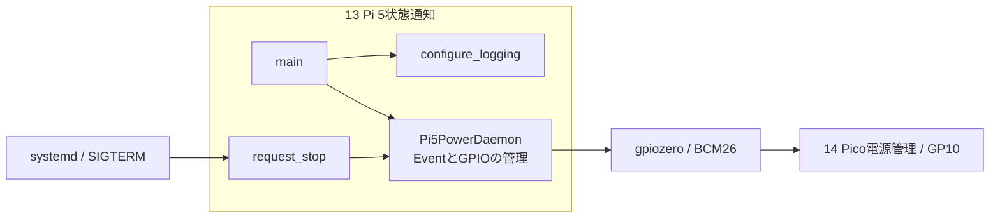
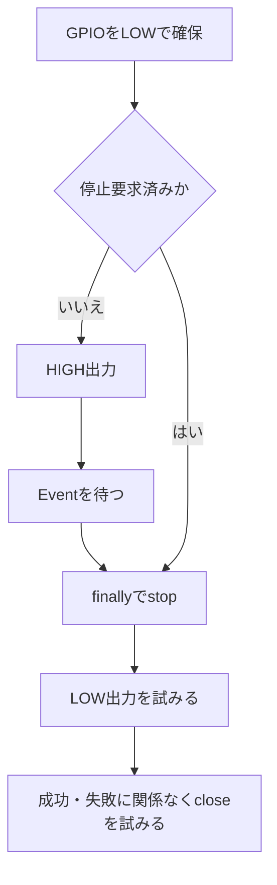
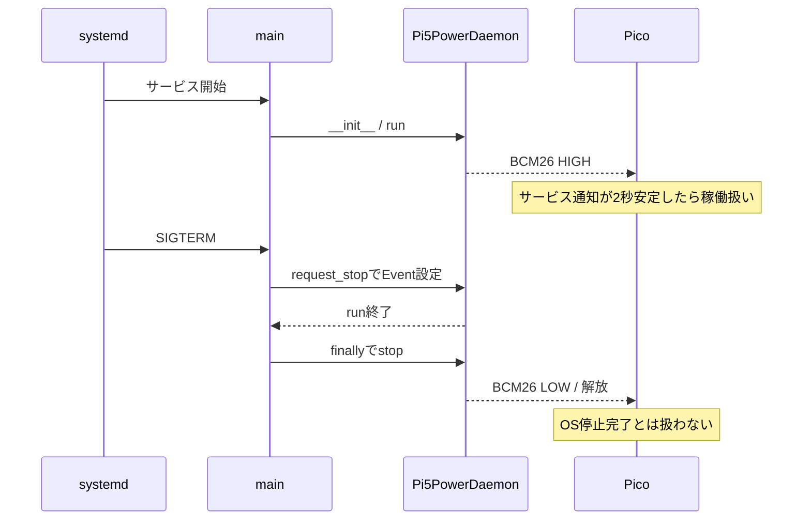
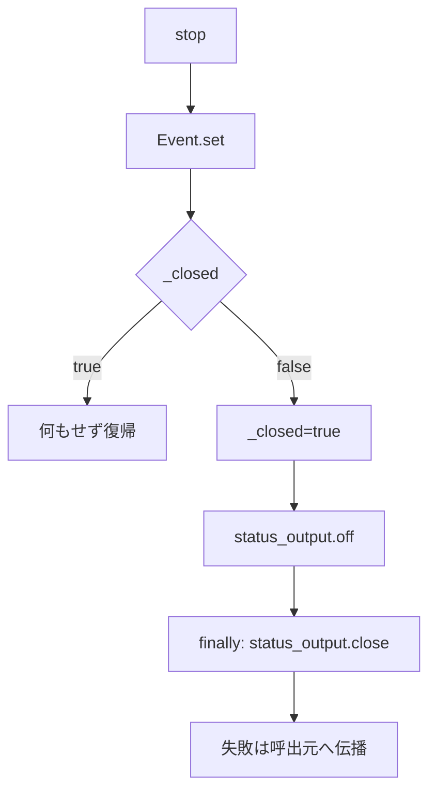

# Pi 5状態通知デーモン 詳細設計書

| 項目 | 内容 |
| --- | --- |
| 文書ID | SW-DD-13 |
| 実行環境 | Raspberry Pi 5 / Python 3 / gpiozero |
| 実装状態 | 通知解除と後処理を修正済み。実機受入は未実施 |
| 対象ソース | [pi5_power_daemon.py](../../../src/raspberry_pi5/pi5_power_daemon.py) |
| 更新日 | 2026-09-25 |

[詳細設計一覧](README.md) / [共通仕様](00_共通仕様.md) / [上位設計](../ソフトウェア設計図.md#sec-41)

## 目次
- [1. 目的・適用範囲](#dd-1)
- [2. 要求仕様・役割](#dd-2)
- [3. 内部構成](#dd-3)
  - [3.1 モジュールの全体構成](#dd-overview)
  - [3.2 機能別処理フローチャート](#dd-feature-flows)
  - [3.3 モジュールツリー](#dd-module-tree)
  - [3.4 モジュール間の処理順序](#dd-sequence)
  - [3.5 モジュール詳細](#dd-modules)
  - [3.6 ファイル構成](#dd-files)
  - [3.7 関数のフローチャート](#dd-function-flows)
- [4. インターフェース設計](#dd-4)
- [5. データ・設定設計](#dd-5)
- [6. 処理・状態遷移](#dd-6)
- [7. 異常処理](#dd-7)
- [8. 起動・終了・運用設計](#dd-8)
- [9. 試験・受入条件](#dd-9)
- [10. 未確定事項・実装課題](#dd-10)

<a id="dd-1"></a>
## 1. 目的・適用範囲

GPIO26で通知サービスの稼働をPicoへ伝える。J2操作は[14 Pico電源管理](14_Pico電源管理.md)、OSの終了はOS側が担当する。5V給電は遮断しない。

**HIGHは本サービスの通知出力、LOWは通知なしである。LOWをOS停止完了・SSD同期完了・再起動許可として使用しない。** SIGTERM、サービス再起動、異常終了、未起動、断線をGPIO1本で区別することはできない。HIGHの固定出力も、プロセスが固まっていないことを保証しない。

<a id="dd-2"></a>
## 2. 要求仕様・役割

<a id="dd-functions"></a>
### 2.1 機能一覧

| ID | 機能 | 実現する動作 |
| --- | --- | --- |
| PWR5-01 | 初期化 | BCM番号を検証し、LOWでGPIOを確保する。ライブラリは実機初期化時に読み込む |
| PWR5-02 | 稼働通知 | 停止要求がまだなければHIGHにし、Eventを最大1秒ずつ待つ |
| PWR5-03 | 停止要求受付 | SIGTERM/SIGINTではEventだけを設定する。シグナル内でGPIOを解放しない |
| PWR5-04 | 通知解除 | mainのfinallyでLOW化と解放を実行する。LOW化失敗時もcloseを試みる |
| PWR5-05 | 重複後処理防止 | stopを複数回呼んでもGPIO操作は最初の一度に限定する |

<a id="dd-function-map"></a>
### 2.2 機能・モジュール・関数の対応

| 機能 | モジュール | 関数 |
| --- | --- | --- |
| 初期化・常駐 | Pi5PowerDaemon | __init__ / run |
| OSシグナル受付 | main / Pi5PowerDaemon | main内のrequest_stop / Pi5PowerDaemon.request_stop |
| 通知解除 | Pi5PowerDaemon | stop |
| 起動順序・ログ | main / configure_logging | main / configure_logging |

<a id="dd-3"></a>
## 3. 内部構成

<a id="dd-overview"></a>
### 3.1 モジュールの全体構成



<a id="dd-feature-flows"></a>
### 3.2 機能別処理フローチャート



<a id="dd-module-tree"></a>
### 3.3 モジュールツリー

```text
pi5_power_daemon.py
  main
    configure_logging
    Pi5PowerDaemon
      __init__
      run
      request_stop
      stop
```

<a id="dd-sequence"></a>
### 3.4 モジュール間の処理順序



<a id="dd-modules"></a>
### 3.5 モジュール詳細

| モジュール | 入力 | 出力・責務 |
| --- | --- | --- |
| main | OSシグナル | ログ設定、生成、シグナル登録、runとfinallyの順序管理 |
| Pi5PowerDaemon | Event、GPIO番号 | HIGH通知、LOW化、close。OSシャットダウン自体は実行しない |
| configure_logging | ログレベル環境変数 | 時刻・レベル付きの標準ログ |

シグナルによる停止要求と実際のGPIO解放を分離し、run中のGPIO操作にcloseが割り込む問題を避ける。__init__成功後は、シグナル登録時の例外もfinallyの対象とする。

<a id="dd-files"></a>
### 3.6 ファイル構成

| ファイル | 用途 |
| --- | --- |
| src/raspberry_pi5/pi5_power_daemon.py | 常駐処理 |
| src/raspberry_pi5/systemd/pi5-power-daemon.service | 導入用systemdユニット |
| tests/power/test_power_management.py | GPIO代替オブジェクトによる試験 |

<a id="dd-function-flows"></a>
### 3.7 関数のフローチャート

#### request_stop（停止要求の記録）


#### stop（通知解除と解放）



_closedは後処理を一度開始したことを示す。GPIOドライバがclose自体で失敗した場合に、電気的な解放を保証する意味ではない。

<a id="dd-4"></a>
## 4. インターフェース設計

| 信号 | 接続 | 意味 |
| --- | --- | --- |
| BCM26 / 物理37 | Pico GP10 / 物理14 | HIGH: 通知出力中。LOW/Hi-Z: 通知なし、OS状態は未確認 |
| GND | Pi 5とPicoの共通GND | 3.3Vロジックの基準 |
| SIGTERM / SIGINT | OSからmainへ | プロセス終了要求。OS終了専用通知ではない |

通知解除と停止完了を区別する詳細は[14 Pico電源管理の状態遷移](14_Pico電源管理.md#dd-6)を参照する。Picoは停止要求後にLOWを受信しても再起動を自動許可しない。

<a id="dd-5"></a>
## 5. データ・設定設計

| 設定・変数 | 値・意味 |
| --- | --- |
| PI5_STATUS_GPIO | 既定26。BCM番号0～27のみ。変更時は競合と配線を別途確認 |
| PI5_POWER_DAEMON_LOG_LEVEL | 既定INFO |
| _stop_requested | threading.Event。終了要求を記録 |
| _closed | 後処理の重複実行を防止 |
| output_factory | 単体試験用のGPIO生成差替え。実機はgpiozero.OutputDevice |

<a id="dd-6"></a>
## 6. 処理・状態遷移

初期LOW → runでHIGH → 終了要求 → LOW化 → GPIO解放。
run開始前に終了要求を受けていればHIGHにしない。これはサービスの状態遷移であり、Pi 5本体の起動・停止状態とは一致しない。

<a id="dd-7"></a>
## 7. 異常処理

- off失敗時もfinallyでcloseを試みる。エラーは握り潰さない。
- SIGKILL、OS停止、電源断ではPythonのfinallyを保証できない。
- GPIOの保持HIGHだけでは通知サービスの生存監視にならない。
- 不明状態のPicoは起動パルスを出さない。固定秒数を待つだけで停止完了に置き換えない。

<a id="dd-8"></a>
## 8. 起動・終了・運用設計

導入手順は[HW付録5](../../HW設計/付録5_RaspberryPi5_GPIO26状態通知設定.md)を参照する。
ユニットはbasic.targetの後で起動し、multi-user.targetから有効化する。同一ターゲットへのAfterとWantedByによる順序競合を避ける。異常終了時のみ2秒後に再起動し、60秒に5回までに制限する。

サービス再起動は通知の再開であって、Pi 5への起動指示ではない。停止処理中のPicoのロック解除には使用できない。

<a id="dd-9"></a>
## 9. 試験・受入条件

単体試験はtests/power/test_power_management.pyに実装する。2026-09-25にWindows上の模擬GPIO・模擬時刻で、Pi 5側とPico側を合わせた23件の合格を確認した。実機GPIO・MicroPython・systemdの動作検証は未実施。

| 試験 | 合格条件 |
| --- | --- |
| 停止要求後のrun | HIGHを出力しない |
| シグナル相当のrequest_stop | GPIOをその場でcloseしない |
| stopを2回 | off/close各1回 |
| off例外 | closeが実行される |
| 不正GPIO | GPIO確保前にエラー |
| デーモン再起動とACC操作の組合せ | PicoがLOWだけを理由に起動パルスを出さない |

実機ではsystemctl restart/stop、kill、通知線断線、OSシャットダウンを別々に試す。GPIO電圧・パルスと実際のOS状態を同時記録する。単体試験の合格を車載受入の代替にしない。

<a id="dd-10"></a>
## 10. 未確定事項・実装課題

停止完了の独立した確認方法が未実装のため、無人でのACC連動再起動は未完成。GPIO26のLOW、サービス停止フック、単なる待ち時間を停止完了の根拠にしない。

gpio-poweroffを安易な代用品にしない。公式説明では通常の電源停止順序へ介入し、外部で給電を遮断する仕組みを要求している。常時5V給電の現構成にそのまま追加せず、別途電源回路とPi 5実機で評価する。
参考: [Raspberry Pi公式オーバーレイ説明](https://github.com/raspberrypi/firmware/blob/master/boot/overlays/README)のgpio-poweroff。
