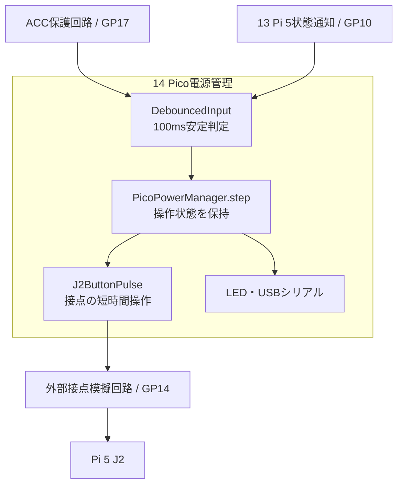
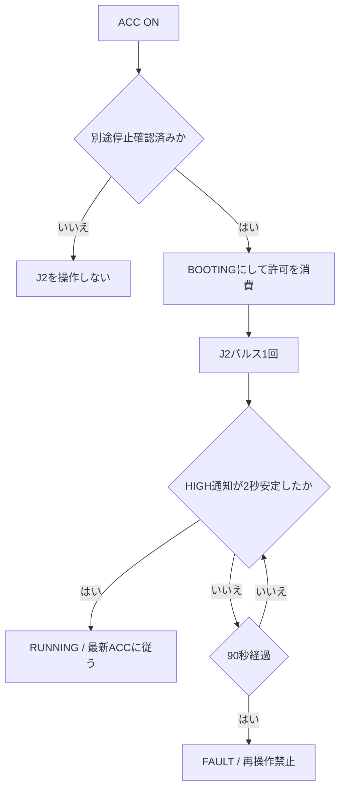
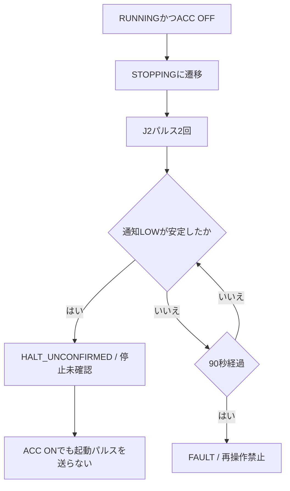
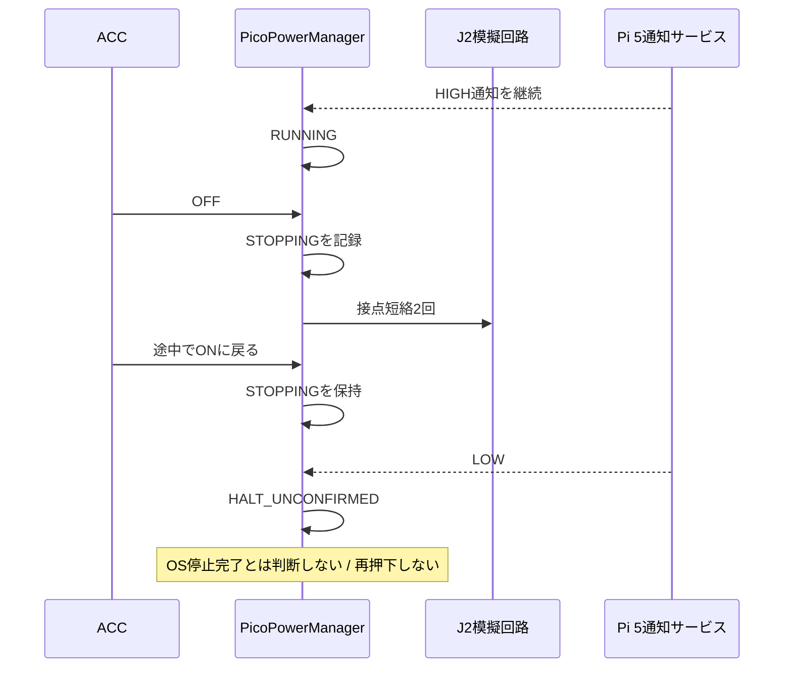
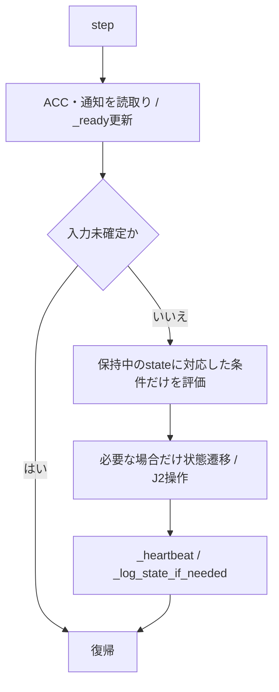
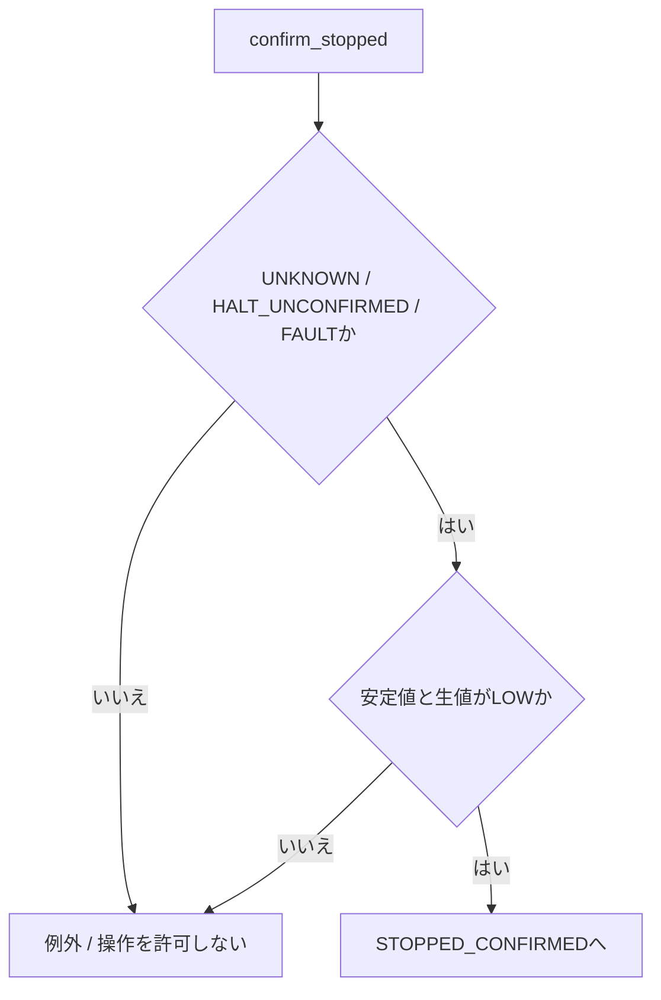

# Pico電源管理 詳細設計書

| 項目 | 内容 |
| --- | --- |
| 文書ID | SW-DD-14 |
| 実行環境 | Raspberry Pi Pico / MicroPython |
| 実装状態 | 状態保持・再押下防止を実装。停止完了の自動検証は未実装 |
| 対象ソース | [pico_power_manager.py](../../../src/raspberry_pico/pico_power_manager.py) |
| 更新日 | 2026-09-25 |

[詳細設計一覧](README.md) / [共通仕様](00_共通仕様.md) / [上位設計](../ソフトウェア設計図.md#sec-41)

## 目次
- [1. 目的・適用範囲](#dd-1)
- [2. 要求仕様・役割](#dd-2)
- [3. 内部構成](#dd-3)
  - [3.1 モジュールの全体構成](#dd-overview)
  - [3.2 機能別処理フローチャート](#dd-features)
  - [3.3 モジュールツリー](#dd-tree)
  - [3.4 モジュール間の処理順序](#dd-sequence)
  - [3.5 モジュール詳細](#dd-modules)
  - [3.6 ファイル構成](#dd-files)
  - [3.7 関数のフローチャート](#dd-functions-flow)
- [4. インターフェース設計](#dd-4)
- [5. データ・設定設計](#dd-5)
- [6. 処理・状態遷移](#dd-6)
- [7. 異常処理](#dd-7)
- [8. 起動・終了・運用設計](#dd-8)
- [9. 試験・受入条件](#dd-9)
- [10. 未確定事項・実装課題](#dd-10)

<a id="dd-1"></a>
## 1. 目的・適用範囲

ACCとPi 5の通知を監視し、外部リレー回路でJ2電源ボタン接点を操作する。5V電源は遮断しない。アンプ用ACC連動リレーは対象外。

**GPIO26→GP10のLOWは停止未確認であり、OS停止完了ではない。通知サービスの停止・再起動をPi 5本体の停止と取り違えない。**

既存配線だけでは完全自動の停止確認を実現できない。起動直後もUNKNOWNとしてJ2を操作せず、通知HIGHを待つ。停止後の再起動は保守者による別途の停止確認が必要であり、ACCだけで無人再起動する仕様ではない。

<a id="dd-2"></a>
## 2. 要求仕様・役割

<a id="dd-functions"></a>
### 2.1 機能一覧

| ID | 機能 | 実現する動作 |
| --- | --- | --- |
| PICO-01 | 入力安定判定 | 初回を含め100ms同じ候補値を待つ。未確定はNone。HIGH通知はさらに2秒継続を確認する |
| PICO-02 | 起動指示 | 別途停止確認済み、ACC ON、通知LOWの場合だけJ2を1回操作。許可は操作前に消費する |
| PICO-03 | 停止要求 | RUNNINGかつACC OFFの場合だけJ2を2回操作。先にSTOPPINGへ遷移して重複を防ぐ |
| PICO-04 | 再操作抑止 | ACC変化でBOOTING/STOPPINGを中断しない。停止後LOWはHALT_UNCONFIRMED。タイムアウトはFAULT。どちらもACC変化で解除しない |
| PICO-05 | 状態表示 | UNKNOWN、停止未確認、異常を二重点滅で区別し、未確認状態を消灯で隠さない |
| PICO-06 | 診断 | 2秒ごとにACC、通知、操作状態、理由をUSBシリアルへ出力する |
| PICO-07 | 接点開放 | パルス中の例外・Ctrl+C・監視終了時にfinallyで出力を非動作へ戻す |

<a id="dd-function-module-map"></a>
### 2.2 機能・モジュール・関数の対応

| 機能 | モジュール | 関数 |
| --- | --- | --- |
| 入力判定 | DebouncedInput / PicoPowerManager | value / raw_value / _ready |
| 状態遷移 | PicoPowerManager | step / _transition |
| 起動・停止要求 | PicoPowerManager / J2ButtonPulse | request_start / request_shutdown / send_j2_pulses / pulse |
| 保守時の停止確認 | PicoPowerManager | confirm_stopped |
| 常駐・表示 | PicoPowerManager | run / _heartbeat / _log_state_if_needed |

<a id="dd-3"></a>
## 3. 内部構成

<a id="dd-overview"></a>
### 3.1 モジュールの全体構成



<a id="dd-features"></a>
### 3.2 機能別処理フローチャート

#### 起動指示



#### 停止要求



<a id="dd-tree"></a>
### 3.3 モジュールツリー

```text
pico_power_manager.py
  main
  ticks_ms / elapsed_ms
  DebouncedInput
    __init__ / value / raw_value
  J2ButtonPulse
    __init__ / pulse / release
  PicoPowerManager
    __init__ / run / step
    _ready / _transition
    confirm_stopped
    request_start / request_shutdown / send_j2_pulses
    _heartbeat / _log_state_if_needed
```

<a id="dd-sequence"></a>
### 3.4 モジュール間の処理順序



<a id="dd-modules"></a>
### 3.5 モジュール詳細

| モジュール | 役割 | 禁止する扱い |
| --- | --- | --- |
| DebouncedInput | 初期未確定値と100ms安定値を管理 | 生成直後の値を確定信号として扱わない |
| PicoPowerManager | 操作の進行、HIGH継続時間、期限、異常を管理 | ACC変化で実行済みの要求をなかったことにしない |
| J2ButtonPulse | 動作極性の選択、300msの接点操作、finallyでの解除 | Pico電圧をJ2へ直接印加しない |
| 表示・ログ関数 | LEDとUSBシリアルに状態を提示 | LOWを停止完了と表示しない |

<a id="dd-files"></a>
### 3.6 ファイル構成

| ファイル | 用途 |
| --- | --- |
| src/raspberry_pico/pico_power_manager.py | Pico向け実装。起動ファイルmain.pyとして配置可能 |
| src/raspberry_pi5/pi5_power_daemon.py | 対向の通知サービス |
| tests/power/test_power_management.py | GPIOと時刻を模擬した状態遷移試験 |

<a id="dd-functions-flow"></a>
### 3.7 関数のフローチャート

#### step（1周期の状態更新）



#### pulse（短時間操作）


動作指示自体が例外になった場合もreleaseを試みる。GPIO故障やPico電源断までソフトウェアで接点開放を保証するものではない。

#### confirm_stopped（保守時の許可）



呼出し前提は保守者が別の方法でOS停止を確認済みであること。関数自体はOS停止を検査できない。自動ループからは呼ばない。

<a id="dd-4"></a>
## 4. インターフェース設計

| 端子 | 方向 | 用途 |
| --- | --- | --- |
| GP17 / 物理22 | 入力・プルダウン | ACC保護回路の3.3V信号 |
| GP10 / 物理14 | 入力・プルダウン | Pi 5 BCM26 / 物理37の通知 |
| GP14 / 物理19 | 出力 | 外部J2模擬回路の入力 |
| GP25 | 出力 | Pico基板LED。Pico W等は別途変更が必要 |
| GND | 共通基準 | Pi 5、Pico、信号回路間で共通化 |

| J2_CONTROL_MODE | 通常 | 接点操作中 | 接続する回路 |
| --- | --- | --- | --- |
| active_high（既定・従来実装維持） | LOW | HIGH | HIGH入力で動作するリレー駆動回路 |
| open_drain_low | Hi-Z | LOW | 3.3V→抵抗→PhotoMOS入力LED→GP14の吸込み回路 |

HWの吸込み配線図を使用する場合、必ずopen_drain_lowへ変更する。極性を自動判定しない。電源投入前にJ2を外した状態で接点が通常開放であることを測定する。リレーコイルをGPIOへ直結しない。

<a id="dd-5"></a>
## 5. データ・設定設計

| 設定 | 初期値 | 意味 |
| --- | --- | --- |
| DEBOUNCE_MS | 100ms | ACCと通知の初回・変化時の安定判定 |
| READY_STABLE_MS | 2000ms | サービス通知HIGHの追加安定判定 |
| POLL_MS | 50ms | 通常監視周期 |
| PULSE_MS | 300ms | J2の短時間操作 |
| SHUTDOWN_PULSE_GAP_MS | 500ms | 停止パルス間隔 |
| BOOT_TIMEOUT_MS | 90000ms | 起動通知期限 |
| SHUTDOWN_TIMEOUT_MS | 90000ms | 停止要求後の通知解除期限。OS停止期限ではない |
| STATE_LOG_INTERVAL_MS | 2000ms | シリアルログ周期 |

state、_state_since、_ready_since、fault_messageはRAM内だけに保持する。時間差はtime.ticks_diffを使用する。パルス送信中だけ最大約1.1秒ブロックし、その後に最新ACCを再評価する。BOOTING/STOPPINGにはブロック式の通知待ちを置かない。

<a id="dd-6"></a>
## 6. 処理・状態遷移

| 状態 | 遷移条件 | 次の状態・動作 |
| --- | --- | --- |
| UNKNOWN | HIGHが2秒安定 | RUNNING |
| UNKNOWN | LOWまたはACC変化 | UNKNOWN。起動しない |
| STOPPED_CONFIRMED | HIGHの生値を検出 | 許可失効、UNKNOWN |
| STOPPED_CONFIRMED | ACC ONが安定、通知LOW | BOOTINGへ移ってJ2を1回 |
| BOOTING | HIGHが2秒安定 | RUNNING。次周期で最新ACCを評価 |
| BOOTING | ACC変化 | 待機継続。再押下しない |
| BOOTING | 90秒経過 | FAULT |
| RUNNING | 通知LOW | UNKNOWN。起動パルスを送らない |
| RUNNING | 通知HIGHでACC OFF | STOPPINGへ移ってJ2を2回 |
| STOPPING | 通知LOW | HALT_UNCONFIRMED |
| STOPPING | ACC変化 | 待機継続 |
| STOPPING | 通知HIGHのまま90秒 | FAULT |
| HALT_UNCONFIRMED / FAULT | ACC変化、HIGH回復 | 状態保持。自動解除しない |
| UNKNOWN / HALT_UNCONFIRMED / FAULT | 保守者による停止確認後のconfirm_stopped | STOPPED_CONFIRMED |

| 状態 | LED |
| --- | --- |
| UNKNOWN / HALT_UNCONFIRMED / FAULT | 二重点滅 |
| RUNNING | ACC状態に関係なく常灯 |
| BOOTING | 500msごとに点灯・消灯 |
| STOPPING | 150msごとに点灯・消灯 |
| STOPPED_CONFIRMED、ACC OFF | 消灯 |

<a id="dd-7"></a>
## 7. 異常処理

- 起動・停止タイムアウト後はACCを往復させても再押下しない。
- 停止要求後のHIGH回復だけではサービス再起動かOS再起動か判別できないためロックを解除しない。
- run例外・Ctrl+CはFAULTを記録し、J2接点開放とLED消灯を試みる。
- UNKNOWNで通知が戻ればRUNNINGへ復帰できる。ただし、先に停止要求を送った状態では自動復帰しない。
- Pico自身の再起動ではRAMを失う。UNKNOWNから再判定となるため、Pico再起動を異常解除手段にしない。停止要求中のPicoリセットにまたがる厳密な重複防止は未実装。

<a id="dd-8"></a>
## 8. 起動・終了・運用設計

通常起動時はPi 5本体を起動して通知HIGHを確認する。Pico起動直後のLOWからは自動起動しない。ACC OFFにすると停止要求を送り、その後は停止未確認で待機する。

保守試験でのみ、Pi 5のOS停止を別途確認してからPicoのREPLで次を実行できる。実行中の管理プログラムはCtrl+Cで終了し、二重起動しない。

```python
import pico_power_manager
import time
manager = pico_power_manager.PicoPowerManager()
manager.pi_status.value()
time.sleep_ms(150)
manager.pi_status.value()
manager.confirm_stopped()
manager.run()
```

上記はファイルをpico_power_manager.pyとして配置した場合。main.pyとして配置した場合は、同じコードを別名で二重実行しない。LOWだけを見て停止確認したことにしてはならない。停止を確認できなければ本体の電源ボタン等で人が状態を確認する。

Pi 5とPicoは対で更新する。Pi 5だけの更新では旧PicoのLOW誤判定は直らない。

<a id="dd-9"></a>
## 9. 試験・受入条件

tests/power/test_power_management.pyで以下を模擬検証する。2026-09-25にPi 5側と合わせて23件が合格。CPythonでの模擬試験であり、Pico実機の試験ではない。

| 試験 | 合格条件 |
| --- | --- |
| Pico起動時LOW・入力未確定 | J2を操作しない |
| Pi 5サービスだけを再起動 | 起動パルス0回 |
| ACC OFF→ON中の停止要求 | 停止パルス2回のみ。停止未確認を保持 |
| 起動中ACC OFF | HIGH確認まで起動を継続し、その後に停止要求1組 |
| 起動・停止のタイムアウト | FAULTを保持。ACC往復でも追加操作なし |
| 保守許可後の外部HIGH | 許可を失効 |
| パルス中のCtrl+C | 接点を開放 |
| 時刻カウンタ折返し | 誤タイムアウトしない |
| 2種類の出力方式 | 動作・非動作レベルが一致 |

Pi 5のOSによって電源ボタン処理が異なるため、2回の短絡で正常終了すること、データ同期、終了時の通知線変化、反転配線の有無を実機で確認する。ソフトウェア試験だけで車載運用可能とは判断しない。

<a id="dd-10"></a>
## 10. 未確定事項・実装課題

- 停止完了を示す独立した検証手段と、冷間起動時の停止確認方法が必要。現状では保守確認による起動のみ。
- 通知HIGHが固定された故障や、Pico自身の停止を検出する外部監視はない。
- J2入力回路はPico電源断時にも開放になるよう実回路で設計・検証する。Pythonのfinallyでは電源断に対応できない。
- ナビ・録画・アップロードの終了順序は、別サービスのsystemd停止処理と併せて検証する。
- gpio-poweroffは外部電源遮断を前提とするため、常時給電の現回路に追加して停止確認済み扱いにはしない。[13 Pi 5状態通知の検討事項](13_Pi5状態通知.md#dd-10)参照。
