# サブコントローラ1後方系 詳細設計書

| 項目 | 内容 |
| --- | --- |
| 文書ID | SW-DD-15 |
| 実行環境 | Pi 3B #1 |
| 実装状態 | 内部実装済み・実機未検証 |
| 対象ソース | `src/raspberry_pi3b/sub_controller1_service.py`、`src/raspberry_pi3b/sub1/`、`src/raspberry_pi3b/subcontroller_common.py` |
| 作成日 | 2026-09-14 |
| 更新日 | 2026-09-20 |

[詳細設計一覧](README.md) / [共通仕様](00_共通仕様.md) / [上位設計](../ソフトウェア設計図.md#sec-32)

## 目次
- [1. 目的・適用範囲](#dd-1)
- [2. 要求仕様・役割](#dd-2)
  - [2.1 機能一覧](#dd-functions)
  - [2.2 機能・モジュール・関数の対応](#dd-function-module-map)
- [3. 内部構成](#dd-3)
  - [3.1 モジュールの全体構成](#dd-overview)
  - [3.2 機能別処理フローチャート](#dd-features)
    - [3.2.1 起動と部分稼働（SUB1-01）](#dd-feature-1)
    - [3.2.2 バックギアの状態確定（SUB1-02）](#dd-feature-2)
    - [3.2.3 映像取得と容量制限（SUB1-03）](#dd-feature-3)
    - [3.2.4 状態通知と再接続（SUB1-04・05）](#dd-feature-4)
    - [3.2.5 停止（SUB1-06）](#dd-feature-5)
  - [3.3 モジュールツリー](#dd-tree)
  - [3.4 モジュール間の処理順序](#dd-sequence)
  - [3.5 モジュール詳細](#dd-modules)
    - [3.5.1 Supervisor（起動・終了・異常監視）](#dd-module-1)
    - [3.5.2 ReverseSignalMonitor（バックギア入力判定）](#dd-module-2)
    - [3.5.3 RearCameraService（後方映像取得・送信）](#dd-module-3)
    - [3.5.4 Sub1Api（状態通知と接続管理）](#dd-module-4)
  - [3.6 ファイル構成](#dd-files)
  - [3.7 関数のフローチャート](#dd-functions-flow)
    - [3.7.1 start（検証して各経路を開始）](#dd-fn-1)
    - [3.7.2 read_input（観測時刻付きでGPIOを読む）](#dd-fn-2)
    - [3.7.3 update_stable_state（候補値からON/OFFを確定）](#dd-fn-3)
    - [3.7.4 capture_and_send（撮影情報を保って映像を送信）](#dd-fn-4)
    - [3.7.5 publish_state（状態と残り有効時間を通知）](#dd-fn-5)
    - [3.7.6 handle_request（状態参照要求を受け付ける）](#dd-fn-6)
    - [3.7.7 reconnect（過去データを持ち越さず再接続）](#dd-fn-7)
    - [3.7.8 check_health（経路ごとの停止を検出）](#dd-fn-8)
    - [3.7.9 stop（取得を止め資源を解放）](#dd-fn-9)
- [4. インターフェース設計](#dd-4)
  - [4.1 接続先と受け渡す情報](#dd-interface)
  - [4.2 再送・時刻・互換性](#dd-time-contract)
- [5. データ・設定設計](#dd-5)
  - [5.1 状態と映像のデータ](#dd-data)
  - [5.2 設定項目](#dd-config)
- [6. 処理・状態遷移](#dd-6)
- [7. 異常処理](#dd-7)
- [8. 起動・終了・運用設計](#dd-8)
- [9. 試験・受入条件](#dd-9)
- [10. 未確定事項・実装課題](#dd-10)
- [用語の注釈](#dd-notes)

<a id="dd-1"></a>

## 1. 目的・適用範囲

Raspberry Pi 3Bのサブコントローラ1で後方CSIカメラと保護回路通過後のバックギア信号を読み、Ethernet経由でPi 5へ届ける。
後方カメラサービス、バックギア監視、サブコン1通信APIを本ソフトの内部モジュールとして扱う。GPIOとCSIカメラは実機依存のため、代替ドライバによるdry-runを含む内部実装として提供する。

[06 カメラ表示・録画](06_カメラ表示録画.md)が映像の受信・表示用配信・SSD録画を担当し、[01 カーナビUI](01_カーナビUI.md)が後方表示への切替を判断する。本ソフトは画面切替、クラウド保存、車体出力を行わない。バックギア信号をPi 5のGPIOへ重複接続しない。

<a id="dd-2"></a>

## 2. 要求仕様・役割


<a id="dd-functions"></a>

### 2.1 機能一覧

| ID | 機能 | 実現する動作 |
| --- | --- | --- |
| SUB1-01 | 起動と部分故障の管理 | 開始条件・入力: 起動要求と設定。確認・処理: 共通設定とGPIO・カメラ個別設定を検証し、各経路を別々に初期化。処理結果: 正常な経路は継続し、異常経路を理由付きで通知する。 |
| SUB1-02 | バックギア取得 | 開始条件・入力: 保護済みGPIOの周期読取。確認・処理: 初期安定待ち、ノイズ除去、極性変換を行う。処理結果: ON/OFF/UNKNOWN、観測時刻、品質を生成する。 |
| SUB1-03 | 後方映像取得・送信 | 開始条件・入力: CSIカメラと確定した映像設定。確認・処理: 取得・符号化・撮影時刻対応を行い、容量制限付き送信経路へ渡す。処理結果: camera_id=rearの映像を06 カメラ表示・録画へ送る。 |
| SUB1-04 | 状態通知 | 開始条件・入力: 入力状態変化または定期通知時刻。確認・処理: バックギアと各経路の状態をまとめ、有効期限と連番を付ける。処理結果: 許可したPi 5へ通知し、映像の送信待ちに巻き込まれない。 |
| SUB1-05 | 再接続・鮮度管理 | 開始条件・入力: 切断、再接続、古いデータ。確認・処理: 旧送信待ちデータを捨て、新しい取得状態と映像セッションで再開。処理結果: 過去のON/OFFや映像を新規情報として再生しない。 |
| SUB1-06 | 終了処理 | 開始条件・入力: サービス停止要求。確認・処理: 新規取得を停止し、停止状態を可能な範囲で通知後に資源を解放。処理結果: 次回起動へ古い操作・配信状態を持ち越さない。 |

<a id="dd-function-module-map"></a>

### 2.2 機能・モジュール・関数の対応

| 機能 | モジュール | 関数案 |
| --- | --- | --- |
| SUB1-01・06 | Supervisor | start / check_health / stop |
| SUB1-02 | ReverseSignalMonitor | read_input / update_stable_state / invalidate |
| SUB1-03 | RearCameraService | start_stream / capture_and_send / reset_stream |
| SUB1-04 | Sub1Api | publish_state / handle_request |
| SUB1-05 | Sub1Api・Supervisor | reconnect / check_health |

<a id="dd-3"></a>

## 3. 内部構成


<a id="dd-overview"></a>

### 3.1 モジュールの全体構成

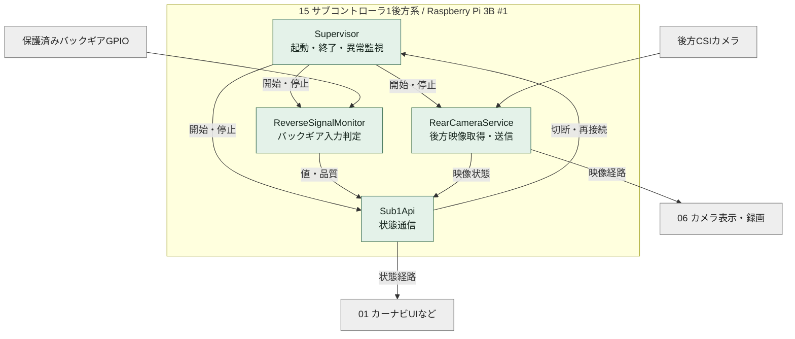

緑は内部モジュール、グレーは外部。映像の送信と状態通知は別経路。Supervisorによる定期確認も、停止したカメラ処理の応答を無期限に待たない。

<a id="dd-features"></a>

### 3.2 機能別処理フローチャート


<a id="dd-feature-1"></a>

#### 3.2.1 起動と部分稼働（SUB1-01）

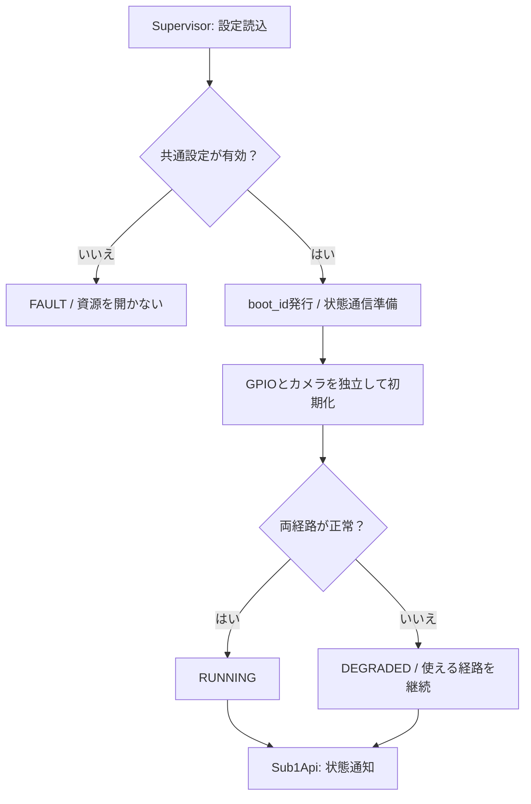

GPIOの未確定番号を仮の0番へ置換しない。カメラ設定不備があっても、共通設定とGPIO条件が有効ならバックギア監視は開始できる。

<a id="dd-feature-2"></a>

#### 3.2.2 バックギアの状態確定（SUB1-02）

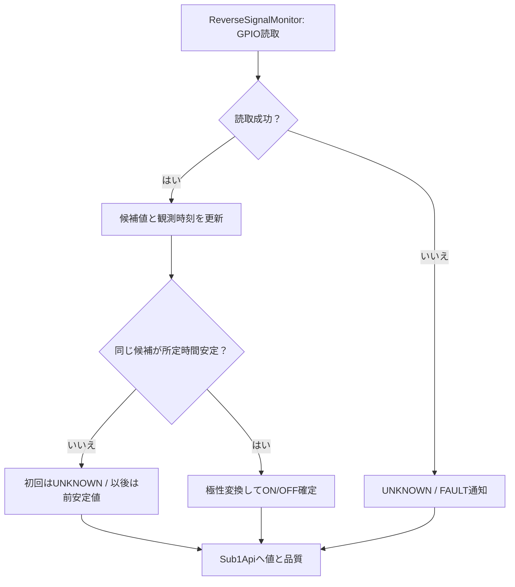

<a id="dd-feature-3"></a>

#### 3.2.3 映像取得と容量制限（SUB1-03）

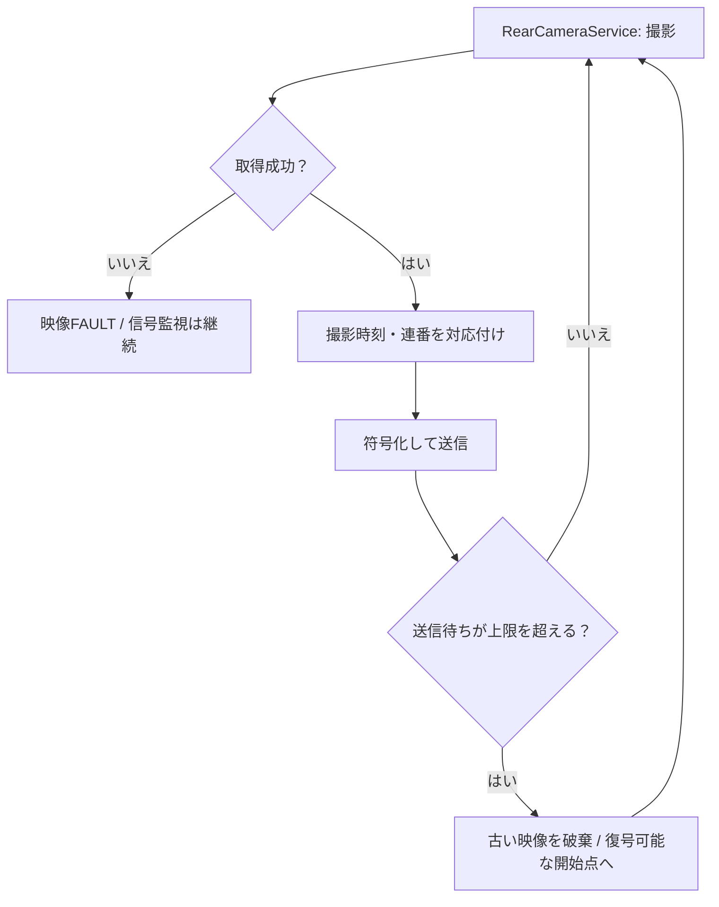

圧縮映像の任意パケットだけを捨てて正常な連続映像と扱わない。欠落を通知し、必要ならセッションを更新してキーフレームから再開する。

<a id="dd-feature-4"></a>

#### 3.2.4 状態通知と再接続（SUB1-04・05）

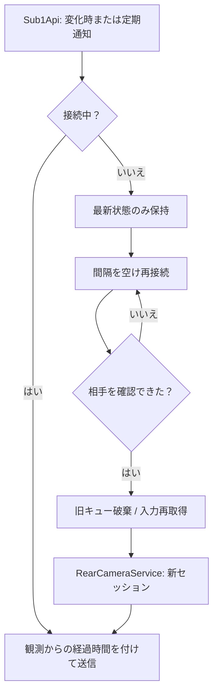

<a id="dd-feature-5"></a>

#### 3.2.5 停止（SUB1-06）

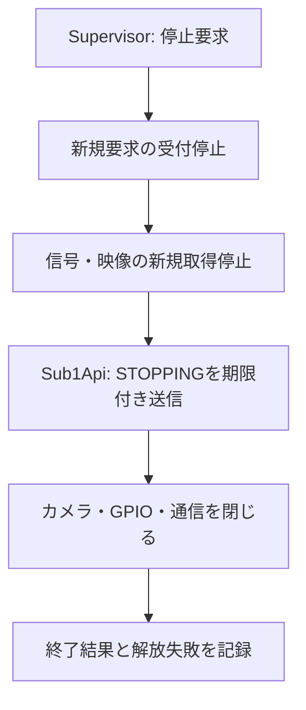

<a id="dd-tree"></a>

### 3.3 モジュールツリー

```text
sub_controller1_service
+-- Supervisor
|   +-- 共通設定検証
|   +-- 各経路の開始・停止・正常性確認
+-- ReverseSignalMonitor
|   +-- GPIO読取
|   +-- 安定判定・極性変換
|   +-- 観測時刻・品質管理
+-- RearCameraService
|   +-- CSI取得・符号化
|   +-- 撮影時刻・配信セッション管理
|   +-- 上限付き映像送信
+-- Sub1Api
    +-- 状態通知・要求受付
    +-- 接続相手の確認
    +-- 最新状態の保持・再接続
```

ツリーは機能を実現するモジュールの内訳。カメラの取得・符号化は信号監視とは独立した処理として実行し、OSプロセス分割の要否は負荷測定で決める。

<a id="dd-sequence"></a>

### 3.4 モジュール間の処理順序

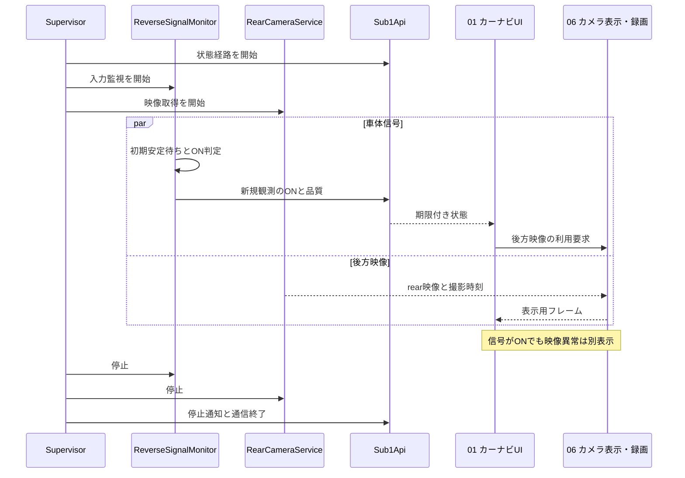

状態通信を受けるUI側の窓口はServiceBridgeを想定する。通信方式の確定後、各利用者への状態配信を直接接続とするか共通の配送機能で行うかを決める。

<a id="dd-modules"></a>

### 3.5 モジュール詳細


<a id="dd-module-1"></a>

#### 3.5.1 Supervisor（起動・終了・異常監視）

| 項目 | 設計内容 |
| --- | --- |
| 入力 | 設定、停止要求、各経路の生存通知・エラー。 |
| 出力 | 個別の開始・停止・再試行、サービス全体の状態。 |
| 保持情報 | boot_id、停止フラグ、設定世代、経路別状態、再試行回数・次回時刻。 |
| 処理 | 共通設定検証後に独立経路を起動。一定間隔で経路別の処理進行を確認し、故障した経路だけ復旧。 |
| 関数 | start(config)、check_health(now)、stop(deadline)。 |
| 異常時 | 共通設定の破損は全体停止。GPIOだけの失敗なら映像は継続。再起動を無制限に連続実行しない。 |

<a id="dd-module-2"></a>

#### 3.5.2 ReverseSignalMonitor（バックギア入力判定）

| 項目 | 設計内容 |
| --- | --- |
| 入力 | 専用GPIO、active_level、poll_ms、debounce_ms、現在の単調時計。 |
| 出力 | reverse=ON/OFF/UNKNOWN、validity、reason、安定値・生値、観測番号。 |
| 保持情報 | 候補値・候補開始時刻・安定値・変化時刻・最終読取成功時刻。 |
| 処理 | 初期値はUNKNOWN。成功した各読取を観測として記録し、採用条件を満たした候補だけ安定値へ反映。 |
| 関数 | read_input(now)、update_stable_state(raw, now)、invalidate(reason)。 |
| 異常時 | 読取例外・過長の監視空白でUNKNOWNにして候補を破棄。復旧は初期安定待ちから再開。LOWだけで断線を判定しない。 |

<a id="dd-module-3"></a>

#### 3.5.3 RearCameraService（後方映像取得・送信）

| 項目 | 設計内容 |
| --- | --- |
| 入力 | CSI識別、映像設定、転送先、開始・停止・再接続通知。 |
| 出力 | camera_id=rearの映像、時刻品質、欠落数、カメラ状態。 |
| 保持情報 | camera_handle、encoder、stream_session_id、frame_sequence、上限付き送信待ち領域。 |
| 処理 | 採用APIを通して取得し、撮影時刻と対応付けて符号化・送信。記録ファイルはPi 5の06 カメラ表示・録画が所有。 |
| 関数 | start_stream(profile)、capture_and_send()、reset_stream(reason)。 |
| 異常時 | 欠落後は復号可能な開始点まで送信・表示状態を再同期。カメラ停止でGPIO監視を止めない。 |
| バッファ管理 | 送信側が利用を終えるまで撮影領域を再利用しない。上限到達時の待ち時間にも上限を持たせる。 |

<a id="dd-module-4"></a>

#### 3.5.4 Sub1Api（状態通知と接続管理）

| 項目 | 設計内容 |
| --- | --- |
| 入力 | バックギア最新観測、カメラ・サービス状態、許可済み相手からの要求。 |
| 出力 | 共通形式の状態通知、現在状態の応答、拒否理由。 |
| 保持情報 | 接続状態、状態通知sequence、最新の観測データ、再接続時刻、相手識別。 |
| 処理 | 変化時と定期時に通知。再送でも元観測の時刻・寿命を保ち、通知sequenceだけ更新可能。 |
| 関数 | publish_state(snapshot, now)、handle_request(request)、reconnect(now)。 |
| 異常時 | 接続断でON/OFFをOFFへ改変しない。相手側は受信期限でUNKNOWNにする。任意GPIO操作・シェル実行は受け付けない。 |

<a id="dd-files"></a>

### 3.6 ファイル構成

```text
src/raspberry_pi3b/
+-- sub_controller1_service.py         開始点
+-- sub1/
    +-- supervisor.py                 起動・終了・異常監視
    +-- reverse_signal.py             GPIO取得と安定判定
    +-- rear_camera.py                後方映像
    +-- state_api.py                   状態通信
    +-- models.py                     データ型
    +-- config.py                     設定検証
tests/sub1/
+-- test_reverse_signal.py
+-- test_state_api.py
+-- test_recovery.py
+-- test_camera_pipeline.py
```

実装済みの分割。通信先や電気条件は配置環境の設定で与え、秘密情報をソースへ書かない。実機ではlgpio、CSIカメラではpicamera2とPillowを使用する。

<a id="dd-functions-flow"></a>

### 3.7 関数のフローチャート

関数は内部設計名。ライブラリが同名APIを提供するという意味ではない。

<a id="dd-fn-1"></a>

#### 3.7.1 start（検証して各経路を開始）

| 項目 | 内容 |
| --- | --- |
| 所属・入力 | Supervisor / config。 |
| 出力 | RUNNING、DEGRADEDまたはFAULTと理由。 |

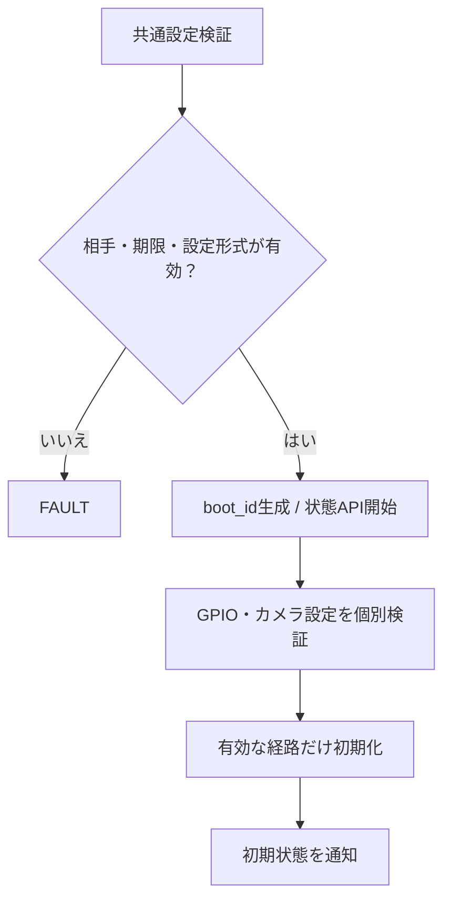

<a id="dd-fn-2"></a>

#### 3.7.2 read_input（観測時刻付きでGPIOを読む）

| 項目 | 内容 |
| --- | --- |
| 所属・入力 | ReverseSignalMonitor / now。 |
| 出力 | 新規観測またはUNKNOWN。 |

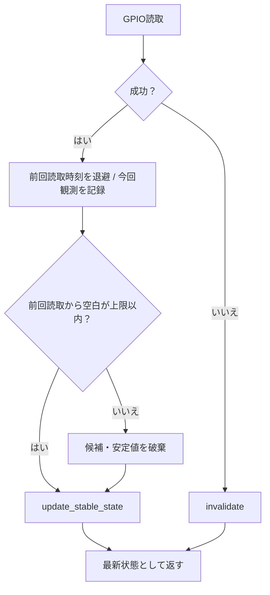

変化がなくても正常に読み直した値は新規観測。キャッシュを送り直しただけの場合は観測時刻を更新しない。

<a id="dd-fn-3"></a>

#### 3.7.3 update_stable_state（候補値からON/OFFを確定）

| 項目 | 内容 |
| --- | --- |
| 所属・入力 | ReverseSignalMonitor / raw、now。 |
| 出力 | 安定値と変化有無。 |

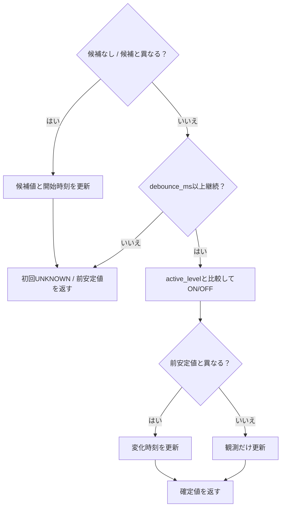

<a id="dd-fn-4"></a>

#### 3.7.4 capture_and_send（撮影情報を保って映像を送信）

| 項目 | 内容 |
| --- | --- |
| 所属・入力 | RearCameraService / 開始済みカメラ。 |
| 出力 | 映像データ、時刻品質、欠落情報。 |

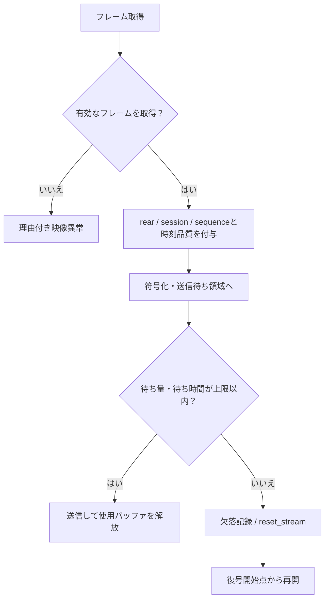

撮影時刻不明でも方針により単独表示を許す場合はclock_quality=UNKNOWNを付ける。正確な撮影時刻を必要とする合成には利用させない。

<a id="dd-fn-5"></a>

#### 3.7.5 publish_state（状態と残り有効時間を通知）

| 項目 | 内容 |
| --- | --- |
| 所属・入力 | Sub1Api / snapshot、now。 |
| 出力 | 状態通知、または最新値のみ保持。 |

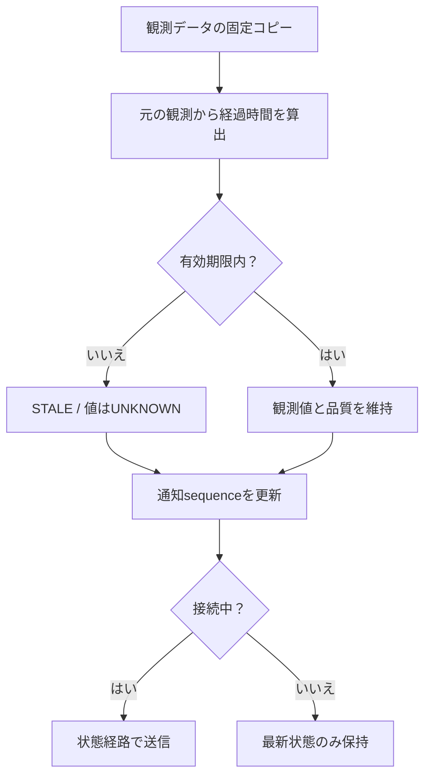

age_ms_at_sendは送信時に再計算する。通知を作成した時刻で観測時刻を上書きしない。

<a id="dd-fn-6"></a>

#### 3.7.6 handle_request（状態参照要求を受け付ける）

| 項目 | 内容 |
| --- | --- |
| 所属・入力 | Sub1Api / 要求元、操作、request_id、期限。 |
| 出力 | 現在状態またはREJECTED。 |

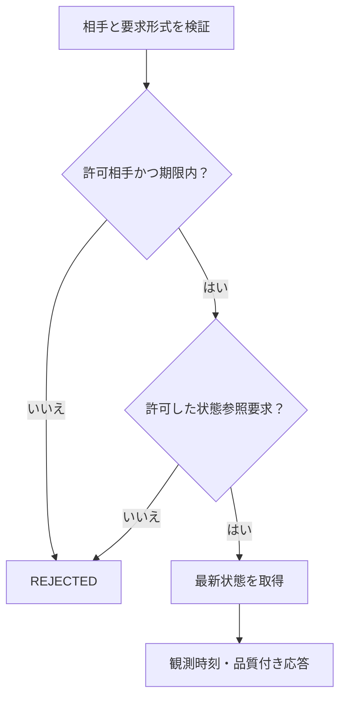

GET_STATEとGET_HEALTHを初期の論理要求とする。任意デバイス名、任意コマンド、GPIO出力の要求は許可しない。

<a id="dd-fn-7"></a>

#### 3.7.7 reconnect（過去データを持ち越さず再接続）

| 項目 | 内容 |
| --- | --- |
| 所属・入力 | Sub1Api / now、接続設定。 |
| 出力 | 新接続の最新状態、または次回再試行時刻。 |

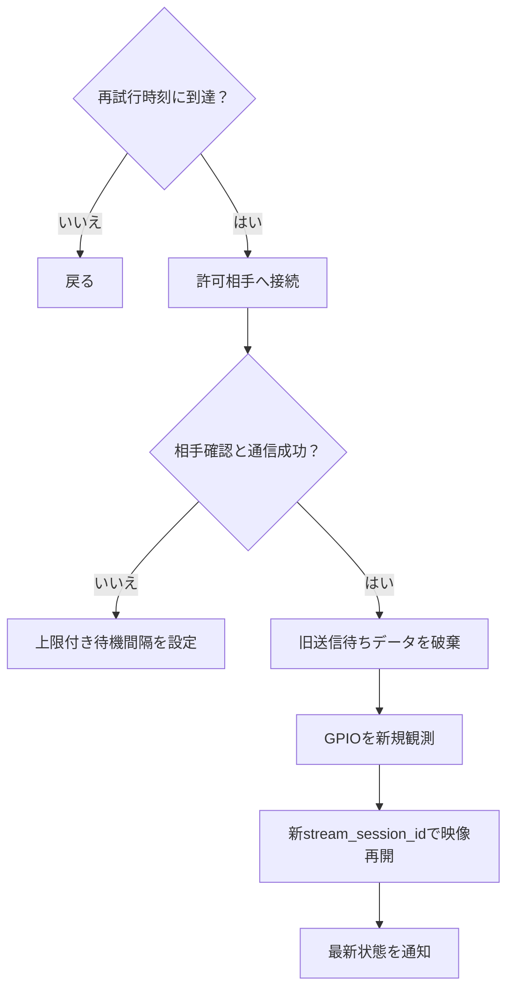

<a id="dd-fn-8"></a>

#### 3.7.8 check_health（経路ごとの停止を検出）

| 項目 | 内容 |
| --- | --- |
| 所属・入力 | Supervisor / now、最終処理進行時刻。 |
| 出力 | 経路状態更新と限定再試行。 |

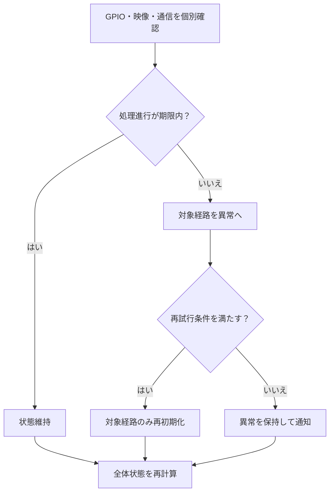

<a id="dd-fn-9"></a>

#### 3.7.9 stop（取得を止め資源を解放）

| 項目 | 内容 |
| --- | --- |
| 所属・入力 | Supervisor / 停止期限。 |
| 出力 | STOPPEDまたは終了失敗記録。 |

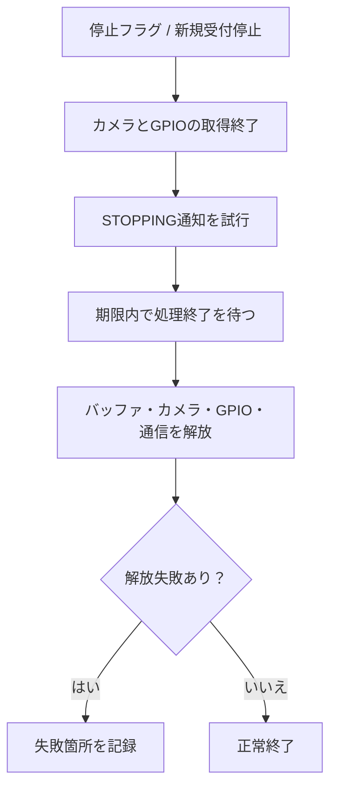

<a id="dd-4"></a>

## 4. インターフェース設計


<a id="dd-interface"></a>

### 4.1 接続先と受け渡す情報

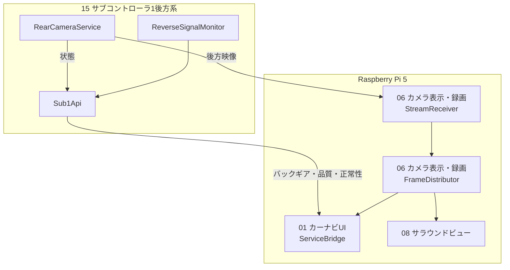

| I/F | 方向 | 契約 |
| --- | --- | --- |
| CSI | カメラ→RearCameraService | デバイス対応、解像度、fps、撮影時刻APIを実機確認。 |
| GPIO | 保護回路→ReverseSignalMonitor | 3.3V入力。ピン番号・極性T.B.D。出力モードは禁止。 |
| 映像 | RearCameraService→StreamReceiver | rear、stream_session_id、sequence、撮影時刻・品質、符号化情報。 |
| 状態 | Sub1Api→ServiceBridgeなど | reverseと品質、元観測時刻、残り寿命、経路状態。 |
| 参照要求 | 許可したPi 5→Sub1Api | GET_STATE / GET_HEALTH。内部実装はEthernet TCP/45050のJSON Lines。相手認証方式は実機導入前に確定する。 |

<a id="dd-time-contract"></a>

### 4.2 再送・時刻・互換性

通知形式は[共通仕様](00_共通仕様.md)へ合わせる。schema_version不一致、別サブコンのsource、過去boot_id・配信セッションのデータは受信側で拒否する。接続ごとに現在のboot_idを確認し、遅れて届いた旧起動データで戻さない。

異なるホストの単調時計を直接引かない。送信元の観測から送信までの時間、受信後経過、検証済みの通信遅延上限を用いて鮮度を判定する。上限不明のバックギア状態は安全判断へ利用しない。
UTC未同期ならobserved_at_utc=null。合成に必要な撮影時刻の対応は06 カメラ表示・録画側の時計対応と一致させる。映像受信成功をバックギア入力の正常性へ流用しない。

<a id="dd-5"></a>

## 5. データ・設定設計


<a id="dd-data"></a>

### 5.1 状態と映像のデータ

| データ | 内容・更新規則 |
| --- | --- |
| ReverseSample | raw_level、debounced_level、reverse、validity、reason、sample_sequence、last_read_monotonic、changed_at。 |
| 状態通知共通部 | schema_version、source=sub1、boot_id、sequence、observed_at_utc、age_ms_at_send、valid_for_ms。 |
| ChannelHealth | GPIO・映像・通信ごとの状態、最終処理進行時刻、エラー理由。データの有効性とは別。 |
| VideoMetadata | camera_id=rear、boot_id、stream_session_id、sequence、captured_at、capture_clock_id、clock_quality、映像設定世代。 |
| 接続管理 | peer_id、connection_generation、再試行時刻、接続状態。 |
| バッファ | 状態は最新観測を1組、映像は容量・時間上限付き。全履歴の蓄積をしない。 |

状態通知のsequenceと入力のsample_sequenceを分ける。同じ観測の再送はsample_sequenceを維持する。カメラ状態の新規通知があってもバックギア観測の寿命は延びない。

<a id="dd-config"></a>

### 5.2 設定項目

| 設定 | 確定条件 | 未設定時 |
| --- | --- | --- |
| reverse_gpio / active_level | 最新HW対応表・保護回路の実測 | GPIOを開かずUNKNOWN |
| poll_ms / debounce_ms / max_read_gap_ms | ノイズ幅・必要遅延・実測周期から決定 | 信号経路を無効 |
| signal_valid_for_ms / publish_interval_ms | 通知間隔・検証した遅延余裕を含める | 状態を安全判断へ供給しない |
| camera_profile | CSIデバイス、解像度、fps、符号化と負荷測定 | 映像経路を無効 |
| video_queue_bytes / video_max_age_ms | メモリと表示遅延上限 | 無制限値を許可しない |
| peer / transport_profile | 許可したPi 5、通信・認証方式 | 通信を開始しない |
| retry_interval / retry_max / stop_timeout | 再接続・終了の許容時間 | 起動検証エラー |

実車向けのGPIO番号・極性と遅延数値はT.B.D。設定例はcandidateとして実機起動を拒否する。debounce_msだけで全体遅延を表さず、読取間隔、処理待ち、送信、UI判定を合計して測定する。

<a id="dd-6"></a>

## 6. 処理・状態遷移

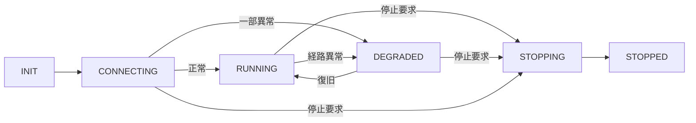

| 対象 | 状態・規則 |
| --- | --- |
| サービス全体 | 共通設定不備はFAULT。部分異常はDEGRADEDで理由を列挙。 |
| バックギア | UNKNOWN→安定確認→ON/OFF。読取失敗で直ちにUNKNOWN。期限切れはSTALE品質。 |
| カメラ | CLOSED→STARTING→STREAMING。失敗はFAULT、復旧待ちを挟んで新セッション。 |
| ネットワーク | DISCONNECTED→CONNECTING→CONNECTED。送信失敗で切断扱い。 |
| 画面 | 本ソフトは画面状態を保持しない。UIが映像と信号の鮮度を独立に評価。 |

<a id="dd-7"></a>

## 7. 異常処理

| 異常 | 処理 | 復旧・影響範囲 |
| --- | --- | --- |
| GPIO読取失敗 | reverse=UNKNOWN、候補破棄 | 再初期化後、安定待ち。映像は継続。 |
| GPIO LOW | 極性に従いOFF等へ変換 | 配線断との区別は回路の診断能力に依存。 |
| カメラ抜け・取得停止 | 映像FAULT、関連領域を解放 | 信号経路継続。限定再試行。 |
| 映像負荷過大 | 上限超過を通知し映像を再同期 | 解像度等を無断で変更せず、設定変更は再開始時。 |
| LAN切断 | 最新値のみ保持、再接続待ち | Pi 5側はTTL超過でUNKNOWN。 |
| 時刻同期喪失 | clock_qualityを低下 | 合成用時刻を捏造しない。 |
| 未許可要求 | 理由付き拒否、頻度制限 | GPIOやファイルを操作しない。 |
| 停止通知が届かない | 送信待ちを期限で終了 | 受信側のTTLで無効化。停止成功を通信成功に依存させない。 |

<a id="dd-8"></a>

## 8. 起動・終了・運用設計

専用Linuxサービスとして起動する案とし、CSIと対象GPIO、許可したネットワーク接続に必要な権限だけを付与する。映像の取得・符号化・送信は信号監視と独立した処理で動かし、処理進行時刻をSupervisorへ報告する。Pi 3BのCPU・温度・メモリ・転送量を記録して分割方法を確定する。

Pi 3Bの電源投入・終了とPi 5の電源管理は同一ではない。Pi 5起動時にサブコンが準備済みと仮定せず、サブコン停止のトリガーはHW電源設計と合わせて確定する。
ログは起動ID、状態変化、異常理由、欠落数、最大遅延、再接続回数を残す。映像を通常ログへ埋め込まず、ローカルで無期限録画しない。

終了は新規受付停止→取得停止→期限付き停止通知→映像バッファ解放→デバイス・通信解放。ハングした映像処理を待ち続けず、終了失敗を記録して監督サービスへ返す。

<a id="dd-9"></a>

## 9. 試験・受入条件

| ID | 対象 | 条件 | 期待結果 |
| --- | --- | --- | --- |
| S1-T01 | SUB1-01 | GPIO番号未設定 | 未設定GPIOを開かない。映像が有効なら部分稼働。 |
| S1-T02 | SUB1-02 | 起動時HIGH / LOW | 安定待ち完了前はUNKNOWN。 |
| S1-T03 | SUB1-02 | 短いノイズと安定した反転 | 候補開始時間を更新し、閾値以上でのみON/OFF採用。 |
| S1-T04 | SUB1-02 | 監視空白が上限超過 | 前安定値を引き継がず再安定待ち。 |
| S1-T05 | SUB1-03・04 | 高い映像負荷・低速受信者 | 信号の読取・通知遅延が確定した上限内。 |
| S1-T06 | SUB1-03 | 圧縮映像の欠落 | 欠落通知後、復号可能な開始点から再開。破損映像を正常扱いしない。 |
| S1-T07 | SUB1-04 | 同じ観測を再送 | 観測番号・時刻維持、age増加。 |
| S1-T08 | SUB1-05 | LAN断、旧パケット混在で復旧 | 受信側は期限でUNKNOWN、復旧後旧セッション拒否。 |
| S1-T09 | SUB1-02・03 | カメラだけ切断 / GPIOだけ故障 | 正常な経路は継続。 |
| S1-T10 | SUB1-05 | サブコン再起動 | boot_id変更、過去データ不採用。 |
| S1-T11 | SUB1-06 | 通信断中に停止要求 | 停止期限内に解放、永久送信待ちなし。 |
| S1-T12 | SUB1-03 | 時刻未同期 | 時刻品質をUNKNOWNとし、同期済み合成用として供給しない。 |

未実施の試験計画。信号模擬→Pi間のベンチ→停車中の実車試験の順で確認し、検証前に後方確認の代替として運用しない。

<a id="dd-10"></a>

## 10. 未確定事項・実装課題

| 項目 | 決める内容 |
| --- | --- |
| 信号回路 | サブコン1のGPIO・極性、読取失敗・断線を区別できる範囲。 |
| タイミング | 読取・安定判定・通知TTL・UIまでの許容遅延。 |
| 映像方式 | CSIカメラ対応API、コーデック、解像度、fps、転送方式とキーフレーム復旧。 |
| 通信 | 状態プロトコル、相手認証、ポート、受信側への配信方法。 |
| 時計 | 撮影時刻の取得元、Pi間同期方法、同期誤差の上限。 |
| 運用 | Pi 3Bの給電・正常終了、サービス依存順序、再試行・停止期限。 |
| 受入 | 信号TTLと映像遅延の実測値、CPU・温度・メモリ上限。 |

<a id="dd-notes"></a>

## 用語の注釈

| 用語 | 意味 |
| --- | --- |
| 有界キュー | ためられるデータ量を制限した送信待ち領域。 |
| スナップショット | ある時点の値・時刻・品質をひとまとめにしたデータ。 |
| boot_id / stream_session_id | サービス起動を識別するID / 映像配信を開始・再開始するたび変えるID。 |
| キーフレーム | 圧縮映像の復号を再開するための基準となる画像。採用方式の条件に従う。 |
| TTL | 元の観測を有効とみなす期間。再送で延長しない。 |
