# サブコントローラ2前方系 詳細設計書

| 項目 | 内容 |
| --- | --- |
| 文書ID | SW-DD-16 |
| 実行環境 | Pi 3B #2 |
| 実装状態 | 内部実装済み・実機未検証 |
| 対象ソース | `src/raspberry_pi3b/sub_controller2_service.py`、`src/raspberry_pi3b/sub2/`、`src/raspberry_pi3b/subcontroller_common.py` |
| 作成日 | 2026-09-14 |
| 更新日 | 2026-09-20 |

[詳細設計一覧](README.md) / [共通仕様](00_共通仕様.md) / [上位設計](../ソフトウェア設計図.md#sec-32)

## 目次
- [1. 目的・適用範囲](#dd-1)
- [2. 要求仕様・役割](#dd-2)
  - [2.1 機能一覧](#dd-functions)
  - [2.2 機能・モジュール・関数の対応](#dd-function-module-map)
- [3. 内部構成](#dd-3)
  - [3.1 モジュールの全体構成](#dd-overview)
  - [3.2 機能別処理フローチャート](#dd-features)
    - [3.2.1 起動と独立監視（SUB2-01）](#dd-feature-1)
    - [3.2.2 左右ランプの観測（SUB2-02）](#dd-feature-2)
    - [3.2.3 活動の保持と解除（SUB2-03）](#dd-feature-3)
    - [3.2.4 両側活動の判定（SUB2-04）](#dd-feature-4)
    - [3.2.5 前方映像と状態の並行送信（SUB2-05・06）](#dd-feature-5)
    - [3.2.6 再接続時の履歴破棄（SUB2-06）](#dd-feature-6)
  - [3.3 モジュールツリー](#dd-tree)
  - [3.4 モジュール間の処理順序](#dd-sequence)
  - [3.5 モジュール詳細](#dd-modules)
    - [3.5.1 Supervisor（開始・終了・部分故障管理）](#dd-module-1)
    - [3.5.2 TurnSignalMonitor（左右別の安定したランプ状態）](#dd-module-2)
    - [3.5.3 BlinkActivityEstimator（点滅継続の推定）](#dd-module-3)
    - [3.5.4 FrontCameraService（前方映像取得・送信）](#dd-module-4)
    - [3.5.5 Sub2Api（状態通信）](#dd-module-5)
  - [3.6 ファイル構成](#dd-files)
  - [3.7 関数のフローチャート](#dd-functions-flow)
    - [3.7.1 start（左右と映像を独立して開始）](#dd-fn-1)
    - [3.7.2 read_inputs（左右GPIOを個別に読む）](#dd-fn-2)
    - [3.7.3 update_channel（片側の候補を確定）](#dd-fn-3)
    - [3.7.4 update_activity（ランプから活動を推定）](#dd-fn-4)
    - [3.7.5 evaluate_both（両側活動をまとめる）](#dd-fn-5)
    - [3.7.6 capture_and_send（前方映像を送る）](#dd-fn-6)
    - [3.7.7 publish_state（観測と推定を分けて通知）](#dd-fn-7)
    - [3.7.8 reconnect（接続と履歴を初期化）](#dd-fn-8)
    - [3.7.9 check_health（片側故障と処理停止を検出）](#dd-fn-9)
    - [3.7.10 stop（新規生成を止めて解放）](#dd-fn-10)
- [4. インターフェース設計](#dd-4)
  - [4.1 接続図とデータの分離](#dd-interface)
  - [4.2 鮮度と受信側の判断](#dd-freshness)
- [5. データ・設定設計](#dd-5)
  - [5.1 左右別の状態データ](#dd-data)
  - [5.2 設定と未確定時の動作](#dd-config)
- [6. 処理・状態遷移](#dd-6)
  - [6.1 活動推定の状態](#dd-activity-state)
  - [6.2 組合せと部分異常](#dd-state-table)
- [7. 異常処理](#dd-7)
- [8. 起動・終了・運用設計](#dd-8)
- [9. 試験・受入条件](#dd-9)
- [10. 未確定事項・実装課題](#dd-10)
- [用語の注釈](#dd-notes)

<a id="dd-1"></a>

## 1. 目的・適用範囲

Raspberry Pi 3Bのサブコントローラ2で前方CSIカメラと左右ウィンカーの保護済みGPIO信号を取得し、EthernetでPi 5へ送る。
前方カメラ、左右信号監視、点滅継続の推定、サブコン2通信を本ソフトにまとめる。GPIOとCSIカメラは実機依存のため、代替ドライバによるdry-runを含む内部実装として提供する。

[06 カメラ表示・録画](06_カメラ表示録画.md)が前方映像を受信し、[01 カーナビUI](01_カーナビUI.md)が状態に応じた画面表示を判断する。本ソフトはウィンカー出力、左右カメラの取得、画面の強制切替を行わない。左右カメラはPi 5側で取得する。
[15 サブコントローラ1後方系](15_サブコン1後方系.md)とは設計方針を合わせるが、GPIOの割当や入力状態を共用しない。

<a id="dd-2"></a>

## 2. 要求仕様・役割


<a id="dd-functions"></a>

### 2.1 機能一覧

| ID | 機能 | 実現する動作 |
| --- | --- | --- |
| SUB2-01 | 起動・個別経路の監視 | 開始条件・入力: 設定と起動要求。確認・処理: 共通設定、左右GPIO、カメラを分けて検証。処理結果: 正常な経路を開始し、使えない経路を理由付きで通知する。 |
| SUB2-02 | 左右ランプ状態の取得 | 開始条件・入力: 左右の保護済みGPIO。確認・処理: 片側ずつ初期安定待ちとノイズ除去を行い、極性をON/OFFへ変換。処理結果: 左右別の値、観測時刻、品質を生成する。 |
| SUB2-03 | 点滅操作継続の推定 | 開始条件・入力: 確定したランプ状態と変化時刻。確認・処理: ONまたは直近の消灯からの保持窓で活動を推定し、長時間ONや読取停止を別判定。処理結果: 左右のactivityと根拠・期限を生成する。 |
| SUB2-04 | 両側活動の整理 | 開始条件・入力: 左右activityと各品質。確認・処理: 両方の情報が有効かを確認して組合せを評価。処理結果: both_activityを通知する。ハザードスイッチ操作を確定したとは扱わない。 |
| SUB2-05 | 前方映像の送信 | 開始条件・入力: CSIカメラと映像設定。確認・処理: 取得・符号化・撮影時刻対応を行い、容量を制限して転送。処理結果: camera_id=frontを06 カメラ表示・録画へ送る。 |
| SUB2-06 | 通知・再接続・終了 | 開始条件・入力: 状態変化、定期時刻、通信障害、停止要求。確認・処理: 最新状態を期限付きで通知し、復旧時に古い映像・推定履歴を破棄。処理結果: 新規観測から再判定し、終了時は各資源を解放する。 |

<a id="dd-function-module-map"></a>

### 2.2 機能・モジュール・関数の対応

| 機能 | モジュール | 関数案 |
| --- | --- | --- |
| SUB2-01・06 | Supervisor | start / check_health / stop |
| SUB2-02 | TurnSignalMonitor | read_inputs / update_channel / invalidate_channel |
| SUB2-03・04 | BlinkActivityEstimator | update_activity / evaluate_both / reset |
| SUB2-05 | FrontCameraService | start_stream / capture_and_send / reset_stream |
| SUB2-06 | Sub2Api | publish_state / handle_request / reconnect |

ランプの生状態を取得する機能と、消灯区間でも操作継続中とみなす推定機能は別である。推定値を生のGPIO値として上書きしない。

<a id="dd-3"></a>

## 3. 内部構成


<a id="dd-overview"></a>

### 3.1 モジュールの全体構成

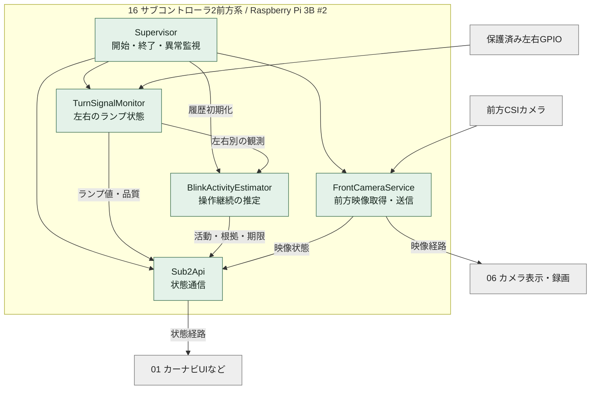
```mermaid
flowchart TB
 subgraph SW["16 サブコントローラ2前方系 / Raspberry Pi 3B #2"]
  direction TB
  Sup["Supervisor<br/>開始・終了・異常監視"]
  Mon["TurnSignalMonitor<br/>左右のランプ状態"]
  Est["BlinkActivityEstimator<br/>操作継続の推定"]
  Cam["FrontCameraService<br/>前方映像取得・送信"]
  Api["Sub2Api<br/>状態通信"]
  Sup --> Mon
  Sup --> Cam
  Sup --> Api
  Sup -->|"履歴初期化"| Est
  Mon -->|"左右別の観測"| Est
  Mon -->|"ランプ値・品質"| Api
  Est -->|"活動・根拠・期限"| Api
  Cam -->|"映像状態"| Api
 end
 GPIO["保護済み左右GPIO"] --> Mon
 CSI["前方CSIカメラ"] --> Cam
 Cam -->|"映像経路"| Rec["06 カメラ表示・録画"]
 Api -->|"状態経路"| UI["01 カーナビUIなど"]
 classDef internal fill:#e4f2e9,stroke:#3e7153,color:#16251d
 classDef external fill:#eeeeee,stroke:#777777,color:#222222
 class Sup,Mon,Est,Cam,Api internal
 class GPIO,CSI,Rec,UI external
```

緑は内部モジュール、グレーは外部。映像経路を止めても左右の読取と推定の期限確認が継続する構成にする。モジュールの枠はOSプロセス数を表さない。

<a id="dd-features"></a>

### 3.2 機能別処理フローチャート


<a id="dd-feature-1"></a>

#### 3.2.1 起動と独立監視（SUB2-01）

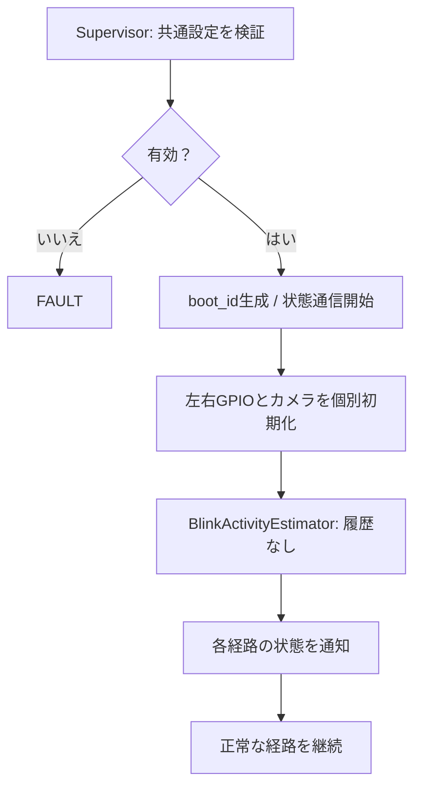
```mermaid
flowchart TB
 A["Supervisor: 共通設定を検証"] --> B{"有効？"}
 B -->|"いいえ"| X["FAULT"]
 B -->|"はい"| C["boot_id生成 / 状態通信開始"]
 C --> D["左右GPIOとカメラを個別初期化"]
 D --> E["BlinkActivityEstimator: 履歴なし"]
 E --> F["各経路の状態を通知"]
 F --> G["正常な経路を継続"]
```

<a id="dd-feature-2"></a>

#### 3.2.2 左右ランプの観測（SUB2-02）

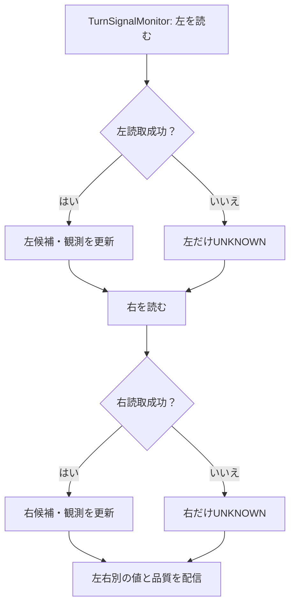
```mermaid
flowchart TB
 A["TurnSignalMonitor: 左を読む"] --> B{"左読取成功？"}
 B -->|"はい"| C["左候補・観測を更新"]
 B -->|"いいえ"| D["左だけUNKNOWN"]
 C --> E["右を読む"]
 D --> E
 E --> F{"右読取成功？"}
 F -->|"はい"| G["右候補・観測を更新"]
 F -->|"いいえ"| H["右だけUNKNOWN"]
 G --> I["左右別の値と品質を配信"]
 H --> I
```

一方の読取例外で他方の読取を省略しない。左右は同時刻の完全な一括取得ではないため、各観測時刻を持つ。

<a id="dd-feature-3"></a>

#### 3.2.3 活動の保持と解除（SUB2-03）

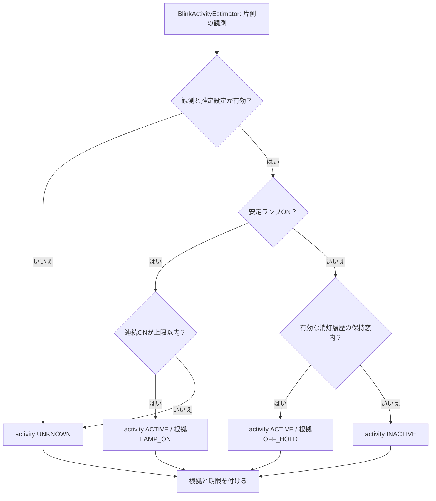
```mermaid
flowchart TB
 A["BlinkActivityEstimator: 片側の観測"] --> B{"観測と推定設定が有効？"}
 B -->|"いいえ"| U["activity UNKNOWN"]
 B -->|"はい"| C{"安定ランプON？"}
 C -->|"はい"| D{"連続ONが上限以内？"}
 D -->|"はい"| E["activity ACTIVE / 根拠LAMP_ON"]
 D -->|"いいえ"| U
 C -->|"いいえ"| F{"有効な消灯履歴の保持窓内？"}
 F -->|"はい"| G["activity ACTIVE / 根拠OFF_HOLD"]
 F -->|"いいえ"| H["activity INACTIVE"]
 E --> I["根拠と期限を付ける"]
 G --> I
 H --> I
 U --> I
```

OFF_HOLDは新しいOFF観測のたび延長しない。最後の確定ON→OFF変化時刻から固定時間だけ保持する。

<a id="dd-feature-4"></a>

#### 3.2.4 両側活動の判定（SUB2-04）

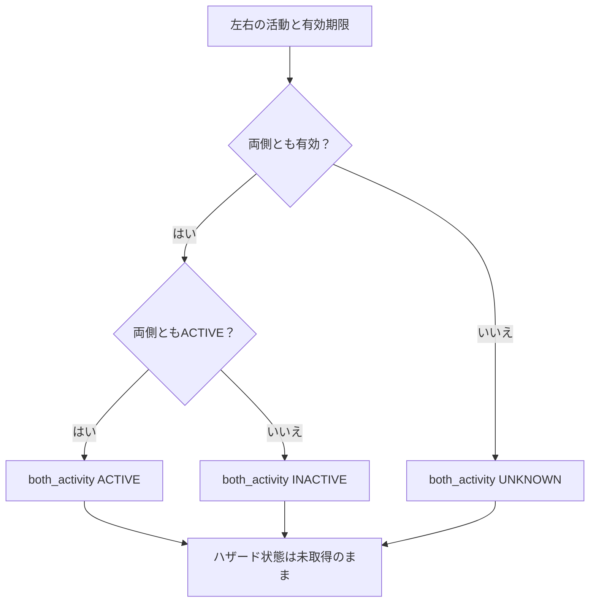
```mermaid
flowchart TB
 A["左右の活動と有効期限"] --> B{"両側とも有効？"}
 B -->|"いいえ"| U["both_activity UNKNOWN"]
 B -->|"はい"| C{"両側ともACTIVE？"}
 C -->|"はい"| Y["both_activity ACTIVE"]
 C -->|"いいえ"| N["both_activity INACTIVE"]
 Y --> D["ハザード状態は未取得のまま"]
 N --> D
 U --> D
```

両側活動は推定保持窓の重なりでも成立し得る。左右が交互に操作された場合を含め、ハザードスイッチONと同一視しない。

<a id="dd-feature-5"></a>

#### 3.2.5 前方映像と状態の並行送信（SUB2-05・06）

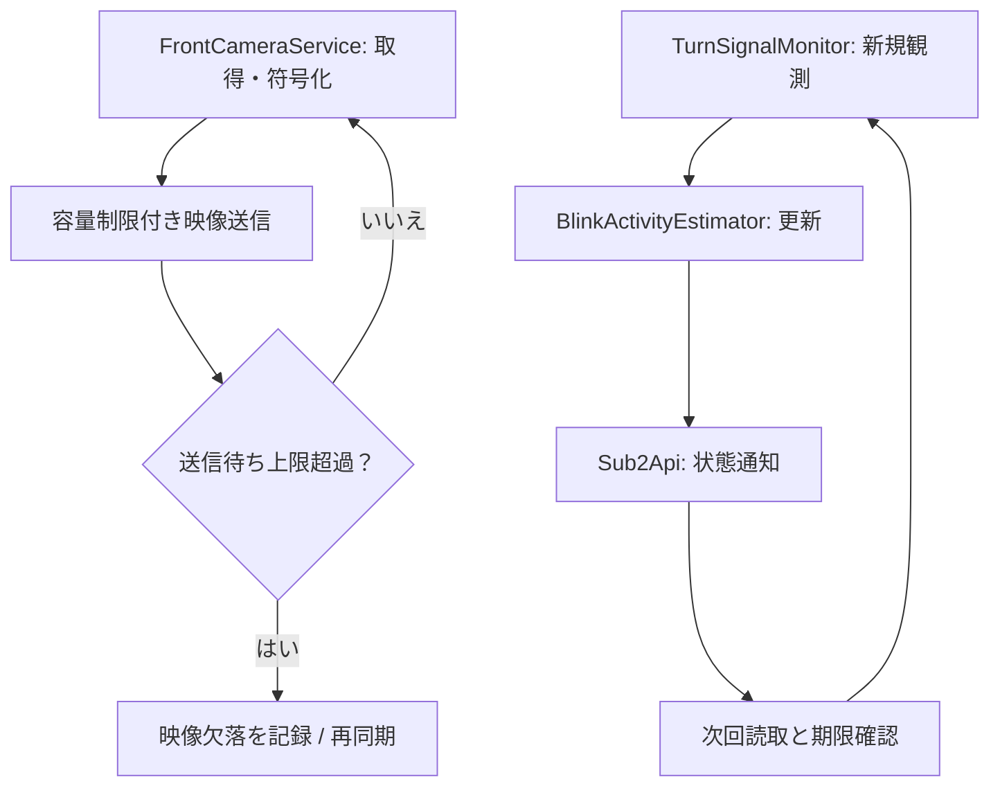
```mermaid
flowchart TB
 A["FrontCameraService: 取得・符号化"] --> B["容量制限付き映像送信"]
 B --> C{"送信待ち上限超過？"}
 C -->|"はい"| D["映像欠落を記録 / 再同期"]
 C -->|"いいえ"| A
 E["TurnSignalMonitor: 新規観測"] --> F["BlinkActivityEstimator: 更新"]
 F --> G["Sub2Api: 状態通知"]
 G --> H["次回読取と期限確認"]
 H --> E
```

映像・状態で送信待ち領域と実行待ちを分ける。実際の並行実行方式はPi 3Bの負荷試験で確定する。

<a id="dd-feature-6"></a>

#### 3.2.6 再接続時の履歴破棄（SUB2-06）

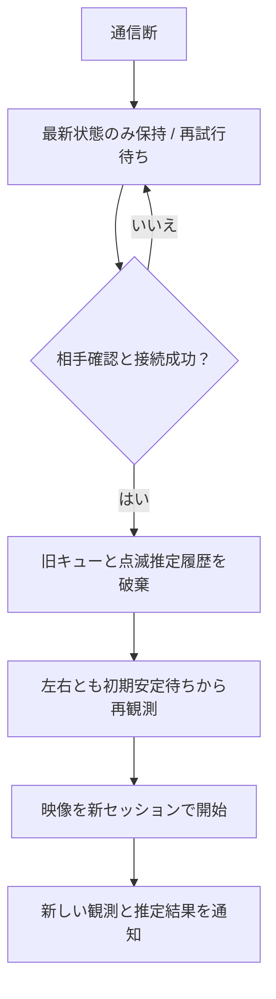
```mermaid
flowchart TB
 A["通信断"] --> B["最新状態のみ保持 / 再試行待ち"]
 B --> C{"相手確認と接続成功？"}
 C -->|"いいえ"| B
 C -->|"はい"| D["旧キューと点滅推定履歴を破棄"]
 D --> E["左右とも初期安定待ちから再観測"]
 E --> F["映像を新セッションで開始"]
 F --> G["新しい観測と推定結果を通知"]
```

<a id="dd-tree"></a>

### 3.3 モジュールツリー

```text
sub_controller2_service
+-- Supervisor
|   +-- 共通設定・経路別正常性
|   +-- 起動・終了・限定再試行
+-- TurnSignalMonitor
|   +-- left_channel: 生値・候補・安定値・観測時刻
|   +-- right_channel: 生値・候補・安定値・観測時刻
+-- BlinkActivityEstimator
|   +-- 左右別の変化履歴・保持期限
|   +-- 左右の活動推定
|   +-- 両側活動の合成
+-- FrontCameraService
|   +-- CSI取得・符号化・前方映像送信
|   +-- 時刻・セッション・バッファ管理
+-- Sub2Api
    +-- 生状態と推定状態の配信
    +-- 接続相手の確認・再接続
```

<a id="dd-sequence"></a>

### 3.4 モジュール間の処理順序

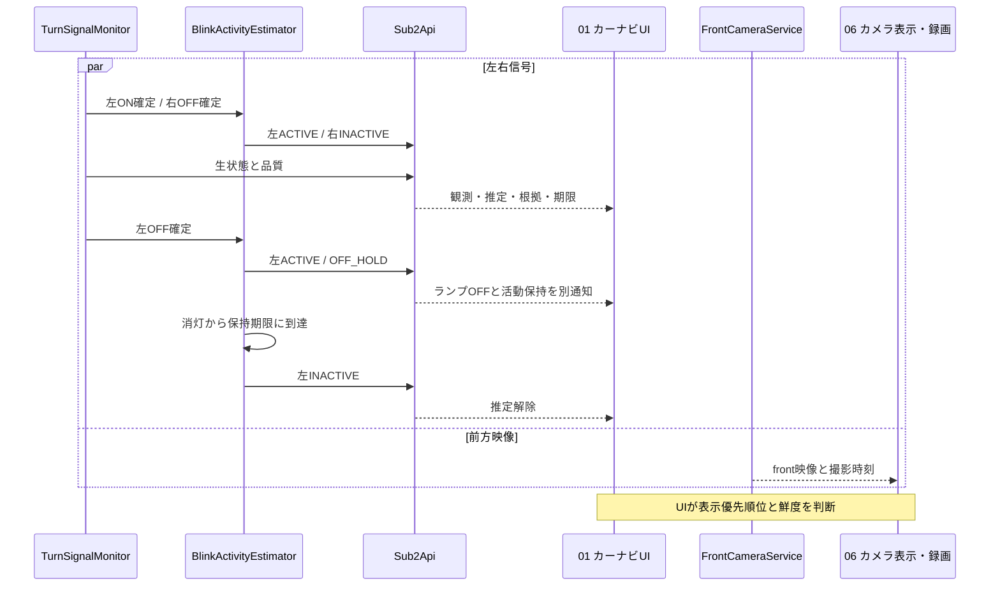
```mermaid
sequenceDiagram
 participant G as TurnSignalMonitor
 participant E as BlinkActivityEstimator
 participant A as Sub2Api
 participant U as 01 カーナビUI
 participant C as FrontCameraService
 participant R as 06 カメラ表示・録画
 par 左右信号
  G->>E: 左ON確定 / 右OFF確定
  E->>A: 左ACTIVE / 右INACTIVE
  G->>A: 生状態と品質
  A-->>U: 観測・推定・根拠・期限
  G->>E: 左OFF確定
  E->>A: 左ACTIVE / OFF_HOLD
  A-->>U: ランプOFFと活動保持を別通知
  E->>E: 消灯から保持期限に到達
  E->>A: 左INACTIVE
  A-->>U: 推定解除
 and 前方映像
  C-->>R: front映像と撮影時刻
 end
 Note over U,R: UIが表示優先順位と鮮度を判断
```

GPIO変化が来ない間も推定期限を確認する。状態配信は同じ観測番号に基づく生値と推定を組にし、異なる更新世代を混ぜない。

<a id="dd-modules"></a>

### 3.5 モジュール詳細


<a id="dd-module-1"></a>

#### 3.5.1 Supervisor（開始・終了・部分故障管理）

| 項目 | 設計内容 |
| --- | --- |
| 入力 | 設定、停止要求、左右GPIO・映像・通信の処理進行情報。 |
| 出力 | 経路別の開始・停止、再試行、サービス状態。 |
| 保持情報 | boot_id、設定世代、経路状態、再試行時刻、停止期限。 |
| 処理 | 共通条件が有効なら経路別に開始。片側の異常で全体を正常とはしないが、他側と映像は継続可能。 |
| 関数 | start(config)、check_health(now)、stop(deadline)。 |
| 異常時 | 停止したカメラ処理を待ってGPIO監視を止めない。故障側の候補と推定履歴だけを破棄する。 |

<a id="dd-module-2"></a>

#### 3.5.2 TurnSignalMonitor（左右別の安定したランプ状態）

| 項目 | 設計内容 |
| --- | --- |
| 入力 | left_gpio、right_gpio、各極性、安定判定時間、読取周期。 |
| 出力 | left_lamp/right_lamp=ON/OFF/UNKNOWN、各validity・reason・観測番号。 |
| 保持情報 | 左右それぞれraw_level、candidate、candidate_since、stable_level、last_read、last_rise、last_fall。 |
| 処理 | 初回はUNKNOWN。候補が継続した側だけ安定値を変更し、その時刻を変化時刻として記録。 |
| 関数 | read_inputs(now)、update_channel(side, raw, now)、invalidate_channel(side, reason)。 |
| 異常時 | 監視空白・読取失敗の側をUNKNOWNにし、復旧時は安定待ち。LOWから断線を確定しない。 |

<a id="dd-module-3"></a>

#### 3.5.3 BlinkActivityEstimator（点滅継続の推定）

| 項目 | 設計内容 |
| --- | --- |
| 入力 | 左右の確定ランプ状態、各変化時刻・品質、now、推定設定。 |
| 出力 | left_activity/right_activity、both_activity、inferred=true、根拠、残り有効時間。 |
| 保持情報 | 左右別ON開始、最後の確定消灯、hold_until、入力の観測番号、推定有効性。 |
| 処理 | 有効なONなら活動あり。OFFへ変化後は固定の保持窓だけ活動あり。期限後は活動なし。初期OFFで過去ONがなければ活動なし。 |
| 関数 | update_activity(side, sample, now)、evaluate_both(now)、reset(side_or_all)。 |
| 異常時 | 観測期限切れ・監視空白・連続ON上限超過はUNKNOWN。推定パラメータ未確定なら推定だけ無効にして生値は送る。 |
| 境界 | OFF保持中にONへ戻れば新しいON区間。OFFの再読取でhold_untilを延長しない。 |

<a id="dd-module-4"></a>

#### 3.5.4 FrontCameraService（前方映像取得・送信）

| 項目 | 設計内容 |
| --- | --- |
| 入力 | CSIカメラ、映像設定、Pi 5接続先。 |
| 出力 | front映像、撮影時刻・品質、カメラ状態・欠落数。 |
| 保持情報 | デバイス、符号化処理、stream_session_id、sequence、上限付き送信待ち領域。 |
| 処理 | 映像は06 カメラ表示・録画へ直接送る。左右の車体信号処理と別の実行待ち・送信待ちを用いる。 |
| 関数 | start_stream(profile)、capture_and_send()、reset_stream(reason)。 |
| 異常時 | 欠落後は有効な復号開始点を待つ。撮影時刻不明を受信時刻で置換しない。 |

<a id="dd-module-5"></a>

#### 3.5.5 Sub2Api（状態通信）

| 項目 | 設計内容 |
| --- | --- |
| 入力 | 左右の生状態と活動推定、経路状態、相手からの状態参照要求。 |
| 出力 | 観測ごとの時刻・品質を保った状態通知、拒否理由、再接続結果。 |
| 保持情報 | peer_id、boot_id、通知sequence、最新状態、接続世代、再試行時刻。 |
| 処理 | 左右と推定の値を別項目で配信。サービス生存通知で車体観測の期限を更新しない。 |
| 関数 | publish_state(snapshot, now)、handle_request(request)、reconnect(now)。 |
| 異常時 | 片側の異常を理由付きで送信。通信断で両側OFFを生成しない。 |

<a id="dd-files"></a>

### 3.6 ファイル構成

```text
src/raspberry_pi3b/
+-- sub_controller2_service.py       開始点
+-- sub2/
    +-- supervisor.py               開始・終了・監視
    +-- turn_signal.py              左右GPIO観測
    +-- blink_activity.py           活動推定
    +-- front_camera.py             前方映像
    +-- state_api.py                状態通信
    +-- models.py                   データ型
    +-- config.py                   設定検証
tests/sub2/
+-- test_turn_signal.py
+-- test_blink_activity.py
+-- test_state_api.py
+-- test_recovery.py
+-- test_camera_pipeline.py
```

実装済み。15 サブコントローラ1後方系との共通部は`subcontroller_common.py`へまとめ、デバイス固有の信号判定とカメラ処理は分離している。左右カメラのコードをこのフォルダへ含めない。

<a id="dd-functions-flow"></a>

### 3.7 関数のフローチャート


<a id="dd-fn-1"></a>

#### 3.7.1 start（左右と映像を独立して開始）

| 項目 | 内容 |
| --- | --- |
| 所属・入力 | Supervisor / config。 |
| 出力 | 全体状態と経路別状態。 |

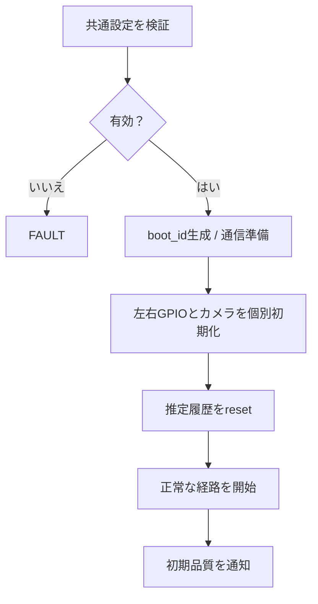
```mermaid
flowchart TB
 A["共通設定を検証"] --> B{"有効？"}
 B -->|"いいえ"| X["FAULT"]
 B -->|"はい"| C["boot_id生成 / 通信準備"]
 C --> D["左右GPIOとカメラを個別初期化"]
 D --> E["推定履歴をreset"]
 E --> F["正常な経路を開始"]
 F --> G["初期品質を通知"]
```

<a id="dd-fn-2"></a>

#### 3.7.2 read_inputs（左右GPIOを個別に読む）

| 項目 | 内容 |
| --- | --- |
| 所属・入力 | TurnSignalMonitor / now。 |
| 出力 | 左右別の観測。 |

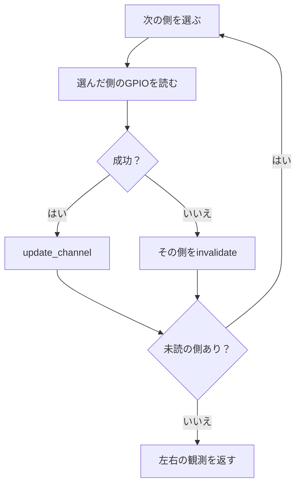
```mermaid
flowchart TB
 A["次の側を選ぶ"] --> B["選んだ側のGPIOを読む"]
 B --> C{"成功？"}
 C -->|"はい"| D["update_channel"]
 C -->|"いいえ"| E["その側をinvalidate"]
 D --> F{"未読の側あり？"}
 E --> F
 F -->|"はい"| A
 F -->|"いいえ"| G["左右の観測を返す"]
```

各読取直後の時刻を記録する。引数nowだけで左右が完全同時だったことにしない。

<a id="dd-fn-3"></a>

#### 3.7.3 update_channel（片側の候補を確定）

| 項目 | 内容 |
| --- | --- |
| 所属・入力 | TurnSignalMonitor / side、raw、now。 |
| 出力 | その側の安定状態・観測番号。 |

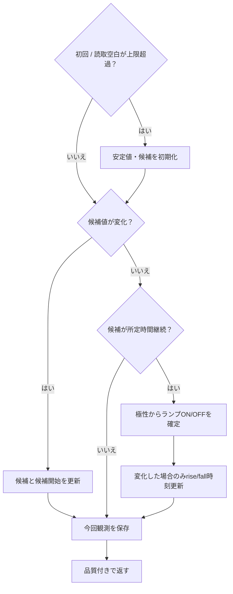
```mermaid
flowchart TB
 A{"初回 / 読取空白が上限超過？"} -->|"はい"| B["安定値・候補を初期化"]
 A -->|"いいえ"| C{"候補値が変化？"}
 B --> C
 C -->|"はい"| D["候補と候補開始を更新"]
 C -->|"いいえ"| E{"候補が所定時間継続？"}
 D --> H["今回観測を保存"]
 E -->|"いいえ"| H
 E -->|"はい"| F["極性からランプON/OFFを確定"]
 F --> G["変化した場合のみrise/fall時刻更新"]
 G --> H
 H --> I["品質付きで返す"]
```

<a id="dd-fn-4"></a>

#### 3.7.4 update_activity（ランプから活動を推定）

| 項目 | 内容 |
| --- | --- |
| 所属・入力 | BlinkActivityEstimator / side、sample、now。 |
| 出力 | activity、根拠、validity、期限。 |

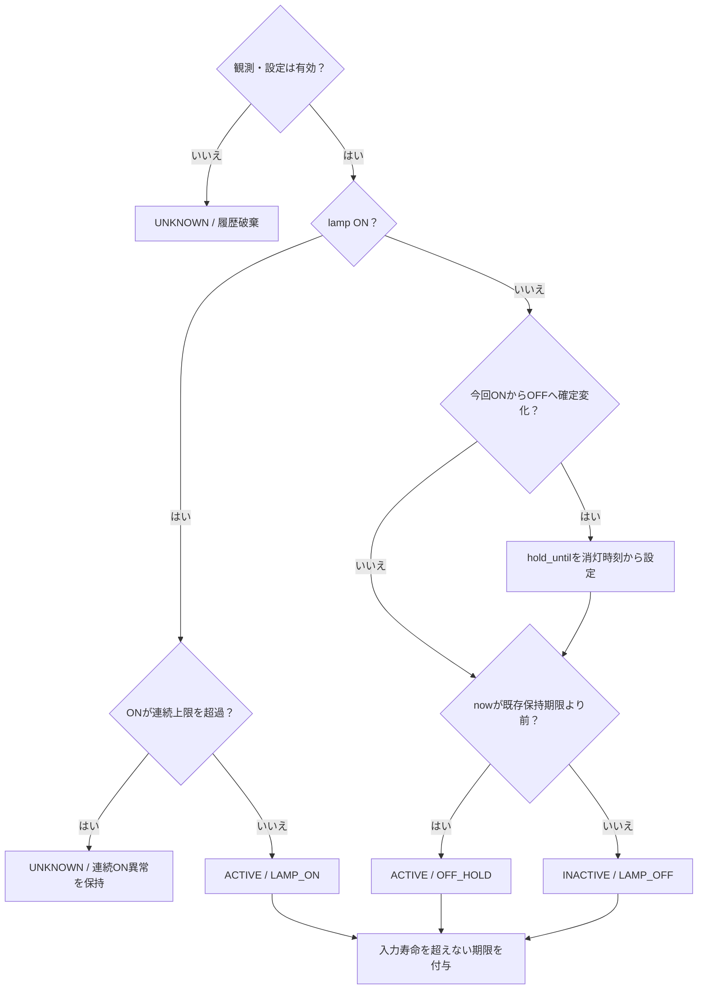
```mermaid
flowchart TB
 A{"観測・設定は有効？"} -->|"いいえ"| U["UNKNOWN / 履歴破棄"]
 A -->|"はい"| B{"lamp ON？"}
 B -->|"はい"| C{"ONが連続上限を超過？"}
 C -->|"はい"| K["UNKNOWN / 連続ON異常を保持"]
 C -->|"いいえ"| D["ACTIVE / LAMP_ON"]
 B -->|"いいえ"| E{"今回ONからOFFへ確定変化？"}
 E -->|"はい"| F["hold_untilを消灯時刻から設定"]
 E -->|"いいえ"| G{"nowが既存保持期限より前？"}
 F --> G
 G -->|"はい"| H["ACTIVE / OFF_HOLD"]
 G -->|"いいえ"| I["INACTIVE / LAMP_OFF"]
 D --> J["入力寿命を超えない期限を付与"]
 H --> J
 I --> J
```

境界now=hold_untilでは保持終了。入力観測が古ければ保持窓の途中でもUNKNOWN。新しいOFF観測は入力鮮度を更新するが保持期限は延長しない。

ON/OFFの変化は新しいsample_sequenceに対して1回だけ取り込む。同じ観測の周期的な再評価では期限だけを確認し、消灯時刻を作り直さない。
連続ON超過は、そのON区間の開始時刻と異常理由を保持してUNKNOWNを継続し、有効なOFFを確認するまでACTIVEへ戻さない。起動直後にONを採用した場合、連続時間は最初の安定ON採用時刻から測る。起動前の点灯時間は取得できない。

<a id="dd-fn-5"></a>

#### 3.7.5 evaluate_both（両側活動をまとめる）

| 項目 | 内容 |
| --- | --- |
| 所属・入力 | BlinkActivityEstimator / now、左右activity。 |
| 出力 | both_activityと根拠。 |

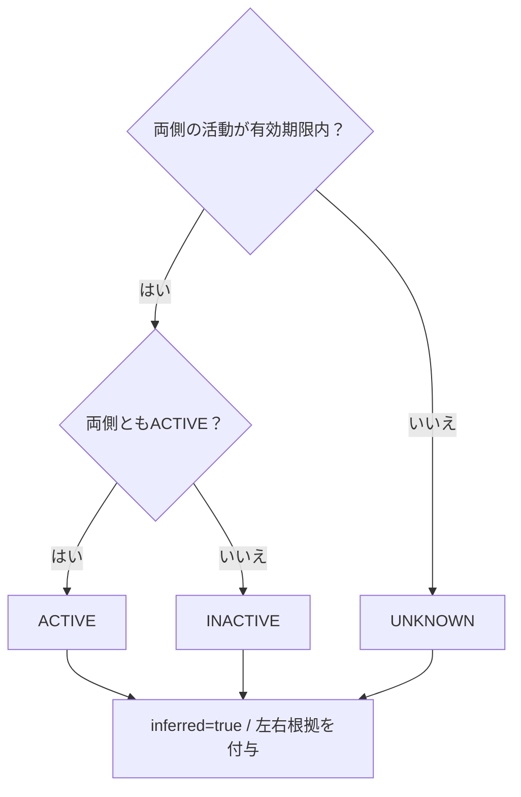
```mermaid
flowchart TB
 A{"両側の活動が有効期限内？"} -->|"いいえ"| U["UNKNOWN"]
 A -->|"はい"| B{"両側ともACTIVE？"}
 B -->|"はい"| Y["ACTIVE"]
 B -->|"いいえ"| N["INACTIVE"]
 Y --> E["inferred=true / 左右根拠を付与"]
 N --> E
 U --> E
```

有効期限は左右の早い方を超えない。片側UNKNOWNなら、他方がINACTIVEでも本設計では保守的にboth_activity=UNKNOWNとする。

<a id="dd-fn-6"></a>

#### 3.7.6 capture_and_send（前方映像を送る）

| 項目 | 内容 |
| --- | --- |
| 所属・入力 | FrontCameraService / CSI映像。 |
| 出力 | front映像、メタデータ、欠落情報。 |

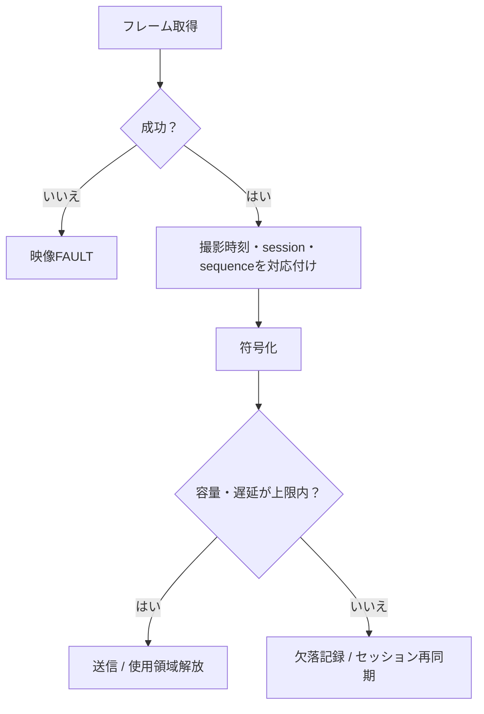
```mermaid
flowchart TB
 A["フレーム取得"] --> B{"成功？"}
 B -->|"いいえ"| X["映像FAULT"]
 B -->|"はい"| C["撮影時刻・session・sequenceを対応付け"]
 C --> D["符号化"]
 D --> E{"容量・遅延が上限内？"}
 E -->|"はい"| F["送信 / 使用領域解放"]
 E -->|"いいえ"| G["欠落記録 / セッション再同期"]
```

時刻不明はclock_quality=UNKNOWN。圧縮パケットを任意に間引いて正常な連続映像とは扱わない。

<a id="dd-fn-7"></a>

#### 3.7.7 publish_state（観測と推定を分けて通知）

| 項目 | 内容 |
| --- | --- |
| 所属・入力 | Sub2Api / snapshot、now。 |
| 出力 | 左右別の状態・推定・期限を含む通知。 |

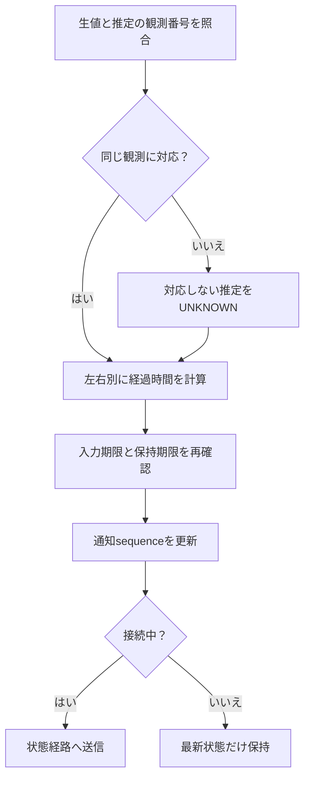
```mermaid
flowchart TB
 A["生値と推定の観測番号を照合"] --> B{"同じ観測に対応？"}
 B -->|"いいえ"| C["対応しない推定をUNKNOWN"]
 B -->|"はい"| D["左右別に経過時間を計算"]
 C --> D
 D --> E["入力期限と保持期限を再確認"]
 E --> F["通知sequenceを更新"]
 F --> G{"接続中？"}
 G -->|"はい"| H["状態経路へ送信"]
 G -->|"いいえ"| I["最新状態だけ保持"]
```

推定期限の満了も値の変化として通知する。映像の状態だけが変わった通知でも左右の観測時刻は維持する。

<a id="dd-fn-8"></a>

#### 3.7.8 reconnect（接続と履歴を初期化）

| 項目 | 内容 |
| --- | --- |
| 所属・入力 | Sub2Api / now、相手設定。 |
| 出力 | 最新観測からの配信、または再試行待ち。 |

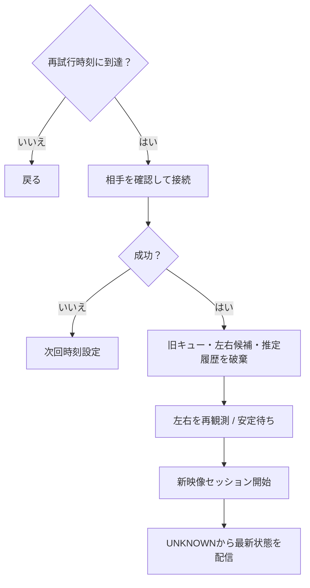
```mermaid
flowchart TB
 A{"再試行時刻に到達？"} -->|"いいえ"| Z["戻る"]
 A -->|"はい"| B["相手を確認して接続"]
 B --> C{"成功？"}
 C -->|"いいえ"| D["次回時刻設定"]
 C -->|"はい"| E["旧キュー・左右候補・推定履歴を破棄"]
 E --> F["左右を再観測 / 安定待ち"]
 F --> G["新映像セッション開始"]
 G --> H["UNKNOWNから最新状態を配信"]
```

サービスが再起動しない再接続ではboot_idは維持する。映像のstream_session_idと接続世代を更新し、状態sequenceは同一起動内で継続する。

<a id="dd-fn-9"></a>

#### 3.7.9 check_health（片側故障と処理停止を検出）

| 項目 | 内容 |
| --- | --- |
| 所属・入力 | Supervisor / now、経路状態。 |
| 出力 | 個別の故障・復旧指示。 |

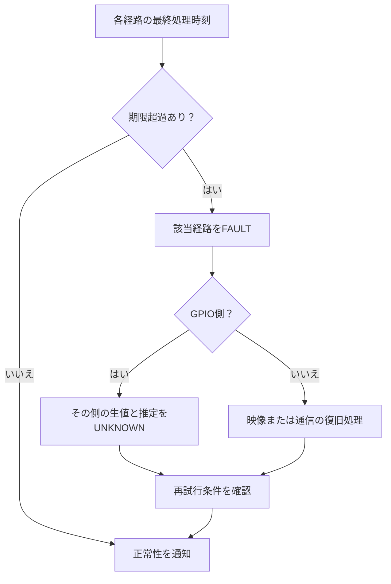
```mermaid
flowchart TB
 A["各経路の最終処理時刻"] --> B{"期限超過あり？"}
 B -->|"いいえ"| Z["正常性を通知"]
 B -->|"はい"| C["該当経路をFAULT"]
 C --> D{"GPIO側？"}
 D -->|"はい"| E["その側の生値と推定をUNKNOWN"]
 D -->|"いいえ"| F["映像または通信の復旧処理"]
 E --> G["再試行条件を確認"]
 F --> G
 G --> Z
```

<a id="dd-fn-10"></a>

#### 3.7.10 stop（新規生成を止めて解放）

| 項目 | 内容 |
| --- | --- |
| 所属・入力 | Supervisor / deadline。 |
| 出力 | 終了結果。 |

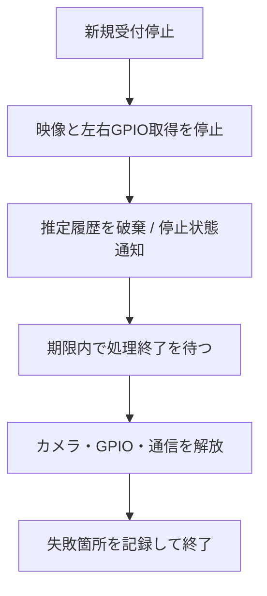
```mermaid
flowchart TB
 A["新規受付停止"] --> B["映像と左右GPIO取得を停止"]
 B --> C["推定履歴を破棄 / 停止状態通知"]
 C --> D["期限内で処理終了を待つ"]
 D --> E["カメラ・GPIO・通信を解放"]
 E --> F["失敗箇所を記録して終了"]
```

<a id="dd-4"></a>

## 4. インターフェース設計


<a id="dd-interface"></a>

### 4.1 接続図とデータの分離

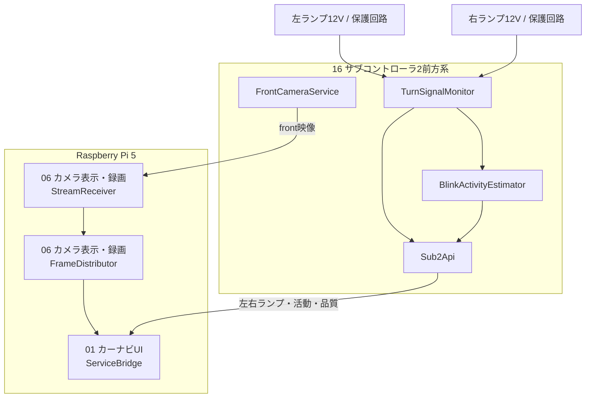
```mermaid
flowchart TB
 L["左ランプ12V / 保護回路"] --> G["TurnSignalMonitor"]
 R["右ランプ12V / 保護回路"] --> G
 subgraph SUB["16 サブコントローラ2前方系"]
  G --> E["BlinkActivityEstimator"]
  G --> A["Sub2Api"]
  E --> A
  C["FrontCameraService"]
 end
 subgraph PI5["Raspberry Pi 5"]
  UI["01 カーナビUI<br/>ServiceBridge"]
  RX["06 カメラ表示・録画<br/>StreamReceiver"]
  D["06 カメラ表示・録画<br/>FrameDistributor"]
  RX --> D
  D --> UI
 end
 A -->|"左右ランプ・活動・品質"| UI
 C -->|"front映像"| RX
```

| 情報 | 送信先・用途 | 保証しないこと |
| --- | --- | --- |
| left_lamp / right_lamp | 01 カーナビUI等。保護済み信号のON/OFF | スイッチ操作位置や車両ECU内部状態 |
| left_activity / right_activity | 左右表示の判断材料。生値と別の推定 | 確定した運転意図 |
| both_activity | 両側で活動を観測・推定したこと | ハザードスイッチON |
| front映像 | 06 カメラ表示・録画のStreamReceiver | 左右カメラ映像の代替 |
| GET_STATE / GET_HEALTH | 許可したPi 5からの参照 | 任意GPIO操作や任意シェル実行 |

GPIO番号と入力極性はT.B.D。車体12Vを直接接続しない。内部実装はEthernet TCP/45050のJSON Linesで動作するが、設定例はcandidateとして実機起動を拒否する。相手確認手順は実機導入前に固定する。

<a id="dd-freshness"></a>

### 4.2 鮮度と受信側の判断

通知は[共通仕様](00_共通仕様.md)に合わせる。左右ごとに観測時刻・経過時間・validityを付け、外側のサービス生存時刻だけで左右入力を有効にしない。
推定には根拠となるsample_sequenceとinferred=trueを付ける。OFF_HOLDでは元の消灯からの残り時間と入力観測の残り寿命の短い方まで有効とする。

01 カーナビUIは期限切れ・UNKNOWNを表示判断に使わず、後方表示などの優先順位と合わせて採否を決める。両側活動だけで左右カメラを交互に強制表示しない。
boot_id、source=sub2、schema_versionを確認し、front映像と後方サブコンのrear映像を混同しない。

異なるPiの単調時計は直接比較しない。観測から送信までの経過時間、受信後経過、検証済み通信遅延上限を含めて鮮度判定する。撮影時刻の品質不明は06 カメラ表示・録画へ明示し、同期済みとして俯瞰合成へ流さない。

<a id="dd-5"></a>

## 5. データ・設定設計


<a id="dd-data"></a>

### 5.1 左右別の状態データ

| データ | 内容 |
| --- | --- |
| LampSample（左右別） | side、raw_level、stable_level、lamp、sample_sequence、observed_at_utc、last_read_monotonic、validity、reason。 |
| 変化履歴（左右別） | last_rise、last_fall、on_since、candidate_since。単調時計で管理し、再起動をまたいで再利用しない。 |
| Activity（左右別） | ACTIVE/INACTIVE/UNKNOWN、inferred=true、basis=LAMP_ON/OFF_HOLD/LAMP_OFF/UNKNOWN、hold_until、source_sample_sequence、残り寿命。 |
| BothActivity | 値、左右の推定番号と根拠、validity。ハザード確定フィールドは作らない。 |
| StateEnvelope | schema_version、source=sub2、boot_id、通知sequence、経路状態。観測の寿命は各項目が持つ。 |
| VideoMetadata | camera_id=front、boot_id、stream_session_id、sequence、captured_at、capture_clock_id、clock_quality。 |

生値とはGPIOの電気レベル、lampとは極性変換と安定判定後のランプ状態、activityとは操作継続の推定。3種類を混同しない。

<a id="dd-config"></a>

### 5.2 設定と未確定時の動作

| 設定 | 決定方法 | 未確定・不正時 |
| --- | --- | --- |
| left_gpio / right_gpio / active_level | 最新HWと各入力回路を実測 | 該当側を開かずUNKNOWN。左右同じGPIOは設定エラー。 |
| poll_ms / debounce_ms / max_read_gap_ms | 通常点滅・短いノイズ・ハイフラ時の波形で決定 | 生状態取得の受入未完了。 |
| activity_hold_ms | 正常な消灯区間を覆い、解除遅延を許容範囲に収める実測値 | 推定を無効にしUNKNOWN。 |
| max_continuous_on_ms | 正常な最長点灯を上回り、連続ON異常を検出できる値 | 推定を有効化しない。 |
| input_valid_for_ms / publish_interval_ms | 読取・配信・遅延上限を含めて設計 | 安全判断へ供給しない。 |
| camera / transport_profile | Pi 3BのCPU、温度、転送量と必要画質を測定 | 映像経路を無効。 |
| video_queue_limit / max_video_age | メモリ上限と映像遅延から決定 | 無制限運用しない。 |
| peer / retry / stop_timeout | 接続相手・再試行・終了の要件 | 共通設定エラー。 |

活動保持時間の数値を推測で固定しない。入力の安定判定で短い点灯を消してしまわないこと、消灯後に表示が残り過ぎないことの両方を試験する。

<a id="dd-6"></a>

## 6. 処理・状態遷移


<a id="dd-activity-state"></a>

### 6.1 活動推定の状態

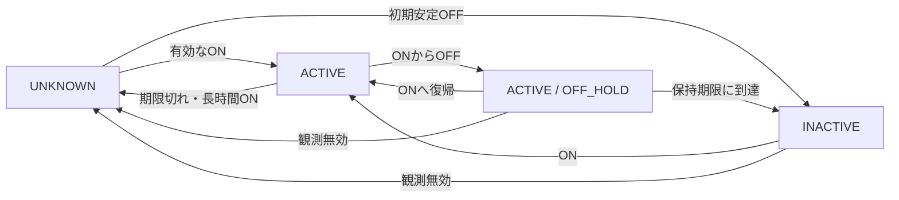
```mermaid
flowchart LR
 U["UNKNOWN"] -->|"有効なON"| A["ACTIVE"]
 U -->|"初期安定OFF"| I["INACTIVE"]
 A -->|"ONからOFF"| H["ACTIVE / OFF_HOLD"]
 H -->|"保持期限に到達"| I
 H -->|"ONへ復帰"| A
 I -->|"ON"| A
 A -->|"期限切れ・長時間ON"| U
 H -->|"観測無効"| U
 I -->|"観測無効"| U
```

OFF_HOLDは外部値ACTIVEの内部理由。活動推定の更新は信号変化時だけでなく周期処理でも呼び、変化がないまま期限到達した場合も解除する。

<a id="dd-state-table"></a>

### 6.2 組合せと部分異常

| 左活動 | 右活動 | both_activity | 扱い |
| --- | --- | --- | --- |
| ACTIVE | INACTIVE | INACTIVE | 左活動のみ |
| INACTIVE | ACTIVE | INACTIVE | 右活動のみ |
| ACTIVE | ACTIVE | ACTIVE | 両側活動。ハザード確定ではない |
| INACTIVE | INACTIVE | INACTIVE | 活動なし |
| UNKNOWN | 任意 | UNKNOWN | 左を判定できない。右の独立状態は保持 |
| 任意 | UNKNOWN | UNKNOWN | 右を判定できない。左の独立状態は保持 |

全体はINIT→CONNECTING→RUNNING。左右・映像・通信の一部不良でDEGRADED、共通設定不良でFAULT。停止要求はSTOPPINGへ優先し、復旧処理中でも新規取得を止める。

<a id="dd-7"></a>

## 7. 異常処理

| 異常 | 動作 | 禁止する扱い |
| --- | --- | --- |
| 片側読取失敗 | その側のlampとactivityをUNKNOWN、履歴破棄 | 他側も一律OFFにする |
| 点滅間の消灯 | 生状態OFF、期限内のみOFF_HOLD | 消灯を必ず断線と判定 |
| 連続ONが上限超過 | lamp=ONの観測は残し、activityはUNKNOWN/異常理由 | 正常な点滅継続と断定 |
| 短すぎる点滅・ノイズ | 生値、安定判定結果、欠落した変化を試験ログで照合 | ソフトだけで電気ノイズを完全除去できるとする |
| 監視ループ停止 | 入力期限超過、候補・推定を破棄 | 古い活動を最新状態で再通知 |
| カメラ異常 | 映像FAULT、信号は継続 | 録画障害をウィンカーOFFに変換 |
| 通信断 | 受信側のTTLで無効化し再接続時履歴破棄 | 古い点滅履歴を再送して画面を切替 |
| GPIO LOW | 極性に従って扱い、診断能力の限界を明示 | 回路根拠なく配線正常または断線を断定 |
| 時刻対応不明 | clock_quality=UNKNOWN | 受信時刻を撮影時刻とする |

<a id="dd-8"></a>

## 8. 起動・終了・運用設計

専用サービスとして設定・接続相手を確認した後、左右入力と前方映像を独立に開始する。GPIOは読取専用。起動直後の左右lamp/activityはUNKNOWNで、初期安定待ちを省略しない。
状態通信が再接続した場合は両側の候補と点滅推定履歴を初期化する。片側だけのGPIO復旧では正常側の履歴を消さない。

映像処理と信号処理の実行待ちを分け、Supervisorがどちらの処理も監視できるようにする。解像度・fps・符号化方式はPi 3Bの実測で決める。CPU、温度、メモリ、フレーム欠落、信号通知遅延を記録する。
通常ログには状態変化・理由・時刻・観測番号を残し、全映像や秘密情報を含めない。

停止時は新規受付と取得を止め、推定を無効化して可能なら停止状態を送る。その後、カメラ・GPIO・通信を解放する。給電停止のタイミングはサブコンのHW電源設計と整合させ、Pi 5が止まったことだけでPi 3Bが安全に停止済みとは判断しない。

<a id="dd-9"></a>

## 9. 試験・受入条件

| ID | 対象 | 入力・状況 | 期待結果 |
| --- | --- | --- | --- |
| S2-T01 | SUB2-01 | 片側GPIO未設定 | 該当側UNKNOWN。他側・映像は独立条件で継続。 |
| S2-T02 | SUB2-02 | 左だけ点滅 / 右だけ点滅 | 左右の値と時刻を混同しない。 |
| S2-T03 | SUB2-02 | 起動時ON/OFF、不安定入力 | 初期安定待ちまでUNKNOWN。 |
| S2-T04 | SUB2-03 | 点灯→消灯→点灯 | 生状態はON/OFF、推定は設定した消灯窓内でACTIVE。 |
| S2-T05 | SUB2-03 | 消灯後OFFを繰返し読み直す | 保持期限を延長せず境界でINACTIVE。 |
| S2-T06 | SUB2-03 | 保持中の入力TTL切れ | 保持残時間があってもUNKNOWN。 |
| S2-T07 | SUB2-03 | 連続ONが上限到達・超過 | 定義した境界で異常判定。lamp観測はONとして区別。 |
| S2-T08 | SUB2-04 | 両側点滅 / 左右操作の切替で保持窓重複 | both_activityを出せてもハザード確定と表示しない。 |
| S2-T09 | SUB2-02・03 | 通常点滅とハイフラ模擬 | 許容する波形を見落とさず、許容外は理由付き。 |
| S2-T10 | SUB2-02 | 片側の読取例外 | 他側の読取を省略せず、映像も継続。 |
| S2-T11 | SUB2-05・06 | 映像高負荷・送信詰まり | GPIO読取・活動期限処理が上限遅延内。 |
| S2-T12 | SUB2-06 | LAN復旧時に旧通知混入 | 履歴破棄と再観測、旧セッション・旧起動を拒否。 |
| S2-T13 | SUB2-06 | 推定だけ期限満了 | 新GPIO変化がなくても解除を通知。 |
| S2-T14 | SUB2-06 | 停止要求時にカメラ停止不能 | 全体が無期限に待たず、失敗を記録。 |

試験は未実施。実車の波形と処理遅延を確定するまで、activityによる自動画面切替は受入完了としない。

<a id="dd-10"></a>

## 10. 未確定事項・実装課題

| 項目 | 確定する内容 |
| --- | --- |
| 電気条件 | 左右GPIOと極性、入力保護、断線診断の可否。 |
| 活動の推定条件 | 消灯保持、連続ON上限、通常点滅・ハイフラ時の許容範囲。 |
| 受信側動作 | 01 カーナビUIでの左右表示の採否、後方表示との優先順位。 |
| 映像 | CSIカメラ、採用API、コーデック・解像度・fpsと転送方式。 |
| 通信・時刻 | 認証、ポート、配信方式、時計同期、遅延上限、TTL。 |
| 運用 | 給電・停止方式、独立処理の実装手段、CPU・温度・メモリ上限。 |

<a id="dd-notes"></a>

## 用語の注釈

| 用語 | 意味 |
| --- | --- |
| 生値 / 安定値 | GPIOの読取値 / 一定時間の確認後に採用した値。 |
| 活動推定 | ランプが消えている点滅の合間も、操作が続いている候補として一定時間扱うこと。 |
| 保持窓 | 最後の確定消灯から活動ありを維持する有限の期間。 |
| ハイフラ | 通常より速い点滅。入力回路と安定判定が追従するか確認する対象。 |
| 部分稼働 | 一部の経路が故障しても、独立した正常経路を動かし続けること。 |
