# ドアロック制御 詳細設計書

| 項目 | 内容 |
| --- | --- |
| 文書ID | SW-DD-17 |
| 実行環境 | Pi 5 |
| 実装状態 | 内部実装済み・初期無効・実車未検証 |
| 対象ソース | `src/raspberry_pi5/door_lock_service.py`、`src/raspberry_pi5/door_lock/`、`src/raspberry_pi5/telemetry_ipc.py` |
| 作成日 | 2026-09-14 |
| 更新日 | 2026-09-20 |

[詳細設計一覧](README.md) / [共通仕様](00_共通仕様.md) / [上位設計](../ソフトウェア設計図.md#sec-46)

## 目次
- [1. 目的・適用範囲](#dd-1)
- [2. 要求仕様・役割](#dd-2)
  - [2.1 機能一覧](#dd-functions)
  - [2.2 機能・モジュール・関数の対応](#dd-function-module-map)
- [3. 内部構成](#dd-3)
  - [3.1 モジュールの全体構成](#dd-overview)
  - [3.2 機能別処理フローチャート](#dd-features)
    - [3.2.1 要求を受け付けるまで（LOCK-01・02）](#dd-feature-1)
    - [3.2.2 排他と短時間出力（LOCK-03・04）](#dd-feature-2)
    - [3.2.3 条件変化・異常での中断（LOCK-05）](#dd-feature-3)
    - [3.2.4 再起動時の未完了処理（LOCK-06）](#dd-feature-4)
  - [3.3 モジュールツリー](#dd-tree)
  - [3.4 モジュール間の処理順序](#dd-sequence)
  - [3.5 モジュール詳細](#dd-modules)
    - [3.5.1 CommandValidator（要求を検証）](#dd-module-1)
    - [3.5.2 SafetyGate（操作条件を判断）](#dd-module-2)
    - [3.5.3 PulseSequencer（操作順序と期限）](#dd-module-3)
    - [3.5.4 OutputDriver（GPIOへの唯一の書込窓口）](#dd-module-4)
    - [3.5.5 CommandResultStore（要求履歴と重複防止）](#dd-module-5)
  - [3.6 ファイル構成](#dd-files)
  - [3.7 関数のフローチャート](#dd-functions-flow)
    - [3.7.1 validate_command（操作要求を検証）](#dd-fn-1)
    - [3.7.2 evaluate_conditions（操作条件を確認）](#dd-fn-2)
    - [3.7.3 process_command（実行権と記録を確保）](#dd-fn-3)
    - [3.7.4 begin_pulse（片側出力を開始）](#dd-fn-4)
    - [3.7.5 tick（出力中の時間と条件を監視）](#dd-fn-5)
    - [3.7.6 activate_one（両側同時出力を拒否）](#dd-fn-6)
    - [3.7.7 release_all（両方の出力を解除）](#dd-fn-7)
    - [3.7.8 finish_pulse / abort_pulse（解除して結果を確定）](#dd-fn-8)
    - [3.7.9 reserve（再出力防止の記録を確定）](#dd-fn-9)
    - [3.7.10 recover_incomplete（前回の未完了要求を照合）](#dd-fn-10)
    - [3.7.11 stop（新規受付を止めて解除）](#dd-fn-11)
- [4. インターフェース設計](#dd-4)
  - [4.1 接続図](#dd-interface)
  - [4.2 コマンドと結果](#dd-command-contract)
  - [4.3 期限・再起動・重複の契約](#dd-replay)
- [5. データ・設定設計](#dd-5)
  - [5.1 保持するデータ](#dd-data)
  - [5.2 設定項目](#dd-config)
- [6. 処理・状態遷移](#dd-6)
- [7. 異常処理](#dd-7)
- [8. 起動・終了・運用設計](#dd-8)
- [9. 試験・受入条件](#dd-9)
- [10. 未確定事項・実装課題](#dd-10)
- [用語の注釈](#dd-notes)

<a id="dd-1"></a>

## 1. 目的・適用範囲

Pi 5から保護・駆動回路を介し、車体側のドアロック操作信号インターフェースへLOCK / UNLOCKの短時間信号を出す。
本機能は内部実装済みだが、初期リリースではenabled=falseとする。以下は実車へ接続できる完成仕様ではなく、電気条件・車速条件・受入試験が完了するまで実車出力を有効化しない。

[01 カーナビUI](01_カーナビUI.md)からの明示的な操作を対象とし、車速連動の自動施錠、通信断での自動解錠、起動直後の前回要求再開は行わない。
モーターや車体12VをGPIOで直接駆動しない。出力先と電気条件は[ハードウェア設計書のドアロック制御](../../HW設計/ハードウェア設計書.md#sec-423)で確認する。
ソフトは出力指示の完了を記録できるが、実ドアの施錠状態は別のフィードバックがなければUNKNOWNとする。

<a id="dd-2"></a>

## 2. 要求仕様・役割


<a id="dd-functions"></a>

### 2.1 機能一覧

| ID | 機能 | 実現する動作 |
| --- | --- | --- |
| LOCK-01 | 操作要求の検証 | 開始条件・入力: UIからのcommand_id付き要求。確認・処理: 許可元、セッション、形式、LOCK/UNLOCK、期限、重複を確認する。処理結果: 不正要求はGPIOに触れず拒否し、重複は既知結果を返す。 |
| LOCK-02 | 操作条件の確認 | 開始条件・入力: 形式が正しい新規要求。確認・処理: 有効化済み設定、新鮮で有効な車速、停車条件、運用許可、出力系正常性を確認。処理結果: 不明・古い条件を許可扱いにせず拒否する。 |
| LOCK-03 | 片側の短時間出力 | 開始条件・入力: 操作条件を満たす要求。確認・処理: 1件だけ実行権を確保し、実行前記録を確定後、両側解除→対象側出力→期限内解除を行う。処理結果: 正常に完了すればPULSE_COMPLETEDを記録する。 |
| LOCK-04 | 重複・連打の抑止 | 開始条件・入力: 同じID、実行中の別要求、操作後の待機中の要求。確認・処理: ID記録と実行状態を確認。処理結果: 同じ要求を再実行せず、待機キューにためて後から動かさない。 |
| LOCK-05 | 異常時の解除 | 開始条件・入力: 条件悪化、期限、出力例外、停止要求。確認・処理: 新規操作を禁止して両側解除を試行し、解除結果と不確実性を記録。処理結果: 中断・失敗・不明を正常完了と区別する。 |
| LOCK-06 | 終了・再起動後の照合 | 開始条件・入力: 起動時記録、停止要求。確認・処理: 前回未完了の記録をUNKNOWNへ整理し、前回操作を再送しない。処理結果: 明示的な再有効化条件を満たすまで操作を禁止する。 |

<a id="dd-function-module-map"></a>

### 2.2 機能・モジュール・関数の対応

| 機能 | モジュール | 関数案 |
| --- | --- | --- |
| LOCK-01 | CommandValidator | validate_command |
| LOCK-02 | SafetyGate | evaluate_conditions / check_during_pulse |
| LOCK-03・04 | PulseSequencer | process_command / begin_pulse / tick / finish_pulse |
| LOCK-03・05 | OutputDriver | open_inactive / release_all / activate_one / close |
| LOCK-04・06 | CommandResultStore | lookup / reserve / complete / recover_incomplete |
| LOCK-05・06 | PulseSequencer | abort_pulse / stop |

PulseSequencerだけが操作の順序と排他を管理し、OutputDriverだけがGPIOへ書き込む。UIにはピン番号・極性・パルス幅を指定させない。

<a id="dd-3"></a>

## 3. 内部構成


<a id="dd-overview"></a>

### 3.1 モジュールの全体構成

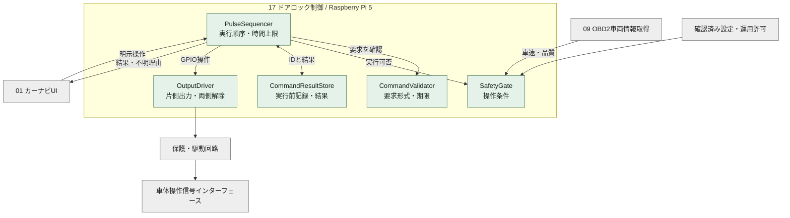

緑は対象ソフト、グレーは外部。09 OBD2車両情報取得の車速がコペンL880Kで取得・検証できることは前提にしない。車速を取得できなければSafetyGateは操作を許可しない。

<a id="dd-features"></a>

### 3.2 機能別処理フローチャート


<a id="dd-feature-1"></a>

#### 3.2.1 要求を受け付けるまで（LOCK-01・02）

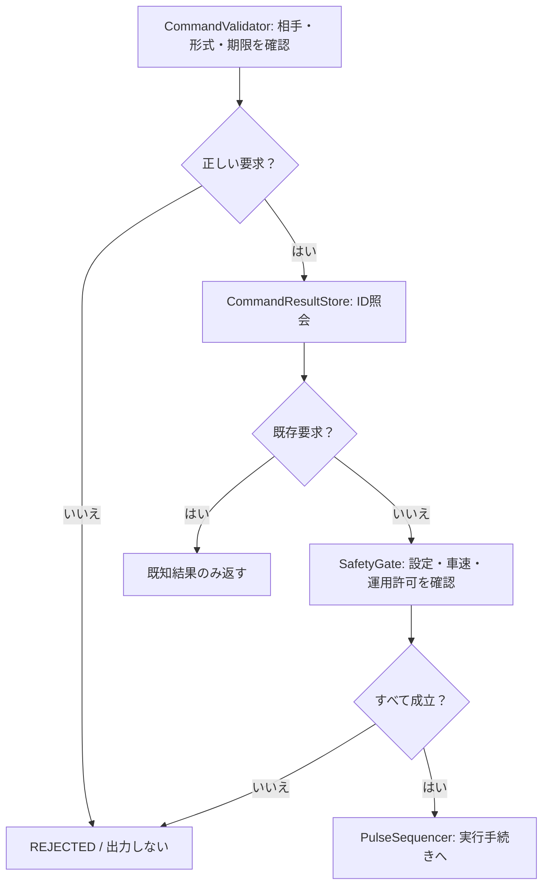

<a id="dd-feature-2"></a>

#### 3.2.2 排他と短時間出力（LOCK-03・04）

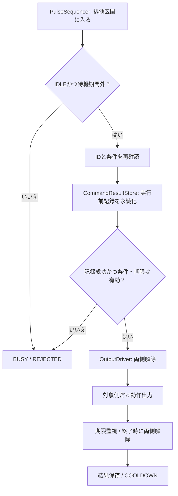

データ保存に時間がかかっても、出力直前に条件と期限を再確認する。要求受付から時間が経った操作を無条件に実行しない。

<a id="dd-feature-3"></a>

#### 3.2.3 条件変化・異常での中断（LOCK-05）

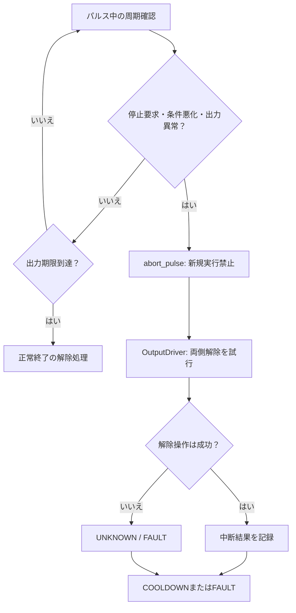

解除APIの成功はリレー接点の実際の開放や施錠結果を証明しない。物理的な確認の有無を結果へ分けて残す。

<a id="dd-feature-4"></a>

#### 3.2.4 再起動時の未完了処理（LOCK-06）

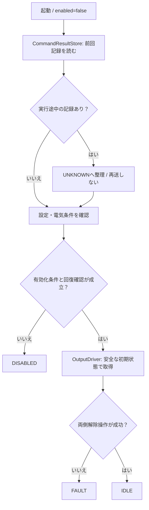

<a id="dd-tree"></a>

### 3.3 モジュールツリー

```text
door_lock_service
+-- main: 設定読込・接続受付・開始/終了
+-- PulseSequencer
|   +-- 1件だけの実行権
|   +-- パルス期限・再操作待機期限
|   +-- 中断・停止
+-- CommandValidator
|   +-- 操作元・要求形式・期限
+-- SafetyGate
|   +-- 設定・運用許可
|   +-- 車速の値・品質・鮮度
+-- CommandResultStore
|   +-- ID照会・実行前予約
|   +-- 結果保存・再起動時照合
+-- OutputDriver
    +-- 出力取得・両側解除
    +-- 片側だけ動作出力
    +-- 解放
```

mainは開始点であり独立した業務機能ではない。通信受付がGPIO操作を直接呼ぶ経路は作らない。

<a id="dd-sequence"></a>

### 3.4 モジュール間の処理順序

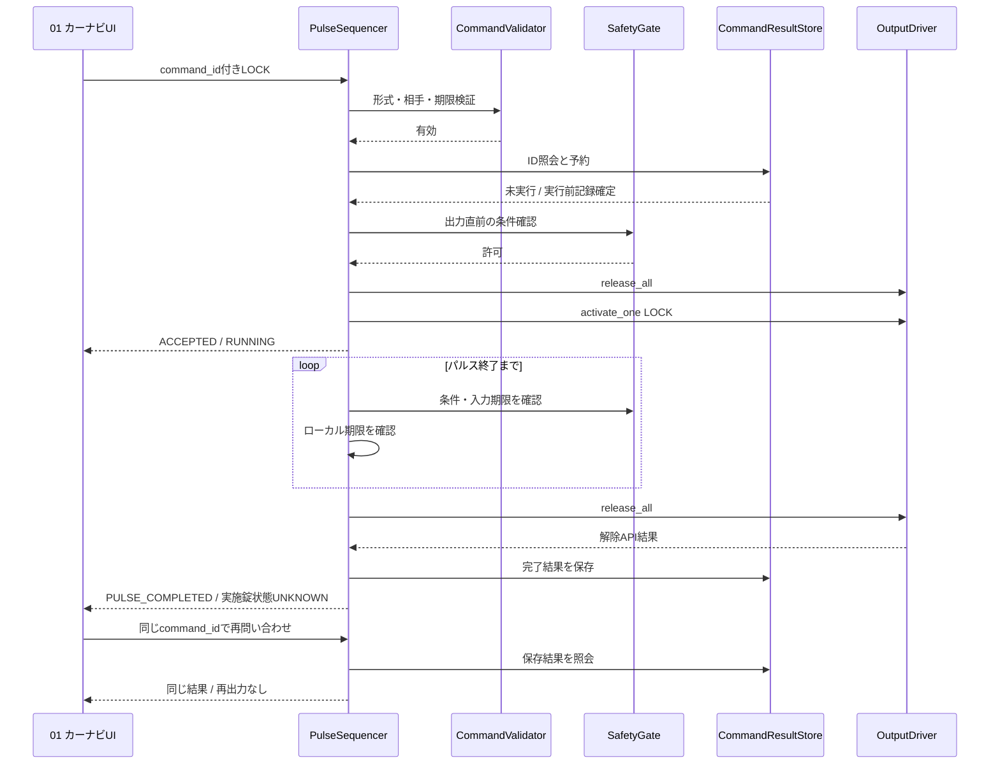

予約前の重複照会と出力条件確認も行い、図は正常経路を示す。ACCEPTEDは実行受付であって施錠成功ではない。結果保存失敗時は不明として新規操作を止める。

<a id="dd-modules"></a>

### 3.5 モジュール詳細


<a id="dd-module-1"></a>

#### 3.5.1 CommandValidator（要求を検証）

| 項目 | 設計内容 |
| --- | --- |
| 入力 | 認証済み操作元、セッション、command_id、operation、有効期間。 |
| 出力 | 検証済みCommandまたはREJECTEDと理由。 |
| 保持情報 | 許可操作名、許可元、schema_version、現在の受付セッション、要求寿命上限。 |
| 処理 | 必須項目・型・長さを検証。LOCK/UNLOCK以外、未知フィールドによる任意設定、古いセッションを拒否。 |
| 関数 | validate_command(request, caller, now)。 |
| 異常時 | 不正要求を出力経路へ渡さない。呼出し元の自己申告名だけで認可しない。 |

<a id="dd-module-2"></a>

#### 3.5.2 SafetyGate（操作条件を判断）

| 項目 | 設計内容 |
| --- | --- |
| 入力 | enabled、確認済み設定、車速値・品質・観測時刻、運用許可、ドライバ正常性。 |
| 出力 | allowed、reason、条件評価時刻、有効期限。 |
| 保持情報 | 最新車両値と元観測時刻、許可状態、設定世代。 |
| 処理 | 条件はANDで確認。不明・古い値・取得不能・起動途中は許可しない。実行中も再評価する。 |
| 関数 | evaluate_conditions(command, now)、check_during_pulse(now)。 |
| 異常時 | 09 OBD2車両情報取得から車速が来ない場合に0m/sを補わない。値0だけで全安全条件を満たしたことにしない。 |

<a id="dd-module-3"></a>

#### 3.5.3 PulseSequencer（操作順序と期限）

| 項目 | 設計内容 |
| --- | --- |
| 入力 | 検証済み要求、条件評価結果、タイマー、停止要求。 |
| 出力 | 片側出力と両側解除の指示、結果通知、状態変化。 |
| 保持情報 | state、active_command、pulse_deadline、cooldown_until、排他権、停止フラグ。 |
| 処理 | 1件の実行権を確保し、永続予約後に条件を再確認。両側解除に続いて片側だけ動作させ、ローカル単調時計で期限を監視する。 |
| 関数 | process_command、begin_pulse、tick、finish_pulse、abort_pulse、stop。 |
| 異常時 | 実行中・COOLDOWN中の別要求は拒否し、待機キューへ入れない。想定外例外でも解除処理へ進める構造にする。 |

<a id="dd-module-4"></a>

#### 3.5.4 OutputDriver（GPIOへの唯一の書込窓口）

| 項目 | 設計内容 |
| --- | --- |
| 入力 | 確認済みピンと極性、操作方向、解除指示。 |
| 出力 | 保護・駆動回路への論理出力、APIの実行結果。 |
| 保持情報 | GPIOハンドル、commanded_lock、commanded_unlock、opened、fault_reason。 |
| 処理 | 取得時の非動作値指定、両側解除、片側だけ出力、終了時解除の順序を守る。別モジュールへGPIOハンドルを渡さない。 |
| 関数 | open_inactive、release_all、activate_one、close。 |
| 異常時 | 片側解除失敗でも他側解除を試す。故障フラグを保持し、以後のactivate_oneを拒否。 |
| 確認の限界 | GPIO値の読戻しはリレー接点や実ドア状態のフィードバックではない。解除したつもりを物理解除確認済みと記録しない。 |

<a id="dd-module-5"></a>

#### 3.5.5 CommandResultStore（要求履歴と重複防止）

| 項目 | 設計内容 |
| --- | --- |
| 入力 | 操作元・command_id・要求内容、実行開始・終了結果。 |
| 出力 | 既存結果、予約成否、再起動後の未完了一覧。 |
| 保持情報 | 永続記録: 要求ID、内容指紋、受付セッション、実行段階、出力開始終了時刻、理由、物理状態UNKNOWN。 |
| 処理 | 出力前に一意な予約を永続化。出力後に結果を追記。IDが同じで内容が違う要求は拒否。 |
| 関数 | lookup、reserve、complete、recover_incomplete。 |
| 異常時 | 記録の保存失敗・破損は新規実行禁止。RESERVED/RUNNINGで終了した記録はUNKNOWNへ整理して再出力しない。 |

<a id="dd-files"></a>

### 3.6 ファイル構成

```text
src/raspberry_pi5/
+-- door_lock_service.py               開始点
+-- door_lock/
    +-- command_validator.py
    +-- safety_gate.py
    +-- pulse_sequencer.py
    +-- output_driver.py
    +-- command_result_store.py
    +-- models.py
    +-- config.py
tests/door_lock/
+-- test_command_validation.py
+-- test_safety_gate.py
+-- test_pulse_interlock.py
+-- test_duplicate_recovery.py
+-- test_output_failures.py
```

実装済み。永続記録用JSONは実行時専用領域に配置し、公開Gitに実行履歴・運用許可・秘密情報を含めない。テストは実GPIOではなく代替ドライバから始める。

<a id="dd-functions-flow"></a>

### 3.7 関数のフローチャート


<a id="dd-fn-1"></a>

#### 3.7.1 validate_command（操作要求を検証）

| 項目 | 内容 |
| --- | --- |
| 所属・入力 | CommandValidator / request、caller、now。 |
| 出力 | Commandまたは拒否理由。 |

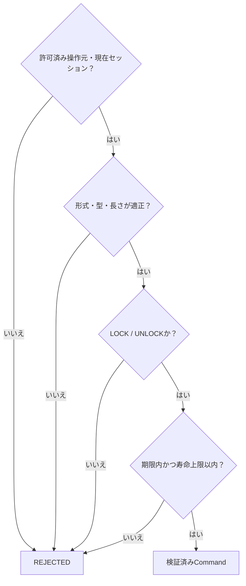

<a id="dd-fn-2"></a>

#### 3.7.2 evaluate_conditions（操作条件を確認）

| 項目 | 内容 |
| --- | --- |
| 所属・入力 | SafetyGate / command、now。 |
| 出力 | allowedと理由・期限。 |

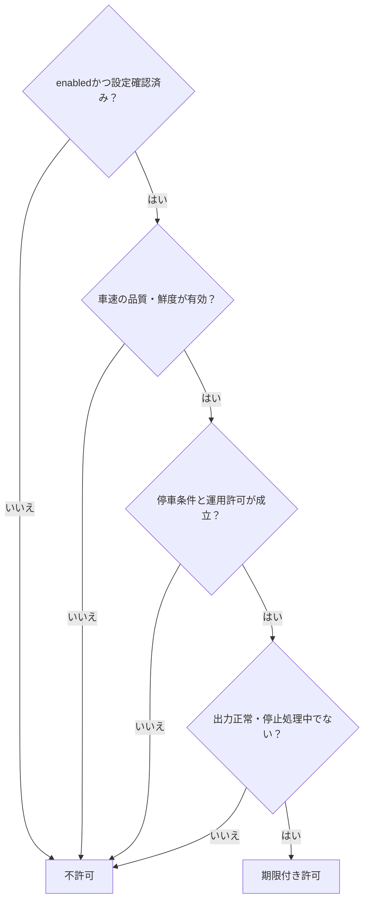

停止とみなす閾値・継続確認時間は実車の取得特性を踏まえてT.B.D。負値や範囲外の車速を絶対値や0に丸めて通さない。

<a id="dd-fn-3"></a>

#### 3.7.3 process_command（実行権と記録を確保）

| 項目 | 内容 |
| --- | --- |
| 所属・入力 | PulseSequencer / request。 |
| 出力 | 既存結果、拒否、または実行開始。 |

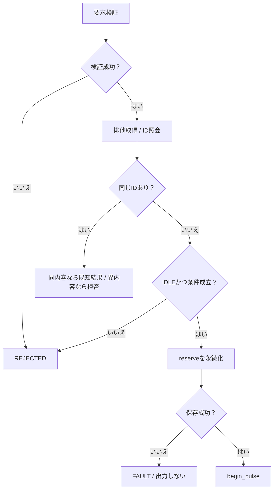

同時に到着した2要求の双方がIDLEを通過しないよう、状態確認から予約・実行権保持までを排他区間にする。長いネットワーク待ちは入れない。

<a id="dd-fn-4"></a>

#### 3.7.4 begin_pulse（片側出力を開始）

| 項目 | 内容 |
| --- | --- |
| 所属・入力 | PulseSequencer / 予約済みCommand。 |
| 出力 | PULSING_LOCKまたはPULSING_UNLOCK、失敗結果。 |

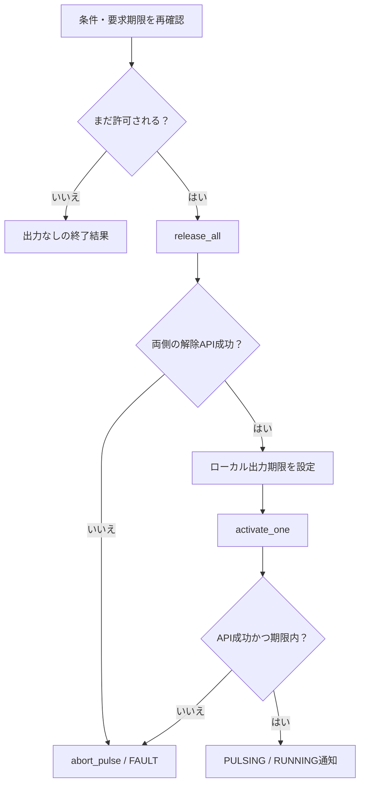

期限は出力APIを呼ぶ直前の単調時計から設定する。呼出し遅延で所定時間を過ぎた場合は直ちに解除へ進む。APIが停止する場合の上限は外部回路で補う。

<a id="dd-fn-5"></a>

#### 3.7.5 tick（出力中の時間と条件を監視）

| 項目 | 内容 |
| --- | --- |
| 所属・入力 | PulseSequencer / now。 |
| 出力 | 継続・正常解除・中断。 |

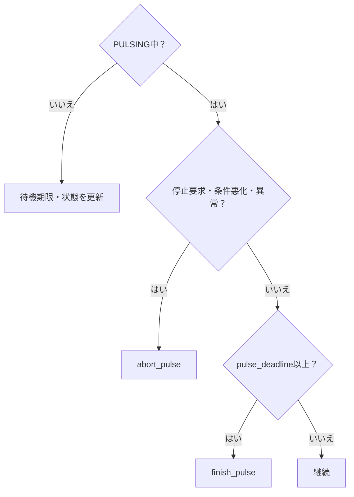

新しいコマンドが来なくても周期的に呼ぶ。ネットワーク応答やDB書込みを待つ処理とは別に期限確認を進める。

<a id="dd-fn-6"></a>

#### 3.7.6 activate_one（両側同時出力を拒否）

| 項目 | 内容 |
| --- | --- |
| 所属・入力 | OutputDriver / LOCKまたはUNLOCK。 |
| 出力 | 対象側の動作出力または例外。 |

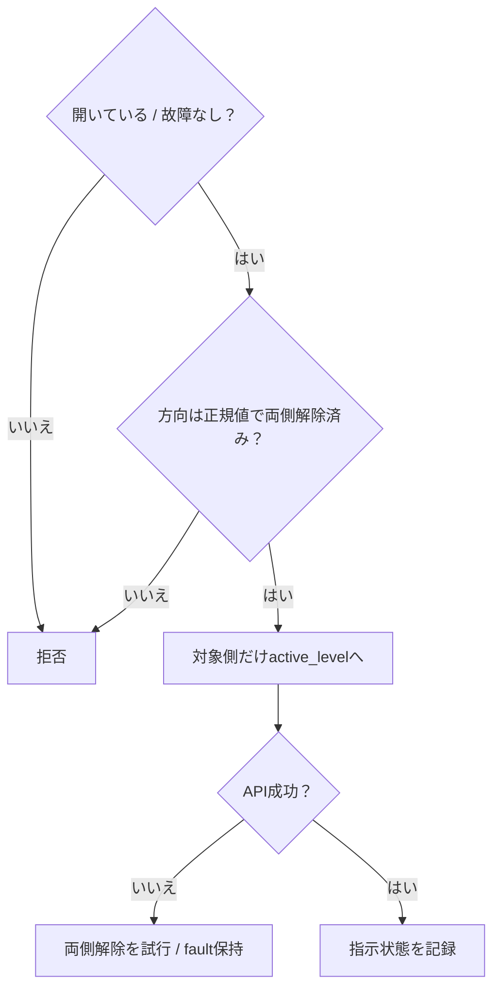

ドライバ単独でも排他条件を検証する。指示状態の確認だけで物理的な同時出力故障を検知できるとはしない。

<a id="dd-fn-7"></a>

#### 3.7.7 release_all（両方の出力を解除）

| 項目 | 内容 |
| --- | --- |
| 所属・入力 | OutputDriver / 取得済み出力。 |
| 出力 | 側ごとの解除API結果。 |

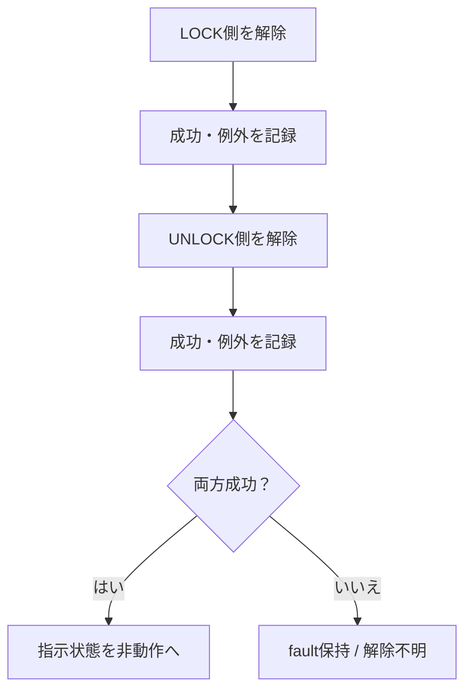

LOCK側が例外でもUNLOCK側の解除を省略しない。解除が必要な場面では、結果保存より先に実行する。

<a id="dd-fn-8"></a>

#### 3.7.8 finish_pulse / abort_pulse（解除して結果を確定）

| 項目 | 内容 |
| --- | --- |
| 所属・入力 | PulseSequencer / 正常終了または中断理由。 |
| 出力 | PULSE_COMPLETED、FAILEDまたはUNKNOWN。 |

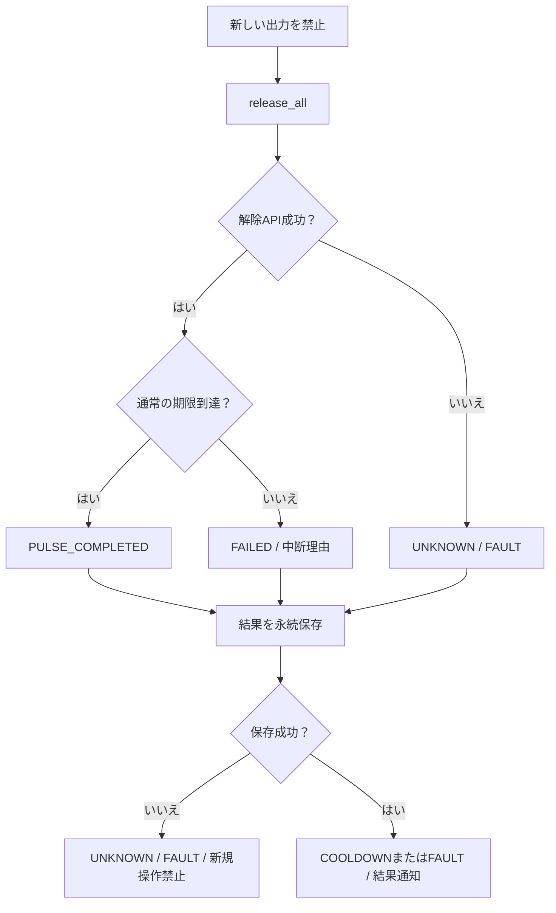

成功した解除後も、実施錠状態はUNKNOWNのまま。出力開始前の拒否と、出力後の中断は記録で区別する。

<a id="dd-fn-9"></a>

#### 3.7.9 reserve（再出力防止の記録を確定）

| 項目 | 内容 |
| --- | --- |
| 所属・入力 | CommandResultStore / caller、command_id、内容指紋。 |
| 出力 | 予約成功、既存結果、ID競合、保存失敗。 |

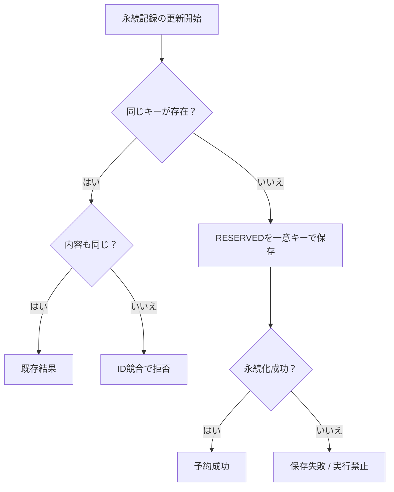

キーは認証済み操作元とcommand_id。GPIOと記録更新を1つの原子的操作にはできないため、途中停止はUNKNOWNとし、自動再実行で穴埋めしない。

<a id="dd-fn-10"></a>

#### 3.7.10 recover_incomplete（前回の未完了要求を照合）

| 項目 | 内容 |
| --- | --- |
| 所属・入力 | CommandResultStore / 起動時の永続記録。 |
| 出力 | 未完了一覧とUNKNOWNへの更新。 |

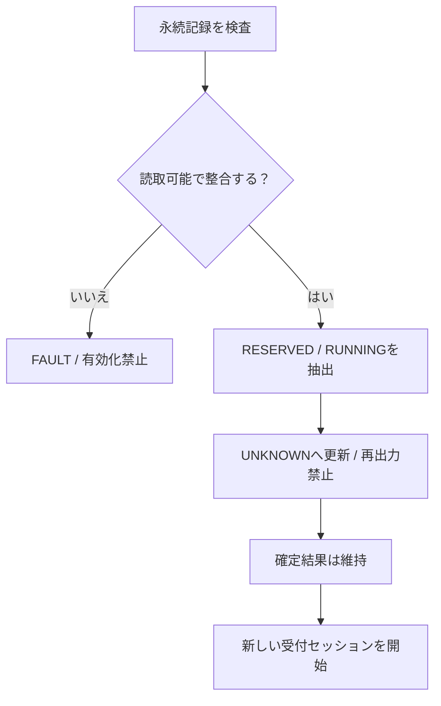

保存期間を過ぎたIDも古いセッションから再実行できない契約にする。再起動後の自動再試行は禁止し、新しい操作は状態を確認した人の明示要求とする。

<a id="dd-fn-11"></a>

#### 3.7.11 stop（新規受付を止めて解除）

| 項目 | 内容 |
| --- | --- |
| 所属・入力 | PulseSequencer / 停止期限。 |
| 出力 | 停止結果。 |

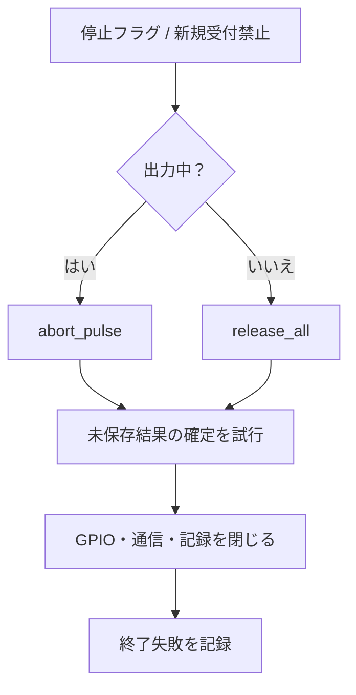

停止期限が来ても解除失敗を正常完了に置換しない。強制終了や電源断に対する非動作状態は外部回路で検証する。

<a id="dd-4"></a>

## 4. インターフェース設計


<a id="dd-interface"></a>

### 4.1 接続図

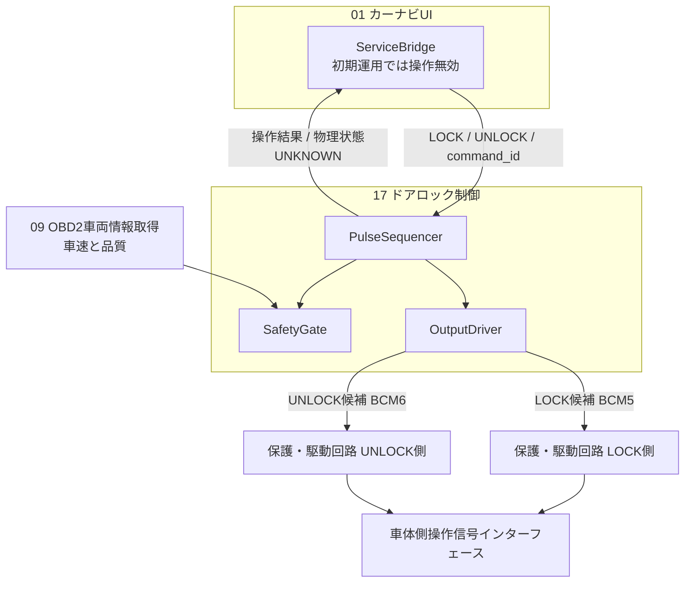

| I/F | 内容 | 制約 |
| --- | --- | --- |
| UI操作 | 明示操作、command_id、schema_version、操作名、期限 | 初期リリースでは無効。入力から任意ピンを指定不可。 |
| 車両条件 | speed_mps、speed_validity、speed_age_ms、元観測時刻、source | 欠測を0m/sに変換しない。期限切れ・UNKNOWN・範囲外は拒否する。 |
| LOCK出力 | BCM5 / 物理29を候補 | HW記載と一致する候補。極性・回路確定後に有効化。 |
| UNLOCK出力 | BCM6 / 物理31を候補 | 同上。LOCKとの同時動作は禁止。 |
| 結果照会 | 既存command_idの結果 | 参照だけでパルスを再実行しない。 |

<a id="dd-command-contract"></a>

### 4.2 コマンドと結果

| 項目 | 設計 |
| --- | --- |
| 要求 | command_id、caller（通信側が確認）、session_id、operation、schema_version、期限。 |
| 許可操作 | LOCK / UNLOCK。任意コマンド・GPIO番号・出力保持時間を受け付けない。 |
| 重複 | 同じcaller+command_idで同内容なら既知結果、異内容ならID_CONFLICT。 |
| 状態 | REJECTED / ACCEPTED / RUNNING / PULSE_COMPLETED / FAILED / UNKNOWN。 |
| 共通応答との対応 | 共通仕様のSUCCEEDEDへ対応させる場合はoperation_result=PULSE_COMPLETEDを併記し、lock_state=UNKNOWNを維持。 |
| 拒否理由例 | DISABLED、EXPIRED、UNAUTHORIZED、BUSY、STALE_SPEED、UNKNOWN_SPEED、NOT_STOPPED、DRIVER_FAULT。 |
| 不明 | 途中停止・解除失敗・結果保存失敗等で出力の成立を確定できない状態。自動再送しない。 |

実施錠状態のフィードバックは未設計。出力完了をLOCKED/UNLOCKEDとしてUIへ返さない。信頼されたローカルIPCを候補とし、インターネットへ操作APIを公開しない。

<a id="dd-replay"></a>

### 4.3 期限・再起動・重複の契約

要求の期限はサーバー側で検証できる時刻に限定する。異なるホストの単調時計値をそのまま比較しない。車載内IPCで使用する時計・セッション・許容通信遅延を確定し、確認できない期限を持つ要求は拒否する。
パルス実行の期限は受理後のローカル単調時計で管理し、通信が途切れても動作時間を延長しない。

実行前記録は出力前に永続化する。予約後に停止して実際に出力されたか不明な場合はUNKNOWNとし、同じIDを再実行しない。これは厳密に1回だけ実行された保証ではなく、結果不明時の再操作を避ける設計である。
旧セッションの新規実行要求は拒否する。記録保持期間は最大要求寿命と照会期間を上回るよう確定し、記録を消した古い要求が新規として再実行されないようにする。

<a id="dd-5"></a>

## 5. データ・設定設計


<a id="dd-data"></a>

### 5.1 保持するデータ

| データ | 内容・寿命 |
| --- | --- |
| Command | 操作元、ID、操作、受付セッション、期限、内容指紋。受付後は不変。 |
| SafetySnapshot | 車速・品質・元観測時刻、運用許可、設定世代、判定理由。キャッシュ再配信で寿命を延ばさない。 |
| Execution | 対象要求、開始時刻、pulse_deadline、state、解除結果。RAM上で1件だけ。 |
| ResultRecord | RESERVED/RUNNING/完了段階、出力開始終了、理由、物理状態UNKNOWN。永続化。 |
| DriverState | ハンドル、指示レベル、opened、fault。物理接点状態とは別。 |
| ServiceState | DISABLED/IDLE/PULSING_LOCK/PULSING_UNLOCK/COOLDOWN/FAULT/STOPPING、boot_id、session_id。 |

<a id="dd-config"></a>

### 5.2 設定項目

| 設定 | 初期値・条件 | 不正時 |
| --- | --- | --- |
| enabled | false。検証と運用承認後だけ変更 | DISABLED |
| lock_gpio / unlock_gpio | BCM5 / BCM6は候補。別々の確認済みピン | 出力を取得しない |
| active_level / release_level | 回路による。推測でHIGH/LOWを固定しない | 有効化禁止 |
| pulse_ms / max_pulse_ms | 0 < pulse_ms <= max_pulse_msを検証。実値T.B.D | 有効化禁止 |
| cooldown_ms | 操作後に新規操作を拒否する期間。T.B.D | 有効化禁止 |
| speed_max_age_ms / stopped_threshold / stopped_confirm_ms | 車速の有効期間・停車判定値・継続時間。実測で確定 | 操作禁止 |
| condition_poll_ms / output_release_limit_ms | 条件再確認間隔と解除許容時間。外部回路を含め測定 | 受入未完了 |
| allowed_callers / session / command_ttl_max | 要求元・セッション・寿命上限 | 要求拒否 |
| result_store / retention | 永続記録先、整合確認、保持期間 | 記録不良時はFAULT |

未確定値に仮の0や最大整数を与えて動作させない。設定変更は出力中に適用せず、解除してから再検証する。初期UIからenabledを変更する経路は提供しない。

<a id="dd-6"></a>

## 6. 処理・状態遷移

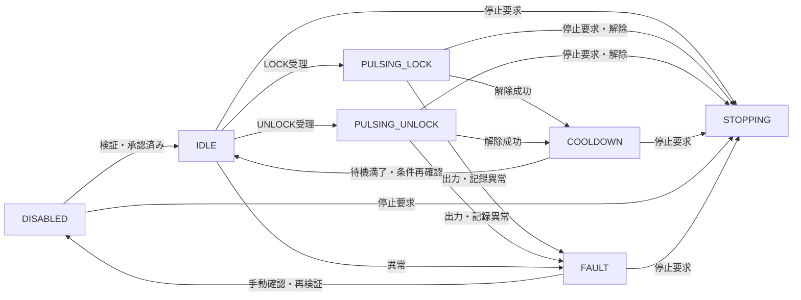

| 状態 | 新規操作 | 出力と遷移条件 |
| --- | --- | --- |
| DISABLED | 拒否 | 未初期化GPIOは触らない。外部回路で非動作を保つ。既に取得済みなら解除。 |
| IDLE | 全条件成立時のみ | 両側の動作指示なし。 |
| PULSING_* | 別要求は拒否 | 片側だけ。期限・条件変化・停止で解除。 |
| COOLDOWN | 拒否 | 両側解除を維持。解除成功時刻を基準に待機。 |
| FAULT | 拒否 | 解除を試行。不明を正常と扱わず自動で有効へ戻さない。 |
| STOPPING | 拒否 | 出力を解除し、結果記録後に資源を閉じる。 |

単なる通信断では既に開始したパルスのローカル期限は継続する。運用許可が期限付きで失効した場合は別途中断する。どちらの場合も自動解錠や反対側パルスは出さない。

<a id="dd-7"></a>

## 7. 異常処理

| 異常 | 処理 | 結果 |
| --- | --- | --- |
| 車速不明・古い・走行中 | 出力前は拒否、出力中は解除して中断 | REJECTEDまたはFAILED |
| ID重複・再送 | 既知結果を返す。内容違いは拒否 | 再出力なし |
| 実行中に逆方向要求 | 待機キューに入れず拒否 | BUSY |
| 片側解除の例外 | もう片側も解除試行しFAULT | UNKNOWN |
| GPIO使用競合・初期化失敗 | 新規操作禁止、取得済み側は解除試行 | FAULT |
| 出力開始後の保存失敗 | 解除を優先し、新規操作禁止 | UNKNOWN |
| 実行前記録の保存失敗 | 出力しない | FAULT |
| プロセス強制終了・電源断 | ソフトのfinallyだけには頼れない。外部非動作・時間制限を検証 | 次回起動で未完了UNKNOWN |
| UI応答待ち切れ | 同じIDの結果照会だけ行う | 新IDの自動再試行は禁止 |
| 結果通知の通信断 | 保存済み結果を後で照会可能にする | 出力時間を延長しない |

ソフトの例外処理だけではSIGKILL、OS停止、GPIO APIの停止を覆えない。外部回路の既定解除とパルス上限が未検証なら実車機能を有効化しない。

<a id="dd-8"></a>

## 8. 起動・終了・運用設計

初期設定ではサービスの出力を無効化し、UI操作も有効化しない。`enabled=false`の間は候補GPIOを取得しない。実装済みのdry-runでは代替ドライバを使用して、条件判定・パルス排他・重複防止を試験できる。
有効化の前提は車体操作線と極性の確認、保護・駆動回路の受入、GPIO割当の確定、車速と操作条件の検証、パルス上限の確認である。

実装する場合、起動は設定確認→実行記録照合→新規セッション→非動作レベルでGPIO取得→両側解除→IDLEの順。前回未完了や記録不良は運用者の確認を要求し、自動再操作しない。
出力処理は1つの管理経路へ限定し、停止要求は新規受付より優先する。GPIOと永続記録に必要な最小権限だけを与える。

試験・操作は停車中に行い、乗員が機械的に解錠できる純正機能を妨げないことを回路側で確認する。ログはcommand_id、方向、判定理由、開始終了・解除API結果とセッションを記録し、認証情報を出さない。

<a id="dd-9"></a>

## 9. 試験・受入条件

| ID | 対象 | 試験条件 | 期待結果 |
| --- | --- | --- | --- |
| L-T01 | LOCK-01・02 | 初期enabled=false、設定欠落 | GPIOを取得・動作させない。DISABLED。 |
| L-T02 | LOCK-01 | 未知操作・期限切れ・未許可元 | REJECTED。OutputDriver呼出しなし。 |
| L-T03 | LOCK-02 | 車速UNKNOWN/STALE/不正値 | 停車とみなさず拒否。 |
| L-T04 | LOCK-02 | 有効車速0でも運用許可なし | 拒否。条件はAND。 |
| L-T05 | LOCK-03 | LOCK/UNLOCK正常操作を個別実行 | 対象側だけ規定時間出力、最後は両側解除。 |
| L-T06 | LOCK-03・04 | 異方向要求を同時に多数投入 | 同時出力なし。受理最大1件、他は拒否。 |
| L-T07 | LOCK-04 | 同じIDの再送・異なる内容で再送 | 再出力なし、異内容はID_CONFLICT。 |
| L-T08 | LOCK-04 | COOLDOWN中の要求 | 拒否し、期間終了後にも遅延実行しない。 |
| L-T09 | LOCK-05 | 出力中に車速期限切れ・停止要求 | 許容解除時間内に両側解除、中断結果。 |
| L-T10 | LOCK-05 | LOCK解除APIに例外を注入 | UNLOCK解除も試み、FAULT/UNKNOWN。 |
| L-T11 | LOCK-06 | 予約後・出力後・結果保存前に終了 | 再起動時UNKNOWN、同じIDを再実行しない。 |
| L-T12 | LOCK-03・05 | DB書込失敗・応答遅延 | 開始前失敗は無出力、開始後は解除優先でFAULT。 |
| L-T13 | LOCK-05 | SIGKILL・OS停止・給電断 | 外部回路を含め規定上限内で解除。ソフトログだけで判定しない。 |
| L-T14 | LOCK-03 | 物理状態フィードバックなし | PULSE_COMPLETEDでも実施錠状態UNKNOWN。 |
| L-T15 | LOCK-06 | 旧セッション要求・履歴保持期限超過 | 古い要求を新規操作として再実行しない。 |
| L-T16 | LOCK-05 | 通信断中に出力開始済み | ローカル期限で解除し、反対方向の操作なし。 |

未実施の試験計画。代替GPIOドライバ→車体から外した回路→停車中の実車確認の順で進める。電気条件・時間上限・操作条件がT.B.Dの間は受入完了としない。

<a id="dd-10"></a>

## 10. 未確定事項・実装課題

| 項目 | 確定・検証する内容 |
| --- | --- |
| 車体インターフェース | L880Kの操作線・極性・制御装置との関係。アクチュエータ駆動線への直接接続はしない。 |
| 回路 | 絶縁、逆流・サージ、起動時非動作、外部時間制限、接点故障時の扱い。 |
| GPIO | BCM5 / BCM6の他用途との競合、Pi 5対応API、初期取得時の端子状態。 |
| 操作条件 | 停車判定、許可の発行者、期限、車速取得不能時の運用。未取得を許可へ倒さない。 |
| 時間 | パルス幅・上限・再操作待機・監視周期・解除上限。 |
| 重複防止 | 永続記録方式、寿命・保持期間、旧セッション拒否と手動回復。 |
| フィードバック | 実施錠状態を取得するか。未取得なら常に不明として表示。 |
| UI | 初期無効から有効化する際の操作確認と結果表示。 |

<a id="dd-notes"></a>

## 用語の注釈

| 用語 | 意味 |
| --- | --- |
| 排他 | 同時に1つの要求だけに出力操作を許すこと。 |
| インターロック | 条件未成立や反対側動作中に出力を禁止する仕組み。 |
| COOLDOWN | 1回の操作後、次の操作を受け付けない期間。 |
| 実行前記録 | 出力より先に要求IDを保存し、途中停止後の重複操作を防ぐ記録。 |
| PULSE_COMPLETED | 短時間信号の出力処理が終わった状態。実際の施錠完了ではない。 |
| UNKNOWN | 結果や観測が確認できない状態。成功でも安全でもない。 |
